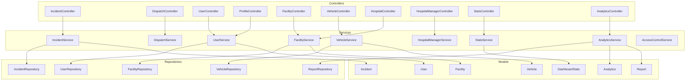
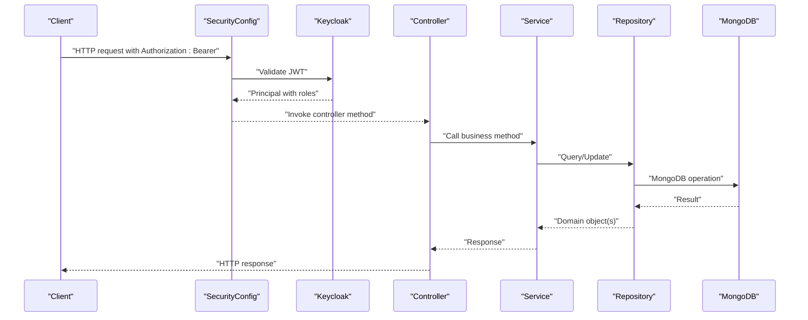
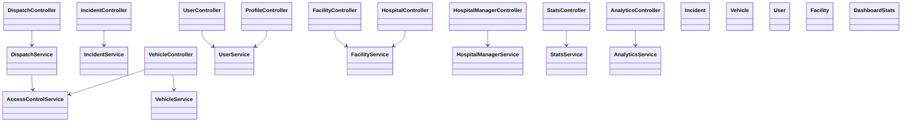

# API Reference

<cite>
**Referenced Files in This Document**
- [EmsCommandCenterApplication.java](file://src/main/java/com/example/ems_command_center/EmsCommandCenterApplication.java)
- [application.yml](file://src/main/resources/application.yml)
- [SecurityConfig.java](file://src/main/java/com/example/ems_command_center/config/SecurityConfig.java)
- [ApiExceptionHandler.java](file://src/main/java/com/example/ems_command_center/config/ApiExceptionHandler.java)
- [KeycloakJwtAuthenticationConverter.java](file://src/main/java/com/example/ems_command_center/config/KeycloakJwtAuthenticationConverter.java)
- [WebSocketConfig.java](file://src/main/java/com/example/ems_command_center/config/WebSocketConfig.java)
- [IncidentController.java](file://src/main/java/com/example/ems_command_center/controller/IncidentController.java)
- [Incident.java](file://src/main/java/com/example/ems_command_center/model/Incident.java)
- [IncidentService.java](file://src/main/java/com/example/ems_command_center/service/IncidentService.java)
- [IncidentRepository.java](file://src/main/java/com/example/ems_command_center/repository/IncidentRepository.java)
- [DispatchController.java](file://src/main/java/com/example/ems_command_center/controller/DispatchController.java)
- [DispatchService.java](file://src/main/java/com/example/ems_command_center/service/DispatchService.java)
- [DispatchRequest.java](file://src/main/java/com/example/ems_command_center/model/DispatchRequest.java)
- [AmbulanceRouteResponse.java](file://src/main/java/com/example/ems_command_center/model/AmbulanceRouteResponse.java)
- [DispatchAssignmentResponse.java](file://src/main/java/com/example/ems_command_center/model/DispatchAssignmentResponse.java)
- [UserController.java](file://src/main/java/com/example/ems_command_center/controller/UserController.java)
- [User.java](file://src/main/java/com/example/ems_command_center/model/User.java)
- [UserService.java](file://src/main/java/com/example/ems_command_center/service/UserService.java)
- [UserRepository.java](file://src/main/java/com/example/ems_command_center/repository/UserRepository.java)
- [ProfileController.java](file://src/main/java/com/example/ems_command_center/controller/ProfileController.java)
- [AuthenticatedUser.java](file://src/main/java/com/example/ems_command_center/model/AuthenticatedUser.java)
- [FacilityController.java](file://src/main/java/com/example/ems_command_center/controller/FacilityController.java)
- [Facility.java](file://src/main/java/com/example/ems_command_center/model/Facility.java)
- [FacilityService.java](file://src/main/java/com/example/ems_command_center/service/FacilityService.java)
- [FacilityRepository.java](file://src/main/java/com/example/ems_command_center/repository/FacilityRepository.java)
- [VehicleController.java](file://src/main/java/com/example/ems_command_center/controller/VehicleController.java)
- [Vehicle.java](file://src/main/java/com/example/ems_command_center/model/Vehicle.java)
- [VehicleService.java](file://src/main/java/com/example/ems_command_center/service/VehicleService.java)
- [VehicleRepository.java](file://src/main/java/com/example/ems_command_center/repository/VehicleRepository.java)
- [HospitalController.java](file://src/main/java/com/example/ems_command_center/controller/HospitalController.java)
- [HospitalManagerController.java](file://src/main/java/com/example/ems_command_center/controller/HospitalManagerController.java)
- [HospitalManagerService.java](file://src/main/java/com/example/ems_command_center/service/HospitalManagerService.java)
- [HospitalPatient.java](file://src/main/java/com/example/ems_command_center/model/HospitalPatient.java)
- [BedAvailability.java](file://src/main/java/com/example/ems_command_center/model/BedAvailability.java)
- [MedicalResource.java](file://src/main/java/com/example/ems_command_center/model/MedicalResource.java)
- [HospitalManagerOverview.java](file://src/main/java/com/example/ems_command_center/model/HospitalManagerOverview.java)
- [StatsController.java](file://src/main/java/com/example/ems_command_center/controller/StatsController.java)
- [DashboardStats.java](file://src/main/java/com/example/ems_command_center/model/DashboardStats.java)
- [StatsService.java](file://src/main/java/com/example/ems_command_center/service/StatsService.java)
- [AnalyticsController.java](file://src/main/java/com/example/ems_command_center/controller/AnalyticsController.java)
- [AnalyticsService.java](file://src/main/java/com/example/ems_command_center/service/AnalyticsService.java)
- [Analytics.java](file://src/main/java/com/example/ems_command_center/model/Analytics.java)
- [Report.java](file://src/main/java/com/example/ems_command_center/model/Report.java)
- [ReportService.java](file://src/main/java/com/example/ems_command_center/service/ReportService.java)
- [ReportRepository.java](file://src/main/java/com/example/ems_command_center/repository/ReportRepository.java)
- [AccessControlService.java](file://src/main/java/com/example/ems_command_center/service/AccessControlService.java)
</cite>

## Table of Contents
1. [Introduction](#introduction)
2. [Project Structure](#project-structure)
3. [Core Components](#core-components)
4. [Architecture Overview](#architecture-overview)
5. [Detailed Component Analysis](#detailed-component-analysis)
6. [Dependency Analysis](#dependency-analysis)
7. [Performance Considerations](#performance-considerations)
8. [Troubleshooting Guide](#troubleshooting-guide)
9. [Conclusion](#conclusion)
10. [Appendices](#appendices)

## Introduction
This document provides a comprehensive API reference for the EMS Command Center application. It covers all REST endpoints grouped by functional areas: incident management, dispatch coordination, user and profile management, facilities and hospitals, fleet and vehicle tracking, analytics and reporting, and dashboard statistics. For each endpoint, you will find HTTP methods, URL patterns, request/response schemas, authentication and authorization requirements, parameter descriptions, validation rules, and example requests/responses. Additionally, it includes error response formats, typical HTTP status codes, and practical testing examples using curl and Postman.

## Project Structure
The application follows a Spring Boot layered architecture with controllers, services, repositories, models, and configuration classes. Controllers expose REST endpoints under the base path /api. Authentication is handled via OAuth 2.0/OIDC with Keycloak, and authorization is enforced using method-level security annotations. Data persistence uses MongoDB documents mapped to model records/classes.

**Diagram sources**
- [IncidentController.java:14-60](file://src/main/java/com/example/ems_command_center/controller/IncidentController.java#L14-L60)
- [DispatchController.java:22-56](file://src/main/java/com/example/ems_command_center/controller/DispatchController.java#L22-L56)
- [UserController.java:17-91](file://src/main/java/com/example/ems_command_center/controller/UserController.java#L17-L91)
- [ProfileController.java:17-45](file://src/main/java/com/example/ems_command_center/controller/ProfileController.java#L17-L45)
- [FacilityController.java:13-30](file://src/main/java/com/example/ems_command_center/controller/FacilityController.java#L13-L30)
- [VehicleController.java:14-56](file://src/main/java/com/example/ems_command_center/controller/VehicleController.java#L14-L56)
- [HospitalController.java:14-56](file://src/main/java/com/example/ems_command_center/controller/HospitalController.java#L14-L56)
- [HospitalManagerController.java:16-62](file://src/main/java/com/example/ems_command_center/controller/HospitalManagerController.java#L16-L62)
- [StatsController.java:11-28](file://src/main/java/com/example/ems_command_center/controller/StatsController.java#L11-L28)
- [AnalyticsController.java:13-37](file://src/main/java/com/example/ems_command_center/controller/AnalyticsController.java#L13-L37)
- [IncidentService.java](file://src/main/java/com/example/ems_command_center/service/IncidentService.java)
- [DispatchService.java](file://src/main/java/com/example/ems_command_center/service/DispatchService.java)
- [UserService.java](file://src/main/java/com/example/ems_command_center/service/UserService.java)
- [FacilityService.java](file://src/main/java/com/example/ems_command_center/service/FacilityService.java)
- [VehicleService.java](file://src/main/java/com/example/ems_command_center/service/VehicleService.java)
- [HospitalManagerService.java](file://src/main/java/com/example/ems_command_center/service/HospitalManagerService.java)
- [StatsService.java](file://src/main/java/com/example/ems_command_center/service/StatsService.java)
- [AnalyticsService.java](file://src/main/java/com/example/ems_command_center/service/AnalyticsService.java)
- [AccessControlService.java](file://src/main/java/com/example/ems_command_center/service/AccessControlService.java)
- [Incident.java:8-23](file://src/main/java/com/example/ems_command_center/model/Incident.java#L8-L23)
- [Vehicle.java:7-18](file://src/main/java/com/example/ems_command_center/model/Vehicle.java#L7-L18)
- [User.java:7-51](file://src/main/java/com/example/ems_command_center/model/User.java#L7-L51)
- [Facility.java:7-26](file://src/main/java/com/example/ems_command_center/model/Facility.java#L7-L26)
- [DashboardStats.java:6-13](file://src/main/java/com/example/ems_command_center/model/DashboardStats.java#L6-L13)
- [Analytics.java](file://src/main/java/com/example/ems_command_center/model/Analytics.java)
- [Report.java](file://src/main/java/com/example/ems_command_center/model/Report.java)

**Section sources**
- [EmsCommandCenterApplication.java](file://src/main/java/com/example/ems_command_center/EmsCommandCenterApplication.java)
- [application.yml](file://src/main/resources/application.yml)

## Core Components
- Authentication and Authorization: OAuth 2.0/OIDC via Keycloak. JWT tokens are converted to Spring Security authentication objects. Method-level @PreAuthorize checks enforce role-based access.
- Data Persistence: MongoDB documents mapped to immutable records (e.g., Incident, Vehicle, Facility) and mutable entities (e.g., User). Repositories provide CRUD operations.
- Services: Business logic orchestration, including dispatch routing, analytics aggregation, and hospital manager workflows.
- Controllers: REST endpoints grouped by domain (Incidents, Dispatch, Users, Facilities, Vehicles, Hospitals, Hospital Manager, Stats, Analytics).

**Section sources**
- [SecurityConfig.java](file://src/main/java/com/example/ems_command_center/config/SecurityConfig.java)
- [KeycloakJwtAuthenticationConverter.java](file://src/main/java/com/example/ems_command_center/config/KeycloakJwtAuthenticationConverter.java)
- [ApiExceptionHandler.java](file://src/main/java/com/example/ems_command_center/config/ApiExceptionHandler.java)

## Architecture Overview
The system integrates OAuth 2.0/OIDC for identity and authorization, with controllers exposing REST endpoints secured by method-level annotations. Services encapsulate business logic and coordinate with repositories for data access. Models define request/response schemas and document structures.

**Diagram sources**
- [SecurityConfig.java](file://src/main/java/com/example/ems_command_center/config/SecurityConfig.java)
- [KeycloakJwtAuthenticationConverter.java](file://src/main/java/com/example/ems_command_center/config/KeycloakJwtAuthenticationConverter.java)
- [IncidentController.java:14-60](file://src/main/java/com/example/ems_command_center/controller/IncidentController.java#L14-L60)
- [IncidentService.java](file://src/main/java/com/example/ems_command_center/service/IncidentService.java)
- [IncidentRepository.java](file://src/main/java/com/example/ems_command_center/repository/IncidentRepository.java)

## Detailed Component Analysis

### Authentication and Authorization
- Base Path: /api
- Authentication Scheme: Authorization: Bearer <JWT>
- Authorization: @PreAuthorize expressions per endpoint
- Roles: ADMIN, MANAGER, DRIVER, USER
- Claims Used: sub (keycloakId), email, given_name, family_name, roles, hospital_id, ambulance_id

Common scenarios:
- isAuthenticated(): Any authenticated user
- hasAnyRole('ADMIN','MANAGER','DRIVER','USER'): Public read endpoints
- hasRole('ADMIN'): Administrative write operations
- hasRole('MANAGER'): Manager operations
- hasRole('DRIVER'): Driver-specific operations with additional checks

Example curl:
- curl -H "Authorization: Bearer $TOKEN" https://ems.example.com/api/profile

**Section sources**
- [ProfileController.java:22-44](file://src/main/java/com/example/ems_command_center/controller/ProfileController.java#L22-L44)
- [UserController.java:72-90](file://src/main/java/com/example/ems_command_center/controller/UserController.java#L72-L90)
- [SecurityConfig.java](file://src/main/java/com/example/ems_command_center/config/SecurityConfig.java)
- [KeycloakJwtAuthenticationConverter.java](file://src/main/java/com/example/ems_command_center/config/KeycloakJwtAuthenticationConverter.java)

### Incident Management
Endpoints:
- GET /api/incidents
  - Description: Fetch all incidents sorted by priority
  - Auth: hasAnyRole('ADMIN','MANAGER','USER','DRIVER')
  - Response: Array of Incident
  - Example curl: curl -H "Authorization: Bearer $TOKEN" https://ems.example.com/api/incidents

- GET /api/incidents/by-id/{id}
  - Description: Fetch a single incident by id
  - Auth: hasAnyRole('ADMIN','MANAGER','USER','DRIVER')
  - Path: id (string)
  - Response: Incident
  - Example curl: curl -H "Authorization: Bearer $TOKEN" https://ems.example.com/api/incidents/by-id/INC001

- POST /api/incidents
  - Description: Report a new incident
  - Auth: hasAnyRole('ADMIN','MANAGER','USER','DRIVER')
  - Request: Incident
  - Response: Incident (201 Created)
  - Example curl: curl -X POST -H "Authorization: Bearer $TOKEN" -H "Content-Type: application/json" -d '{}' https://ems.example.com/api/incidents

- PUT /api/incidents/{id}
  - Description: Update an existing incident
  - Auth: hasAnyRole('ADMIN','MANAGER')
  - Path: id (string)
  - Request: Incident
  - Response: Incident
  - Example curl: curl -X PUT -H "Authorization: Bearer $TOKEN" -H "Content-Type: application/json" -d '{}' https://ems.example.com/api/incidents/INC001

- DELETE /api/incidents/{id}
  - Description: Delete an incident
  - Auth: hasAnyRole('ADMIN','MANAGER')
  - Path: id (string)
  - Response: 204 No Content
  - Example curl: curl -X DELETE -H "Authorization: Bearer $TOKEN" https://ems.example.com/api/incidents/INC001

Request/Response Schemas:
- Incident
  - Fields: id, title, location, coordinates, time, reporter (User), type, tags, status, priority
  - Validation: Non-empty id on update; type constrained to "urgent"|"normal"; status and priority as applicable

Notes:
- Creation returns 201; updates return 200; deletion returns 204.

**Section sources**
- [IncidentController.java:25-60](file://src/main/java/com/example/ems_command_center/controller/IncidentController.java#L25-L60)
- [Incident.java:8-23](file://src/main/java/com/example/ems_command_center/model/Incident.java#L8-L23)
- [IncidentService.java](file://src/main/java/com/example/ems_command_center/service/IncidentService.java)
- [IncidentRepository.java](file://src/main/java/com/example/ems_command_center/repository/IncidentRepository.java)

### Dispatch Coordination
Endpoints:
- GET /api/dispatch/ambulances/available
  - Description: List all available ambulances
  - Auth: hasAnyRole('ADMIN','MANAGER','DRIVER')
  - Response: Array of Vehicle
  - Example curl: curl -H "Authorization: Bearer $TOKEN" https://ems.example.com/api/dispatch/ambulances/available

- GET /api/dispatch/routes?vehicleId={id}&incidentId={id}
  - Description: Preview the suggested route from an ambulance to an incident
  - Auth: hasAnyRole('ADMIN','MANAGER') or (hasRole('DRIVER') and isAssignedAmbulance(vehicleId))
  - Query: vehicleId (string), incidentId (string)
  - Response: AmbulanceRouteResponse
  - Example curl: curl -H "Authorization: Bearer $TOKEN" "https://ems.example.com/api/dispatch/routes?vehicleId=V001&incidentId=INC001"

- POST /api/dispatch/assignments
  - Description: Dispatch an ambulance to an incident
  - Auth: hasAnyRole('ADMIN','MANAGER')
  - Request: DispatchRequest
  - Response: DispatchAssignmentResponse (201 Created)
  - Example curl: curl -X POST -H "Authorization: Bearer $TOKEN" -H "Content-Type: application/json" -d '{}' https://ems.example.com/api/dispatch/assignments

Validation Rules:
- vehicleId and incidentId required for route preview
- Driver can only access assigned ambulance routes

**Section sources**
- [DispatchController.java:33-55](file://src/main/java/com/example/ems_command_center/controller/DispatchController.java#L33-L55)
- [DispatchService.java](file://src/main/java/com/example/ems_command_center/service/DispatchService.java)
- [DispatchRequest.java](file://src/main/java/com/example/ems_command_center/model/DispatchRequest.java)
- [AmbulanceRouteResponse.java](file://src/main/java/com/example/ems_command_center/model/AmbulanceRouteResponse.java)
- [DispatchAssignmentResponse.java](file://src/main/java/com/example/ems_command_center/model/DispatchAssignmentResponse.java)
- [AccessControlService.java](file://src/main/java/com/example/ems_command_center/service/AccessControlService.java)

### User Management and Profile
Endpoints:
- GET /api/users
  - Description: List all users
  - Auth: hasAnyRole('ADMIN','MANAGER')
  - Response: Array of User
  - Example curl: curl -H "Authorization: Bearer $TOKEN" https://ems.example.com/api/users

- GET /api/users/{id}
  - Description: Get user by ID
  - Auth: hasAnyRole('ADMIN','MANAGER')
  - Path: id (string)
  - Response: User
  - Example curl: curl -H "Authorization: Bearer $TOKEN" https://ems.example.com/api/users/u001

- GET /api/users/role/{role}
  - Description: Get users by role
  - Auth: hasAnyRole('ADMIN','MANAGER')
  - Path: role (string)
  - Response: Array of User
  - Example curl: curl -H "Authorization: Bearer $TOKEN" https://ems.example.com/api/users/role/DRIVER

- POST /api/users
  - Description: Create a new user
  - Auth: hasRole('ADMIN')
  - Request: User
  - Response: User (201 Created)
  - Example curl: curl -X POST -H "Authorization: Bearer $TOKEN" -H "Content-Type: application/json" -d '{}' https://ems.example.com/api/users

- PUT /api/users/{id}
  - Description: Update an existing user
  - Auth: hasRole('ADMIN')
  - Path: id (string)
  - Request: User
  - Response: User
  - Example curl: curl -X PUT -H "Authorization: Bearer $TOKEN" -H "Content-Type: application/json" -d '{}' https://ems.example.com/api/users/u001

- DELETE /api/users/{id}
  - Description: Delete a user
  - Auth: hasRole('ADMIN')
  - Path: id (string)
  - Response: 204 No Content
  - Example curl: curl -X DELETE -H "Authorization: Bearer $TOKEN" https://ems.example.com/api/users/u001

- GET /api/users/me
  - Description: Get current user's profile
  - Auth: isAuthenticated()
  - Response: User
  - Example curl: curl -H "Authorization: Bearer $TOKEN" https://ems.example.com/api/users/me

- GET /api/users/me/assignment
  - Description: Get current driver's assignment and statistics
  - Auth: hasRole('DRIVER')
  - Response: DriverAssignment
  - Example curl: curl -H "Authorization: Bearer $TOKEN" https://ems.example.com/api/users/me/assignment

Request/Response Schemas:
- User
  - Fields: id, name, email, phone, location, joined, specialization, role, status, statusType, iconName, color, stats, ambulanceId, hospitalId, keycloakId
  - Validation: Role constrained to USER|ADMIN|DRIVER|MANAGER; keycloakId must match authenticated subject

Driver Assignment:
- Access controlled by AccessControlService.isAssignedAmbulance(vehicleId)

**Section sources**
- [UserController.java:28-90](file://src/main/java/com/example/ems_command_center/controller/UserController.java#L28-L90)
- [User.java:7-51](file://src/main/java/com/example/ems_command_center/model/User.java#L7-L51)
- [UserService.java](file://src/main/java/com/example/ems_command_center/service/UserService.java)
- [UserRepository.java](file://src/main/java/com/example/ems_command_center/repository/UserRepository.java)
- [AccessControlService.java](file://src/main/java/com/example/ems_command_center/service/AccessControlService.java)

### Profile Endpoint
- GET /api/profile
  - Description: Retrieve the authenticated Keycloak user profile
  - Auth: isAuthenticated()
  - Response: AuthenticatedUser with email, name, roles, claims
  - Example curl: curl -H "Authorization: Bearer $TOKEN" https://ems.example.com/api/profile

Response Schema:
- AuthenticatedUser
  - Fields: name, keycloakId, email, given_name, family_name, roles[], hospital_id, ambulance_id

**Section sources**
- [ProfileController.java:22-44](file://src/main/java/com/example/ems_command_center/controller/ProfileController.java#L22-L44)
- [AuthenticatedUser.java](file://src/main/java/com/example/ems_command_center/model/AuthenticatedUser.java)

### Facilities Overview
- GET /api/facilities
  - Description: Fetch all emergency facilities
  - Auth: hasAnyRole('ADMIN','MANAGER','DRIVER','USER')
  - Response: Array of Facility
  - Example curl: curl -H "Authorization: Bearer $TOKEN" https://ems.example.com/api/facilities

**Section sources**
- [FacilityController.java:24-29](file://src/main/java/com/example/ems_command_center/controller/FacilityController.java#L24-L29)
- [Facility.java:7-26](file://src/main/java/com/example/ems_command_center/model/Facility.java#L7-L26)
- [FacilityService.java](file://src/main/java/com/example/ems_command_center/service/FacilityService.java)
- [FacilityRepository.java](file://src/main/java/com/example/ems_command_center/repository/FacilityRepository.java)

### Hospitals (CRUD)
- GET /api/hospitals
  - Description: Fetch all hospitals with ICU and wait-time details
  - Auth: hasAnyRole('ADMIN','MANAGER','DRIVER','USER')
  - Response: Array of Facility
  - Example curl: curl -H "Authorization: Bearer $TOKEN" https://ems.example.com/api/hospitals

- POST /api/hospitals
  - Description: Add a new hospital
  - Auth: hasAnyRole('ADMIN','MANAGER')
  - Request: Facility (hospital-specific fields included)
  - Response: Facility (201 Created)
  - Example curl: curl -X POST -H "Authorization: Bearer $TOKEN" -H "Content-Type: application/json" -d '{}' https://ems.example.com/api/hospitals

- PUT /api/hospitals/{id}
  - Description: Update hospital details or status
  - Auth: hasAnyRole('ADMIN','MANAGER')
  - Path: id (string)
  - Request: Facility
  - Response: Facility
  - Example curl: curl -X PUT -H "Authorization: Bearer $TOKEN" -H "Content-Type: application/json" -d '{}' https://ems.example.com/api/hospitals/H001

- DELETE /api/hospitals/{id}
  - Description: Remove a hospital
  - Auth: hasRole('ADMIN')
  - Path: id (string)
  - Response: 204 No Content
  - Example curl: curl -X DELETE -H "Authorization: Bearer $TOKEN" https://ems.example.com/api/hospitals/H001

**Section sources**
- [HospitalController.java:25-55](file://src/main/java/com/example/ems_command_center/controller/HospitalController.java#L25-L55)
- [Facility.java:7-26](file://src/main/java/com/example/ems_command_center/model/Facility.java#L7-L26)
- [FacilityService.java](file://src/main/java/com/example/ems_command_center/service/FacilityService.java)

### Hospital Manager Operations
- GET /api/hospital-manager/overview
  - Description: Fetch emergencies, patient dossiers, staff, beds, and medical resources
  - Auth: hasAnyRole('ADMIN','MANAGER')
  - Response: HospitalManagerOverview
  - Example curl: curl -H "Authorization: Bearer $TOKEN" https://ems.example.com/api/hospital-manager/overview

- PUT /api/hospital-manager/patients/{id}
  - Description: Update patient state or dossier details
  - Auth: hasAnyRole('ADMIN','MANAGER')
  - Path: id (string)
  - Request: HospitalPatient
  - Response: HospitalPatient
  - Example curl: curl -X PUT -H "Authorization: Bearer $TOKEN" -H "Content-Type: application/json" -d '{}' https://ems.example.com/api/hospital-manager/patients/P001

- PUT /api/hospital-manager/beds/{id}
  - Description: Update bed availability in a ward
  - Auth: hasAnyRole('ADMIN','MANAGER')
  - Path: id (string)
  - Request: BedAvailability
  - Response: BedAvailability
  - Example curl: curl -X PUT -H "Authorization: Bearer $TOKEN" -H "Content-Type: application/json" -d '{}' https://ems.example.com/api/hospital-manager/beds/B001

- PUT /api/hospital-manager/resources/{id}
  - Description: Update the availability of a medical resource
  - Auth: hasAnyRole('ADMIN','MANAGER')
  - Path: id (string)
  - Request: MedicalResource
  - Response: MedicalResource
  - Example curl: curl -X PUT -H "Authorization: Bearer $TOKEN" -H "Content-Type: application/json" -d '{}' https://ems.example.com/api/hospital-manager/resources/R001

- POST /api/hospital-manager/patients/{id}/validate-care
  - Description: Validate that the patient has been taken in charge
  - Auth: hasAnyRole('ADMIN','MANAGER')
  - Path: id (string)
  - Request: { validator: string } (optional)
  - Response: HospitalPatient
  - Example curl: curl -X POST -H "Authorization: Bearer $TOKEN" -H "Content-Type: application/json" -d '{"validator":"Dr. Smith"}' https://ems.example.com/api/hospital-manager/patients/P001/validate-care

**Section sources**
- [HospitalManagerController.java:27-61](file://src/main/java/com/example/ems_command_center/controller/HospitalManagerController.java#L27-L61)
- [HospitalManagerService.java](file://src/main/java/com/example/ems_command_center/service/HospitalManagerService.java)
- [HospitalPatient.java](file://src/main/java/com/example/ems_command_center/model/HospitalPatient.java)
- [BedAvailability.java](file://src/main/java/com/example/ems_command_center/model/BedAvailability.java)
- [MedicalResource.java](file://src/main/java/com/example/ems_command_center/model/MedicalResource.java)
- [HospitalManagerOverview.java](file://src/main/java/com/example/ems_command_center/model/HospitalManagerOverview.java)

### Fleet and Vehicle Tracking
- GET /api/vehicles
  - Description: Fetch all vehicles (ambulances, supervisors, etc.)
  - Auth: hasAnyRole('ADMIN','MANAGER','DRIVER')
  - Response: Array of Vehicle
  - Example curl: curl -H "Authorization: Bearer $TOKEN" https://ems.example.com/api/vehicles

- POST /api/vehicles
  - Description: Register a new vehicle
  - Auth: hasAnyRole('ADMIN','MANAGER')
  - Request: Vehicle
  - Response: Vehicle (201 Created)
  - Example curl: curl -X POST -H "Authorization: Bearer $TOKEN" -H "Content-Type: application/json" -d '{}' https://ems.example.com/api/vehicles

- PUT /api/vehicles/{id}
  - Description: Update vehicle status or location
  - Auth: hasAnyRole('ADMIN','MANAGER') or (hasRole('DRIVER') and isAssignedAmbulance(id))
  - Path: id (string)
  - Request: Vehicle
  - Response: Vehicle or 404 Not Found
  - Example curl: curl -X PUT -H "Authorization: Bearer $TOKEN" -H "Content-Type: application/json" -d '{}' https://ems.example.com/api/vehicles/V001

- DELETE /api/vehicles/{id}
  - Description: Decommission a vehicle
  - Auth: hasRole('ADMIN')
  - Path: id (string)
  - Response: 204 No Content or 404 Not Found
  - Example curl: curl -X DELETE -H "Authorization: Bearer $TOKEN" https://ems.example.com/api/vehicles/V001

Request/Response Schemas:
- Vehicle
  - Fields: id, name, status ("available","busy","maintenance","out-of-service"), type ("ambulance","supervisor","fire-truck"), location, crew, lastUpdate, equipment
  - Validation: Status and type constrained to allowed values

**Section sources**
- [VehicleController.java:25-55](file://src/main/java/com/example/ems_command_center/controller/VehicleController.java#L25-L55)
- [Vehicle.java:7-18](file://src/main/java/com/example/ems_command_center/model/Vehicle.java#L7-L18)
- [VehicleService.java](file://src/main/java/com/example/ems_command_center/service/VehicleService.java)
- [VehicleRepository.java](file://src/main/java/com/example/ems_command_center/repository/VehicleRepository.java)
- [AccessControlService.java](file://src/main/java/com/example/ems_command_center/service/AccessControlService.java)

### Analytics and Reporting
- GET /api/analytics/dispatch
  - Description: Aggregated dispatch volume over time
  - Auth: hasAnyRole('ADMIN','MANAGER')
  - Response: Array of { date|string, count|number }
  - Example curl: curl -H "Authorization: Bearer $TOKEN" https://ems.example.com/api/analytics/dispatch

- GET /api/analytics/response
  - Description: Response time data by day
  - Auth: hasAnyRole('ADMIN','MANAGER')
  - Response: Array of { day|string, avgResponseMs|number }
  - Example curl: curl -H "Authorization: Bearer $TOKEN" https://ems.example.com/api/analytics/response

Additional Reporting:
- Reports are supported via ReportService and ReportRepository for ad-hoc reporting needs.

**Section sources**
- [AnalyticsController.java:24-36](file://src/main/java/com/example/ems_command_center/controller/AnalyticsController.java#L24-L36)
- [AnalyticsService.java](file://src/main/java/com/example/ems_command_center/service/AnalyticsService.java)
- [Analytics.java](file://src/main/java/com/example/ems_command_center/model/Analytics.java)
- [ReportService.java](file://src/main/java/com/example/ems_command_center/service/ReportService.java)
- [ReportRepository.java](file://src/main/java/com/example/ems_command_center/repository/ReportRepository.java)

### Dashboard Statistics
- GET /api/stats
  - Description: Fetch real-time dashboard statistics
  - Auth: hasAnyRole('ADMIN','MANAGER','DRIVER','USER')
  - Response: DashboardStats
  - Example curl: curl -H "Authorization: Bearer $TOKEN" https://ems.example.com/api/stats

Response Schema:
- DashboardStats
  - Fields: activeAmbulances, totalAmbulances, avgResponseTime, hospitalOccupancy, criticalIncidents

**Section sources**
- [StatsController.java:22-27](file://src/main/java/com/example/ems_command_center/controller/StatsController.java#L22-L27)
- [StatsService.java](file://src/main/java/com/example/ems_command_center/service/StatsService.java)
- [DashboardStats.java:6-13](file://src/main/java/com/example/ems_command_center/model/DashboardStats.java#L6-L13)

## Dependency Analysis
- Controllers depend on Services for business logic.
- Services depend on Repositories for data access.
- Models define the shape of requests/responses and MongoDB documents.
- SecurityConfig enforces OAuth 2.0 and method-level authorization.
- AccessControlService adds runtime checks for driver-vehicle assignments.

**Diagram sources**
- [IncidentController.java:14-60](file://src/main/java/com/example/ems_command_center/controller/IncidentController.java#L14-L60)
- [DispatchController.java:22-56](file://src/main/java/com/example/ems_command_center/controller/DispatchController.java#L22-L56)
- [UserController.java:17-91](file://src/main/java/com/example/ems_command_center/controller/UserController.java#L17-L91)
- [ProfileController.java:17-45](file://src/main/java/com/example/ems_command_center/controller/ProfileController.java#L17-L45)
- [FacilityController.java:13-30](file://src/main/java/com/example/ems_command_center/controller/FacilityController.java#L13-L30)
- [VehicleController.java:14-56](file://src/main/java/com/example/ems_command_center/controller/VehicleController.java#L14-L56)
- [HospitalController.java:14-56](file://src/main/java/com/example/ems_command_center/controller/HospitalController.java#L14-L56)
- [HospitalManagerController.java:16-62](file://src/main/java/com/example/ems_command_center/controller/HospitalManagerController.java#L16-L62)
- [StatsController.java:11-28](file://src/main/java/com/example/ems_command_center/controller/StatsController.java#L11-L28)
- [AnalyticsController.java:13-37](file://src/main/java/com/example/ems_command_center/controller/AnalyticsController.java#L13-L37)
- [IncidentService.java](file://src/main/java/com/example/ems_command_center/service/IncidentService.java)
- [DispatchService.java](file://src/main/java/com/example/ems_command_center/service/DispatchService.java)
- [UserService.java](file://src/main/java/com/example/ems_command_center/service/UserService.java)
- [FacilityService.java](file://src/main/java/com/example/ems_command_center/service/FacilityService.java)
- [VehicleService.java](file://src/main/java/com/example/ems_command_center/service/VehicleService.java)
- [HospitalManagerService.java](file://src/main/java/com/example/ems_command_center/service/HospitalManagerService.java)
- [StatsService.java](file://src/main/java/com/example/ems_command_center/service/StatsService.java)
- [AnalyticsService.java](file://src/main/java/com/example/ems_command_center/service/AnalyticsService.java)
- [AccessControlService.java](file://src/main/java/com/example/ems_command_center/service/AccessControlService.java)
- [Incident.java:8-23](file://src/main/java/com/example/ems_command_center/model/Incident.java#L8-L23)
- [Vehicle.java:7-18](file://src/main/java/com/example/ems_command_center/model/Vehicle.java#L7-L18)
- [User.java:7-51](file://src/main/java/com/example/ems_command_center/model/User.java#L7-L51)
- [Facility.java:7-26](file://src/main/java/com/example/ems_command_center/model/Facility.java#L7-L26)
- [DashboardStats.java:6-13](file://src/main/java/com/example/ems_command_center/model/DashboardStats.java#L6-L13)

**Section sources**
- [SecurityConfig.java](file://src/main/java/com/example/ems_command_center/config/SecurityConfig.java)
- [KeycloakJwtAuthenticationConverter.java](file://src/main/java/com/example/ems_command_center/config/KeycloakJwtAuthenticationConverter.java)

## Performance Considerations
- Use pagination or filtering on list endpoints when datasets grow large.
- Prefer bulk operations where available to reduce round trips.
- Cache frequently accessed dashboards and facility lists at the application level.
- Monitor database queries and add indexes for commonly filtered fields (e.g., status, type, role).
- Keep JWT token scopes minimal; avoid unnecessary claims to reduce payload sizes.

## Troubleshooting Guide
Common HTTP Status Codes:
- 200 OK: Successful GET/PUT/DELETE
- 201 Created: Successful POST (creation)
- 204 No Content: Successful DELETE
- 400 Bad Request: Invalid request body or parameters
- 401 Unauthorized: Missing or invalid Authorization header
- 403 Forbidden: Insufficient roles or access control checks failed
- 404 Not Found: Resource not found (vehicle, user, hospital)
- 422 Unprocessable Entity: Validation errors (e.g., invalid enum values)
- 500 Internal Server Error: Unexpected server errors

Error Handling:
- Centralized exception handling converts exceptions to structured error responses.
- Ensure clients handle 401/403 gracefully and prompt re-authentication or role assignment.

Testing Tips:
- Use curl with Authorization: Bearer $TOKEN
- For drivers, ensure the ambulance_id claim matches the vehicle being accessed
- Validate enums (status, type) against documented allowed values

**Section sources**
- [ApiExceptionHandler.java](file://src/main/java/com/example/ems_command_center/config/ApiExceptionHandler.java)

## Conclusion
This API reference consolidates all REST endpoints, schemas, authentication, and authorization rules for the EMS Command Center. It provides practical examples and troubleshooting guidance to help developers integrate with the system effectively.

## Appendices

### Example Requests and Responses

- Get Profile
  - curl -H "Authorization: Bearer $TOKEN" https://ems.example.com/api/profile

- List Incidents
  - curl -H "Authorization: Bearer $TOKEN" https://ems.example.com/api/incidents

- Create Incident
  - curl -X POST -H "Authorization: Bearer $TOKEN" -H "Content-Type: application/json" -d '{...}' https://ems.example.com/api/incidents

- Get Available Ambulances
  - curl -H "Authorization: Bearer $TOKEN" https://ems.example.com/api/dispatch/ambulances/available

- Preview Route
  - curl -H "Authorization: Bearer $TOKEN" "https://ems.example.com/api/dispatch/routes?vehicleId=V001&incidentId=INC001"

- Dispatch Assignment
  - curl -X POST -H "Authorization: Bearer $TOKEN" -H "Content-Type: application/json" -d '{...}' https://ems.example.com/api/dispatch/assignments

- List Users
  - curl -H "Authorization: Bearer $TOKEN" https://ems.example.com/api/users

- Get Current User
  - curl -H "Authorization: Bearer $TOKEN" https://ems.example.com/api/users/me

- List Facilities
  - curl -H "Authorization: Bearer $TOKEN" https://ems.example.com/api/facilities

- List Vehicles
  - curl -H "Authorization: Bearer $TOKEN" https://ems.example.com/api/vehicles

- Update Vehicle (Driver or Admin)
  - curl -X PUT -H "Authorization: Bearer $TOKEN" -H "Content-Type: application/json" -d '{...}' https://ems.example.com/api/vehicles/V001

- Get Hospital Manager Overview
  - curl -H "Authorization: Bearer $TOKEN" https://ems.example.com/api/hospital-manager/overview

- Update Patient
  - curl -X PUT -H "Authorization: Bearer $TOKEN" -H "Content-Type: application/json" -d '{...}' https://ems.example.com/api/hospital-manager/patients/P001

- Update Beds
  - curl -X PUT -H "Authorization: Bearer $TOKEN" -H "Content-Type: application/json" -d '{...}' https://ems.example.com/api/hospital-manager/beds/B001

- Update Resources
  - curl -X PUT -H "Authorization: Bearer $TOKEN" -H "Content-Type: application/json" -d '{...}' https://ems.example.com/api/hospital-manager/resources/R001

- Validate Care
  - curl -X POST -H "Authorization: Bearer $TOKEN" -H "Content-Type: application/json" -d '{"validator":"Dr. Smith"}' https://ems.example.com/api/hospital-manager/patients/P001/validate-care

- Get Dashboard Stats
  - curl -H "Authorization: Bearer $TOKEN" https://ems.example.com/api/stats

- Get Analytics Dispatch Volume
  - curl -H "Authorization: Bearer $TOKEN" https://ems.example.com/api/analytics/dispatch

- Get Analytics Response Time
  - curl -H "Authorization: Bearer $TOKEN" https://ems.example.com/api/analytics/response

### Postman Collection Notes
- Import the collection JSON into Postman.
- Set an environment variable AUTH_TOKEN with your JWT.
- Use {{baseUrl}} = https://ems.example.com/api
- Configure Authorization: Bearer Token with the AUTH_TOKEN variable.
- Adjust host/port according to your deployment.