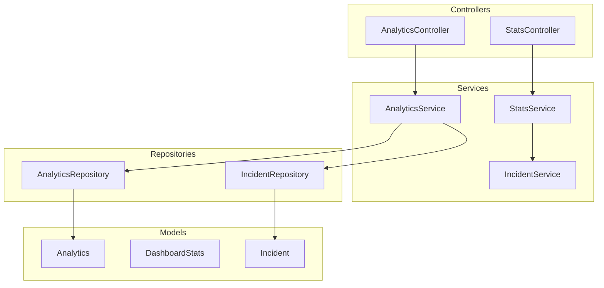
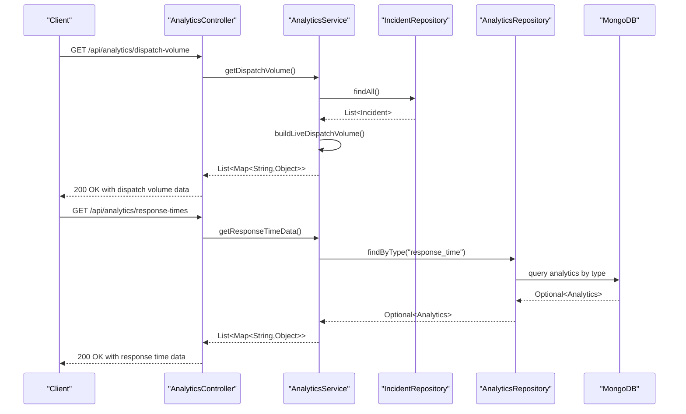
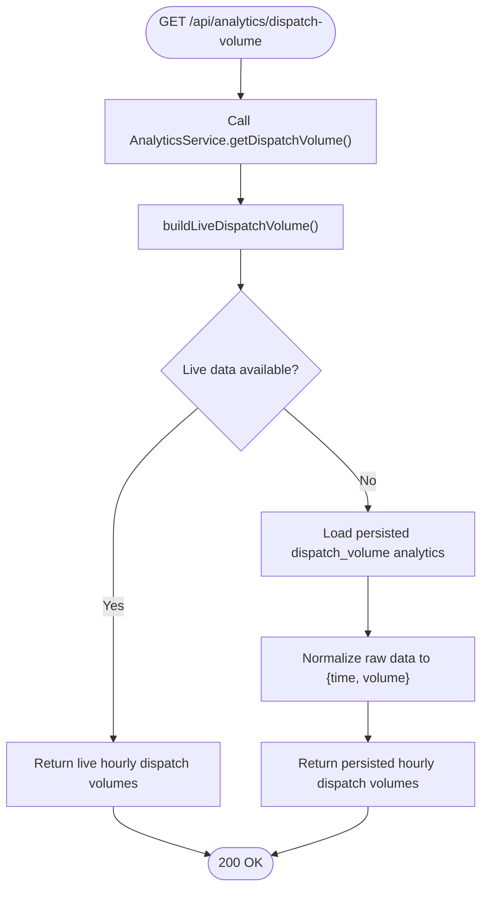
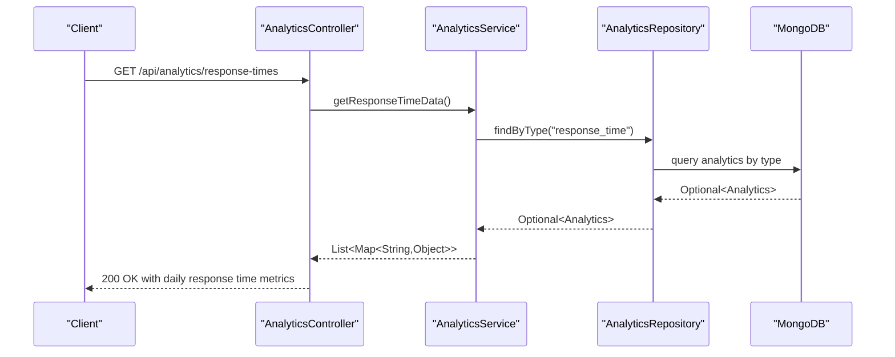
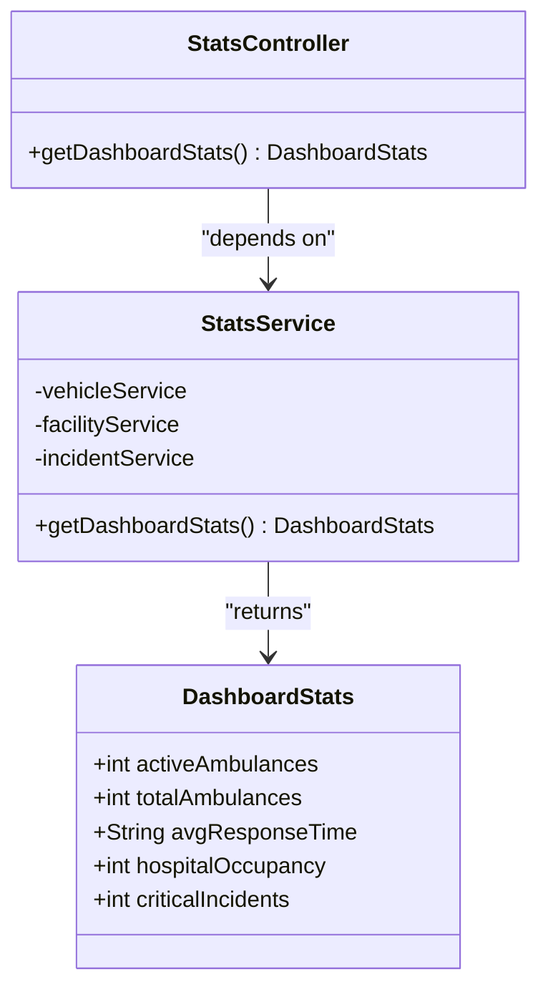
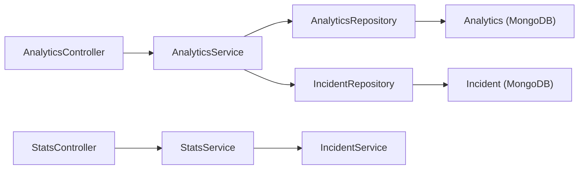

# Analytics and Reporting API

<cite>
**Referenced Files in This Document**
- [AnalyticsController.java](file://src/main/java/com/example/ems_command_center/controller/AnalyticsController.java)
- [AnalyticsService.java](file://src/main/java/com/example/ems_command_center/service/AnalyticsService.java)
- [AnalyticsRepository.java](file://src/main/java/com/example/ems_command_center/repository/AnalyticsRepository.java)
- [Analytics.java](file://src/main/java/com/example/ems_command_center/model/Analytics.java)
- [StatsController.java](file://src/main/java/com/example/ems_command_center/controller/StatsController.java)
- [StatsService.java](file://src/main/java/com/example/ems_command_center/service/StatsService.java)
- [DashboardStats.java](file://src/main/java/com/example/ems_command_center/model/DashboardStats.java)
- [IncidentService.java](file://src/main/java/com/example/ems_command_center/service/IncidentService.java)
- [IncidentRepository.java](file://src/main/java/com/example/ems_command_center/repository/IncidentRepository.java)
- [Incident.java](file://src/main/java/com/example/ems_command_center/model/Incident.java)
- [DataSeeder.java](file://src/main/java/com/example/ems_command_center/seeder/DataSeeder.java)
- [application.yml](file://src/main/resources/application.yml)
</cite>

## Table of Contents
1. [Introduction](#introduction)
2. [Project Structure](#project-structure)
3. [Core Components](#core-components)
4. [Architecture Overview](#architecture-overview)
5. [Detailed Component Analysis](#detailed-component-analysis)
6. [Dependency Analysis](#dependency-analysis)
7. [Performance Considerations](#performance-considerations)
8. [Troubleshooting Guide](#troubleshooting-guide)
9. [Conclusion](#conclusion)

## Introduction
This document provides comprehensive API documentation for analytics and reporting endpoints in the EMS Command Center system. It covers operational metrics, performance dashboards, and historical data analysis endpoints, focusing on:
- GET /api/analytics/dispatch-volume (dispatch statistics)
- GET /api/analytics/response-times (response time metrics)
- GET /api/stats/dashboard (dashboard metrics)

The documentation explains analytics data aggregation, statistical calculations, reporting formats, filtering capabilities, dashboard statistics, user performance metrics, and system utilization reports with detailed response schemas and visualization formats.

## Project Structure
The analytics and reporting functionality spans controllers, services, repositories, and models, integrated with MongoDB for persistent analytics storage and real-time incident data for live analytics computation.

**Diagram sources**
- [AnalyticsController.java:13-37](file://src/main/java/com/example/ems_command_center/controller/AnalyticsController.java#L13-L37)
- [StatsController.java:11-28](file://src/main/java/com/example/ems_command_center/controller/StatsController.java#L11-L28)
- [AnalyticsService.java:19-57](file://src/main/java/com/example/ems_command_center/service/AnalyticsService.java#L19-L57)
- [StatsService.java:7-32](file://src/main/java/com/example/ems_command_center/service/StatsService.java#L7-L32)
- [AnalyticsRepository.java:9-12](file://src/main/java/com/example/ems_command_center/repository/AnalyticsRepository.java#L9-L12)
- [IncidentRepository.java:9-13](file://src/main/java/com/example/ems_command_center/repository/IncidentRepository.java#L9-L13)
- [Analytics.java:9-15](file://src/main/java/com/example/ems_command_center/model/Analytics.java#L9-L15)
- [DashboardStats.java:6-12](file://src/main/java/com/example/ems_command_center/model/DashboardStats.java#L6-L12)
- [Incident.java:8-23](file://src/main/java/com/example/ems_command_center/model/Incident.java#L8-L23)

**Section sources**
- [AnalyticsController.java:1-38](file://src/main/java/com/example/ems_command_center/controller/AnalyticsController.java#L1-L38)
- [StatsController.java:1-29](file://src/main/java/com/example/ems_command_center/controller/StatsController.java#L1-L29)

## Core Components
- AnalyticsController: Exposes endpoints for dispatch volume and response time analytics with role-based access control.
- AnalyticsService: Computes live dispatch statistics from incidents and retrieves historical analytics from MongoDB.
- AnalyticsRepository: Provides typed access to analytics documents stored in MongoDB.
- Analytics model: Represents persisted analytics data with type and data payload.
- StatsController: Returns real-time dashboard statistics.
- StatsService: Aggregates system metrics from vehicles, facilities, and incidents.
- DashboardStats model: Defines the response shape for dashboard metrics.
- IncidentService and IncidentRepository: Supply incident data for live analytics computations.

**Section sources**
- [AnalyticsController.java:13-37](file://src/main/java/com/example/ems_command_center/controller/AnalyticsController.java#L13-L37)
- [AnalyticsService.java:19-57](file://src/main/java/com/example/ems_command_center/service/AnalyticsService.java#L19-L57)
- [AnalyticsRepository.java:9-12](file://src/main/java/com/example/ems_command_center/repository/AnalyticsRepository.java#L9-L12)
- [Analytics.java:9-15](file://src/main/java/com/example/ems_command_center/model/Analytics.java#L9-L15)
- [StatsController.java:11-28](file://src/main/java/com/example/ems_command_center/controller/StatsController.java#L11-L28)
- [StatsService.java:7-32](file://src/main/java/com/example/ems_command_center/service/StatsService.java#L7-L32)
- [DashboardStats.java:6-12](file://src/main/java/com/example/ems_command_center/model/DashboardStats.java#L6-L12)
- [IncidentService.java:15-24](file://src/main/java/com/example/ems_command_center/service/IncidentService.java#L15-L24)
- [IncidentRepository.java:9-13](file://src/main/java/com/example/ems_command_center/repository/IncidentRepository.java#L9-L13)

## Architecture Overview
The analytics and reporting architecture integrates REST endpoints with service-layer logic and MongoDB-backed persistence. Live analytics are computed from incident data, while historical analytics are served from persisted documents.

**Diagram sources**
- [AnalyticsController.java:24-36](file://src/main/java/com/example/ems_command_center/controller/AnalyticsController.java#L24-L36)
- [AnalyticsService.java:37-52](file://src/main/java/com/example/ems_command_center/service/AnalyticsService.java#L37-L52)
- [IncidentRepository.java:9-13](file://src/main/java/com/example/ems_command_center/repository/IncidentRepository.java#L9-L13)
- [AnalyticsRepository.java:9-12](file://src/main/java/com/example/ems_command_center/repository/AnalyticsRepository.java#L9-L12)

## Detailed Component Analysis

### Endpoint: GET /api/analytics/dispatch-volume
- Purpose: Returns aggregated dispatch volume over the last 12 hours, grouped by hour.
- Authentication and Authorization: Requires ADMIN or MANAGER roles.
- Request
  - Method: GET
  - Path: /api/analytics/dispatch-volume
  - Headers: Authorization (Bearer JWT)
- Response
  - Status: 200 OK
  - Body: Array of objects with keys:
    - time: Hour label in "HH:00" format (string)
    - volume: Dispatch count for the hour (integer)
- Behavior
  - Live computation: If recent incidents exist, computes hourly counts from incident timestamps.
  - Fallback: If no live data is available, serves persisted dispatch_volume analytics.
- Filtering and Validation
  - Only incidents with status "dispatched" or tags containing "dispatched" are considered.
  - Timestamp parsing expects "yyyy-MM-dd HH:mm"; invalid values are skipped.
- Example Response Schema
  - time: "HH:00" (string)
  - volume: integer (non-negative)
- Notes
  - The service ensures a fixed window of 12 hours ending at the latest incident hour.

**Diagram sources**
- [AnalyticsController.java:24-29](file://src/main/java/com/example/ems_command_center/controller/AnalyticsController.java#L24-L29)
- [AnalyticsService.java:37-47](file://src/main/java/com/example/ems_command_center/service/AnalyticsService.java#L37-L47)
- [AnalyticsService.java:59-100](file://src/main/java/com/example/ems_command_center/service/AnalyticsService.java#L59-L100)
- [AnalyticsService.java:128-141](file://src/main/java/com/example/ems_command_center/service/AnalyticsService.java#L128-L141)

**Section sources**
- [AnalyticsController.java:24-29](file://src/main/java/com/example/ems_command_center/controller/AnalyticsController.java#L24-L29)
- [AnalyticsService.java:37-47](file://src/main/java/com/example/ems_command_center/service/AnalyticsService.java#L37-L47)
- [AnalyticsService.java:59-100](file://src/main/java/com/example/ems_command_center/service/AnalyticsService.java#L59-L100)
- [AnalyticsService.java:128-141](file://src/main/java/com/example/ems_command_center/service/AnalyticsService.java#L128-L141)

### Endpoint: GET /api/analytics/response-times
- Purpose: Returns response time metrics by day, comparing dispatch-to-arrival times.
- Authentication and Authorization: Requires ADMIN or MANAGER roles.
- Request
  - Method: GET
  - Path: /api/analytics/response-times
  - Headers: Authorization (Bearer JWT)
- Response
  - Status: 200 OK
  - Body: Array of objects with keys:
    - day: Day of week (string)
    - arrival: Average arrival time in seconds (integer)
    - dispatch: Average dispatch time in seconds (integer)
- Behavior
  - Serves persisted response_time analytics from MongoDB.
- Filtering and Validation
  - No runtime filtering; returns stored weekly averages.
- Example Response Schema
  - day: "Mon".."Sun" (string)
  - arrival: integer (positive)
  - dispatch: integer (positive)

**Diagram sources**
- [AnalyticsController.java:31-36](file://src/main/java/com/example/ems_command_center/controller/AnalyticsController.java#L31-L36)
- [AnalyticsService.java:49-52](file://src/main/java/com/example/ems_command_center/service/AnalyticsService.java#L49-L52)
- [AnalyticsRepository.java:9-12](file://src/main/java/com/example/ems_command_center/repository/AnalyticsRepository.java#L9-L12)

**Section sources**
- [AnalyticsController.java:31-36](file://src/main/java/com/example/ems_command_center/controller/AnalyticsController.java#L31-L36)
- [AnalyticsService.java:49-52](file://src/main/java/com/example/ems_command_center/service/AnalyticsService.java#L49-L52)
- [AnalyticsRepository.java:9-12](file://src/main/java/com/example/ems_command_center/repository/AnalyticsRepository.java#L9-L12)

### Endpoint: GET /api/stats/dashboard
- Purpose: Returns real-time dashboard statistics summarizing system utilization and operational status.
- Authentication and Authorization: Requires ADMIN, MANAGER, DRIVER, or USER roles.
- Request
  - Method: GET
  - Path: /api/stats/dashboard
  - Headers: Authorization (Bearer JWT)
- Response
  - Status: 200 OK
  - Body: Object with keys:
    - activeAmbulances: Count of ambulances currently busy (integer)
    - totalAmbulances: Total number of ambulances (integer)
    - avgResponseTime: Average response time (string format "Xm Ys")
    - hospitalOccupancy: Rounded average hospital occupancy percentage (integer)
    - criticalIncidents: Count of incidents with status "Active" (integer)
- Behavior
  - Aggregates metrics from vehicle, facility, and incident services.
- Filtering and Validation
  - Metrics derived from service-layer counts and averages; no endpoint-level filters.
- Example Response Schema
  - activeAmbulances: integer (non-negative)
  - totalAmbulances: integer (non-negative)
  - avgResponseTime: "Xm Ys" (string)
  - hospitalOccupancy: integer (0-100)
  - criticalIncidents: integer (non-negative)

**Diagram sources**
- [StatsController.java:11-28](file://src/main/java/com/example/ems_command_center/controller/StatsController.java#L11-L28)
- [StatsService.java:7-32](file://src/main/java/com/example/ems_command_center/service/StatsService.java#L7-L32)
- [DashboardStats.java:6-12](file://src/main/java/com/example/ems_command_center/model/DashboardStats.java#L6-L12)

**Section sources**
- [StatsController.java:22-27](file://src/main/java/com/example/ems_command_center/controller/StatsController.java#L22-L27)
- [StatsService.java:19-32](file://src/main/java/com/example/ems_command_center/service/StatsService.java#L19-L32)
- [DashboardStats.java:6-12](file://src/main/java/com/example/ems_command_center/model/DashboardStats.java#L6-L12)

### Analytics Data Aggregation and Statistical Calculations
- Dispatch Volume Aggregation
  - Live computation: Extracts incident timestamps, parses "yyyy-MM-dd HH:mm", groups by hour, and counts occurrences for the last 12 hours.
  - Normalization: Ensures consistent response shape with "time" and "volume" keys.
- Response Time Metrics
  - Historical averages: Served as-is from persisted analytics documents.
- Dashboard Metrics
  - Counts and averages: Derived from service-layer aggregations across vehicles, facilities, and incidents.

**Section sources**
- [AnalyticsService.java:59-100](file://src/main/java/com/example/ems_command_center/service/AnalyticsService.java#L59-L100)
- [AnalyticsService.java:128-141](file://src/main/java/com/example/ems_command_center/service/AnalyticsService.java#L128-L141)
- [StatsService.java:19-32](file://src/main/java/com/example/ems_command_center/service/StatsService.java#L19-L32)

### Reporting Formats and Visualization Guidance
- Dispatch Volume
  - Time series format: ["HH:00", volume] for 12 consecutive hours.
  - Visualization: Line chart with time on X-axis and volume on Y-axis.
- Response Times
  - Weekly bar chart: Two bars per day (dispatch vs arrival).
- Dashboard
  - KPI cards: activeAmbulances, totalAmbulances, avgResponseTime, hospitalOccupancy, criticalIncidents.

[No sources needed since this section provides general guidance]

## Dependency Analysis
The analytics endpoints depend on services that bridge controllers and repositories, with MongoDB storing historical analytics data.

**Diagram sources**
- [AnalyticsController.java:13-37](file://src/main/java/com/example/ems_command_center/controller/AnalyticsController.java#L13-L37)
- [StatsController.java:11-28](file://src/main/java/com/example/ems_command_center/controller/StatsController.java#L11-L28)
- [AnalyticsService.java:19-57](file://src/main/java/com/example/ems_command_center/service/AnalyticsService.java#L19-L57)
- [StatsService.java:7-32](file://src/main/java/com/example/ems_command_center/service/StatsService.java#L7-L32)
- [AnalyticsRepository.java:9-12](file://src/main/java/com/example/ems_command_center/repository/AnalyticsRepository.java#L9-L12)
- [IncidentRepository.java:9-13](file://src/main/java/com/example/ems_command_center/repository/IncidentRepository.java#L9-L13)
- [Analytics.java:9-15](file://src/main/java/com/example/ems_command_center/model/Analytics.java#L9-L15)
- [Incident.java:8-23](file://src/main/java/com/example/ems_command_center/model/Incident.java#L8-L23)

**Section sources**
- [AnalyticsController.java:13-37](file://src/main/java/com/example/ems_command_center/controller/AnalyticsController.java#L13-L37)
- [StatsController.java:11-28](file://src/main/java/com/example/ems_command_center/controller/StatsController.java#L11-L28)
- [AnalyticsService.java:19-57](file://src/main/java/com/example/ems_command_center/service/AnalyticsService.java#L19-L57)
- [StatsService.java:7-32](file://src/main/java/com/example/ems_command_center/service/StatsService.java#L7-L32)
- [AnalyticsRepository.java:9-12](file://src/main/java/com/example/ems_command_center/repository/AnalyticsRepository.java#L9-L12)
- [IncidentRepository.java:9-13](file://src/main/java/com/example/ems_command_center/repository/IncidentRepository.java#L9-L13)
- [Analytics.java:9-15](file://src/main/java/com/example/ems_command_center/model/Analytics.java#L9-L15)
- [Incident.java:8-23](file://src/main/java/com/example/ems_command_center/model/Incident.java#L8-L23)

## Performance Considerations
- Live Analytics Computation
  - Parsing and grouping occur server-side; ensure incident timestamps are consistently formatted to avoid parsing overhead.
  - Limit the time window to 12 hours to keep computations efficient.
- Database Queries
  - Analytics retrieval uses typed queries by type; ensure proper indexing on the analytics collection for optimal performance.
- Caching Opportunities
  - Consider caching frequently accessed historical analytics to reduce database load.
- Scalability
  - As incident volume grows, monitor service response times and consider pagination or pre-aggregation jobs for large datasets.

[No sources needed since this section provides general guidance]

## Troubleshooting Guide
- Authentication Failures
  - Ensure requests include a valid Bearer JWT token. Roles ADMIN and MANAGER are required for analytics endpoints; all roles for dashboard.
- Empty Dispatch Volume Response
  - Occurs when no incidents meet the "dispatched" criteria or timestamps cannot be parsed. Verify incident data and time formats.
- Missing Response Time Data
  - Returned when no persisted response_time analytics exist. Seed analytics data or populate via administrative process.
- Incorrect Timestamp Formats
  - Only "yyyy-MM-dd HH:mm" is supported. Non-conforming timestamps are ignored during live dispatch volume computation.
- Database Connectivity
  - Confirm MongoDB URI and database configuration in application settings.

**Section sources**
- [AnalyticsController.java:26-34](file://src/main/java/com/example/ems_command_center/controller/AnalyticsController.java#L26-L34)
- [StatsController.java:24-25](file://src/main/java/com/example/ems_command_center/controller/StatsController.java#L24-L25)
- [AnalyticsService.java:116-126](file://src/main/java/com/example/ems_command_center/service/AnalyticsService.java#L116-L126)
- [application.yml:5-8](file://src/main/resources/application.yml#L5-L8)

## Conclusion
The analytics and reporting endpoints provide essential insights into dispatch activity, response times, and system-wide dashboard metrics. Live dispatch volume computation leverages recent incident data, while historical analytics and dashboard metrics are served from persisted data and service-layer aggregations. Proper authentication, consistent timestamp formats, and database configuration are critical for reliable operation.