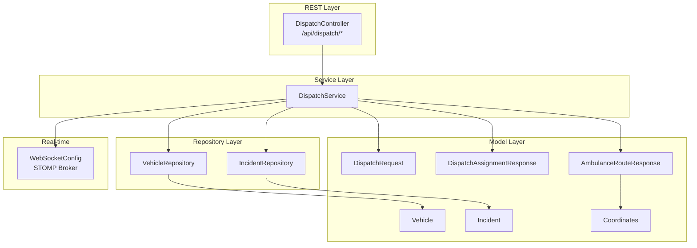
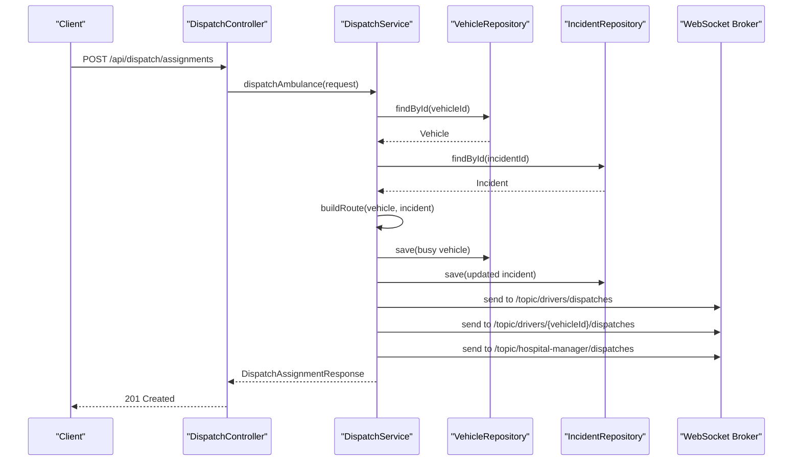
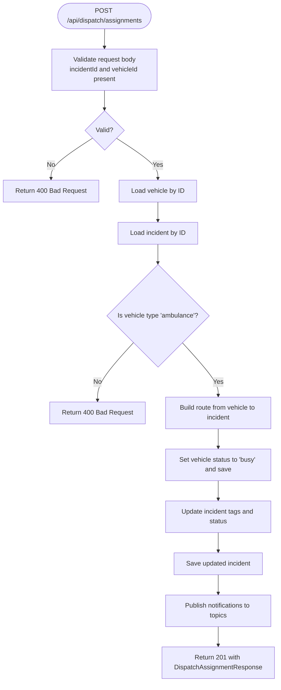
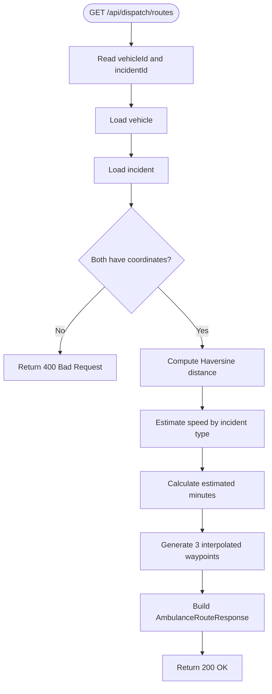
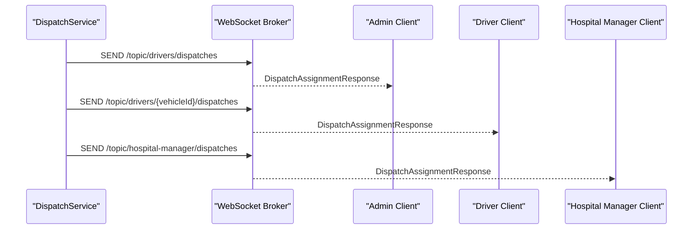
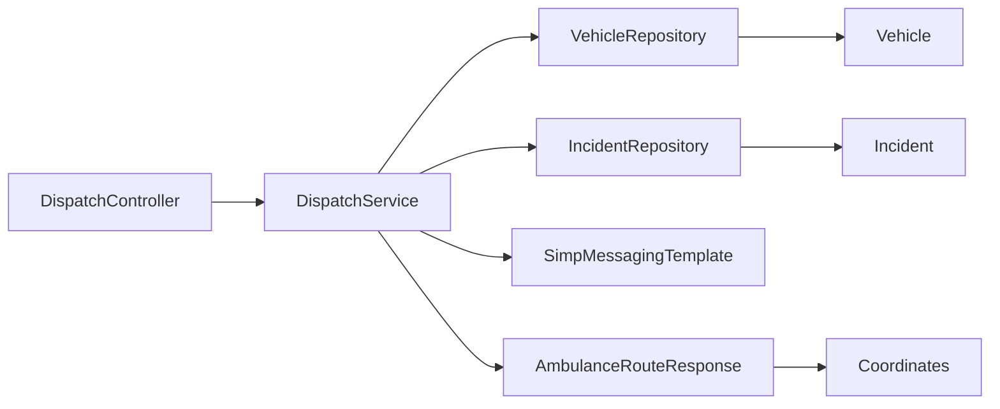

# Dispatch Coordination API

<cite>
**Referenced Files in This Document**
- [DispatchController.java](file://src/main/java/com/example/ems_command_center/controller/DispatchController.java)
- [DispatchService.java](file://src/main/java/com/example/ems_command_center/service/DispatchService.java)
- [DispatchRequest.java](file://src/main/java/com/example/ems_command_center/model/DispatchRequest.java)
- [DispatchAssignmentResponse.java](file://src/main/java/com/example/ems_command_center/model/DispatchAssignmentResponse.java)
- [AmbulanceRouteResponse.java](file://src/main/java/com/example/ems_command_center/model/AmbulanceRouteResponse.java)
- [Vehicle.java](file://src/main/java/com/example/ems_command_center/model/Vehicle.java)
- [Incident.java](file://src/main/java/com/example/ems_command_center/model/Incident.java)
- [Coordinates.java](file://src/main/java/com/example/ems_command_center/model/Coordinates.java)
- [VehicleRepository.java](file://src/main/java/com/example/ems_command_center/repository/VehicleRepository.java)
- [IncidentRepository.java](file://src/main/java/com/example/ems_command_center/repository/IncidentRepository.java)
- [WebSocketConfig.java](file://src/main/java/com/example/ems_command_center/config/WebSocketConfig.java)
- [application.yml](file://src/main/resources/application.yml)
</cite>

## Table of Contents
1. [Introduction](#introduction)
2. [Project Structure](#project-structure)
3. [Core Components](#core-components)
4. [Architecture Overview](#architecture-overview)
5. [Detailed Component Analysis](#detailed-component-analysis)
6. [Dependency Analysis](#dependency-analysis)
7. [Performance Considerations](#performance-considerations)
8. [Troubleshooting Guide](#troubleshooting-guide)
9. [Conclusion](#conclusion)

## Introduction
This document provides comprehensive API documentation for the dispatch coordination endpoints. It covers ambulance assignment operations, route calculation APIs, and real-time dispatch management. The focus includes:
- POST /api/dispatch/assignments (ambulance assignment)
- GET /api/dispatch/routes (route calculation)
- Real-time dispatch notifications via WebSocket topics

The documentation details request/response schemas, operational workflows, and integration points for drivers, dispatchers, and hospital managers.

## Project Structure
The dispatch system is implemented using Spring Boot with MongoDB repositories and STOMP/WebSocket for real-time notifications. The primary components are:
- Controller layer exposing REST endpoints
- Service layer orchestrating business logic and notifications
- Model layer defining request/response DTOs and domain entities
- Repository layer interacting with MongoDB collections

**Diagram sources**
- [DispatchController.java:22-56](file://src/main/java/com/example/ems_command_center/controller/DispatchController.java#L22-L56)
- [DispatchService.java:21-38](file://src/main/java/com/example/ems_command_center/service/DispatchService.java#L21-L38)
- [DispatchRequest.java:3-9](file://src/main/java/com/example/ems_command_center/model/DispatchRequest.java#L3-L9)
- [DispatchAssignmentResponse.java:5-18](file://src/main/java/com/example/ems_command_center/model/DispatchAssignmentResponse.java#L5-L18)
- [AmbulanceRouteResponse.java:5-18](file://src/main/java/com/example/ems_command_center/model/AmbulanceRouteResponse.java#L5-L18)
- [Vehicle.java:8-18](file://src/main/java/com/example/ems_command_center/model/Vehicle.java#L8-L18)
- [Incident.java:8-23](file://src/main/java/com/example/ems_command_center/model/Incident.java#L8-L23)
- [Coordinates.java:3-4](file://src/main/java/com/example/ems_command_center/model/Coordinates.java#L3-L4)
- [VehicleRepository.java:9-14](file://src/main/java/com/example/ems_command_center/repository/VehicleRepository.java#L9-L14)
- [IncidentRepository.java:9-13](file://src/main/java/com/example/ems_command_center/repository/IncidentRepository.java#L9-L13)
- [WebSocketConfig.java:10-49](file://src/main/java/com/example/ems_command_center/config/WebSocketConfig.java#L10-L49)

**Section sources**
- [DispatchController.java:22-56](file://src/main/java/com/example/ems_command_center/controller/DispatchController.java#L22-L56)
- [DispatchService.java:21-38](file://src/main/java/com/example/ems_command_center/service/DispatchService.java#L21-L38)
- [WebSocketConfig.java:10-49](file://src/main/java/com/example/ems_command_center/config/WebSocketConfig.java#L10-L49)

## Core Components
This section documents the key models and their roles in dispatch operations.

- DispatchRequest: Request payload for ambulance assignments
  - Fields: incidentId, vehicleId, dispatcher, notes
  - Validation: incidentId and vehicleId are required

- DispatchAssignmentResponse: Response payload after successful assignment
  - Fields: incident identifiers and title, vehicle identifiers and name, dispatcher, notes, statuses, timestamps, incident tags, route details

- AmbulanceRouteResponse: Route calculation result
  - Fields: vehicle and incident identifiers/titles, origin/destination coordinates, intermediate path waypoints, distance in km, estimated travel minutes, traffic level, turn-by-turn instructions

- Vehicle: Ambulance entity with status and location
  - Status values: available, busy, maintenance, out-of-service
  - Type values: ambulance, supervisor, fire-truck

- Incident: Event with coordinates, type, status, and priority
  - Type values: urgent, normal
  - Status values: various operational statuses

- Coordinates: Geographic coordinate pair (lat, lng)

**Section sources**
- [DispatchRequest.java:3-9](file://src/main/java/com/example/ems_command_center/model/DispatchRequest.java#L3-L9)
- [DispatchAssignmentResponse.java:5-18](file://src/main/java/com/example/ems_command_center/model/DispatchAssignmentResponse.java#L5-L18)
- [AmbulanceRouteResponse.java:5-18](file://src/main/java/com/example/ems_command_center/model/AmbulanceRouteResponse.java#L5-L18)
- [Vehicle.java:8-18](file://src/main/java/com/example/ems_command_center/model/Vehicle.java#L8-L18)
- [Incident.java:8-23](file://src/main/java/com/example/ems_command_center/model/Incident.java#L8-L23)
- [Coordinates.java:3-4](file://src/main/java/com/example/ems_command_center/model/Coordinates.java#L3-L4)

## Architecture Overview
The dispatch workflow integrates REST endpoints, business logic, persistence, and real-time notifications:

**Diagram sources**
- [DispatchController.java:50-55](file://src/main/java/com/example/ems_command_center/controller/DispatchController.java#L50-L55)
- [DispatchService.java:53-119](file://src/main/java/com/example/ems_command_center/service/DispatchService.java#L53-L119)
- [WebSocketConfig.java:20-24](file://src/main/java/com/example/ems_command_center/config/WebSocketConfig.java#L20-L24)

## Detailed Component Analysis

### Endpoint: POST /api/dispatch/assignments
Purpose: Assign an ambulance to an incident and calculate the suggested route.

- Authentication/Authorization
  - Requires ADMIN or MANAGER role
  - Driver users can only access endpoints secured by vehicle ownership checks

- Request Body Schema
  - Required fields: incidentId, vehicleId
  - Optional fields: dispatcher, notes

- Response
  - Status: 201 Created on success
  - Body: DispatchAssignmentResponse containing:
    - Incident and vehicle identifiers and titles
    - Dispatcher name and notes
    - Vehicle and incident statuses
    - Dispatch timestamp
    - Updated incident tags
    - Route details (AmbulanceRouteResponse)

- Workflow Details
  - Validates that the vehicle is an ambulance
  - Builds a route from vehicle location to incident coordinates
  - Updates vehicle status to busy and records dispatch timestamp
  - Adds tags to the incident indicating dispatch and optional notes
  - Publishes real-time notifications to three WebSocket topics

- Error Conditions
  - 400 Bad Request: Missing required fields, non-ambulance vehicle type, missing coordinates
  - 404 Not Found: Vehicle or incident not found

**Diagram sources**
- [DispatchController.java:50-55](file://src/main/java/com/example/ems_command_center/controller/DispatchController.java#L50-L55)
- [DispatchService.java:53-119](file://src/main/java/com/example/ems_command_center/service/DispatchService.java#L53-L119)

**Section sources**
- [DispatchController.java:50-55](file://src/main/java/com/example/ems_command_center/controller/DispatchController.java#L50-L55)
- [DispatchService.java:53-119](file://src/main/java/com/example/ems_command_center/service/DispatchService.java#L53-L119)

### Endpoint: GET /api/dispatch/routes
Purpose: Preview the suggested route from an ambulance to an incident without changing state.

- Authentication/Authorization
  - Requires ADMIN or MANAGER role
  - Drivers can access if they are assigned to the specified vehicle

- Query Parameters
  - vehicleId: Ambulance identifier
  - incidentId: Incident identifier

- Response
  - Status: 200 OK
  - Body: AmbulanceRouteResponse with:
    - Origin and destination coordinates
    - Interpolated path waypoints
    - Distance in kilometers
    - Estimated travel time in minutes
    - Traffic level
    - Turn-by-turn directions

- Route Calculation Logic
  - Uses Haversine formula to compute distance
  - Estimates speed based on incident type (urgent vs normal)
  - Generates 3 intermediate waypoints along the great-circle path
  - Computes traffic level based on distance and incident type

**Diagram sources**
- [DispatchController.java:40-48](file://src/main/java/com/example/ems_command_center/controller/DispatchController.java#L40-L48)
- [DispatchService.java:46-171](file://src/main/java/com/example/ems_command_center/service/DispatchService.java#L46-L171)

**Section sources**
- [DispatchController.java:40-48](file://src/main/java/com/example/ems_command_center/controller/DispatchController.java#L40-L48)
- [DispatchService.java:46-171](file://src/main/java/com/example/ems_command_center/service/DispatchService.java#L46-L171)

### Endpoint: GET /api/dispatch/ambulances/available
Purpose: Retrieve all currently available ambulances.

- Authentication/Authorization
  - Requires ADMIN, MANAGER, or DRIVER role

- Response
  - Status: 200 OK
  - Body: Array of Vehicle entities with status "available"

**Section sources**
- [DispatchController.java:33-38](file://src/main/java/com/example/ems_command_center/controller/DispatchController.java#L33-L38)
- [DispatchService.java:40-44](file://src/main/java/com/example/ems_command_center/service/DispatchService.java#L40-L44)
- [VehicleRepository.java:10-12](file://src/main/java/com/example/ems_command_center/repository/VehicleRepository.java#L10-L12)

### Real-time Dispatch Notifications
The system publishes dispatch events to multiple WebSocket topics for real-time updates:

- Topics
  - /topic/drivers/dispatches: All drivers receive every dispatch
  - /topic/drivers/{vehicleId}/dispatches: Specific driver receives their assigned dispatch
  - /topic/hospital-manager/dispatches: Hospital manager receives all incoming dispatches

- Delivery Mechanism
  - STOMP broker configured with simple broker for topics
  - Endpoints exposed at /ws and /ws-native with SockJS support

- Message Content
  - DispatchAssignmentResponse payload delivered to subscribers

**Diagram sources**
- [DispatchService.java:205-212](file://src/main/java/com/example/ems_command_center/service/DispatchService.java#L205-L212)
- [WebSocketConfig.java:20-24](file://src/main/java/com/example/ems_command_center/config/WebSocketConfig.java#L20-L24)

**Section sources**
- [DispatchService.java:205-212](file://src/main/java/com/example/ems_command_center/service/DispatchService.java#L205-L212)
- [WebSocketConfig.java:20-49](file://src/main/java/com/example/ems_command_center/config/WebSocketConfig.java#L20-L49)
- [application.yml:16-36](file://src/main/resources/application.yml#L16-L36)

## Dependency Analysis
The dispatch system exhibits clear separation of concerns with minimal coupling between layers:

**Diagram sources**
- [DispatchController.java:27-31](file://src/main/java/com/example/ems_command_center/controller/DispatchController.java#L27-L31)
- [DispatchService.java:26-38](file://src/main/java/com/example/ems_command_center/service/DispatchService.java#L26-L38)
- [VehicleRepository.java:9-14](file://src/main/java/com/example/ems_command_center/repository/VehicleRepository.java#L9-L14)
- [IncidentRepository.java:9-13](file://src/main/java/com/example/ems_command_center/repository/IncidentRepository.java#L9-L13)

**Section sources**
- [DispatchController.java:27-31](file://src/main/java/com/example/ems_command_center/controller/DispatchController.java#L27-L31)
- [DispatchService.java:26-38](file://src/main/java/com/example/ems_command_center/service/DispatchService.java#L26-L38)

## Performance Considerations
- Route computation is O(1) per request, involving basic arithmetic and trigonometric calculations
- Distance calculation uses the Haversine formula; overhead is negligible for typical use cases
- No database queries are performed during route preview, reducing latency
- Real-time notifications are broadcast asynchronously via the STOMP broker

## Troubleshooting Guide
Common issues and resolutions:

- 400 Bad Request on assignment
  - Cause: Missing incidentId or vehicleId in request body
  - Resolution: Ensure both fields are provided

- 400 Bad Request on assignment
  - Cause: Non-ambulance vehicle type selected
  - Resolution: Select a vehicle with type "ambulance"

- 400 Bad Request on route calculation
  - Cause: Missing coordinates on vehicle or incident
  - Resolution: Verify both entities have valid coordinates

- 404 Not Found
  - Cause: Vehicle or incident does not exist
  - Resolution: Confirm identifiers are correct and entities exist

- WebSocket connection issues
  - Verify server configuration supports /ws and /ws-native endpoints
  - Ensure client connects to the correct endpoint and origin pattern

**Section sources**
- [DispatchService.java:54-66](file://src/main/java/com/example/ems_command_center/service/DispatchService.java#L54-L66)
- [DispatchService.java:131-142](file://src/main/java/com/example/ems_command_center/service/DispatchService.java#L131-L142)
- [WebSocketConfig.java:32-49](file://src/main/java/com/example/ems_command_center/config/WebSocketConfig.java#L32-L49)

## Conclusion
The dispatch coordination API provides a robust foundation for managing ambulance assignments and route planning. It offers:
- Clear REST endpoints for assignment and route preview
- Comprehensive request/response schemas
- Real-time notifications for drivers and managers
- Role-based access control and validation
- Scalable architecture with minimal coupling

The documented endpoints and schemas enable frontend teams to integrate dispatch workflows seamlessly while maintaining operational clarity and real-time responsiveness.