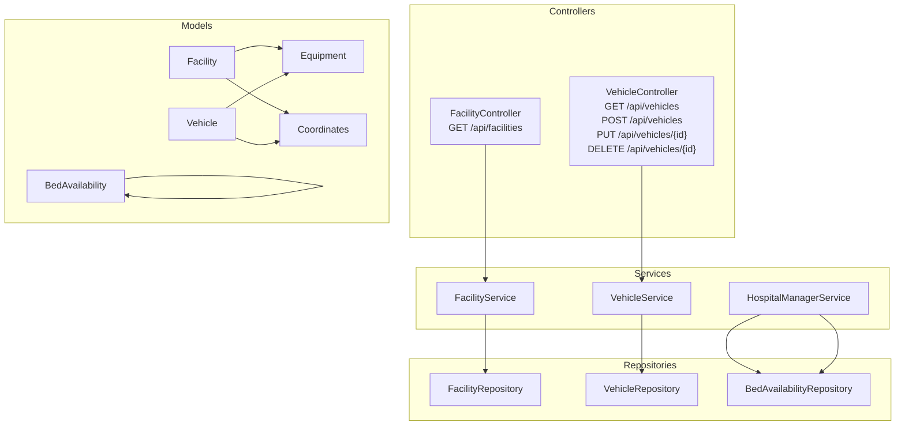
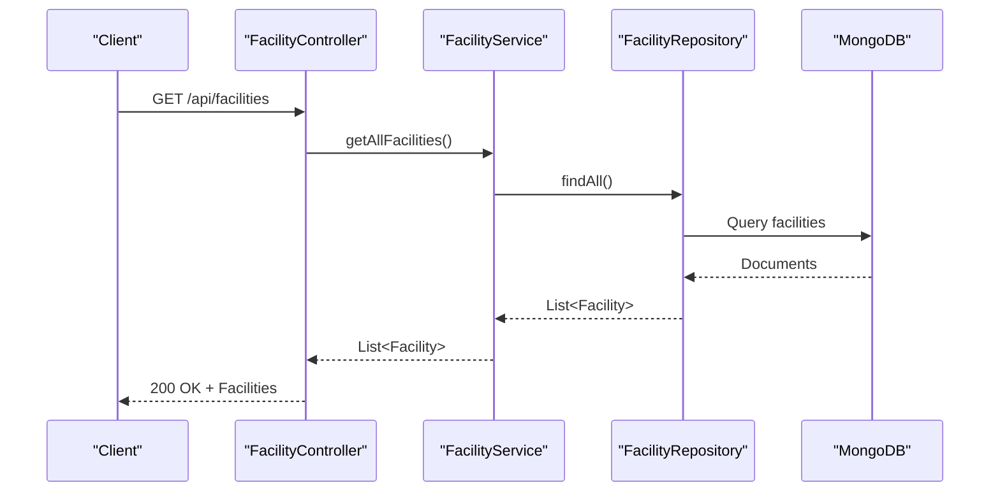
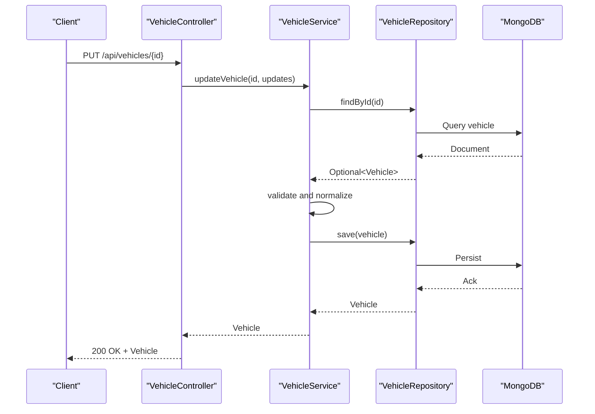
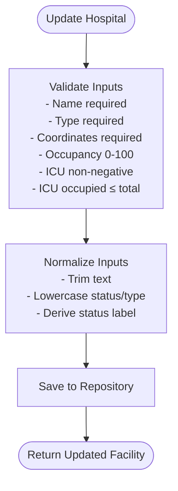
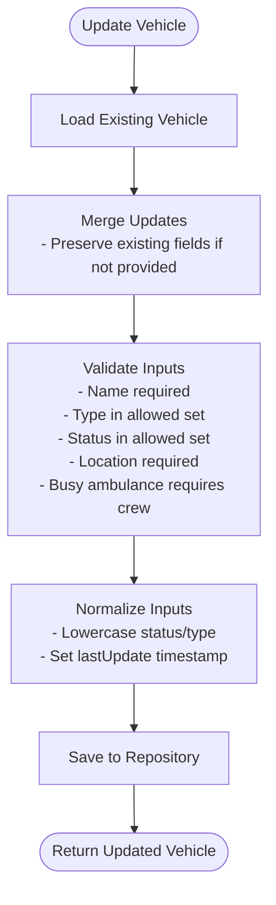
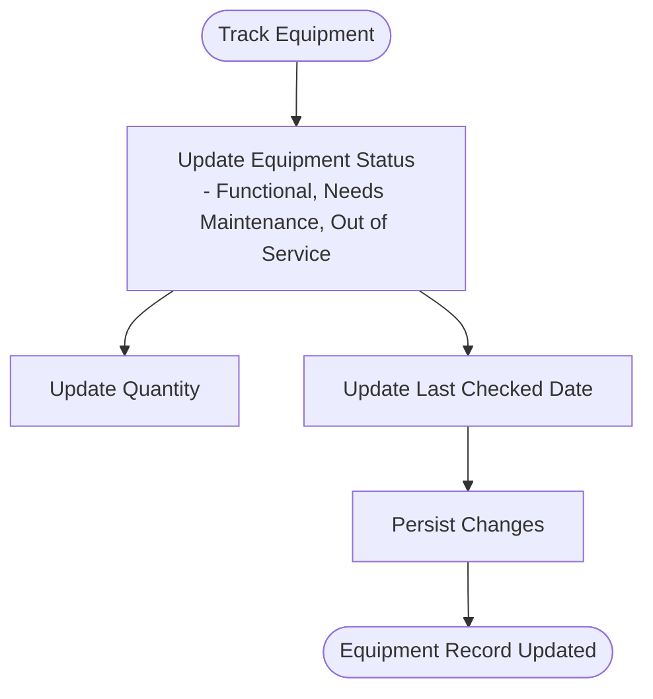
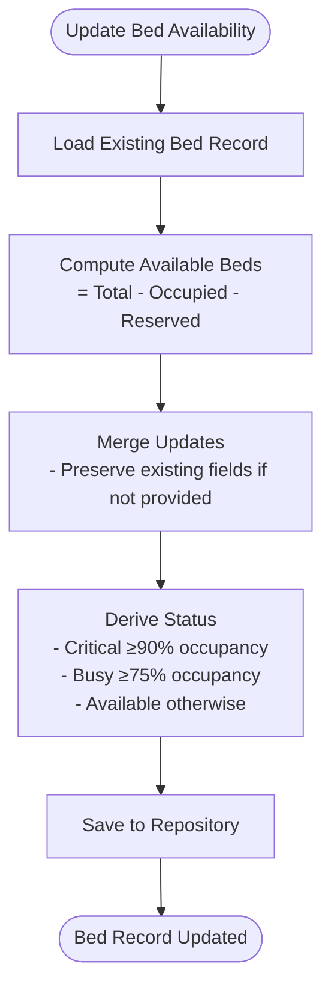
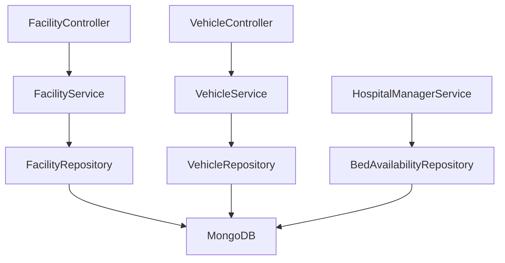

# Facility and Vehicle Tracking API

<cite>
**Referenced Files in This Document**
- [FacilityController.java](file://src/main/java/com/example/ems_command_center/controller/FacilityController.java)
- [VehicleController.java](file://src/main/java/com/example/ems_command_center/controller/VehicleController.java)
- [FacilityService.java](file://src/main/java/com/example/ems_command_center/service/FacilityService.java)
- [VehicleService.java](file://src/main/java/com/example/ems_command_center/service/VehicleService.java)
- [FacilityRepository.java](file://src/main/java/com/example/ems_command_center/repository/FacilityRepository.java)
- [VehicleRepository.java](file://src/main/java/com/example/ems_command_center/repository/VehicleRepository.java)
- [Facility.java](file://src/main/java/com/example/ems_command_center/model/Facility.java)
- [Vehicle.java](file://src/main/java/com/example/ems_command_center/model/Vehicle.java)
- [Equipment.java](file://src/main/java/com/example/ems_command_center/model/Equipment.java)
- [Coordinates.java](file://src/main/java/com/example/ems_command_center/model/Coordinates.java)
- [BedAvailability.java](file://src/main/java/com/example/ems_command_center/model/BedAvailability.java)
- [BedAvailabilityRepository.java](file://src/main/java/com/example/ems_command_center/repository/BedAvailabilityRepository.java)
- [HospitalManagerService.java](file://src/main/java/com/example/ems_command_center/service/HospitalManagerService.java)
</cite>

## Table of Contents
1. [Introduction](#introduction)
2. [Project Structure](#project-structure)
3. [Core Components](#core-components)
4. [Architecture Overview](#architecture-overview)
5. [Detailed Component Analysis](#detailed-component-analysis)
6. [Dependency Analysis](#dependency-analysis)
7. [Performance Considerations](#performance-considerations)
8. [Troubleshooting Guide](#troubleshooting-guide)
9. [Conclusion](#conclusion)

## Introduction
This document provides comprehensive API documentation for facility and vehicle tracking endpoints within the Emergency Medical Services Command Center. It covers:
- Facility management operations including hospital bed availability, equipment tracking, and resource allocation
- Vehicle fleet management, equipment monitoring, and facility resource coordination
- Endpoints for facility listing, facility creation, vehicle tracking, and equipment inventory management
- Workflows for facility capacity management, vehicle status tracking, equipment availability, and real-time resource monitoring

The system is built with Spring Boot and MongoDB, exposing REST APIs secured via role-based access control. Swagger annotations are present for API documentation generation.

## Project Structure
The relevant components for facility and vehicle tracking are organized into controllers, services, repositories, and models:

**Diagram sources**
- [FacilityController.java:14-29](file://src/main/java/com/example/ems_command_center/controller/FacilityController.java#L14-L29)
- [VehicleController.java:15-55](file://src/main/java/com/example/ems_command_center/controller/VehicleController.java#L15-L55)
- [FacilityService.java:14-23](file://src/main/java/com/example/ems_command_center/service/FacilityService.java#L14-L23)
- [VehicleService.java:16-26](file://src/main/java/com/example/ems_command_center/service/VehicleService.java#L16-L26)
- [FacilityRepository.java:10-12](file://src/main/java/com/example/ems_command_center/repository/FacilityRepository.java#L10-L12)
- [VehicleRepository.java:10-14](file://src/main/java/com/example/ems_command_center/repository/VehicleRepository.java#L10-L14)
- [Facility.java:8-26](file://src/main/java/com/example/ems_command_center/model/Facility.java#L8-L26)
- [Vehicle.java:8-18](file://src/main/java/com/example/ems_command_center/model/Vehicle.java#L8-L18)
- [Equipment.java:3-10](file://src/main/java/com/example/ems_command_center/model/Equipment.java#L3-L10)
- [Coordinates.java:3-4](file://src/main/java/com/example/ems_command_center/model/Coordinates.java#L3-L4)
- [BedAvailability.java:7-16](file://src/main/java/com/example/ems_command_center/model/BedAvailability.java#L7-L16)

**Section sources**
- [FacilityController.java:1-31](file://src/main/java/com/example/ems_command_center/controller/FacilityController.java#L1-L31)
- [VehicleController.java:1-57](file://src/main/java/com/example/ems_command_center/controller/VehicleController.java#L1-L57)
- [FacilityService.java:1-164](file://src/main/java/com/example/ems_command_center/service/FacilityService.java#L1-L164)
- [VehicleService.java:1-112](file://src/main/java/com/example/ems_command_center/service/VehicleService.java#L1-L112)
- [FacilityRepository.java:1-13](file://src/main/java/com/example/ems_command_center/repository/FacilityRepository.java#L1-L13)
- [VehicleRepository.java:1-15](file://src/main/java/com/example/ems_command_center/repository/VehicleRepository.java#L1-L15)
- [Facility.java:1-27](file://src/main/java/com/example/ems_command_center/model/Facility.java#L1-L27)
- [Vehicle.java:1-19](file://src/main/java/com/example/ems_command_center/model/Vehicle.java#L1-L19)
- [Equipment.java:1-11](file://src/main/java/com/example/ems_command_center/model/Equipment.java#L1-L11)
- [Coordinates.java:1-5](file://src/main/java/com/example/ems_command_center/model/Coordinates.java#L1-L5)
- [BedAvailability.java:1-17](file://src/main/java/com/example/ems_command_center/model/BedAvailability.java#L1-L17)
- [BedAvailabilityRepository.java:1-10](file://src/main/java/com/example/ems_command_center/repository/BedAvailabilityRepository.java#L1-L10)
- [HospitalManagerService.java:1-180](file://src/main/java/com/example/ems_command_center/service/HospitalManagerService.java#L1-L180)

## Core Components
This section documents the primary endpoints and their capabilities for facility and vehicle tracking.

### Facilities Endpoint
- **GET /api/facilities**
  - Purpose: Fetch all emergency facilities
  - Authentication: ADMIN, MANAGER, DRIVER, USER
  - Response: Array of facilities
  - Implementation: Delegates to FacilityService.getAllFacilities()

- **POST /api/facilities** *(Planned)*
  - Purpose: Create a new facility
  - Authentication: ADMIN, MANAGER
  - Request body: Facility object (name, status, beds, distance, type, occupancy, coordinates, equipment, facilityType, waitTime, icu, icuTotal, waitType)
  - Response: Created facility object
  - Implementation: To be added to controller and service layers

- **Facility Model Fields**
  - id: Unique identifier
  - name: Facility name
  - status: Operational status label
  - beds: Total beds (text)
  - distance: Distance metric
  - type: Availability type (error, warning, success)
  - occupancy: Occupancy percentage (0–100)
  - coordinates: Latitude and longitude
  - equipment: List of equipment items
  - facilityType: Hospital classification (e.g., Level 1 Trauma)
  - waitTime: Average wait time
  - icu: ICU occupied beds
  - icuTotal: ICU total beds
  - waitType: Wait type classification

- **Facility Capacity Management**
  - Occupancy thresholds drive derived status and waitType
  - Validation ensures occupancy and ICU values are within bounds
  - Normalization trims whitespace and derives status labels

**Section sources**
- [FacilityController.java:24-29](file://src/main/java/com/example/ems_command_center/controller/FacilityController.java#L24-L29)
- [FacilityService.java:25-75](file://src/main/java/com/example/ems_command_center/service/FacilityService.java#L25-L75)
- [Facility.java:8-26](file://src/main/java/com/example/ems_command_center/model/Facility.java#L8-L26)

### Vehicles Endpoint
- **GET /api/vehicles**
  - Purpose: Fetch all vehicles (ambulances, supervisors, etc.)
  - Authentication: ADMIN, MANAGER, DRIVER
  - Response: Array of vehicles
  - Implementation: Delegates to VehicleService.getAllVehicles()

- **POST /api/vehicles**
  - Purpose: Register a new vehicle
  - Authentication: ADMIN, MANAGER
  - Request body: Vehicle object (name, status, type, location, crew, lastUpdate, equipment)
  - Response: Created vehicle object
  - Implementation: Delegates to VehicleService.createVehicle()

- **PUT /api/vehicles/{id}**
  - Purpose: Update vehicle status or location
  - Authentication: ADMIN, MANAGER, or DRIVER (only for assigned ambulances)
  - Path parameter: id (vehicle identifier)
  - Request body: Partial vehicle updates
  - Response: Updated vehicle or 404 Not Found
  - Implementation: Delegates to VehicleService.updateVehicle()

- **DELETE /api/vehicles/{id}**
  - Purpose: Decommission a vehicle
  - Authentication: ADMIN
  - Path parameter: id (vehicle identifier)
  - Response: 204 No Content or 404 Not Found
  - Implementation: Delegates to VehicleService.deleteVehicle()

- **Vehicle Model Fields**
  - id: Unique identifier
  - name: Vehicle name
  - status: Status (available, busy, maintenance, out-of-service, offline)
  - type: Type (ambulance, supervisor, fire-truck, rescue, other)
  - location: Coordinates (lat, lng)
  - crew: Assigned personnel identifiers
  - lastUpdate: Timestamp of last update
  - equipment: List of equipment items

- **Vehicle Status Tracking**
  - Validation enforces allowed statuses and types
  - Normalization lowercases status/type and sets lastUpdate timestamp
  - Busy ambulances require an assigned crew

**Section sources**
- [VehicleController.java:25-55](file://src/main/java/com/example/ems_command_center/controller/VehicleController.java#L25-L55)
- [VehicleService.java:28-87](file://src/main/java/com/example/ems_command_center/service/VehicleService.java#L28-L87)
- [Vehicle.java:8-18](file://src/main/java/com/example/ems_command_center/model/Vehicle.java#L8-L18)

### Equipment Inventory Management
- **Equipment Model Fields**
  - id: Equipment identifier
  - name: Equipment name
  - status: Functional status (functional, needs-maintenance, out-of-service)
  - lastChecked: Last inspection date
  - quantity: Available units

- **Usage in Facilities and Vehicles**
  - Facilities maintain equipment lists for tracking availability and maintenance
  - Vehicles maintain equipment lists for deployment readiness

**Section sources**
- [Equipment.java:3-10](file://src/main/java/com/example/ems_command_center/model/Equipment.java#L3-L10)
- [Facility.java:17-17](file://src/main/java/com/example/ems_command_center/model/Facility.java#L17-L17)
- [Vehicle.java:16-16](file://src/main/java/com/example/ems_command_center/model/Vehicle.java#L16-L16)

### Real-Time Resource Monitoring
- **Bed Availability Monitoring**
  - Managed via HospitalManagerService.updateBed
  - Calculates available beds and derives status based on occupancy thresholds
  - Maintains Ward-level bed metrics

- **Medical Resource Monitoring**
  - Managed via HospitalManagerService.updateResource
  - Tracks available vs total units and derives resource status
  - Supports categorization and location tracking

**Section sources**
- [HospitalManagerService.java:79-120](file://src/main/java/com/example/ems_command_center/service/HospitalManagerService.java#L79-L120)
- [BedAvailability.java:7-16](file://src/main/java/com/example/ems_command_center/model/BedAvailability.java#L7-L16)

## Architecture Overview
The system follows a layered architecture with clear separation of concerns:

**Diagram sources**
- [FacilityController.java:24-29](file://src/main/java/com/example/ems_command_center/controller/FacilityController.java#L24-L29)
- [FacilityService.java:25-27](file://src/main/java/com/example/ems_command_center/service/FacilityService.java#L25-L27)
- [FacilityRepository.java:10-12](file://src/main/java/com/example/ems_command_center/repository/FacilityRepository.java#L10-L12)

**Diagram sources**
- [VehicleController.java:42-46](file://src/main/java/com/example/ems_command_center/controller/VehicleController.java#L42-L46)
- [VehicleService.java:37-52](file://src/main/java/com/example/ems_command_center/service/VehicleService.java#L37-L52)
- [VehicleRepository.java:10-14](file://src/main/java/com/example/ems_command_center/repository/VehicleRepository.java#L10-L14)

## Detailed Component Analysis

### Facility Management Workflow
Facility capacity management is driven by occupancy percentages and derived classifications:

**Diagram sources**
- [FacilityService.java:77-134](file://src/main/java/com/example/ems_command_center/service/FacilityService.java#L77-L134)

**Section sources**
- [FacilityService.java:77-158](file://src/main/java/com/example/ems_command_center/service/FacilityService.java#L77-L158)
- [Facility.java:8-26](file://src/main/java/com/example/ems_command_center/model/Facility.java#L8-L26)

### Vehicle Fleet Management Workflow
Vehicle status tracking enforces operational constraints:

**Diagram sources**
- [VehicleService.java:37-106](file://src/main/java/com/example/ems_command_center/service/VehicleService.java#L37-L106)

**Section sources**
- [VehicleService.java:70-106](file://src/main/java/com/example/ems_command_center/service/VehicleService.java#L70-L106)
- [Vehicle.java:8-18](file://src/main/java/com/example/ems_command_center/model/Vehicle.java#L8-L18)

### Equipment Inventory Workflow
Equipment tracking supports functional status and maintenance scheduling:

**Diagram sources**
- [Equipment.java:3-10](file://src/main/java/com/example/ems_command_center/model/Equipment.java#L3-L10)

**Section sources**
- [Equipment.java:3-10](file://src/main/java/com/example/ems_command_center/model/Equipment.java#L3-L10)

### Bed Availability Monitoring Workflow
Bed availability is calculated and status-derived:

**Diagram sources**
- [HospitalManagerService.java:79-99](file://src/main/java/com/example/ems_command_center/service/HospitalManagerService.java#L79-L99)

**Section sources**
- [HospitalManagerService.java:152-164](file://src/main/java/com/example/ems_command_center/service/HospitalManagerService.java#L152-L164)
- [BedAvailability.java:7-16](file://src/main/java/com/example/ems_command_center/model/BedAvailability.java#L7-L16)

## Dependency Analysis
The controllers depend on services, which in turn depend on repositories and MongoDB:

**Diagram sources**
- [FacilityController.java:18-22](file://src/main/java/com/example/ems_command_center/controller/FacilityController.java#L18-L22)
- [VehicleController.java:19-23](file://src/main/java/com/example/ems_command_center/controller/VehicleController.java#L19-L23)
- [FacilityService.java:19-23](file://src/main/java/com/example/ems_command_center/service/FacilityService.java#L19-L23)
- [VehicleService.java:22-26](file://src/main/java/com/example/ems_command_center/service/VehicleService.java#L22-L26)
- [FacilityRepository.java:10-12](file://src/main/java/com/example/ems_command_center/repository/FacilityRepository.java#L10-L12)
- [VehicleRepository.java:10-14](file://src/main/java/com/example/ems_command_center/repository/VehicleRepository.java#L10-L14)
- [BedAvailabilityRepository.java:8-9](file://src/main/java/com/example/ems_command_center/repository/BedAvailabilityRepository.java#L8-L9)

**Section sources**
- [FacilityRepository.java:1-13](file://src/main/java/com/example/ems_command_center/repository/FacilityRepository.java#L1-L13)
- [VehicleRepository.java:1-15](file://src/main/java/com/example/ems_command_center/repository/VehicleRepository.java#L1-L15)
- [BedAvailabilityRepository.java:1-10](file://src/main/java/com/example/ems_command_center/repository/BedAvailabilityRepository.java#L1-L10)

## Performance Considerations
- Database queries: Controllers delegate to services that use MongoRepository methods. Ensure indexes are configured for frequently queried fields (e.g., facilityType, status, type).
- Validation overhead: Services perform input validation and normalization; keep validation logic efficient and avoid redundant computations.
- Pagination: For large datasets, consider adding pagination to GET endpoints to limit response sizes.
- Caching: Implement caching for read-heavy endpoints like facility listings to reduce database load.
- Concurrency: Vehicle updates may occur frequently; ensure atomic updates and handle optimistic concurrency appropriately.

## Troubleshooting Guide
Common issues and resolutions:

- **Invalid Facility Data**
  - Symptoms: 400 Bad Request during facility updates
  - Causes: Missing name, invalid facilityType, missing coordinates, occupancy outside 0–100, ICU values inconsistent
  - Resolution: Ensure all required fields are provided and within allowed ranges

- **Invalid Vehicle Data**
  - Symptoms: 400 Bad Request during vehicle updates
  - Causes: Missing name, invalid type/status, missing location, busy ambulance without crew
  - Resolution: Verify allowed values and required fields for ambulances

- **Vehicle Not Found**
  - Symptoms: 404 Not Found on PUT/DELETE
  - Causes: Invalid vehicle ID
  - Resolution: Confirm vehicle exists before updating or deleting

- **Bed Availability Calculation**
  - Symptoms: Unexpected available bed counts
  - Causes: Incorrect total/occupied/reserved values
  - Resolution: Recalculate available beds as Total - Occupied - Reserved and recompute status

**Section sources**
- [FacilityService.java:77-109](file://src/main/java/com/example/ems_command_center/service/FacilityService.java#L77-L109)
- [VehicleService.java:70-87](file://src/main/java/com/example/ems_command_center/service/VehicleService.java#L70-L87)
- [HospitalManagerService.java:79-99](file://src/main/java/com/example/ems_command_center/service/HospitalManagerService.java#L79-L99)

## Conclusion
The Facility and Vehicle Tracking API provides robust endpoints for managing emergency facilities and vehicle fleets. It supports real-time resource monitoring through equipment tracking, bed availability calculations, and vehicle status enforcement. By adhering to the documented workflows and validation rules, operators can maintain accurate, up-to-date information for dispatch and resource coordination.