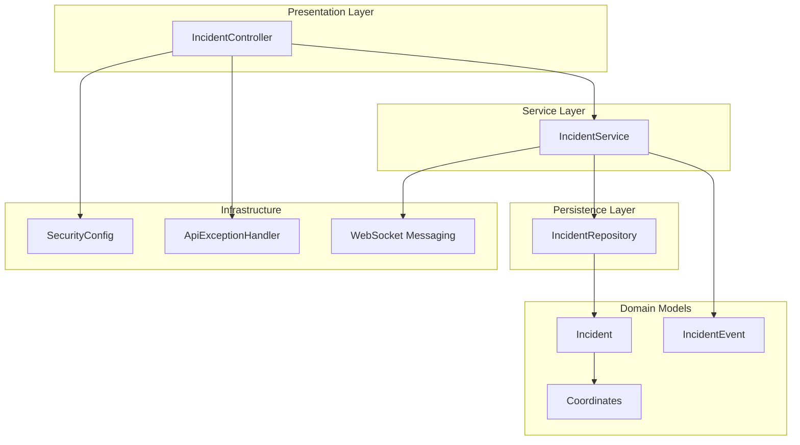
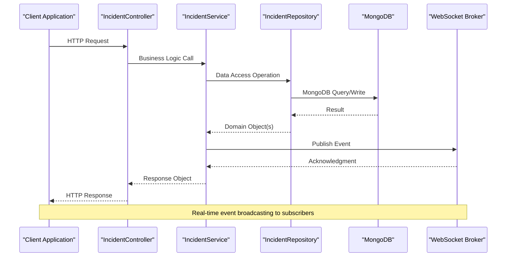
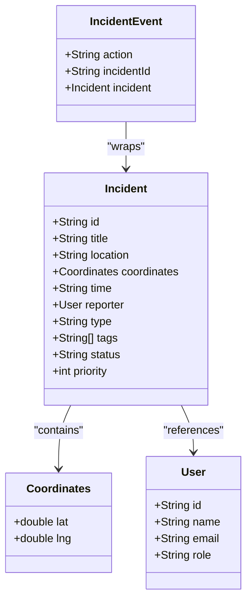
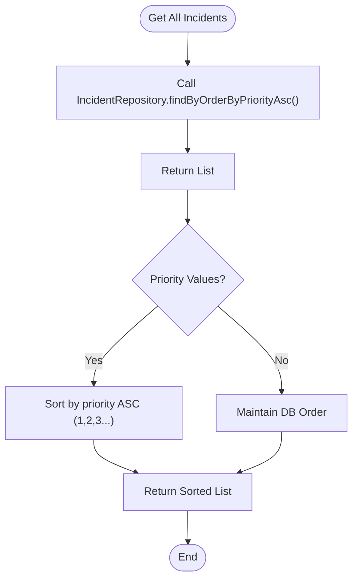
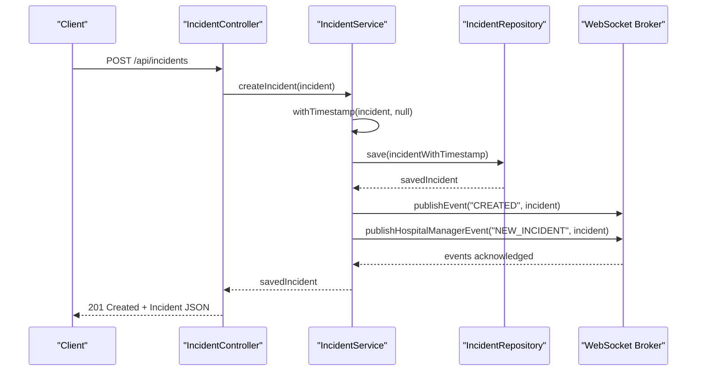
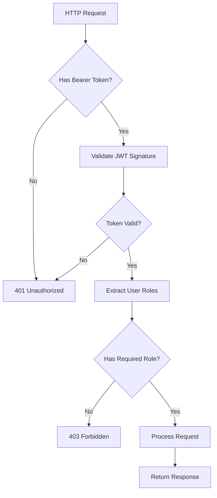
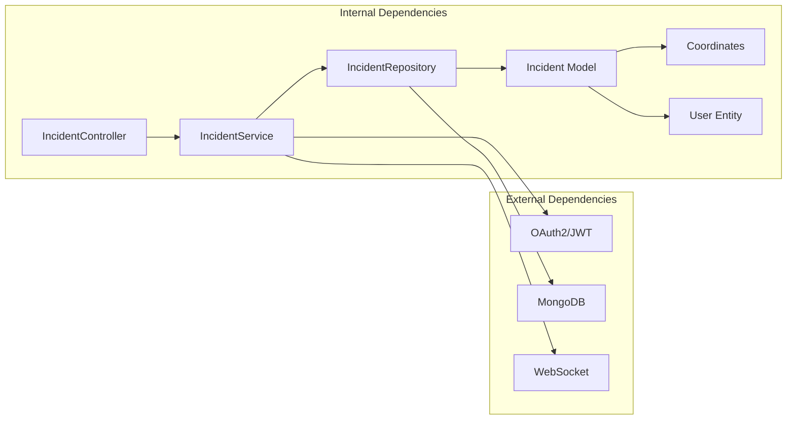

# Incident Management API

<cite>
**Referenced Files in This Document**
- [IncidentController.java](file://src/main/java/com/example/ems_command_center/controller/IncidentController.java)
- [IncidentService.java](file://src/main/java/com/example/ems_command_center/service/IncidentService.java)
- [IncidentRepository.java](file://src/main/java/com/example/ems_command_center/repository/IncidentRepository.java)
- [Incident.java](file://src/main/java/com/example/ems_command_center/model/Incident.java)
- [IncidentEvent.java](file://src/main/java/com/example/ems_command_center/model/IncidentEvent.java)
- [Coordinates.java](file://src/main/java/com/example/ems_command_center/model/Coordinates.java)
- [SecurityConfig.java](file://src/main/java/com/example/ems_command_center/config/SecurityConfig.java)
- [ApiExceptionHandler.java](file://src/main/java/com/example/ems_command_center/config/ApiExceptionHandler.java)
- [application.yml](file://src/main/resources/application.yml)
</cite>

## Table of Contents
1. [Introduction](#introduction)
2. [Project Structure](#project-structure)
3. [Core Components](#core-components)
4. [Architecture Overview](#architecture-overview)
5. [Detailed Component Analysis](#detailed-component-analysis)
6. [Dependency Analysis](#dependency-analysis)
7. [Performance Considerations](#performance-considerations)
8. [Troubleshooting Guide](#troubleshooting-guide)
9. [Conclusion](#conclusion)

## Introduction
This document provides comprehensive API documentation for the incident management endpoints in the EMS Command Center system. It covers the five primary endpoints for managing emergency incidents, including fetching all incidents with priority sorting, retrieving specific incidents, reporting new incidents, updating existing incidents, and deleting incidents. The documentation includes request/response schemas, authentication and authorization requirements, parameter validation rules, example payloads, workflow descriptions, and error handling scenarios with HTTP status codes.

## Project Structure
The incident management functionality is implemented using a Spring Boot REST controller pattern with MongoDB persistence and WebSocket event publishing. The key components are organized as follows:
- Controller layer: Exposes REST endpoints for incident operations
- Service layer: Implements business logic and orchestrates repository operations
- Repository layer: Provides MongoDB data access with custom query methods
- Model layer: Defines domain entities and value objects
- Security configuration: Enforces OAuth2 JWT authentication and role-based authorization
- Exception handling: Centralized error response formatting



**Diagram sources**
- [IncidentController.java:14-60](file://src/main/java/com/example/ems_command_center/controller/IncidentController.java#L14-L60)
- [IncidentService.java:15-105](file://src/main/java/com/example/ems_command_center/service/IncidentService.java#L15-L105)
- [IncidentRepository.java:9-13](file://src/main/java/com/example/ems_command_center/repository/IncidentRepository.java#L9-L13)
- [Incident.java:8-23](file://src/main/java/com/example/ems_command_center/model/Incident.java#L8-L23)
- [Coordinates.java:3](file://src/main/java/com/example/ems_command_center/model/Coordinates.java#L3)
- [IncidentEvent.java:3-8](file://src/main/java/com/example/ems_command_center/model/IncidentEvent.java#L3-L8)
- [SecurityConfig.java:44-98](file://src/main/java/com/example/ems_command_center/config/SecurityConfig.java#L44-L98)
- [ApiExceptionHandler.java:13-26](file://src/main/java/com/example/ems_command_center/config/ApiExceptionHandler.java#L13-L26)

**Section sources**
- [IncidentController.java:14-60](file://src/main/java/com/example/ems_command_center/controller/IncidentController.java#L14-L60)
- [IncidentService.java:15-105](file://src/main/java/com/example/ems_command_center/service/IncidentService.java#L15-L105)
- [IncidentRepository.java:9-13](file://src/main/java/com/example/ems_command_center/repository/IncidentRepository.java#L9-L13)
- [Incident.java:8-23](file://src/main/java/com/example/ems_command_center/model/Incident.java#L8-L23)
- [SecurityConfig.java:44-98](file://src/main/java/com/example/ems_command_center/config/SecurityConfig.java#L44-L98)

## Core Components
This section documents the five incident management endpoints with their complete specifications.

### Endpoint: GET /api/incidents
**Purpose**: Fetch all incidents sorted by priority in ascending order.

**Authentication & Authorization**:
- Requires valid OAuth2 JWT bearer token
- Allowed roles: ADMIN, MANAGER, USER, DRIVER

**Request**:
- Method: GET
- Path: `/api/incidents`
- Headers: Authorization: Bearer {jwt-token}
- Query Parameters: None

**Response**:
- Status Codes:
  - 200 OK: Successful retrieval of incident list
  - 401 Unauthorized: Invalid or missing authentication
  - 403 Forbidden: Insufficient permissions
- Body: Array of Incident objects ordered by priority ascending

**Example Response**:
```json
[
  {
    "id": "string",
    "title": "string",
    "location": "string",
    "coordinates": {"lat": 0.0, "lng": 0.0},
    "time": "string",
    "reporter": {"id": "string", "name": "string", "email": "string", "role": "string"},
    "type": "string",
    "tags": ["string"],
    "status": "string",
    "priority": 0
  }
]
```

**Section sources**
- [IncidentController.java:25-30](file://src/main/java/com/example/ems_command_center/controller/IncidentController.java#L25-L30)
- [IncidentService.java:26-28](file://src/main/java/com/example/ems_command_center/service/IncidentService.java#L26-L28)
- [IncidentRepository.java:12](file://src/main/java/com/example/ems_command_center/repository/IncidentRepository.java#L12)
- [SecurityConfig.java:71-72](file://src/main/java/com/example/ems_command_center/config/SecurityConfig.java#L71-L72)

### Endpoint: GET /api/incidents/by-id/{id}
**Purpose**: Retrieve a specific incident by its identifier.

**Authentication & Authorization**:
- Requires valid OAuth2 JWT bearer token
- Allowed roles: ADMIN, MANAGER, USER, DRIVER

**Request**:
- Method: GET
- Path: `/api/incidents/by-id/{id}`
- Path Parameters:
  - id (required): Incident identifier
- Headers: Authorization: Bearer {jwt-token}

**Response**:
- Status Codes:
  - 200 OK: Successful retrieval
  - 404 Not Found: Incident does not exist
  - 401 Unauthorized: Invalid or missing authentication
  - 403 Forbidden: Insufficient permissions
- Body: Single Incident object

**Example Response**:
```json
{
  "id": "incident-123",
  "title": "Cardiac Arrest",
  "location": "123 Main St",
  "coordinates": {"lat": 40.7128, "lng": -74.0060},
  "time": "2024-01-15 14:30",
  "reporter": {"id": "user-456", "name": "John Doe", "email": "john@example.com", "role": "USER"},
  "type": "urgent",
  "tags": ["cardiac", "adult"],
  "status": "pending",
  "priority": 1
}
```

**Section sources**
- [IncidentController.java:32-37](file://src/main/java/com/example/ems_command_center/controller/IncidentController.java#L32-L37)
- [IncidentService.java:30-33](file://src/main/java/com/example/ems_command_center/service/IncidentService.java#L30-L33)
- [SecurityConfig.java:71-72](file://src/main/java/com/example/ems_command_center/config/SecurityConfig.java#L71-L72)

### Endpoint: POST /api/incidents
**Purpose**: Report a new incident to the system.

**Authentication & Authorization**:
- Requires valid OAuth2 JWT bearer token
- Allowed roles: ADMIN, MANAGER, USER, DRIVER

**Request**:
- Method: POST
- Path: `/api/incidents`
- Headers: Authorization: Bearer {jwt-token}
- Content-Type: application/json
- Body: Partial Incident object (id is optional and will be generated)

**Request Schema**:
```json
{
  "title": "string",
  "location": "string",
  "coordinates": {"lat": 0.0, "lng": 0.0},
  "reporter": {"id": "string"},
  "type": "string",
  "tags": ["string"],
  "status": "string",
  "priority": 0
}
```

**Response**:
- Status Codes:
  - 201 Created: Successful creation
  - 400 Bad Request: Invalid request payload
  - 401 Unauthorized: Invalid or missing authentication
  - 403 Forbidden: Insufficient permissions
- Body: Newly created Incident object with generated id and timestamp

**Example Request**:
```json
{
  "title": "Vehicle Accident",
  "location": "Intersection of Oak Ave and Pine St",
  "coordinates": {"lat": 34.0522, "lng": -118.2437},
  "reporter": {"id": "user-789"},
  "type": "normal",
  "tags": ["accident", "vehicle"],
  "status": "reported",
  "priority": 3
}
```

**Section sources**
- [IncidentController.java:39-44](file://src/main/java/com/example/ems_command_center/controller/IncidentController.java#L39-L44)
- [IncidentService.java:35-40](file://src/main/java/com/example/ems_command_center/service/IncidentService.java#L35-L40)
- [SecurityConfig.java:75-76](file://src/main/java/com/example/ems_command_center/config/SecurityConfig.java#L75-L76)

### Endpoint: PUT /api/incidents/{id}
**Purpose**: Update an existing incident's details.

**Authentication & Authorization**:
- Requires valid OAuth2 JWT bearer token
- Allowed roles: ADMIN, MANAGER

**Request**:
- Method: PUT
- Path: `/api/incidents/{id}`
- Path Parameters:
  - id (required): Incident identifier to update
- Headers: Authorization: Bearer {jwt-token}
- Content-Type: application/json
- Body: Complete Incident object with updated fields

**Response**:
- Status Codes:
  - 200 OK: Successful update
  - 404 Not Found: Incident does not exist
  - 401 Unauthorized: Invalid or missing authentication
  - 403 Forbidden: Insufficient permissions
- Body: Updated Incident object

**Example Response**:
```json
{
  "id": "incident-123",
  "title": "Cardiac Arrest - Updated",
  "location": "123 Main St",
  "coordinates": {"lat": 40.7128, "lng": -74.0060},
  "time": "2024-01-15 14:30",
  "reporter": {"id": "user-456", "name": "John Doe", "email": "john@example.com", "role": "USER"},
  "type": "urgent",
  "tags": ["cardiac", "adult", "updated"],
  "status": "dispatched",
  "priority": 1
}
```

**Section sources**
- [IncidentController.java:46-51](file://src/main/java/com/example/ems_command_center/controller/IncidentController.java#L46-L51)
- [IncidentService.java:42-49](file://src/main/java/com/example/ems_command_center/service/IncidentService.java#L42-L49)
- [SecurityConfig.java:84-86](file://src/main/java/com/example/ems_command_center/config/SecurityConfig.java#L84-L86)

### Endpoint: DELETE /api/incidents/{id}
**Purpose**: Remove an incident from the system.

**Authentication & Authorization**:
- Requires valid OAuth2 JWT bearer token
- Allowed roles: ADMIN, MANAGER

**Request**:
- Method: DELETE
- Path: `/api/incidents/{id}`
- Path Parameters:
  - id (required): Incident identifier to delete
- Headers: Authorization: Bearer {jwt-token}

**Response**:
- Status Codes:
  - 204 No Content: Successful deletion
  - 404 Not Found: Incident does not exist
  - 401 Unauthorized: Invalid or missing authentication
  - 403 Forbidden: Insufficient permissions
- Body: Empty

**Section sources**
- [IncidentController.java:53-59](file://src/main/java/com/example/ems_command_center/controller/IncidentController.java#L53-L59)
- [IncidentService.java:52-59](file://src/main/java/com/example/ems_command_center/service/IncidentService.java#L52-L59)
- [SecurityConfig.java:87-88](file://src/main/java/com/example/ems_command_center/config/SecurityConfig.java#L87-L88)

## Architecture Overview
The incident management system follows a layered architecture with clear separation of concerns:



**Diagram sources**
- [IncidentController.java:19-23](file://src/main/java/com/example/ems_command_center/controller/IncidentController.java#L19-L23)
- [IncidentService.java:18-24](file://src/main/java/com/example/ems_command_center/service/IncidentService.java#L18-L24)
- [IncidentRepository.java:10-13](file://src/main/java/com/example/ems_command_center/repository/IncidentRepository.java#L10-L13)

### Data Model
The Incident entity encapsulates all relevant information about emergency incidents:



**Diagram sources**
- [Incident.java:9-21](file://src/main/java/com/example/ems_command_center/model/Incident.java#L9-L21)
- [Coordinates.java:3](file://src/main/java/com/example/ems_command_center/model/Coordinates.java#L3)
- [User.java:9-57](file://src/main/java/com/example/ems_command_center/model/User.java#L9-L57)
- [IncidentEvent.java:3-8](file://src/main/java/com/example/ems_command_center/model/IncidentEvent.java#L3-L8)

## Detailed Component Analysis

### Priority-Based Sorting Logic
The system implements priority-based sorting for incident retrieval:



**Diagram sources**
- [IncidentRepository.java:12](file://src/main/java/com/example/ems_command_center/repository/IncidentRepository.java#L12)
- [IncidentService.java:26-28](file://src/main/java/com/example/ems_command_center/service/IncidentService.java#L26-L28)

**Section sources**
- [IncidentRepository.java:12](file://src/main/java/com/example/ems_command_center/repository/IncidentRepository.java#L12)
- [IncidentService.java:26-28](file://src/main/java/com/example/ems_command_center/service/IncidentService.java#L26-L28)

### Incident Creation Workflow
The incident creation process includes automatic timestamp generation and real-time event broadcasting:



**Diagram sources**
- [IncidentController.java:39-44](file://src/main/java/com/example/ems_command_center/controller/IncidentController.java#L39-L44)
- [IncidentService.java:35-40](file://src/main/java/com/example/ems_command_center/service/IncidentService.java#L35-L40)
- [IncidentService.java:85-104](file://src/main/java/com/example/ems_command_center/service/IncidentService.java#L85-L104)

**Section sources**
- [IncidentService.java:35-40](file://src/main/java/com/example/ems_command_center/service/IncidentService.java#L35-L40)
- [IncidentService.java:65-82](file://src/main/java/com/example/ems_command_center/service/IncidentService.java#L65-L82)

### Authentication and Authorization
The system uses OAuth2 JWT authentication with role-based access control:



**Diagram sources**
- [SecurityConfig.java:44-98](file://src/main/java/com/example/ems_command_center/config/SecurityConfig.java#L44-L98)
- [SecurityConfig.java:138-154](file://src/main/java/com/example/ems_command_center/config/SecurityConfig.java#L138-L154)

**Section sources**
- [SecurityConfig.java:71-88](file://src/main/java/com/example/ems_command_center/config/SecurityConfig.java#L71-L88)
- [SecurityConfig.java:138-154](file://src/main/java/com/example/ems_command_center/config/SecurityConfig.java#L138-L154)

## Dependency Analysis
The incident management module has the following dependencies:



**Diagram sources**
- [IncidentController.java:19-23](file://src/main/java/com/example/ems_command_center/controller/IncidentController.java#L19-L23)
- [IncidentService.java:18-24](file://src/main/java/com/example/ems_command_center/service/IncidentService.java#L18-L24)
- [IncidentRepository.java:10-13](file://src/main/java/com/example/ems_command_center/repository/IncidentRepository.java#L10-L13)
- [Incident.java:15-16](file://src/main/java/com/example/ems_command_center/model/Incident.java#L15-L16)

**Section sources**
- [IncidentController.java:19-23](file://src/main/java/com/example/ems_command_center/controller/IncidentController.java#L19-L23)
- [IncidentService.java:18-24](file://src/main/java/com/example/ems_command_center/service/IncidentService.java#L18-L24)
- [IncidentRepository.java:10-13](file://src/main/java/com/example/ems_command_center/repository/IncidentRepository.java#L10-L13)

## Performance Considerations
- Database queries use native MongoDB repository methods for efficient sorting
- WebSocket event publishing occurs asynchronously after successful database operations
- Pagination is not implemented; consider adding limit/skip parameters for large datasets
- Indexing on priority field could improve sorting performance
- Consider implementing caching for frequently accessed incident lists

## Troubleshooting Guide

### Common Error Scenarios
1. **Authentication Failures**
   - Symptom: 401 Unauthorized responses
   - Cause: Invalid, expired, or missing JWT token
   - Solution: Obtain valid access token from Keycloak and include in Authorization header

2. **Authorization Failures**
   - Symptom: 403 Forbidden responses
   - Cause: Insufficient user roles for requested operation
   - Solution: Ensure user has required role (ADMIN, MANAGER, USER, or DRIVER)

3. **Resource Not Found**
   - Symptom: 404 Not Found for GET/PUT/DELETE requests
   - Cause: Non-existent incident ID
   - Solution: Verify incident ID exists in the system

4. **Validation Errors**
   - Symptom: 400 Bad Request
   - Cause: Invalid JSON payload or missing required fields
   - Solution: Validate against the incident schema before sending requests

### Error Response Format
All errors follow a standardized JSON format:
```json
{
  "timestamp": "2024-01-15T10:30:00Z",
  "status": 404,
  "error": "Not Found",
  "message": "Incident not found"
}
```

**Section sources**
- [ApiExceptionHandler.java:16-25](file://src/main/java/com/example/ems_command_center/config/ApiExceptionHandler.java#L16-L25)
- [IncidentService.java:32](file://src/main/java/com/example/ems_command_center/service/IncidentService.java#L32)
- [IncidentService.java:43](file://src/main/java/com/example/ems_command_center/service/IncidentService.java#L43)
- [IncidentService.java:53](file://src/main/java/com/example/ems_command_center/service/IncidentService.java#L53)

## Conclusion
The incident management API provides a robust foundation for emergency incident handling with proper authentication, authorization, and real-time event broadcasting. The system supports all essential CRUD operations with priority-based sorting and comprehensive error handling. Future enhancements could include request validation, pagination for large datasets, and additional filtering capabilities.