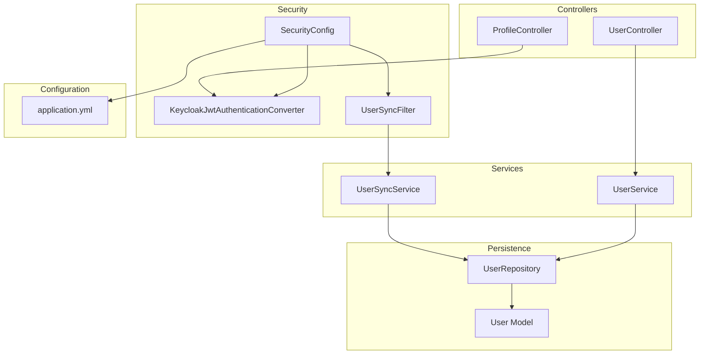
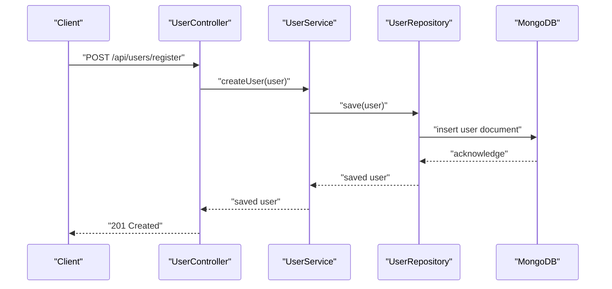
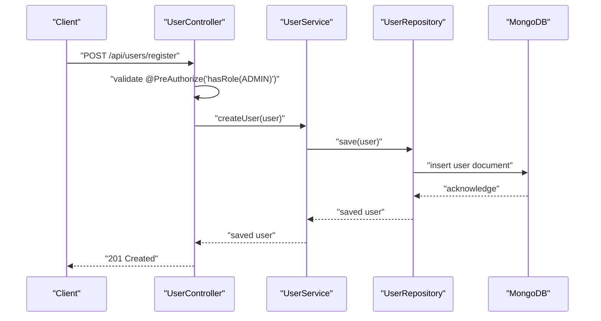
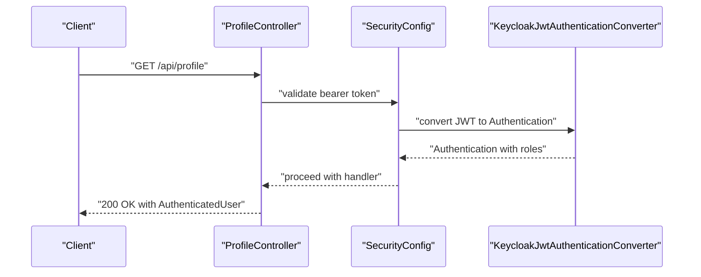
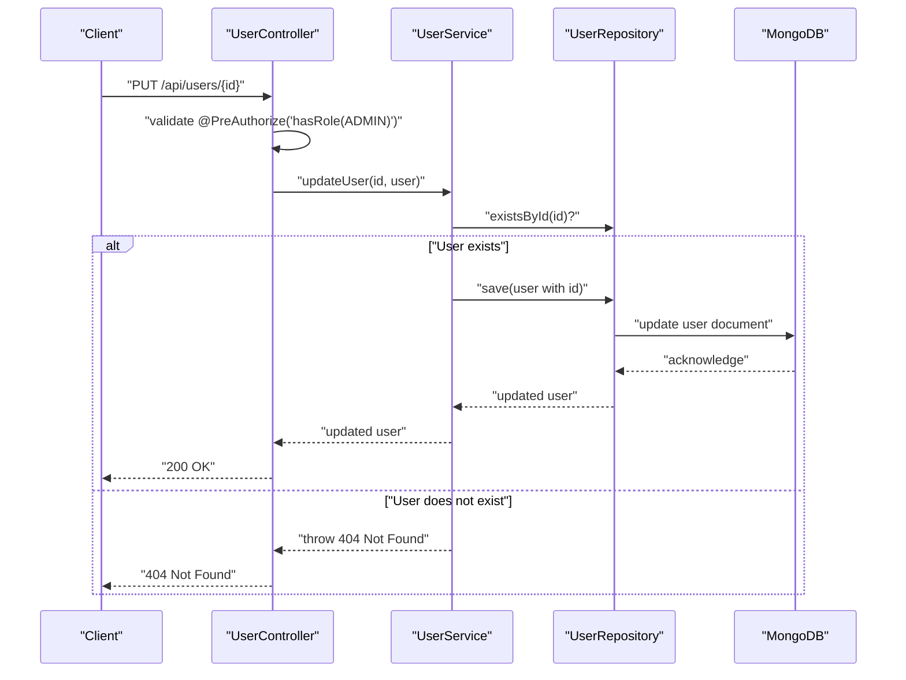
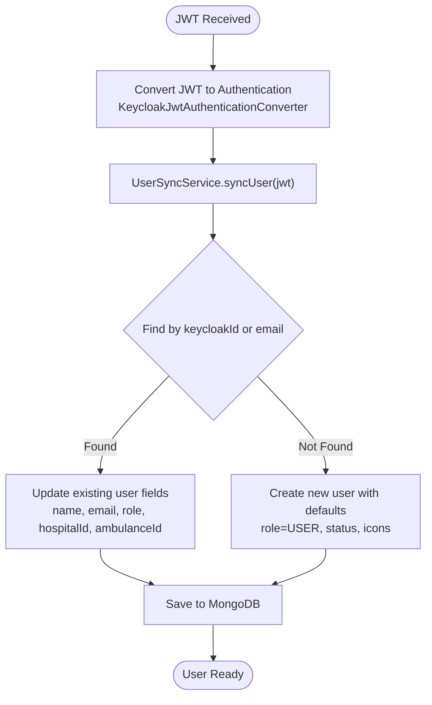
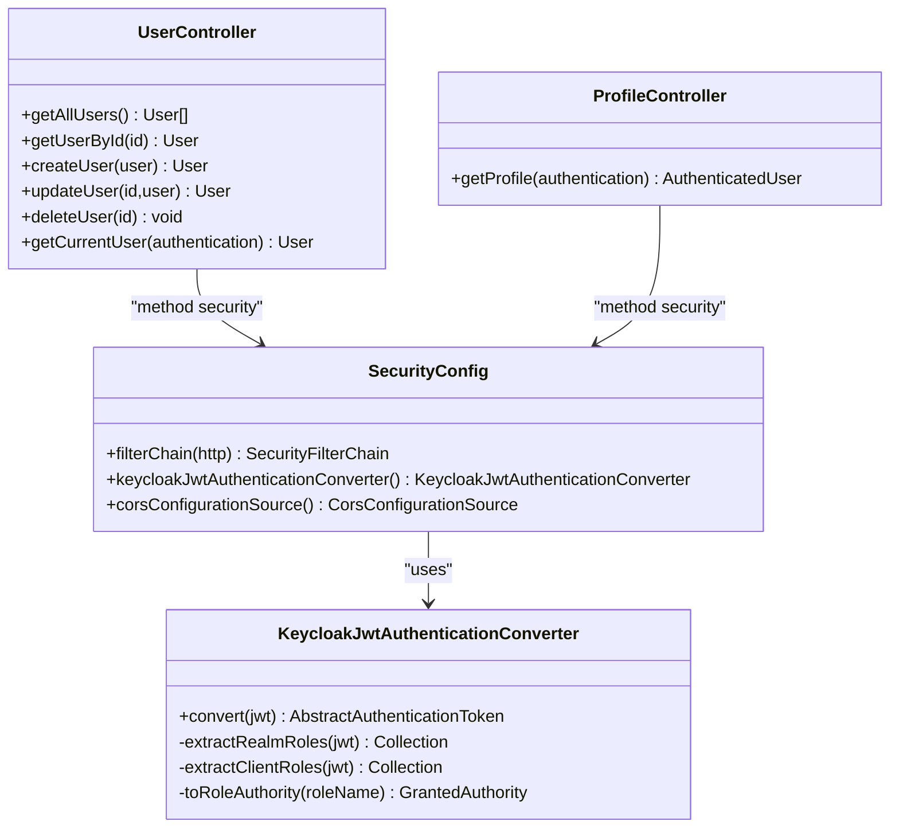
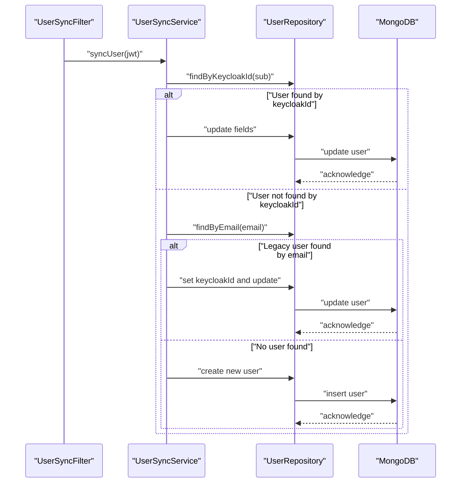
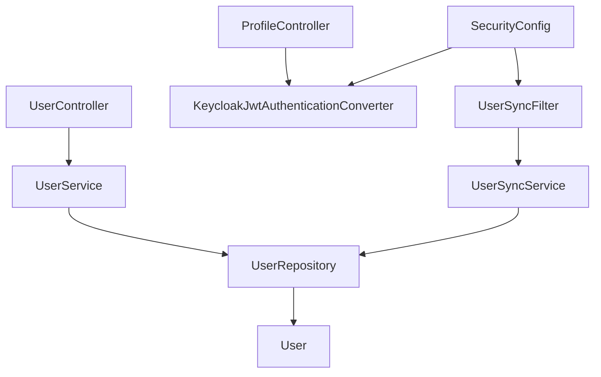

# User Management API

<cite>
**Referenced Files in This Document**
- [UserController.java](file://src/main/java/com/example/ems_command_center/controller/UserController.java)
- [ProfileController.java](file://src/main/java/com/example/ems_command_center/controller/ProfileController.java)
- [UserService.java](file://src/main/java/com/example/ems_command_center/service/UserService.java)
- [UserSyncService.java](file://src/main/java/com/example/ems_command_center/service/UserSyncService.java)
- [UserSyncFilter.java](file://src/main/java/com/example/ems_command_center/config/UserSyncFilter.java)
- [SecurityConfig.java](file://src/main/java/com/example/ems_command_center/config/SecurityConfig.java)
- [KeycloakJwtAuthenticationConverter.java](file://src/main/java/com/example/ems_command_center/config/KeycloakJwtAuthenticationConverter.java)
- [UserRepository.java](file://src/main/java/com/example/ems_command_center/repository/UserRepository.java)
- [User.java](file://src/main/java/com/example/ems_command_center/model/User.java)
- [AuthenticatedUser.java](file://src/main/java/com/example/ems_command_center/model/AuthenticatedUser.java)
- [application.yml](file://src/main/resources/application.yml)
</cite>

## Table of Contents
1. [Introduction](#introduction)
2. [Project Structure](#project-structure)
3. [Core Components](#core-components)
4. [Architecture Overview](#architecture-overview)
5. [Detailed Component Analysis](#detailed-component-analysis)
6. [Dependency Analysis](#dependency-analysis)
7. [Performance Considerations](#performance-considerations)
8. [Troubleshooting Guide](#troubleshooting-guide)
9. [Conclusion](#conclusion)

## Introduction
This document provides comprehensive API documentation for user management endpoints in the EMS Command Center system. It covers user registration, profile management, role assignment, and authentication integration with Keycloak. The documentation focuses on the following endpoints:
- POST /api/users/register (user registration)
- GET /api/users/profile (user profile retrieval)
- PUT /api/users/{id} (profile updates)
- Role management endpoints

It also documents the user creation workflow, Keycloak integration for authentication, role-based access control mechanisms, and user synchronization processes, including user data validation, authentication requirements, and permission-based endpoint access.

## Project Structure
The user management functionality is implemented using Spring MVC controllers, Spring Security for authentication and authorization, and Spring Data MongoDB for persistence. Key components include:
- Controllers: UserController for user CRUD operations and ProfileController for retrieving authenticated user information
- Services: UserService for business logic and UserSyncService for synchronizing Keycloak users with the local database
- Security: SecurityConfig for OAuth2 Resource Server configuration, JWT conversion, CORS, and method-level authorization
- Models: User entity and AuthenticatedUser DTO for API responses
- Repositories: UserRepository for MongoDB operations

**Diagram sources**
- [UserController.java:17-91](file://src/main/java/com/example/ems_command_center/controller/UserController.java#L17-L91)
- [ProfileController.java:17-45](file://src/main/java/com/example/ems_command_center/controller/ProfileController.java#L17-L45)
- [UserService.java:13-102](file://src/main/java/com/example/ems_command_center/service/UserService.java#L13-L102)
- [UserSyncService.java:16-181](file://src/main/java/com/example/ems_command_center/service/UserSyncService.java#L16-L181)
- [SecurityConfig.java:26-97](file://src/main/java/com/example/ems_command_center/config/SecurityConfig.java#L26-L97)
- [KeycloakJwtAuthenticationConverter.java:18-87](file://src/main/java/com/example/ems_command_center/config/KeycloakJwtAuthenticationConverter.java#L18-L87)
- [UserSyncFilter.java:17-50](file://src/main/java/com/example/ems_command_center/config/UserSyncFilter.java#L17-L50)
- [UserRepository.java:8-14](file://src/main/java/com/example/ems_command_center/repository/UserRepository.java#L8-L14)
- [User.java:8-187](file://src/main/java/com/example/ems_command_center/model/User.java#L8-L187)
- [application.yml:1-36](file://src/main/resources/application.yml#L1-L36)

**Section sources**
- [UserController.java:17-91](file://src/main/java/com/example/ems_command_center/controller/UserController.java#L17-L91)
- [UserService.java:13-102](file://src/main/java/com/example/ems_command_center/service/UserService.java#L13-L102)
- [SecurityConfig.java:26-97](file://src/main/java/com/example/ems_command_center/config/SecurityConfig.java#L26-L97)
- [application.yml:1-36](file://src/main/resources/application.yml#L1-L36)

## Core Components
This section outlines the primary components involved in user management and authentication.

- UserController: Exposes endpoints for listing, retrieving, creating, updating, and deleting users. It enforces role-based access control using Spring Security annotations.
- ProfileController: Provides authenticated user profile information, including roles extracted from the JWT.
- UserService: Implements business logic for user operations, including fetching users by ID, role, email, and Keycloak ID, and driver assignment retrieval.
- UserSyncService: Synchronizes Keycloak users with the local MongoDB database, creating or updating user records based on JWT claims.
- SecurityConfig: Configures OAuth2 Resource Server, JWT authentication converter, CORS, and method-level authorization rules.
- KeycloakJwtAuthenticationConverter: Converts Keycloak JWT tokens to Spring Security authentication with realm and client roles.
- UserSyncFilter: A filter that triggers user synchronization after successful JWT authentication.
- UserRepository: Spring Data MongoDB repository for user queries.
- User: MongoDB entity representing user data with indexed fields for email and Keycloak ID.
- AuthenticatedUser: DTO for returning profile information derived from the JWT.

**Section sources**
- [UserController.java:17-91](file://src/main/java/com/example/ems_command_center/controller/UserController.java#L17-L91)
- [ProfileController.java:17-45](file://src/main/java/com/example/ems_command_center/controller/ProfileController.java#L17-L45)
- [UserService.java:13-102](file://src/main/java/com/example/ems_command_center/service/UserService.java#L13-L102)
- [UserSyncService.java:16-181](file://src/main/java/com/example/ems_command_center/service/UserSyncService.java#L16-L181)
- [SecurityConfig.java:26-97](file://src/main/java/com/example/ems_command_center/config/SecurityConfig.java#L26-L97)
- [KeycloakJwtAuthenticationConverter.java:18-87](file://src/main/java/com/example/ems_command_center/config/KeycloakJwtAuthenticationConverter.java#L18-L87)
- [UserSyncFilter.java:17-50](file://src/main/java/com/example/ems_command_center/config/UserSyncFilter.java#L17-L50)
- [UserRepository.java:8-14](file://src/main/java/com/example/ems_command_center/repository/UserRepository.java#L8-L14)
- [User.java:8-187](file://src/main/java/com/example/ems_command_center/model/User.java#L8-L187)
- [AuthenticatedUser.java:5-15](file://src/main/java/com/example/ems_command_center/model/AuthenticatedUser.java#L5-L15)

## Architecture Overview
The user management API follows a layered architecture with clear separation of concerns:
- Presentation Layer: Controllers handle HTTP requests and responses.
- Application Layer: Services encapsulate business logic and coordinate between repositories and external systems.
- Persistence Layer: MongoDB stores user data with unique indexes on email and Keycloak ID.
- Security Layer: OAuth2 Resource Server validates JWT tokens, converts them to Spring Security authentication, and enforces method-level authorization.

**Diagram sources**
- [UserController.java:49-55](file://src/main/java/com/example/ems_command_center/controller/UserController.java#L49-L55)
- [UserService.java:36-38](file://src/main/java/com/example/ems_command_center/service/UserService.java#L36-L38)
- [UserRepository.java:8-14](file://src/main/java/com/example/ems_command_center/repository/UserRepository.java#L8-L14)
- [User.java:8-187](file://src/main/java/com/example/ems_command_center/model/User.java#L8-L187)

**Section sources**
- [UserController.java:17-91](file://src/main/java/com/example/ems_command_center/controller/UserController.java#L17-L91)
- [UserService.java:13-102](file://src/main/java/com/example/ems_command_center/service/UserService.java#L13-L102)
- [SecurityConfig.java:44-97](file://src/main/java/com/example/ems_command_center/config/SecurityConfig.java#L44-L97)

## Detailed Component Analysis

### User Registration Endpoint
- Endpoint: POST /api/users/register
- Description: Creates a new user in the system. Requires ADMIN role for access.
- Request Body: User object containing user details (name, email, role, etc.).
- Response: 201 Created with the created User object.
- Security: Pre-authorizes ADMIN role using @PreAuthorize("hasRole('ADMIN')").

**Diagram sources**
- [UserController.java:49-55](file://src/main/java/com/example/ems_command_center/controller/UserController.java#L49-L55)
- [UserService.java:36-38](file://src/main/java/com/example/ems_command_center/service/UserService.java#L36-L38)
- [UserRepository.java:8-14](file://src/main/java/com/example/ems_command_center/repository/UserRepository.java#L8-L14)

**Section sources**
- [UserController.java:49-55](file://src/main/java/com/example/ems_command_center/controller/UserController.java#L49-L55)
- [UserService.java:36-38](file://src/main/java/com/example/ems_command_center/service/UserService.java#L36-L38)

### User Profile Retrieval Endpoint
- Endpoint: GET /api/users/profile
- Description: Retrieves the authenticated user's profile information from Keycloak JWT claims.
- Response: 200 OK with AuthenticatedUser DTO containing username, subject, email, names, roles, and optional hospital/ambulance IDs.
- Security: Requires authenticated user via @PreAuthorize("isAuthenticated()").

**Diagram sources**
- [ProfileController.java:22-44](file://src/main/java/com/example/ems_command_center/controller/ProfileController.java#L22-L44)
- [SecurityConfig.java:93-95](file://src/main/java/com/example/ems_command_center/config/SecurityConfig.java#L93-L95)
- [KeycloakJwtAuthenticationConverter.java:29-41](file://src/main/java/com/example/ems_command_center/config/KeycloakJwtAuthenticationConverter.java#L29-L41)

**Section sources**
- [ProfileController.java:17-45](file://src/main/java/com/example/ems_command_center/controller/ProfileController.java#L17-L45)
- [AuthenticatedUser.java:5-15](file://src/main/java/com/example/ems_command_center/model/AuthenticatedUser.java#L5-L15)
- [SecurityConfig.java:138-154](file://src/main/java/com/example/ems_command_center/config/SecurityConfig.java#L138-L154)

### User Profile Update Endpoint
- Endpoint: PUT /api/users/{id}
- Description: Updates an existing user's information. Requires ADMIN role for access.
- Path Parameter: id - User identifier.
- Request Body: Partial or complete User object.
- Response: 200 OK with the updated User object.
- Security: Pre-authorizes ADMIN role using @PreAuthorize("hasRole('ADMIN')").

**Diagram sources**
- [UserController.java:57-62](file://src/main/java/com/example/ems_command_center/controller/UserController.java#L57-L62)
- [UserService.java:40-53](file://src/main/java/com/example/ems_command_center/service/UserService.java#L40-L53)
- [UserRepository.java:8-14](file://src/main/java/com/example/ems_command_center/repository/UserRepository.java#L8-L14)

**Section sources**
- [UserController.java:57-62](file://src/main/java/com/example/ems_command_center/controller/UserController.java#L57-L62)
- [UserService.java:40-53](file://src/main/java/com/example/ems_command_center/service/UserService.java#L40-L53)

### Role Management Endpoints
- GET /api/users: Lists all users. Requires ADMIN or MANAGER role.
- GET /api/users/{id}: Retrieves a user by ID. Requires ADMIN or MANAGER role.
- GET /api/users/role/{role}: Retrieves users by role. Requires ADMIN or MANAGER role.
- DELETE /api/users/{id}: Deletes a user. Requires ADMIN role.

These endpoints enforce role-based access control using @PreAuthorize annotations and are secured by method-level security configured in SecurityConfig.

**Section sources**
- [UserController.java:28-70](file://src/main/java/com/example/ems_command_center/controller/UserController.java#L28-L70)
- [SecurityConfig.java:64-68](file://src/main/java/com/example/ems_command_center/config/SecurityConfig.java#L64-L68)

### User Creation Workflow and Keycloak Integration
The user creation workflow integrates with Keycloak for authentication and role management:
1. Authentication: Clients authenticate with Keycloak and receive JWT tokens.
2. Authorization: SecurityConfig validates JWT tokens and applies method-level authorization.
3. User Synchronization: UserSyncFilter triggers UserSyncService to synchronize Keycloak users with the local database.
4. Role Assignment: UserSyncService extracts roles from JWT claims and assigns appropriate roles to users.

**Diagram sources**
- [KeycloakJwtAuthenticationConverter.java:29-41](file://src/main/java/com/example/ems_command_center/config/KeycloakJwtAuthenticationConverter.java#L29-L41)
- [UserSyncService.java:30-61](file://src/main/java/com/example/ems_command_center/service/UserSyncService.java#L30-L61)
- [UserSyncFilter.java:26-42](file://src/main/java/com/example/ems_command_center/config/UserSyncFilter.java#L26-L42)
- [UserRepository.java:8-14](file://src/main/java/com/example/ems_command_center/repository/UserRepository.java#L8-L14)

**Section sources**
- [SecurityConfig.java:93-95](file://src/main/java/com/example/ems_command_center/config/SecurityConfig.java#L93-L95)
- [KeycloakJwtAuthenticationConverter.java:18-87](file://src/main/java/com/example/ems_command_center/config/KeycloakJwtAuthenticationConverter.java#L18-L87)
- [UserSyncService.java:16-181](file://src/main/java/com/example/ems_command_center/service/UserSyncService.java#L16-L181)
- [UserSyncFilter.java:17-50](file://src/main/java/com/example/ems_command_center/config/UserSyncFilter.java#L17-L50)

### Role-Based Access Control Mechanisms
The system implements role-based access control using Spring Security:
- Method-Level Security: @PreAuthorize annotations on controllers enforce role requirements per endpoint.
- Request-Level Security: SecurityConfig defines authorization rules for HTTP paths and methods.
- JWT Roles: KeycloakJwtAuthenticationConverter extracts realm and client roles from JWT and maps them to ROLE_* authorities.

**Diagram sources**
- [SecurityConfig.java:26-97](file://src/main/java/com/example/ems_command_center/config/SecurityConfig.java#L26-L97)
- [KeycloakJwtAuthenticationConverter.java:18-87](file://src/main/java/com/example/ems_command_center/config/KeycloakJwtAuthenticationConverter.java#L18-L87)
- [UserController.java:17-91](file://src/main/java/com/example/ems_command_center/controller/UserController.java#L17-L91)
- [ProfileController.java:17-45](file://src/main/java/com/example/ems_command_center/controller/ProfileController.java#L17-L45)

**Section sources**
- [SecurityConfig.java:26-97](file://src/main/java/com/example/ems_command_center/config/SecurityConfig.java#L26-L97)
- [KeycloakJwtAuthenticationConverter.java:18-87](file://src/main/java/com/example/ems_command_center/config/KeycloakJwtAuthenticationConverter.java#L18-L87)
- [UserController.java:17-91](file://src/main/java/com/example/ems_command_center/controller/UserController.java#L17-L91)
- [ProfileController.java:17-45](file://src/main/java/com/example/ems_command_center/controller/ProfileController.java#L17-L45)

### User Synchronization Processes
User synchronization ensures that Keycloak users are represented in the local database:
- Trigger: UserSyncFilter runs after JWT authentication to synchronize users.
- Matching: Searches by keycloakId first, then falls back to email for legacy users.
- Updates: Updates name, email, role, and association fields (hospitalId, ambulanceId) based on JWT claims.
- Defaults: Creates new users with default role USER, status, and UI attributes if not found.

**Diagram sources**
- [UserSyncFilter.java:26-42](file://src/main/java/com/example/ems_command_center/config/UserSyncFilter.java#L26-L42)
- [UserSyncService.java:30-61](file://src/main/java/com/example/ems_command_center/service/UserSyncService.java#L30-L61)
- [UserRepository.java:8-14](file://src/main/java/com/example/ems_command_center/repository/UserRepository.java#L8-L14)

**Section sources**
- [UserSyncFilter.java:17-50](file://src/main/java/com/example/ems_command_center/config/UserSyncFilter.java#L17-L50)
- [UserSyncService.java:16-181](file://src/main/java/com/example/ems_command_center/service/UserSyncService.java#L16-L181)
- [UserRepository.java:8-14](file://src/main/java/com/example/ems_command_center/repository/UserRepository.java#L8-L14)

## Dependency Analysis
The user management module exhibits clear dependency relationships:
- Controllers depend on Services for business logic.
- Services depend on Repositories for data access.
- Security configuration depends on JWT converters and filters.
- User synchronization depends on JWT claims and repository operations.

**Diagram sources**
- [UserController.java:22-26](file://src/main/java/com/example/ems_command_center/controller/UserController.java#L22-L26)
- [UserService.java:15-21](file://src/main/java/com/example/ems_command_center/service/UserService.java#L15-L21)
- [SecurityConfig.java:37-41](file://src/main/java/com/example/ems_command_center/config/SecurityConfig.java#L37-L41)
- [UserSyncFilter.java:20-24](file://src/main/java/com/example/ems_command_center/config/UserSyncFilter.java#L20-L24)
- [UserSyncService.java:19-23](file://src/main/java/com/example/ems_command_center/service/UserSyncService.java#L19-L23)
- [UserRepository.java:8-14](file://src/main/java/com/example/ems_command_center/repository/UserRepository.java#L8-L14)
- [User.java:8-187](file://src/main/java/com/example/ems_command_center/model/User.java#L8-L187)

**Section sources**
- [UserController.java:17-91](file://src/main/java/com/example/ems_command_center/controller/UserController.java#L17-L91)
- [UserService.java:13-102](file://src/main/java/com/example/ems_command_center/service/UserService.java#L13-L102)
- [SecurityConfig.java:26-97](file://src/main/java/com/example/ems_command_center/config/SecurityConfig.java#L26-L97)
- [UserSyncService.java:16-181](file://src/main/java/com/example/ems_command_center/service/UserSyncService.java#L16-L181)

## Performance Considerations
- JWT Validation: Centralized JWT validation and role extraction minimize repeated computations.
- Repository Queries: Unique indexes on email and keycloakId optimize lookup performance.
- Synchronization Efficiency: UserSyncService minimizes database writes by checking for changes before saving.
- Stateless Design: OAuth2 Resource Server with stateless sessions reduces server overhead.

## Troubleshooting Guide
Common issues and resolutions:
- Authentication Failures: Verify KEYCLOAK_JWK_SET_URI and ensure the client has a valid access token.
- Authorization Errors: Confirm user roles in Keycloak and that KeycloakJwtAuthenticationConverter is properly extracting roles.
- User Not Found: Check that UserSyncService has synchronized the user; verify keycloakId and email uniqueness.
- CORS Issues: Ensure allowed origins in SecurityConfig match the frontend origin.

**Section sources**
- [SecurityConfig.java:138-154](file://src/main/java/com/example/ems_command_center/config/SecurityConfig.java#L138-L154)
- [application.yml:10-17](file://src/main/resources/application.yml#L10-L17)

## Conclusion
The user management API provides a robust foundation for user registration, profile management, role assignment, and authentication integration with Keycloak. The architecture leverages Spring Security for comprehensive authorization, Spring Data MongoDB for efficient persistence, and a synchronization mechanism to keep user data consistent between Keycloak and the local database. The documented endpoints and workflows enable secure and scalable user management within the EMS Command Center ecosystem.