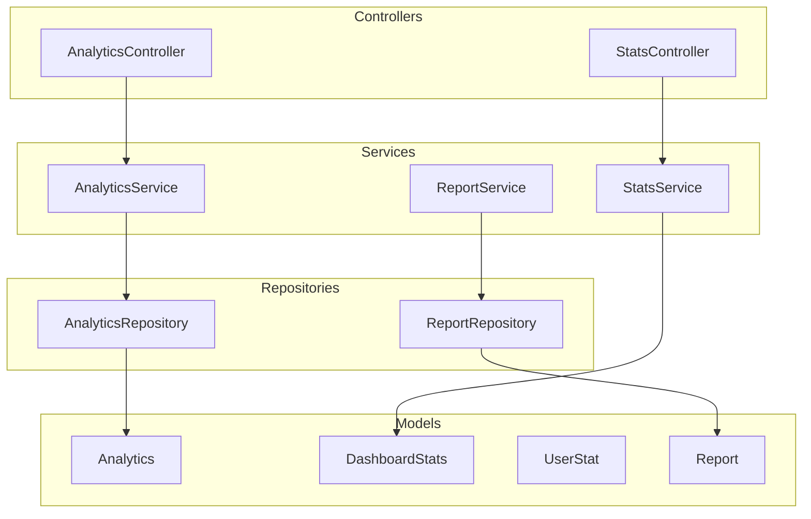
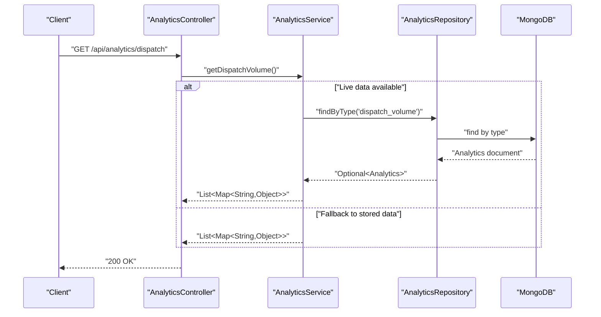
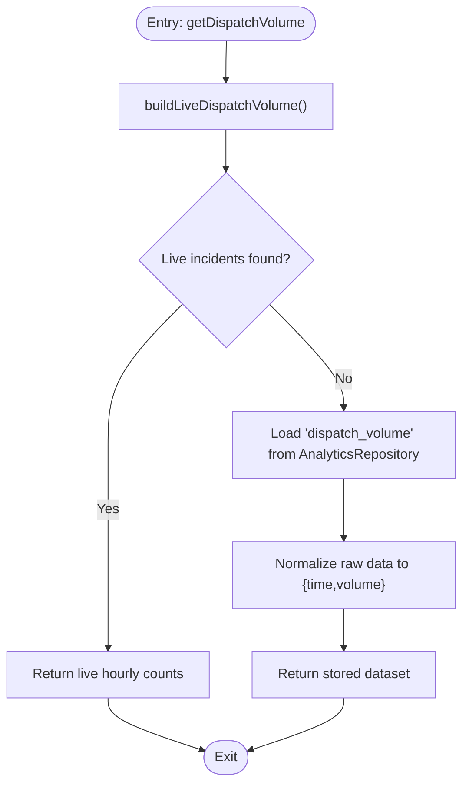
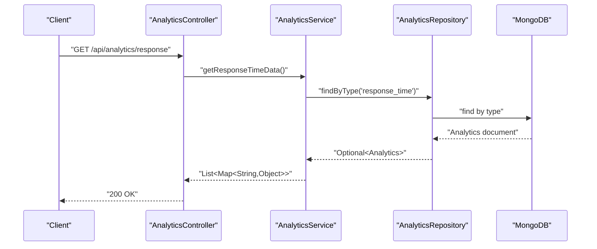
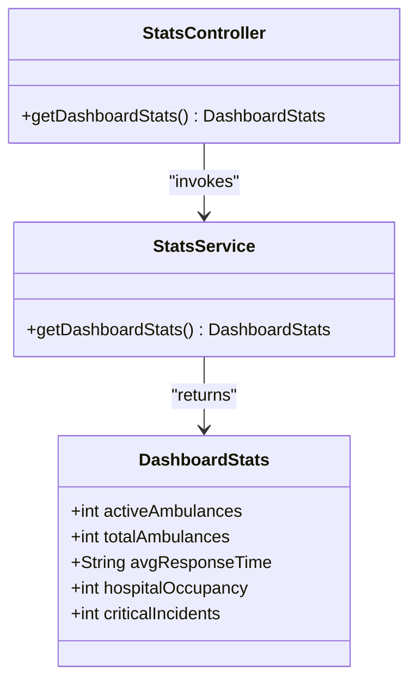
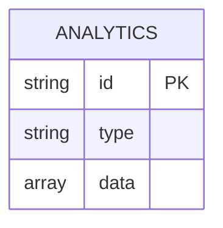
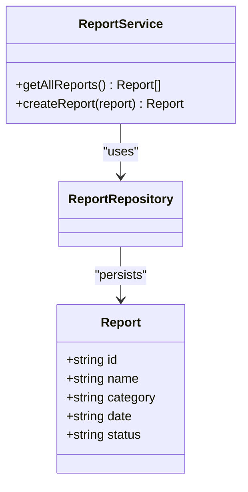
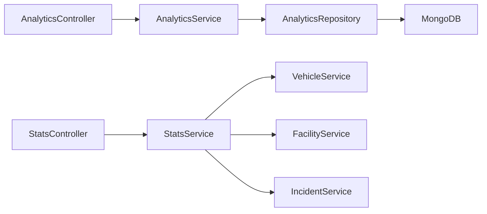

# Analytics and Reporting

<cite>
**Referenced Files in This Document**
- [AnalyticsController.java](file://src/main/java/com/example/ems_command_center/controller/AnalyticsController.java)
- [AnalyticsService.java](file://src/main/java/com/example/ems_command_center/service/AnalyticsService.java)
- [AnalyticsRepository.java](file://src/main/java/com/example/ems_command_center/repository/AnalyticsRepository.java)
- [Analytics.java](file://src/main/java/com/example/ems_command_center/model/Analytics.java)
- [StatsController.java](file://src/main/java/com/example/ems_command_center/controller/StatsController.java)
- [StatsService.java](file://src/main/java/com/example/ems_command_center/service/StatsService.java)
- [DashboardStats.java](file://src/main/java/com/example/ems_command_center/model/DashboardStats.java)
- [UserStat.java](file://src/main/java/com/example/ems_command_center/model/UserStat.java)
- [Report.java](file://src/main/java/com/example/ems_command_center/model/Report.java)
- [ReportService.java](file://src/main/java/com/example/ems_command_center/service/ReportService.java)
- [ReportRepository.java](file://src/main/java/com/example/ems_command_center/repository/ReportRepository.java)
- [DataSeeder.java](file://src/main/java/com/example/ems_command_center/seeder/DataSeeder.java)
- [application.yml](file://src/main/resources/application.yml)
</cite>

## Table of Contents
1. [Introduction](#introduction)
2. [Project Structure](#project-structure)
3. [Core Components](#core-components)
4. [Architecture Overview](#architecture-overview)
5. [Detailed Component Analysis](#detailed-component-analysis)
6. [Dependency Analysis](#dependency-analysis)
7. [Performance Considerations](#performance-considerations)
8. [Troubleshooting Guide](#troubleshooting-guide)
9. [Conclusion](#conclusion)
10. [Appendices](#appendices)

## Introduction
This document explains the analytics and reporting capabilities implemented in the system. It covers dispatch volume analytics, response time metrics, real-time dashboard statistics, historical analytics storage, and custom report management. It also outlines how to extend the system to support advanced metrics such as percentiles, benchmarks, and user performance tracking.

## Project Structure
The analytics and reporting features are organized around Spring MVC controllers, service-layer logic, and MongoDB repositories/models. Key areas:
- Analytics endpoints for dispatch volume and response time
- Real-time dashboard statistics endpoint
- Historical analytics persisted in MongoDB
- Custom reports management with creation and listing
- Application configuration for MongoDB connectivity and security

**Diagram sources**
- [AnalyticsController.java:1-38](file://src/main/java/com/example/ems_command_center/controller/AnalyticsController.java#L1-L38)
- [StatsController.java:1-29](file://src/main/java/com/example/ems_command_center/controller/StatsController.java#L1-L29)
- [AnalyticsService.java:1-159](file://src/main/java/com/example/ems_command_center/service/AnalyticsService.java#L1-L159)
- [StatsService.java:1-34](file://src/main/java/com/example/ems_command_center/service/StatsService.java#L1-L34)
- [AnalyticsRepository.java:1-13](file://src/main/java/com/example/ems_command_center/repository/AnalyticsRepository.java#L1-L13)
- [ReportRepository.java:1-10](file://src/main/java/com/example/ems_command_center/repository/ReportRepository.java#L1-L10)
- [Analytics.java:1-16](file://src/main/java/com/example/ems_command_center/model/Analytics.java#L1-L16)
- [DashboardStats.java:1-14](file://src/main/java/com/example/ems_command_center/model/DashboardStats.java#L1-L14)
- [UserStat.java:1-10](file://src/main/java/com/example/ems_command_center/model/UserStat.java#L1-L10)
- [Report.java:1-15](file://src/main/java/com/example/ems_command_center/model/Report.java#L1-L15)

**Section sources**
- [AnalyticsController.java:1-38](file://src/main/java/com/example/ems_command_center/controller/AnalyticsController.java#L1-L38)
- [StatsController.java:1-29](file://src/main/java/com/example/ems_command_center/controller/StatsController.java#L1-L29)
- [AnalyticsService.java:1-159](file://src/main/java/com/example/ems_command_center/service/AnalyticsService.java#L1-L159)
- [StatsService.java:1-34](file://src/main/java/com/example/ems_command_center/service/StatsService.java#L1-L34)
- [AnalyticsRepository.java:1-13](file://src/main/java/com/example/ems_command_center/repository/AnalyticsRepository.java#L1-L13)
- [ReportRepository.java:1-10](file://src/main/java/com/example/ems_command_center/repository/ReportRepository.java#L1-L10)
- [Analytics.java:1-16](file://src/main/java/com/example/ems_command_center/model/Analytics.java#L1-L16)
- [DashboardStats.java:1-14](file://src/main/java/com/example/ems_command_center/model/DashboardStats.java#L1-L14)
- [UserStat.java:1-10](file://src/main/java/com/example/ems_command_center/model/UserStat.java#L1-L10)
- [Report.java:1-15](file://src/main/java/com/example/ems_command_center/model/Report.java#L1-L15)
- [application.yml:1-36](file://src/main/resources/application.yml#L1-L36)

## Core Components
- AnalyticsController exposes two endpoints:
  - GET /api/analytics/dispatch returning hourly dispatch volumes
  - GET /api/analytics/response returning weekly response time series
- AnalyticsService computes live dispatch volume from incidents and retrieves historical response time data from MongoDB.
- AnalyticsRepository and Analytics model persist structured analytics datasets (dispatch_volume and response_time).
- StatsController and StatsService expose real-time dashboard statistics including active ambulances, total ambulances, average response time placeholder, hospital occupancy percentage, and critical incidents.
- ReportService and ReportRepository manage custom reports with basic CRUD operations.

**Section sources**
- [AnalyticsController.java:24-36](file://src/main/java/com/example/ems_command_center/controller/AnalyticsController.java#L24-L36)
- [AnalyticsService.java:37-53](file://src/main/java/com/example/ems_command_center/service/AnalyticsService.java#L37-L53)
- [AnalyticsRepository.java:10-11](file://src/main/java/com/example/ems_command_center/repository/AnalyticsRepository.java#L10-L11)
- [Analytics.java:10-14](file://src/main/java/com/example/ems_command_center/model/Analytics.java#L10-L14)
- [StatsController.java:22-27](file://src/main/java/com/example/ems_command_center/controller/StatsController.java#L22-L27)
- [StatsService.java:19-32](file://src/main/java/com/example/ems_command_center/service/StatsService.java#L19-L32)
- [DashboardStats.java:6-12](file://src/main/java/com/example/ems_command_center/model/DashboardStats.java#L6-L12)
- [ReportService.java:18-24](file://src/main/java/com/example/ems_command_center/service/ReportService.java#L18-L24)
- [ReportRepository.java:8-8](file://src/main/java/com/example/ems_command_center/repository/ReportRepository.java#L8-L8)

## Architecture Overview
The analytics/reporting subsystem follows a layered architecture:
- Presentation: REST controllers handle requests and return JSON responses.
- Application: Services encapsulate business logic and coordinate repositories.
- Persistence: MongoDB stores analytics datasets and reports.

**Diagram sources**
- [AnalyticsController.java:24-29](file://src/main/java/com/example/ems_command_center/controller/AnalyticsController.java#L24-L29)
- [AnalyticsService.java:37-47](file://src/main/java/com/example/ems_command_center/service/AnalyticsService.java#L37-L47)
- [AnalyticsRepository.java:10-11](file://src/main/java/com/example/ems_command_center/repository/AnalyticsRepository.java#L10-L11)
- [Analytics.java:10-14](file://src/main/java/com/example/ems_command_center/model/Analytics.java#L10-L14)

## Detailed Component Analysis

### Dispatch Volume Analytics
Dispatch volume analytics aggregates incident dispatches per hour over the past 12 hours. The service:
- Filters dispatched incidents using status or tags
- Parses incident timestamps and groups counts by hourly bins
- Returns a list of time-volume pairs for the last 12 hours
- Falls back to stored analytics if no live incidents are found

**Diagram sources**
- [AnalyticsService.java:37-47](file://src/main/java/com/example/ems_command_center/service/AnalyticsService.java#L37-L47)
- [AnalyticsService.java:59-100](file://src/main/java/com/example/ems_command_center/service/AnalyticsService.java#L59-L100)
- [AnalyticsService.java:128-141](file://src/main/java/com/example/ems_command_center/service/AnalyticsService.java#L128-L141)

**Section sources**
- [AnalyticsService.java:37-47](file://src/main/java/com/example/ems_command_center/service/AnalyticsService.java#L37-L47)
- [AnalyticsService.java:59-100](file://src/main/java/com/example/ems_command_center/service/AnalyticsService.java#L59-L100)
- [AnalyticsService.java:128-141](file://src/main/java/com/example/ems_command_center/service/AnalyticsService.java#L128-L141)
- [AnalyticsRepository.java:10-11](file://src/main/java/com/example/ems_command_center/repository/AnalyticsRepository.java#L10-L11)
- [Analytics.java:10-14](file://src/main/java/com/example/ems_command_center/model/Analytics.java#L10-L14)

### Response Time Metrics
Response time metrics are provided as a weekly series with arrival and dispatch times per day. The service:
- Retrieves stored response time data by type
- Returns a list of daily records containing numeric metrics

**Diagram sources**
- [AnalyticsController.java:31-36](file://src/main/java/com/example/ems_command_center/controller/AnalyticsController.java#L31-L36)
- [AnalyticsService.java:49-53](file://src/main/java/com/example/ems_command_center/service/AnalyticsService.java#L49-L53)
- [AnalyticsRepository.java:10-11](file://src/main/java/com/example/ems_command_center/repository/AnalyticsRepository.java#L10-L11)
- [Analytics.java:10-14](file://src/main/java/com/example/ems_command_center/model/Analytics.java#L10-L14)

**Section sources**
- [AnalyticsController.java:31-36](file://src/main/java/com/example/ems_command_center/controller/AnalyticsController.java#L31-L36)
- [AnalyticsService.java:49-53](file://src/main/java/com/example/ems_command_center/service/AnalyticsService.java#L49-L53)
- [AnalyticsRepository.java:10-11](file://src/main/java/com/example/ems_command_center/repository/AnalyticsRepository.java#L10-L11)
- [Analytics.java:10-14](file://src/main/java/com/example/ems_command_center/model/Analytics.java#L10-L14)

### Real-Time Dashboard Statistics
The dashboard endpoint provides a snapshot of current operations:
- Active ambulances
- Total ambulances
- Average response time placeholder
- Average hospital occupancy percentage
- Count of critical incidents

**Diagram sources**
- [StatsController.java:22-27](file://src/main/java/com/example/ems_command_center/controller/StatsController.java#L22-L27)
- [StatsService.java:19-32](file://src/main/java/com/example/ems_command_center/service/StatsService.java#L19-L32)
- [DashboardStats.java:6-12](file://src/main/java/com/example/ems_command_center/model/DashboardStats.java#L6-L12)

**Section sources**
- [StatsController.java:22-27](file://src/main/java/com/example/ems_command_center/controller/StatsController.java#L22-L27)
- [StatsService.java:19-32](file://src/main/java/com/example/ems_command_center/service/StatsService.java#L19-L32)
- [DashboardStats.java:6-12](file://src/main/java/com/example/ems_command_center/model/DashboardStats.java#L6-L12)

### Historical Data Storage and Seeding
Historical analytics datasets are stored in MongoDB under the analytics collection. A seeder creates initial datasets for dispatch_volume and response_time. The Analytics model captures type and data payload.

**Diagram sources**
- [Analytics.java:10-14](file://src/main/java/com/example/ems_command_center/model/Analytics.java#L10-L14)
- [AnalyticsRepository.java:10-11](file://src/main/java/com/example/ems_command_center/repository/AnalyticsRepository.java#L10-L11)
- [DataSeeder.java:257-286](file://src/main/java/com/example/ems_command_center/seeder/DataSeeder.java#L257-L286)

**Section sources**
- [Analytics.java:10-14](file://src/main/java/com/example/ems_command_center/model/Analytics.java#L10-L14)
- [AnalyticsRepository.java:10-11](file://src/main/java/com/example/ems_command_center/repository/AnalyticsRepository.java#L10-L11)
- [DataSeeder.java:257-286](file://src/main/java/com/example/ems_command_center/seeder/DataSeeder.java#L257-L286)

### Custom Reports Management
Custom reports are modeled and persisted via Report and ReportRepository. The ReportService supports listing and creating reports.

**Diagram sources**
- [ReportService.java:18-24](file://src/main/java/com/example/ems_command_center/service/ReportService.java#L18-L24)
- [ReportRepository.java:8-8](file://src/main/java/com/example/ems_command_center/repository/ReportRepository.java#L8-L8)
- [Report.java:7-13](file://src/main/java/com/example/ems_command_center/model/Report.java#L7-L13)

**Section sources**
- [ReportService.java:18-24](file://src/main/java/com/example/ems_command_center/service/ReportService.java#L18-L24)
- [ReportRepository.java:8-8](file://src/main/java/com/example/ems_command_center/repository/ReportRepository.java#L8-L8)
- [Report.java:7-13](file://src/main/java/com/example/ems_command_center/model/Report.java#L7-L13)

### User Statistics Tracking
UserStat is a lightweight DTO for rendering user performance metrics in UIs. It includes label, value, icon name, and color attributes.

**Section sources**
- [UserStat.java:3-8](file://src/main/java/com/example/ems_command_center/model/UserStat.java#L3-L8)

## Dependency Analysis
- Controllers depend on services for business logic.
- Services depend on repositories for persistence.
- AnalyticsService depends on IncidentRepository to compute live dispatch volume.
- StatsService depends on VehicleService, FacilityService, and IncidentService for dashboard metrics.
- MongoDB URIs and database configuration are defined in application.yml.

**Diagram sources**
- [AnalyticsController.java:1-38](file://src/main/java/com/example/ems_command_center/controller/AnalyticsController.java#L1-L38)
- [StatsController.java:1-29](file://src/main/java/com/example/ems_command_center/controller/StatsController.java#L1-L29)
- [AnalyticsService.java:1-159](file://src/main/java/com/example/ems_command_center/service/AnalyticsService.java#L1-L159)
- [StatsService.java:1-34](file://src/main/java/com/example/ems_command_center/service/StatsService.java#L1-L34)
- [AnalyticsRepository.java:1-13](file://src/main/java/com/example/ems_command_center/repository/AnalyticsRepository.java#L1-L13)
- [application.yml:6-8](file://src/main/resources/application.yml#L6-L8)

**Section sources**
- [AnalyticsService.java:25-31](file://src/main/java/com/example/ems_command_center/service/AnalyticsService.java#L25-L31)
- [StatsService.java:9-17](file://src/main/java/com/example/ems_command_center/service/StatsService.java#L9-L17)
- [application.yml:6-8](file://src/main/resources/application.yml#L6-L8)

## Performance Considerations
- Live dispatch volume computation scans all incidents; consider indexing incident status and time fields in MongoDB for improved performance.
- Response time queries rely on stored datasets; ensure efficient retrieval by type.
- Dashboard statistics combine counts from multiple services; cache or batch calls if latency becomes a concern.
- Use pagination for report listings if the number of reports grows large.

## Troubleshooting Guide
- Authentication and Authorization:
  - Analytics endpoints require ADMIN or MANAGER roles.
  - Stats endpoint is accessible to broader roles.
- MongoDB Connectivity:
  - Verify the MongoDB URI and database name in application.yml.
- Data Availability:
  - If live dispatch volume returns empty, seeded analytics fallback is used.
  - Ensure analytics documents exist for dispatch_volume and response_time.

**Section sources**
- [AnalyticsController.java:26-34](file://src/main/java/com/example/ems_command_center/controller/AnalyticsController.java#L26-L34)
- [StatsController.java:24-26](file://src/main/java/com/example/ems_command_center/controller/StatsController.java#L24-L26)
- [application.yml:6-8](file://src/main/resources/application.yml#L6-L8)
- [AnalyticsService.java:37-47](file://src/main/java/com/example/ems_command_center/service/AnalyticsService.java#L37-L47)
- [DataSeeder.java:257-286](file://src/main/java/com/example/ems_command_center/seeder/DataSeeder.java#L257-L286)

## Conclusion
The system provides foundational analytics and reporting capabilities:
- Dispatch volume analytics with live computation and historical fallback
- Response time metrics delivered as a weekly series
- Real-time dashboard statistics for situational awareness
- Custom report management for administrative workflows

Future enhancements can include percentile calculations, performance benchmarks, user performance tracking, and predictive analytics for demand forecasting.

## Appendices

### API Endpoints Summary
- GET /api/analytics/dispatch
  - Role: ADMIN, MANAGER
  - Response: List of hourly dispatch volumes
- GET /api/analytics/response
  - Role: ADMIN, MANAGER
  - Response: List of daily response time metrics
- GET /api/stats
  - Role: ADMIN, MANAGER, DRIVER, USER
  - Response: DashboardStats

**Section sources**
- [AnalyticsController.java:24-36](file://src/main/java/com/example/ems_command_center/controller/AnalyticsController.java#L24-L36)
- [StatsController.java:22-27](file://src/main/java/com/example/ems_command_center/controller/StatsController.java#L22-L27)