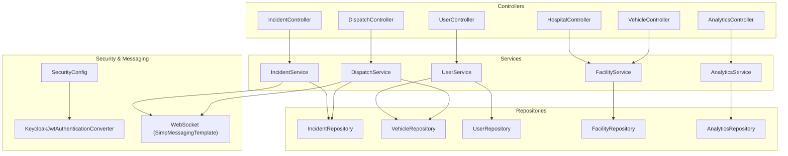
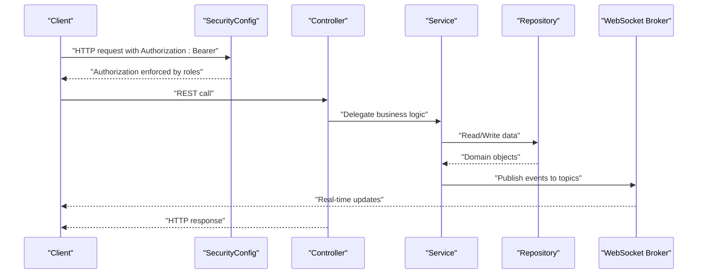
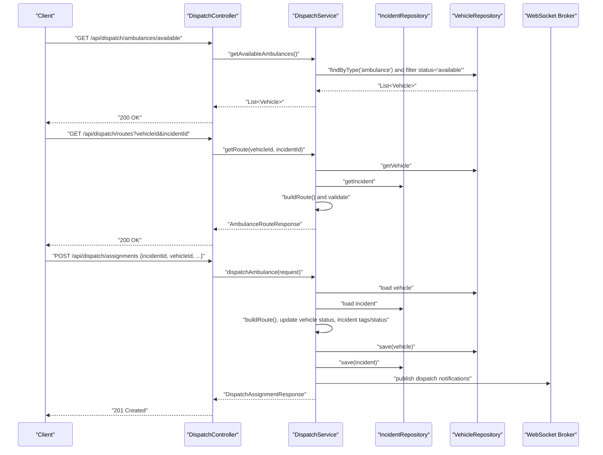
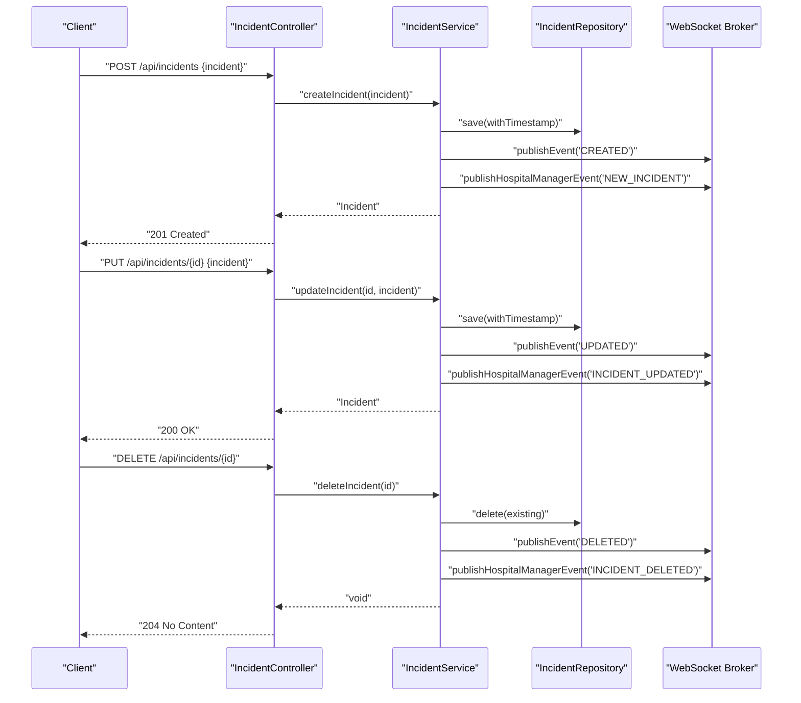
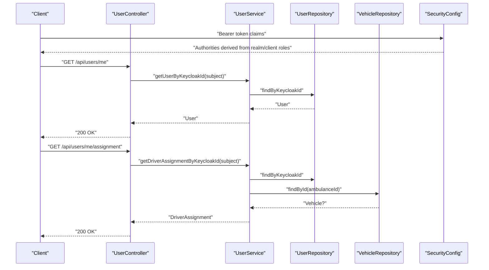
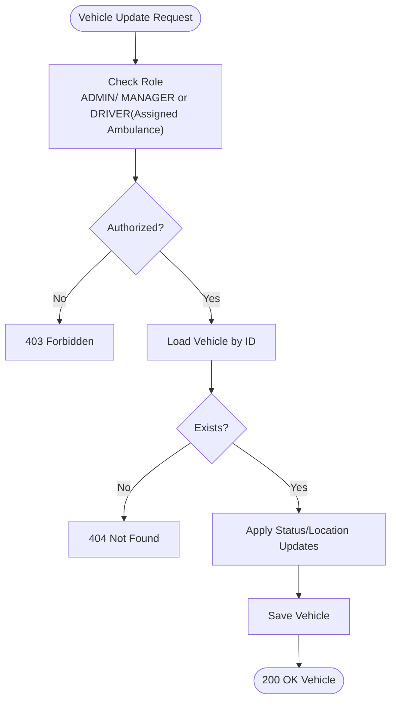
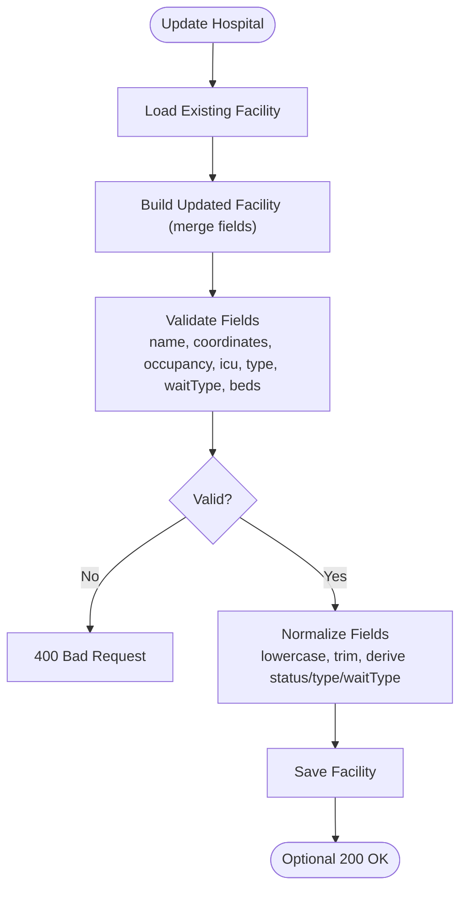
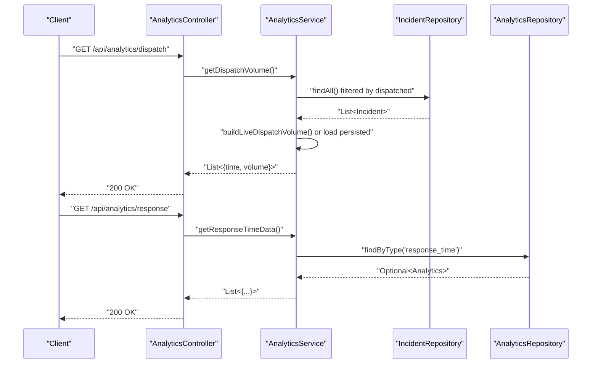
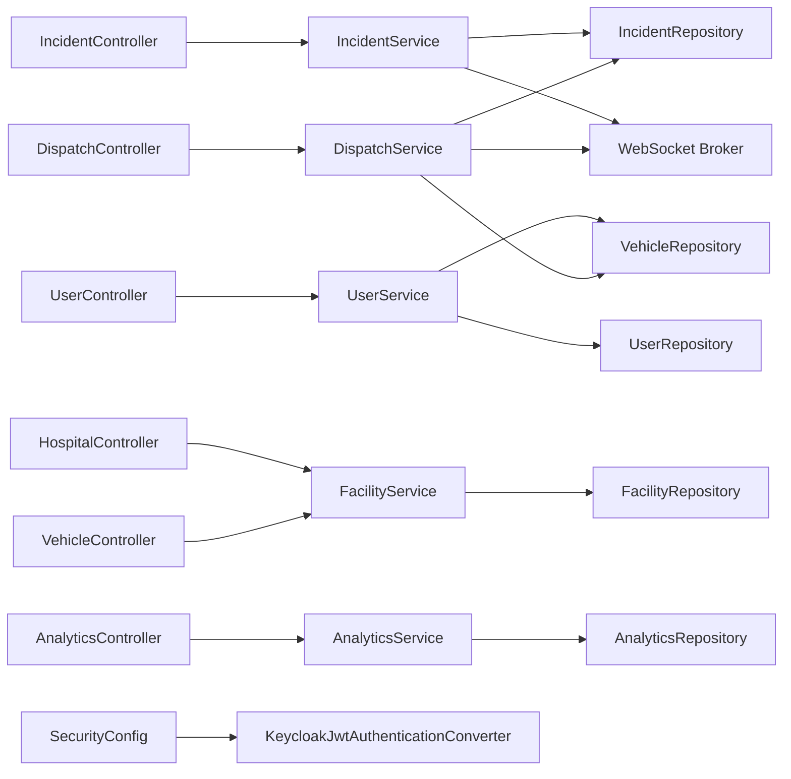

# Core Features

<cite>
**Referenced Files in This Document**
- [EmsCommandCenterApplication.java](file://src/main/java/com/example/ems_command_center/EmsCommandCenterApplication.java)
- [SecurityConfig.java](file://src/main/java/com/example/ems_command_center/config/SecurityConfig.java)
- [KeycloakJwtAuthenticationConverter.java](file://src/main/java/com/example/ems_command_center/config/KeycloakJwtAuthenticationConverter.java)
- [DispatchController.java](file://src/main/java/com/example/ems_command_center/controller/DispatchController.java)
- [DispatchService.java](file://src/main/java/com/example/ems_command_center/service/DispatchService.java)
- [IncidentController.java](file://src/main/java/com/example/ems_command_center/controller/IncidentController.java)
- [IncidentService.java](file://src/main/java/com/example/ems_command_center/service/IncidentService.java)
- [UserController.java](file://src/main/java/com/example/ems_command_center/controller/UserController.java)
- [UserService.java](file://src/main/java/com/example/ems_command_center/service/UserService.java)
- [VehicleController.java](file://src/main/java/com/example/ems_command_center/controller/VehicleController.java)
- [FacilityService.java](file://src/main/java/com/example/ems_command_center/service/FacilityService.java)
- [HospitalController.java](file://src/main/java/com/example/ems_command_center/controller/HospitalController.java)
- [AnalyticsController.java](file://src/main/java/com/example/ems_command_center/controller/AnalyticsController.java)
- [AnalyticsService.java](file://src/main/java/com/example/ems_command_center/service/AnalyticsService.java)
- [Incident.java](file://src/main/java/com/example/ems_command_center/model/Incident.java)
</cite>

## Table of Contents
1. [Introduction](#introduction)
2. [Project Structure](#project-structure)
3. [Core Components](#core-components)
4. [Architecture Overview](#architecture-overview)
5. [Detailed Component Analysis](#detailed-component-analysis)
6. [Dependency Analysis](#dependency-analysis)
7. [Performance Considerations](#performance-considerations)
8. [Troubleshooting Guide](#troubleshooting-guide)
9. [Conclusion](#conclusion)

## Introduction
This document describes the core features of the EMS Command Center application, focusing on dispatch management, incident lifecycle, user management, vehicle fleet operations, hospital coordination, and analytics/reporting. It explains how the backend enforces role-based access control via Keycloak, how dispatch assignments and routes are computed and published via WebSocket, how incidents are created and tracked, how users are managed and synchronized, how hospital facilities are curated and validated, and how operational analytics are aggregated and served.

## Project Structure
The backend is a Spring Boot application with layered architecture:
- Controllers expose REST endpoints grouped by domain (Dispatch, Incidents, Users, Vehicles, Hospitals, Analytics).
- Services encapsulate business logic and coordinate repositories and messaging.
- Repositories persist and query MongoDB documents.
- Configuration defines security (OAuth2/JWT, CORS, method-level authorization) and WebSocket topics.
- Models define the data structures used across the system.

**Diagram sources**
- [DispatchController.java:1-57](file://src/main/java/com/example/ems_command_center/controller/DispatchController.java#L1-L57)
- [IncidentController.java:1-61](file://src/main/java/com/example/ems_command_center/controller/IncidentController.java#L1-L61)
- [UserController.java:1-92](file://src/main/java/com/example/ems_command_center/controller/UserController.java#L1-L92)
- [VehicleController.java:1-57](file://src/main/java/com/example/ems_command_center/controller/VehicleController.java#L1-L57)
- [HospitalController.java:1-57](file://src/main/java/com/example/ems_command_center/controller/HospitalController.java#L1-L57)
- [AnalyticsController.java:1-38](file://src/main/java/com/example/ems_command_center/controller/AnalyticsController.java#L1-L38)
- [DispatchService.java:1-214](file://src/main/java/com/example/ems_command_center/service/DispatchService.java#L1-L214)
- [IncidentService.java:1-106](file://src/main/java/com/example/ems_command_center/service/IncidentService.java#L1-L106)
- [UserService.java:1-103](file://src/main/java/com/example/ems_command_center/service/UserService.java#L1-L103)
- [FacilityService.java:1-164](file://src/main/java/com/example/ems_command_center/service/FacilityService.java#L1-L164)
- [AnalyticsService.java:1-159](file://src/main/java/com/example/ems_command_center/service/AnalyticsService.java#L1-L159)
- [SecurityConfig.java:1-156](file://src/main/java/com/example/ems_command_center/config/SecurityConfig.java#L1-L156)
- [KeycloakJwtAuthenticationConverter.java:1-88](file://src/main/java/com/example/ems_command_center/config/KeycloakJwtAuthenticationConverter.java#L1-L88)

**Section sources**
- [EmsCommandCenterApplication.java:1-14](file://src/main/java/com/example/ems_command_center/EmsCommandCenterApplication.java#L1-L14)
- [SecurityConfig.java:1-156](file://src/main/java/com/example/ems_command_center/config/SecurityConfig.java#L1-L156)

## Core Components
- Dispatch Management: Available ambulance discovery, route preview, and dispatch assignment with real-time notifications.
- Incident Management: Creation, retrieval, updates, deletion, and event broadcasting with hospital manager visibility.
- User Management: Role-based access control, user CRUD, profile retrieval by Keycloak subject, and driver assignment resolution.
- Vehicle Fleet Management: CRUD operations, status/location updates, and driver/ambulance linkage.
- Hospital Coordination: Hospital CRUD, occupancy/wait-type normalization, and facility-level status derivation.
- Analytics and Reporting: Dispatch volume aggregation and response time data retrieval.

**Section sources**
- [DispatchController.java:1-57](file://src/main/java/com/example/ems_command_center/controller/DispatchController.java#L1-L57)
- [DispatchService.java:1-214](file://src/main/java/com/example/ems_command_center/service/DispatchService.java#L1-L214)
- [IncidentController.java:1-61](file://src/main/java/com/example/ems_command_center/controller/IncidentController.java#L1-L61)
- [IncidentService.java:1-106](file://src/main/java/com/example/ems_command_center/service/IncidentService.java#L1-L106)
- [UserController.java:1-92](file://src/main/java/com/example/ems_command_center/controller/UserController.java#L1-L92)
- [UserService.java:1-103](file://src/main/java/com/example/ems_command_center/service/UserService.java#L1-L103)
- [VehicleController.java:1-57](file://src/main/java/com/example/ems_command_center/controller/VehicleController.java#L1-L57)
- [FacilityService.java:1-164](file://src/main/java/com/example/ems_command_center/service/FacilityService.java#L1-L164)
- [AnalyticsController.java:1-38](file://src/main/java/com/example/ems_command_center/controller/AnalyticsController.java#L1-L38)
- [AnalyticsService.java:1-159](file://src/main/java/com/example/ems_command_center/service/AnalyticsService.java#L1-L159)

## Architecture Overview
The system uses OAuth2/OIDC with Keycloak for authentication and authorization. Method-level security enforces role-based access per endpoint. Real-time updates are published via Spring WebSocket to scoped topics for drivers, managers, and general incident feeds.

**Diagram sources**
- [SecurityConfig.java:44-98](file://src/main/java/com/example/ems_command_center/config/SecurityConfig.java#L44-L98)
- [KeycloakJwtAuthenticationConverter.java:29-41](file://src/main/java/com/example/ems_command_center/config/KeycloakJwtAuthenticationConverter.java#L29-L41)
- [IncidentService.java:88-104](file://src/main/java/com/example/ems_command_center/service/IncidentService.java#L88-L104)
- [DispatchService.java:205-212](file://src/main/java/com/example/ems_command_center/service/DispatchService.java#L205-L212)

## Detailed Component Analysis

### Dispatch Management
- Available Ambulances: Filters vehicles by type and status.
- Route Preview: Computes distance using spherical law of cosines, estimates travel time by incident type, interpolates waypoints, and builds a step-by-step route narrative.
- Dispatch Assignment: Validates ambulance eligibility, updates vehicle status and incident tags/status, persists changes, and publishes notifications to admin, driver, and hospital manager topics.

**Diagram sources**
- [DispatchController.java:33-55](file://src/main/java/com/example/ems_command_center/controller/DispatchController.java#L33-L55)
- [DispatchService.java:40-119](file://src/main/java/com/example/ems_command_center/service/DispatchService.java#L40-L119)
- [Incident.java:1-24](file://src/main/java/com/example/ems_command_center/model/Incident.java#L1-L24)

**Section sources**
- [DispatchController.java:1-57](file://src/main/java/com/example/ems_command_center/controller/DispatchController.java#L1-L57)
- [DispatchService.java:1-214](file://src/main/java/com/example/ems_command_center/service/DispatchService.java#L1-L214)

### Incident Management
- Retrieval: Fetch all incidents ordered by priority; fetch by ID.
- Creation: Persists incident with timestamp and publishes general and hospital-manager events.
- Updates: Replaces incident with timestamp preservation and publishes events.
- Deletion: Removes incident and publishes events.
- Eventing: General topic for admins/users/drivers; hospital-manager topic for managers.

**Diagram sources**
- [IncidentController.java:25-59](file://src/main/java/com/example/ems_command_center/controller/IncidentController.java#L25-L59)
- [IncidentService.java:35-59](file://src/main/java/com/example/ems_command_center/service/IncidentService.java#L35-L59)

**Section sources**
- [IncidentController.java:1-61](file://src/main/java/com/example/ems_command_center/controller/IncidentController.java#L1-L61)
- [IncidentService.java:1-106](file://src/main/java/com/example/ems_command_center/service/IncidentService.java#L1-L106)
- [Incident.java:1-24](file://src/main/java/com/example/ems_command_center/model/Incident.java#L1-L24)

### User Management and Keycloak Integration
- Role-based access control is enforced at the endpoint level.
- User profile retrieval supports fetching by authenticated user’s Keycloak subject.
- Driver assignment retrieval resolves a driver’s profile and their assigned ambulance.
- User CRUD is restricted to ADMIN; role queries supported for MANAGER.

**Diagram sources**
- [SecurityConfig.java:62-91](file://src/main/java/com/example/ems_command_center/config/SecurityConfig.java#L62-L91)
- [KeycloakJwtAuthenticationConverter.java:29-41](file://src/main/java/com/example/ems_command_center/config/KeycloakJwtAuthenticationConverter.java#L29-L41)
- [UserController.java:72-90](file://src/main/java/com/example/ems_command_center/controller/UserController.java#L72-L90)
- [UserService.java:71-101](file://src/main/java/com/example/ems_command_center/service/UserService.java#L71-L101)

**Section sources**
- [SecurityConfig.java:1-156](file://src/main/java/com/example/ems_command_center/config/SecurityConfig.java#L1-L156)
- [KeycloakJwtAuthenticationConverter.java:1-88](file://src/main/java/com/example/ems_command_center/config/KeycloakJwtAuthenticationConverter.java#L1-L88)
- [UserController.java:1-92](file://src/main/java/com/example/ems_command_center/controller/UserController.java#L1-L92)
- [UserService.java:1-103](file://src/main/java/com/example/ems_command_center/service/UserService.java#L1-L103)

### Vehicle Fleet Management
- Retrieve all vehicles.
- Register new vehicles.
- Update vehicle status/location with scoped authorization for drivers.
- Decommission vehicles (ADMIN only).

**Diagram sources**
- [VehicleController.java:25-55](file://src/main/java/com/example/ems_command_center/controller/VehicleController.java#L25-L55)
- [UserService.java:55-58](file://src/main/java/com/example/ems_command_center/service/UserService.java#L55-L58)

**Section sources**
- [VehicleController.java:1-57](file://src/main/java/com/example/ems_command_center/controller/VehicleController.java#L1-L57)
- [UserService.java:1-103](file://src/main/java/com/example/ems_command_center/service/UserService.java#L1-L103)

### Hospital Coordination
- Retrieve all hospitals with facility metadata.
- Add/update/delete hospitals with strict validation and normalization.
- Automatic derivation of facility type, wait type, and status label based on occupancy thresholds.

**Diagram sources**
- [FacilityService.java:38-60](file://src/main/java/com/example/ems_command_center/service/FacilityService.java#L38-L60)
- [FacilityService.java:77-109](file://src/main/java/com/example/ems_command_center/service/FacilityService.java#L77-L109)
- [FacilityService.java:111-134](file://src/main/java/com/example/ems_command_center/service/FacilityService.java#L111-L134)

**Section sources**
- [HospitalController.java:1-57](file://src/main/java/com/example/ems_command_center/controller/HospitalController.java#L1-L57)
- [FacilityService.java:1-164](file://src/main/java/com/example/ems_command_center/service/FacilityService.java#L1-L164)

### Analytics and Reporting
- Dispatch Volume: Aggregates dispatched incidents by hour over the last 12 hours, preferring live counts from incidents if available, otherwise serving persisted analytics.
- Response Time: Returns stored response time series data.

**Diagram sources**
- [AnalyticsController.java:24-36](file://src/main/java/com/example/ems_command_center/controller/AnalyticsController.java#L24-L36)
- [AnalyticsService.java:37-53](file://src/main/java/com/example/ems_command_center/service/AnalyticsService.java#L37-L53)
- [AnalyticsService.java:59-100](file://src/main/java/com/example/ems_command_center/service/AnalyticsService.java#L59-L100)

**Section sources**
- [AnalyticsController.java:1-38](file://src/main/java/com/example/ems_command_center/controller/AnalyticsController.java#L1-L38)
- [AnalyticsService.java:1-159](file://src/main/java/com/example/ems_command_center/service/AnalyticsService.java#L1-L159)

## Dependency Analysis
- Controllers depend on Services for business logic.
- Services depend on Repositories for persistence and on WebSocket messaging for real-time updates.
- Security configuration depends on Keycloak JWT converter to translate realm/client roles into Spring authorities.
- Models are DTO-like records mapped to MongoDB collections.

**Diagram sources**
- [DispatchController.java:1-57](file://src/main/java/com/example/ems_command_center/controller/DispatchController.java#L1-L57)
- [IncidentController.java:1-61](file://src/main/java/com/example/ems_command_center/controller/IncidentController.java#L1-L61)
- [UserController.java:1-92](file://src/main/java/com/example/ems_command_center/controller/UserController.java#L1-L92)
- [VehicleController.java:1-57](file://src/main/java/com/example/ems_command_center/controller/VehicleController.java#L1-L57)
- [HospitalController.java:1-57](file://src/main/java/com/example/ems_command_center/controller/HospitalController.java#L1-L57)
- [AnalyticsController.java:1-38](file://src/main/java/com/example/ems_command_center/controller/AnalyticsController.java#L1-L38)
- [SecurityConfig.java:1-156](file://src/main/java/com/example/ems_command_center/config/SecurityConfig.java#L1-L156)
- [KeycloakJwtAuthenticationConverter.java:1-88](file://src/main/java/com/example/ems_command_center/config/KeycloakJwtAuthenticationConverter.java#L1-L88)

**Section sources**
- [SecurityConfig.java:1-156](file://src/main/java/com/example/ems_command_center/config/SecurityConfig.java#L1-L156)
- [KeycloakJwtAuthenticationConverter.java:1-88](file://src/main/java/com/example/ems_command_center/config/KeycloakJwtAuthenticationConverter.java#L1-L88)

## Performance Considerations
- Dispatch route computation uses constant-time math operations and small fixed-path interpolation; negligible overhead.
- Live analytics aggregation scans recent incidents; consider indexing incident timestamps and status/tags for larger datasets.
- WebSocket publishing occurs after persistence; ensure broker scalability for high-frequency updates.
- Vehicle and incident retrieval filters are in-memory; consider adding database-side filtering for large fleets.

## Troubleshooting Guide
- Authentication failures: Unauthorized responses indicate missing or invalid Keycloak access tokens.
- Authorization failures: Forbidden responses indicate insufficient roles for the requested endpoint.
- Not found errors: Occur when retrieving non-existent incidents, vehicles, or users.
- Validation errors: Hospital updates enforce strict constraints on occupancy, ICU values, and textual fields.

Common HTTP responses:
- 401 Unauthorized: Missing or invalid bearer token.
- 403 Forbidden: Insufficient roles for the endpoint.
- 404 Not Found: Resource does not exist.
- 400 Bad Request: Validation failure during hospital updates or missing coordinates/route prerequisites.

**Section sources**
- [SecurityConfig.java:138-154](file://src/main/java/com/example/ems_command_center/config/SecurityConfig.java#L138-L154)
- [FacilityService.java:77-109](file://src/main/java/com/example/ems_command_center/service/FacilityService.java#L77-L109)
- [DispatchService.java:121-135](file://src/main/java/com/example/ems_command_center/service/DispatchService.java#L121-L135)
- [IncidentService.java:31-32](file://src/main/java/com/example/ems_command_center/service/IncidentService.java#L31-L32)

## Conclusion
The EMS Command Center backend provides a cohesive set of features for dispatch, incident lifecycle, user and fleet management, hospital coordination, and analytics. Security is enforced via Keycloak and method-level roles, while real-time updates are delivered through WebSocket topics. The modular design enables clear separation of concerns and straightforward extension for future enhancements.