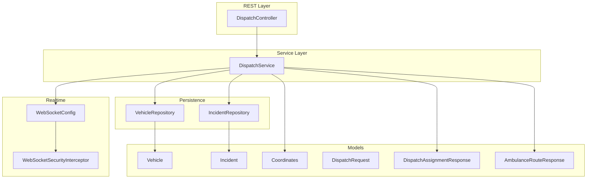
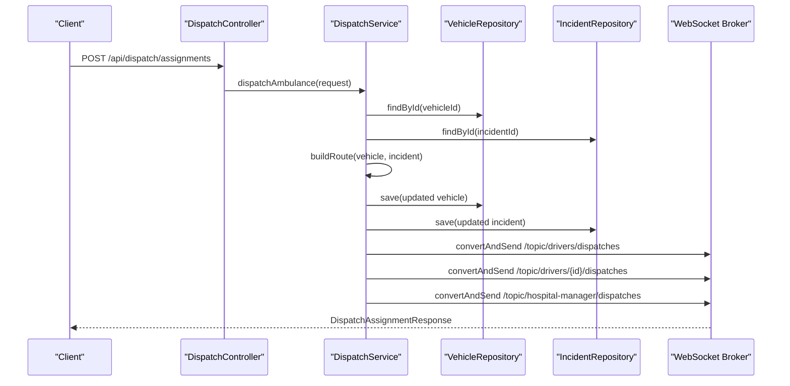
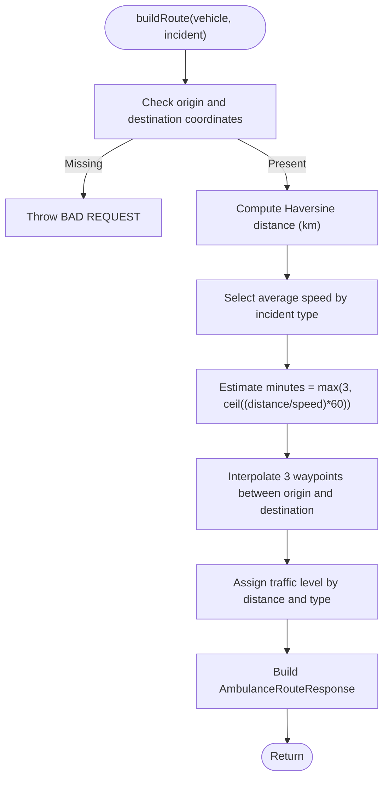
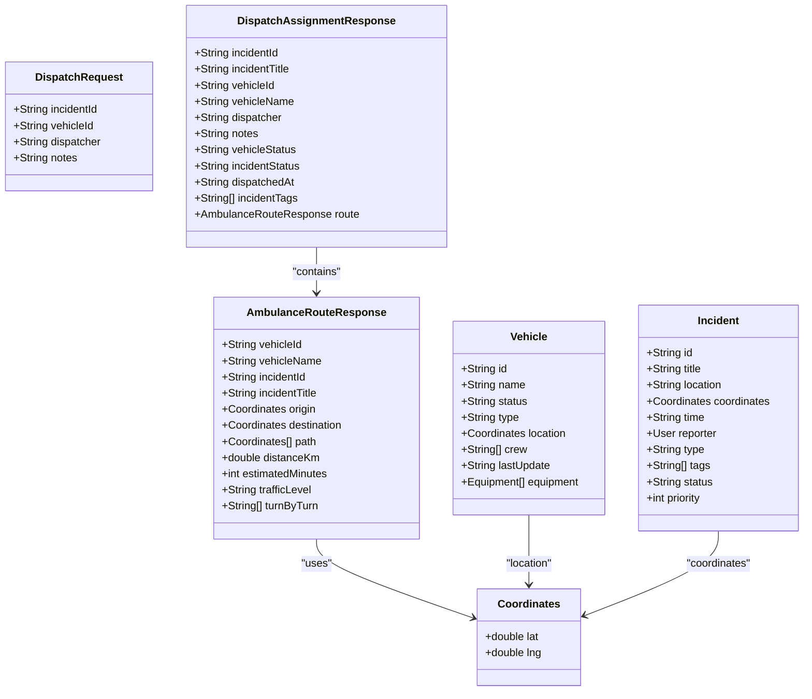
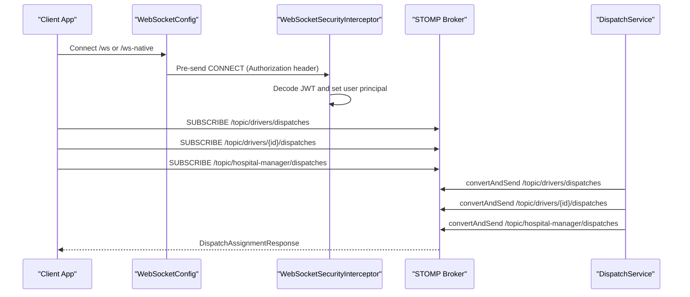
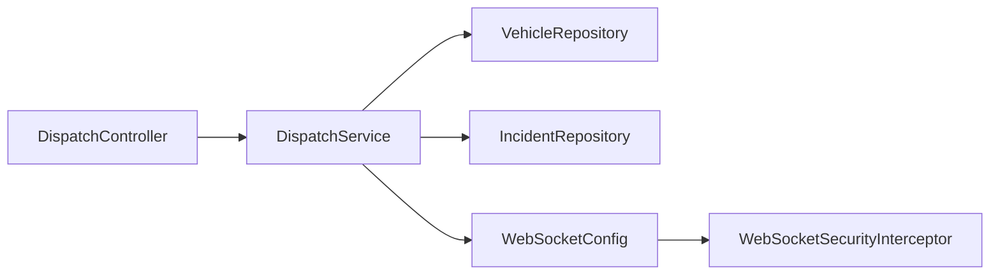
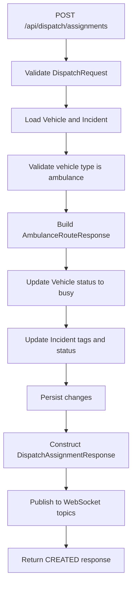

# Dispatch Management

<cite>
**Referenced Files in This Document**
- [DispatchController.java](file://src/main/java/com/example/ems_command_center/controller/DispatchController.java)
- [DispatchService.java](file://src/main/java/com/example/ems_command_center/service/DispatchService.java)
- [DispatchRequest.java](file://src/main/java/com/example/ems_command_center/model/DispatchRequest.java)
- [DispatchAssignmentResponse.java](file://src/main/java/com/example/ems_command_center/model/DispatchAssignmentResponse.java)
- [AmbulanceRouteResponse.java](file://src/main/java/com/example/ems_command_center/model/AmbulanceRouteResponse.java)
- [Vehicle.java](file://src/main/java/com/example/ems_command_center/model/Vehicle.java)
- [Incident.java](file://src/main/java/com/example/ems_command_center/model/Incident.java)
- [Coordinates.java](file://src/main/java/com/example/ems_command_center/model/Coordinates.java)
- [VehicleRepository.java](file://src/main/java/com/example/ems_command_center/repository/VehicleRepository.java)
- [IncidentRepository.java](file://src/main/java/com/example/ems_command_center/repository/IncidentRepository.java)
- [WebSocketConfig.java](file://src/main/java/com/example/ems_command_center/config/WebSocketConfig.java)
- [WebSocketSecurityInterceptor.java](file://src/main/java/com/example/ems_command_center/config/WebSocketSecurityInterceptor.java)
- [AccessControlService.java](file://src/main/java/com/example/ems_command_center/service/AccessControlService.java)
- [User.java](file://src/main/java/com/example/ems_command_center/model/User.java)
</cite>

## Table of Contents
1. [Introduction](#introduction)
2. [Project Structure](#project-structure)
3. [Core Components](#core-components)
4. [Architecture Overview](#architecture-overview)
5. [Detailed Component Analysis](#detailed-component-analysis)
6. [Dependency Analysis](#dependency-analysis)
7. [Performance Considerations](#performance-considerations)
8. [Troubleshooting Guide](#troubleshooting-guide)
9. [Conclusion](#conclusion)
10. [Appendices](#appendices)

## Introduction
This document describes the dispatch management system for ambulance operations. It covers ambulance dispatch logic, route calculation, real-time tracking and notifications, and the data models involved. The system currently implements:
- Available ambulance discovery
- Route preview between ambulance and incident
- Dispatch assignment with status updates
- Real-time broadcast of dispatch events via WebSocket
- Basic proximity-aware selection criteria (distance-based)

It does not implement:
- Automatic assignment algorithms
- Driver availability checking
- Proximity-based selection criteria
- Real-time traffic consideration
- Push notifications, SMS alerts, or mobile app integration

## Project Structure
The dispatch system spans controllers, services, repositories, models, and WebSocket configuration.

**Diagram sources**
- [DispatchController.java:22-56](file://src/main/java/com/example/ems_command_center/controller/DispatchController.java#L22-L56)
- [DispatchService.java:21-38](file://src/main/java/com/example/ems_command_center/service/DispatchService.java#L21-L38)
- [VehicleRepository.java:9-14](file://src/main/java/com/example/ems_command_center/repository/VehicleRepository.java#L9-L14)
- [IncidentRepository.java:9-13](file://src/main/java/com/example/ems_command_center/repository/IncidentRepository.java#L9-L13)
- [Vehicle.java:7-18](file://src/main/java/com/example/ems_command_center/model/Vehicle.java#L7-L18)
- [Incident.java:8-23](file://src/main/java/com/example/ems_command_center/model/Incident.java#L8-L23)
- [Coordinates.java:3](file://src/main/java/com/example/ems_command_center/model/Coordinates.java#L3)
- [DispatchRequest.java:3-9](file://src/main/java/com/example/ems_command_center/model/DispatchRequest.java#L3-L9)
- [DispatchAssignmentResponse.java:5-18](file://src/main/java/com/example/ems_command_center/model/DispatchAssignmentResponse.java#L5-L18)
- [AmbulanceRouteResponse.java:5-18](file://src/main/java/com/example/ems_command_center/model/AmbulanceRouteResponse.java#L5-L18)
- [WebSocketConfig.java:10-49](file://src/main/java/com/example/ems_command_center/config/WebSocketConfig.java#L10-L49)
- [WebSocketSecurityInterceptor.java:17-112](file://src/main/java/com/example/ems_command_center/config/WebSocketSecurityInterceptor.java#L17-L112)

**Section sources**
- [DispatchController.java:22-56](file://src/main/java/com/example/ems_command_center/controller/DispatchController.java#L22-L56)
- [DispatchService.java:21-38](file://src/main/java/com/example/ems_command_center/service/DispatchService.java#L21-L38)
- [WebSocketConfig.java:10-49](file://src/main/java/com/example/ems_command_center/config/WebSocketConfig.java#L10-L49)

## Core Components
- DispatchController: Exposes REST endpoints for available ambulances, route preview, and dispatch creation.
- DispatchService: Implements business logic for retrieving available ambulances, calculating routes, dispatching, and publishing notifications.
- Repositories: VehicleRepository and IncidentRepository provide persistence operations.
- Models: DispatchRequest, DispatchAssignmentResponse, AmbulanceRouteResponse, Vehicle, Incident, Coordinates define the data contracts.
- WebSocket: WebSocketConfig and WebSocketSecurityInterceptor enable secure STOMP/SockJS endpoints and topic authorization.

Key responsibilities:
- Available ambulances: Filter vehicles by type and status.
- Route preview: Compute straight-line distance using Haversine, estimate travel time based on incident type, and generate a simple three-segment path.
- Dispatch assignment: Persist status updates for vehicle and incident, construct assignment response, and publish to topics.
- Real-time notifications: Broadcast dispatch events to admin, driver-scoped, and manager topics.

**Section sources**
- [DispatchController.java:33-55](file://src/main/java/com/example/ems_command_center/controller/DispatchController.java#L33-L55)
- [DispatchService.java:40-119](file://src/main/java/com/example/ems_command_center/service/DispatchService.java#L40-L119)
- [VehicleRepository.java:10-13](file://src/main/java/com/example/ems_command_center/repository/VehicleRepository.java#L10-L13)
- [IncidentRepository.java:10-12](file://src/main/java/com/example/ems_command_center/repository/IncidentRepository.java#L10-L12)
- [DispatchRequest.java:3-9](file://src/main/java/com/example/ems_command_center/model/DispatchRequest.java#L3-L9)
- [DispatchAssignmentResponse.java:5-18](file://src/main/java/com/example/ems_command_center/model/DispatchAssignmentResponse.java#L5-L18)
- [AmbulanceRouteResponse.java:5-18](file://src/main/java/com/example/ems_command_center/model/AmbulanceRouteResponse.java#L5-L18)
- [WebSocketConfig.java:20-49](file://src/main/java/com/example/ems_command_center/config/WebSocketConfig.java#L20-L49)

## Architecture Overview
The system follows a layered architecture:
- REST endpoints delegate to a service layer
- Service interacts with repositories for persistence
- Service constructs domain responses and publishes via Spring WebSocket messaging
- WebSocket broker broadcasts messages to subscribed clients

**Diagram sources**
- [DispatchController.java:50-55](file://src/main/java/com/example/ems_command_center/controller/DispatchController.java#L50-L55)
- [DispatchService.java:53-119](file://src/main/java/com/example/ems_command_center/service/DispatchService.java#L53-L119)
- [VehicleRepository.java:10-13](file://src/main/java/com/example/ems_command_center/repository/VehicleRepository.java#L10-L13)
- [IncidentRepository.java:10-12](file://src/main/java/com/example/ems_command_center/repository/IncidentRepository.java#L10-L12)
- [WebSocketConfig.java:20-24](file://src/main/java/com/example/ems_command_center/config/WebSocketConfig.java#L20-L24)

## Detailed Component Analysis

### DispatchController
- GET /api/dispatch/ambulances/available: Lists available ambulances with role-based authorization.
- GET /api/dispatch/routes: Returns a suggested route for an ambulance to an incident with coordinate validation.
- POST /api/dispatch/assignments: Creates a dispatch assignment with request validation and returns CREATED with assignment response.

Authorization:
- Available list: ADMIN, MANAGER, DRIVER
- Route preview: ADMIN, MANAGER, or DRIVER assigned to the specific ambulance
- Dispatch creation: ADMIN, MANAGER

**Section sources**
- [DispatchController.java:33-55](file://src/main/java/com/example/ems_command_center/controller/DispatchController.java#L33-L55)

### DispatchService
Responsibilities:
- Available ambulances: Retrieve vehicles where type equals "ambulance" and status equals "available".
- Route preview: Validate inputs, compute distance using Haversine, estimate minutes based on incident type, interpolate path points, and produce AmbulanceRouteResponse.
- Dispatch assignment: Validate request, compute route, update vehicle status to "busy", append tags to incident, persist changes, construct DispatchAssignmentResponse, and publish notifications.

Route calculation logic:
- Distance computed via Haversine formula
- Average speeds differ by incident type
- Estimated time clamped to minimum minutes
- Path consists of origin, two intermediate waypoints, and destination
- Traffic level determined by distance thresholds and incident type

Notification publishing:
- Broadcast to general drivers topic
- Broadcast to driver-scoped topic by vehicleId
- Broadcast to hospital manager topic

**Diagram sources**
- [DispatchService.java:137-171](file://src/main/java/com/example/ems_command_center/service/DispatchService.java#L137-L171)
- [DispatchService.java:173-182](file://src/main/java/com/example/ems_command_center/service/DispatchService.java#L173-L182)
- [DispatchService.java:184-188](file://src/main/java/com/example/ems_command_center/service/DispatchService.java#L184-L188)
- [DispatchService.java:190-199](file://src/main/java/com/example/ems_command_center/service/DispatchService.java#L190-L199)

**Section sources**
- [DispatchService.java:40-44](file://src/main/java/com/example/ems_command_center/service/DispatchService.java#L40-L44)
- [DispatchService.java:46-51](file://src/main/java/com/example/ems_command_center/service/DispatchService.java#L46-L51)
- [DispatchService.java:53-119](file://src/main/java/com/example/ems_command_center/service/DispatchService.java#L53-L119)
- [DispatchService.java:137-182](file://src/main/java/com/example/ems_command_center/service/DispatchService.java#L137-L182)
- [DispatchService.java:205-212](file://src/main/java/com/example/ems_command_center/service/DispatchService.java#L205-L212)

### Data Models
- DispatchRequest: incidentId, vehicleId, dispatcher, notes
- DispatchAssignmentResponse: incident metadata, vehicle metadata, dispatcher info, timestamps, tags, and route
- AmbulanceRouteResponse: identifiers, origin/destination coordinates, interpolated path, distance, estimated minutes, traffic level, turn-by-turn steps
- Vehicle: MongoDB document with status and type filters
- Incident: MongoDB document with type and tags
- Coordinates: simple record for latitude/longitude

**Diagram sources**
- [DispatchRequest.java:3-9](file://src/main/java/com/example/ems_command_center/model/DispatchRequest.java#L3-L9)
- [DispatchAssignmentResponse.java:5-18](file://src/main/java/com/example/ems_command_center/model/DispatchAssignmentResponse.java#L5-L18)
- [AmbulanceRouteResponse.java:5-18](file://src/main/java/com/example/ems_command_center/model/AmbulanceRouteResponse.java#L5-L18)
- [Vehicle.java:7-18](file://src/main/java/com/example/ems_command_center/model/Vehicle.java#L7-L18)
- [Incident.java:8-23](file://src/main/java/com/example/ems_command_center/model/Incident.java#L8-L23)
- [Coordinates.java:3](file://src/main/java/com/example/ems_command_center/model/Coordinates.java#L3)

**Section sources**
- [DispatchRequest.java:3-9](file://src/main/java/com/example/ems_command_center/model/DispatchRequest.java#L3-L9)
- [DispatchAssignmentResponse.java:5-18](file://src/main/java/com/example/ems_command_center/model/DispatchAssignmentResponse.java#L5-L18)
- [AmbulanceRouteResponse.java:5-18](file://src/main/java/com/example/ems_command_center/model/AmbulanceRouteResponse.java#L5-L18)
- [Vehicle.java:7-18](file://src/main/java/com/example/ems_command_center/model/Vehicle.java#L7-L18)
- [Incident.java:8-23](file://src/main/java/com/example/ems_command_center/model/Incident.java#L8-L23)
- [Coordinates.java:3](file://src/main/java/com/example/ems_command_center/model/Coordinates.java#L3)

### Real-Time Tracking and Notifications (WebSocket)
- WebSocket endpoints: /ws-native and /ws (with SockJS)
- Message broker: Simple broker enabled for /topic destinations
- Security interceptor validates JWT for CONNECT and enforces authorization for subscriptions:
  - Drivers can subscribe to general dispatches or their own ambulance-scoped dispatches
  - Hospital manager topics require ADMIN or MANAGER roles
  - Additional hospital-scoped authorization checks supported by AccessControlService

**Diagram sources**
- [WebSocketConfig.java:20-49](file://src/main/java/com/example/ems_command_center/config/WebSocketConfig.java#L20-L49)
- [WebSocketSecurityInterceptor.java:34-111](file://src/main/java/com/example/ems_command_center/config/WebSocketSecurityInterceptor.java#L34-L111)
- [DispatchService.java:205-212](file://src/main/java/com/example/ems_command_center/service/DispatchService.java#L205-L212)

**Section sources**
- [WebSocketConfig.java:20-49](file://src/main/java/com/example/ems_command_center/config/WebSocketConfig.java#L20-L49)
- [WebSocketSecurityInterceptor.java:34-111](file://src/main/java/com/example/ems_command_center/config/WebSocketSecurityInterceptor.java#L34-L111)
- [DispatchService.java:205-212](file://src/main/java/com/example/ems_command_center/service/DispatchService.java#L205-L212)

### Driver Assignment and Authorization
- DriverAssignment model pairs a User with an assigned Vehicle.
- WebSocketSecurityInterceptor enforces that drivers can only subscribe to dispatches for their assigned ambulance using AccessControlService.
- User model includes role and ambulanceId fields used for authorization checks.

Note: The current implementation does not include automatic assignment logic or availability scheduling; authorization is enforced at subscription time.

**Section sources**
- [DriverAssignment.java:3-6](file://src/main/java/com/example/ems_command_center/model/DriverAssignment.java#L3-L6)
- [WebSocketSecurityInterceptor.java:56-106](file://src/main/java/com/example/ems_command_center/config/WebSocketSecurityInterceptor.java#L56-L106)
- [AccessControlService.java](file://src/main/java/com/example/ems_command_center/service/AccessControlService.java)
- [User.java:8-35](file://src/main/java/com/example/ems_command_center/model/User.java#L8-L35)

## Dependency Analysis
- DispatchController depends on DispatchService.
- DispatchService depends on VehicleRepository, IncidentRepository, and SimpMessagingTemplate for notifications.
- Repositories depend on MongoDB Spring Data.
- WebSocketConfig and WebSocketSecurityInterceptor integrate Spring Security with STOMP/SockJS.

**Diagram sources**
- [DispatchController.java:27-31](file://src/main/java/com/example/ems_command_center/controller/DispatchController.java#L27-L31)
- [DispatchService.java:26-37](file://src/main/java/com/example/ems_command_center/service/DispatchService.java#L26-L37)
- [WebSocketConfig.java:14-18](file://src/main/java/com/example/ems_command_center/config/WebSocketConfig.java#L14-L18)
- [WebSocketSecurityInterceptor.java:18-32](file://src/main/java/com/example/ems_command_center/config/WebSocketSecurityInterceptor.java#L18-L32)

**Section sources**
- [DispatchController.java:27-31](file://src/main/java/com/example/ems_command_center/controller/DispatchController.java#L27-L31)
- [DispatchService.java:26-37](file://src/main/java/com/example/ems_command_center/service/DispatchService.java#L26-L37)
- [WebSocketConfig.java:14-18](file://src/main/java/com/example/ems_command_center/config/WebSocketConfig.java#L14-L18)
- [WebSocketSecurityInterceptor.java:18-32](file://src/main/java/com/example/ems_command_center/config/WebSocketSecurityInterceptor.java#L18-L32)

## Performance Considerations
- Route computation is O(1) per call; distance and interpolation are constant-time operations.
- Dispatch assignment persists two documents and publishes three WebSocket messages; latency depends on broker throughput.
- Authorization checks occur during WebSocket connect and subscribe; caching user roles/assignments can reduce overhead.
- Current route estimation does not consider real-time traffic; adding a traffic API would increase latency and complexity.

[No sources needed since this section provides general guidance]

## Troubleshooting Guide
Common issues and resolutions:
- Vehicle or incident not found: Validation throws NOT_FOUND; verify IDs and existence.
- Missing coordinates: Validation throws BAD_REQUEST; ensure both origin and destination have coordinates.
- Non-ambulance vehicle dispatch: Validation throws BAD_REQUEST; only "ambulance" type vehicles can be dispatched.
- Unauthorized WebSocket subscription: Security interceptor throws IllegalArgumentException; ensure proper role and assignment.
- Dispatch endpoint returns BAD_REQUEST: Verify DispatchRequest includes incidentId and vehicleId.

**Section sources**
- [DispatchService.java:121-129](file://src/main/java/com/example/ems_command_center/service/DispatchService.java#L121-L129)
- [DispatchService.java:137-142](file://src/main/java/com/example/ems_command_center/service/DispatchService.java#L137-L142)
- [DispatchService.java:131-135](file://src/main/java/com/example/ems_command_center/service/DispatchService.java#L131-L135)
- [WebSocketSecurityInterceptor.java:61-84](file://src/main/java/com/example/ems_command_center/config/WebSocketSecurityInterceptor.java#L61-L84)
- [DispatchController.java:54](file://src/main/java/com/example/ems_command_center/controller/DispatchController.java#L54)

## Conclusion
The dispatch management system provides a solid foundation for ambulance dispatch operations with:
- Clear REST endpoints for available ambulances, route previews, and dispatch assignments
- A straightforward route calculation method based on distance and incident type
- Real-time dispatch notifications via WebSocket with role-based authorization

Future enhancements should focus on implementing automatic assignment algorithms, driver availability checks, proximity-based selection, real-time traffic integration, and robust driver notification channels.

[No sources needed since this section summarizes without analyzing specific files]

## Appendices

### Dispatch Request Processing Workflow

**Diagram sources**
- [DispatchController.java:50-55](file://src/main/java/com/example/ems_command_center/controller/DispatchController.java#L50-L55)
- [DispatchService.java:53-119](file://src/main/java/com/example/ems_command_center/service/DispatchService.java#L53-L119)

### Dispatch Assignment Response Fields
- incidentId, incidentTitle
- vehicleId, vehicleName
- dispatcher, notes
- vehicleStatus, incidentStatus
- dispatchedAt
- incidentTags
- route: vehicleId, vehicleName, incidentId, incidentTitle, origin, destination, path, distanceKm, estimatedMinutes, trafficLevel, turnByTurn

**Section sources**
- [DispatchAssignmentResponse.java:5-18](file://src/main/java/com/example/ems_command_center/model/DispatchAssignmentResponse.java#L5-L18)
- [AmbulanceRouteResponse.java:5-18](file://src/main/java/com/example/ems_command_center/model/AmbulanceRouteResponse.java#L5-L18)