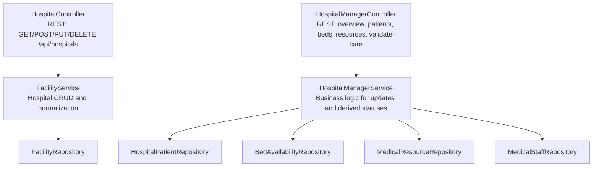
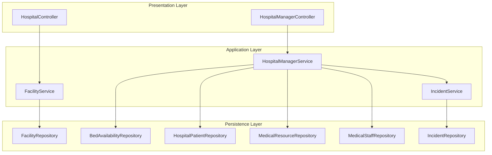
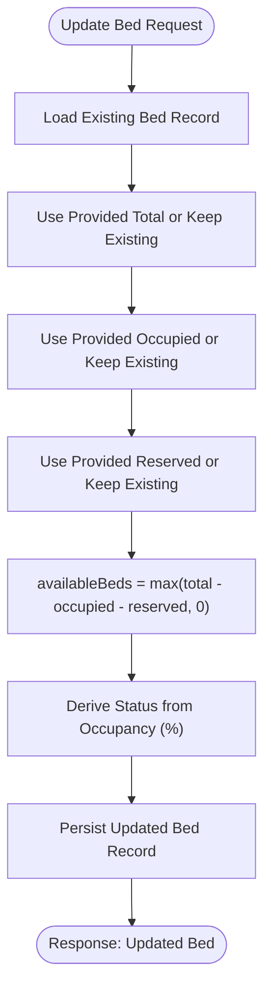
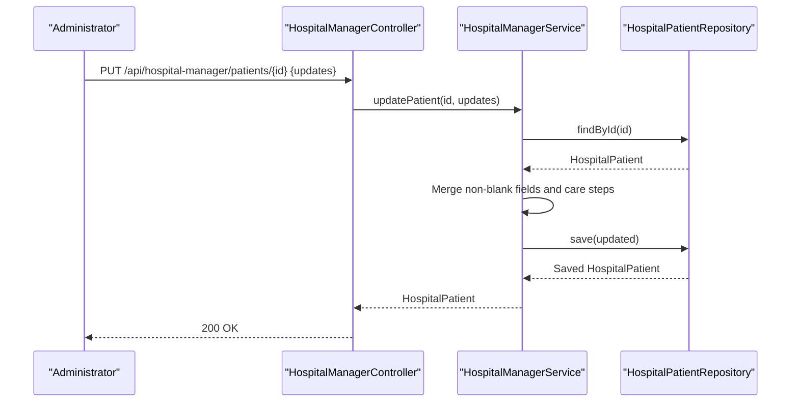
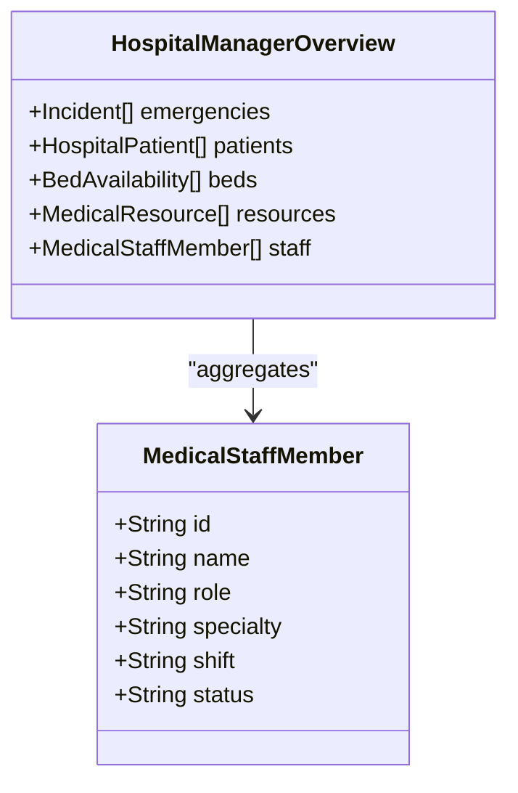
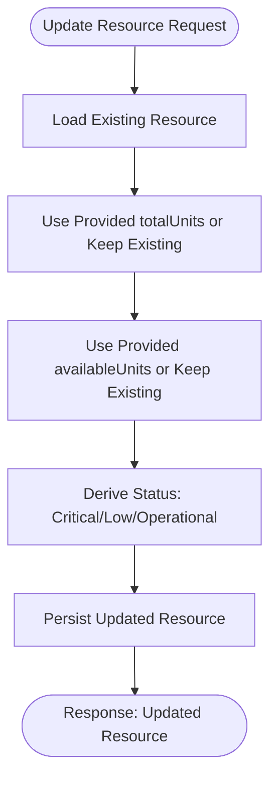
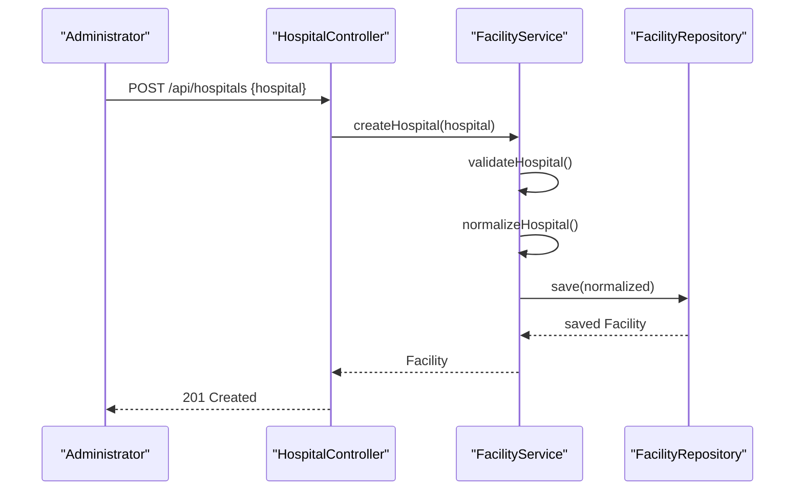
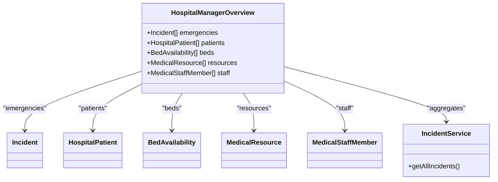
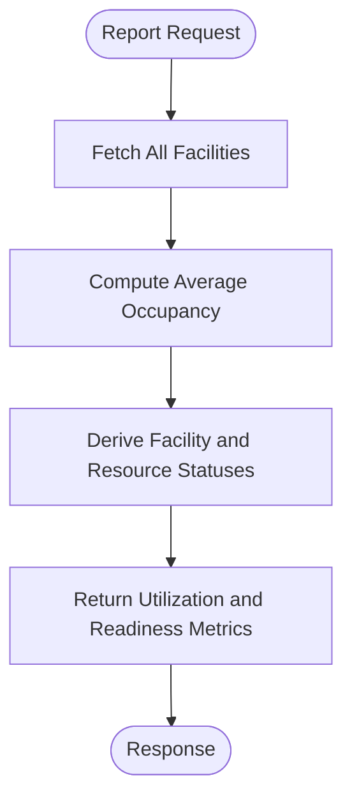
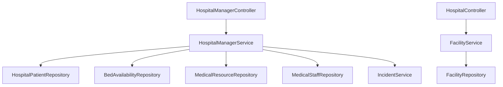

# Hospital Coordination

<cite>
**Referenced Files in This Document**
- [HospitalController.java](file://src/main/java/com/example/ems_command_center/controller/HospitalController.java)
- [HospitalManagerController.java](file://src/main/java/com/example/ems_command_center/controller/HospitalManagerController.java)
- [HospitalManagerService.java](file://src/main/java/com/example/ems_command_center/service/HospitalManagerService.java)
- [FacilityService.java](file://src/main/java/com/example/ems_command_center/service/FacilityService.java)
- [BedAvailability.java](file://src/main/java/com/example/ems_command_center/model/BedAvailability.java)
- [HospitalPatient.java](file://src/main/java/com/example/ems_command_center/model/HospitalPatient.java)
- [MedicalStaffMember.java](file://src/main/java/com/example/ems_command_center/model/MedicalStaffMember.java)
- [MedicalResource.java](file://src/main/java/com/example/ems_command_center/model/MedicalResource.java)
- [Facility.java](file://src/main/java/com/example/ems_command_center/model/Facility.java)
- [Equipment.java](file://src/main/java/com/example/ems_command_center/model/Equipment.java)
- [BedAvailabilityRepository.java](file://src/main/java/com/example/ems_command_center/repository/BedAvailabilityRepository.java)
- [HospitalPatientRepository.java](file://src/main/java/com/example/ems_command_center/repository/HospitalPatientRepository.java)
- [MedicalResourceRepository.java](file://src/main/java/com/example/ems_command_center/repository/MedicalResourceRepository.java)
- [FacilityRepository.java](file://src/main/java/com/example/ems_command_center/repository/FacilityRepository.java)
- [MedicalStaffRepository.java](file://src/main/java/com/example/ems_command_center/repository/MedicalStaffRepository.java)
- [IncidentService.java](file://src/main/java/com/example/ems_command_center/service/IncidentService.java)
- [Incident.java](file://src/main/java/com/example/ems_command_center/model/Incident.java)
- [IncidentRepository.java](file://src/main/java/com/example/ems_command_center/repository/IncidentRepository.java)
</cite>

## Table of Contents
1. [Introduction](#introduction)
2. [Project Structure](#project-structure)
3. [Core Components](#core-components)
4. [Architecture Overview](#architecture-overview)
5. [Detailed Component Analysis](#detailed-component-analysis)
6. [Dependency Analysis](#dependency-analysis)
7. [Performance Considerations](#performance-considerations)
8. [Troubleshooting Guide](#troubleshooting-guide)
9. [Conclusion](#conclusion)
10. [Appendices](#appendices)

## Introduction
This document explains the hospital coordination features implemented in the backend. It covers bed availability management, patient tracking, staff coordination, resource allocation, facility management, integration with incident management, and reporting capabilities. The system is built with Spring Boot and MongoDB, exposing REST APIs for administrators and managers to coordinate hospital operations in real time.

## Project Structure
The hospital coordination domain is organized around models, repositories, services, and controllers:
- Models define the data structures for beds, patients, staff, resources, facilities, and equipment.
- Repositories provide MongoDB access for persistence.
- Services encapsulate business logic for updates, validations, and derived statuses.
- Controllers expose REST endpoints for hospital and manager operations.

**Diagram sources**
- [HospitalController.java:14-56](file://src/main/java/com/example/ems_command_center/controller/HospitalController.java#L14-L56)
- [HospitalManagerController.java:16-62](file://src/main/java/com/example/ems_command_center/controller/HospitalManagerController.java#L16-L62)
- [HospitalManagerService.java:18-41](file://src/main/java/com/example/ems_command_center/service/HospitalManagerService.java#L18-L41)
- [FacilityService.java:13-23](file://src/main/java/com/example/ems_command_center/service/FacilityService.java#L13-L23)
- [BedAvailabilityRepository.java:7-9](file://src/main/java/com/example/ems_command_center/repository/BedAvailabilityRepository.java#L7-L9)
- [HospitalPatientRepository.java:7-9](file://src/main/java/com/example/ems_command_center/repository/HospitalPatientRepository.java#L7-L9)
- [MedicalResourceRepository.java:7-9](file://src/main/java/com/example/ems_command_center/repository/MedicalResourceRepository.java#L7-L9)
- [FacilityRepository.java](file://src/main/java/com/example/ems_command_center/repository/FacilityRepository.java)
- [MedicalStaffRepository.java](file://src/main/java/com/example/ems_command_center/repository/MedicalStaffRepository.java)

**Section sources**
- [HospitalController.java:14-56](file://src/main/java/com/example/ems_command_center/controller/HospitalController.java#L14-L56)
- [HospitalManagerController.java:16-62](file://src/main/java/com/example/ems_command_center/controller/HospitalManagerController.java#L16-L62)
- [HospitalManagerService.java:18-41](file://src/main/java/com/example/ems_command_center/service/HospitalManagerService.java#L18-L41)
- [FacilityService.java:13-23](file://src/main/java/com/example/ems_command_center/service/FacilityService.java#L13-L23)

## Core Components
- Bed Availability Management: Tracks total, occupied, reserved, and available beds per ward, with derived status based on occupancy thresholds.
- Patient Tracking: Manages patient admission, triage, assignments, room, dossier summary, care steps, and validation.
- Staff Coordination: Stores staff roles, specialties, shifts, and status for assignment and allocation.
- Resource Allocation: Tracks medical resource units, categories, locations, and availability with status derived from stock levels.
- Facility Management: Hospital CRUD operations, occupancy normalization, wait types, and status labels.
- Integration with Incident Management: Centralized overview aggregates incidents, patients, beds, resources, and staff for situational awareness.
- Reporting Capabilities: Average occupancy calculation and status derivations support operational reporting.

**Section sources**
- [BedAvailability.java:6-16](file://src/main/java/com/example/ems_command_center/model/BedAvailability.java#L6-L16)
- [HospitalPatient.java:8-27](file://src/main/java/com/example/ems_command_center/model/HospitalPatient.java#L8-L27)
- [MedicalStaffMember.java:6-15](file://src/main/java/com/example/ems_command_center/model/MedicalStaffMember.java#L6-L15)
- [MedicalResource.java:6-17](file://src/main/java/com/example/ems_command_center/model/MedicalResource.java#L6-L17)
- [Facility.java:7-26](file://src/main/java/com/example/ems_command_center/model/Facility.java#L7-L26)
- [HospitalManagerOverview.java:5-12](file://src/main/java/com/example/ems_command_center/model/HospitalManagerOverview.java#L5-L12)
- [FacilityService.java:70-75](file://src/main/java/com/example/ems_command_center/service/FacilityService.java#L70-L75)

## Architecture Overview
The hospital coordination architecture follows a layered pattern:
- Presentation: Controllers expose endpoints for hospital and manager operations.
- Application: Services implement business rules, validations, and derived status calculations.
- Persistence: Repositories manage MongoDB collections for models.

**Diagram sources**
- [HospitalController.java:14-56](file://src/main/java/com/example/ems_command_center/controller/HospitalController.java#L14-L56)
- [HospitalManagerController.java:16-62](file://src/main/java/com/example/ems_command_center/controller/HospitalManagerController.java#L16-L62)
- [FacilityService.java:13-23](file://src/main/java/com/example/ems_command_center/service/FacilityService.java#L13-L23)
- [HospitalManagerService.java:18-41](file://src/main/java/com/example/ems_command_center/service/HospitalManagerService.java#L18-L41)
- [IncidentService.java](file://src/main/java/com/example/ems_command_center/service/IncidentService.java)
- [FacilityRepository.java](file://src/main/java/com/example/ems_command_center/repository/FacilityRepository.java)
- [BedAvailabilityRepository.java:7-9](file://src/main/java/com/example/ems_command_center/repository/BedAvailabilityRepository.java#L7-L9)
- [HospitalPatientRepository.java:7-9](file://src/main/java/com/example/ems_command_center/repository/HospitalPatientRepository.java#L7-L9)
- [MedicalResourceRepository.java:7-9](file://src/main/java/com/example/ems_command_center/repository/MedicalResourceRepository.java#L7-L9)
- [MedicalStaffRepository.java](file://src/main/java/com/example/ems_command_center/repository/MedicalStaffRepository.java)
- [IncidentRepository.java](file://src/main/java/com/example/ems_command_center/repository/IncidentRepository.java)

## Detailed Component Analysis

### Bed Availability Management
Bed availability is modeled as a record with fields for ward, total beds, occupied beds, reserved beds, computed available beds, and status. The service enforces:
- Non-negative occupied/reserved counts.
- Available beds computed as total minus occupied minus reserved (non-negative).
- Status derived from occupancy percentage thresholds.

**Diagram sources**
- [HospitalManagerService.java:79-99](file://src/main/java/com/example/ems_command_center/service/HospitalManagerService.java#L79-L99)
- [BedAvailability.java:6-16](file://src/main/java/com/example/ems_command_center/model/BedAvailability.java#L6-L16)

**Section sources**
- [BedAvailability.java:6-16](file://src/main/java/com/example/ems_command_center/model/BedAvailability.java#L6-L16)
- [HospitalManagerService.java:79-99](file://src/main/java/com/example/ems_command_center/service/HospitalManagerService.java#L79-L99)

### Patient Tracking System
Patient tracking supports admission, triage, assignments, room, dossier summary, care steps, and validation. The service:
- Updates non-blank fields while preserving existing values.
- Maintains care steps list and validates care flag.
- Records timestamps for updates.

**Diagram sources**
- [HospitalManagerController.java:34-39](file://src/main/java/com/example/ems_command_center/controller/HospitalManagerController.java#L34-L39)
- [HospitalManagerService.java:53-77](file://src/main/java/com/example/ems_command_center/service/HospitalManagerService.java#L53-L77)
- [HospitalPatientRepository.java:7-9](file://src/main/java/com/example/ems_command_center/repository/HospitalPatientRepository.java#L7-L9)

**Section sources**
- [HospitalPatient.java:8-27](file://src/main/java/com/example/ems_command_center/model/HospitalPatient.java#L8-L27)
- [HospitalManagerService.java:53-77](file://src/main/java/com/example/ems_command_center/service/HospitalManagerService.java#L53-L77)

### Staff Coordination Mechanisms
Staff records capture name, role, specialty, shift, and status. The manager overview aggregates staff alongside incidents, patients, beds, and resources for centralized coordination.

**Diagram sources**
- [MedicalStaffMember.java:6-15](file://src/main/java/com/example/ems_command_center/model/MedicalStaffMember.java#L6-L15)
- [HospitalManagerOverview.java:5-12](file://src/main/java/com/example/ems_command_center/model/HospitalManagerOverview.java#L5-L12)

**Section sources**
- [MedicalStaffMember.java:6-15](file://src/main/java/com/example/ems_command_center/model/MedicalStaffMember.java#L6-L15)
- [HospitalManagerOverview.java:5-12](file://src/main/java/com/example/ems_command_center/model/HospitalManagerOverview.java#L5-L12)

### Resource Allocation Strategies
Medical resources track available and total units, category, location, and status. The service derives status based on available-to-total ratios and persists normalized updates.

**Diagram sources**
- [HospitalManagerService.java:101-120](file://src/main/java/com/example/ems_command_center/service/HospitalManagerService.java#L101-L120)
- [MedicalResource.java:6-17](file://src/main/java/com/example/ems_command_center/model/MedicalResource.java#L6-L17)

**Section sources**
- [MedicalResource.java:6-17](file://src/main/java/com/example/ems_command_center/model/MedicalResource.java#L6-L17)
- [HospitalManagerService.java:101-120](file://src/main/java/com/example/ems_command_center/service/HospitalManagerService.java#L101-L120)

### Facility Management Interface
The facility service manages hospital CRUD operations, validates inputs, normalizes occupancy-derived fields, and computes average occupancy for reporting.

**Diagram sources**
- [HospitalController.java:32-37](file://src/main/java/com/example/ems_command_center/controller/HospitalController.java#L32-L37)
- [FacilityService.java:33-36](file://src/main/java/com/example/ems_command_center/service/FacilityService.java#L33-L36)
- [FacilityRepository.java](file://src/main/java/com/example/ems_command_center/repository/FacilityRepository.java)

**Section sources**
- [Facility.java:7-26](file://src/main/java/com/example/ems_command_center/model/Facility.java#L7-L26)
- [FacilityService.java:29-60](file://src/main/java/com/example/ems_command_center/service/FacilityService.java#L29-L60)
- [HospitalController.java:25-30](file://src/main/java/com/example/ems_command_center/controller/HospitalController.java#L25-L30)

### Integration with Incident Management
The manager overview aggregates incidents alongside patients, beds, resources, and staff, enabling coordinated decision-making during emergencies.

**Diagram sources**
- [HospitalManagerOverview.java:5-12](file://src/main/java/com/example/ems_command_center/model/HospitalManagerOverview.java#L5-L12)
- [HospitalManagerService.java:43-51](file://src/main/java/com/example/ems_command_center/service/HospitalManagerService.java#L43-L51)
- [IncidentService.java](file://src/main/java/com/example/ems_command_center/service/IncidentService.java)

**Section sources**
- [HospitalManagerOverview.java:5-12](file://src/main/java/com/example/ems_command_center/model/HospitalManagerOverview.java#L5-L12)
- [HospitalManagerService.java:43-51](file://src/main/java/com/example/ems_command_center/service/HospitalManagerService.java#L43-L51)

### Reporting Capabilities
Reporting features include:
- Average occupancy across hospitals for utilization metrics.
- Derived statuses for facilities and resources to assess readiness.
- Timestamped updates for care validation and resource changes.

**Diagram sources**
- [FacilityService.java:70-75](file://src/main/java/com/example/ems_command_center/service/FacilityService.java#L70-L75)
- [FacilityService.java:136-158](file://src/main/java/com/example/ems_command_center/service/FacilityService.java#L136-L158)
- [HospitalManagerService.java:166-174](file://src/main/java/com/example/ems_command_center/service/HospitalManagerService.java#L166-L174)

**Section sources**
- [FacilityService.java:70-75](file://src/main/java/com/example/ems_command_center/service/FacilityService.java#L70-L75)
- [HospitalManagerService.java:166-174](file://src/main/java/com/example/ems_command_center/service/HospitalManagerService.java#L166-L174)

## Dependency Analysis
The following diagram shows key dependencies among components involved in hospital coordination:

**Diagram sources**
- [HospitalManagerController.java:16-62](file://src/main/java/com/example/ems_command_center/controller/HospitalManagerController.java#L16-L62)
- [HospitalController.java:14-56](file://src/main/java/com/example/ems_command_center/controller/HospitalController.java#L14-L56)
- [HospitalManagerService.java:18-41](file://src/main/java/com/example/ems_command_center/service/HospitalManagerService.java#L18-L41)
- [FacilityService.java:13-23](file://src/main/java/com/example/ems_command_center/service/FacilityService.java#L13-L23)
- [BedAvailabilityRepository.java:7-9](file://src/main/java/com/example/ems_command_center/repository/BedAvailabilityRepository.java#L7-L9)
- [HospitalPatientRepository.java:7-9](file://src/main/java/com/example/ems_command_center/repository/HospitalPatientRepository.java#L7-L9)
- [MedicalResourceRepository.java:7-9](file://src/main/java/com/example/ems_command_center/repository/MedicalResourceRepository.java#L7-L9)
- [MedicalStaffRepository.java](file://src/main/java/com/example/ems_command_center/repository/MedicalStaffRepository.java)
- [FacilityRepository.java](file://src/main/java/com/example/ems_command_center/repository/FacilityRepository.java)
- [IncidentService.java](file://src/main/java/com/example/ems_command_center/service/IncidentService.java)

**Section sources**
- [HospitalManagerController.java:16-62](file://src/main/java/com/example/ems_command_center/controller/HospitalManagerController.java#L16-L62)
- [HospitalController.java:14-56](file://src/main/java/com/example/ems_command_center/controller/HospitalController.java#L14-L56)
- [HospitalManagerService.java:18-41](file://src/main/java/com/example/ems_command_center/service/HospitalManagerService.java#L18-L41)
- [FacilityService.java:13-23](file://src/main/java/com/example/ems_command_center/service/FacilityService.java#L13-L23)

## Performance Considerations
- Prefer batch operations for bulk updates to reduce round trips when adjusting bed availability, patient records, or resource allocations.
- Index MongoDB collections on frequently queried fields (e.g., emergencyId, status, ward) to improve lookup performance.
- Use pagination for overview endpoints aggregating large datasets to avoid heavy payloads.
- Cache derived statuses (e.g., facility type, wait type) when appropriate to minimize repeated computations.

## Troubleshooting Guide
Common issues and resolutions:
- Not Found Errors: Updating non-existent patients, beds, or resources raises not found errors. Verify IDs and existence before updates.
- Validation Failures: Hospital updates require valid occupancy, ICU values, and allowed types. Correct inputs according to validation rules.
- Status Derivations: If statuses appear unexpected, confirm occupancy percentages and resource availability ratios meet thresholds.

**Section sources**
- [HospitalManagerService.java:54-56](file://src/main/java/com/example/ems_command_center/service/HospitalManagerService.java#L54-L56)
- [HospitalManagerService.java:80-82](file://src/main/java/com/example/ems_command_center/service/HospitalManagerService.java#L80-L82)
- [HospitalManagerService.java:101-103](file://src/main/java/com/example/ems_command_center/service/HospitalManagerService.java#L101-L103)
- [FacilityService.java:77-109](file://src/main/java/com/example/ems_command_center/service/FacilityService.java#L77-L109)

## Conclusion
The hospital coordination module provides a robust foundation for real-time bed tracking, patient lifecycle management, staff and resource allocation, and facility oversight. Its integration with incident management and derived reporting enables informed decision-making during routine operations and emergencies.

## Appendices
- Endpoint Reference
  - Hospitals: GET/POST/PUT/DELETE /api/hospitals
  - Hospital Manager: GET overview, PUT /patients/{id}, PUT /beds/{id}, PUT /resources/{id}, POST /patients/{id}/validate-care
- Data Model Notes
  - Beds: computed availableBeds and status derived from occupancy.
  - Patients: care steps preserved when not provided; validation sets status and timestamps.
  - Resources: status derived from available/total ratio.
  - Facilities: occupancy-derived type, waitType, and status; average occupancy supported.