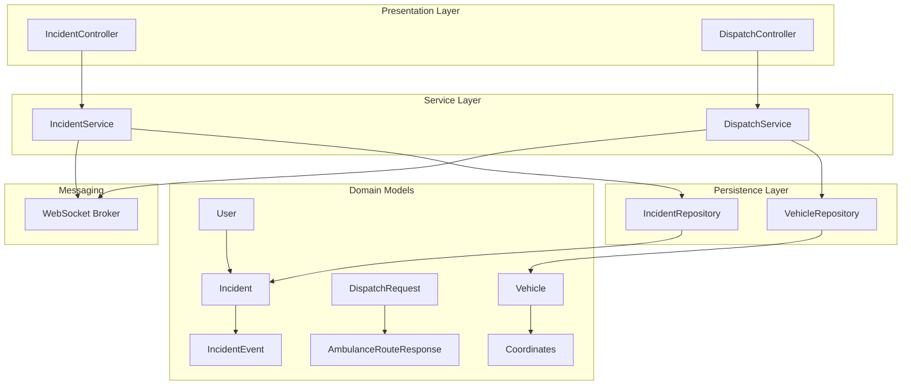
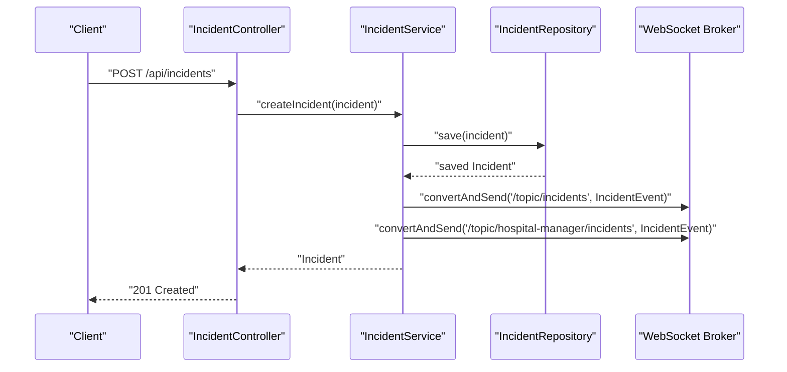
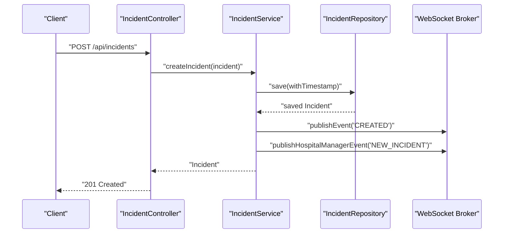
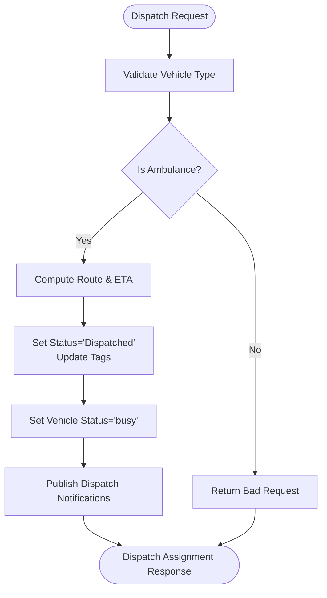
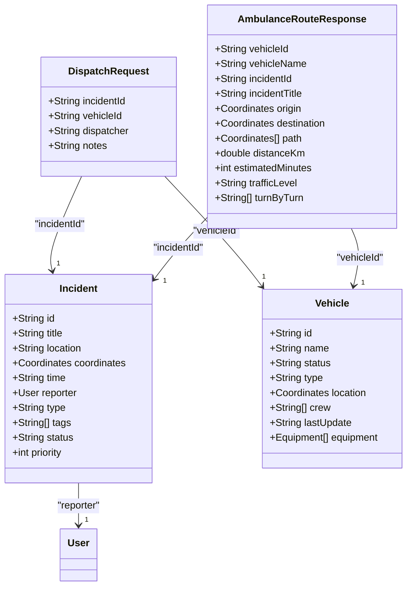
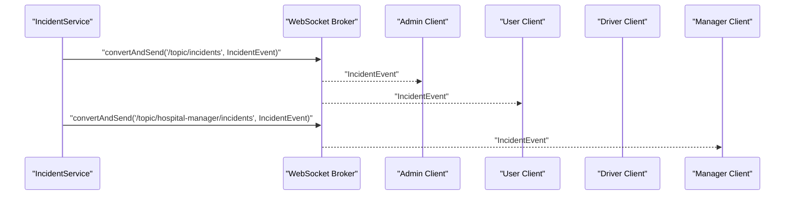
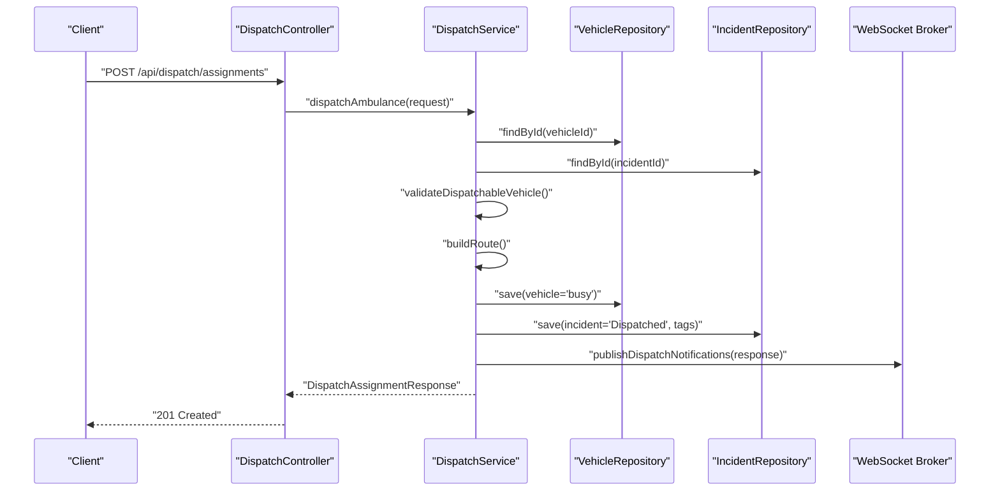
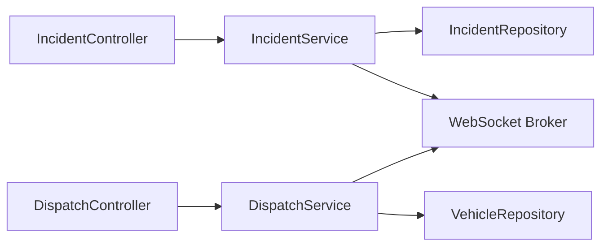

# Incident Management

<cite>
**Referenced Files in This Document**
- [Incident.java](file://src/main/java/com/example/ems_command_center/model/Incident.java)
- [IncidentEvent.java](file://src/main/java/com/example/ems_command_center/model/IncidentEvent.java)
- [IncidentService.java](file://src/main/java/com/example/ems_command_center/service/IncidentService.java)
- [IncidentController.java](file://src/main/java/com/example/ems_command_center/controller/IncidentController.java)
- [IncidentRepository.java](file://src/main/java/com/example/ems_command_center/repository/IncidentRepository.java)
- [DispatchService.java](file://src/main/java/com/example/ems_command_center/service/DispatchService.java)
- [DispatchController.java](file://src/main/java/com/example/ems_command_center/controller/DispatchController.java)
- [DispatchRequest.java](file://src/main/java/com/example/ems_command_center/model/DispatchRequest.java)
- [AmbulanceRouteResponse.java](file://src/main/java/com/example/ems_command_center/model/AmbulanceRouteResponse.java)
- [Vehicle.java](file://src/main/java/com/example/ems_command_center/model/Vehicle.java)
- [User.java](file://src/main/java/com/example/ems_command_center/model/User.java)
- [Coordinates.java](file://src/main/java/com/example/ems_command_center/model/Coordinates.java)
- [application.yml](file://src/main/resources/application.yml)
</cite>

## Table of Contents
1. [Introduction](#introduction)
2. [Project Structure](#project-structure)
3. [Core Components](#core-components)
4. [Architecture Overview](#architecture-overview)
5. [Detailed Component Analysis](#detailed-component-analysis)
6. [Dependency Analysis](#dependency-analysis)
7. [Performance Considerations](#performance-considerations)
8. [Troubleshooting Guide](#troubleshooting-guide)
9. [Conclusion](#conclusion)
10. [Appendices](#appendices)

## Introduction
This document describes the incident management system that powers emergency incident creation, lifecycle tracking, dispatch orchestration, and real-time communication. It covers:
- Incident creation workflows (automated detection, manual reporting, emergency call processing)
- Lifecycle management (status transitions, priority assignment, escalation)
- Priority and status management (severity classification, response targets, resource allocation)
- Tag-based organization (location, type, urgency)
- Event tracking (audit trails, status change history, communication logs)
- Search and filtering, bulk operations, and reporting
- Integration with the dispatch system for automatic resource assignment and live updates

## Project Structure
The system follows a layered Spring Boot architecture:
- Model layer defines domain entities and DTOs
- Repository layer persists and queries data from MongoDB
- Service layer implements business logic and event publishing
- Controller layer exposes REST endpoints and enforces authorization
- WebSocket messaging enables real-time updates across roles

**Diagram sources**
- [IncidentController.java:14-60](file://src/main/java/com/example/ems_command_center/controller/IncidentController.java#L14-L60)
- [DispatchController.java:22-56](file://src/main/java/com/example/ems_command_center/controller/DispatchController.java#L22-L56)
- [IncidentService.java:15-105](file://src/main/java/com/example/ems_command_center/service/IncidentService.java#L15-L105)
- [DispatchService.java:21-213](file://src/main/java/com/example/ems_command_center/service/DispatchService.java#L21-L213)
- [IncidentRepository.java:9-13](file://src/main/java/com/example/ems_command_center/repository/IncidentRepository.java#L9-L13)
- [Incident.java:8-23](file://src/main/java/com/example/ems_command_center/model/Incident.java#L8-L23)
- [IncidentEvent.java:3-8](file://src/main/java/com/example/ems_command_center/model/IncidentEvent.java#L3-L8)
- [DispatchRequest.java:3-9](file://src/main/java/com/example/ems_command_center/model/DispatchRequest.java#L3-L9)
- [AmbulanceRouteResponse.java:5-18](file://src/main/java/com/example/ems_command_center/model/AmbulanceRouteResponse.java#L5-L18)
- [Vehicle.java:8-18](file://src/main/java/com/example/ems_command_center/model/Vehicle.java#L8-L18)
- [User.java:8-31](file://src/main/java/com/example/ems_command_center/model/User.java#L8-L31)
- [Coordinates.java:3-4](file://src/main/java/com/example/ems_command_center/model/Coordinates.java#L3-L4)

**Section sources**
- [application.yml:1-36](file://src/main/resources/application.yml#L1-L36)

## Core Components
- Incident entity: stores title, location, coordinates, timestamp, reporter, type, tags, status, and priority.
- IncidentService: CRUD operations, sorting by priority, event publishing to general and hospital-manager topics.
- IncidentController: REST endpoints for listing, retrieving, creating, updating, and deleting incidents.
- IncidentRepository: MongoDB repository with status and priority sort queries.
- DispatchService: finds available ambulances, computes routes, dispatches vehicles, updates tags/status, publishes notifications.
- DispatchController: endpoints for listing available ambulances, previewing routes, and creating dispatch assignments.
- Messaging: Spring WebSocket broker publishes incident and dispatch events to role-scoped channels.

**Section sources**
- [Incident.java:8-23](file://src/main/java/com/example/ems_command_center/model/Incident.java#L8-L23)
- [IncidentService.java:15-105](file://src/main/java/com/example/ems_command_center/service/IncidentService.java#L15-L105)
- [IncidentController.java:14-60](file://src/main/java/com/example/ems_command_center/controller/IncidentController.java#L14-L60)
- [IncidentRepository.java:9-13](file://src/main/java/com/example/ems_command_center/repository/IncidentRepository.java#L9-L13)
- [DispatchService.java:21-213](file://src/main/java/com/example/ems_command_center/service/DispatchService.java#L21-L213)
- [DispatchController.java:22-56](file://src/main/java/com/example/ems_command_center/controller/DispatchController.java#L22-L56)

## Architecture Overview
The system integrates REST APIs, MongoDB persistence, and WebSocket messaging. Incident and dispatch operations emit events to subscribed clients (roles: ADMIN, USER, DRIVER, MANAGER).

**Diagram sources**
- [IncidentController.java:39-44](file://src/main/java/com/example/ems_command_center/controller/IncidentController.java#L39-L44)
- [IncidentService.java:35-50](file://src/main/java/com/example/ems_command_center/service/IncidentService.java#L35-L50)
- [IncidentEvent.java:3-8](file://src/main/java/com/example/ems_command_center/model/IncidentEvent.java#L3-L8)

## Detailed Component Analysis

### Incident Creation Workflows
- Manual reporting: Clients submit incident payloads via the incident controller. The service saves the incident and publishes creation events to general and hospital-manager topics.
- Automated detection: Not implemented in the current codebase; however, the incident model supports ingestion of external signals. The service timestamps entries and emits events upon save.
- Emergency call processing: The incident model includes a type field indicating urgency. While the controller does not enforce a dedicated endpoint for emergency calls, the dispatch service uses incident type to compute route speed and traffic assumptions.

**Diagram sources**
- [IncidentController.java:39-44](file://src/main/java/com/example/ems_command_center/controller/IncidentController.java#L39-L44)
- [IncidentService.java:35-50](file://src/main/java/com/example/ems_command_center/service/IncidentService.java#L35-L50)

**Section sources**
- [IncidentController.java:39-44](file://src/main/java/com/example/ems_command_center/controller/IncidentController.java#L39-L44)
- [IncidentService.java:35-50](file://src/main/java/com/example/ems_command_center/service/IncidentService.java#L35-L50)
- [Incident.java:17-18](file://src/main/java/com/example/ems_command_center/model/Incident.java#L17-L18)

### Incident Lifecycle Management
- Status transitions: The incident entity exposes a status field. Dispatching updates the incident status to “Dispatched” and enriches tags with dispatcher and notes. Other transitions (e.g., Resolved) are not implemented in the current codebase.
- Priority assignment: The incident entity includes a priority integer. The service sorts incidents by ascending priority. Priority computation logic is not present in the current codebase; it would require extending the model and service to derive priority from severity/type/time-to-respond.
- Escalation procedures: Not implemented in the current codebase. A future enhancement could introduce escalation rules based on priority thresholds, elapsed time, or incident type.

**Diagram sources**
- [DispatchService.java:53-119](file://src/main/java/com/example/ems_command_center/service/DispatchService.java#L53-L119)

**Section sources**
- [Incident.java:18-20](file://src/main/java/com/example/ems_command_center/model/Incident.java#L18-L20)
- [DispatchService.java:53-119](file://src/main/java/com/example/ems_command_center/service/DispatchService.java#L53-L119)

### Priority and Status Management System
- Severity classification: The incident type field distinguishes urgent vs normal incidents. The dispatch service uses this to compute average speeds and traffic conditions.
- Response time targets: Estimated minutes are derived from distance and type-specific average speeds. The route builder also generates turn-by-turn steps and traffic assumptions.
- Resource allocation: Available ambulances are filtered by status and type. Dispatch assigns the next closest available unit and updates tags to reflect the assigned vehicle and dispatcher.

**Diagram sources**
- [Incident.java:8-23](file://src/main/java/com/example/ems_command_center/model/Incident.java#L8-L23)
- [Vehicle.java:8-18](file://src/main/java/com/example/ems_command_center/model/Vehicle.java#L8-L18)
- [DispatchRequest.java:3-9](file://src/main/java/com/example/ems_command_center/model/DispatchRequest.java#L3-L9)
- [AmbulanceRouteResponse.java:5-18](file://src/main/java/com/example/ems_command_center/model/AmbulanceRouteResponse.java#L5-L18)

**Section sources**
- [DispatchService.java:173-182](file://src/main/java/com/example/ems_command_center/service/DispatchService.java#L173-L182)
- [DispatchService.java:137-171](file://src/main/java/com/example/ems_command_center/service/DispatchService.java#L137-L171)

### Tag-Based Organization System
- Tags capture contextual metadata such as vehicle dispatch, dispatcher identity, and optional notes. On dispatch, existing vehicle-specific tags are removed and replaced with a standardized “<vehicle> Dispatched” tag, plus “Dispatcher: <name>” and optional “Notes: ...”.

**Section sources**
- [DispatchService.java:79-85](file://src/main/java/com/example/ems_command_center/service/DispatchService.java#L79-L85)
- [DispatchService.java:95-98](file://src/main/java/com/example/ems_command_center/service/DispatchService.java#L95-L98)

### Incident Event Tracking
- Audit trails: Each create/update/delete triggers an IncidentEvent published to WebSocket topics for general and hospital-manager scopes.
- Status change history: Not persisted as a separate entity; status changes occur via updates and reflected in the incident document and subsequent events.
- Communication logs: Dispatch notifications are published to driver and manager channels, enabling real-time visibility.

**Diagram sources**
- [IncidentService.java:88-104](file://src/main/java/com/example/ems_command_center/service/IncidentService.java#L88-L104)

**Section sources**
- [IncidentEvent.java:3-8](file://src/main/java/com/example/ems_command_center/model/IncidentEvent.java#L3-L8)
- [IncidentService.java:88-104](file://src/main/java/com/example/ems_command_center/service/IncidentService.java#L88-L104)

### Search, Filtering, Bulk Operations, and Reporting
- Search and filtering: The incident repository exposes a status filter and a priority-sorted listing. Additional filters (e.g., by type, tags, time range) are not implemented in the current codebase.
- Bulk operations: Not implemented. The controller supports per-item create/update/delete endpoints.
- Reporting: Not implemented. Analytics endpoints exist elsewhere in the codebase; incident analytics could leverage the existing repository and event streams.

**Section sources**
- [IncidentRepository.java:10-13](file://src/main/java/com/example/ems_command_center/repository/IncidentRepository.java#L10-L13)
- [IncidentController.java:25-30](file://src/main/java/com/example/ems_command_center/controller/IncidentController.java#L25-L30)

### Dispatch Integration and Real-Time Updates
- Automatic resource assignment: The dispatch service selects available ambulances and dispatches the nearest one based on current location and type.
- Real-time status updates: Dispatch notifications are published to:
  - General drivers topic for dispatch center visibility
  - Driver-specific topic for the assigned ambulance
  - Hospital manager topic for coordination

**Diagram sources**
- [DispatchController.java:50-55](file://src/main/java/com/example/ems_command_center/controller/DispatchController.java#L50-L55)
- [DispatchService.java:53-119](file://src/main/java/com/example/ems_command_center/service/DispatchService.java#L53-L119)
- [DispatchService.java:205-212](file://src/main/java/com/example/ems_command_center/service/DispatchService.java#L205-L212)

**Section sources**
- [DispatchController.java:33-38](file://src/main/java/com/example/ems_command_center/controller/DispatchController.java#L33-L38)
- [DispatchController.java:40-48](file://src/main/java/com/example/ems_command_center/controller/DispatchController.java#L40-L48)
- [DispatchController.java:50-55](file://src/main/java/com/example/ems_command_center/controller/DispatchController.java#L50-L55)
- [DispatchService.java:40-44](file://src/main/java/com/example/ems_command_center/service/DispatchService.java#L40-L44)
- [DispatchService.java:137-171](file://src/main/java/com/example/ems_command_center/service/DispatchService.java#L137-L171)
- [DispatchService.java:205-212](file://src/main/java/com/example/ems_command_center/service/DispatchService.java#L205-L212)

## Dependency Analysis
- Controllers depend on services for business logic.
- Services depend on repositories for persistence and on the WebSocket template for event broadcasting.
- Models are POJOs/records with minimal behavior; relationships are expressed via DBRefs and records.

**Diagram sources**
- [IncidentController.java:19-23](file://src/main/java/com/example/ems_command_center/controller/IncidentController.java#L19-L23)
- [DispatchController.java:27-31](file://src/main/java/com/example/ems_command_center/controller/DispatchController.java#L27-L31)
- [IncidentService.java:18-24](file://src/main/java/com/example/ems_command_center/service/IncidentService.java#L18-L24)
- [DispatchService.java:26-38](file://src/main/java/com/example/ems_command_center/service/DispatchService.java#L26-L38)

**Section sources**
- [IncidentService.java:18-24](file://src/main/java/com/example/ems_command_center/service/IncidentService.java#L18-L24)
- [DispatchService.java:26-38](file://src/main/java/com/example/ems_command_center/service/DispatchService.java#L26-L38)

## Performance Considerations
- Sorting by priority: The repository sorts incidents by priority ascending; ensure indexes exist for efficient retrieval.
- Dispatch route computation: Distance calculation uses the haversine formula; consider caching frequently requested routes or limiting concurrent computations.
- WebSocket scalability: Events are broadcast to multiple subscribers; monitor subscription counts and message volume.
- Authorization overhead: Role checks are enforced at endpoints; keep JWT claims minimal and leverage caching where appropriate.

[No sources needed since this section provides general guidance]

## Troubleshooting Guide
- Incident not found errors: Occur when fetching/updating/deleting non-existent incidents. Verify IDs and repository queries.
- Vehicle not found errors: Occur when dispatching with invalid vehicle IDs. Confirm vehicle existence and type.
- Dispatch validation failures: Only ambulances can be dispatched; ensure vehicle type is correct.
- WebSocket delivery issues: Confirm subscriptions to topics and broker connectivity.

**Section sources**
- [IncidentService.java:30-33](file://src/main/java/com/example/ems_command_center/service/IncidentService.java#L30-L33)
- [IncidentService.java:52-59](file://src/main/java/com/example/ems_command_center/service/IncidentService.java#L52-L59)
- [DispatchService.java:121-129](file://src/main/java/com/example/ems_command_center/service/DispatchService.java#L121-L129)
- [DispatchService.java:131-135](file://src/main/java/com/example/ems_command_center/service/DispatchService.java#L131-L135)

## Conclusion
The incident management system provides a solid foundation for incident creation, lifecycle tracking, and dispatch orchestration. It supports real-time updates, role-scoped messaging, and extensible tagging. Future enhancements should focus on automated priority assignment, escalation rules, comprehensive search/filtering, and persistent status change history.

[No sources needed since this section summarizes without analyzing specific files]

## Appendices

### API Definitions

- Incident Management
  - GET /api/incidents: Fetch all incidents sorted by priority
  - GET /api/incidents/by-id/{id}: Fetch a single incident by id
  - POST /api/incidents: Report a new incident
  - PUT /api/incidents/{id}: Update an existing incident
  - DELETE /api/incidents/{id}: Delete an incident

- Dispatch Management
  - GET /api/dispatch/ambulances/available: List all available ambulances
  - GET /api/dispatch/routes?vehicleId={id}&incidentId={id}: Preview the suggested route
  - POST /api/dispatch/assignments: Dispatch an ambulance to an incident

Authorization roles:
- ADMIN, MANAGER, USER, DRIVER

**Section sources**
- [IncidentController.java:25-60](file://src/main/java/com/example/ems_command_center/controller/IncidentController.java#L25-L60)
- [DispatchController.java:33-55](file://src/main/java/com/example/ems_command_center/controller/DispatchController.java#L33-L55)