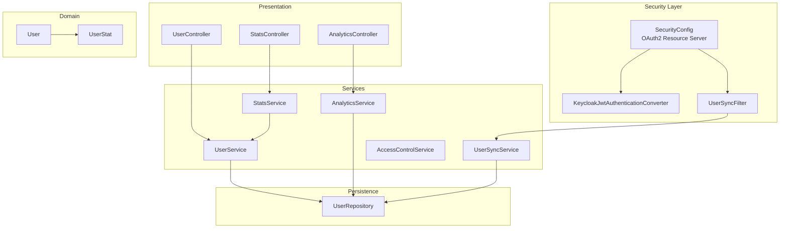
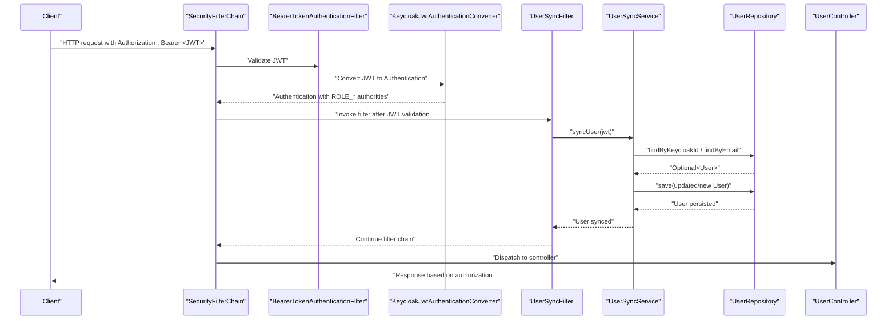
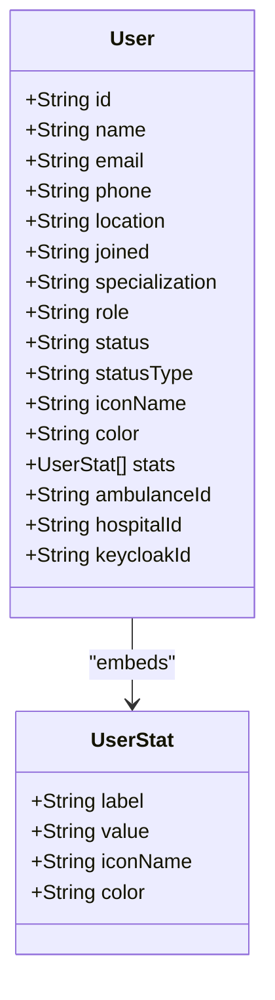
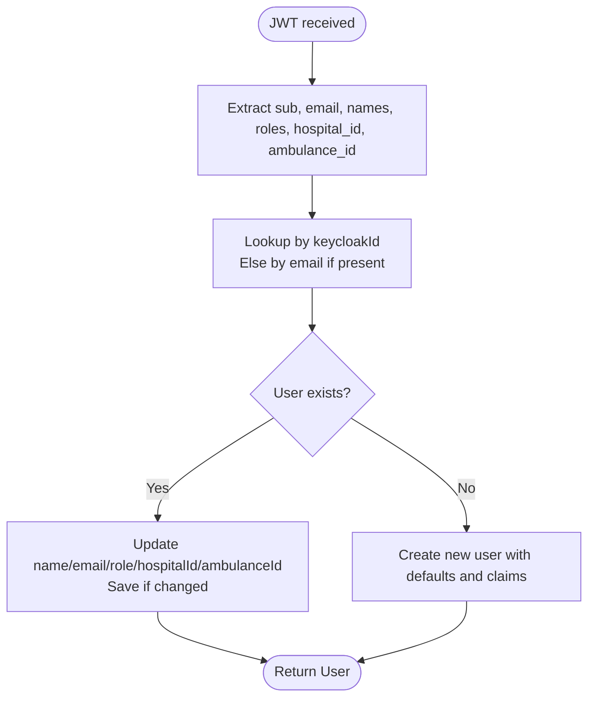
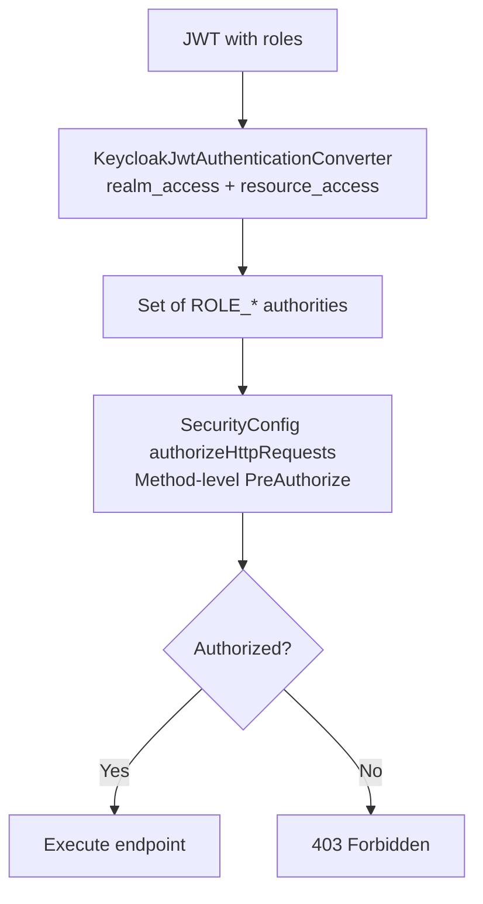
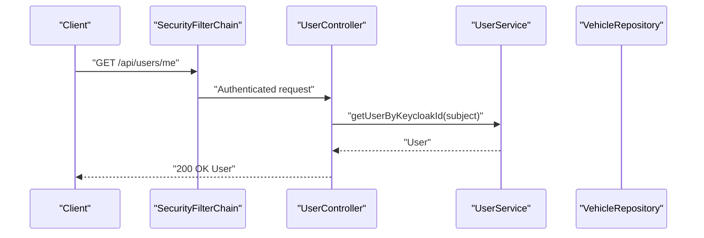
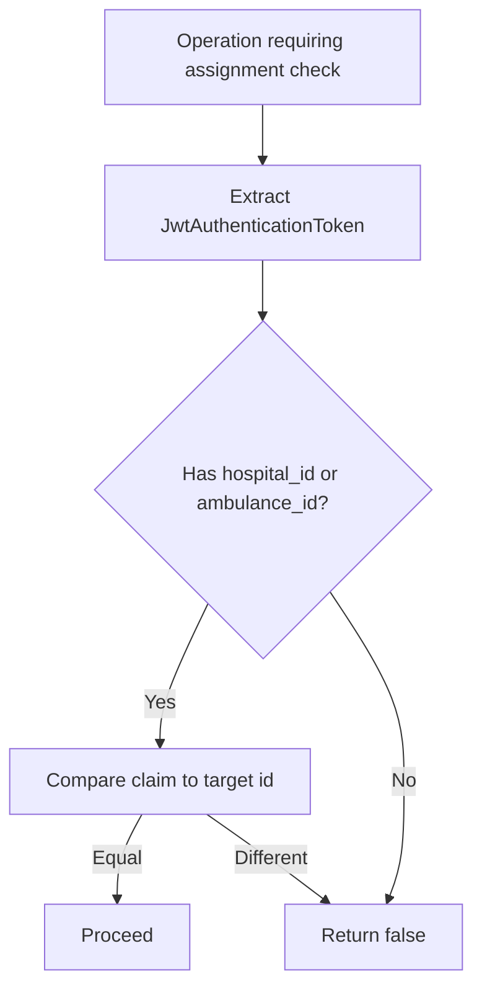
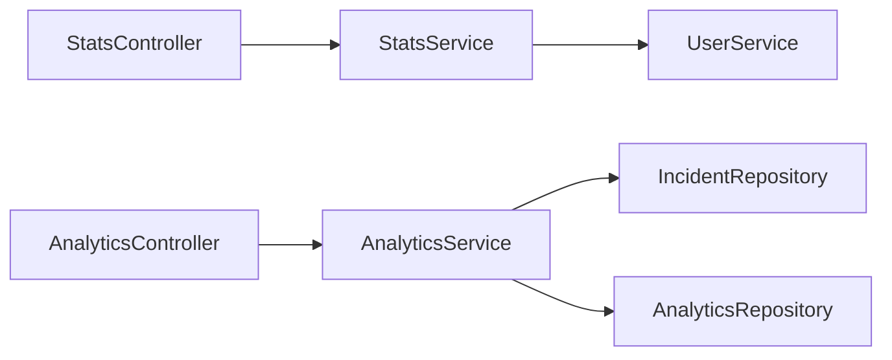
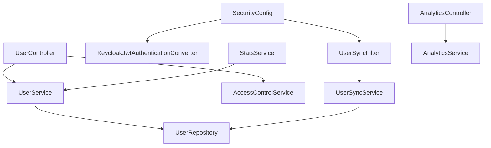

# User Management

<cite>
**Referenced Files in This Document**
- [User.java](file://src/main/java/com/example/ems_command_center/model/User.java)
- [UserStat.java](file://src/main/java/com/example/ems_command_center/model/UserStat.java)
- [UserController.java](file://src/main/java/com/example/ems_command_center/controller/UserController.java)
- [UserService.java](file://src/main/java/com/example/ems_command_center/service/UserService.java)
- [UserRepository.java](file://src/main/java/com/example/ems_command_center/repository/UserRepository.java)
- [UserSyncService.java](file://src/main/java/com/example/ems_command_center/service/UserSyncService.java)
- [UserSyncFilter.java](file://src/main/java/com/example/ems_command_center/config/UserSyncFilter.java)
- [SecurityConfig.java](file://src/main/java/com/example/ems_command_center/config/SecurityConfig.java)
- [KeycloakJwtAuthenticationConverter.java](file://src/main/java/com/example/ems_command_center/config/KeycloakJwtAuthenticationConverter.java)
- [AccessControlService.java](file://src/main/java/com/example/ems_command_center/service/AccessControlService.java)
- [StatsController.java](file://src/main/java/com/example/ems_command_center/controller/StatsController.java)
- [StatsService.java](file://src/main/java/com/example/ems_command_center/service/StatsService.java)
- [AnalyticsController.java](file://src/main/java/com/example/ems_command_center/controller/AnalyticsController.java)
- [AnalyticsService.java](file://src/main/java/com/example/ems_command_center/service/AnalyticsService.java)
- [application.yml](file://src/main/resources/application.yml)
</cite>

## Table of Contents
1. [Introduction](#introduction)
2. [Project Structure](#project-structure)
3. [Core Components](#core-components)
4. [Architecture Overview](#architecture-overview)
5. [Detailed Component Analysis](#detailed-component-analysis)
6. [Dependency Analysis](#dependency-analysis)
7. [Performance Considerations](#performance-considerations)
8. [Troubleshooting Guide](#troubleshooting-guide)
9. [Conclusion](#conclusion)

## Introduction
This document describes the user management functionality of the system, focusing on:
- User registration via Keycloak and local synchronization
- Role-based access control (ADMIN, MANAGER, DRIVER, USER)
- User profile management and driver assignment retrieval
- Keycloak integration for centralized authentication and role propagation
- User synchronization between the local database and Keycloak
- User statistics and analytics exposure for dashboards

## Project Structure
The user management domain spans models, repositories, services, controllers, and security configuration. Key areas:
- Model: User entity and embedded statistics
- Repository: MongoDB access for user queries
- Service: Business logic for CRUD, driver/manager lookup, and synchronization
- Controller: REST endpoints for user administration and profile retrieval
- Security: OAuth2/OIDC configuration, JWT conversion, and method-level authorization
- Synchronization: Filter-based user creation/update on JWT validation

**Diagram sources**
- [SecurityConfig.java:44-98](file://src/main/java/com/example/ems_command_center/config/SecurityConfig.java#L44-L98)
- [KeycloakJwtAuthenticationConverter.java:29-41](file://src/main/java/com/example/ems_command_center/config/KeycloakJwtAuthenticationConverter.java#L29-L41)
- [UserSyncFilter.java:26-42](file://src/main/java/com/example/ems_command_center/config/UserSyncFilter.java#L26-L42)
- [UserController.java:28-90](file://src/main/java/com/example/ems_command_center/controller/UserController.java#L28-L90)
- [UserService.java:13-103](file://src/main/java/com/example/ems_command_center/service/UserService.java#L13-L103)
- [UserSyncService.java:30-61](file://src/main/java/com/example/ems_command_center/service/UserSyncService.java#L30-L61)
- [AccessControlService.java:13-36](file://src/main/java/com/example/ems_command_center/service/AccessControlService.java#L13-L36)
- [StatsController.java:22-27](file://src/main/java/com/example/ems_command_center/controller/StatsController.java#L22-L27)
- [AnalyticsController.java:24-36](file://src/main/java/com/example/ems_command_center/controller/AnalyticsController.java#L24-L36)
- [UserRepository.java:8-14](file://src/main/java/com/example/ems_command_center/repository/UserRepository.java#L8-L14)
- [User.java:8-187](file://src/main/java/com/example/ems_command_center/model/User.java#L8-L187)
- [UserStat.java:3-9](file://src/main/java/com/example/ems_command_center/model/UserStat.java#L3-L9)

**Section sources**
- [SecurityConfig.java:44-98](file://src/main/java/com/example/ems_command_center/config/SecurityConfig.java#L44-L98)
- [application.yml:10-36](file://src/main/resources/application.yml#L10-L36)

## Core Components
- User model: Stores identity, contact info, role, status, and Keycloak linkage. Includes embedded statistics and role-specific identifiers (hospital/ambulance).
- User repository: Provides findByRole, findByEmail, findByKeycloakId, and specialized lookup by hospital/ambulance.
- User service: CRUD operations, driver/manager lookup by association, and driver assignment retrieval combining user and vehicle.
- User synchronization service: Converts JWT claims to a local user record, resolves conflicts, and enforces role precedence.
- Security configuration: OAuth2 resource server with JWT converter, CORS, and method-level authorization rules.
- Access control service: Validates hospital/ambulance assignments from JWT claims for scoped operations.
- Controllers: Admin endpoints for user CRUD, profile retrieval by Keycloak subject, and driver assignment retrieval.

**Section sources**
- [User.java:8-187](file://src/main/java/com/example/ems_command_center/model/User.java#L8-L187)
- [UserRepository.java:8-14](file://src/main/java/com/example/ems_command_center/repository/UserRepository.java#L8-L14)
- [UserService.java:13-103](file://src/main/java/com/example/ems_command_center/service/UserService.java#L13-L103)
- [UserSyncService.java:30-112](file://src/main/java/com/example/ems_command_center/service/UserSyncService.java#L30-L112)
- [SecurityConfig.java:44-98](file://src/main/java/com/example/ems_command_center/config/SecurityConfig.java#L44-L98)
- [AccessControlService.java:13-36](file://src/main/java/com/example/ems_command_center/service/AccessControlService.java#L13-L36)
- [UserController.java:28-90](file://src/main/java/com/example/ems_command_center/controller/UserController.java#L28-L90)

## Architecture Overview
The system integrates Keycloak for authentication and authorization. On each authenticated request, a JWT is validated and converted into Spring Security authorities. A filter synchronizes the user to the local database using the JWT subject and claims, ensuring the user exists with accurate role and assignment data. Method-level annotations enforce role-based access to endpoints.

**Diagram sources**
- [SecurityConfig.java:93-95](file://src/main/java/com/example/ems_command_center/config/SecurityConfig.java#L93-L95)
- [KeycloakJwtAuthenticationConverter.java:29-41](file://src/main/java/com/example/ems_command_center/config/KeycloakJwtAuthenticationConverter.java#L29-L41)
- [UserSyncFilter.java:26-42](file://src/main/java/com/example/ems_command_center/config/UserSyncFilter.java#L26-L42)
- [UserSyncService.java:30-61](file://src/main/java/com/example/ems_command_center/service/UserSyncService.java#L30-L61)
- [UserRepository.java:8-14](file://src/main/java/com/example/ems_command_center/repository/UserRepository.java#L8-L14)
- [UserController.java:28-90](file://src/main/java/com/example/ems_command_center/controller/UserController.java#L28-L90)

## Detailed Component Analysis

### User Model and Statistics
The User document stores identity, contact, role, status, and Keycloak identifier. It embeds a list of statistics records for lightweight aggregation within the user document. Role-specific fields include hospitalId and ambulanceId.

**Diagram sources**
- [User.java:8-187](file://src/main/java/com/example/ems_command_center/model/User.java#L8-L187)
- [UserStat.java:3-9](file://src/main/java/com/example/ems_command_center/model/UserStat.java#L3-L9)

**Section sources**
- [User.java:8-187](file://src/main/java/com/example/ems_command_center/model/User.java#L8-L187)
- [UserStat.java:3-9](file://src/main/java/com/example/ems_command_center/model/UserStat.java#L3-L9)

### User Synchronization Service
The synchronization service creates or updates a local user from a validated JWT. It:
- Uses the JWT subject as the Keycloak identifier
- Builds a full name from given_name and family_name
- Extracts the highest priority role from realm_access and resource_access claims
- Sets role-specific identifiers (hospital_id, ambulance_id) and clears them when not applicable
- Handles race conditions by retrying lookup after duplicate key errors
- Falls back to email matching for legacy users

**Diagram sources**
- [UserSyncService.java:30-61](file://src/main/java/com/example/ems_command_center/service/UserSyncService.java#L30-L61)
- [UserSyncService.java:63-95](file://src/main/java/com/example/ems_command_center/service/UserSyncService.java#L63-L95)
- [UserSyncService.java:97-112](file://src/main/java/com/example/ems_command_center/service/UserSyncService.java#L97-L112)
- [UserSyncService.java:119-169](file://src/main/java/com/example/ems_command_center/service/UserSyncService.java#L119-L169)

**Section sources**
- [UserSyncService.java:30-112](file://src/main/java/com/example/ems_command_center/service/UserSyncService.java#L30-L112)
- [UserSyncService.java:119-169](file://src/main/java/com/example/ems_command_center/service/UserSyncService.java#L119-L169)

### Role-Based Access Control
The system defines four roles: ADMIN, MANAGER, DRIVER, USER. The JWT converter transforms Keycloak roles into ROLE_* authorities. Security rules permit or deny endpoints based on roles and HTTP methods. Method-level annotations further restrict controller endpoints.

**Diagram sources**
- [KeycloakJwtAuthenticationConverter.java:29-41](file://src/main/java/com/example/ems_command_center/config/KeycloakJwtAuthenticationConverter.java#L29-L41)
- [SecurityConfig.java:52-92](file://src/main/java/com/example/ems_command_center/config/SecurityConfig.java#L52-L92)
- [UserController.java:30-70](file://src/main/java/com/example/ems_command_center/controller/UserController.java#L30-L70)

**Section sources**
- [KeycloakJwtAuthenticationConverter.java:43-86](file://src/main/java/com/example/ems_command_center/config/KeycloakJwtAuthenticationConverter.java#L43-L86)
- [SecurityConfig.java:52-92](file://src/main/java/com/example/ems_command_center/config/SecurityConfig.java#L52-L92)
- [UserController.java:30-70](file://src/main/java/com/example/ems_command_center/controller/UserController.java#L30-L70)

### User Profile and Driver Assignment
- Users can retrieve their own profile using the authenticated JWT subject.
- Drivers can fetch their assignment details combining their profile and assigned vehicle.
- Managers and admins can list and manage users with role-based restrictions.

**Diagram sources**
- [UserController.java:72-80](file://src/main/java/com/example/ems_command_center/controller/UserController.java#L72-L80)
- [UserService.java:71-75](file://src/main/java/com/example/ems_command_center/service/UserService.java#L71-L75)

**Section sources**
- [UserController.java:72-90](file://src/main/java/com/example/ems_command_center/controller/UserController.java#L72-L90)
- [UserService.java:71-101](file://src/main/java/com/example/ems_command_center/service/UserService.java#L71-L101)

### Access Control Enforcement for Scoped Assignments
The access control service validates whether a user is assigned to a specific hospital or ambulance using JWT claims. This enables scoped operations for managers and drivers.

**Diagram sources**
- [AccessControlService.java:13-36](file://src/main/java/com/example/ems_command_center/service/AccessControlService.java#L13-L36)

**Section sources**
- [AccessControlService.java:13-36](file://src/main/java/com/example/ems_command_center/service/AccessControlService.java#L13-L36)

### User Statistics and Activity Monitoring
- Statistics endpoints expose dashboard metrics for authorized roles.
- Analytics endpoints provide dispatch and response time data for managers/admins.
- These services rely on repositories for data aggregation and normalization.

**Diagram sources**
- [StatsController.java:22-27](file://src/main/java/com/example/ems_command_center/controller/StatsController.java#L22-L27)
- [StatsService.java:19-32](file://src/main/java/com/example/ems_command_center/service/StatsService.java#L19-L32)
- [AnalyticsController.java:24-36](file://src/main/java/com/example/ems_command_center/controller/AnalyticsController.java#L24-L36)
- [AnalyticsService.java:37-53](file://src/main/java/com/example/ems_command_center/service/AnalyticsService.java#L37-L53)

**Section sources**
- [StatsController.java:22-27](file://src/main/java/com/example/ems_command_center/controller/StatsController.java#L22-L27)
- [StatsService.java:19-32](file://src/main/java/com/example/ems_command_center/service/StatsService.java#L19-L32)
- [AnalyticsController.java:24-36](file://src/main/java/com/example/ems_command_center/controller/AnalyticsController.java#L24-L36)
- [AnalyticsService.java:37-100](file://src/main/java/com/example/ems_command_center/service/AnalyticsService.java#L37-L100)

## Dependency Analysis
- Controllers depend on services for business logic.
- Services depend on repositories for persistence.
- Security configuration depends on the JWT converter and user sync filter.
- UserSyncService depends on UserRepository for persistence.
- AccessControlService reads JWT claims for scoped checks.

**Diagram sources**
- [UserController.java:22-26](file://src/main/java/com/example/ems_command_center/controller/UserController.java#L22-L26)
- [UserService.java:15-21](file://src/main/java/com/example/ems_command_center/service/UserService.java#L15-L21)
- [UserSyncService.java:19-23](file://src/main/java/com/example/ems_command_center/service/UserSyncService.java#L19-L23)
- [SecurityConfig.java:37-41](file://src/main/java/com/example/ems_command_center/config/SecurityConfig.java#L37-L41)
- [KeycloakJwtAuthenticationConverter.java:24-27](file://src/main/java/com/example/ems_command_center/config/KeycloakJwtAuthenticationConverter.java#L24-L27)
- [UserSyncFilter.java:20-24](file://src/main/java/com/example/ems_command_center/config/UserSyncFilter.java#L20-L24)
- [StatsService.java:13-17](file://src/main/java/com/example/ems_command_center/service/StatsService.java#L13-L17)
- [AnalyticsController.java:20-22](file://src/main/java/com/example/ems_command_center/controller/AnalyticsController.java#L20-L22)
- [AnalyticsService.java:25-31](file://src/main/java/com/example/ems_command_center/service/AnalyticsService.java#L25-L31)

**Section sources**
- [UserController.java:22-26](file://src/main/java/com/example/ems_command_center/controller/UserController.java#L22-L26)
- [UserService.java:15-21](file://src/main/java/com/example/ems_command_center/service/UserService.java#L15-L21)
- [UserSyncService.java:19-23](file://src/main/java/com/example/ems_command_center/service/UserSyncService.java#L19-L23)
- [SecurityConfig.java:37-41](file://src/main/java/com/example/ems_command_center/config/SecurityConfig.java#L37-L41)
- [KeycloakJwtAuthenticationConverter.java:24-27](file://src/main/java/com/example/ems_command_center/config/KeycloakJwtAuthenticationConverter.java#L24-L27)
- [UserSyncFilter.java:20-24](file://src/main/java/com/example/ems_command_center/config/UserSyncFilter.java#L20-L24)
- [StatsService.java:13-17](file://src/main/java/com/example/ems_command_center/service/StatsService.java#L13-L17)
- [AnalyticsController.java:20-22](file://src/main/java/com/example/ems_command_center/controller/AnalyticsController.java#L20-L22)
- [AnalyticsService.java:25-31](file://src/main/java/com/example/ems_command_center/service/AnalyticsService.java#L25-L31)

## Performance Considerations
- JWT conversion and user sync occur per request; keep filters minimal and avoid heavy operations.
- Role extraction scans realm_access and resource_access; ensure Keycloak roles are properly mapped to avoid excessive overhead.
- Synchronization handles duplicate key exceptions; ensure database indexes exist on keycloakId and email for fast lookup.
- Use method-level caching judiciously for read-heavy endpoints if appropriate.

[No sources needed since this section provides general guidance]

## Troubleshooting Guide
- Unauthorized requests: Verify the client uses a valid Keycloak access token and the JWK set URI is reachable.
- Forbidden access: Confirm the user’s Keycloak roles align with the endpoint’s required roles.
- User not found by Keycloak ID: Ensure the JWT subject matches the stored keycloakId; check synchronization logs.
- Role mismatch: Confirm role precedence and claim presence in realm_access or resource_access.
- Driver/manager assignment errors: Validate hospital_id and ambulance_id claims for scoped roles.

**Section sources**
- [SecurityConfig.java:138-154](file://src/main/java/com/example/ems_command_center/config/SecurityConfig.java#L138-L154)
- [application.yml:10-16](file://src/main/resources/application.yml#L10-L16)
- [UserSyncFilter.java:33-38](file://src/main/java/com/example/ems_command_center/config/UserSyncFilter.java#L33-L38)

## Conclusion
The user management subsystem integrates Keycloak for centralized identity and roles, synchronizes users automatically on authentication, and enforces fine-grained access control across endpoints. The design supports admin-managed accounts, role-based visibility, driver assignment retrieval, and analytics exposure for operational insights.