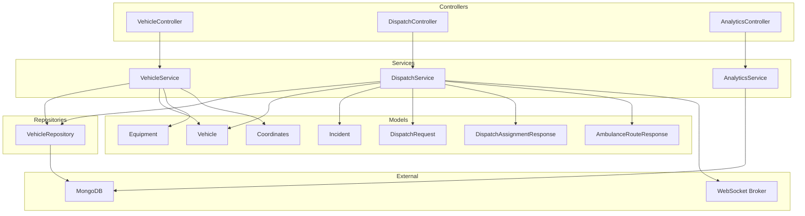
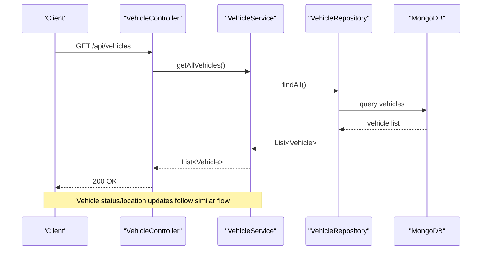
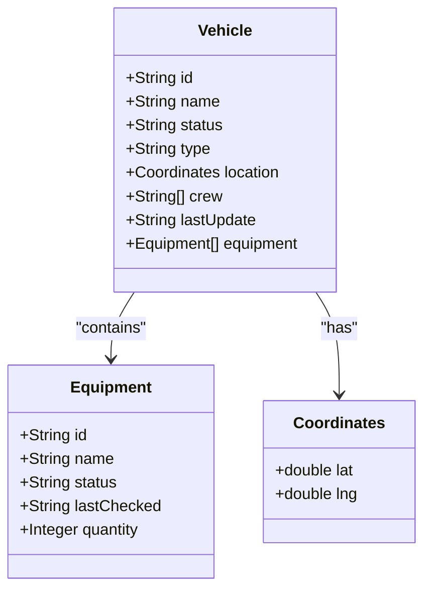
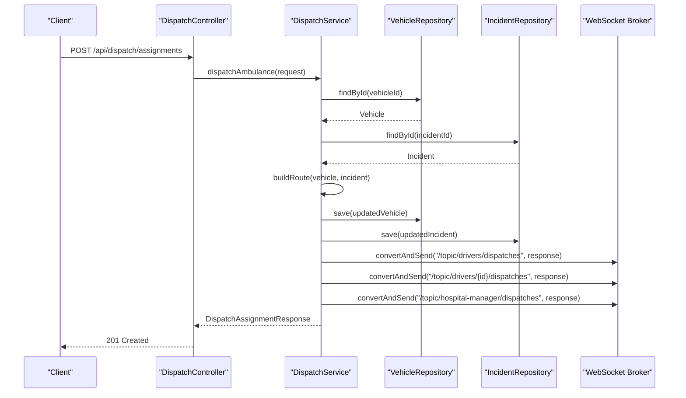
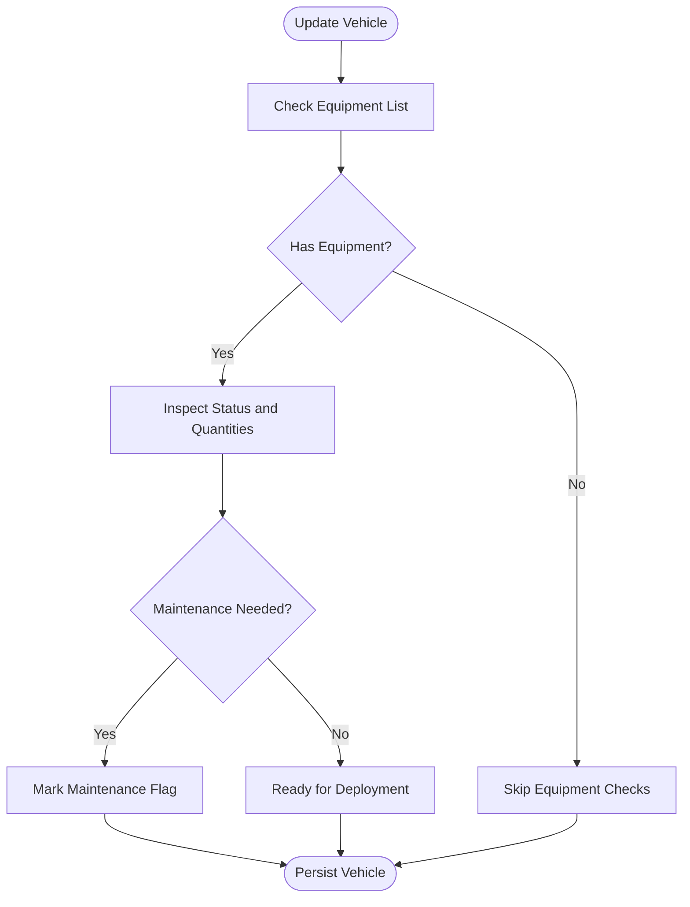
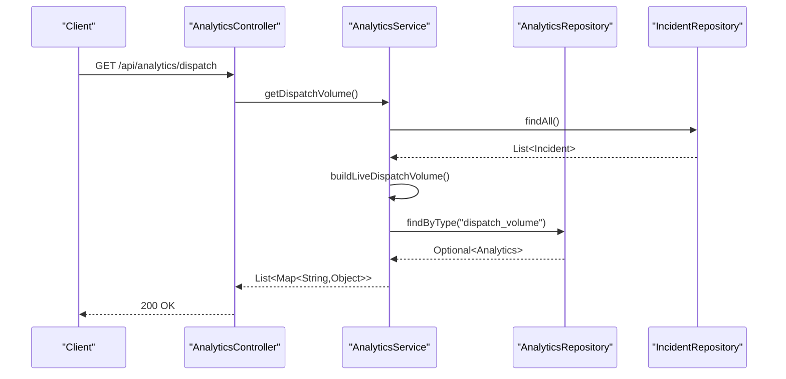
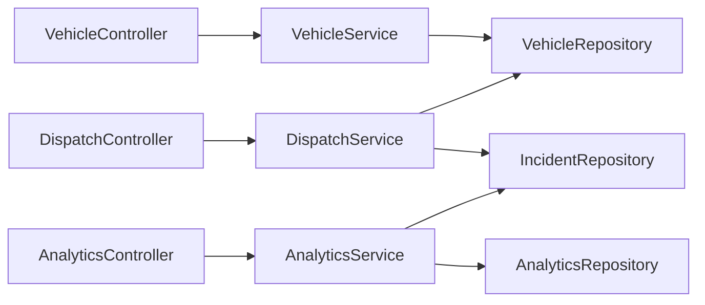

# Vehicle Management

<cite>
**Referenced Files in This Document**
- [Vehicle.java](file://src/main/java/com/example/ems_command_center/model/Vehicle.java)
- [Equipment.java](file://src/main/java/com/example/ems_command_center/model/Equipment.java)
- [Coordinates.java](file://src/main/java/com/example/ems_command_center/model/Coordinates.java)
- [Incident.java](file://src/main/java/com/example/ems_command_center/model/Incident.java)
- [AmbulanceRouteResponse.java](file://src/main/java/com/example/ems_command_center/model/AmbulanceRouteResponse.java)
- [DispatchRequest.java](file://src/main/java/com/example/ems_command_center/model/DispatchRequest.java)
- [DispatchAssignmentResponse.java](file://src/main/java/com/example/ems_command_center/model/DispatchAssignmentResponse.java)
- [VehicleController.java](file://src/main/java/com/example/ems_command_center/controller/VehicleController.java)
- [DispatchController.java](file://src/main/java/com/example/ems_command_center/controller/DispatchController.java)
- [AnalyticsController.java](file://src/main/java/com/example/ems_command_center/controller/AnalyticsController.java)
- [VehicleService.java](file://src/main/java/com/example/ems_command_center/service/VehicleService.java)
- [DispatchService.java](file://src/main/java/com/example/ems_command_center/service/DispatchService.java)
- [AnalyticsService.java](file://src/main/java/com/example/ems_command_center/service/AnalyticsService.java)
- [VehicleRepository.java](file://src/main/java/com/example/ems_command_center/repository/VehicleRepository.java)
- [application.yml](file://src/main/resources/application.yml)
</cite>

## Table of Contents
1. [Introduction](#introduction)
2. [Project Structure](#project-structure)
3. [Core Components](#core-components)
4. [Architecture Overview](#architecture-overview)
5. [Detailed Component Analysis](#detailed-component-analysis)
6. [Dependency Analysis](#dependency-analysis)
7. [Performance Considerations](#performance-considerations)
8. [Troubleshooting Guide](#troubleshooting-guide)
9. [Conclusion](#conclusion)

## Introduction
This document describes the vehicle fleet management capabilities implemented in the system, focusing on:
- Vehicle tracking and status management
- Dispatch and routing for ambulances
- Real-time location updates and coordinate handling
- Equipment monitoring via vehicle equipment lists
- Analytics for dispatch volume and response times
- Access control and role-based permissions

The system integrates MongoDB for persistence, Spring Security with OAuth2/JWT for authentication, and Spring WebSocket for real-time notifications.

## Project Structure
The vehicle fleet management spans models, controllers, services, repositories, and configuration:
- Models define domain entities such as Vehicle, Equipment, Coordinates, Incident, and dispatch-related responses
- Controllers expose REST endpoints for vehicle management, dispatch operations, and analytics
- Services encapsulate business logic for validation, dispatching, routing, and analytics
- Repositories provide MongoDB access for vehicles and analytics data
- Configuration defines database connectivity and security settings

**Diagram sources**
- [VehicleController.java:14-56](file://src/main/java/com/example/ems_command_center/controller/VehicleController.java#L14-L56)
- [DispatchController.java:22-56](file://src/main/java/com/example/ems_command_center/controller/DispatchController.java#L22-L56)
- [AnalyticsController.java:13-37](file://src/main/java/com/example/ems_command_center/controller/AnalyticsController.java#L13-L37)
- [VehicleService.java:15-111](file://src/main/java/com/example/ems_command_center/service/VehicleService.java#L15-L111)
- [DispatchService.java:21-213](file://src/main/java/com/example/ems_command_center/service/DispatchService.java#L21-L213)
- [AnalyticsService.java:19-158](file://src/main/java/com/example/ems_command_center/service/AnalyticsService.java#L19-L158)
- [VehicleRepository.java:9-14](file://src/main/java/com/example/ems_command_center/repository/VehicleRepository.java#L9-L14)
- [Vehicle.java:7-18](file://src/main/java/com/example/ems_command_center/model/Vehicle.java#L7-L18)
- [Equipment.java:3-10](file://src/main/java/com/example/ems_command_center/model/Equipment.java#L3-L10)
- [Coordinates.java:3-4](file://src/main/java/com/example/ems_command_center/model/Coordinates.java#L3-L4)
- [Incident.java:8-23](file://src/main/java/com/example/ems_command_center/model/Incident.java#L8-L23)
- [DispatchRequest.java:3-9](file://src/main/java/com/example/ems_command_center/model/DispatchRequest.java#L3-L9)
- [DispatchAssignmentResponse.java:5-18](file://src/main/java/com/example/ems_command_center/model/DispatchAssignmentResponse.java#L5-L18)
- [AmbulanceRouteResponse.java:5-18](file://src/main/java/com/example/ems_command_center/model/AmbulanceRouteResponse.java#L5-L18)

**Section sources**
- [application.yml:5-17](file://src/main/resources/application.yml#L5-L17)

## Core Components
- Vehicle model: Represents fleet assets with identification, type, status, location, crew, update timestamp, and equipment list
- Equipment model: Tracks equipment items per vehicle with identifiers, names, status, check date, and quantity
- Coordinates model: Encapsulates latitude and longitude for location data
- Dispatch models: Define request payload, assignment response, and ambulance route response with turn-by-turn steps
- Controllers: Expose endpoints for vehicle CRUD, dispatch operations, and analytics queries
- Services: Implement validation, dispatch logic, route computation, and analytics aggregation
- Repository: Provides MongoDB access for vehicle queries and counts

**Section sources**
- [Vehicle.java:7-18](file://src/main/java/com/example/ems_command_center/model/Vehicle.java#L7-L18)
- [Equipment.java:3-10](file://src/main/java/com/example/ems_command_center/model/Equipment.java#L3-L10)
- [Coordinates.java:3-4](file://src/main/java/com/example/ems_command_center/model/Coordinates.java#L3-L4)
- [AmbulanceRouteResponse.java:5-18](file://src/main/java/com/example/ems_command_center/model/AmbulanceRouteResponse.java#L5-L18)
- [DispatchRequest.java:3-9](file://src/main/java/com/example/ems_command_center/model/DispatchRequest.java#L3-L9)
- [DispatchAssignmentResponse.java:5-18](file://src/main/java/com/example/ems_command_center/model/DispatchAssignmentResponse.java#L5-L18)
- [VehicleController.java:14-56](file://src/main/java/com/example/ems_command_center/controller/VehicleController.java#L14-L56)
- [DispatchController.java:22-56](file://src/main/java/com/example/ems_command_center/controller/DispatchController.java#L22-L56)
- [AnalyticsController.java:13-37](file://src/main/java/com/example/ems_command_center/controller/AnalyticsController.java#L13-L37)
- [VehicleService.java:15-111](file://src/main/java/com/example/ems_command_center/service/VehicleService.java#L15-L111)
- [DispatchService.java:21-213](file://src/main/java/com/example/ems_command_center/service/DispatchService.java#L21-L213)
- [AnalyticsService.java:19-158](file://src/main/java/com/example/ems_command_center/service/AnalyticsService.java#L19-L158)
- [VehicleRepository.java:9-14](file://src/main/java/com/example/ems_command_center/repository/VehicleRepository.java#L9-L14)

## Architecture Overview
The system follows a layered architecture:
- Presentation: REST controllers handle HTTP requests and return standardized responses
- Application: Services orchestrate business logic, enforce validations, and manage state transitions
- Persistence: MongoDB stores vehicles and analytics data; repositories abstract data access
- Messaging: WebSocket broker publishes dispatch notifications to drivers and managers

**Diagram sources**
- [VehicleController.java:25-30](file://src/main/java/com/example/ems_command_center/controller/VehicleController.java#L25-L30)
- [VehicleService.java:28-30](file://src/main/java/com/example/ems_command_center/service/VehicleService.java#L28-L30)
- [VehicleRepository.java:10-14](file://src/main/java/com/example/ems_command_center/repository/VehicleRepository.java#L10-L14)

**Section sources**
- [application.yml:5-17](file://src/main/resources/application.yml#L5-L17)

## Detailed Component Analysis

### Vehicle Tracking and Status Management
- Data model: Vehicles include identification, type, status, location, crew, last update timestamp, and equipment list
- Validation: Enforces required fields, allowed statuses and types, presence of location, and mandatory crew for busy ambulances
- Normalization: Normalizes status and type to lowercase, trims names, and sets lastUpdate if missing
- Counting: Supports counting vehicles by status for operational dashboards

**Diagram sources**
- [Vehicle.java:7-18](file://src/main/java/com/example/ems_command_center/model/Vehicle.java#L7-L18)
- [Equipment.java:3-10](file://src/main/java/com/example/ems_command_center/model/Equipment.java#L3-L10)
- [Coordinates.java:3-4](file://src/main/java/com/example/ems_command_center/model/Coordinates.java#L3-L4)

**Section sources**
- [Vehicle.java:7-18](file://src/main/java/com/example/ems_command_center/model/Vehicle.java#L7-L18)
- [VehicleService.java:70-87](file://src/main/java/com/example/ems_command_center/service/VehicleService.java#L70-L87)
- [VehicleService.java:89-106](file://src/main/java/com/example/ems_command_center/service/VehicleService.java#L89-L106)
- [VehicleRepository.java:11-13](file://src/main/java/com/example/ems_command_center/repository/VehicleRepository.java#L11-L13)

### Dispatch and Routing
- Available ambulances: Filters vehicles by type and status to identify units ready for deployment
- Route preview: Computes distance using the haversine formula, estimates travel time based on incident type, and generates a simplified path with turn-by-turn steps
- Dispatch assignment: Updates vehicle status to busy, enriches incident tags and status, persists changes, and publishes notifications to relevant channels

**Diagram sources**
- [DispatchController.java:50-55](file://src/main/java/com/example/ems_command_center/controller/DispatchController.java#L50-L55)
- [DispatchService.java:53-119](file://src/main/java/com/example/ems_command_center/service/DispatchService.java#L53-L119)
- [DispatchService.java:137-171](file://src/main/java/com/example/ems_command_center/service/DispatchService.java#L137-L171)
- [DispatchService.java:205-212](file://src/main/java/com/example/ems_command_center/service/DispatchService.java#L205-L212)

**Section sources**
- [DispatchController.java:33-55](file://src/main/java/com/example/ems_command_center/controller/DispatchController.java#L33-L55)
- [DispatchService.java:40-44](file://src/main/java/com/example/ems_command_center/service/DispatchService.java#L40-L44)
- [DispatchService.java:46-51](file://src/main/java/com/example/ems_command_center/service/DispatchService.java#L46-L51)
- [DispatchService.java:137-171](file://src/main/java/com/example/ems_command_center/service/DispatchService.java#L137-L171)
- [DispatchService.java:205-212](file://src/main/java/com/example/ems_command_center/service/DispatchService.java#L205-L212)

### Equipment Monitoring
- Equipment tracking: Vehicles carry a list of equipment items with identifiers, names, functional status, last checked date, and quantities
- Maintenance signals: Equipment status can indicate needs for maintenance or out-of-service conditions
- Inventory visibility: Crew and dispatchers can assess readiness based on equipment lists

**Diagram sources**
- [Vehicle.java:16-16](file://src/main/java/com/example/ems_command_center/model/Vehicle.java#L16-L16)
- [Equipment.java:6-6](file://src/main/java/com/example/ems_command_center/model/Equipment.java#L6-L6)

**Section sources**
- [Equipment.java:3-10](file://src/main/java/com/example/ems_command_center/model/Equipment.java#L3-L10)
- [Vehicle.java:16-16](file://src/main/java/com/example/ems_command_center/model/Vehicle.java#L16-L16)

### Analytics and Reporting
- Dispatch volume: Aggregates dispatched incidents by hour over the past 12 hours, returning time-series data for charts
- Response time: Retrieves stored analytics data for response time metrics
- Data normalization: Converts raw analytics entries into consistent time-series structures

**Diagram sources**
- [AnalyticsController.java:24-29](file://src/main/java/com/example/ems_command_center/controller/AnalyticsController.java#L24-L29)
- [AnalyticsService.java:37-53](file://src/main/java/com/example/ems_command_center/service/AnalyticsService.java#L37-L53)
- [AnalyticsService.java:59-100](file://src/main/java/com/example/ems_command_center/service/AnalyticsService.java#L59-L100)
- [AnalyticsService.java:128-141](file://src/main/java/com/example/ems_command_center/service/AnalyticsService.java#L128-L141)

**Section sources**
- [AnalyticsController.java:24-36](file://src/main/java/com/example/ems_command_center/controller/AnalyticsController.java#L24-L36)
- [AnalyticsService.java:37-53](file://src/main/java/com/example/ems_command_center/service/AnalyticsService.java#L37-L53)
- [AnalyticsService.java:59-100](file://src/main/java/com/example/ems_command_center/service/AnalyticsService.java#L59-L100)
- [AnalyticsService.java:128-141](file://src/main/java/com/example/ems_command_center/service/AnalyticsService.java#L128-L141)

### Access Control and Permissions
- Vehicle endpoints: Require roles ADMIN, MANAGER, or DRIVER; DRIVER access is restricted to their assigned ambulance
- Dispatch endpoints: Require ADMIN or MANAGER; DRIVER access is restricted to assigned ambulance
- Notifications: Published to topics scoped by role and vehicle to ensure appropriate recipients

**Section sources**
- [VehicleController.java:27-45](file://src/main/java/com/example/ems_command_center/controller/VehicleController.java#L27-L45)
- [DispatchController.java:35-55](file://src/main/java/com/example/ems_command_center/controller/DispatchController.java#L35-L55)
- [DispatchService.java:205-212](file://src/main/java/com/example/ems_command_center/service/DispatchService.java#L205-L212)

## Dependency Analysis
- VehicleService depends on VehicleRepository for persistence and applies validation and normalization
- DispatchService depends on VehicleRepository, IncidentRepository, and WebSocket messaging for dispatch operations and notifications
- AnalyticsService depends on IncidentRepository and AnalyticsRepository for data retrieval and aggregation
- Controllers depend on services for business operations and return standardized responses

**Diagram sources**
- [VehicleController.java:19-23](file://src/main/java/com/example/ems_command_center/controller/VehicleController.java#L19-L23)
- [DispatchController.java:27-31](file://src/main/java/com/example/ems_command_center/controller/DispatchController.java#L27-L31)
- [AnalyticsController.java:18-22](file://src/main/java/com/example/ems_command_center/controller/AnalyticsController.java#L18-L22)
- [VehicleService.java:22-26](file://src/main/java/com/example/ems_command_center/service/VehicleService.java#L22-L26)
- [DispatchService.java:26-38](file://src/main/java/com/example/ems_command_center/service/DispatchService.java#L26-L38)
- [AnalyticsService.java:25-31](file://src/main/java/com/example/ems_command_center/service/AnalyticsService.java#L25-L31)

**Section sources**
- [VehicleService.java:22-26](file://src/main/java/com/example/ems_command_center/service/VehicleService.java#L22-L26)
- [DispatchService.java:26-38](file://src/main/java/com/example/ems_command_center/service/DispatchService.java#L26-L38)
- [AnalyticsService.java:25-31](file://src/main/java/com/example/ems_command_center/service/AnalyticsService.java#L25-L31)

## Performance Considerations
- Coordinate computations: Haversine distance and interpolation are lightweight but should be cached or precomputed for frequent route previews
- Dispatch notifications: Broadcasting to multiple topics adds latency; consider batching or rate limiting if traffic increases
- Analytics aggregation: Live aggregation scans incidents; consider indexing and materialized views for large datasets
- Database queries: Use repository-provided methods to minimize overhead; avoid N+1 queries by fetching related entities in bulk

## Troubleshooting Guide
- Vehicle validation errors: Ensure name, type, status, and location are provided; busy ambulances require a non-empty crew
- Dispatch failures: Verify vehicle type is ambulance, vehicle and incident have coordinates, and incident exists
- Missing analytics data: Confirm analytics documents exist under the expected type or incident timestamps are formatted correctly
- WebSocket delivery: Confirm broker is reachable and clients subscribe to the correct topics

**Section sources**
- [VehicleService.java:70-87](file://src/main/java/com/example/ems_command_center/service/VehicleService.java#L70-L87)
- [DispatchService.java:131-135](file://src/main/java/com/example/ems_command_center/service/DispatchService.java#L131-L135)
- [DispatchService.java:140-142](file://src/main/java/com/example/ems_command_center/service/DispatchService.java#L140-L142)
- [AnalyticsService.java:116-126](file://src/main/java/com/example/ems_command_center/service/AnalyticsService.java#L116-L126)

## Conclusion
The system provides a solid foundation for vehicle fleet management with:
- Clear vehicle models and validation for safe operations
- Dispatch workflows with route estimation and real-time notifications
- Equipment tracking integrated into vehicle records
- Analytics for dispatch trends and response times
- Role-based access control and secure configuration

Future enhancements could include:
- Geofencing boundaries and alerts
- Automated reordering triggers for equipment
- Preventive maintenance scheduling and compliance tracking
- Capacity management and resource optimization algorithms
- Downtime logging and maintenance workflows