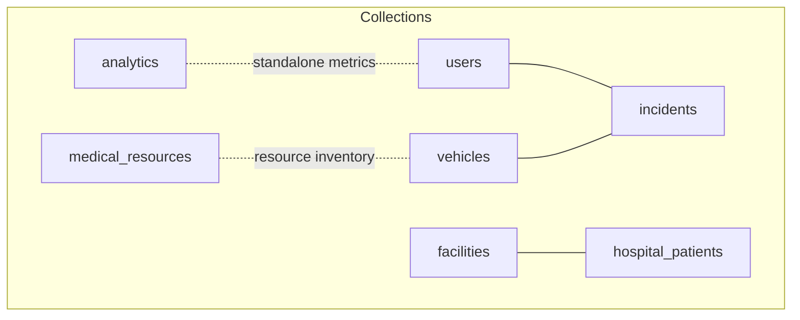
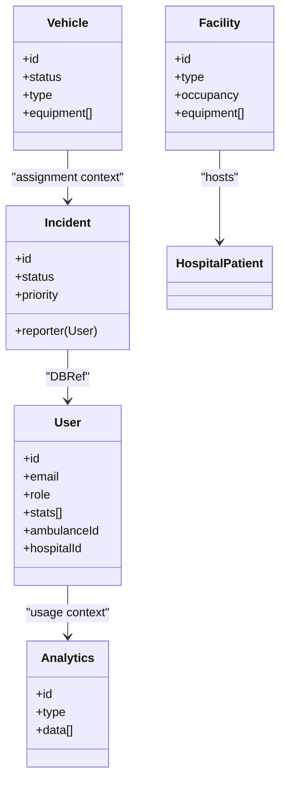
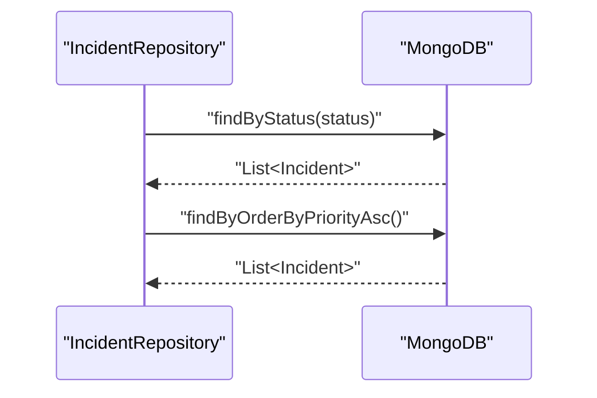
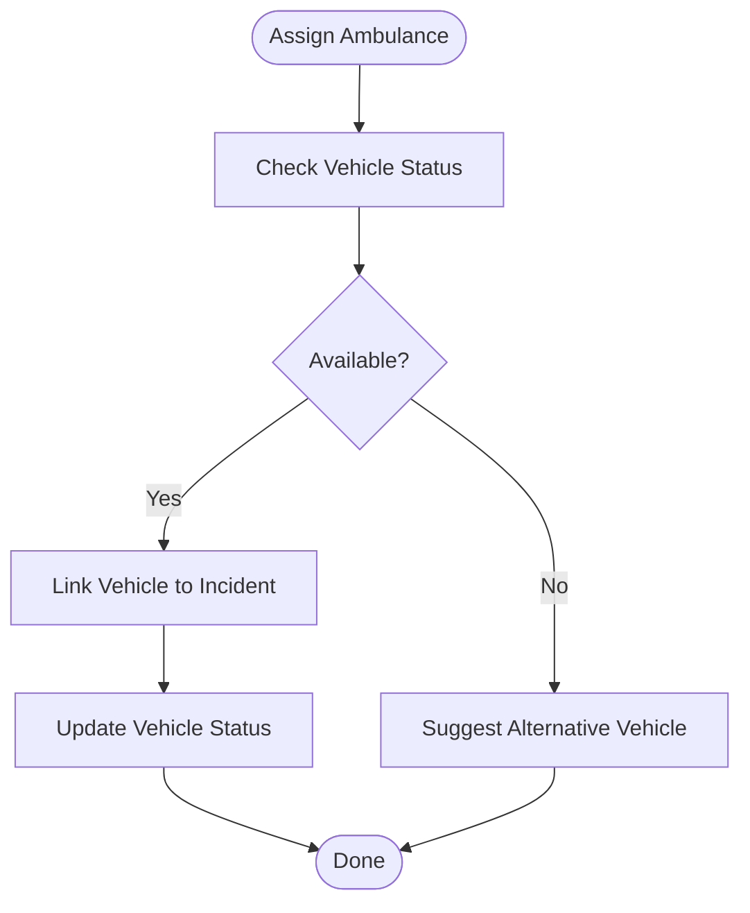
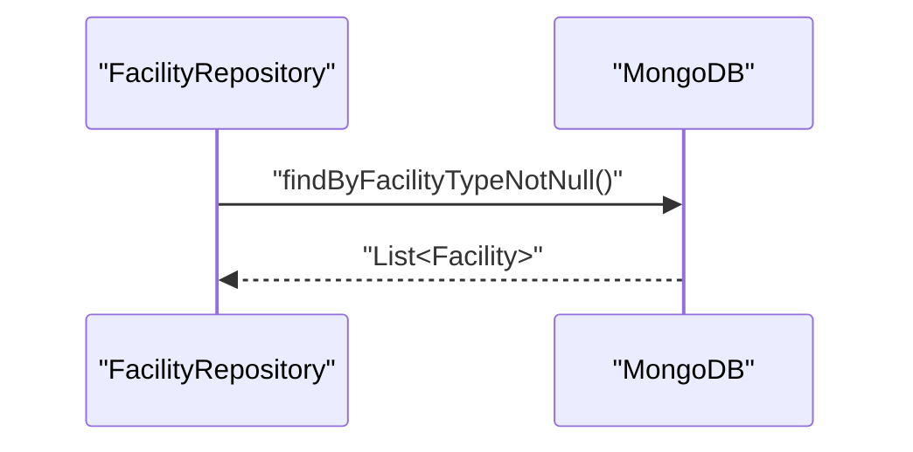
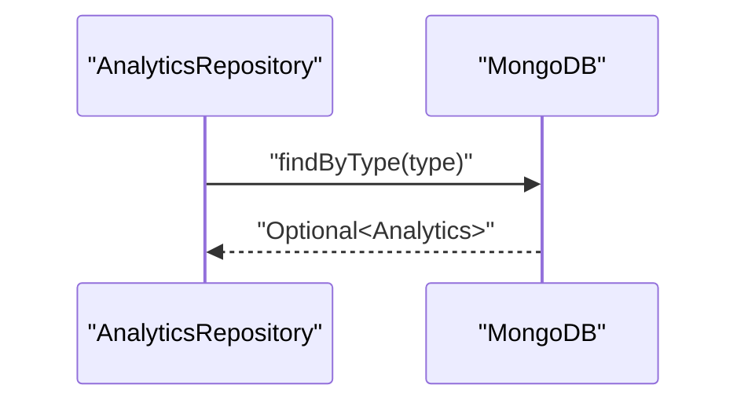
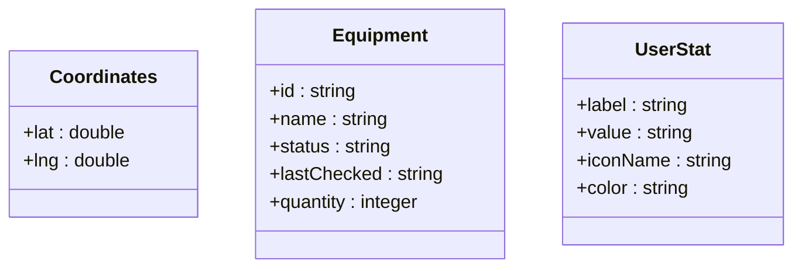
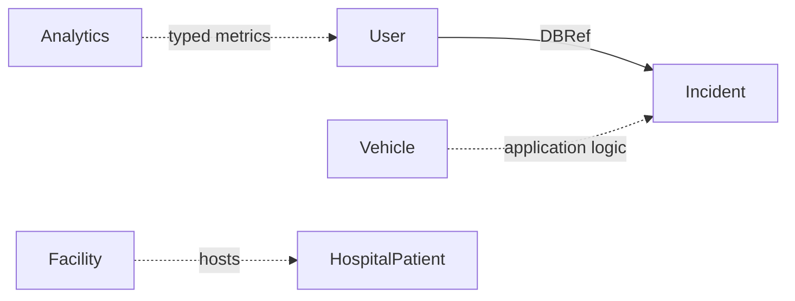

# Collection Relationships

<cite>
**Referenced Files in This Document**
- [User.java](file://src/main/java/com/example/ems_command_center/model/User.java)
- [Incident.java](file://src/main/java/com/example/ems_command_center/model/Incident.java)
- [Vehicle.java](file://src/main/java/com/example/ems_command_center/model/Vehicle.java)
- [Facility.java](file://src/main/java/com/example/ems_command_center/model/Facility.java)
- [Analytics.java](file://src/main/java/com/example/ems_command_center/model/Analytics.java)
- [UserStat.java](file://src/main/java/com/example/ems_command_center/model/UserStat.java)
- [Coordinates.java](file://src/main/java/com/example/ems_command_center/model/Coordinates.java)
- [Equipment.java](file://src/main/java/com/example/ems_command_center/model/Equipment.java)
- [MedicalResource.java](file://src/main/java/com/example/ems_command_center/model/MedicalResource.java)
- [HospitalPatient.java](file://src/main/java/com/example/ems_command_center/model/HospitalPatient.java)
- [IncidentRepository.java](file://src/main/java/com/example/ems_command_center/repository/IncidentRepository.java)
- [UserRepository.java](file://src/main/java/com/example/ems_command_center/repository/UserRepository.java)
- [VehicleRepository.java](file://src/main/java/com/example/ems_command_center/repository/VehicleRepository.java)
- [FacilityRepository.java](file://src/main/java/com/example/ems_command_center/repository/FacilityRepository.java)
- [AnalyticsRepository.java](file://src/main/java/com/example/ems_command_center/repository/AnalyticsRepository.java)
</cite>

## Table of Contents
1. [Introduction](#introduction)
2. [Project Structure](#project-structure)
3. [Core Components](#core-components)
4. [Architecture Overview](#architecture-overview)
5. [Detailed Component Analysis](#detailed-component-analysis)
6. [Dependency Analysis](#dependency-analysis)
7. [Performance Considerations](#performance-considerations)
8. [Troubleshooting Guide](#troubleshooting-guide)
9. [Conclusion](#conclusion)

## Introduction
This document explains MongoDB collection relationships and data modeling strategies in the EMS Command Center. It focuses on how documents are structured, whether entities are embedded or referenced, and how relationships are enforced and queried. It covers:
- Users and Incidents (dispatch assignments)
- Vehicles and Incidents (ambulance assignments)
- Facilities and Patients (hospital coordination)
- Analytics and supporting entities
It also documents foreign keys, one-to-many and many-to-many relationships, denormalization strategies, referential integrity considerations, and data consistency patterns.

## Project Structure
The application models core EMS entities as separate collections with selective embedding and referencing. Collections include users, incidents, vehicles, facilities, analytics, medical resources, and hospital patients. Queries leverage Spring Data MongoDB repositories with method-derived queries and aggregation pipelines where needed.

**Diagram sources**
- [User.java:1-188](file://src/main/java/com/example/ems_command_center/model/User.java#L1-L188)
- [Incident.java:1-24](file://src/main/java/com/example/ems_command_center/model/Incident.java#L1-L24)
- [Vehicle.java:1-19](file://src/main/java/com/example/ems_command_center/model/Vehicle.java#L1-L19)
- [Facility.java:1-27](file://src/main/java/com/example/ems_command_center/model/Facility.java#L1-L27)
- [Analytics.java:1-16](file://src/main/java/com/example/ems_command_center/model/Analytics.java#L1-L16)
- [MedicalResource.java:1-18](file://src/main/java/com/example/ems_command_center/model/MedicalResource.java#L1-L18)
- [HospitalPatient.java:1-28](file://src/main/java/com/example/ems_command_center/model/HospitalPatient.java#L1-L28)

**Section sources**
- [User.java:1-188](file://src/main/java/com/example/ems_command_center/model/User.java#L1-L188)
- [Incident.java:1-24](file://src/main/java/com/example/ems_command_center/model/Incident.java#L1-L24)
- [Vehicle.java:1-19](file://src/main/java/com/example/ems_command_center/model/Vehicle.java#L1-L19)
- [Facility.java:1-27](file://src/main/java/com/example/ems_command_center/model/Facility.java#L1-L27)
- [Analytics.java:1-16](file://src/main/java/com/example/ems_command_center/model/Analytics.java#L1-L16)
- [MedicalResource.java:1-18](file://src/main/java/com/example/ems_command_center/model/MedicalResource.java#L1-L18)
- [HospitalPatient.java:1-28](file://src/main/java/com/example/ems_command_center/model/HospitalPatient.java#L1-L28)

## Core Components
- Users: Standalone collection with embedded statistics and optional foreign keys to vehicles and facilities for driver/manager roles.
- Incidents: Standalone collection with a DBRef to the reporting User.
- Vehicles: Standalone collection with embedded equipment and crew identifiers.
- Facilities: Standalone collection with embedded equipment and hospital-specific fields.
- Analytics: Standalone collection storing typed metric datasets.
- Medical Resources: Standalone collection for resource inventory.
- Hospital Patients: Standalone collection for patient records linked to emergencies.

**Section sources**
- [User.java:1-188](file://src/main/java/com/example/ems_command_center/model/User.java#L1-L188)
- [Incident.java:1-24](file://src/main/java/com/example/ems_command_center/model/Incident.java#L1-L24)
- [Vehicle.java:1-19](file://src/main/java/com/example/ems_command_center/model/Vehicle.java#L1-L19)
- [Facility.java:1-27](file://src/main/java/com/example/ems_command_center/model/Facility.java#L1-L27)
- [Analytics.java:1-16](file://src/main/java/com/example/ems_command_center/model/Analytics.java#L1-L16)
- [MedicalResource.java:1-18](file://src/main/java/com/example/ems_command_center/model/MedicalResource.java#L1-L18)
- [HospitalPatient.java:1-28](file://src/main/java/com/example/ems_command_center/model/HospitalPatient.java#L1-L28)

## Architecture Overview
The system uses a hybrid approach:
- Embedded: User statistics, coordinates, equipment lists, and incident metadata are embedded to optimize read performance and reduce join overhead.
- Referenced: Incidents reference Users via DBRef, enabling flexible association without duplicating user profiles.

**Diagram sources**
- [User.java:1-188](file://src/main/java/com/example/ems_command_center/model/User.java#L1-L188)
- [Incident.java:1-24](file://src/main/java/com/example/ems_command_center/model/Incident.java#L1-L24)
- [Vehicle.java:1-19](file://src/main/java/com/example/ems_command_center/model/Vehicle.java#L1-L19)
- [Facility.java:1-27](file://src/main/java/com/example/ems_command_center/model/Facility.java#L1-L27)
- [Analytics.java:1-16](file://src/main/java/com/example/ems_command_center/model/Analytics.java#L1-L16)

## Detailed Component Analysis

### Users and Incidents (Dispatch Assignments)
- Relationship: One-to-many (one User reports many Incidents). Dispatch assignments are not modeled as explicit embedded arrays in the Incident entity; assignment is implicit via the reporter field.
- Embedding: User statistics are embedded to support dashboards and quick access without joins.
- Foreign keys: Users optionally maintain ambulanceId and hospitalId for role-specific linkage.
- Queries:
  - Find users by role, email, ambulanceId, hospitalId, or Keycloak ID.
  - Find incidents by status or priority order.
- Denormalization: Reporter identity and basic attributes are embedded in Incident for fast retrieval.

**Diagram sources**
- [IncidentRepository.java:1-14](file://src/main/java/com/example/ems_command_center/repository/IncidentRepository.java#L1-L14)

**Section sources**
- [User.java:1-188](file://src/main/java/com/example/ems_command_center/model/User.java#L1-L188)
- [Incident.java:1-24](file://src/main/java/com/example/ems_command_center/model/Incident.java#L1-L24)
- [IncidentRepository.java:1-14](file://src/main/java/com/example/ems_command_center/repository/IncidentRepository.java#L1-L14)
- [UserRepository.java:1-15](file://src/main/java/com/example/ems_command_center/repository/UserRepository.java#L1-L15)

### Vehicles and Incidents (Ambulance Assignments)
- Relationship: Many-to-one (many Vehicles to one Incident) or many-to-many via external assignment logic. The Vehicle entity embeds equipment and crew identifiers but does not directly reference Incidents.
- Embedding: Equipment is embedded to avoid frequent joins for vehicle status and loadouts.
- Queries:
  - Filter vehicles by status or type.
  - Count vehicles by status for capacity planning.

**Diagram sources**
- [Vehicle.java:1-19](file://src/main/java/com/example/ems_command_center/model/Vehicle.java#L1-L19)
- [VehicleRepository.java:1-15](file://src/main/java/com/example/ems_command_center/repository/VehicleRepository.java#L1-L15)

**Section sources**
- [Vehicle.java:1-19](file://src/main/java/com/example/ems_command_center/model/Vehicle.java#L1-L19)
- [VehicleRepository.java:1-15](file://src/main/java/com/example/ems_command_center/repository/VehicleRepository.java#L1-L15)

### Facilities and Patients (Hospital Coordination)
- Relationship: One-to-many (one Facility hosts many HospitalPatients).
- Embedding: Facilities embed equipment and geographic coordinates for proximity and availability checks.
- Queries:
  - Retrieve facilities with facilityType set for hospitals.
  - Manage patient records with triage, status, and care steps.

**Diagram sources**
- [FacilityRepository.java:1-13](file://src/main/java/com/example/ems_command_center/repository/FacilityRepository.java#L1-L13)

**Section sources**
- [Facility.java:1-27](file://src/main/java/com/example/ems_command_center/model/Facility.java#L1-L27)
- [HospitalPatient.java:1-28](file://src/main/java/com/example/ems_command_center/model/HospitalPatient.java#L1-L28)
- [FacilityRepository.java:1-13](file://src/main/java/com/example/ems_command_center/repository/FacilityRepository.java#L1-L13)

### Analytics and Supporting Entities
- Relationship: Analytics is a standalone collection keyed by type. It stores typed datasets for dashboards and reporting.
- Embedding: Analytics data is embedded as a list of maps to support flexible metric schemas.
- Queries:
  - Retrieve analytics by type for dashboard rendering.

**Diagram sources**
- [AnalyticsRepository.java:1-13](file://src/main/java/com/example/ems_command_center/repository/AnalyticsRepository.java#L1-L13)

**Section sources**
- [Analytics.java:1-16](file://src/main/java/com/example/ems_command_center/model/Analytics.java#L1-L16)
- [AnalyticsRepository.java:1-13](file://src/main/java/com/example/ems_command_center/repository/AnalyticsRepository.java#L1-L13)

### Supporting Data Structures
- Coordinates: Lightweight record for lat/lng used across User location, Vehicle location, and Facility coordinates.
- Equipment: Lightweight record embedded in Vehicles and Facilities for status and inventory tracking.
- UserStat: Lightweight record embedded in Users for dashboard metrics.

**Diagram sources**
- [Coordinates.java:1-5](file://src/main/java/com/example/ems_command_center/model/Coordinates.java#L1-L5)
- [Equipment.java:1-11](file://src/main/java/com/example/ems_command_center/model/Equipment.java#L1-L11)
- [UserStat.java:1-10](file://src/main/java/com/example/ems_command_center/model/UserStat.java#L1-L10)

**Section sources**
- [Coordinates.java:1-5](file://src/main/java/com/example/ems_command_center/model/Coordinates.java#L1-L5)
- [Equipment.java:1-11](file://src/main/java/com/example/ems_command_center/model/Equipment.java#L1-L11)
- [UserStat.java:1-10](file://src/main/java/com/example/ems_command_center/model/UserStat.java#L1-L10)

## Dependency Analysis
- Loose coupling: Relationships are primarily achieved via DBRefs and repository queries rather than tight embedded references, preserving update locality and avoiding document explosion.
- Cohesion: Embedded entities (coordinates, equipment, user stats) keep related operational data close to their owners, reducing cross-collection reads.
- External assignment logic: Ambulance-to-Incident and dispatch-to-user assignments are not embedded in the Incident entity; they rely on application-level logic and repository queries.

**Diagram sources**
- [User.java:1-188](file://src/main/java/com/example/ems_command_center/model/User.java#L1-L188)
- [Incident.java:1-24](file://src/main/java/com/example/ems_command_center/model/Incident.java#L1-L24)
- [Vehicle.java:1-19](file://src/main/java/com/example/ems_command_center/model/Vehicle.java#L1-L19)
- [Facility.java:1-27](file://src/main/java/com/example/ems_command_center/model/Facility.java#L1-L27)
- [HospitalPatient.java:1-28](file://src/main/java/com/example/ems_command_center/model/HospitalPatient.java#L1-L28)
- [Analytics.java:1-16](file://src/main/java/com/example/ems_command_center/model/Analytics.java#L1-L16)

**Section sources**
- [User.java:1-188](file://src/main/java/com/example/ems_command_center/model/User.java#L1-L188)
- [Incident.java:1-24](file://src/main/java/com/example/ems_command_center/model/Incident.java#L1-L24)
- [Vehicle.java:1-19](file://src/main/java/com/example/ems_command_center/model/Vehicle.java#L1-L19)
- [Facility.java:1-27](file://src/main/java/com/example/ems_command_center/model/Facility.java#L1-L27)
- [HospitalPatient.java:1-28](file://src/main/java/com/example/ems_command_center/model/HospitalPatient.java#L1-L28)
- [Analytics.java:1-16](file://src/main/java/com/example/ems_command_center/model/Analytics.java#L1-L16)

## Performance Considerations
- Embedded reads: Embedding frequently accessed operational data (coordinates, equipment, user stats) reduces round-trips and improves response times for dashboards and real-time views.
- Indexes: Unique indexes on email and Keycloak ID in Users, and indexes derived from repository methods enable efficient lookups.
- Aggregation pipelines: Complex joins (e.g., dispatch assignments, capacity planning) can be implemented using aggregation stages to combine collections efficiently.
- Denormalization: Reporter identity embedded in Incident avoids joins for incident listing and prioritization views.

## Troubleshooting Guide
- Referential integrity: DBRefs in Incidents rely on application-level checks. If a User is deleted, Incident.reporter may become stale; implement cleanup hooks or soft-deletion patterns.
- Cascading operations: MongoDB does not enforce cascading deletes. Implement application-level cascades or use background jobs to reconcile orphaned documents.
- Consistency patterns: Use transactions for write-heavy sequences (e.g., assigning a vehicle to an incident and updating vehicle status) to maintain consistency across writes.
- Query patterns: Prefer repository method-derived queries for simple filters; use aggregation pipelines for complex joins and computed metrics.

## Conclusion
The EMS Command Center employs a pragmatic hybrid model:
- Embedding for operational data (coordinates, equipment, user stats) to optimize reads.
- Referencing for flexible associations (Incidents to Users) to preserve update locality.
This design balances performance, scalability, and maintainability while keeping complex joins out of the document model and into application logic and aggregation pipelines.