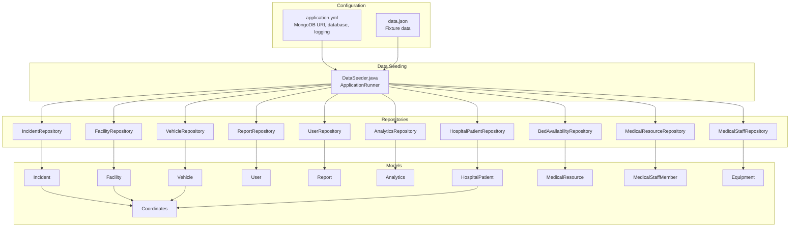
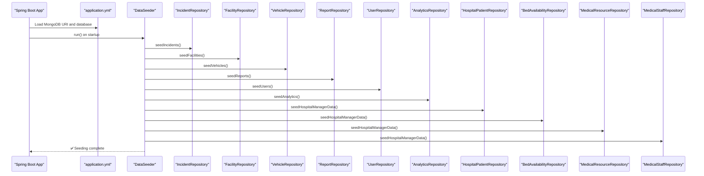
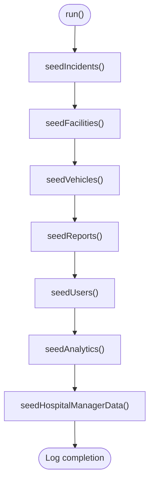
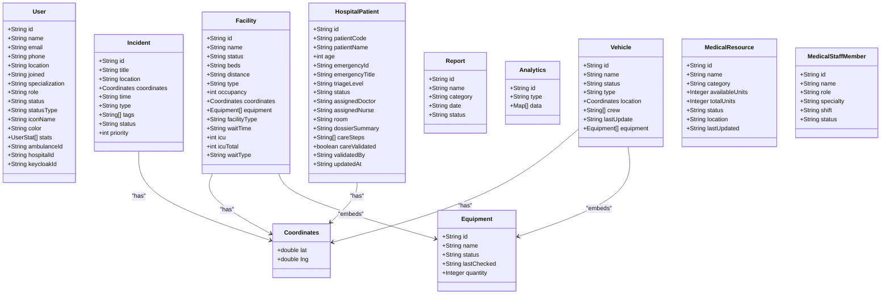
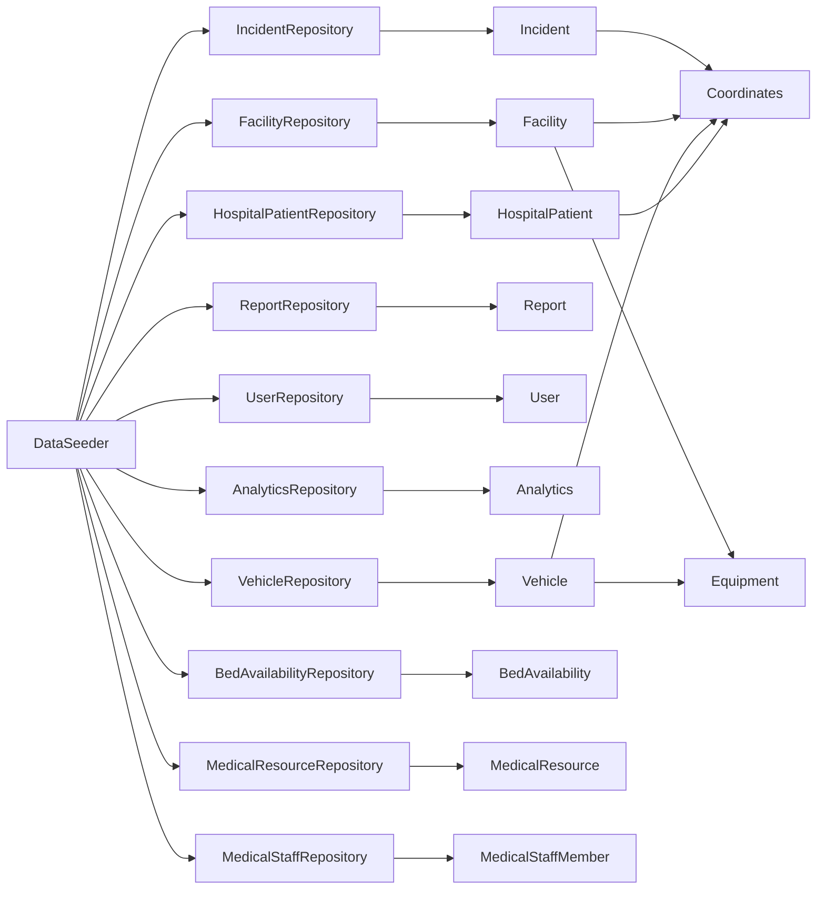

# Data Management

<cite>
**Referenced Files in This Document**
- [DataSeeder.java](file://src/main/java/com/example/ems_command_center/seeder/DataSeeder.java)
- [application.yml](file://src/main/resources/application.yml)
- [data.json](file://src/main/resources/data.json)
- [IncidentRepository.java](file://src/main/java/com/example/ems_command_center/repository/IncidentRepository.java)
- [FacilityRepository.java](file://src/main/java/com/example/ems_command_center/repository/FacilityRepository.java)
- [HospitalPatientRepository.java](file://src/main/java/com/example/ems_command_center/repository/HospitalPatientRepository.java)
- [Incident.java](file://src/main/java/com/example/ems_command_center/model/Incident.java)
- [Facility.java](file://src/main/java/com/example/ems_command_center/model/Facility.java)
- [Vehicle.java](file://src/main/java/com/example/ems_command_center/model/Vehicle.java)
- [User.java](file://src/main/java/com/example/ems_command_center/model/User.java)
- [Report.java](file://src/main/java/com/example/ems_command_center/model/Report.java)
- [Analytics.java](file://src/main/java/com/example/ems_command_center/model/Analytics.java)
- [Equipment.java](file://src/main/java/com/example/ems_command_center/model/Equipment.java)
- [Coordinates.java](file://src/main/java/com/example/ems_command_center/model/Coordinates.java)
- [HospitalPatient.java](file://src/main/java/com/example/ems_command_center/model/HospitalPatient.java)
- [MedicalResource.java](file://src/main/java/com/example/ems_command_center/model/MedicalResource.java)
- [MedicalStaffMember.java](file://src/main/java/com/example/ems_command_center/model/MedicalStaffMember.java)
- [AccessControlService.java](file://src/main/java/com/example/ems_command_center/service/AccessControlService.java)
</cite>

## Table of Contents
1. [Introduction](#introduction)
2. [Project Structure](#project-structure)
3. [Core Components](#core-components)
4. [Architecture Overview](#architecture-overview)
5. [Detailed Component Analysis](#detailed-component-analysis)
6. [Dependency Analysis](#dependency-analysis)
7. [Performance Considerations](#performance-considerations)
8. [Troubleshooting Guide](#troubleshooting-guide)
9. [Conclusion](#conclusion)
10. [Appendices](#appendices)

## Introduction
This document provides comprehensive data management guidance for the MongoDB-backed EMS Command Center. It focuses on the data seeding process via the DataSeeder component, initial dataset creation, test data population, and development environment setup. It also documents data lifecycle management, including validation rules, business rule enforcement, and transformation processes. Backup and restore procedures, archival strategies, and retention policies are outlined. Migration patterns, schema evolution, and backward compatibility considerations are covered alongside data quality measures, validation workflows, error handling, bulk operations, batch processing, and cleanup procedures. Finally, guidelines for exporting, importing, and testing data management are included.

## Project Structure
The data management layer centers around Spring Data MongoDB repositories and domain models. The DataSeeder component orchestrates initial data population across collections. Configuration for MongoDB connectivity and logging is defined in application.yml. A JSON fixture (data.json) provides structured test data that complements the Java-based seed logic.

**Diagram sources**
- [application.yml:1-36](file://src/main/resources/application.yml#L1-L36)
- [data.json:1-202](file://src/main/resources/data.json#L1-L202)
- [DataSeeder.java:1-380](file://src/main/java/com/example/ems_command_center/seeder/DataSeeder.java#L1-L380)
- [IncidentRepository.java:1-14](file://src/main/java/com/example/ems_command_center/repository/IncidentRepository.java#L1-L14)
- [FacilityRepository.java:1-13](file://src/main/java/com/example/ems_command_center/repository/FacilityRepository.java#L1-L13)
- [HospitalPatientRepository.java:1-10](file://src/main/java/com/example/ems_command_center/repository/HospitalPatientRepository.java#L1-L10)
- [Incident.java:1-24](file://src/main/java/com/example/ems_command_center/model/Incident.java#L1-L24)
- [Facility.java:1-27](file://src/main/java/com/example/ems_command_center/model/Facility.java#L1-L27)
- [Vehicle.java:1-19](file://src/main/java/com/example/ems_command_center/model/Vehicle.java#L1-L19)
- [User.java:1-188](file://src/main/java/com/example/ems_command_center/model/User.java#L1-L188)
- [Report.java:1-15](file://src/main/java/com/example/ems_command_center/model/Report.java#L1-L15)
- [Analytics.java:1-16](file://src/main/java/com/example/ems_command_center/model/Analytics.java#L1-L16)
- [Equipment.java:1-11](file://src/main/java/com/example/ems_command_center/model/Equipment.java#L1-L11)
- [Coordinates.java:1-5](file://src/main/java/com/example/ems_command_center/model/Coordinates.java#L1-L5)
- [HospitalPatient.java:1-28](file://src/main/java/com/example/ems_command_center/model/HospitalPatient.java#L1-L28)
- [MedicalResource.java:1-18](file://src/main/java/com/example/ems_command_center/model/MedicalResource.java#L1-L18)
- [MedicalStaffMember.java:1-16](file://src/main/java/com/example/ems_command_center/model/MedicalStaffMember.java#L1-L16)

**Section sources**
- [application.yml:1-36](file://src/main/resources/application.yml#L1-L36)
- [data.json:1-202](file://src/main/resources/data.json#L1-L202)
- [DataSeeder.java:1-380](file://src/main/java/com/example/ems_command_center/seeder/DataSeeder.java#L1-L380)

## Core Components
- DataSeeder: Orchestrates initial data population across incidents, facilities, vehicles, reports, users, analytics, and hospital manager datasets. It conditionally runs based on a property flag and avoids re-seeding existing data by checking counts or unique identifiers.
- Repositories: Spring Data MongoDB repositories define typed access to collections and custom queries (e.g., facility type filtering, incident status and ordering).
- Models: Domain records and classes define the shape of documents stored in MongoDB, including embedded types (Coordinates, Equipment) and indexed fields (e.g., User email, keycloakId).

Key responsibilities:
- Seed once per environment unless overridden.
- Respect uniqueness constraints (unique indexes) to prevent duplicates.
- Populate development/test environments with realistic fixtures.

**Section sources**
- [DataSeeder.java:17-67](file://src/main/java/com/example/ems_command_center/seeder/DataSeeder.java#L17-L67)
- [IncidentRepository.java:9-13](file://src/main/java/com/example/ems_command_center/repository/IncidentRepository.java#L9-L13)
- [FacilityRepository.java:9-12](file://src/main/java/com/example/ems_command_center/repository/FacilityRepository.java#L9-L12)
- [User.java:14-31](file://src/main/java/com/example/ems_command_center/model/User.java#L14-L31)

## Architecture Overview
The data management architecture integrates configuration-driven seeding with MongoDB repositories and domain models. The DataSeeder is invoked at application startup and persists data to collections defined by the models. Repositories expose CRUD and query capabilities, while models encapsulate validation and structure.

**Diagram sources**
- [application.yml:5-8](file://src/main/resources/application.yml#L5-L8)
- [DataSeeder.java:57-67](file://src/main/java/com/example/ems_command_center/seeder/DataSeeder.java#L57-L67)
- [IncidentRepository.java:1-14](file://src/main/java/com/example/ems_command_center/repository/IncidentRepository.java#L1-L14)
- [FacilityRepository.java:1-13](file://src/main/java/com/example/ems_command_center/repository/FacilityRepository.java#L1-L13)
- [HospitalPatientRepository.java:1-10](file://src/main/java/com/example/ems_command_center/repository/HospitalPatientRepository.java#L1-L10)

## Detailed Component Analysis

### DataSeeder: Initial Dataset Creation and Test Data Population
- Conditional execution: Controlled by a property flag to enable or disable seeding.
- Idempotent seeding: Each collection is only seeded if empty or missing specific unique records.
- Development environment setup: Provides realistic fixtures for incidents, facilities, vehicles, reports, users, analytics, and hospital manager datasets.
- Bulk persistence: Uses saveAll for efficient batch insertion across collections.

**Diagram sources**
- [DataSeeder.java:57-67](file://src/main/java/com/example/ems_command_center/seeder/DataSeeder.java#L57-L67)
- [DataSeeder.java:69-86](file://src/main/java/com/example/ems_command_center/seeder/DataSeeder.java#L69-L86)
- [DataSeeder.java:88-136](file://src/main/java/com/example/ems_command_center/seeder/DataSeeder.java#L88-L136)
- [DataSeeder.java:138-163](file://src/main/java/com/example/ems_command_center/seeder/DataSeeder.java#L138-L163)
- [DataSeeder.java:165-173](file://src/main/java/com/example/ems_command_center/seeder/DataSeeder.java#L165-L173)
- [DataSeeder.java:175-255](file://src/main/java/com/example/ems_command_center/seeder/DataSeeder.java#L175-L255)
- [DataSeeder.java:257-286](file://src/main/java/com/example/ems_command_center/seeder/DataSeeder.java#L257-L286)
- [DataSeeder.java:288-378](file://src/main/java/com/example/ems_command_center/seeder/DataSeeder.java#L288-L378)

**Section sources**
- [DataSeeder.java:17-67](file://src/main/java/com/example/ems_command_center/seeder/DataSeeder.java#L17-L67)
- [DataSeeder.java:69-378](file://src/main/java/com/example/ems_command_center/seeder/DataSeeder.java#L69-L378)

### Data Lifecycle Management: Validation Rules, Business Rules, and Transformations
- Validation rules:
  - Unique constraints enforced via indexes (e.g., User email, keycloakId).
  - Enum-like constraints in models (e.g., status, type fields) limit acceptable values.
- Business rule enforcement:
  - AccessControlService validates claims for hospital and ambulance assignments, ensuring data access aligns with user roles.
- Data transformations:
  - Embedded types (Coordinates, Equipment) normalize spatial and resource metadata.
  - Collections are populated with structured arrays/maps (e.g., analytics data).

**Diagram sources**
- [User.java:8-188](file://src/main/java/com/example/ems_command_center/model/User.java#L8-L188)
- [Coordinates.java:3](file://src/main/java/com/example/ems_command_center/model/Coordinates.java#L3)
- [Equipment.java:3-10](file://src/main/java/com/example/ems_command_center/model/Equipment.java#L3-L10)
- [Incident.java:8-23](file://src/main/java/com/example/ems_command_center/model/Incident.java#L8-L23)
- [Facility.java:7-26](file://src/main/java/com/example/ems_command_center/model/Facility.java#L7-L26)
- [Vehicle.java:7-18](file://src/main/java/com/example/ems_command_center/model/Vehicle.java#L7-L18)
- [Report.java:6-14](file://src/main/java/com/example/ems_command_center/model/Report.java#L6-L14)
- [Analytics.java:9-15](file://src/main/java/com/example/ems_command_center/model/Analytics.java#L9-L15)
- [HospitalPatient.java:8-27](file://src/main/java/com/example/ems_command_center/model/HospitalPatient.java#L8-L27)
- [MedicalResource.java:6-17](file://src/main/java/com/example/ems_command_center/model/MedicalResource.java#L6-L17)
- [MedicalStaffMember.java:6-15](file://src/main/java/com/example/ems_command_center/model/MedicalStaffMember.java#L6-L15)

**Section sources**
- [User.java:14-31](file://src/main/java/com/example/ems_command_center/model/User.java#L14-L31)
- [AccessControlService.java:10-36](file://src/main/java/com/example/ems_command_center/service/AccessControlService.java#L10-L36)
- [Equipment.java:3-10](file://src/main/java/com/example/ems_command_center/model/Equipment.java#L3-L10)
- [Coordinates.java:3](file://src/main/java/com/example/ems_command_center/model/Coordinates.java#L3)

### Backup and Restore Procedures
- Backup:
  - Use MongoDB native tools (mongodump) to export collections by name or database.
  - Schedule periodic backups aligned with retention policies.
- Restore:
  - Use mongorestore to import backups into target environments.
  - Validate collection counts and indexes post-restore.
- Archival and retention:
  - Archive older analytics and reports data to separate collections or external storage.
  - Define retention windows for operational logs and transient datasets.

[No sources needed since this section provides general guidance]

### Data Migration Patterns and Schema Evolution
- Non-breaking changes:
  - Add optional fields to existing documents; existing reads remain compatible.
  - Use default values for new optional fields during migrations.
- Breaking changes:
  - Introduce new collections for incompatible structures (e.g., historical analytics).
  - Maintain backward compatibility by keeping old collections until consumers migrate.
- Versioning:
  - Add a schemaVersion field to documents to guide migration scripts.
  - Run targeted migrations on startup or via scheduled jobs.

[No sources needed since this section provides general guidance]

### Data Quality Measures and Validation Workflows
- Indexing:
  - Ensure unique indexes on identity fields (e.g., User email, keycloakId).
- Pre-insertion checks:
  - Verify uniqueness before insertions; skip duplicates to maintain idempotency.
- Post-insertion verification:
  - Confirm counts and presence of seed data after seeding completes.
- Logging:
  - Log seeding progress and outcomes for auditability.

**Section sources**
- [User.java:14-31](file://src/main/java/com/example/ems_command_center/model/User.java#L14-L31)
- [DataSeeder.java:69-86](file://src/main/java/com/example/ems_command_center/seeder/DataSeeder.java#L69-L86)
- [DataSeeder.java:175-255](file://src/main/java/com/example/ems_command_center/seeder/DataSeeder.java#L175-L255)

### Error Handling for Data Operations
- Duplicate prevention:
  - Check repository counts or unique lookups before seeding.
- Graceful failures:
  - Wrap seeding steps in try-catch blocks to log errors and continue with remaining collections.
- Environment-specific toggles:
  - Disable seeding in production by default; enable selectively via configuration.

**Section sources**
- [DataSeeder.java:17-18](file://src/main/java/com/example/ems_command_center/seeder/DataSeeder.java#L17-L18)
- [DataSeeder.java:69-86](file://src/main/java/com/example/ems_command_center/seeder/DataSeeder.java#L69-L86)

### Bulk Operations, Batch Processing, and Cleanup
- Bulk operations:
  - Use saveAll for seeding multiple documents efficiently.
- Batch processing:
  - For large datasets, process in batches with pagination and transaction boundaries where appropriate.
- Cleanup:
  - Remove stale analytics entries older than retention period.
  - Archive reports with “Archived” status to reduce active collection size.

**Section sources**
- [DataSeeder.java:71-84](file://src/main/java/com/example/ems_command_center/seeder/DataSeeder.java#L71-L84)
- [DataSeeder.java:139-161](file://src/main/java/com/example/ems_command_center/seeder/DataSeeder.java#L139-L161)
- [Report.java:12](file://src/main/java/com/example/ems_command_center/model/Report.java#L12)

### Guidelines for Data Export, Import, and Testing Data Management
- Export:
  - Use mongoexport for CSV/JSON exports of collections.
  - Include filters for date ranges or statuses for targeted exports.
- Import:
  - Use mongoimport for initial loads; validate counts and indexes afterward.
- Testing:
  - Use data.json as a fixture for unit/integration tests.
  - Seed minimal datasets for isolated testing scenarios.

**Section sources**
- [data.json:1-202](file://src/main/resources/data.json#L1-L202)

## Dependency Analysis
The DataSeeder depends on multiple repositories to persist data across collections. Repositories extend Spring Data MongoDB interfaces and define custom queries. Models define document schemas and embedded types.

**Diagram sources**
- [DataSeeder.java:22-54](file://src/main/java/com/example/ems_command_center/seeder/DataSeeder.java#L22-L54)
- [IncidentRepository.java:9-13](file://src/main/java/com/example/ems_command_center/repository/IncidentRepository.java#L9-L13)
- [FacilityRepository.java:9-12](file://src/main/java/com/example/ems_command_center/repository/FacilityRepository.java#L9-L12)
- [HospitalPatientRepository.java:7-9](file://src/main/java/com/example/ems_command_center/repository/HospitalPatientRepository.java#L7-L9)
- [Incident.java:8-23](file://src/main/java/com/example/ems_command_center/model/Incident.java#L8-L23)
- [Facility.java:7-26](file://src/main/java/com/example/ems_command_center/model/Facility.java#L7-L26)
- [Vehicle.java:7-18](file://src/main/java/com/example/ems_command_center/model/Vehicle.java#L7-L18)
- [Report.java:6-14](file://src/main/java/com/example/ems_command_center/model/Report.java#L6-L14)
- [Analytics.java:9-15](file://src/main/java/com/example/ems_command_center/model/Analytics.java#L9-L15)
- [HospitalPatient.java:8-27](file://src/main/java/com/example/ems_command_center/model/HospitalPatient.java#L8-L27)
- [Equipment.java:3-10](file://src/main/java/com/example/ems_command_center/model/Equipment.java#L3-L10)
- [Coordinates.java:3](file://src/main/java/com/example/ems_command_center/model/Coordinates.java#L3)

**Section sources**
- [DataSeeder.java:22-54](file://src/main/java/com/example/ems_command_center/seeder/DataSeeder.java#L22-L54)
- [IncidentRepository.java:9-13](file://src/main/java/com/example/ems_command_center/repository/IncidentRepository.java#L9-L13)
- [FacilityRepository.java:9-12](file://src/main/java/com/example/ems_command_center/repository/FacilityRepository.java#L9-L12)
- [HospitalPatientRepository.java:7-9](file://src/main/java/com/example/ems_command_center/repository/HospitalPatientRepository.java#L7-L9)

## Performance Considerations
- Indexing:
  - Ensure unique and compound indexes on frequently queried fields (e.g., User email, facility type).
- Query optimization:
  - Use repository-provided custom queries judiciously; avoid N+1 patterns.
- Bulk writes:
  - Prefer saveAll for seeding and batch updates to minimize round trips.
- Logging:
  - Adjust logging levels for MongoDB operations to balance observability and overhead.

[No sources needed since this section provides general guidance]

## Troubleshooting Guide
- Seeding does not occur:
  - Verify the property flag enabling seeding is set appropriately.
  - Check application logs for seeding completion messages.
- Duplicate entries:
  - Confirm unique indexes exist and are applied; review pre-insertion checks.
- Connectivity issues:
  - Validate MongoDB URI and database name in configuration.
- Access control mismatches:
  - Ensure JWT claims for hospital and ambulance IDs match expected values.

**Section sources**
- [application.yml:5-8](file://src/main/resources/application.yml#L5-L8)
- [DataSeeder.java:17-18](file://src/main/java/com/example/ems_command_center/seeder/DataSeeder.java#L17-L18)
- [User.java:14-31](file://src/main/java/com/example/ems_command_center/model/User.java#L14-L31)
- [AccessControlService.java:13-36](file://src/main/java/com/example/ems_command_center/service/AccessControlService.java#L13-L36)

## Conclusion
The MongoDB data management in the EMS Command Center is designed for reliability and developer productivity. The DataSeeder ensures repeatable, idempotent initialization of development and test environments. Clear validation rules, unique indexes, and embedded types enforce data integrity. With robust logging and environment-aware toggles, the system supports safe operations across diverse deployment scenarios. The outlined backup, migration, and quality practices provide a foundation for scalable, maintainable data operations.

## Appendices
- Configuration checklist:
  - Confirm MongoDB URI and database name.
  - Enable/disable seeding via property flag.
  - Set logging levels for MongoDB operations.
- Seed data sources:
  - DataSeeder Java-based seeds.
  - data.json fixture for additional test data.

**Section sources**
- [application.yml:5-8](file://src/main/resources/application.yml#L5-L8)
- [DataSeeder.java:17-18](file://src/main/java/com/example/ems_command_center/seeder/DataSeeder.java#L17-L18)
- [data.json:1-202](file://src/main/resources/data.json#L1-L202)