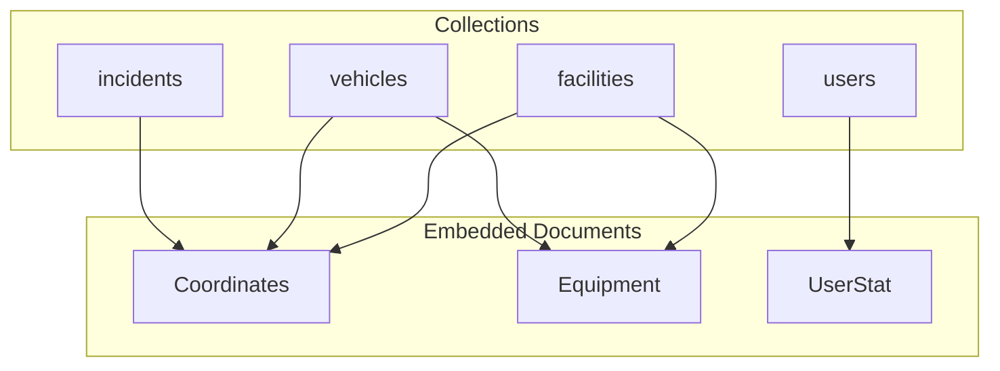
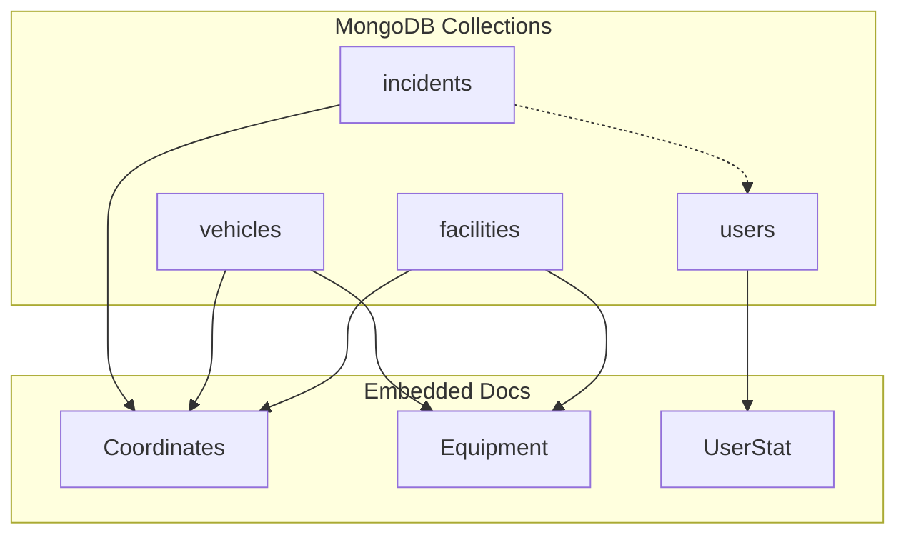
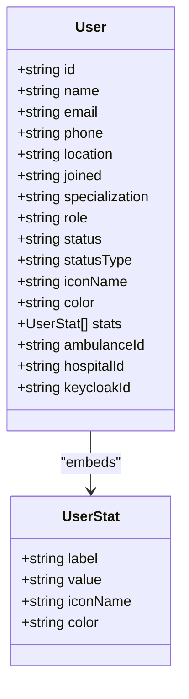
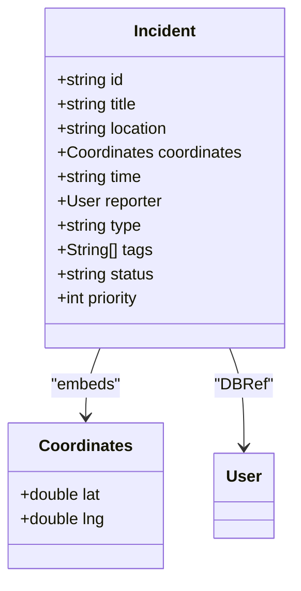
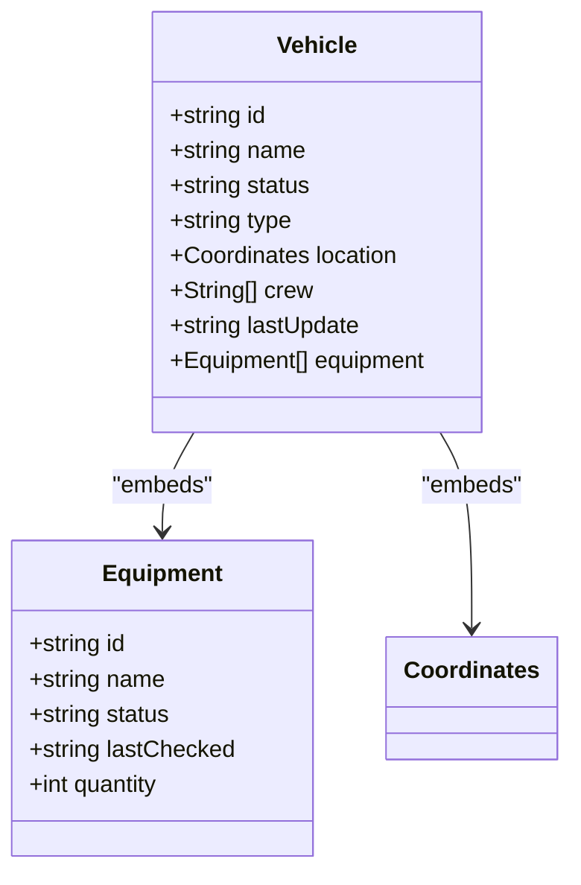
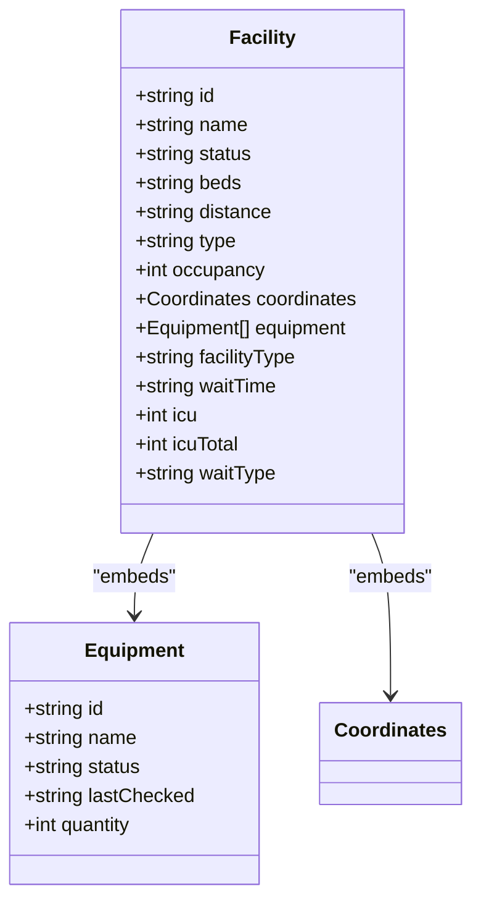
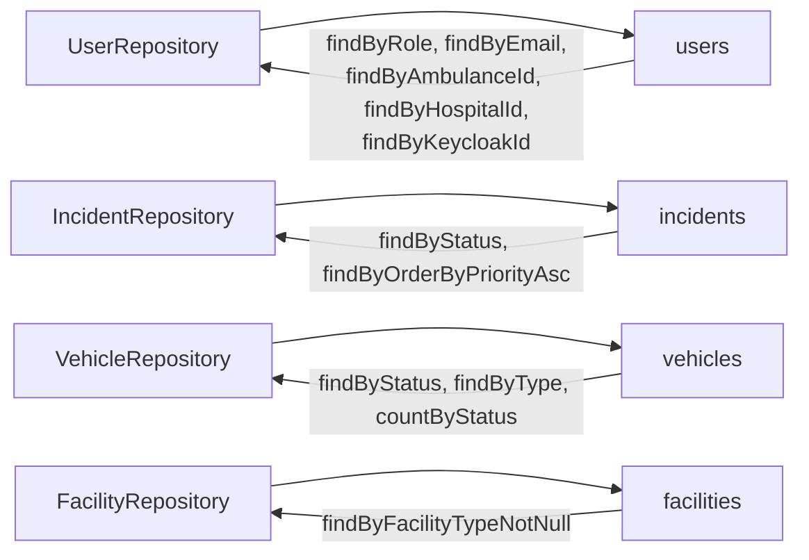
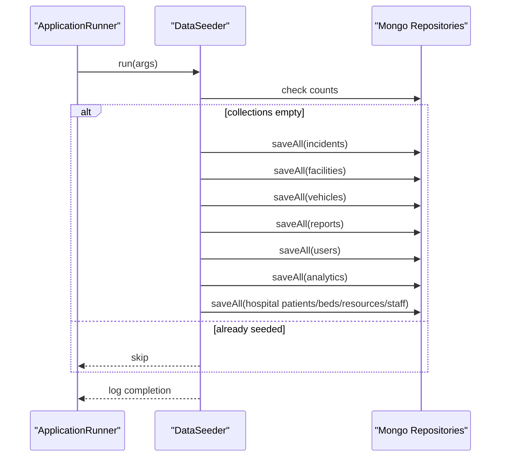

# Database Design

<cite>
**Referenced Files in This Document**
- [User.java](file://src/main/java/com/example/ems_command_center/model/User.java)
- [Incident.java](file://src/main/java/com/example/ems_command_center/model/Incident.java)
- [Vehicle.java](file://src/main/java/com/example/ems_command_center/model/Vehicle.java)
- [Facility.java](file://src/main/java/com/example/ems_command_center/model/Facility.java)
- [Equipment.java](file://src/main/java/com/example/ems_command_center/model/Equipment.java)
- [Coordinates.java](file://src/main/java/com/example/ems_command_center/model/Coordinates.java)
- [UserStat.java](file://src/main/java/com/example/ems_command_center/model/UserStat.java)
- [UserRepository.java](file://src/main/java/com/example/ems_command_center/repository/UserRepository.java)
- [IncidentRepository.java](file://src/main/java/com/example/ems_command_center/repository/IncidentRepository.java)
- [VehicleRepository.java](file://src/main/java/com/example/ems_command_center/repository/VehicleRepository.java)
- [FacilityRepository.java](file://src/main/java/com/example/ems_command_center/repository/FacilityRepository.java)
- [DataSeeder.java](file://src/main/java/com/example/ems_command_center/seeder/DataSeeder.java)
- [application.yml](file://src/main/resources/application.yml)
- [data.json](file://src/main/resources/data.json)
</cite>

## Table of Contents
1. [Introduction](#introduction)
2. [Project Structure](#project-structure)
3. [Core Components](#core-components)
4. [Architecture Overview](#architecture-overview)
5. [Detailed Component Analysis](#detailed-component-analysis)
6. [Dependency Analysis](#dependency-analysis)
7. [Performance Considerations](#performance-considerations)
8. [Troubleshooting Guide](#troubleshooting-guide)
9. [Conclusion](#conclusion)
10. [Appendices](#appendices)

## Introduction
This document describes the MongoDB-based database design for the EMS Command Center. It focuses on the NoSQL schema design, including collections for Users, Incidents, Vehicles, Facilities, and supporting entities. It explains embedded versus referenced documents, indexing strategies, data validation and constraints, data seeding and lifecycle management, and operational considerations derived from the repository’s models, repositories, and seeders.

## Project Structure
The database design centers around Spring Data MongoDB entities mapped to collections. The primary domain entities are:
- Users: Personnel with roles and optional associations to vehicles and hospitals
- Incidents: Emergency events with geospatial coordinates and status/priority
- Vehicles: Ambulances and supervisors with equipment and crew
- Facilities: Hospitals and general facilities with occupancy and equipment
Supporting entities:
- Equipment: Generic asset with status and maintenance metadata
- Coordinates: Lightweight embedded pair of latitude and longitude
- UserStat: Lightweight embedded stat card metadata

**Diagram sources**
- [User.java:1-182](file://src/main/java/com/example/ems_command_center/model/User.java#L1-L182)
- [Incident.java:1-24](file://src/main/java/com/example/ems_command_center/model/Incident.java#L1-L24)
- [Vehicle.java:1-19](file://src/main/java/com/example/ems_command_center/model/Vehicle.java#L1-L19)
- [Facility.java:1-27](file://src/main/java/com/example/ems_command_center/model/Facility.java#L1-L27)
- [Equipment.java:1-11](file://src/main/java/com/example/ems_command_center/model/Equipment.java#L1-L11)
- [Coordinates.java:1-5](file://src/main/java/com/example/ems_command_center/model/Coordinates.java#L1-L5)
- [UserStat.java:1-10](file://src/main/java/com/example/ems_command_center/model/UserStat.java#L1-L10)

**Section sources**
- [User.java:1-182](file://src/main/java/com/example/ems_command_center/model/User.java#L1-L182)
- [Incident.java:1-24](file://src/main/java/com/example/ems_command_center/model/Incident.java#L1-L24)
- [Vehicle.java:1-19](file://src/main/java/com/example/ems_command_center/model/Vehicle.java#L1-L19)
- [Facility.java:1-27](file://src/main/java/com/example/ems_command_center/model/Facility.java#L1-L27)
- [Equipment.java:1-11](file://src/main/java/com/example/ems_command_center/model/Equipment.java#L1-L11)
- [Coordinates.java:1-5](file://src/main/java/com/example/ems_command_center/model/Coordinates.java#L1-L5)
- [UserStat.java:1-10](file://src/main/java/com/example/ems_command_center/model/UserStat.java#L1-L10)

## Core Components
- Users
  - Collection: users
  - Embedded: UserStat list
  - Optional references: ambulanceId, hospitalId, keycloakId
  - Role-based filtering via repository
- Incidents
  - Collection: incidents
  - Embedded: Coordinates
  - Reference: reporter (User) via DBRef
  - Status and priority queries via repository
- Vehicles
  - Collection: vehicles
  - Embedded: Coordinates
  - Embedded: Equipment list
  - Crew list
- Facilities
  - Collection: facilities
  - Embedded: Coordinates
  - Embedded: Equipment list
  - Optional hospital-specific fields (facilityType, icu, icuTotal, waitTime, waitType)
- Equipment
  - Shared asset model with identifiers, status, and maintenance metadata
- Coordinates
  - Lightweight embedded pair for spatial data
- UserStat
  - Lightweight embedded stat card metadata

**Section sources**
- [User.java:1-182](file://src/main/java/com/example/ems_command_center/model/User.java#L1-L182)
- [Incident.java:1-24](file://src/main/java/com/example/ems_command_center/model/Incident.java#L1-L24)
- [Vehicle.java:1-19](file://src/main/java/com/example/ems_command_center/model/Vehicle.java#L1-L19)
- [Facility.java:1-27](file://src/main/java/com/example/ems_command_center/model/Facility.java#L1-L27)
- [Equipment.java:1-11](file://src/main/java/com/example/ems_command_center/model/Equipment.java#L1-L11)
- [Coordinates.java:1-5](file://src/main/java/com/example/ems_command_center/model/Coordinates.java#L1-L5)
- [UserStat.java:1-10](file://src/main/java/com/example/ems_command_center/model/UserStat.java#L1-L10)

## Architecture Overview
The system uses Spring Data MongoDB with repository interfaces for CRUD and query methods. The data model favors embedding for frequently accessed related data (coordinates, equipment, user stats) and references for entities that benefit from normalized storage and updates (users as reporters).

**Diagram sources**
- [User.java:1-182](file://src/main/java/com/example/ems_command_center/model/User.java#L1-L182)
- [Incident.java:1-24](file://src/main/java/com/example/ems_command_center/model/Incident.java#L1-L24)
- [Vehicle.java:1-19](file://src/main/java/com/example/ems_command_center/model/Vehicle.java#L1-L19)
- [Facility.java:1-27](file://src/main/java/com/example/ems_command_center/model/Facility.java#L1-L27)
- [Equipment.java:1-11](file://src/main/java/com/example/ems_command_center/model/Equipment.java#L1-L11)
- [Coordinates.java:1-5](file://src/main/java/com/example/ems_command_center/model/Coordinates.java#L1-L5)
- [UserStat.java:1-10](file://src/main/java/com/example/ems_command_center/model/UserStat.java#L1-L10)

## Detailed Component Analysis

### Users
- Schema highlights
  - Embedded UserStat list for dashboard metrics
  - Optional foreign keys: ambulanceId, hospitalId, keycloakId
  - Role-based categorization (ADMIN, DRIVER, MANAGER, USER)
- Query patterns
  - Find by role, email, ambulanceId, hospitalId, keycloakId
- Indexing strategy
  - Compound index candidates:
    - { role: 1, status: 1 } for role-based filtering and presence checks
    - { email: 1 } for unique lookup
    - { ambulanceId: 1 } for driver-to-vehicle mapping
    - { hospitalId: 1 } for manager-to-facility mapping
    - { keycloakId: 1 } for identity provider linkage
- Validation and constraints
  - Business rules enforced at application level:
    - Unique email per user
    - Consistent role values
    - Optional driver/manager fields guardrails via service logic
- Lifecycle
  - Seeding creates admin, driver, manager, and regular user records
  - Stats embedded for quick rendering

**Diagram sources**
- [User.java:1-182](file://src/main/java/com/example/ems_command_center/model/User.java#L1-L182)
- [UserStat.java:1-10](file://src/main/java/com/example/ems_command_center/model/UserStat.java#L1-L10)

**Section sources**
- [User.java:1-182](file://src/main/java/com/example/ems_command_center/model/User.java#L1-L182)
- [UserRepository.java:1-15](file://src/main/java/com/example/ems_command_center/repository/UserRepository.java#L1-L15)
- [DataSeeder.java:175-238](file://src/main/java/com/example/ems_command_center/seeder/DataSeeder.java#L175-L238)

### Incidents
- Schema highlights
  - Embedded Coordinates for precise location
  - DBRef to User as reporter
  - Fields: title, location, time, type, tags, status, priority
- Query patterns
  - Filter by status
  - Sort by priority ascending
- Indexing strategy
  - Compound index candidates:
    - { status: 1, priority: 1 } for prioritized active lists
    - { type: 1, status: 1 } for urgent vs normal triage
    - { priority: 1 } for sorting
- Validation and constraints
  - Priority numeric ordering
  - Type enum-like values (urgent, normal)
  - Status enum-like values
- Lifecycle
  - Seeding inserts two sample incidents with tags and statuses

**Diagram sources**
- [Incident.java:1-24](file://src/main/java/com/example/ems_command_center/model/Incident.java#L1-L24)
- [Coordinates.java:1-5](file://src/main/java/com/example/ems_command_center/model/Coordinates.java#L1-L5)
- [User.java:1-182](file://src/main/java/com/example/ems_command_center/model/User.java#L1-L182)

**Section sources**
- [Incident.java:1-24](file://src/main/java/com/example/ems_command_center/model/Incident.java#L1-L24)
- [IncidentRepository.java:1-14](file://src/main/java/com/example/ems_command_center/repository/IncidentRepository.java#L1-L14)
- [DataSeeder.java:69-86](file://src/main/java/com/example/ems_command_center/seeder/DataSeeder.java#L69-L86)

### Vehicles
- Schema highlights
  - Embedded Coordinates for live positioning
  - Embedded Equipment list for asset tracking
  - Crew list for on-board assignments
  - Status and type enums
- Query patterns
  - Filter by status and type
  - Count by status
- Indexing strategy
  - Compound index candidates:
    - { status: 1, type: 1 } for fleet utilization
    - { type: 1 } for category filtering
    - { status: 1 } for availability reporting
- Validation and constraints
  - Equipment status enumeration
  - Type and status enums
- Lifecycle
  - Seeding inserts three vehicles with crews and equipment

**Diagram sources**
- [Vehicle.java:1-19](file://src/main/java/com/example/ems_command_center/model/Vehicle.java#L1-L19)
- [Equipment.java:1-11](file://src/main/java/com/example/ems_command_center/model/Equipment.java#L1-L11)
- [Coordinates.java:1-5](file://src/main/java/com/example/ems_command_center/model/Coordinates.java#L1-L5)

**Section sources**
- [Vehicle.java:1-19](file://src/main/java/com/example/ems_command_center/model/Vehicle.java#L1-L19)
- [VehicleRepository.java:1-15](file://src/main/java/com/example/ems_command_center/repository/VehicleRepository.java#L1-L15)
- [DataSeeder.java:138-163](file://src/main/java/com/example/ems_command_center/seeder/DataSeeder.java#L138-L163)

### Facilities
- Schema highlights
  - Embedded Coordinates for map overlays
  - Embedded Equipment list for inventory
  - Optional hospital-specific fields (facilityType, icu/icuTotal, waitTime, waitType)
- Query patterns
  - Filter facilities with facilityType present (hospital-specific)
- Indexing strategy
  - Compound index candidates:
    - { "facilityType": 1 } for hospital-only views
    - { occupancy: 1 } for capacity dashboards
- Validation and constraints
  - Enum-like type/status fields
  - Numeric occupancy and ICU metrics
- Lifecycle
  - Seeding inserts overview facilities and hospital entries with equipment

**Diagram sources**
- [Facility.java:1-27](file://src/main/java/com/example/ems_command_center/model/Facility.java#L1-L27)
- [Equipment.java:1-11](file://src/main/java/com/example/ems_command_center/model/Equipment.java#L1-L11)
- [Coordinates.java:1-5](file://src/main/java/com/example/ems_command_center/model/Coordinates.java#L1-L5)

**Section sources**
- [Facility.java:1-27](file://src/main/java/com/example/ems_command_center/model/Facility.java#L1-L27)
- [FacilityRepository.java:1-13](file://src/main/java/com/example/ems_command_center/repository/FacilityRepository.java#L1-L13)
- [DataSeeder.java:88-136](file://src/main/java/com/example/ems_command_center/seeder/DataSeeder.java#L88-L136)

### Supporting Entities
- Equipment
  - Shared asset model across vehicles and facilities
  - Status enumeration supports maintenance workflows
- Coordinates
  - Lightweight embedded pair enabling geospatial queries and UI rendering
- UserStat
  - Lightweight embedded stat card metadata for user profiles

**Section sources**
- [Equipment.java:1-11](file://src/main/java/com/example/ems_command_center/model/Equipment.java#L1-L11)
- [Coordinates.java:1-5](file://src/main/java/com/example/ems_command_center/model/Coordinates.java#L1-L5)
- [UserStat.java:1-10](file://src/main/java/com/example/ems_command_center/model/UserStat.java#L1-L10)

## Dependency Analysis
The application uses Spring Data MongoDB repositories to expose typed query methods. These methods imply indexes that should be created to optimize frequent queries.

**Diagram sources**
- [UserRepository.java:1-15](file://src/main/java/com/example/ems_command_center/repository/UserRepository.java#L1-L15)
- [IncidentRepository.java:1-14](file://src/main/java/com/example/ems_command_center/repository/IncidentRepository.java#L1-L14)
- [VehicleRepository.java:1-15](file://src/main/java/com/example/ems_command_center/repository/VehicleRepository.java#L1-L15)
- [FacilityRepository.java:1-13](file://src/main/java/com/example/ems_command_center/repository/FacilityRepository.java#L1-L13)

**Section sources**
- [UserRepository.java:1-15](file://src/main/java/com/example/ems_command_center/repository/UserRepository.java#L1-L15)
- [IncidentRepository.java:1-14](file://src/main/java/com/example/ems_command_center/repository/IncidentRepository.java#L1-L14)
- [VehicleRepository.java:1-15](file://src/main/java/com/example/ems_command_center/repository/VehicleRepository.java#L1-L15)
- [FacilityRepository.java:1-13](file://src/main/java/com/example/ems_command_center/repository/FacilityRepository.java#L1-L13)

## Performance Considerations
- Indexing strategy
  - Users
    - Ensure single-field indexes on email, ambulanceId, hospitalId, keycloakId
    - Consider compound index { role: 1, status: 1 } for role-based dashboards
  - Incidents
    - Ensure indexes on status and priority
    - Consider compound index { status: 1, priority: 1 } for active prioritized lists
  - Vehicles
    - Ensure indexes on status and type
    - Consider compound index { status: 1, type: 1 } for fleet utilization
  - Facilities
    - Consider index on facilityType for hospital-only queries
    - Consider index on occupancy for capacity dashboards
- Query patterns
  - Prefer repository methods that map to indexed fields
  - Use projection and pagination for large result sets
- Geospatial
  - Coordinates are embedded; consider 2dsphere indexes if geospatial queries are introduced later
- Write patterns
  - Batch writes during seeding reduce overhead
- Monitoring
  - Enable slow query logging and explain plans for hotspots

[No sources needed since this section provides general guidance]

## Troubleshooting Guide
- Duplicate email errors
  - Symptom: Constraint violation on email uniqueness
  - Resolution: Ensure unique email during user creation/update
- Missing reporter association
  - Symptom: Null reporter in incident listings
  - Resolution: Validate reporter existence before linking
- Out-of-sync counts
  - Symptom: Vehicle availability mismatch
  - Resolution: Recalculate counts via repository countByStatus
- Hospital filters returning empty
  - Symptom: No results for hospital-specific facilities
  - Resolution: Confirm facilityType is populated for target facilities
- Seed data not applied
  - Symptom: Empty collections after startup
  - Resolution: Verify app.seed.enabled property and collection counts before seeding

**Section sources**
- [UserRepository.java:1-15](file://src/main/java/com/example/ems_command_center/repository/UserRepository.java#L1-L15)
- [VehicleRepository.java:1-15](file://src/main/java/com/example/ems_command_center/repository/VehicleRepository.java#L1-L15)
- [FacilityRepository.java:1-13](file://src/main/java/com/example/ems_command_center/repository/FacilityRepository.java#L1-L13)
- [DataSeeder.java:57-67](file://src/main/java/com/example/ems_command_center/seeder/DataSeeder.java#L57-L67)

## Conclusion
The database design leverages MongoDB’s flexibility to embed frequently accessed related data while using references for normalized relationships. Indexes aligned with repository query patterns enable efficient reads. The seeders provide a reproducible baseline for development and testing. Future enhancements may include geospatial indexes, capped collections for audit trails, and TTL-based archival for historical data.

[No sources needed since this section summarizes without analyzing specific files]

## Appendices

### Data Seeding Process
- Trigger
  - Enabled via property app.seed.enabled=true (default enabled)
- Behavior
  - Seeds Incidents, Facilities, Vehicles, Reports, Users, Analytics, and hospital manager datasets
  - Skips seeding if collections already contain data
- Configuration
  - Database URI and name configured via application.yml
  - JSON fixtures also exist for reference

**Diagram sources**
- [DataSeeder.java:17-67](file://src/main/java/com/example/ems_command_center/seeder/DataSeeder.java#L17-L67)
- [application.yml:31-36](file://src/main/resources/application.yml#L31-L36)

**Section sources**
- [DataSeeder.java:17-67](file://src/main/java/com/example/ems_command_center/seeder/DataSeeder.java#L17-L67)
- [application.yml:31-36](file://src/main/resources/application.yml#L31-L36)
- [data.json:1-202](file://src/main/resources/data.json#L1-L202)

### Initial Dataset Creation
- Incidents
  - Two sample incidents with tags and statuses
- Facilities
  - Overview facilities and hospital entries with equipment
- Vehicles
  - Three units with crews and equipment
- Users
  - Admin, driver, manager, and regular user with role and stats
- Analytics
  - Dispatch volume and response time series
- Hospital Manager Data
  - Patients, bed availability, medical resources, and staff

**Section sources**
- [DataSeeder.java:69-86](file://src/main/java/com/example/ems_command_center/seeder/DataSeeder.java#L69-L86)
- [DataSeeder.java:88-136](file://src/main/java/com/example/ems_command_center/seeder/DataSeeder.java#L88-L136)
- [DataSeeder.java:138-163](file://src/main/java/com/example/ems_command_center/seeder/DataSeeder.java#L138-L163)
- [DataSeeder.java:175-238](file://src/main/java/com/example/ems_command_center/seeder/DataSeeder.java#L175-L238)
- [DataSeeder.java:240-269](file://src/main/java/com/example/ems_command_center/seeder/DataSeeder.java#L240-L269)
- [DataSeeder.java:271-361](file://src/main/java/com/example/ems_command_center/seeder/DataSeeder.java#L271-L361)

### Test Data Management
- Seeding is conditional on app.seed.enabled
- Seeders check collection sizes before writing
- JSON fixtures available for reference and CI import scenarios

**Section sources**
- [DataSeeder.java:17-67](file://src/main/java/com/example/ems_command_center/seeder/DataSeeder.java#L17-L67)
- [data.json:1-202](file://src/main/resources/data.json#L1-L202)

### Data Validation Rules and Constraints
- Roles and statuses
  - Enum-like values enforced by service/business logic
- Email uniqueness
  - Unique constraint enforced at application level
- Equipment status
  - Enum-like values enforced by service/business logic
- Coordinates
  - Embedded doubles for lat/lng; validation handled by service layer
- Priority and occupancy
  - Numeric fields validated by service layer

**Section sources**
- [User.java:1-182](file://src/main/java/com/example/ems_command_center/model/User.java#L1-L182)
- [Incident.java:1-24](file://src/main/java/com/example/ems_command_center/model/Incident.java#L1-L24)
- [Vehicle.java:1-19](file://src/main/java/com/example/ems_command_center/model/Vehicle.java#L1-L19)
- [Facility.java:1-27](file://src/main/java/com/example/ems_command_center/model/Facility.java#L1-L27)
- [Equipment.java:1-11](file://src/main/java/com/example/ems_command_center/model/Equipment.java#L1-L11)
- [Coordinates.java:1-5](file://src/main/java/com/example/ems_command_center/model/Coordinates.java#L1-L5)

### Data Lifecycle Management and Archival
- Current design
  - No explicit TTL or archival policies in models/repositories
- Recommendations
  - TTL collections for transient events (e.g., recent incidents)
  - Archival pipeline for resolved incidents and reports
  - Partitioned collections by date for analytics
- Migration considerations
  - Backward-compatible schema evolution for embedded arrays
  - Reference migrations for DBRef targets
  - Controlled rollout with feature flags

[No sources needed since this section provides general guidance]