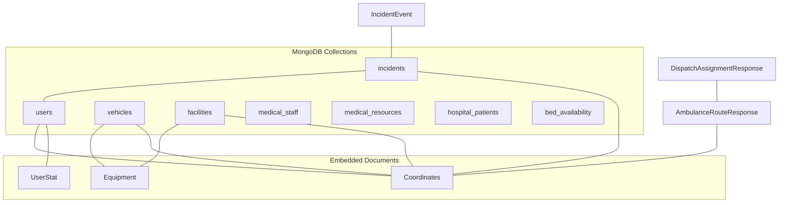
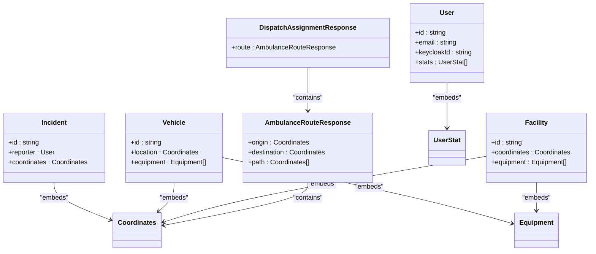
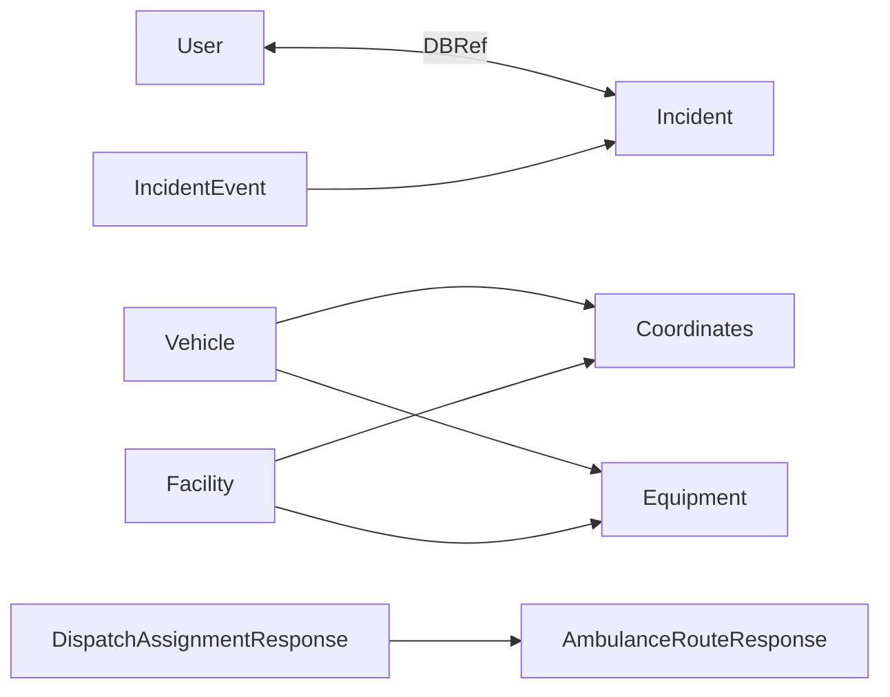

# Entity Models

<cite>
**Referenced Files in This Document**
- [User.java](file://src/main/java/com/example/ems_command_center/model/User.java)
- [Incident.java](file://src/main/java/com/example/ems_command_center/model/Incident.java)
- [Vehicle.java](file://src/main/java/com/example/ems_command_center/model/Vehicle.java)
- [Facility.java](file://src/main/java/com/example/ems_command_center/model/Facility.java)
- [Equipment.java](file://src/main/java/com/example/ems_command_center/model/Equipment.java)
- [MedicalStaffMember.java](file://src/main/java/com/example/ems_command_center/model/MedicalStaffMember.java)
- [MedicalResource.java](file://src/main/java/com/example/ems_command_center/model/MedicalResource.java)
- [Coordinates.java](file://src/main/java/com/example/ems_command_center/model/Coordinates.java)
- [UserStat.java](file://src/main/java/com/example/ems_command_center/model/UserStat.java)
- [BedAvailability.java](file://src/main/java/com/example/ems_command_center/model/BedAvailability.java)
- [HospitalPatient.java](file://src/main/java/com/example/ems_command_center/model/HospitalPatient.java)
- [IncidentEvent.java](file://src/main/java/com/example/ems_command_center/model/IncidentEvent.java)
- [DispatchRequest.java](file://src/main/java/com/example/ems_command_center/model/DispatchRequest.java)
- [DispatchAssignmentResponse.java](file://src/main/java/com/example/ems_command_center/model/DispatchAssignmentResponse.java)
- [AmbulanceRouteResponse.java](file://src/main/java/com/example/ems_command_center/model/AmbulanceRouteResponse.java)
</cite>

## Table of Contents
1. [Introduction](#introduction)
2. [Project Structure](#project-structure)
3. [Core Components](#core-components)
4. [Architecture Overview](#architecture-overview)
5. [Detailed Component Analysis](#detailed-component-analysis)
6. [Dependency Analysis](#dependency-analysis)
7. [Performance Considerations](#performance-considerations)
8. [Troubleshooting Guide](#troubleshooting-guide)
9. [Conclusion](#conclusion)

## Introduction
This document defines the MongoDB entity model for the EMS Command Center. It describes each domain entity, including fields, data types, validation rules, and business constraints. It also explains embedded document patterns versus referenced relationships, inter-entity field relationships, and typical document structures. Where applicable, it outlines lifecycle considerations and common query patterns.

## Project Structure
The entity models are defined as Spring Data MongoDB annotated records under the model package. Collections are mapped via annotations to their respective MongoDB collection names. Embedded documents are modeled as records and included inline, while references are indicated with DBRef annotations.

**Diagram sources**
- [User.java:8](file://src/main/java/com/example/ems_command_center/model/User.java#L8)
- [Incident.java:8](file://src/main/java/com/example/ems_command_center/model/Incident.java#L8)
- [Vehicle.java:7](file://src/main/java/com/example/ems_command_center/model/Vehicle.java#L7)
- [Facility.java:7](file://src/main/java/com/example/ems_command_center/model/Facility.java#L7)
- [Equipment.java:3](file://src/main/java/com/example/ems_command_center/model/Equipment.java#L3)
- [Coordinates.java:3](file://src/main/java/com/example/ems_command_center/model/Coordinates.java#L3)
- [UserStat.java:3](file://src/main/java/com/example/ems_command_center/model/UserStat.java#L3)
- [AmbulanceRouteResponse.java:5](file://src/main/java/com/example/ems_command_center/model/AmbulanceRouteResponse.java#L5)
- [DispatchAssignmentResponse.java:5](file://src/main/java/com/example/ems_command_center/model/DispatchAssignmentResponse.java#L5)
- [IncidentEvent.java:3](file://src/main/java/com/example/ems_command_center/model/IncidentEvent.java#L3)

**Section sources**
- [User.java:8](file://src/main/java/com/example/ems_command_center/model/User.java#L8)
- [Incident.java:8](file://src/main/java/com/example/ems_command_center/model/Incident.java#L8)
- [Vehicle.java:7](file://src/main/java/com/example/ems_command_center/model/Vehicle.java#L7)
- [Facility.java:7](file://src/main/java/com/example/ems_command_center/model/Facility.java#L7)
- [Equipment.java:3](file://src/main/java/com/example/ems_command_center/model/Equipment.java#L3)
- [Coordinates.java:3](file://src/main/java/com/example/ems_command_center/model/Coordinates.java#L3)
- [UserStat.java:3](file://src/main/java/com/example/ems_command_center/model/UserStat.java#L3)
- [AmbulanceRouteResponse.java:5](file://src/main/java/com/example/ems_command_center/model/AmbulanceRouteResponse.java#L5)
- [DispatchAssignmentResponse.java:5](file://src/main/java/com/example/ems_command_center/model/DispatchAssignmentResponse.java#L5)
- [IncidentEvent.java:3](file://src/main/java/com/example/ems_command_center/model/IncidentEvent.java#L3)

## Core Components
This section summarizes each entity’s purpose, fields, and constraints.

- User
  - Purpose: Represents system users (patients, staff, dispatchers, administrators).
  - Key fields: id, name, email (unique index), phone, location, joined, specialization, role, status, statusType, iconName, color, stats (embedded), ambulanceId (driver association), hospitalId (manager association), keycloakId (unique index).
  - Validation rules: Unique indices on email and keycloakId; enums implied by role/status/statusType/iconName/color semantics.
  - Typical queries: Find by email/keycloakId, filter by role/status, embed stats for dashboards.

- Incident
  - Purpose: Captures emergency incidents reported by users.
  - Key fields: id, title, location, coordinates (embedded), time, reporter (DBRef to User), type, tags, status, priority.
  - Validation rules: Enum-like type and status; priority integer; DBRef for reporter.
  - Typical queries: Find by reporter, by status/type/priority, geospatial near coordinates.

- Vehicle
  - Purpose: Tracks EMS vehicles (ambulances, supervisors, fire trucks).
  - Key fields: id, name, status, type, location (embedded Coordinates), crew, lastUpdate, equipment (embedded Equipment list).
  - Validation rules: Enum-like status and type; embedded equipment list.
  - Typical queries: Find by status/type, near coordinates, by crew membership.

- Facility
  - Purpose: Represents healthcare facilities with bed and equipment data.
  - Key fields: id, name, status, beds, distance, type, occupancy, coordinates (embedded), equipment (embedded Equipment list), facilityType, waitTime, icu, icuTotal, waitType.
  - Validation rules: Enum-like status/type; embedded coordinates/equipment; numeric occupancy/icu counts.
  - Typical queries: Find by status/type, occupancy thresholds, near coordinates.

- Equipment
  - Purpose: Describes reusable assets carried by vehicles/facilities.
  - Key fields: id, name, status, lastChecked, quantity.
  - Validation rules: Enum-like status; optional quantity.
  - Typical queries: Inventory checks, availability filtering.

- MedicalStaffMember
  - Purpose: Represents medical staff profiles.
  - Key fields: id, name, role, specialty, shift, status.
  - Validation rules: Enum-like status; shift pattern.
  - Typical queries: Find by role/specialty/status/shift.

- MedicalResource
  - Purpose: Tracks consumable or reusable medical supplies.
  - Key fields: id, name, category, availableUnits, totalUnits, status, location, lastUpdated.
  - Validation rules: Numeric units; status/location metadata.
  - Typical queries: Low-stock alerts, by category/location.

- Coordinates
  - Purpose: Shared embedded geo-coordinate pair.
  - Key fields: lat, lng.
  - Validation rules: Numeric coordinates.

- UserStat
  - Purpose: Embedded statistics for a user.
  - Key fields: label, value, iconName, color.
  - Validation rules: UI metadata.

- BedAvailability
  - Purpose: Ward-level bed inventory.
  - Key fields: id, ward, totalBeds, occupiedBeds, availableBeds, reservedBeds, status.
  - Validation rules: Non-negative integers; derived availability computed as total - occupied - reserved.

- HospitalPatient
  - Purpose: Tracks patients within hospital systems.
  - Key fields: id, patientCode, patientName, age, emergencyId, emergencyTitle, triageLevel, status, assignedDoctor, assignedNurse, room, dossierSummary, careSteps, careValidated, validatedBy, updatedAt.
  - Validation rules: Triage and status enums; care steps array; validated flag.
  - Typical queries: By emergencyId/status/triageLevel.

- IncidentEvent
  - Purpose: Event wrapper for incident actions.
  - Key fields: action, incidentId, incident (embedded Incident snapshot).
  - Validation rules: Action semantics; embedded incident snapshot.

- DispatchRequest
  - Purpose: Request payload to dispatch a vehicle to an incident.
  - Key fields: incidentId, vehicleId, dispatcher, notes.
  - Typical queries: Pending requests, by incident/vehicle/dispatcher.

- DispatchAssignmentResponse
  - Purpose: Response after dispatching with route details.
  - Key fields: incidentId, incidentTitle, vehicleId, vehicleName, dispatcher, notes, vehicleStatus, incidentStatus, dispatchedAt, incidentTags, route (embedded AmbulanceRouteResponse).
  - Validation rules: Status enums; route metadata.

- AmbulanceRouteResponse
  - Purpose: Route and ETA details for ambulance.
  - Key fields: vehicleId, vehicleName, incidentId, incidentTitle, origin, destination, path (embedded Coordinates list), distanceKm, estimatedMinutes, trafficLevel, turnByTurn.
  - Validation rules: Distance/time metrics; path as coordinate sequence.

**Section sources**
- [User.java:9-187](file://src/main/java/com/example/ems_command_center/model/User.java#L9-L187)
- [Incident.java:9-23](file://src/main/java/com/example/ems_command_center/model/Incident.java#L9-L23)
- [Vehicle.java:8-18](file://src/main/java/com/example/ems_command_center/model/Vehicle.java#L8-L18)
- [Facility.java:8-26](file://src/main/java/com/example/ems_command_center/model/Facility.java#L8-L26)
- [Equipment.java:3-10](file://src/main/java/com/example/ems_command_center/model/Equipment.java#L3-L10)
- [MedicalStaffMember.java:6-15](file://src/main/java/com/example/ems_command_center/model/MedicalStaffMember.java#L6-L15)
- [MedicalResource.java:6-17](file://src/main/java/com/example/ems_command_center/model/MedicalResource.java#L6-L17)
- [Coordinates.java:3](file://src/main/java/com/example/ems_command_center/model/Coordinates.java#L3)
- [UserStat.java:3-9](file://src/main/java/com/example/ems_command_center/model/UserStat.java#L3-L9)
- [BedAvailability.java:6-16](file://src/main/java/com/example/ems_command_center/model/BedAvailability.java#L6-L16)
- [HospitalPatient.java:8-27](file://src/main/java/com/example/ems_command_center/model/HospitalPatient.java#L8-L27)
- [IncidentEvent.java:3-8](file://src/main/java/com/example/ems_command_center/model/IncidentEvent.java#L3-L8)
- [DispatchRequest.java:3-9](file://src/main/java/com/example/ems_command_center/model/DispatchRequest.java#L3-L9)
- [DispatchAssignmentResponse.java:5-18](file://src/main/java/com/example/ems_command_center/model/DispatchAssignmentResponse.java#L5-L18)
- [AmbulanceRouteResponse.java:5-18](file://src/main/java/com/example/ems_command_center/model/AmbulanceRouteResponse.java#L5-L18)

## Architecture Overview
The model layer uses Spring Data MongoDB with records for immutable data and embedded documents for spatial and related metadata. References are declared with DBRef for cross-collection relationships.

**Diagram sources**
- [User.java:26](file://src/main/java/com/example/ems_command_center/model/User.java#L26)
- [Incident.java:13](file://src/main/java/com/example/ems_command_center/model/Incident.java#L13)
- [Vehicle.java:13](file://src/main/java/com/example/ems_command_center/model/Vehicle.java#L13)
- [Vehicle.java:16](file://src/main/java/com/example/ems_command_center/model/Vehicle.java#L16)
- [Facility.java:16](file://src/main/java/com/example/ems_command_center/model/Facility.java#L16)
- [Facility.java:17](file://src/main/java/com/example/ems_command_center/model/Facility.java#L17)
- [Coordinates.java:3](file://src/main/java/com/example/ems_command_center/model/Coordinates.java#L3)
- [Equipment.java:3](file://src/main/java/com/example/ems_command_center/model/Equipment.java#L3)
- [AmbulanceRouteResponse.java:10](file://src/main/java/com/example/ems_command_center/model/AmbulanceRouteResponse.java#L10)
- [AmbulanceRouteResponse.java:12](file://src/main/java/com/example/ems_command_center/model/AmbulanceRouteResponse.java#L12)
- [DispatchAssignmentResponse.java:16](file://src/main/java/com/example/ems_command_center/model/DispatchAssignmentResponse.java#L16)

## Detailed Component Analysis

### User
- Fields and types
  - id: string
  - name: string
  - email: string (unique index)
  - phone: string
  - location: string
  - joined: string (timestamp/date string)
  - specialization: string
  - role: string (enum-like: USER, ADMIN, DRIVER, MANAGER)
  - status: string (status label)
  - statusType: string (enum-like: success, normal, urgent)
  - iconName: string (UI)
  - color: string (CSS class)
  - stats: UserStat[] (embedded)
  - ambulanceId: string (driver association)
  - hospitalId: string (manager association)
  - keycloakId: string (unique index)
- Validation and constraints
  - Unique indices on email and keycloakId.
  - Role/status/statusType imply constrained vocabularies.
- Lifecycle
  - Creation via registration; updates for profile, status, stats.
- Typical queries
  - findByEmail, findByKeycloakId, findByRole, embed stats for reporting.

**Section sources**
- [User.java:9-187](file://src/main/java/com/example/ems_command_center/model/User.java#L9-L187)

### Incident
- Fields and types
  - id: string
  - title: string
  - location: string
  - coordinates: Coordinates (embedded)
  - time: string
  - reporter: User (DBRef)
  - type: string (enum-like: urgent, normal)
  - tags: string[]
  - status: string
  - priority: int
- Validation and constraints
  - DBRef to User for reporter.
  - Enum-like type/status; priority integer.
- Lifecycle
  - Created by reporter; updated through dispatch and resolution.
- Typical queries
  - By reporter, by status/type/priority; geospatial queries around coordinates.

**Section sources**
- [Incident.java:9-23](file://src/main/java/com/example/ems_command_center/model/Incident.java#L9-L23)

### Vehicle
- Fields and types
  - id: string
  - name: string
  - status: string (enum-like: available, busy, maintenance, out-of-service)
  - type: string (enum-like: ambulance, supervisor, fire-truck)
  - location: Coordinates (embedded)
  - crew: string[]
  - lastUpdate: string
  - equipment: Equipment[] (embedded)
- Validation and constraints
  - Enum-like status/type; embedded equipment list.
- Lifecycle
  - Dispatched/busy/maintenance; updates location and equipment.
- Typical queries
  - By status/type; near coordinates; crew membership.

**Section sources**
- [Vehicle.java:8-18](file://src/main/java/com/example/ems_command_center/model/Vehicle.java#L8-L18)

### Facility
- Fields and types
  - id: string
  - name: string
  - status: string
  - beds: string
  - distance: string
  - type: string (enum-like: error, warning, success)
  - occupancy: int
  - coordinates: Coordinates (embedded)
  - equipment: Equipment[] (embedded)
  - facilityType: string
  - waitTime: string
  - icu: int
  - icuTotal: int
  - waitType: string
- Validation and constraints
  - Enum-like status/type; numeric occupancy/icu; embedded coordinates/equipment.
- Lifecycle
  - Updated with bed counts, wait times, ICU capacity.
- Typical queries
  - By status/type; occupancy thresholds; near coordinates.

**Section sources**
- [Facility.java:8-26](file://src/main/java/com/example/ems_command_center/model/Facility.java#L8-L26)

### Equipment
- Fields and types
  - id: string
  - name: string
  - status: string (enum-like: functional, needs-maintenance, out-of-service)
  - lastChecked: string
  - quantity: int
- Validation and constraints
  - Enum-like status; optional quantity.
- Lifecycle
  - Inspected/updated; tracked across vehicles/facilities.
- Typical queries
  - Inventory checks; availability filtering.

**Section sources**
- [Equipment.java:3-10](file://src/main/java/com/example/ems_command_center/model/Equipment.java#L3-L10)

### MedicalStaffMember
- Fields and types
  - id: string
  - name: string
  - role: string
  - specialty: string
  - shift: string
  - status: string
- Validation and constraints
  - Enum-like status; shift pattern.
- Lifecycle
  - Assigned to shifts; updated status.
- Typical queries
  - By role/specialty/status/shift.

**Section sources**
- [MedicalStaffMember.java:6-15](file://src/main/java/com/example/ems_command_center/model/MedicalStaffMember.java#L6-L15)

### MedicalResource
- Fields and types
  - id: string
  - name: string
  - category: string
  - availableUnits: int
  - totalUnits: int
  - status: string
  - location: string
  - lastUpdated: string
- Validation and constraints
  - Numeric units; status/location metadata.
- Lifecycle
  - Replenished/restocked; low-stock alerts.
- Typical queries
  - Low-stock alerts; by category/location.

**Section sources**
- [MedicalResource.java:6-17](file://src/main/java/com/example/ems_command_center/model/MedicalResource.java#L6-L17)

### Coordinates
- Fields and types
  - lat: double
  - lng: double
- Validation and constraints
  - Numeric coordinates.
- Usage
  - Embedded in Incident, Vehicle, Facility, AmbulanceRouteResponse.

**Section sources**
- [Coordinates.java:3](file://src/main/java/com/example/ems_command_center/model/Coordinates.java#L3)

### UserStat
- Fields and types
  - label: string
  - value: string
  - iconName: string
  - color: string
- Validation and constraints
  - UI metadata.
- Usage
  - Embedded in User.

**Section sources**
- [UserStat.java:3-9](file://src/main/java/com/example/ems_command_center/model/UserStat.java#L3-L9)

### BedAvailability
- Fields and types
  - id: string
  - ward: string
  - totalBeds: int
  - occupiedBeds: int
  - availableBeds: int
  - reservedBeds: int
  - status: string
- Validation and constraints
  - Non-negative integers; derived availability equals total minus occupied and reserved.
- Lifecycle
  - Updated periodically; used for capacity planning.
- Typical queries
  - By ward/status; occupancy thresholds.

**Section sources**
- [BedAvailability.java:6-16](file://src/main/java/com/example/ems_command_center/model/BedAvailability.java#L6-L16)

### HospitalPatient
- Fields and types
  - id: string
  - patientCode: string
  - patientName: string
  - age: int
  - emergencyId: string
  - emergencyTitle: string
  - triageLevel: string
  - status: string
  - assignedDoctor: string
  - assignedNurse: string
  - room: string
  - dossierSummary: string
  - careSteps: string[]
  - careValidated: boolean
  - validatedBy: string
  - updatedAt: string
- Validation and constraints
  - Triage and status enums; care steps array; validated flag.
- Lifecycle
  - Admission, care progression, discharge.
- Typical queries
  - By emergencyId/status/triageLevel.

**Section sources**
- [HospitalPatient.java:8-27](file://src/main/java/com/example/ems_command_center/model/HospitalPatient.java#L8-L27)

### IncidentEvent
- Fields and types
  - action: string
  - incidentId: string
  - incident: Incident (embedded snapshot)
- Validation and constraints
  - Action semantics; embedded incident snapshot.
- Usage
  - Event sourcing or audit trail entries.

**Section sources**
- [IncidentEvent.java:3-8](file://src/main/java/com/example/ems_command_center/model/IncidentEvent.java#L3-L8)

### DispatchRequest
- Fields and types
  - incidentId: string
  - vehicleId: string
  - dispatcher: string
  - notes: string
- Typical queries
  - Pending requests, by incident/vehicle/dispatcher.

**Section sources**
- [DispatchRequest.java:3-9](file://src/main/java/com/example/ems_command_center/model/DispatchRequest.java#L3-L9)

### DispatchAssignmentResponse
- Fields and types
  - incidentId: string
  - incidentTitle: string
  - vehicleId: string
  - vehicleName: string
  - dispatcher: string
  - notes: string
  - vehicleStatus: string
  - incidentStatus: string
  - dispatchedAt: string
  - incidentTags: string[]
  - route: AmbulanceRouteResponse (embedded)
- Validation and constraints
  - Status enums; route metadata.
- Usage
  - Post-dispatch response with routing details.

**Section sources**
- [DispatchAssignmentResponse.java:5-18](file://src/main/java/com/example/ems_command_center/model/DispatchAssignmentResponse.java#L5-L18)

### AmbulanceRouteResponse
- Fields and types
  - vehicleId: string
  - vehicleName: string
  - incidentId: string
  - incidentTitle: string
  - origin: Coordinates (embedded)
  - destination: Coordinates (embedded)
  - path: Coordinates[] (embedded)
  - distanceKm: double
  - estimatedMinutes: int
  - trafficLevel: string
  - turnByTurn: string[]
- Validation and constraints
  - Distance/time metrics; path as coordinate sequence.
- Usage
  - Embedded in DispatchAssignmentResponse.

**Section sources**
- [AmbulanceRouteResponse.java:5-18](file://src/main/java/com/example/ems_command_center/model/AmbulanceRouteResponse.java#L5-L18)

## Dependency Analysis
- Embedded vs referenced
  - Embedded: Coordinates, UserStat, Equipment, AmbulanceRouteResponse, Incident snapshots.
  - Referenced: Incident.reporter (DBRef to User).
- Inter-entity relationships
  - Incident -> User (reporter)
  - Vehicle -> Coordinates (location)
  - Vehicle -> Equipment (equipment list)
  - Facility -> Coordinates (coordinates)
  - Facility -> Equipment (equipment list)
  - DispatchAssignmentResponse -> AmbulanceRouteResponse (route)
  - IncidentEvent -> Incident (snapshot)
- Coupling and cohesion
  - Entities are cohesive around domain concepts; coupling is minimized via embedded documents and explicit DBRef for cross-collections.

**Diagram sources**
- [Incident.java:15](file://src/main/java/com/example/ems_command_center/model/Incident.java#L15)
- [Vehicle.java:13](file://src/main/java/com/example/ems_command_center/model/Vehicle.java#L13)
- [Vehicle.java:16](file://src/main/java/com/example/ems_command_center/model/Vehicle.java#L16)
- [Facility.java:16](file://src/main/java/com/example/ems_command_center/model/Facility.java#L16)
- [Facility.java:17](file://src/main/java/com/example/ems_command_center/model/Facility.java#L17)
- [DispatchAssignmentResponse.java:16](file://src/main/java/com/example/ems_command_center/model/DispatchAssignmentResponse.java#L16)
- [IncidentEvent.java:6](file://src/main/java/com/example/ems_command_center/model/IncidentEvent.java#L6)

**Section sources**
- [Incident.java:15](file://src/main/java/com/example/ems_command_center/model/Incident.java#L15)
- [Vehicle.java:13](file://src/main/java/com/example/ems_command_center/model/Vehicle.java#L13)
- [Vehicle.java:16](file://src/main/java/com/example/ems_command_center/model/Vehicle.java#L16)
- [Facility.java:16](file://src/main/java/com/example/ems_command_center/model/Facility.java#L16)
- [Facility.java:17](file://src/main/java/com/example/ems_command_center/model/Facility.java#L17)
- [DispatchAssignmentResponse.java:16](file://src/main/java/com/example/ems_command_center/model/DispatchAssignmentResponse.java#L16)
- [IncidentEvent.java:6](file://src/main/java/com/example/ems_command_center/model/IncidentEvent.java#L6)

## Performance Considerations
- Indexes
  - Ensure unique indexes on frequently queried identifiers (e.g., User.email, User.keycloakId).
- Embedding strategy
  - Prefer embedding small, co-located data (Coordinates, UserStat, Equipment) to reduce joins.
- Reference strategy
  - Use DBRef for entities that are large or shared across many documents (e.g., User in Incident).
- Query patterns
  - Geospatial queries on Coordinates; equality filters on enums/status; range filters on numeric fields.

## Troubleshooting Guide
- Duplicate key errors
  - Unique index violations on email or keycloakId in User.
- Missing references
  - DBRef resolution failures if referenced User does not exist.
- Data type mismatches
  - Ensure numeric fields (priority, occupancy, icu, minutes) are stored as numbers.
- Validation failures
  - Enforce enum-like constraints at service level if needed.

## Conclusion
The entity model balances embedded and referenced patterns to optimize for common queries and maintainability. Constraints are enforced via unique indexes and enum-like fields. Typical query patterns focus on equality, range, and geospatial filters. The model supports dispatch workflows, capacity planning, and patient tracking across the EMS ecosystem.