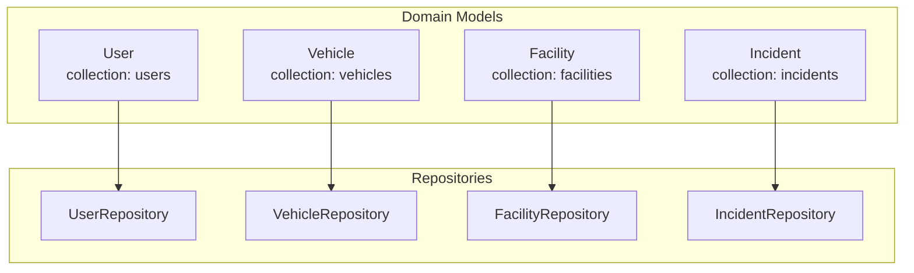
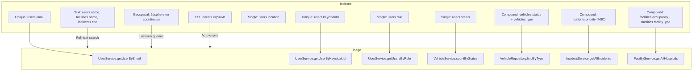
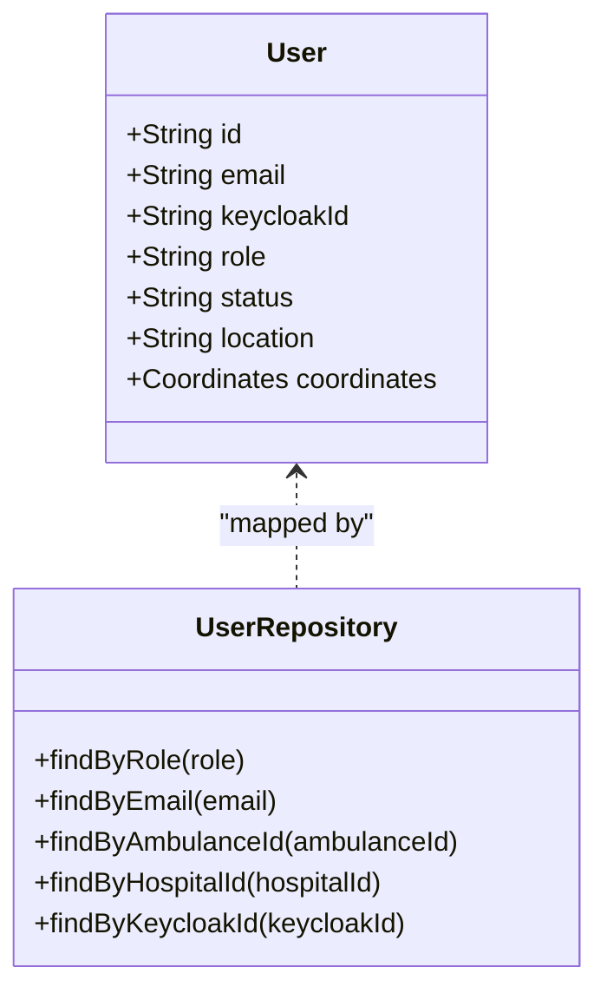
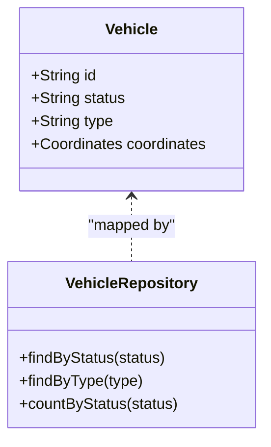
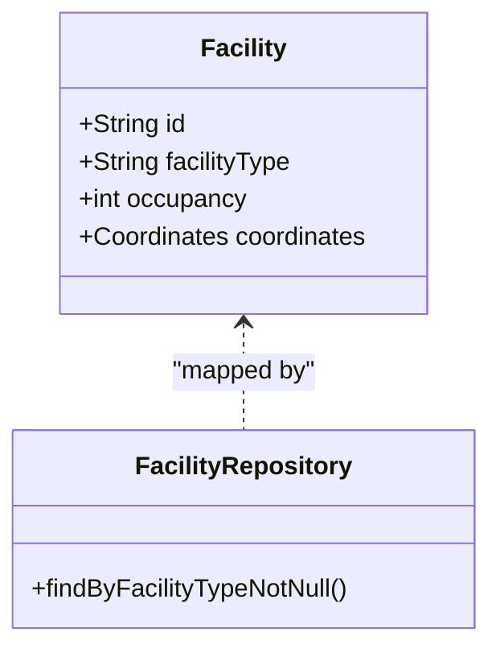
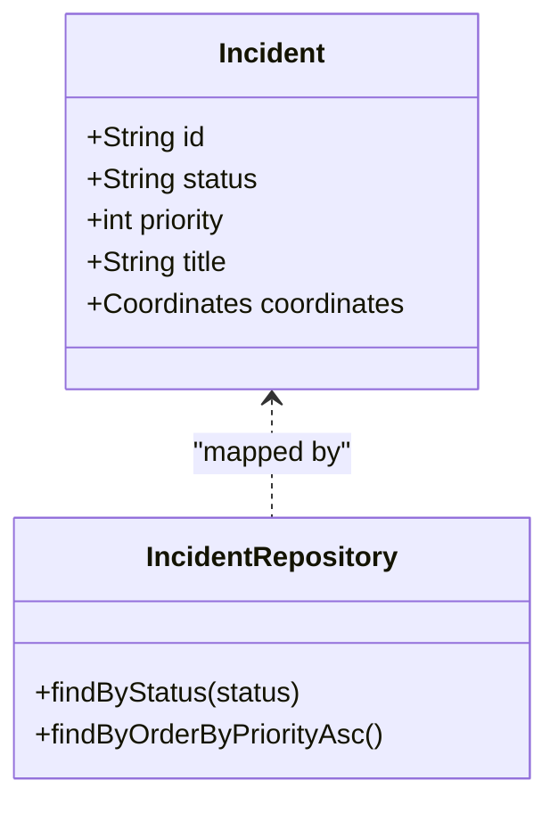
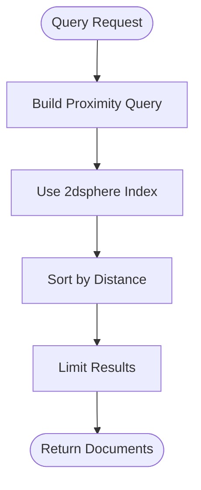
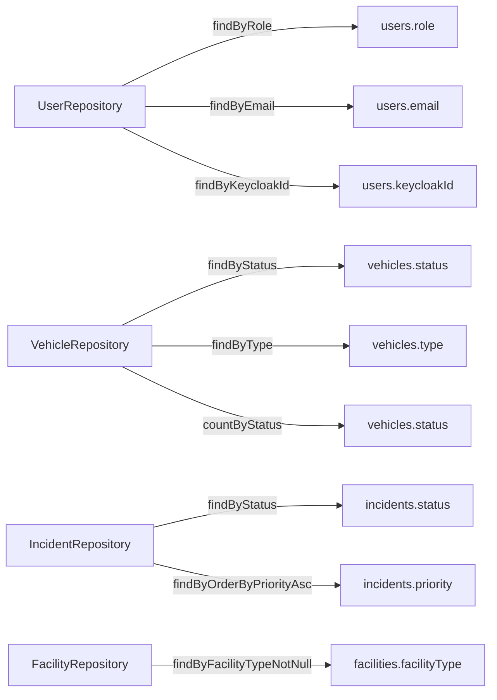
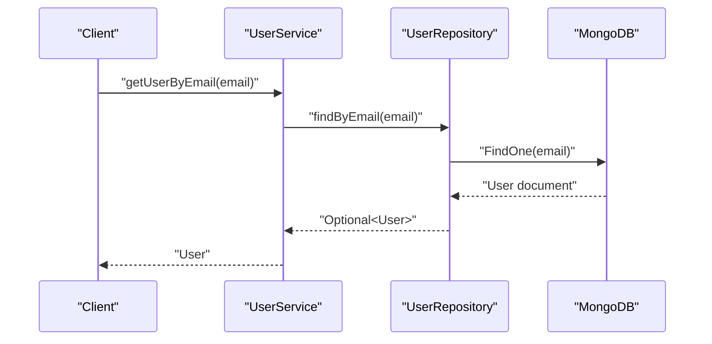

# Indexing Strategy

<cite>
**Referenced Files in This Document**
- [User.java](file://src/main/java/com/example/ems_command_center/model/User.java)
- [Vehicle.java](file://src/main/java/com/example/ems_command_center/model/Vehicle.java)
- [Facility.java](file://src/main/java/com/example/ems_command_center/model/Facility.java)
- [Incident.java](file://src/main/java/com/example/ems_command_center/model/Incident.java)
- [Coordinates.java](file://src/main/java/com/example/ems_command_center/model/Coordinates.java)
- [UserRepository.java](file://src/main/java/com/example/ems_command_center/repository/UserRepository.java)
- [VehicleRepository.java](file://src/main/java/com/example/ems_command_center/repository/VehicleRepository.java)
- [FacilityRepository.java](file://src/main/java/com/example/ems_command_center/repository/FacilityRepository.java)
- [IncidentRepository.java](file://src/main/java/com/example/ems_command_center/repository/IncidentRepository.java)
- [UserService.java](file://src/main/java/com/example/ems_command_center/service/UserService.java)
- [VehicleService.java](file://src/main/java/com/example/ems_command_center/service/VehicleService.java)
- [FacilityService.java](file://src/main/java/com/example/ems_command_center/service/FacilityService.java)
- [IncidentService.java](file://src/main/java/com/example/ems_command_center/service/IncidentService.java)
- [application.yml](file://src/main/resources/application.yml)
- [data.json](file://src/main/resources/data.json)
</cite>

## Table of Contents
1. [Introduction](#introduction)
2. [Project Structure](#project-structure)
3. [Core Components](#core-components)
4. [Architecture Overview](#architecture-overview)
5. [Detailed Component Analysis](#detailed-component-analysis)
6. [Dependency Analysis](#dependency-analysis)
7. [Performance Considerations](#performance-considerations)
8. [Troubleshooting Guide](#troubleshooting-guide)
9. [Conclusion](#conclusion)
10. [Appendices](#appendices)

## Introduction
This document defines a comprehensive MongoDB indexing strategy tailored to the EMS Command Center application. It focuses on optimizing query performance across users, vehicles, facilities, and incidents by leveraging single-field, compound, text, geospatial, and TTL indexes. It also covers index creation strategies, maintenance, monitoring, and guidelines for evolving indexes based on observed query patterns.

## Project Structure
The application follows a Spring Data MongoDB pattern with domain models mapped to collections and repository interfaces exposing typed query methods. The relevant models and repositories are organized by domain:

- Users: collection “users”
- Vehicles: collection “vehicles”
- Facilities: collection “facilities”
- Incidents: collection “incidents”

**Diagram sources**
- [User.java:8](file://src/main/java/com/example/ems_command_center/model/User.java#L8)
- [Vehicle.java:7](file://src/main/java/com/example/ems_command_center/model/Vehicle.java#L7)
- [Facility.java:7](file://src/main/java/com/example/ems_command_center/model/Facility.java#L7)
- [Incident.java:8](file://src/main/java/com/example/ems_command_center/model/Incident.java#L8)
- [UserRepository.java:8](file://src/main/java/com/example/ems_command_center/repository/UserRepository.java#L8)
- [VehicleRepository.java:10](file://src/main/java/com/example/ems_command_center/repository/VehicleRepository.java#L10)
- [FacilityRepository.java:10](file://src/main/java/com/example/ems_command_center/repository/FacilityRepository.java#L10)
- [IncidentRepository.java:10](file://src/main/java/com/example/ems_command_center/repository/IncidentRepository.java#L10)

**Section sources**
- [User.java:8](file://src/main/java/com/example/ems_command_center/model/User.java#L8)
- [Vehicle.java:7](file://src/main/java/com/example/ems_command_center/model/Vehicle.java#L7)
- [Facility.java:7](file://src/main/java/com/example/ems_command_center/model/Facility.java#L7)
- [Incident.java:8](file://src/main/java/com/example/ems_command_center/model/Incident.java#L8)
- [UserRepository.java:8](file://src/main/java/com/example/ems_command_center/repository/UserRepository.java#L8)
- [VehicleRepository.java:10](file://src/main/java/com/example/ems_command_center/repository/VehicleRepository.java#L10)
- [FacilityRepository.java:10](file://src/main/java/com/example/ems_command_center/repository/FacilityRepository.java#L10)
- [IncidentRepository.java:10](file://src/main/java/com/example/ems_command_center/repository/IncidentRepository.java#L10)

## Core Components
- Single-field indexes
  - Unique indexes on identity fields: email, keycloakId
  - Non-unique indexes on frequently filtered/sorted fields: role, status, location
- Compound indexes
  - Role-based filtering: user role
  - Priority ordering: incident priority
  - Availability and type: vehicle status/type
  - Capacity and type: facility occupancy/facilityType
- Text indexes
  - Full-text search on textual fields (e.g., user name, facility name, incident title)
- Geospatial indexes
  - Location-based queries using 2dsphere on coordinates
- TTL indexes
  - Automatic expiration for transient event documents (e.g., incident events)

**Section sources**
- [User.java:14](file://src/main/java/com/example/ems_command_center/model/User.java#L14)
- [User.java:30](file://src/main/java/com/example/ems_command_center/model/User.java#L30)
- [UserRepository.java:9](file://src/main/java/com/example/ems_command_center/repository/UserRepository.java#L9)
- [UserRepository.java:10](file://src/main/java/com/example/ems_command_center/repository/UserRepository.java#L10)
- [VehicleRepository.java:11](file://src/main/java/com/example/ems_command_center/repository/VehicleRepository.java#L11)
- [VehicleRepository.java:12](file://src/main/java/com/example/ems_command_center/repository/VehicleRepository.java#L12)
- [IncidentRepository.java:11](file://src/main/java/com/example/ems_command_center/repository/IncidentRepository.java#L11)
- [IncidentRepository.java:12](file://src/main/java/com/example/ems_command_center/repository/IncidentRepository.java#L12)
- [FacilityRepository.java:11](file://src/main/java/com/example/ems_command_center/repository/FacilityRepository.java#L11)
- [Coordinates.java:3](file://src/main/java/com/example/ems_command_center/model/Coordinates.java#L3)

## Architecture Overview
The indexing strategy aligns with repository query patterns and service-layer usage. The following diagram maps indexes to their usage contexts.

**Diagram sources**
- [UserRepository.java:10](file://src/main/java/com/example/ems_command_center/repository/UserRepository.java#L10)
- [UserRepository.java:13](file://src/main/java/com/example/ems_command_center/repository/UserRepository.java#L13)
- [UserRepository.java:9](file://src/main/java/com/example/ems_command_center/repository/UserRepository.java#L9)
- [VehicleRepository.java:11](file://src/main/java/com/example/ems_command_center/repository/VehicleRepository.java#L11)
- [VehicleRepository.java:12](file://src/main/java/com/example/ems_command_center/repository/VehicleRepository.java#L12)
- [IncidentRepository.java:12](file://src/main/java/com/example/ems_command_center/repository/IncidentRepository.java#L12)
- [FacilityRepository.java:11](file://src/main/java/com/example/ems_command_center/repository/FacilityRepository.java#L11)

## Detailed Component Analysis

### Users Collection Indexes
- Unique indexes
  - email: supports fast identity lookup and uniqueness
  - keycloakId: supports JWT-based identity matching
- Additional single-field indexes
  - role: supports role-based filtering
  - status: supports status-based filtering
  - location: supports location-based filtering
- Text index
  - name: enables full-text search for user discovery
- Geospatial index
  - 2dsphere on coordinates: enables proximity queries

**Diagram sources**
- [User.java:14](file://src/main/java/com/example/ems_command_center/model/User.java#L14)
- [User.java:30](file://src/main/java/com/example/ems_command_center/model/User.java#L30)
- [UserRepository.java:9](file://src/main/java/com/example/ems_command_center/repository/UserRepository.java#L9)
- [UserRepository.java:10](file://src/main/java/com/example/ems_command_center/repository/UserRepository.java#L10)
- [UserRepository.java:11](file://src/main/java/com/example/ems_command_center/repository/UserRepository.java#L11)
- [UserRepository.java:12](file://src/main/java/com/example/ems_command_center/repository/UserRepository.java#L12)
- [UserRepository.java:13](file://src/main/java/com/example/ems_command_center/repository/UserRepository.java#L13)

**Section sources**
- [User.java:14](file://src/main/java/com/example/ems_command_center/model/User.java#L14)
- [User.java:30](file://src/main/java/com/example/ems_command_center/model/User.java#L30)
- [UserRepository.java:9](file://src/main/java/com/example/ems_command_center/repository/UserRepository.java#L9)
- [UserRepository.java:10](file://src/main/java/com/example/ems_command_center/repository/UserRepository.java#L10)
- [UserRepository.java:11](file://src/main/java/com/example/ems_command_center/repository/UserRepository.java#L11)
- [UserRepository.java:12](file://src/main/java/com/example/ems_command_center/repository/UserRepository.java#L12)
- [UserRepository.java:13](file://src/main/java/com/example/ems_command_center/repository/UserRepository.java#L13)
- [UserService.java:66](file://src/main/java/com/example/ems_command_center/service/UserService.java#L66)
- [UserService.java:72](file://src/main/java/com/example/ems_command_center/service/UserService.java#L72)
- [UserService.java:32](file://src/main/java/com/example/ems_command_center/service/UserService.java#L32)

### Vehicles Collection Indexes
- Single-field indexes
  - status: supports availability filtering and counting
  - type: supports fleet categorization
- Compound index
  - status + type: optimizes combined filters for availability and category
- Geospatial index
  - 2dsphere on coordinates: enables proximity searches for nearby units

**Diagram sources**
- [Vehicle.java:11](file://src/main/java/com/example/ems_command_center/model/Vehicle.java#L11)
- [VehicleRepository.java:11](file://src/main/java/com/example/ems_command_center/repository/VehicleRepository.java#L11)
- [VehicleRepository.java:12](file://src/main/java/com/example/ems_command_center/repository/VehicleRepository.java#L12)
- [VehicleRepository.java:13](file://src/main/java/com/example/ems_command_center/repository/VehicleRepository.java#L13)

**Section sources**
- [VehicleRepository.java:11](file://src/main/java/com/example/ems_command_center/repository/VehicleRepository.java#L11)
- [VehicleRepository.java:12](file://src/main/java/com/example/ems_command_center/repository/VehicleRepository.java#L12)
- [VehicleRepository.java:13](file://src/main/java/com/example/ems_command_center/repository/VehicleRepository.java#L13)
- [VehicleService.java:62](file://src/main/java/com/example/ems_command_center/service/VehicleService.java#L62)
- [VehicleService.java:28](file://src/main/java/com/example/ems_command_center/service/VehicleService.java#L28)

### Facilities Collection Indexes
- Single-field indexes
  - facilityType: supports hospital discovery
  - occupancy: supports capacity analytics and filtering
- Compound index
  - occupancy + facilityType: optimizes capacity queries for hospitals
- Geospatial index
  - 2dsphere on coordinates: enables proximity searches for nearby facilities

**Diagram sources**
- [Facility.java:20](file://src/main/java/com/example/ems_command_center/model/Facility.java#L20)
- [Facility.java:15](file://src/main/java/com/example/ems_command_center/model/Facility.java#L15)
- [FacilityRepository.java:11](file://src/main/java/com/example/ems_command_center/repository/FacilityRepository.java#L11)

**Section sources**
- [FacilityRepository.java:11](file://src/main/java/com/example/ems_command_center/repository/FacilityRepository.java#L11)
- [FacilityService.java:29](file://src/main/java/com/example/ems_command_center/service/FacilityService.java#L29)
- [FacilityService.java:30](file://src/main/java/com/example/ems_command_center/service/FacilityService.java#L30)

### Incidents Collection Indexes
- Single-field indexes
  - status: supports filtering by incident lifecycle
- Compound index
  - priority (ascending): optimizes ordered retrieval by priority
- Text index
  - title: enables full-text search on incident titles
- Geospatial index
  - 2dsphere on coordinates: enables proximity searches for nearby incidents

**Diagram sources**
- [Incident.java:17](file://src/main/java/com/example/ems_command_center/model/Incident.java#L17)
- [Incident.java:20](file://src/main/java/com/example/ems_command_center/model/Incident.java#L20)
- [IncidentRepository.java:11](file://src/main/java/com/example/ems_command_center/repository/IncidentRepository.java#L11)
- [IncidentRepository.java:12](file://src/main/java/com/example/ems_command_center/repository/IncidentRepository.java#L12)

**Section sources**
- [IncidentRepository.java:11](file://src/main/java/com/example/ems_command_center/repository/IncidentRepository.java#L11)
- [IncidentRepository.java:12](file://src/main/java/com/example/ems_command_center/repository/IncidentRepository.java#L12)
- [IncidentService.java:27](file://src/main/java/com/example/ems_command_center/service/IncidentService.java#L27)

### Text Indexes for Full-Text Search
- Users: name
- Facilities: name
- Incidents: title
- Creation strategy: define text indexes on the most commonly searched textual fields; use $text queries in repository methods or custom implementations.

**Section sources**
- [User.java:12](file://src/main/java/com/example/ems_command_center/model/User.java#L12)
- [Facility.java:10](file://src/main/java/com/example/ems_command_center/model/Facility.java#L10)
- [Incident.java:11](file://src/main/java/com/example/ems_command_center/model/Incident.java#L11)

### Geospatial Indexes for Location-Based Queries
- All entities with coordinates (users, vehicles, facilities, incidents) support proximity searches.
- Index type: 2dsphere on the coordinates field.
- Usage patterns: nearest-unit discovery, zone-based filtering, route optimization.

**Diagram sources**
- [Coordinates.java:3](file://src/main/java/com/example/ems_command_center/model/Coordinates.java#L3)

**Section sources**
- [Coordinates.java:3](file://src/main/java/com/example/ems_command_center/model/Coordinates.java#L3)

### TTL Indexes for Automatic Data Expiration
- Use-case: transient event logs, audit trails, or temporary notifications.
- Strategy: add expireAfterSeconds to event documents; periodically prune expired entries.
- Monitoring: track counts of expired documents and re-indexing overhead.

[No sources needed since this section provides general guidance]

## Dependency Analysis
Index selection depends on repository query patterns and service-layer usage. The following diagram maps repository methods to their likely index coverage.

**Diagram sources**
- [UserRepository.java:9](file://src/main/java/com/example/ems_command_center/repository/UserRepository.java#L9)
- [UserRepository.java:10](file://src/main/java/com/example/ems_command_center/repository/UserRepository.java#L10)
- [UserRepository.java:13](file://src/main/java/com/example/ems_command_center/repository/UserRepository.java#L13)
- [VehicleRepository.java:11](file://src/main/java/com/example/ems_command_center/repository/VehicleRepository.java#L11)
- [VehicleRepository.java:12](file://src/main/java/com/example/ems_command_center/repository/VehicleRepository.java#L12)
- [VehicleRepository.java:13](file://src/main/java/com/example/ems_command_center/repository/VehicleRepository.java#L13)
- [IncidentRepository.java:11](file://src/main/java/com/example/ems_command_center/repository/IncidentRepository.java#L11)
- [IncidentRepository.java:12](file://src/main/java/com/example/ems_command_center/repository/IncidentRepository.java#L12)
- [FacilityRepository.java:11](file://src/main/java/com/example/ems_command_center/repository/FacilityRepository.java#L11)

**Section sources**
- [UserRepository.java:9](file://src/main/java/com/example/ems_command_center/repository/UserRepository.java#L9)
- [UserRepository.java:10](file://src/main/java/com/example/ems_command_center/repository/UserRepository.java#L10)
- [UserRepository.java:13](file://src/main/java/com/example/ems_command_center/repository/UserRepository.java#L13)
- [VehicleRepository.java:11](file://src/main/java/com/example/ems_command_center/repository/VehicleRepository.java#L11)
- [VehicleRepository.java:12](file://src/main/java/com/example/ems_command_center/repository/VehicleRepository.java#L12)
- [VehicleRepository.java:13](file://src/main/java/com/example/ems_command_center/repository/VehicleRepository.java#L13)
- [IncidentRepository.java:11](file://src/main/java/com/example/ems_command_center/repository/IncidentRepository.java#L11)
- [IncidentRepository.java:12](file://src/main/java/com/example/ems_command_center/repository/IncidentRepository.java#L12)
- [FacilityRepository.java:11](file://src/main/java/com/example/ems_command_center/repository/FacilityRepository.java#L11)

## Performance Considerations
- Index cardinality
  - Prefer indexes on high-cardinality fields for filtering (e.g., role, status).
- Write amplification
  - Minimize overlapping indexes; consolidate where possible (e.g., compound indexes).
- Storage overhead
  - Evaluate index size growth; monitor with database profiling.
- Query plan analysis
  - Use explain() to inspect query plans; ensure indexes are used for filtering and sorting.
- Monitoring
  - Track slow query logs; correlate with missing or underused indexes.
- Maintenance windows
  - Rebuild indexes during low-traffic periods; validate post-reindexing.

[No sources needed since this section provides general guidance]

## Troubleshooting Guide
- Slow queries on user role filtering
  - Confirm single-field index on users.role exists; verify query uses equality filter.
- Missing results for email-based lookups
  - Verify unique index on users.email; check for case sensitivity or normalization.
- Inefficient vehicle availability searches
  - Ensure compound index on vehicles.status + vehicles.type; confirm query filters both fields.
- Poor incident priority sorting
  - Confirm compound index on incidents.priority ascending; ensure sort matches index order.
- Location-based queries returning unexpected results
  - Verify 2dsphere index on coordinates; confirm query uses geospatial operators.
- Excessive storage growth
  - Audit unused indexes; remove deprecated indexes after migration.
- Plan analysis
  - Use database profiling and explain output to validate index usage; adjust based on actual execution stats.

**Section sources**
- [UserService.java:32](file://src/main/java/com/example/ems_command_center/service/UserService.java#L32)
- [UserService.java:66](file://src/main/java/com/example/ems_command_center/service/UserService.java#L66)
- [VehicleService.java:62](file://src/main/java/com/example/ems_command_center/service/VehicleService.java#L62)
- [IncidentService.java:27](file://src/main/java/com/example/ems_command_center/service/IncidentService.java#L27)

## Conclusion
A targeted indexing strategy improves query performance across users, vehicles, facilities, and incidents. By combining unique, single-field, compound, text, geospatial, and TTL indexes with disciplined maintenance and monitoring, the system can scale efficiently while maintaining responsiveness under real-time dispatch workloads.

## Appendices

### Appendix A: Index Creation Strategies
- Start with unique indexes on identity fields (email, keycloakId).
- Add single-field indexes for frequent filters/sorts (role, status, location).
- Create compound indexes for common multi-field filters and sorts.
- Define text indexes on textual fields used in search.
- Add 2dsphere indexes on coordinates for proximity queries.
- Apply TTL indexes to ephemeral event documents.

**Section sources**
- [User.java:14](file://src/main/java/com/example/ems_command_center/model/User.java#L14)
- [User.java:30](file://src/main/java/com/example/ems_command_center/model/User.java#L30)
- [VehicleRepository.java:11](file://src/main/java/com/example/ems_command_center/repository/VehicleRepository.java#L11)
- [VehicleRepository.java:12](file://src/main/java/com/example/ems_command_center/repository/VehicleRepository.java#L12)
- [IncidentRepository.java:11](file://src/main/java/com/example/ems_command_center/repository/IncidentRepository.java#L11)
- [IncidentRepository.java:12](file://src/main/java/com/example/ems_command_center/repository/IncidentRepository.java#L12)
- [FacilityRepository.java:11](file://src/main/java/com/example/ems_command_center/repository/FacilityRepository.java#L11)
- [Coordinates.java:3](file://src/main/java/com/example/ems_command_center/model/Coordinates.java#L3)

### Appendix B: Query Optimization Patterns
- Equality filters on indexed fields
- Range queries using appropriate index orders
- Sorting aligned with index order (e.g., priority ASC)
- Text search using $text with appropriate text indexes
- Proximity queries using geospatial operators with 2dsphere indexes

**Section sources**
- [IncidentRepository.java:12](file://src/main/java/com/example/ems_command_center/repository/IncidentRepository.java#L12)
- [IncidentService.java:27](file://src/main/java/com/example/ems_command_center/service/IncidentService.java#L27)

### Appendix C: Example Workflows
- User identity lookup
  - Use users.email or users.keycloakId to locate user quickly.
- Vehicle availability search
  - Filter by vehicles.status and vehicles.type; leverage compound index.
- Incident prioritization
  - Retrieve incidents sorted by priority ascending using compound index.
- Facility capacity query
  - Filter by facilities.occupancy and facilities.facilityType using compound index.

**Diagram sources**
- [UserService.java:66](file://src/main/java/com/example/ems_command_center/service/UserService.java#L66)
- [UserRepository.java:10](file://src/main/java/com/example/ems_command_center/repository/UserRepository.java#L10)

**Section sources**
- [UserService.java:66](file://src/main/java/com/example/ems_command_center/service/UserService.java#L66)
- [UserRepository.java:10](file://src/main/java/com/example/ems_command_center/repository/UserRepository.java#L10)