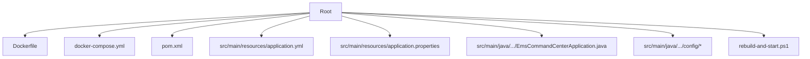
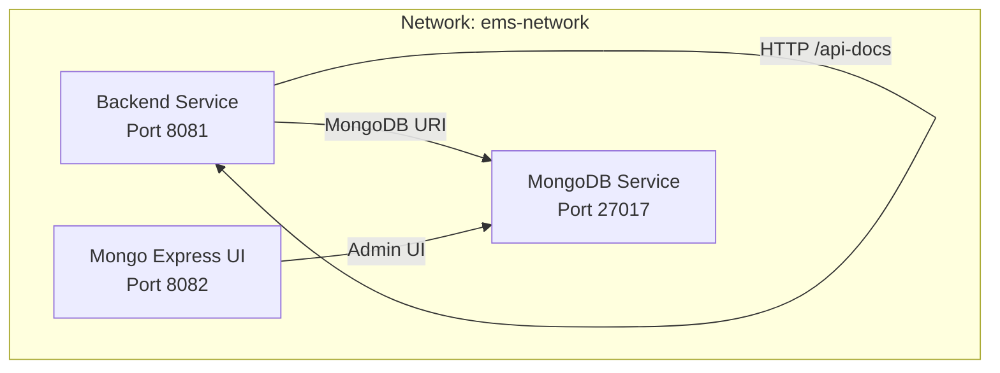
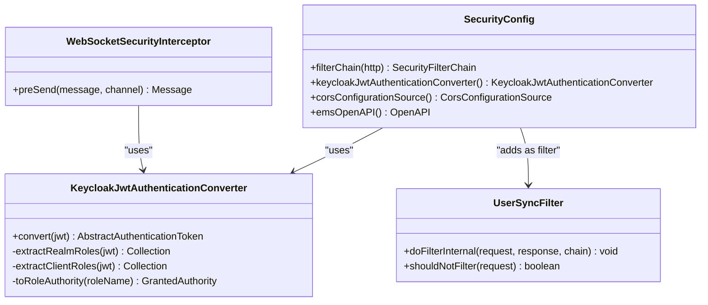
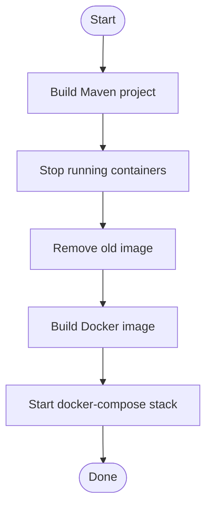
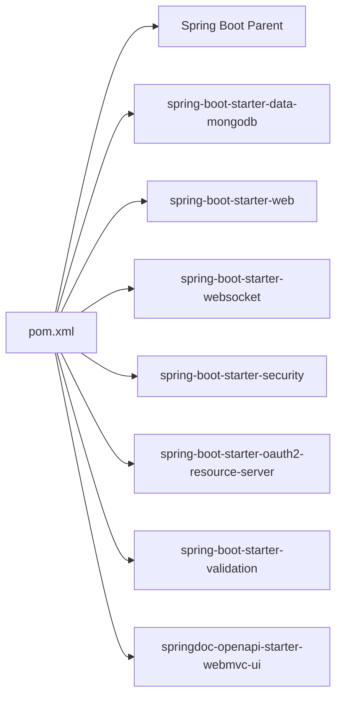

# Deployment and Operations

<cite>
**Referenced Files in This Document**
- [Dockerfile](file://Dockerfile)
- [docker-compose.yml](file://docker-compose.yml)
- [pom.xml](file://pom.xml)
- [application.yml](file://src/main/resources/application.yml)
- [application.properties](file://src/main/resources/application.properties)
- [EmsCommandCenterApplication.java](file://src/main/java/com/example/ems_command_center/EmsCommandCenterApplication.java)
- [SecurityConfig.java](file://src/main/java/com/example/ems_command_center/config/SecurityConfig.java)
- [KeycloakJwtAuthenticationConverter.java](file://src/main/java/com/example/ems_command_center/config/KeycloakJwtAuthenticationConverter.java)
- [WebSocketConfig.java](file://src/main/java/com/example/ems_command_center/config/WebSocketConfig.java)
- [WebSocketSecurityInterceptor.java](file://src/main/java/com/example/ems_command_center/config/WebSocketSecurityInterceptor.java)
- [UserSyncFilter.java](file://src/main/java/com/example/ems_command_center/config/UserSyncFilter.java)
- [rebuild-and-start.ps1](file://rebuild-and-start.ps1)
</cite>

## Table of Contents
1. [Introduction](#introduction)
2. [Project Structure](#project-structure)
3. [Core Components](#core-components)
4. [Architecture Overview](#architecture-overview)
5. [Detailed Component Analysis](#detailed-component-analysis)
6. [Dependency Analysis](#dependency-analysis)
7. [Performance Considerations](#performance-considerations)
8. [Troubleshooting Guide](#troubleshooting-guide)
9. [Conclusion](#conclusion)
10. [Appendices](#appendices)

## Introduction
This document provides comprehensive deployment and operations guidance for the EMS Command Center backend application. It covers containerization with Docker, multi-container orchestration via docker-compose, production-ready configuration patterns, environment-specific application properties, MongoDB connectivity, Keycloak integration, monitoring and logging, health checks, performance tuning, backup and recovery, disaster recovery, scaling considerations, deployment automation, CI/CD integration, and security hardening for production environments.

## Project Structure
The repository follows a standard Spring Boot layout with configuration under resources and Java source under src/main/java. Containerization artifacts include a Dockerfile and docker-compose.yml. A PowerShell script automates rebuild and startup for local development.

**Diagram sources**
- [Dockerfile](file://Dockerfile)
- [docker-compose.yml](file://docker-compose.yml)
- [pom.xml](file://pom.xml)
- [application.yml](file://src/main/resources/application.yml)
- [application.properties](file://src/main/resources/application.properties)
- [EmsCommandCenterApplication.java](file://src/main/java/com/example/ems_command_center/EmsCommandCenterApplication.java)
- [rebuild-and-start.ps1](file://rebuild-and-start.ps1)

**Section sources**
- [Dockerfile](file://Dockerfile)
- [docker-compose.yml](file://docker-compose.yml)
- [pom.xml](file://pom.xml)
- [application.yml](file://src/main/resources/application.yml)
- [application.properties](file://src/main/resources/application.properties)
- [EmsCommandCenterApplication.java](file://src/main/java/com/example/ems_command_center/EmsCommandCenterApplication.java)
- [rebuild-and-start.ps1](file://rebuild-and-start.ps1)

## Core Components
- Application entry point initializes the Spring Boot application.
- Configuration defines MongoDB connection URI, server port, OpenAPI/Swagger paths, logging levels, and Keycloak client settings.
- Security configuration enables OAuth2 Resource Server with JWT, CORS, and role-based access control.
- WebSocket configuration supports STOMP over SockJS and native WebSocket endpoints with per-message authorization.
- User synchronization filter integrates external identity claims into application user records.

**Section sources**
- [EmsCommandCenterApplication.java](file://src/main/java/com/example/ems_command_center/EmsCommandCenterApplication.java)
- [application.yml](file://src/main/resources/application.yml)
- [application.properties](file://src/main/resources/application.properties)
- [SecurityConfig.java](file://src/main/java/com/example/ems_command_center/config/SecurityConfig.java)
- [WebSocketConfig.java](file://src/main/java/com/example/ems_command_center/config/WebSocketConfig.java)
- [WebSocketSecurityInterceptor.java](file://src/main/java/com/example/ems_command_center/config/WebSocketSecurityInterceptor.java)
- [UserSyncFilter.java](file://src/main/java/com/example/ems_command_center/config/UserSyncFilter.java)

## Architecture Overview
The runtime architecture comprises three primary services orchestrated by docker-compose:
- MongoDB: persistent data store for application entities.
- Mongo Express: web-based MongoDB admin UI.
- Backend application: Spring Boot service exposing REST APIs, WebSockets, and OpenAPI documentation.

**Diagram sources**
- [docker-compose.yml](file://docker-compose.yml)
- [application.yml](file://src/main/resources/application.yml)

**Section sources**
- [docker-compose.yml](file://docker-compose.yml)
- [application.yml](file://src/main/resources/application.yml)

## Detailed Component Analysis

### Containerization with Docker
- Base image: Eclipse Temurin 21 JRE Alpine Linux for a minimal runtime footprint.
- Working directory: /app.
- Artifact copy: JAR file from target directory named app.jar.
- Exposed port: 8081.
- Entrypoint: java -jar app.jar.

Operational notes:
- Ensure the JAR artifact is present in target prior to building.
- For production, pin the base image tag to a specific digest for immutability.

**Section sources**
- [Dockerfile](file://Dockerfile)

### Multi-Container Orchestration with docker-compose
Services:
- MongoDB
  - Image: mongo:latest
  - Persistent volume: mongo_data mounted to /data/db
  - Health check: mongosh ping
  - Environment: initializes database name ems_db
- Mongo Express
  - Image: mongo-express:latest
  - Port mapping: 8082:8081
  - Credentials: basic auth username/password set
  - Depends on MongoDB health
- Backend Application
  - Image: ems-backend:dev built from Dockerfile
  - Port mapping: 8081:8081
  - Environment variables:
    - SPRING_DATA_MONGODB_URI: points to mongodb service
    - SERVER_PORT: 8081
    - KEYCLOAK_JWK_SET_URI: defaults to host.docker.internal for dev
    - KEYCLOAK_CLIENT_ID: defaults to ems-command-center-backend
  - Health check: wget against /api-docs endpoint
  - Depends on MongoDB health

Networking:
- Custom bridge network ems-network isolates services.

Volumes:
- Named volume mongo_data persists MongoDB data.

**Section sources**
- [docker-compose.yml](file://docker-compose.yml)

### Production Deployment Configurations
- Environment variables:
  - SPRING_DATA_MONGODB_URI: use a managed MongoDB connection string.
  - SERVER_PORT: expose via reverse proxy or ingress.
  - KEYCLOAK_JWK_SET_URI: point to production Keycloak.
  - KEYCLOAK_CLIENT_ID: match configured client.
  - KEYCLOAK_PRINCIPAL_CLAIM: align with claim used for user identity.
- Logging:
  - Adjust logging levels in application.yml for production (e.g., INFO for application packages).
- OpenAPI:
  - Keep /api-docs and Swagger UI enabled for operational visibility; restrict access via reverse proxy or middleware in production.

**Section sources**
- [application.yml](file://src/main/resources/application.yml)
- [docker-compose.yml](file://docker-compose.yml)

### Environment-Specific Application Properties
- MongoDB URI resolution:
  - Default fallback to localhost for development.
  - Override via SPRING_DATA_MONGODB_URI in production.
- Server port:
  - Default 8081; override via SERVER_PORT.
- Keycloak settings:
  - JWK set URI and client ID default to development values; override for production.
  - Principal claim configurable via KEYCLOAK_PRINCIPAL_CLAIM.

**Section sources**
- [application.yml](file://src/main/resources/application.yml)
- [application.properties](file://src/main/resources/application.properties)

### Database Connection Management
- Spring Data MongoDB configuration reads the URI from environment variable.
- Health checks rely on MongoDB availability; ensure firewall rules permit internal container communication.

**Section sources**
- [application.yml](file://src/main/resources/application.yml)
- [docker-compose.yml](file://docker-compose.yml)

### Keycloak Integration Settings
- OAuth2 Resource Server with JWT:
  - JWK Set URI loaded from KEYCLOAK_JWK_SET_URI.
  - Client ID loaded from KEYCLOAK_CLIENT_ID.
  - Principal claim name loaded from KEYCLOAK_PRINCIPAL_CLAIM.
- JWT conversion:
  - Realm roles and client-specific roles extracted and mapped to ROLE_* authorities.
- CORS:
  - Allowed origins configured for local frontend ports.
- OpenAPI security scheme:
  - Bearer JWT scheme defined for Swagger UI.

**Diagram sources**
- [SecurityConfig.java](file://src/main/java/com/example/ems_command_center/config/SecurityConfig.java)
- [KeycloakJwtAuthenticationConverter.java](file://src/main/java/com/example/ems_command_center/config/KeycloakJwtAuthenticationConverter.java)
- [WebSocketSecurityInterceptor.java](file://src/main/java/com/example/ems_command_center/config/WebSocketSecurityInterceptor.java)
- [UserSyncFilter.java](file://src/main/java/com/example/ems_command_center/config/UserSyncFilter.java)

**Section sources**
- [SecurityConfig.java](file://src/main/java/com/example/ems_command_center/config/SecurityConfig.java)
- [KeycloakJwtAuthenticationConverter.java](file://src/main/java/com/example/ems_command_center/config/KeycloakJwtAuthenticationConverter.java)
- [WebSocketSecurityInterceptor.java](file://src/main/java/com/example/ems_command_center/config/WebSocketSecurityInterceptor.java)
- [UserSyncFilter.java](file://src/main/java/com/example/ems_command_center/config/UserSyncFilter.java)
- [application.yml](file://src/main/resources/application.yml)

### Monitoring and Logging Strategies
- Health checks:
  - MongoDB: mongosh ping health check.
  - Backend: HTTP GET /api-docs health check.
- Logging:
  - Configure log levels in application.yml; avoid DEBUG in production.
  - Forward logs to centralized logging systems (e.g., ELK, Loki) in production.
- Metrics:
  - Consider adding Spring Boot Actuator for health, metrics, and info endpoints behind strict access controls.

**Section sources**
- [docker-compose.yml](file://docker-compose.yml)
- [application.yml](file://src/main/resources/application.yml)

### Health Check Endpoints
- Backend health check probes /api-docs via HTTP.
- MongoDB health check uses mongosh ping.

**Section sources**
- [docker-compose.yml](file://docker-compose.yml)

### Performance Optimization Techniques
- JVM sizing:
  - Set JAVA_OPTS or JVM memory parameters in production deployments.
- Image optimization:
  - Use multi-stage builds to reduce final image size.
- Dependencies:
  - Keep dependencies aligned with Spring Boot 3.x LTS support.
- Network:
  - Place services behind a reverse proxy or ingress to offload TLS and manage timeouts.

**Section sources**
- [pom.xml](file://pom.xml)
- [Dockerfile](file://Dockerfile)

### Backup and Recovery Procedures
- MongoDB backups:
  - Use mongodump/mongorestore or cloud provider snapshot tools.
  - Automate backups via cron jobs or scheduled tasks; retain rotation policies.
- Volume persistence:
  - Confirm mongo_data volume is backed up regularly.
- Recovery:
  - Restore from latest backup and replay oplogs if applicable.
  - Validate application connectivity post-restore.

[No sources needed since this section provides general guidance]

### Disaster Recovery Planning
- Multi-region replication for MongoDB.
- Immutable container images with digest pinning.
- Automated failover for Keycloak and MongoDB.
- Runbook documentation for restoring services and validating data integrity.

[No sources needed since this section provides general guidance]

### Scaling Considerations
- Horizontal scaling:
  - Stateless backend allows multiple replicas behind a load balancer.
  - Ensure shared state (e.g., sessions) is externalized or disabled.
- Vertical scaling:
  - Increase CPU/RAM limits for backend and database.
- Database scaling:
  - Sharding and replica sets for MongoDB in production.
- Caching:
  - Introduce Redis for rate limiting and caching hotspots.

[No sources needed since this section provides general guidance]

### Deployment Automation Scripts
- Local rebuild and start:
  - Builds Maven project, stops existing containers, rebuilds Docker image, starts stack, and prints service URLs.

**Diagram sources**
- [rebuild-and-start.ps1](file://rebuild-and-start.ps1)

**Section sources**
- [rebuild-and-start.ps1](file://rebuild-and-start.ps1)

### CI/CD Pipeline Integration
- Build:
  - Use Maven wrapper to compile and package the application.
- Test:
  - Optionally run tests in CI; consider skipping in release pipelines.
- Package:
  - Build Docker image with a stable tag.
- Deploy:
  - Push image to registry; deploy via docker-compose, Helm, or platform-native tooling.
- Rollback:
  - Maintain tagged images for quick rollback.

[No sources needed since this section provides general guidance]

### Environment Management Best Practices
- Separation of environments:
  - Use distinct docker-compose files or profiles for dev, staging, prod.
- Secrets:
  - Store sensitive values (e.g., Keycloak credentials) in secure secret managers.
- Configuration drift:
  - Version-control configuration files; enforce change approval workflows.

[No sources needed since this section provides general guidance]

### Security Considerations for Production
- Network:
  - Restrict inbound ports; allow only necessary ports (e.g., 8081 for backend, 8082 for GUI in dev).
  - Use private networks and disable exposed ports in production.
- Access control:
  - Enforce role-based access control via Keycloak roles.
  - Lock down Swagger/OpenAPI exposure; require authentication and authorization.
- Transport:
  - Terminate TLS at a reverse proxy or ingress; disable insecure HTTP in production.
- Auditing:
  - Enable audit logging for authentication and authorization events.

**Section sources**
- [SecurityConfig.java](file://src/main/java/com/example/ems_command_center/config/SecurityConfig.java)
- [WebSocketSecurityInterceptor.java](file://src/main/java/com/example/ems_command_center/config/WebSocketSecurityInterceptor.java)
- [application.yml](file://src/main/resources/application.yml)

## Dependency Analysis
External dependencies include Spring Boot starters for MongoDB, Web, Security, OAuth2 Resource Server, Validation, and OpenAPI/Swagger UI. These define the application’s runtime capabilities and integrations.

**Diagram sources**
- [pom.xml](file://pom.xml)

**Section sources**
- [pom.xml](file://pom.xml)

## Performance Considerations
- JVM tuning:
  - Set heap size and GC options appropriate for workload.
- Container sizing:
  - Allocate adequate CPU and memory reservations.
- Database:
  - Use connection pooling and tune indexes; monitor slow queries.
- Caching:
  - Cache read-heavy resources and user metadata to reduce database load.

[No sources needed since this section provides general guidance]

## Troubleshooting Guide
- Application does not start:
  - Verify MongoDB connectivity via health check and URI configuration.
  - Check backend health probe against /api-docs.
- Authentication failures:
  - Confirm KEYCLOAK_JWK_SET_URI and client ID match Keycloak configuration.
  - Ensure principal claim matches the expected field.
- WebSocket authorization errors:
  - Validate JWT presence and validity in Authorization header.
  - Confirm user roles and access control rules for targeted topics.
- Logs:
  - Increase log verbosity temporarily for diagnostics; revert to INFO/ERROR in production.

**Section sources**
- [docker-compose.yml](file://docker-compose.yml)
- [application.yml](file://src/main/resources/application.yml)
- [SecurityConfig.java](file://src/main/java/com/example/ems_command_center/config/SecurityConfig.java)
- [WebSocketSecurityInterceptor.java](file://src/main/java/com/example/ems_command_center/config/WebSocketSecurityInterceptor.java)

## Conclusion
The EMS Command Center backend is designed for container-first deployment with clear separation of concerns for database, API, and admin UI. By leveraging docker-compose, environment-driven configuration, robust Keycloak integration, and health checks, teams can operate the system reliably in development and scale toward production with proper security, monitoring, and operational procedures.

## Appendices
- Ports and Services
  - Backend: 8081
  - MongoDB: 27017
  - Mongo Express: 8082
- Key Environment Variables
  - SPRING_DATA_MONGODB_URI
  - SERVER_PORT
  - KEYCLOAK_JWK_SET_URI
  - KEYCLOAK_CLIENT_ID
  - KEYCLOAK_PRINCIPAL_CLAIM

[No sources needed since this section provides general guidance]