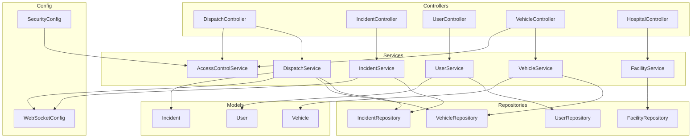
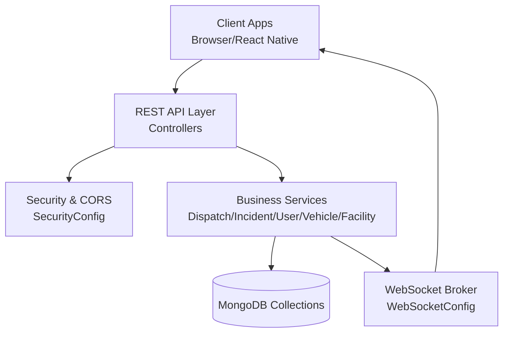
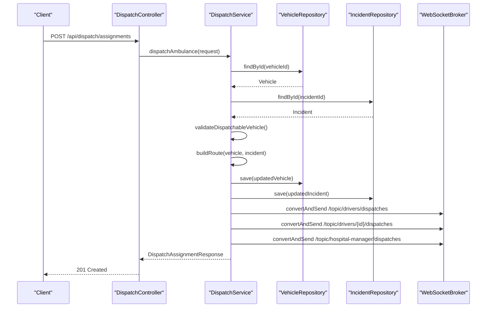
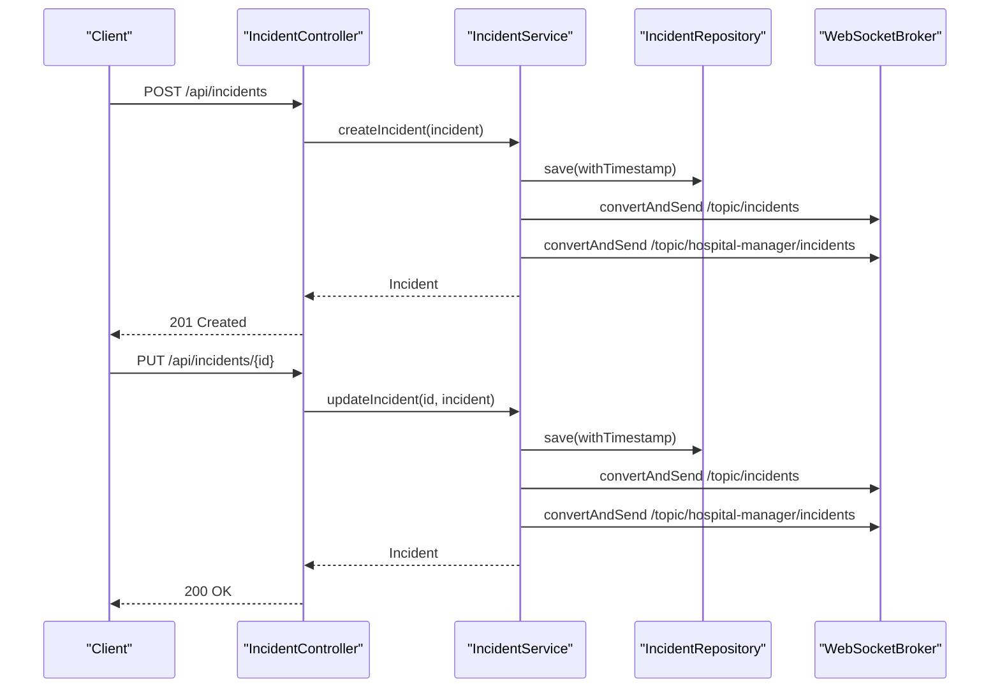
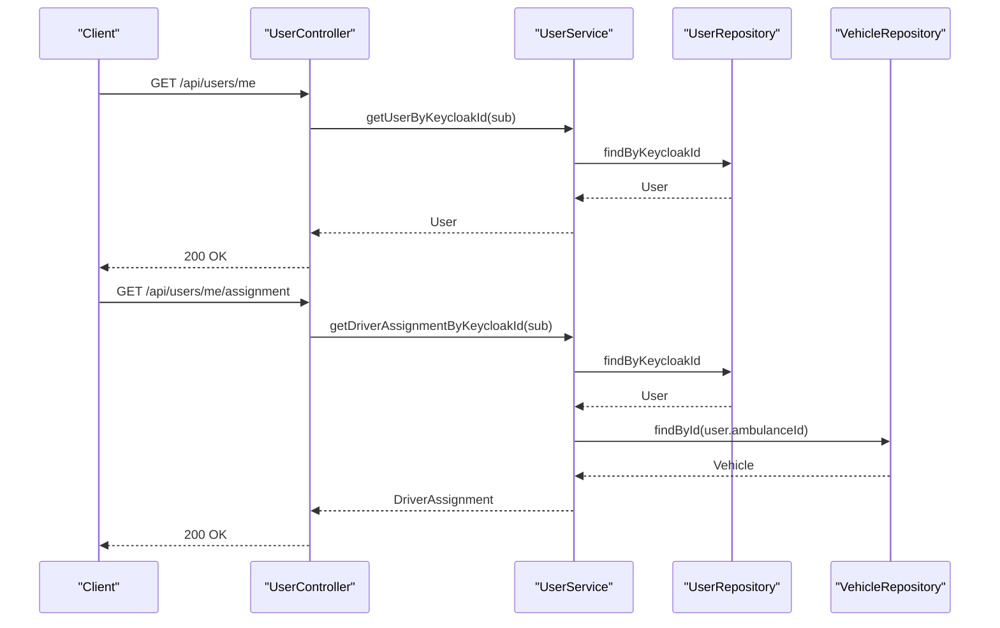
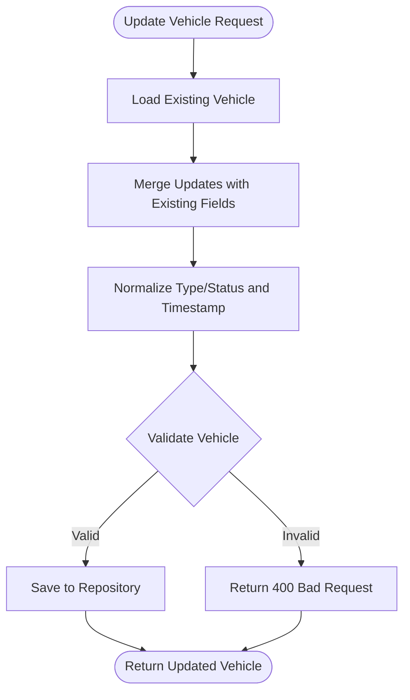
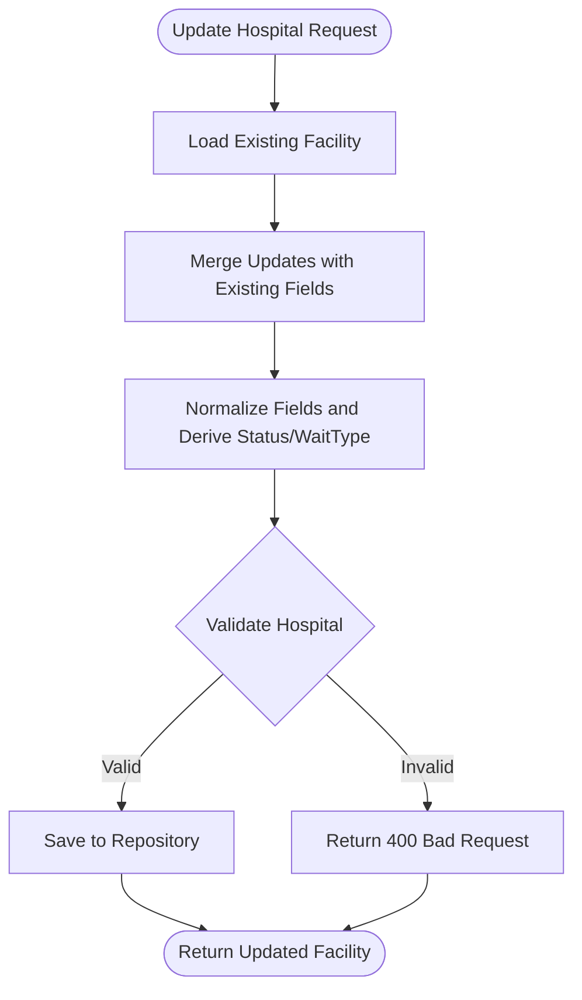
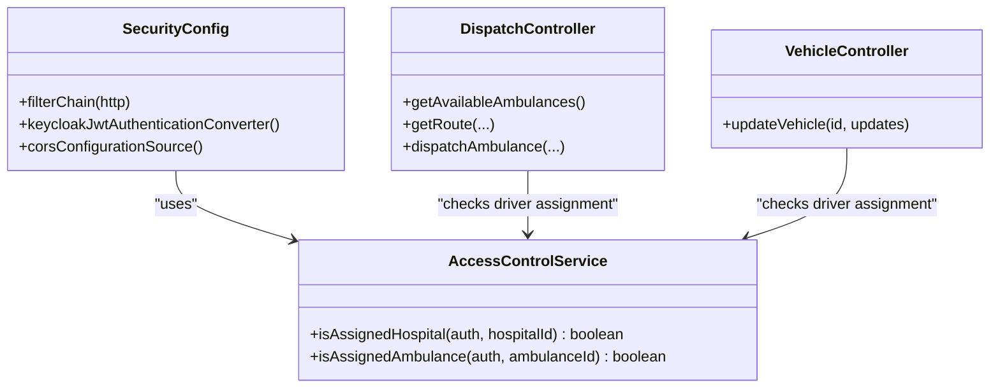
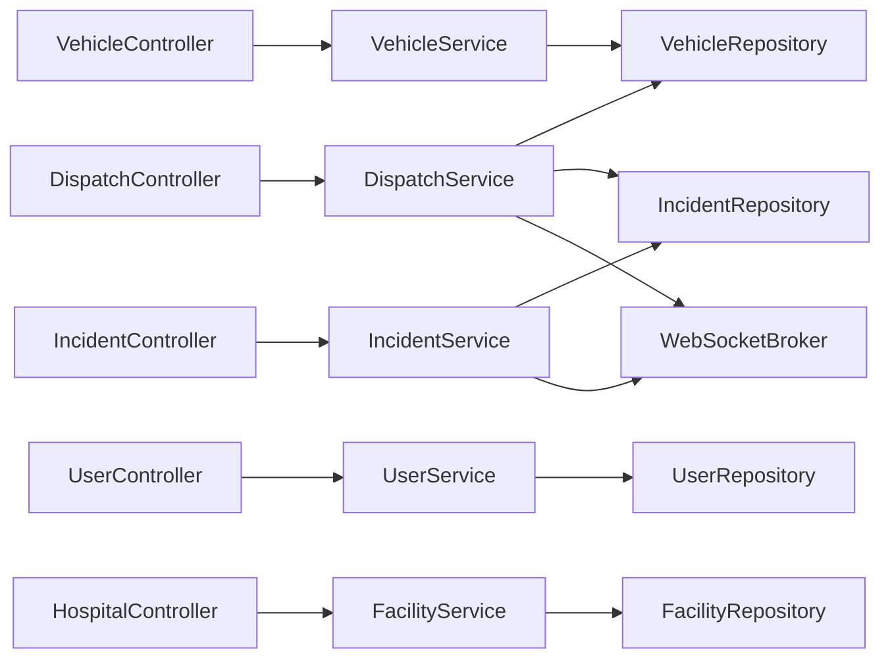

# Core Features Overview

<cite>
**Referenced Files in This Document**
- [EmsCommandCenterApplication.java](file://src/main/java/com/example/ems_command_center/EmsCommandCenterApplication.java)
- [SecurityConfig.java](file://src/main/java/com/example/ems_command_center/config/SecurityConfig.java)
- [WebSocketConfig.java](file://src/main/java/com/example/ems_command_center/config/WebSocketConfig.java)
- [AccessControlService.java](file://src/main/java/com/example/ems_command_center/service/AccessControlService.java)
- [User.java](file://src/main/java/com/example/ems_command_center/model/User.java)
- [Incident.java](file://src/main/java/com/example/ems_command_center/model/Incident.java)
- [Vehicle.java](file://src/main/java/com/example/ems_command_center/model/Vehicle.java)
- [DispatchController.java](file://src/main/java/com/example/ems_command_center/controller/DispatchController.java)
- [IncidentController.java](file://src/main/java/com/example/ems_command_center/controller/IncidentController.java)
- [UserController.java](file://src/main/java/com/example/ems_command_center/controller/UserController.java)
- [VehicleController.java](file://src/main/java/com/example/ems_command_center/controller/VehicleController.java)
- [HospitalController.java](file://src/main/java/com/example/ems_command_center/controller/HospitalController.java)
- [DispatchService.java](file://src/main/java/com/example/ems_command_center/service/DispatchService.java)
- [IncidentService.java](file://src/main/java/com/example/ems_command_center/service/IncidentService.java)
- [UserService.java](file://src/main/java/com/example/ems_command_center/service/UserService.java)
- [VehicleService.java](file://src/main/java/com/example/ems_command_center/service/VehicleService.java)
- [FacilityService.java](file://src/main/java/com/example/ems_command_center/service/FacilityService.java)
- [application.yml](file://src/main/resources/application.yml)
</cite>

## Table of Contents
1. [Introduction](#introduction)
2. [Project Structure](#project-structure)
3. [Core Components](#core-components)
4. [Architecture Overview](#architecture-overview)
5. [Detailed Component Analysis](#detailed-component-analysis)
6. [Dependency Analysis](#dependency-analysis)
7. [Performance Considerations](#performance-considerations)
8. [Troubleshooting Guide](#troubleshooting-guide)
9. [Conclusion](#conclusion)
10. [Appendices](#appendices)

## Introduction
This document provides a comprehensive overview of the core features of the EMS Command Center backend. It describes how dispatch management, incident tracking, user management, vehicle fleet management, hospital coordination, and analytics reporting work together to support emergency medical services operations. It also documents the multi-role access control system with ADMIN, MANAGER, DRIVER, and USER roles, explains feature interdependencies and data flows, and outlines real-time communication capabilities that enable coordinated emergency response.

## Project Structure
The backend is a Spring Boot application with layered architecture:
- Controllers expose REST endpoints under /api/* for each domain module.
- Services encapsulate business logic and coordinate repositories and messaging.
- Repositories persist domain models to MongoDB.
- Configuration defines security (OAuth2/JWT via Keycloak), CORS, and WebSocket message broker endpoints.
- Models define the core entities used across modules.

**Diagram sources**
- [DispatchController.java:1-57](file://src/main/java/com/example/ems_command_center/controller/DispatchController.java#L1-L57)
- [IncidentController.java:1-61](file://src/main/java/com/example/ems_command_center/controller/IncidentController.java#L1-L61)
- [UserController.java:1-92](file://src/main/java/com/example/ems_command_center/controller/UserController.java#L1-L92)
- [VehicleController.java:1-57](file://src/main/java/com/example/ems_command_center/controller/VehicleController.java#L1-L57)
- [HospitalController.java:1-57](file://src/main/java/com/example/ems_command_center/controller/HospitalController.java#L1-L57)
- [DispatchService.java:1-214](file://src/main/java/com/example/ems_command_center/service/DispatchService.java#L1-L214)
- [IncidentService.java:1-106](file://src/main/java/com/example/ems_command_center/service/IncidentService.java#L1-L106)
- [UserService.java:1-103](file://src/main/java/com/example/ems_command_center/service/UserService.java#L1-L103)
- [VehicleService.java:1-112](file://src/main/java/com/example/ems_command_center/service/VehicleService.java#L1-L112)
- [FacilityService.java:1-164](file://src/main/java/com/example/ems_command_center/service/FacilityService.java#L1-L164)
- [AccessControlService.java:1-38](file://src/main/java/com/example/ems_command_center/service/AccessControlService.java#L1-L38)
- [SecurityConfig.java:1-156](file://src/main/java/com/example/ems_command_center/config/SecurityConfig.java#L1-L156)
- [WebSocketConfig.java:1-51](file://src/main/java/com/example/ems_command_center/config/WebSocketConfig.java#L1-L51)
- [User.java:1-188](file://src/main/java/com/example/ems_command_center/model/User.java#L1-L188)
- [Incident.java:1-24](file://src/main/java/com/example/ems_command_center/model/Incident.java#L1-L24)
- [Vehicle.java:1-19](file://src/main/java/com/example/ems_command_center/model/Vehicle.java#L1-L19)

**Section sources**
- [EmsCommandCenterApplication.java:1-14](file://src/main/java/com/example/ems_command_center/EmsCommandCenterApplication.java#L1-L14)
- [application.yml:1-36](file://src/main/resources/application.yml#L1-L36)

## Core Components
This section summarizes the major functional areas and their responsibilities:

- Dispatch Management
  - Provides ambulance availability listing, route preview, and dispatch assignment.
  - Updates vehicle status and incident tags upon dispatch.
  - Publishes real-time notifications to drivers and hospital managers.

- Incident Tracking
  - Manages creation, retrieval, updates, and deletion of incidents.
  - Maintains priority ordering and timestamps.
  - Publishes incident lifecycle events to subscribers.

- User Management
  - Supports listing users by role, CRUD operations for administrators.
  - Exposes current user profile and driver assignment details.
  - Links Keycloak identities to internal user records.

- Vehicle Fleet Management
  - Registers and updates vehicles with strict validation for type, status, and location.
  - Enforces business rules (e.g., busy ambulances require crew).
  - Supports counting by status and total fleet metrics.

- Hospital Coordination
  - Manages hospital facilities with occupancy, ICU capacity, wait times, and status derivation.
  - Provides endpoints to create, update, and remove hospitals.
  - Normalizes facility metadata and derives availability/wait indicators.

- Real-Time Communication
  - WebSocket endpoints for live updates to drivers, dispatch center, and hospital managers.
  - STOMP/SockJS endpoints configured with CORS origins and security interceptors.

**Section sources**
- [DispatchController.java:1-57](file://src/main/java/com/example/ems_command_center/controller/DispatchController.java#L1-L57)
- [IncidentController.java:1-61](file://src/main/java/com/example/ems_command_center/controller/IncidentController.java#L1-L61)
- [UserController.java:1-92](file://src/main/java/com/example/ems_command_center/controller/UserController.java#L1-L92)
- [VehicleController.java:1-57](file://src/main/java/com/example/ems_command_center/controller/VehicleController.java#L1-L57)
- [HospitalController.java:1-57](file://src/main/java/com/example/ems_command_center/controller/HospitalController.java#L1-L57)
- [DispatchService.java:1-214](file://src/main/java/com/example/ems_command_center/service/DispatchService.java#L1-L214)
- [IncidentService.java:1-106](file://src/main/java/com/example/ems_command_center/service/IncidentService.java#L1-L106)
- [UserService.java:1-103](file://src/main/java/com/example/ems_command_center/service/UserService.java#L1-L103)
- [VehicleService.java:1-112](file://src/main/java/com/example/ems_command_center/service/VehicleService.java#L1-L112)
- [FacilityService.java:1-164](file://src/main/java/com/example/ems_command_center/service/FacilityService.java#L1-L164)
- [WebSocketConfig.java:1-51](file://src/main/java/com/example/ems_command_center/config/WebSocketConfig.java#L1-L51)

## Architecture Overview
The system integrates REST APIs with a WebSocket message broker for real-time updates. Security is enforced via OAuth2/JWT using Keycloak, with role-based access control applied at the endpoint level. Controllers delegate to services, which interact with repositories and publish messages to subscribed clients.

**Diagram sources**
- [SecurityConfig.java:44-98](file://src/main/java/com/example/ems_command_center/config/SecurityConfig.java#L44-L98)
- [WebSocketConfig.java:20-49](file://src/main/java/com/example/ems_command_center/config/WebSocketConfig.java#L20-L49)
- [DispatchService.java:205-212](file://src/main/java/com/example/ems_command_center/service/DispatchService.java#L205-L212)
- [IncidentService.java:88-104](file://src/main/java/com/example/ems_command_center/service/IncidentService.java#L88-L104)

## Detailed Component Analysis

### Dispatch Management
Dispatch management orchestrates ambulance assignments and route planning. It validates vehicles, computes routes, updates statuses, and publishes notifications.

**Diagram sources**
- [DispatchController.java:50-55](file://src/main/java/com/example/ems_command_center/controller/DispatchController.java#L50-L55)
- [DispatchService.java:53-119](file://src/main/java/com/example/ems_command_center/service/DispatchService.java#L53-L119)
- [WebSocketConfig.java:21-24](file://src/main/java/com/example/ems_command_center/config/WebSocketConfig.java#L21-L24)

**Section sources**
- [DispatchController.java:33-55](file://src/main/java/com/example/ems_command_center/controller/DispatchController.java#L33-L55)
- [DispatchService.java:40-119](file://src/main/java/com/example/ems_command_center/service/DispatchService.java#L40-L119)

### Incident Tracking
Incident tracking manages the lifecycle of emergency incidents, including creation, updates, deletions, and real-time event broadcasting.

**Diagram sources**
- [IncidentController.java:39-51](file://src/main/java/com/example/ems_command_center/controller/IncidentController.java#L39-L51)
- [IncidentService.java:35-59](file://src/main/java/com/example/ems_command_center/service/IncidentService.java#L35-L59)
- [WebSocketConfig.java:21-24](file://src/main/java/com/example/ems_command_center/config/WebSocketConfig.java#L21-L24)

**Section sources**
- [IncidentController.java:25-59](file://src/main/java/com/example/ems_command_center/controller/IncidentController.java#L25-L59)
- [IncidentService.java:26-104](file://src/main/java/com/example/ems_command_center/service/IncidentService.java#L26-L104)

### User Management
User management supports administrative operations and self-service profile access. It also resolves driver assignments and enforces role checks.

**Diagram sources**
- [UserController.java:72-90](file://src/main/java/com/example/ems_command_center/controller/UserController.java#L72-L90)
- [UserService.java:71-101](file://src/main/java/com/example/ems_command_center/service/UserService.java#L71-L101)

**Section sources**
- [UserController.java:28-90](file://src/main/java/com/example/ems_command_center/controller/UserController.java#L28-L90)
- [UserService.java:23-101](file://src/main/java/com/example/ems_command_center/service/UserService.java#L23-L101)
- [User.java:1-188](file://src/main/java/com/example/ems_command_center/model/User.java#L1-L188)

### Vehicle Fleet Management
Vehicle fleet management enforces strict validation for type, status, and location, and normalizes updates with timestamps.

**Diagram sources**
- [VehicleController.java:39-46](file://src/main/java/com/example/ems_command_center/controller/VehicleController.java#L39-L46)
- [VehicleService.java:37-52](file://src/main/java/com/example/ems_command_center/service/VehicleService.java#L37-L52)
- [VehicleService.java:70-87](file://src/main/java/com/example/ems_command_center/service/VehicleService.java#L70-L87)

**Section sources**
- [VehicleController.java:25-55](file://src/main/java/com/example/ems_command_center/controller/VehicleController.java#L25-L55)
- [VehicleService.java:28-111](file://src/main/java/com/example/ems_command_center/service/VehicleService.java#L28-L111)

### Hospital Coordination
Hospital coordination manages facility data, occupancy, ICU metrics, and derived status and wait types.

**Diagram sources**
- [HospitalController.java:39-46](file://src/main/java/com/example/ems_command_center/controller/HospitalController.java#L39-L46)
- [FacilityService.java:38-60](file://src/main/java/com/example/ems_command_center/service/FacilityService.java#L38-L60)
- [FacilityService.java:111-134](file://src/main/java/com/example/ems_command_center/service/FacilityService.java#L111-L134)

**Section sources**
- [HospitalController.java:25-55](file://src/main/java/com/example/ems_command_center/controller/HospitalController.java#L25-L55)
- [FacilityService.java:25-163](file://src/main/java/com/example/ems_command_center/service/FacilityService.java#L25-L163)

### Multi-Role Access Control
The system uses OAuth2/JWT with Keycloak and method-level security to enforce role-based access across endpoints. Roles include ADMIN, MANAGER, DRIVER, and USER. Some endpoints apply fine-grained checks using claims from the JWT (e.g., ambulance or hospital assignment).

**Diagram sources**
- [SecurityConfig.java:44-98](file://src/main/java/com/example/ems_command_center/config/SecurityConfig.java#L44-L98)
- [AccessControlService.java:1-38](file://src/main/java/com/example/ems_command_center/service/AccessControlService.java#L1-L38)
- [DispatchController.java:40-48](file://src/main/java/com/example/ems_command_center/controller/DispatchController.java#L40-L48)
- [VehicleController.java:39-46](file://src/main/java/com/example/ems_command_center/controller/VehicleController.java#L39-L46)

**Section sources**
- [SecurityConfig.java:52-92](file://src/main/java/com/example/ems_command_center/config/SecurityConfig.java#L52-L92)
- [AccessControlService.java:10-36](file://src/main/java/com/example/ems_command_center/service/AccessControlService.java#L10-L36)
- [User.java:21-28](file://src/main/java/com/example/ems_command_center/model/User.java#L21-L28)

## Dependency Analysis
The following diagram highlights key dependencies among controllers, services, and repositories, along with the WebSocket messaging dependency.

**Diagram sources**
- [DispatchController.java:27-31](file://src/main/java/com/example/ems_command_center/controller/DispatchController.java#L27-L31)
- [IncidentController.java:19-23](file://src/main/java/com/example/ems_command_center/controller/IncidentController.java#L19-L23)
- [UserController.java:22-26](file://src/main/java/com/example/ems_command_center/controller/UserController.java#L22-L26)
- [VehicleController.java:19-23](file://src/main/java/com/example/ems_command_center/controller/VehicleController.java#L19-L23)
- [HospitalController.java:19-23](file://src/main/java/com/example/ems_command_center/controller/HospitalController.java#L19-L23)
- [DispatchService.java:26-38](file://src/main/java/com/example/ems_command_center/service/DispatchService.java#L26-L38)
- [IncidentService.java:18-24](file://src/main/java/com/example/ems_command_center/service/IncidentService.java#L18-L24)
- [UserService.java:15-21](file://src/main/java/com/example/ems_command_center/service/UserService.java#L15-L21)
- [VehicleService.java:22-26](file://src/main/java/com/example/ems_command_center/service/VehicleService.java#L22-L26)
- [FacilityService.java:19-23](file://src/main/java/com/example/ems_command_center/service/FacilityService.java#L19-L23)

**Section sources**
- [DispatchService.java:1-214](file://src/main/java/com/example/ems_command_center/service/DispatchService.java#L1-L214)
- [IncidentService.java:1-106](file://src/main/java/com/example/ems_command_center/service/IncidentService.java#L1-L106)
- [UserService.java:1-103](file://src/main/java/com/example/ems_command_center/service/UserService.java#L1-L103)
- [VehicleService.java:1-112](file://src/main/java/com/example/ems_command_center/service/VehicleService.java#L1-L112)
- [FacilityService.java:1-164](file://src/main/java/com/example/ems_command_center/service/FacilityService.java#L1-L164)

## Performance Considerations
- Endpoint-level filtering and role checks minimize unnecessary processing for unauthorized requests.
- Validation and normalization occur close to input boundaries to fail fast and reduce downstream errors.
- WebSocket publishing is selective and scoped to relevant topics to avoid broadcast overhead.
- Repository queries are straightforward and rely on MongoDB indexing on fields like email, keycloakId, and others as defined in models.

[No sources needed since this section provides general guidance]

## Troubleshooting Guide
Common issues and resolutions:
- Authentication failures: Ensure a valid Keycloak access token is provided; unauthorized responses indicate missing or invalid tokens.
- Authorization failures: Verify the user’s Keycloak role matches the endpoint requirement; forbidden responses indicate insufficient privileges.
- Resource not found: Many endpoints return 404 when referenced entities (vehicle, incident, user) are missing.
- Validation errors: Vehicle and hospital endpoints enforce strict validation; incorrect types, statuses, or occupancy ranges will cause 400 responses.
- WebSocket connectivity: Confirm allowed origins and endpoint registration; clients should connect to /ws or /ws-native depending on transport.

**Section sources**
- [SecurityConfig.java:138-154](file://src/main/java/com/example/ems_command_center/config/SecurityConfig.java#L138-L154)
- [VehicleService.java:70-87](file://src/main/java/com/example/ems_command_center/service/VehicleService.java#L70-L87)
- [FacilityService.java:77-109](file://src/main/java/com/example/ems_command_center/service/FacilityService.java#L77-L109)

## Conclusion
The EMS Command Center backend provides a cohesive foundation for emergency operations through integrated dispatch, incident, user, fleet, and hospital coordination modules. Role-based access control ensures appropriate permissions, while real-time communication enables responsive collaboration across dispatchers, drivers, and hospital managers. The modular design and explicit data flows support maintainability and scalability for emergency medical services workflows.

[No sources needed since this section summarizes without analyzing specific files]

## Appendices

### Feature Interdependencies and Data Flows
- Dispatch depends on Vehicle and Incident data; upon dispatch, both vehicle status and incident tags are updated, and notifications are published.
- Incident updates trigger broadcasts to general and hospital-manager topics, enabling real-time awareness.
- User management supports driver assignment resolution and profile access, with role checks and JWT-based identity mapping.
- Vehicle and hospital endpoints enforce domain-specific validations to maintain data integrity.
- WebSocket endpoints deliver targeted updates to ADMIN, DRIVER, and MANAGER subscribers.

**Section sources**
- [DispatchService.java:205-212](file://src/main/java/com/example/ems_command_center/service/DispatchService.java#L205-L212)
- [IncidentService.java:88-104](file://src/main/java/com/example/ems_command_center/service/IncidentService.java#L88-L104)
- [UserService.java:71-101](file://src/main/java/com/example/ems_command_center/service/UserService.java#L71-L101)
- [VehicleService.java:70-87](file://src/main/java/com/example/ems_command_center/service/VehicleService.java#L70-L87)
- [FacilityService.java:111-134](file://src/main/java/com/example/ems_command_center/service/FacilityService.java#L111-L134)

### Real-Time Communication Capabilities
- WebSocket endpoints: /ws-native and /ws with SockJS.
- Message broker destinations:
  - General dispatches: /topic/drivers/dispatches
  - Driver-specific dispatches: /topic/drivers/{id}/dispatches
  - Hospital manager dispatches: /topic/hospital-manager/dispatches
  - General incidents: /topic/incidents
  - Hospital manager incidents: /topic/hospital-manager/incidents

**Section sources**
- [WebSocketConfig.java:21-49](file://src/main/java/com/example/ems_command_center/config/WebSocketConfig.java#L21-L49)
- [DispatchService.java:205-212](file://src/main/java/com/example/ems_command_center/service/DispatchService.java#L205-L212)
- [IncidentService.java:88-104](file://src/main/java/com/example/ems_command_center/service/IncidentService.java#L88-L104)

### Use Case Scenarios

- Dispatch an Ambulance to an Urgent Incident
  - Steps: Retrieve available ambulances → Preview route → Dispatch → Update vehicle and incident → Publish notifications.
  - Actors: Dispatcher (ADMIN/MANAGER), Driver (DRIVER), Hospital Manager (MANAGER).
  - Outcomes: Vehicle marked busy, incident tagged with dispatch info, real-time alerts delivered.

- Report and Update an Incident
  - Steps: Submit incident report → Retrieve incidents ordered by priority → Update incident details → Publish updates.
  - Actors: Reporter (USER/DRIVER), Dispatcher (ADMIN/MANAGER), Hospital Manager (MANAGER).
  - Outcomes: Incident stored with timestamp and priority, subscribers notified.

- Manage Drivers and Assignments
  - Steps: Fetch current user profile → Retrieve driver assignment (profile + assigned vehicle) → Update vehicle status if applicable.
  - Actors: Driver (DRIVER), Administrator (ADMIN).
  - Outcomes: Accurate driver-to-vehicle linkage and role-scoped access.

- Register and Monitor Vehicles
  - Steps: Create vehicle with type/status/location → Update vehicle → Validate constraints → Count by status.
  - Actors: Administrator (ADMIN), Manager (MANAGER), Driver (DRIVER).
  - Outcomes: Consistent fleet data and operational visibility.

- Coordinate with Hospitals
  - Steps: Add/update hospital → Derive status and wait type → Monitor occupancy and ICU metrics.
  - Actors: Administrator (ADMIN), Manager (MANAGER).
  - Outcomes: Real-time hospital capacity insights for incident triage.

**Section sources**
- [DispatchController.java:33-55](file://src/main/java/com/example/ems_command_center/controller/DispatchController.java#L33-L55)
- [IncidentController.java:25-59](file://src/main/java/com/example/ems_command_center/controller/IncidentController.java#L25-L59)
- [UserController.java:72-90](file://src/main/java/com/example/ems_command_center/controller/UserController.java#L72-L90)
- [VehicleController.java:25-55](file://src/main/java/com/example/ems_command_center/controller/VehicleController.java#L25-L55)
- [HospitalController.java:25-55](file://src/main/java/com/example/ems_command_center/controller/HospitalController.java#L25-L55)
- [DispatchService.java:40-119](file://src/main/java/com/example/ems_command_center/service/DispatchService.java#L40-L119)
- [IncidentService.java:26-104](file://src/main/java/com/example/ems_command_center/service/IncidentService.java#L26-L104)
- [UserService.java:71-101](file://src/main/java/com/example/ems_command_center/service/UserService.java#L71-L101)
- [VehicleService.java:28-111](file://src/main/java/com/example/ems_command_center/service/VehicleService.java#L28-L111)
- [FacilityService.java:25-163](file://src/main/java/com/example/ems_command_center/service/FacilityService.java#L25-L163)