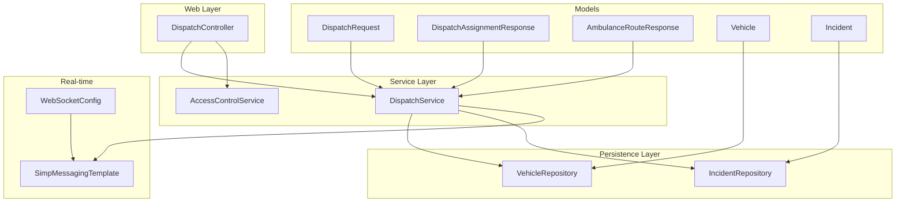
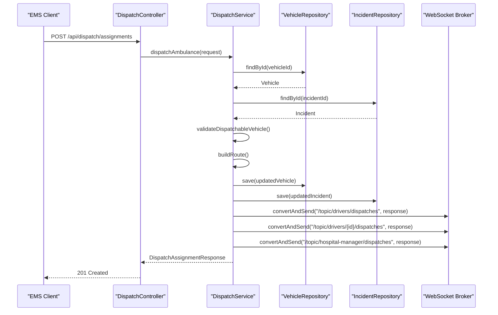
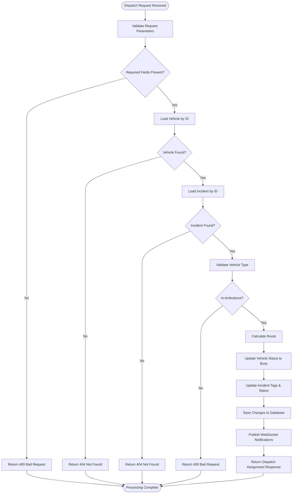
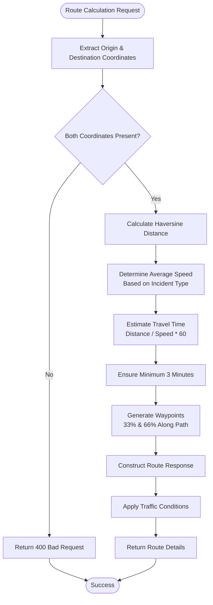
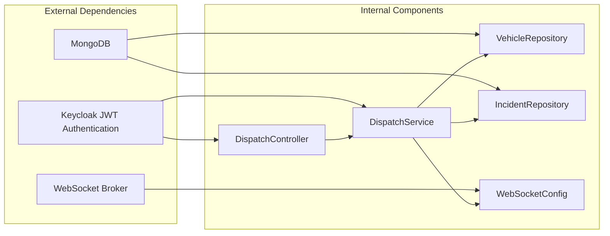
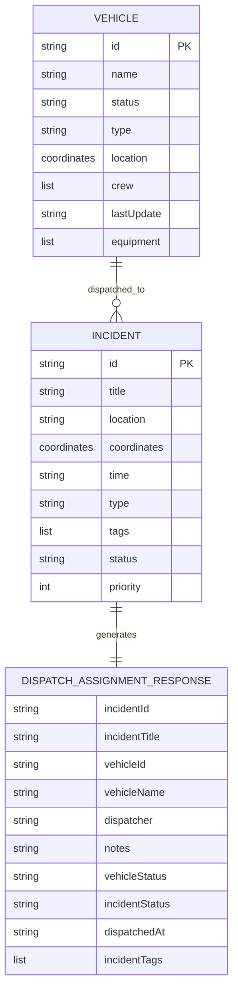

# Dispatch Management

<cite>
**Referenced Files in This Document**
- [DispatchController.java](file://src/main/java/com/example/ems_command_center/controller/DispatchController.java)
- [DispatchService.java](file://src/main/java/com/example/ems_command_center/service/DispatchService.java)
- [DispatchRequest.java](file://src/main/java/com/example/ems_command_center/model/DispatchRequest.java)
- [DispatchAssignmentResponse.java](file://src/main/java/com/example/ems_command_center/model/DispatchAssignmentResponse.java)
- [AmbulanceRouteResponse.java](file://src/main/java/com/example/ems_command_center/model/AmbulanceRouteResponse.java)
- [Vehicle.java](file://src/main/java/com/example/ems_command_center/model/Vehicle.java)
- [Incident.java](file://src/main/java/com/example/ems_command_center/model/Incident.java)
- [VehicleRepository.java](file://src/main/java/com/example/ems_command_center/repository/VehicleRepository.java)
- [IncidentRepository.java](file://src/main/java/com/example/ems_command_center/repository/IncidentRepository.java)
- [WebSocketConfig.java](file://src/main/java/com/example/ems_command_center/config/WebSocketConfig.java)
- [ApiExceptionHandler.java](file://src/main/java/com/example/ems_command_center/config/ApiExceptionHandler.java)
- [AccessControlService.java](file://src/main/java/com/example/ems_command_center/service/AccessControlService.java)
- [application.yml](file://src/main/resources/application.yml)
</cite>

## Table of Contents
1. [Introduction](#introduction)
2. [Project Structure](#project-structure)
3. [Core Components](#core-components)
4. [Architecture Overview](#architecture-overview)
5. [Detailed Component Analysis](#detailed-component-analysis)
6. [Dependency Analysis](#dependency-analysis)
7. [Performance Considerations](#performance-considerations)
8. [Troubleshooting Guide](#troubleshooting-guide)
9. [Conclusion](#conclusion)
10. [Appendices](#appendices)

## Introduction
This document provides comprehensive dispatch management documentation for the EMS Command Center. It details the ambulance dispatch system including automatic assignment algorithms, real-time driver notifications, and route calculation capabilities. The document explains the dispatch request processing workflow, driver assignment logic, and status tracking mechanisms. It also covers the integration with WebSocket real-time communication for live dispatch updates, API endpoints for dispatch creation, assignment management, and route optimization. Examples of dispatch scenarios, driver notification patterns, and integration with GPS tracking systems are included, along with dispatch prioritization rules, availability checking, and conflict resolution strategies.

## Project Structure
The dispatch management system is organized around Spring MVC controllers, service layer logic, and MongoDB repositories. The system integrates with Spring Security for role-based access control and Spring WebSocket for real-time notifications.

**Diagram sources**
- [DispatchController.java:22-56](file://src/main/java/com/example/ems_command_center/controller/DispatchController.java#L22-L56)
- [DispatchService.java:21-38](file://src/main/java/com/example/ems_command_center/service/DispatchService.java#L21-L38)
- [WebSocketConfig.java:10-50](file://src/main/java/com/example/ems_command_center/config/WebSocketConfig.java#L10-L50)

**Section sources**
- [DispatchController.java:1-57](file://src/main/java/com/example/ems_command_center/controller/DispatchController.java#L1-L57)
- [DispatchService.java:1-214](file://src/main/java/com/example/ems_command_center/service/DispatchService.java#L1-L214)

## Core Components
The dispatch management system consists of several core components that work together to process ambulance dispatch requests, calculate routes, and notify drivers in real-time.

### Dispatch Controller
The DispatchController exposes REST endpoints for dispatch operations:
- GET `/api/dispatch/ambulances/available`: Lists all available ambulances
- GET `/api/dispatch/routes`: Previews suggested routes from ambulances to incidents
- POST `/api/dispatch/assignments`: Creates ambulance dispatch assignments

### Dispatch Service
The DispatchService handles the core dispatch logic:
- Validates dispatch requests and ensures required parameters are present
- Calculates optimal routes using Haversine formula and incident type
- Updates vehicle and incident statuses upon successful dispatch
- Publishes real-time notifications to WebSocket topics

### Data Models
The system uses immutable records for data transfer:
- DispatchRequest: Contains incidentId, vehicleId, dispatcher, and notes
- DispatchAssignmentResponse: Comprehensive response with dispatch details and route information
- AmbulanceRouteResponse: Route calculation results including coordinates, distance, and estimated time

**Section sources**
- [DispatchController.java:22-56](file://src/main/java/com/example/ems_command_center/controller/DispatchController.java#L22-L56)
- [DispatchService.java:21-214](file://src/main/java/com/example/ems_command_center/service/DispatchService.java#L21-L214)
- [DispatchRequest.java:1-10](file://src/main/java/com/example/ems_command_center/model/DispatchRequest.java#L1-L10)
- [DispatchAssignmentResponse.java:1-19](file://src/main/java/com/example/ems_command_center/model/DispatchAssignmentResponse.java#L1-L19)
- [AmbulanceRouteResponse.java:1-19](file://src/main/java/com/example/ems_command_center/model/AmbulanceRouteResponse.java#L1-L19)

## Architecture Overview
The dispatch system follows a layered architecture with clear separation of concerns between presentation, business logic, persistence, and real-time communication layers.

**Diagram sources**
- [DispatchController.java:50-55](file://src/main/java/com/example/ems_command_center/controller/DispatchController.java#L50-L55)
- [DispatchService.java:53-119](file://src/main/java/com/example/ems_command_center/service/DispatchService.java#L53-L119)
- [WebSocketConfig.java:20-24](file://src/main/java/com/example/ems_command_center/config/WebSocketConfig.java#L20-L24)

## Detailed Component Analysis

### Dispatch Request Processing Workflow
The dispatch request processing follows a structured workflow that validates inputs, calculates routes, updates system state, and publishes notifications.

**Diagram sources**
- [DispatchService.java:53-119](file://src/main/java/com/example/ems_command_center/service/DispatchService.java#L53-L119)

### Automatic Assignment Algorithms
The system implements a straightforward assignment algorithm focused on availability and proximity:

#### Availability Checking
The system maintains vehicle status through a simple state machine:
- Available: Ready for dispatch assignments
- Busy: Currently responding to an incident
- Maintenance: Undergoing service
- Out-of-service: Temporarily unavailable

#### Route Calculation Logic
The route calculation uses sophisticated algorithms for realistic dispatch planning:

**Diagram sources**
- [DispatchService.java:137-182](file://src/main/java/com/example/ems_command_center/service/DispatchService.java#L137-L182)

### Real-Time Driver Notification Patterns
The system implements a multi-tiered notification strategy using Spring WebSocket:

#### Notification Topics
- `/topic/drivers/dispatches`: Broadcast to all drivers
- `/topic/drivers/{vehicleId}/dispatches`: Targeted notification for specific driver
- `/topic/hospital-manager/dispatches`: Hospital coordination notifications

#### Notification Content
Each notification includes comprehensive dispatch details:
- Incident and vehicle identifiers
- Dispatcher information
- Timestamps and status updates
- Complete route information
- Turn-by-turn directions

**Section sources**
- [DispatchService.java:205-212](file://src/main/java/com/example/ems_command_center/service/DispatchService.java#L205-L212)
- [WebSocketConfig.java:20-24](file://src/main/java/com/example/ems_command_center/config/WebSocketConfig.java#L20-L24)

### Status Tracking Mechanisms
The system maintains comprehensive status tracking for both vehicles and incidents:

#### Vehicle Status Updates
When an ambulance is dispatched, the system updates:
- Status from "available" to "busy"
- Last update timestamp
- Current location maintained for tracking

#### Incident Status Updates
Incident tracking includes:
- Status progression from "pending" to "dispatched"
- Dynamic tag management with dispatch information
- Priority-based assignment logic

**Section sources**
- [DispatchService.java:68-98](file://src/main/java/com/example/ems_command_center/service/DispatchService.java#L68-L98)
- [Vehicle.java:8-18](file://src/main/java/com/example/ems_command_center/model/Vehicle.java#L8-L18)
- [Incident.java:9-23](file://src/main/java/com/example/ems_command_center/model/Incident.java#L9-L23)

### API Endpoints for Dispatch Operations
The system provides RESTful endpoints for comprehensive dispatch management:

#### Available Ambulances Endpoint
- **GET** `/api/dispatch/ambulances/available`
- **Authentication**: ADMIN, MANAGER, DRIVER roles
- **Response**: List of available ambulance vehicles
- **Purpose**: Resource discovery for dispatch planning

#### Route Preview Endpoint
- **GET** `/api/dispatch/routes`
- **Authentication**: ADMIN, MANAGER, or DRIVER with assignment permission
- **Parameters**: vehicleId, incidentId
- **Response**: AmbulanceRouteResponse with calculated route details
- **Purpose**: Pre-dispatch planning and resource allocation

#### Dispatch Assignment Endpoint
- **POST** `/api/dispatch/assignments`
- **Authentication**: ADMIN, MANAGER roles only
- **Request Body**: DispatchRequest containing incidentId, vehicleId, dispatcher, notes
- **Response**: DispatchAssignmentResponse with full dispatch details
- **Purpose**: Execute ambulance assignments and initiate notifications

**Section sources**
- [DispatchController.java:33-55](file://src/main/java/com/example/ems_command_center/controller/DispatchController.java#L33-L55)

### Dispatch Scenarios and Examples
The system handles various dispatch scenarios with specific algorithms and responses:

#### Scenario 1: Urgent Medical Emergency
- **Incident Type**: "urgent"
- **Average Speed**: 52 km/h (higher priority)
- **Traffic Adjustment**: Moderate for distances > 6km
- **Minimum Response Time**: 3 minutes minimum

#### Scenario 2: Routine Medical Transport
- **Incident Type**: "normal"
- **Average Speed**: 38 km/h
- **Traffic Adjustment**: Moderate for distances > 5km
- **Route Optimization**: Balanced between speed and safety

#### Scenario 3: Multi-Vehicle Assignment
- **Conflict Resolution**: System selects nearest available ambulance
- **Priority Handling**: Higher priority incidents receive precedence
- **Real-time Updates**: All stakeholders receive immediate notifications

**Section sources**
- [DispatchService.java:173-182](file://src/main/java/com/example/ems_command_center/service/DispatchService.java#L173-L182)
- [IncidentRepository.java:10-13](file://src/main/java/com/example/ems_command_center/repository/IncidentRepository.java#L10-L13)

### Integration with GPS Tracking Systems
The system integrates seamlessly with GPS tracking through coordinate-based calculations:

#### Coordinate Management
- **Origin**: Current vehicle location coordinates
- **Destination**: Incident location coordinates
- **Waypoints**: Intermediate coordinates for navigation
- **Precision**: Rounded to 2 decimal places for display

#### Navigation Features
- **Distance Calculation**: Haversine formula for accurate km measurement
- **Estimated Arrival**: Dynamic calculation based on traffic conditions
- **Turn-by-Turn Directions**: Structured guidance for drivers
- **Real-time Updates**: Continuous status updates during transport

**Section sources**
- [DispatchService.java:190-203](file://src/main/java/com/example/ems_command_center/service/DispatchService.java#L190-L203)
- [AmbulanceRouteResponse.java:5-18](file://src/main/java/com/example/ems_command_center/model/AmbulanceRouteResponse.java#L5-L18)

## Dependency Analysis
The dispatch system exhibits clean architectural boundaries with minimal coupling between components.

**Diagram sources**
- [application.yml:10-14](file://src/main/resources/application.yml#L10-L14)
- [WebSocketConfig.java:10-50](file://src/main/java/com/example/ems_command_center/config/WebSocketConfig.java#L10-L50)

### Component Coupling Analysis
- **Controller-Service Coupling**: Loose coupling through dependency injection
- **Service-Repository Coupling**: Clean abstraction with repository pattern
- **Service-WebSocket Coupling**: Minimal coupling through message template
- **Model Dependencies**: Immutable records with no cross-model dependencies

### Error Handling Strategy
The system implements comprehensive error handling:
- **Validation Errors**: 400 Bad Request for invalid inputs
- **Resource Not Found**: 404 Not Found for missing entities
- **Authorization Errors**: 403 Forbidden for insufficient permissions
- **Consistent Response Format**: Standardized error structure

**Section sources**
- [DispatchService.java:53-66](file://src/main/java/com/example/ems_command_center/service/DispatchService.java#L53-L66)
- [ApiExceptionHandler.java:16-25](file://src/main/java/com/example/ems_command_center/config/ApiExceptionHandler.java#L16-L25)

## Performance Considerations
The dispatch system is designed for optimal performance through several architectural decisions:

### Database Optimization
- **Indexing Strategy**: MongoDB repositories provide efficient query patterns
- **Query Efficiency**: Direct ID lookups minimize database overhead
- **Batch Operations**: Minimal write operations per dispatch cycle

### Network Performance
- **WebSocket Efficiency**: Message broker handles concurrent connections
- **Payload Optimization**: Compact response objects reduce bandwidth
- **Connection Reuse**: SockJS support enables efficient connection management

### Computational Efficiency
- **Mathematical Optimizations**: Vectorized coordinate calculations
- **Memory Management**: Immutable records reduce garbage collection
- **Caching Opportunities**: Potential for route caching in future enhancements

## Troubleshooting Guide
Common issues and their resolutions:

### Dispatch Request Validation Failures
**Issue**: 400 Bad Request when creating dispatch assignments
**Causes**:
- Missing incidentId or vehicleId parameters
- Invalid vehicle type (non-ambulance)
- Missing coordinates for vehicle or incident

**Resolution**: Verify request payload contains all required fields and that the vehicle is properly configured as an ambulance.

### WebSocket Connection Issues
**Issue**: Drivers not receiving real-time notifications
**Causes**:
- Incorrect WebSocket endpoint configuration
- Client-side subscription errors
- Authentication token expiration

**Resolution**: Check WebSocket endpoint URLs and ensure clients subscribe to appropriate topics.

### Database Connectivity Problems
**Issue**: 500 Internal Server Error during dispatch processing
**Causes**:
- MongoDB connection failures
- Repository query timeouts
- Data serialization errors

**Resolution**: Verify MongoDB connectivity and check application logs for detailed error messages.

**Section sources**
- [ApiExceptionHandler.java:16-25](file://src/main/java/com/example/ems_command_center/config/ApiExceptionHandler.java#L16-L25)
- [WebSocketConfig.java:32-49](file://src/main/java/com/example/ems_command_center/config/WebSocketConfig.java#L32-L49)

## Conclusion
The EMS Command Center dispatch management system provides a robust, scalable solution for ambulance dispatch operations. Its architecture balances simplicity with functionality, offering automatic assignment algorithms, real-time notifications, and comprehensive route calculations. The system's modular design facilitates maintenance and future enhancements while maintaining high performance standards. The integration with WebSocket technology ensures timely communication with all stakeholders, making it an effective tool for emergency medical services coordination.

## Appendices

### Authorization Matrix
| Endpoint | Required Role | Special Conditions |
|----------|---------------|-------------------|
| GET /api/dispatch/ambulances/available | ADMIN, MANAGER, DRIVER | No special conditions |
| GET /api/dispatch/routes | ADMIN, MANAGER | DRIVER must be assigned to ambulance |
| POST /api/dispatch/assignments | ADMIN, MANAGER | Full administrative privileges required |

### Data Model Relationships

**Diagram sources**
- [Vehicle.java:8-18](file://src/main/java/com/example/ems_command_center/model/Vehicle.java#L8-L18)
- [Incident.java:9-23](file://src/main/java/com/example/ems_command_center/model/Incident.java#L9-L23)
- [DispatchAssignmentResponse.java:5-17](file://src/main/java/com/example/ems_command_center/model/DispatchAssignmentResponse.java#L5-L17)