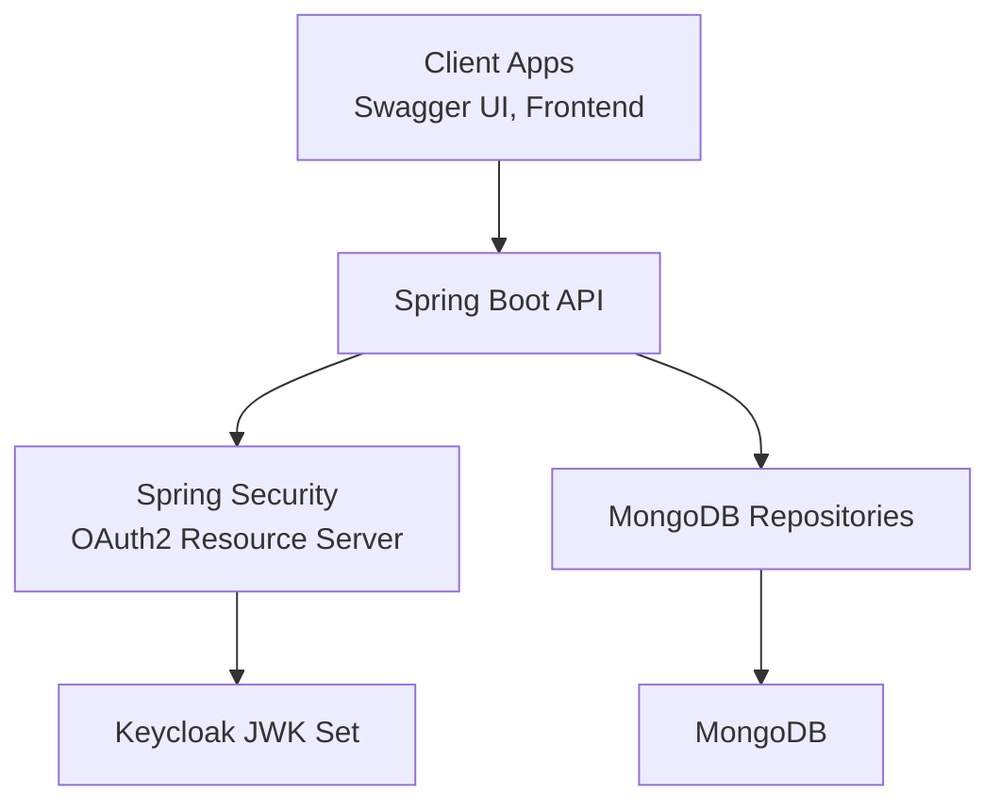
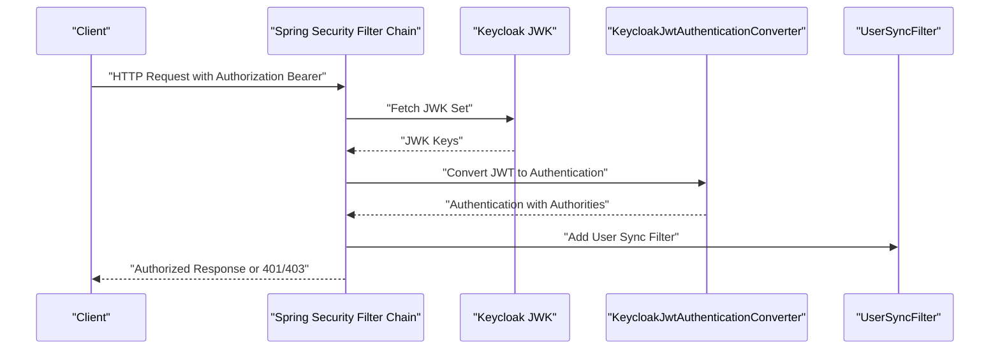
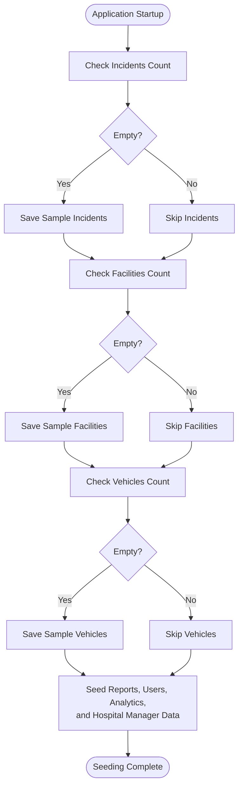
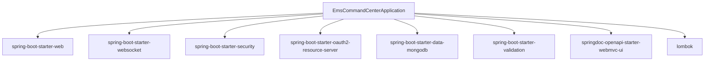

# Getting Started

<cite>
**Referenced Files in This Document**
- [pom.xml](file://pom.xml)
- [application.yml](file://src/main/resources/application.yml)
- [application.properties](file://src/main/resources/application.properties)
- [docker-compose.yml](file://docker-compose.yml)
- [Dockerfile](file://Dockerfile)
- [EmsCommandCenterApplication.java](file://src/main/java/com/example/ems_command_center/EmsCommandCenterApplication.java)
- [SecurityConfig.java](file://src/main/java/com/example/ems_command_center/config/SecurityConfig.java)
- [KeycloakJwtAuthenticationConverter.java](file://src/main/java/com/example/ems_command_center/config/KeycloakJwtAuthenticationConverter.java)
- [DataSeeder.java](file://src/main/java/com/example/ems_command_center/seeder/DataSeeder.java)
- [data.json](file://src/main/resources/data.json)
- [HELP.md](file://HELP.md)
- [rebuild-and-start.ps1](file://rebuild-and-start.ps1)
</cite>

## Table of Contents
1. [Introduction](#introduction)
2. [Prerequisites](#prerequisites)
3. [Local Development Setup](#local-development-setup)
4. [Environment Variables and Properties](#environment-variables-and-properties)
5. [Containerized Deployment with Docker Compose](#containerized-deployment-with-docker-compose)
6. [Database Initialization and Data Seeding](#database-initialization-and-data-seeding)
7. [Quick Start Examples](#quick-start-examples)
8. [Initial User Setup and Keycloak Realm Configuration](#initial-user-setup-and-keycloak-realm-configuration)
9. [Architecture Overview](#architecture-overview)
10. [Detailed Component Analysis](#detailed-component-analysis)
11. [Dependency Analysis](#dependency-analysis)
12. [Performance Considerations](#performance-considerations)
13. [Troubleshooting Guide](#troubleshooting-guide)
14. [Conclusion](#conclusion)

## Introduction
This guide helps you set up the EMS Command Center backend for local development and containerized environments. It covers prerequisites, environment configuration, database initialization, and how to run the application and explore the API documentation. It also explains the Keycloak integration and provides troubleshooting tips for common setup issues.

## Prerequisites
- Java 21 SDK
- Maven
- MongoDB
- Keycloak (for OAuth2/JWT validation)
- Docker and Docker Compose (for containerized deployment)

These are the primary runtime and build dependencies. The project is configured to use Spring Boot with MongoDB and OAuth2/JWT via Keycloak.

**Section sources**
- [pom.xml:16-21](file://pom.xml#L16-L21)
- [HELP.md:3](file://HELP.md#L3)

## Local Development Setup
Follow these steps to run the backend locally:

1. Clone or prepare the repository.
2. Ensure Java 21 and Maven are installed and available on your PATH.
3. Start MongoDB locally or via Docker Compose (see below).
4. Start Keycloak locally or via Docker Compose (see below).
5. Build the project:
   - Windows: use the Maven wrapper batch script included in the repository.
   - Linux/macOS: use the Maven wrapper shell script included in the repository.
6. Run the Spring Boot application:
   - Use the main class entry point provided by the project.
7. Access the API documentation:
   - Swagger UI is exposed at the path defined in the configuration.

Notes:
- The backend listens on port 8081 by default to avoid conflicts with a local Keycloak server on port 8080.
- The application uses Spring profiles and environment variables to configure MongoDB URI, Keycloak JWK set URI, and other settings.

**Section sources**
- [HELP.md:3](file://HELP.md#L3)
- [application.yml:16-17](file://src/main/resources/application.yml#L16-L17)
- [EmsCommandCenterApplication.java:9-11](file://src/main/java/com/example/ems_command_center/EmsCommandCenterApplication.java#L9-L11)

## Environment Variables and Properties
Configure the application using environment variables and Spring Boot properties. The application reads the following keys:

- MongoDB connection:
  - SPRING_DATA_MONGODB_URI (default: mongodb://localhost:27017/ems_db)
- Keycloak JWT validation:
  - KEYCLOAK_JWK_SET_URI (default: http://localhost:8080/realms/ems-command-center/protocol/openid-connect/certs)
  - KEYCLOAK_CLIENT_ID (default: ems-command-center-backend)
  - KEYCLOAK_PRINCIPAL_CLAIM (default: preferred_username)
- Server port:
  - SERVER_PORT (default: 8081)
- OpenAPI/Swagger:
  - springdoc.api-docs.path (default: /api-docs)
  - springdoc.swagger-ui.path (default: /swagger-ui.html)
- Logging:
  - Package logging levels are configured for development visibility.

Additionally, the application supports enabling/disabling the data seeder via a property. By default, seeding is enabled when the property is not set.

**Section sources**
- [application.yml:7](file://src/main/resources/application.yml#L7)
- [application.yml:14](file://src/main/resources/application.yml#L14)
- [application.yml:34](file://src/main/resources/application.yml#L34)
- [application.yml:35](file://src/main/resources/application.yml#L35)
- [application.yml:16-23](file://src/main/resources/application.yml#L16-L23)
- [application.yml:26-29](file://src/main/resources/application.yml#L26-L29)
- [application.yml:31-36](file://src/main/resources/application.yml#L31-L36)
- [DataSeeder.java:17](file://src/main/java/com/example/ems_command_center/seeder/DataSeeder.java#L17)

## Containerized Deployment with Docker Compose
The repository includes a Docker Compose file that provisions:
- MongoDB
- Mongo Express (web UI for MongoDB)
- The backend application container

To run the stack:

1. Ensure Docker and Docker Compose are installed.
2. From the repository root, run the compose command to start all services in detached mode.
3. Access:
   - Backend: http://localhost:8081
   - Mongo Express: http://localhost:8082
   - MongoDB: mongodb://localhost:27017

The compose file defines environment variables for Keycloak JWK set URI and client ID, allowing you to override defaults at runtime.

Optional: Use the provided PowerShell script to rebuild and restart the entire stack.

**Section sources**
- [docker-compose.yml:1-73](file://docker-compose.yml#L1-L73)
- [Dockerfile:1-7](file://Dockerfile#L1-L7)
- [rebuild-and-start.ps1:32-44](file://rebuild-and-start.ps1#L32-L44)

## Database Initialization and Data Seeding
The application initializes the MongoDB database on startup and seeds it with sample data if the collections are empty. The seeder creates documents for:
- Incidents
- Facilities (including hospitals)
- Vehicles
- Reports
- Users (with roles ADMIN, MANAGER, DRIVER, USER)
- Analytics
- Hospital manager data (patients, beds, resources, staff)

Behavior:
- Seeding runs only when the respective collections are empty.
- The seeder is enabled by default but can be controlled via a property.

Seed data sources:
- The seeder writes data directly to repositories.
- A JSON file exists in resources that contains sample datasets, although the seeder primarily uses programmatic creation.

**Section sources**
- [DataSeeder.java:57-67](file://src/main/java/com/example/ems_command_center/seeder/DataSeeder.java#L57-L67)
- [DataSeeder.java:69-86](file://src/main/java/com/example/ems_command_center/seeder/DataSeeder.java#L69-L86)
- [DataSeeder.java:88-136](file://src/main/java/com/example/ems_command_center/seeder/DataSeeder.java#L88-L136)
- [DataSeeder.java:138-163](file://src/main/java/com/example/ems_command_center/seeder/DataSeeder.java#L138-L163)
- [DataSeeder.java:165-173](file://src/main/java/com/example/ems_command_center/seeder/DataSeeder.java#L165-L173)
- [DataSeeder.java:175-238](file://src/main/java/com/example/ems_command_center/seeder/DataSeeder.java#L175-L238)
- [DataSeeder.java:240-269](file://src/main/java/com/example/ems_command_center/seeder/DataSeeder.java#L240-L269)
- [DataSeeder.java:271-361](file://src/main/java/com/example/ems_command_center/seeder/DataSeeder.java#L271-L361)
- [data.json:1-202](file://src/main/resources/data.json#L1-L202)

## Quick Start Examples
- Run locally:
  - Build with Maven.
  - Start the application using the main class entry point.
  - Open the Swagger UI at the path defined in the configuration.
- Run with Docker Compose:
  - Start the stack with the compose command.
  - Access the backend and Mongo Express at the ports defined in the compose file.

Endpoints of interest:
- Swagger UI: the path is configured in the application properties.
- OpenAPI JSON: the path is configured in the application properties.
- Profile inspection: a dedicated endpoint allows you to inspect the authenticated user and resolved roles.

**Section sources**
- [HELP.md:31-36](file://HELP.md#L31-L36)
- [application.yml:20-24](file://src/main/resources/application.yml#L20-L24)
- [application.yml:22](file://src/main/resources/application.yml#L22)

## Initial User Setup and Keycloak Realm Configuration
The backend expects JWTs issued by Keycloak and validates them against the configured JWK set URI. The default realm and client are:
- Realm: ems-command-center
- Client ID: ems-command-center-backend
- Principal claim: preferred_username

Keycloak roles are mapped to Spring Security authorities:
- Admin -> ROLE_ADMIN
- Manager -> ROLE_MANAGER
- Driver -> ROLE_DRIVER
- User -> ROLE_USER

To configure Keycloak:
- Create a realm named ems-command-center.
- Create a client with ID ems-command-center-backend.
- Configure the client to issue roles in the token (realm roles and client roles).
- Ensure the JWK set URI matches your Keycloak instance.

Override defaults using environment variables as documented in the configuration properties.

**Section sources**
- [HELP.md:11-21](file://HELP.md#L11-L21)
- [SecurityConfig.java:66-92](file://src/main/java/com/example/ems_command_center/config/SecurityConfig.java#L66-L92)
- [KeycloakJwtAuthenticationConverter.java:84-86](file://src/main/java/com/example/ems_command_center/config/KeycloakJwtAuthenticationConverter.java#L84-L86)

## Architecture Overview
The backend integrates Spring Security OAuth2/JWT with MongoDB and exposes REST endpoints protected by role-based access control. The Swagger/OpenAPI configuration is embedded for interactive documentation.

**Diagram sources**
- [SecurityConfig.java:44-98](file://src/main/java/com/example/ems_command_center/config/SecurityConfig.java#L44-L98)
- [KeycloakJwtAuthenticationConverter.java:29-41](file://src/main/java/com/example/ems_command_center/config/KeycloakJwtAuthenticationConverter.java#L29-L41)
- [application.yml:7](file://src/main/resources/application.yml#L7)
- [application.yml:14](file://src/main/resources/application.yml#L14)

## Detailed Component Analysis

### Security and Authentication Flow
The security configuration disables CSRF, enforces stateless sessions, and configures CORS. It delegates JWT validation to Keycloak using the JWK set URI and maps roles from the token to Spring authorities.

**Diagram sources**
- [SecurityConfig.java:44-98](file://src/main/java/com/example/ems_command_center/config/SecurityConfig.java#L44-L98)
- [KeycloakJwtAuthenticationConverter.java:29-41](file://src/main/java/com/example/ems_command_center/config/KeycloakJwtAuthenticationConverter.java#L29-L41)

**Section sources**
- [SecurityConfig.java:44-98](file://src/main/java/com/example/ems_command_center/config/SecurityConfig.java#L44-L98)
- [KeycloakJwtAuthenticationConverter.java:18-87](file://src/main/java/com/example/ems_command_center/config/KeycloakJwtAuthenticationConverter.java#L18-L87)

### Data Seeding Process
The seeder checks if collections are empty and inserts predefined documents for incidents, facilities, vehicles, reports, users, analytics, and hospital manager data.

**Diagram sources**
- [DataSeeder.java:57-67](file://src/main/java/com/example/ems_command_center/seeder/DataSeeder.java#L57-L67)
- [DataSeeder.java:69-86](file://src/main/java/com/example/ems_command_center/seeder/DataSeeder.java#L69-L86)
- [DataSeeder.java:88-136](file://src/main/java/com/example/ems_command_center/seeder/DataSeeder.java#L88-L136)
- [DataSeeder.java:138-163](file://src/main/java/com/example/ems_command_center/seeder/DataSeeder.java#L138-L163)
- [DataSeeder.java:165-173](file://src/main/java/com/example/ems_command_center/seeder/DataSeeder.java#L165-L173)
- [DataSeeder.java:175-238](file://src/main/java/com/example/ems_command_center/seeder/DataSeeder.java#L175-L238)
- [DataSeeder.java:240-269](file://src/main/java/com/example/ems_command_center/seeder/DataSeeder.java#L240-L269)
- [DataSeeder.java:271-361](file://src/main/java/com/example/ems_command_center/seeder/DataSeeder.java#L271-L361)

**Section sources**
- [DataSeeder.java:17-55](file://src/main/java/com/example/ems_command_center/seeder/DataSeeder.java#L17-L55)

## Dependency Analysis
The backend relies on Spring Boot starters for web, security, MongoDB, WebSocket, validation, and OpenAPI/Swagger. The POM declares Java 21 and includes JWT libraries for token processing.

**Diagram sources**
- [pom.xml:22-84](file://pom.xml#L22-L84)
- [EmsCommandCenterApplication.java:6](file://src/main/java/com/example/ems_command_center/EmsCommandCenterApplication.java#L6)

**Section sources**
- [pom.xml:16-21](file://pom.xml#L16-L21)
- [pom.xml:22-84](file://pom.xml#L22-L84)

## Performance Considerations
- Keep MongoDB and Keycloak close to the backend for low latency.
- Use the provided Docker Compose network for efficient inter-service communication.
- Enable caching and connection pooling at the MongoDB driver level if scaling.
- Monitor JWT validation overhead and ensure Keycloak JWK set caching is effective.

## Troubleshooting Guide
Common issues and resolutions:

- Port conflicts:
  - The backend runs on port 8081 by default to avoid conflicts with Keycloak on 8080. Adjust SERVER_PORT if needed.
- MongoDB connectivity:
  - Verify SPRING_DATA_MONGODB_URI points to a reachable MongoDB instance.
  - Confirm the database name matches the configured value.
- Keycloak validation failures:
  - Ensure KEYCLOAK_JWK_SET_URI points to a reachable Keycloak instance and realm.
  - Confirm the client ID matches the registered client.
  - Verify the token includes the expected roles and principal claim.
- Swagger/OpenAPI paths:
  - Confirm the configured paths for API docs and Swagger UI.
- CORS errors:
  - Ensure the frontend origin is included in allowed origins in the security configuration.
- Data not seeding:
  - Check that the seeding property is enabled and the collections are empty.
- Docker Compose issues:
  - Use the provided script to rebuild and restart the stack cleanly.

**Section sources**
- [HELP.md:3](file://HELP.md#L3)
- [HELP.md:17-21](file://HELP.md#L17-L21)
- [HELP.md:31-36](file://HELP.md#L31-L36)
- [application.yml:16-23](file://src/main/resources/application.yml#L16-L23)
- [application.yml:14](file://src/main/resources/application.yml#L14)
- [application.yml:34](file://src/main/resources/application.yml#L34)
- [SecurityConfig.java:106-120](file://src/main/java/com/example/ems_command_center/config/SecurityConfig.java#L106-L120)
- [DataSeeder.java:17](file://src/main/java/com/example/ems_command_center/seeder/DataSeeder.java#L17)
- [rebuild-and-start.ps1:32-44](file://rebuild-and-start.ps1#L32-L44)

## Conclusion
You now have the essentials to set up the EMS Command Center backend locally or in containers, connect it to MongoDB and Keycloak, initialize the database with seed data, and explore the API documentation. Use the troubleshooting section to resolve typical setup issues quickly.