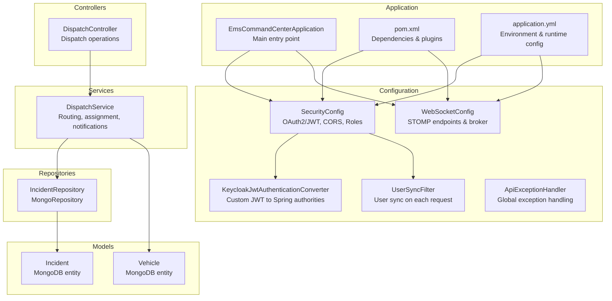
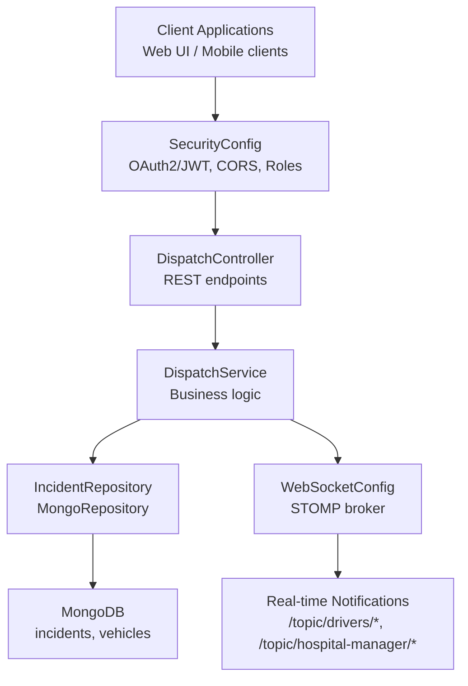
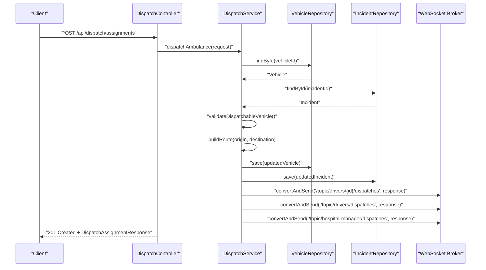
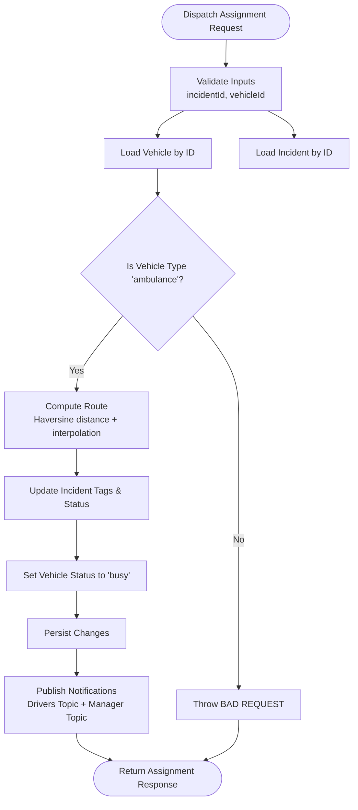
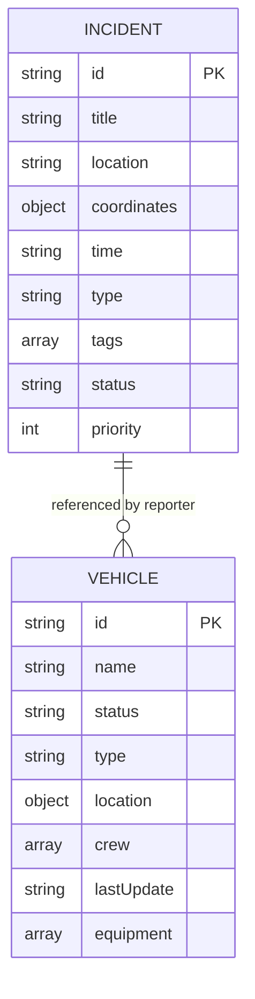
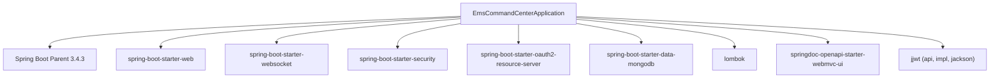

# Project Overview

<cite>
**Referenced Files in This Document**
- [EmsCommandCenterApplication.java](file://src/main/java/com/example/ems_command_center/EmsCommandCenterApplication.java)
- [pom.xml](file://pom.xml)
- [application.yml](file://src/main/resources/application.yml)
- [Dockerfile](file://Dockerfile)
- [docker-compose.yml](file://docker-compose.yml)
- [SecurityConfig.java](file://src/main/java/com/example/ems_command_center/config/SecurityConfig.java)
- [WebSocketConfig.java](file://src/main/java/com/example/ems_command_center/config/WebSocketConfig.java)
- [KeycloakJwtAuthenticationConverter.java](file://src/main/java/com/example/ems_command_center/config/KeycloakJwtAuthenticationConverter.java)
- [UserSyncFilter.java](file://src/main/java/com/example/ems_command_center/config/UserSyncFilter.java)
- [ApiExceptionHandler.java](file://src/main/java/com/example/ems_command_center/config/ApiExceptionHandler.java)
- [DispatchController.java](file://src/main/java/com/example/ems_command_center/controller/DispatchController.java)
- [DispatchService.java](file://src/main/java/com/example/ems_command_center/service/DispatchService.java)
- [IncidentRepository.java](file://src/main/java/com/example/ems_command_center/repository/IncidentRepository.java)
- [Incident.java](file://src/main/java/com/example/ems_command_center/model/Incident.java)
- [Vehicle.java](file://src/main/java/com/example/ems_command_center/model/Vehicle.java)
</cite>

## Table of Contents
1. [Introduction](#introduction)
2. [Project Structure](#project-structure)
3. [Core Components](#core-components)
4. [Architecture Overview](#architecture-overview)
5. [Detailed Component Analysis](#detailed-component-analysis)
6. [Dependency Analysis](#dependency-analysis)
7. [Performance Considerations](#performance-considerations)
8. [Troubleshooting Guide](#troubleshooting-guide)
9. [Conclusion](#conclusion)

## Introduction
The EMS Command Center is a Spring Boot-based backend system designed to support emergency medical services operations. Its primary purpose is to streamline dispatch coordination, enable real-time communication among field units and command center personnel, and facilitate efficient resource allocation during emergencies. The platform targets EMS operators, dispatchers, drivers, and hospital staff who require reliable, secure, and responsive tools to manage incidents, assign ambulances, track progress, and coordinate care delivery.

Key capabilities include:
- Dispatch management: listing available ambulances, previewing suggested routes, and assigning units to incidents.
- Real-time notifications via WebSocket for immediate updates to drivers and hospital managers.
- Role-based access control integrated with Keycloak OAuth2/JWT.
- Persistent storage using MongoDB for operational data such as incidents and vehicles.
- Developer-friendly API documentation powered by SpringDoc OpenAPI.

## Project Structure
The backend follows a layered architecture aligned with Spring Boot conventions:
- Application bootstrap and packaging configuration
- Configuration for security, WebSocket, and API documentation
- REST controllers exposing domain-specific endpoints
- Service layer implementing business logic
- Repository layer interacting with MongoDB
- Model entities mapped to MongoDB collections

**Diagram sources**
- [EmsCommandCenterApplication.java:1-14](file://src/main/java/com/example/ems_command_center/EmsCommandCenterApplication.java#L1-L14)
- [pom.xml:22-84](file://pom.xml#L22-L84)
- [application.yml:10-36](file://src/main/resources/application.yml#L10-L36)
- [SecurityConfig.java:26-98](file://src/main/java/com/example/ems_command_center/config/SecurityConfig.java#L26-L98)
- [WebSocketConfig.java:10-51](file://src/main/java/com/example/ems_command_center/config/WebSocketConfig.java#L10-L51)
- [KeycloakJwtAuthenticationConverter.java:18-87](file://src/main/java/com/example/ems_command_center/config/KeycloakJwtAuthenticationConverter.java#L18-L87)
- [UserSyncFilter.java:17-51](file://src/main/java/com/example/ems_command_center/config/UserSyncFilter.java#L17-L51)
- [ApiExceptionHandler.java:13-27](file://src/main/java/com/example/ems_command_center/config/ApiExceptionHandler.java#L13-L27)
- [DispatchController.java:22-57](file://src/main/java/com/example/ems_command_center/controller/DispatchController.java#L22-L57)
- [DispatchService.java:21-214](file://src/main/java/com/example/ems_command_center/service/DispatchService.java#L21-L214)
- [IncidentRepository.java:9-14](file://src/main/java/com/example/ems_command_center/repository/IncidentRepository.java#L9-L14)
- [Incident.java:8-24](file://src/main/java/com/example/ems_command_center/model/Incident.java#L8-L24)
- [Vehicle.java:7-19](file://src/main/java/com/example/ems_command_center/model/Vehicle.java#L7-L19)

**Section sources**
- [EmsCommandCenterApplication.java:1-14](file://src/main/java/com/example/ems_command_center/EmsCommandCenterApplication.java#L1-L14)
- [pom.xml:22-84](file://pom.xml#L22-L84)
- [application.yml:10-36](file://src/main/resources/application.yml#L10-L36)

## Core Components
- Application bootstrap: initializes the Spring Boot application context.
- Security configuration: enables stateless OAuth2 JWT authentication, defines granular endpoint-level authorization, and integrates Keycloak roles.
- WebSocket configuration: exposes STOMP endpoints for real-time messaging and sets up a simple message broker.
- Dispatch controller and service: orchestrate ambulance availability checks, route estimation, and dispatch assignments while publishing live updates.
- Repositories and models: persist incidents and vehicles in MongoDB with typed queries and entity mappings.

These components collectively support dispatch coordination, real-time communication, and secure access control tailored to emergency operations.

**Section sources**
- [SecurityConfig.java:26-98](file://src/main/java/com/example/ems_command_center/config/SecurityConfig.java#L26-L98)
- [WebSocketConfig.java:10-51](file://src/main/java/com/example/ems_command_center/config/WebSocketConfig.java#L10-L51)
- [DispatchController.java:22-57](file://src/main/java/com/example/ems_command_center/controller/DispatchController.java#L22-L57)
- [DispatchService.java:21-214](file://src/main/java/com/example/ems_command_center/service/DispatchService.java#L21-L214)
- [IncidentRepository.java:9-14](file://src/main/java/com/example/ems_command_center/repository/IncidentRepository.java#L9-L14)
- [Incident.java:8-24](file://src/main/java/com/example/ems_command_center/model/Incident.java#L8-L24)
- [Vehicle.java:7-19](file://src/main/java/com/example/ems_command_center/model/Vehicle.java#L7-L19)

## Architecture Overview
The system employs a layered architecture with clear separation of concerns:
- Presentation layer: REST controllers expose endpoints for dispatch operations and related resources.
- Service layer: encapsulates business logic for dispatching, route calculation, and real-time notifications.
- Persistence layer: repositories interact with MongoDB for data persistence.
- Cross-cutting concerns: security, WebSocket messaging, and global exception handling are configured centrally.

**Diagram sources**
- [SecurityConfig.java:26-98](file://src/main/java/com/example/ems_command_center/config/SecurityConfig.java#L26-L98)
- [DispatchController.java:22-57](file://src/main/java/com/example/ems_command_center/controller/DispatchController.java#L22-L57)
- [DispatchService.java:21-214](file://src/main/java/com/example/ems_command_center/service/DispatchService.java#L21-L214)
- [IncidentRepository.java:9-14](file://src/main/java/com/example/ems_command_center/repository/IncidentRepository.java#L9-L14)
- [WebSocketConfig.java:10-51](file://src/main/java/com/example/ems_command_center/config/WebSocketConfig.java#L10-L51)

## Detailed Component Analysis

### Dispatch Workflow
This sequence illustrates the end-to-end process for dispatching an ambulance to an incident, including route calculation and real-time notifications.

**Diagram sources**
- [DispatchController.java:50-55](file://src/main/java/com/example/ems_command_center/controller/DispatchController.java#L50-L55)
- [DispatchService.java:53-119](file://src/main/java/com/example/ems_command_center/service/DispatchService.java#L53-L119)
- [IncidentRepository.java:9-14](file://src/main/java/com/example/ems_command_center/repository/IncidentRepository.java#L9-L14)

**Section sources**
- [DispatchController.java:22-57](file://src/main/java/com/example/ems_command_center/controller/DispatchController.java#L22-L57)
- [DispatchService.java:21-214](file://src/main/java/com/example/ems_command_center/service/DispatchService.java#L21-L214)

### Route Calculation Logic
The dispatch service computes a suggested route between an ambulance and an incident, estimates travel time, and publishes notifications to relevant channels.

**Diagram sources**
- [DispatchService.java:40-119](file://src/main/java/com/example/ems_command_center/service/DispatchService.java#L40-L119)

**Section sources**
- [DispatchService.java:137-182](file://src/main/java/com/example/ems_command_center/service/DispatchService.java#L137-L182)

### Data Models
The system models two primary entities persisted in MongoDB.

**Diagram sources**
- [Incident.java:8-24](file://src/main/java/com/example/ems_command_center/model/Incident.java#L8-L24)
- [Vehicle.java:7-19](file://src/main/java/com/example/ems_command_center/model/Vehicle.java#L7-L19)

**Section sources**
- [Incident.java:8-24](file://src/main/java/com/example/ems_command_center/model/Incident.java#L8-L24)
- [Vehicle.java:7-19](file://src/main/java/com/example/ems_command_center/model/Vehicle.java#L7-L19)

## Dependency Analysis
The backend relies on Spring Boot starters and supporting libraries for security, data persistence, web, WebSocket, and API documentation. Environment variables configure MongoDB connection and Keycloak integration.

**Diagram sources**
- [pom.xml:22-84](file://pom.xml#L22-L84)

**Section sources**
- [pom.xml:22-84](file://pom.xml#L22-L84)
- [application.yml:5-17](file://src/main/resources/application.yml#L5-L17)

## Performance Considerations
- WebSocket scalability: The simple broker is suitable for development and small-scale deployments. For production, consider a dedicated message broker (e.g., RabbitMQ, Apache Kafka) to handle higher throughput and clustering.
- Database indexing: Add indexes on frequently queried fields (e.g., incident status, vehicle type/status) to optimize repository queries.
- Caching: Introduce caching for read-heavy operations (e.g., available ambulances) to reduce database load.
- Asynchronous processing: Offload long-running tasks (e.g., notification fan-out) to async queues to keep request paths responsive.
- Monitoring and observability: Enable metrics and distributed tracing to track latency and bottlenecks in dispatch workflows.

## Troubleshooting Guide
Common issues and resolutions:
- Authentication failures: Verify Keycloak JWK set URI and client configuration. Ensure requests include a valid bearer token with appropriate scopes and roles.
- Authorization errors: Confirm user roles in Keycloak match the expected roles for accessing specific endpoints.
- WebSocket connectivity: Check allowed origins and endpoint registration. Ensure clients connect to the correct STOMP endpoint.
- Database connectivity: Validate MongoDB URI and credentials. Confirm the database and collections exist.
- Global exceptions: The centralized exception handler returns structured JSON responses for HTTP errors.

**Section sources**
- [SecurityConfig.java:138-154](file://src/main/java/com/example/ems_command_center/config/SecurityConfig.java#L138-L154)
- [WebSocketConfig.java:32-49](file://src/main/java/com/example/ems_command_center/config/WebSocketConfig.java#L32-L49)
- [ApiExceptionHandler.java:13-27](file://src/main/java/com/example/ems_command_center/config/ApiExceptionHandler.java#L13-L27)

## Conclusion
The EMS Command Center backend provides a robust foundation for dispatch coordination and real-time communication in emergency medical services. By leveraging Spring Boot 3.4.3, MongoDB, Keycloak OAuth2, and WebSocket messaging, it delivers secure, scalable, and operationally effective support for EMS operators, dispatchers, drivers, and hospital staff. The layered architecture, combined with role-based access control and real-time notifications, positions the system to enhance response times and improve medical service delivery during critical incidents.