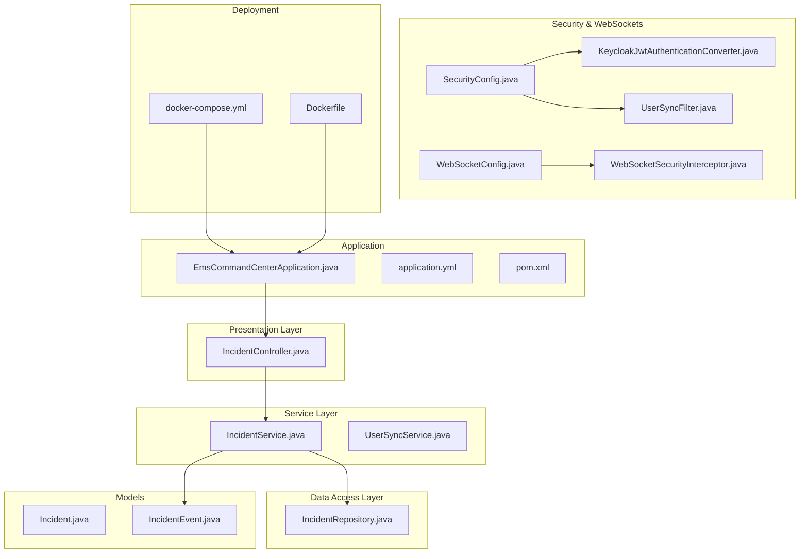
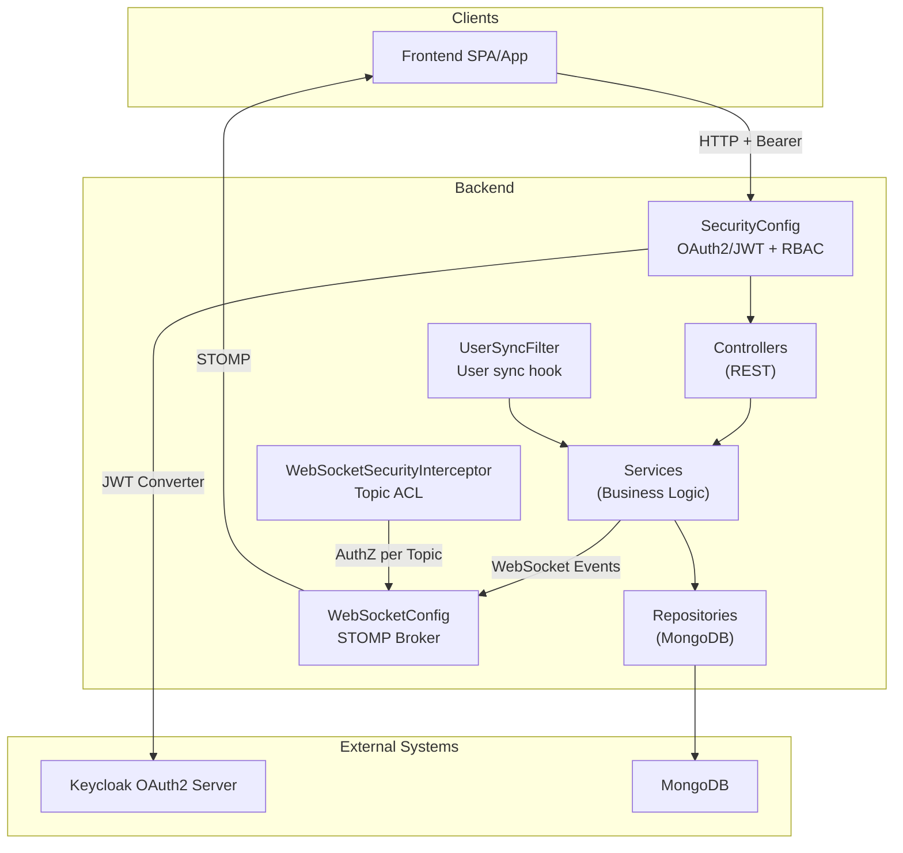
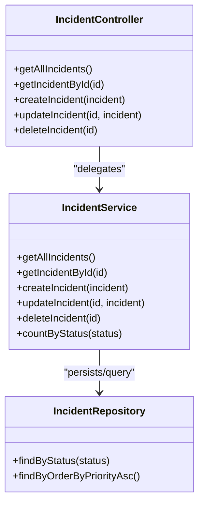
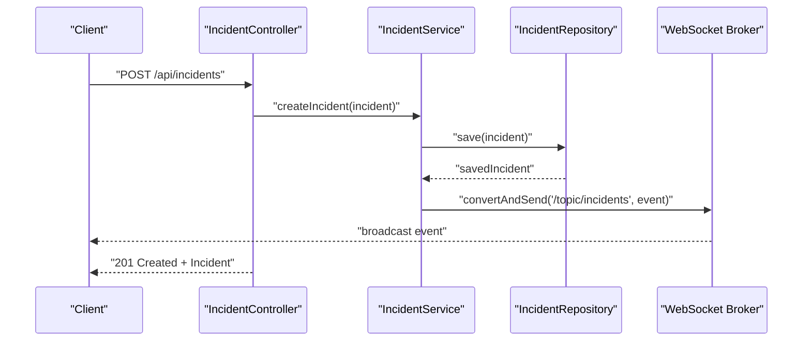
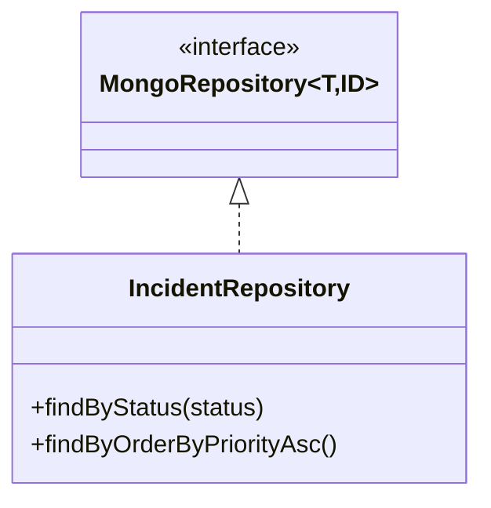
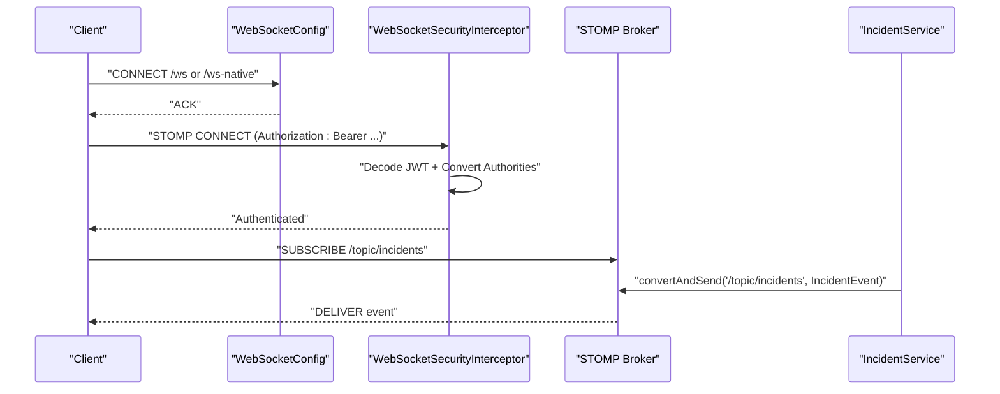
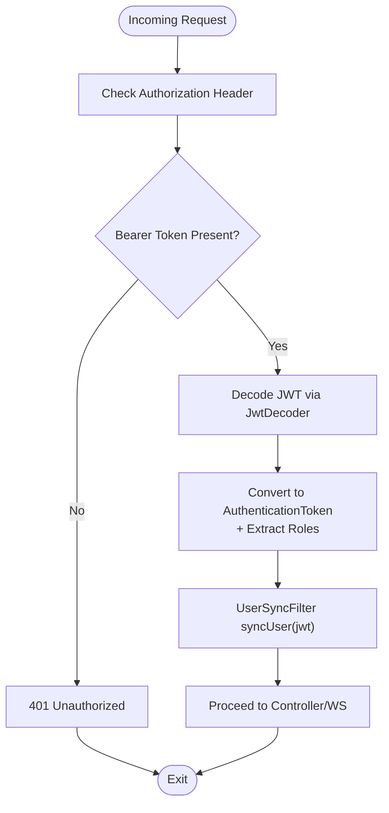
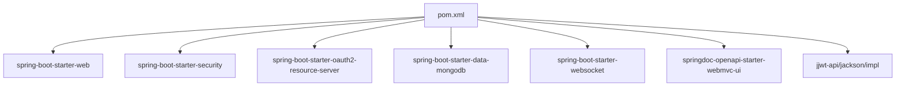
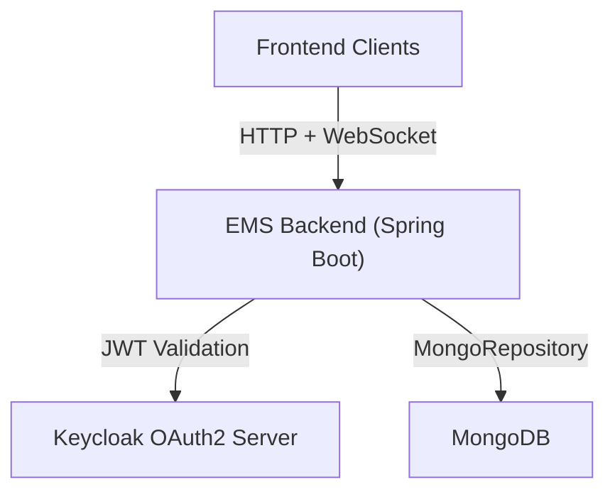

# System Architecture

<cite>
**Referenced Files in This Document**
- [EmsCommandCenterApplication.java](file://src/main/java/com/example/ems_command_center/EmsCommandCenterApplication.java)
- [application.yml](file://src/main/resources/application.yml)
- [pom.xml](file://pom.xml)
- [SecurityConfig.java](file://src/main/java/com/example/ems_command_center/config/SecurityConfig.java)
- [WebSocketConfig.java](file://src/main/java/com/example/ems_command_center/config/WebSocketConfig.java)
- [WebSocketSecurityInterceptor.java](file://src/main/java/com/example/ems_command_center/config/WebSocketSecurityInterceptor.java)
- [KeycloakJwtAuthenticationConverter.java](file://src/main/java/com/example/ems_command_center/config/KeycloakJwtAuthenticationConverter.java)
- [UserSyncFilter.java](file://src/main/java/com/example/ems_command_center/config/UserSyncFilter.java)
- [IncidentController.java](file://src/main/java/com/example/ems_command_center/controller/IncidentController.java)
- [IncidentService.java](file://src/main/java/com/example/ems_command_center/service/IncidentService.java)
- [IncidentRepository.java](file://src/main/java/com/example/ems_command_center/repository/IncidentRepository.java)
- [UserSyncService.java](file://src/main/java/com/example/ems_command_center/service/UserSyncService.java)
- [IncidentEvent.java](file://src/main/java/com/example/ems_command_center/model/IncidentEvent.java)
- [docker-compose.yml](file://docker-compose.yml)
- [Dockerfile](file://Dockerfile)
</cite>

## Table of Contents
1. [Introduction](#introduction)
2. [Project Structure](#project-structure)
3. [Core Components](#core-components)
4. [Architecture Overview](#architecture-overview)
5. [Detailed Component Analysis](#detailed-component-analysis)
6. [Dependency Analysis](#dependency-analysis)
7. [Performance Considerations](#performance-considerations)
8. [Troubleshooting Guide](#troubleshooting-guide)
9. [Conclusion](#conclusion)
10. [Appendices](#appendices)

## Introduction
This document describes the system architecture of the EMS Command Center backend built with Spring Boot. It explains the layered architecture following the Model-View-Controller (MVC) pattern, the service layer for business logic encapsulation, and the repository pattern for MongoDB data access abstraction. It also documents the WebSocket architecture for real-time communication and message broadcasting, the integration with Keycloak OAuth2/JWT, and the deployment topology using Docker Compose. Design patterns such as Observer for real-time updates and Factory-like conversion for JWT authentication are highlighted, along with scalability and deployment considerations.

## Project Structure
The backend follows a conventional Spring Boot layout with clear separation of concerns:
- Application bootstrap and configuration
- REST controllers implementing the presentation layer
- Services encapsulating business logic
- Repositories abstracting MongoDB access
- Models representing domain entities and DTOs
- Security and WebSocket configurations
- Docker and Docker Compose for deployment

**Diagram sources**
- [EmsCommandCenterApplication.java:1-14](file://src/main/java/com/example/ems_command_center/EmsCommandCenterApplication.java#L1-L14)
- [application.yml:1-36](file://src/main/resources/application.yml#L1-L36)
- [pom.xml:1-103](file://pom.xml#L1-L103)
- [IncidentController.java:1-61](file://src/main/java/com/example/ems_command_center/controller/IncidentController.java#L1-L61)
- [IncidentService.java:1-106](file://src/main/java/com/example/ems_command_center/service/IncidentService.java#L1-L106)
- [IncidentRepository.java:1-14](file://src/main/java/com/example/ems_command_center/repository/IncidentRepository.java#L1-L14)
- [IncidentEvent.java:1-9](file://src/main/java/com/example/ems_command_center/model/IncidentEvent.java#L1-L9)
- [SecurityConfig.java:1-156](file://src/main/java/com/example/ems_command_center/config/SecurityConfig.java#L1-L156)
- [WebSocketConfig.java:1-51](file://src/main/java/com/example/ems_command_center/config/WebSocketConfig.java#L1-L51)
- [WebSocketSecurityInterceptor.java:1-113](file://src/main/java/com/example/ems_command_center/config/WebSocketSecurityInterceptor.java#L1-L113)
- [KeycloakJwtAuthenticationConverter.java:1-88](file://src/main/java/com/example/ems_command_center/config/KeycloakJwtAuthenticationConverter.java#L1-L88)
- [UserSyncFilter.java:1-51](file://src/main/java/com/example/ems_command_center/config/UserSyncFilter.java#L1-L51)
- [docker-compose.yml:1-73](file://docker-compose.yml#L1-L73)
- [Dockerfile:1-7](file://Dockerfile#L1-L7)

**Section sources**
- [EmsCommandCenterApplication.java:1-14](file://src/main/java/com/example/ems_command_center/EmsCommandCenterApplication.java#L1-L14)
- [application.yml:1-36](file://src/main/resources/application.yml#L1-L36)
- [pom.xml:1-103](file://pom.xml#L1-L103)

## Core Components
- Application bootstrap: Declares the Spring Boot application entry point.
- Configuration: Centralized via YAML for MongoDB connection, OAuth2/JWT, logging, and API docs.
- Dependencies: Managed via Maven with Spring Boot starters for web, security, MongoDB, WebSocket, and OpenAPI/Swagger.

Key responsibilities:
- MVC pattern: Controllers handle HTTP requests, delegating to services; services encapsulate business logic; repositories abstract persistence.
- Security: OAuth2 Resource Server with JWT, role-based access control, CORS, and JSON error handlers.
- Real-time: STOMP/WebSocket with SockJS fallback, secured by JWT and access-control checks per topic destinations.
- Persistence: MongoDB repositories using Spring Data MongoDB.

**Section sources**
- [EmsCommandCenterApplication.java:1-14](file://src/main/java/com/example/ems_command_center/EmsCommandCenterApplication.java#L1-L14)
- [application.yml:1-36](file://src/main/resources/application.yml#L1-L36)
- [pom.xml:22-84](file://pom.xml#L22-L84)

## Architecture Overview
The system integrates REST APIs, WebSocket messaging, MongoDB, and Keycloak OAuth2. The runtime stack is containerized for local development and deployment.

**Diagram sources**
- [SecurityConfig.java:44-98](file://src/main/java/com/example/ems_command_center/config/SecurityConfig.java#L44-L98)
- [KeycloakJwtAuthenticationConverter.java:18-41](file://src/main/java/com/example/ems_command_center/config/KeycloakJwtAuthenticationConverter.java#L18-L41)
- [UserSyncFilter.java:18-50](file://src/main/java/com/example/ems_command_center/config/UserSyncFilter.java#L18-L50)
- [IncidentController.java:14-61](file://src/main/java/com/example/ems_command_center/controller/IncidentController.java#L14-L61)
- [IncidentService.java:15-106](file://src/main/java/com/example/ems_command_center/service/IncidentService.java#L15-L106)
- [IncidentRepository.java:9-14](file://src/main/java/com/example/ems_command_center/repository/IncidentRepository.java#L9-L14)
- [WebSocketConfig.java:10-51](file://src/main/java/com/example/ems_command_center/config/WebSocketConfig.java#L10-L51)
- [WebSocketSecurityInterceptor.java:17-113](file://src/main/java/com/example/ems_command_center/config/WebSocketSecurityInterceptor.java#L17-L113)
- [application.yml:5-17](file://src/main/resources/application.yml#L5-L17)

## Detailed Component Analysis

### MVC Pattern Implementation
- Presentation: Controllers expose REST endpoints and delegate to services.
- Business Logic: Services encapsulate workflows, enforce policies, and publish events.
- Data Access: Repositories extend Spring Data MongoDB for CRUD and queries.

**Diagram sources**
- [IncidentController.java:14-61](file://src/main/java/com/example/ems_command_center/controller/IncidentController.java#L14-L61)
- [IncidentService.java:15-106](file://src/main/java/com/example/ems_command_center/service/IncidentService.java#L15-L106)
- [IncidentRepository.java:9-14](file://src/main/java/com/example/ems_command_center/repository/IncidentRepository.java#L9-L14)

**Section sources**
- [IncidentController.java:14-61](file://src/main/java/com/example/ems_command_center/controller/IncidentController.java#L14-L61)
- [IncidentService.java:15-106](file://src/main/java/com/example/ems_command_center/service/IncidentService.java#L15-L106)
- [IncidentRepository.java:9-14](file://src/main/java/com/example/ems_command_center/repository/IncidentRepository.java#L9-L14)

### Service Layer Pattern
- Encapsulation: Controllers depend on service interfaces; services depend on repositories.
- Cross-cutting: User synchronization enriches user profiles from JWT claims.
- Eventing: Services publish domain events to WebSocket topics for real-time updates.

**Diagram sources**
- [IncidentController.java:39-44](file://src/main/java/com/example/ems_command_center/controller/IncidentController.java#L39-L44)
- [IncidentService.java:35-40](file://src/main/java/com/example/ems_command_center/service/IncidentService.java#L35-L40)
- [IncidentEvent.java:3-8](file://src/main/java/com/example/ems_command_center/model/IncidentEvent.java#L3-L8)
- [WebSocketConfig.java:21-24](file://src/main/java/com/example/ems_command_center/config/WebSocketConfig.java#L21-L24)

**Section sources**
- [IncidentService.java:35-104](file://src/main/java/com/example/ems_command_center/service/IncidentService.java#L35-L104)
- [IncidentEvent.java:3-8](file://src/main/java/com/example/ems_command_center/model/IncidentEvent.java#L3-L8)

### Repository Pattern for MongoDB
- Abstraction: Repositories define typed methods for querying and sorting.
- Spring Data MongoDB: Extends MongoRepository for automatic CRUD support.
- Queries: Custom finder methods enable filtering by status and ordering by priority.

**Diagram sources**
- [IncidentRepository.java:9-14](file://src/main/java/com/example/ems_command_center/repository/IncidentRepository.java#L9-L14)

**Section sources**
- [IncidentRepository.java:9-14](file://src/main/java/com/example/ems_command_center/repository/IncidentRepository.java#L9-L14)

### WebSocket Architecture and Real-Time Communication
- Broker: Simple broker enabled for topics; application destination prefixes configured.
- Endpoints: Native STOMP endpoint and SockJS-enabled endpoint registered with allowed origins.
- Security: Interceptor validates JWT on CONNECT and enforces access control per topic.
- Broadcasting: Services send messages to topics; clients subscribe to scoped channels.

**Diagram sources**
- [WebSocketConfig.java:20-49](file://src/main/java/com/example/ems_command_center/config/WebSocketConfig.java#L20-L49)
- [WebSocketSecurityInterceptor.java:34-111](file://src/main/java/com/example/ems_command_center/config/WebSocketSecurityInterceptor.java#L34-L111)
- [IncidentService.java:88-104](file://src/main/java/com/example/ems_command_center/service/IncidentService.java#L88-L104)

**Section sources**
- [WebSocketConfig.java:10-51](file://src/main/java/com/example/ems_command_center/config/WebSocketConfig.java#L10-L51)
- [WebSocketSecurityInterceptor.java:17-113](file://src/main/java/com/example/ems_command_center/config/WebSocketSecurityInterceptor.java#L17-L113)

### JWT Authentication and Authorization
- OAuth2 Resource Server: Configured with JWK set URI from Keycloak.
- JWT Converter: Translates realm/client roles into Spring Security authorities.
- User Sync: Extracts claims from JWT and synchronizes user records in MongoDB.
- Access Control: Method-level and request-level authorization enforced via annotations and filters.

**Diagram sources**
- [SecurityConfig.java:93-95](file://src/main/java/com/example/ems_command_center/config/SecurityConfig.java#L93-L95)
- [KeycloakJwtAuthenticationConverter.java:29-41](file://src/main/java/com/example/ems_command_center/config/KeycloakJwtAuthenticationConverter.java#L29-L41)
- [UserSyncFilter.java:26-42](file://src/main/java/com/example/ems_command_center/config/UserSyncFilter.java#L26-L42)

**Section sources**
- [SecurityConfig.java:93-103](file://src/main/java/com/example/ems_command_center/config/SecurityConfig.java#L93-L103)
- [KeycloakJwtAuthenticationConverter.java:18-88](file://src/main/java/com/example/ems_command_center/config/KeycloakJwtAuthenticationConverter.java#L18-L88)
- [UserSyncFilter.java:18-50](file://src/main/java/com/example/ems_command_center/config/UserSyncFilter.java#L18-L50)

### Design Patterns
- Observer pattern: Services publish domain events to WebSocket topics; subscribers receive real-time updates.
- Factory-like conversion: KeycloakJwtAuthenticationConverter acts as a converter factory that transforms JWT tokens into Spring Authentication with extracted authorities.
- Repository pattern: Clear separation between data access and business logic via Spring Data MongoDB repositories.

**Section sources**
- [IncidentService.java:88-104](file://src/main/java/com/example/ems_command_center/service/IncidentService.java#L88-L104)
- [KeycloakJwtAuthenticationConverter.java:18-41](file://src/main/java/com/example/ems_command_center/config/KeycloakJwtAuthenticationConverter.java#L18-L41)
- [IncidentRepository.java:9-14](file://src/main/java/com/example/ems_command_center/repository/IncidentRepository.java#L9-L14)

## Dependency Analysis
Runtime dependencies include Spring Web, Security, MongoDB, WebSocket, OAuth2 Resource Server, OpenAPI/Swagger, and JWT libraries. Build-time dependencies are managed via Maven.

**Diagram sources**
- [pom.xml:22-84](file://pom.xml#L22-L84)

**Section sources**
- [pom.xml:16-21](file://pom.xml#L16-L21)

## Performance Considerations
- Asynchronous messaging: WebSocket broker offloads real-time updates from synchronous HTTP responses.
- Minimal payload: Domain events carry essential identifiers and data to reduce bandwidth.
- Caching: Consider caching frequently accessed metadata (e.g., hospitals, vehicles) in memory or Redis for high-read workloads.
- Indexing: Ensure MongoDB collections have appropriate indexes for common filters (status, priority, timestamps).
- Concurrency: Use optimistic locking or version fields for write conflicts in collaborative scenarios.
- Horizontal scaling: Deploy multiple backend instances behind a load balancer; ensure shared state (e.g., WebSocket sessions) is coordinated via sticky sessions or external session storage.

## Troubleshooting Guide
Common issues and diagnostics:
- Authentication failures: Verify Keycloak JWK set URI and client credentials; check JSON error responses for unauthorized or forbidden errors.
- CORS errors: Confirm allowed origins in security configuration match frontend origins.
- WebSocket connection failures: Ensure correct endpoint selection (/ws or /ws-native) and that Authorization header is present for protected topics.
- User synchronization errors: Inspect logs for sync warnings; confirm JWT contains expected claims and that user creation/update logic handles missing fields gracefully.
- MongoDB connectivity: Validate connection URI and database name; confirm container health and network reachability.

**Section sources**
- [SecurityConfig.java:138-154](file://src/main/java/com/example/ems_command_center/config/SecurityConfig.java#L138-L154)
- [WebSocketConfig.java:32-49](file://src/main/java/com/example/ems_command_center/config/WebSocketConfig.java#L32-L49)
- [UserSyncFilter.java:34-38](file://src/main/java/com/example/ems_command_center/config/UserSyncFilter.java#L34-L38)
- [application.yml:5-17](file://src/main/resources/application.yml#L5-L17)

## Conclusion
The EMS Command Center backend employs a clean layered architecture with clear separation between presentation, business logic, and data access. Security is enforced via OAuth2/JWT with role-based access control, while WebSocket messaging enables real-time broadcasting to subscribed clients. MongoDB provides flexible document storage, and Docker Compose simplifies local development and deployment. The design supports scalability through horizontal deployment and can be extended with caching and indexing strategies.

## Appendices

### System Context Diagram

**Diagram sources**
- [application.yml:10-17](file://src/main/resources/application.yml#L10-L17)
- [WebSocketConfig.java:32-49](file://src/main/java/com/example/ems_command_center/config/WebSocketConfig.java#L32-L49)
- [docker-compose.yml:49-51](file://docker-compose.yml#L49-L51)

### Deployment Topology Options
- Single-container local: Use Docker Compose to run MongoDB, Mongo Express, and the backend together on localhost.
- Multi-instance scalable: Run multiple backend replicas behind a load balancer; persist MongoDB externally or in a managed service; optionally add Redis for caching and session storage.

**Section sources**
- [docker-compose.yml:1-73](file://docker-compose.yml#L1-L73)
- [Dockerfile:1-7](file://Dockerfile#L1-L7)