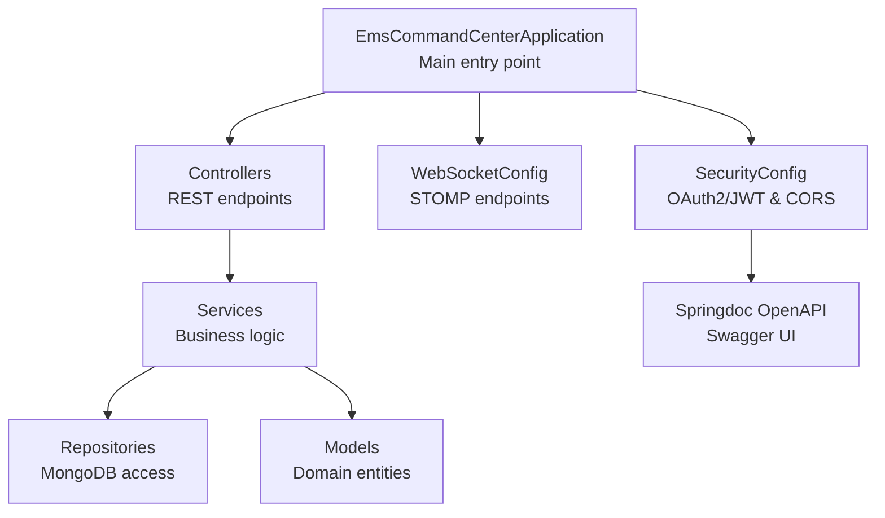
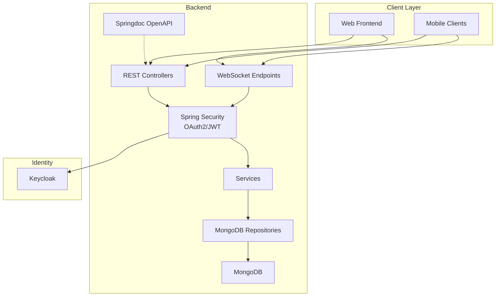
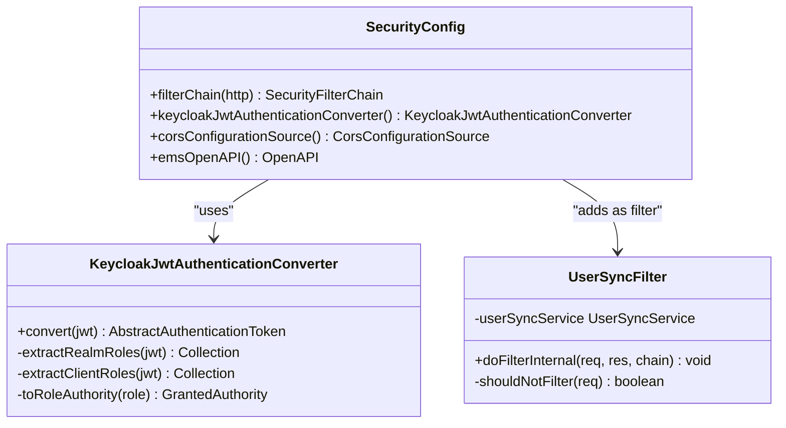
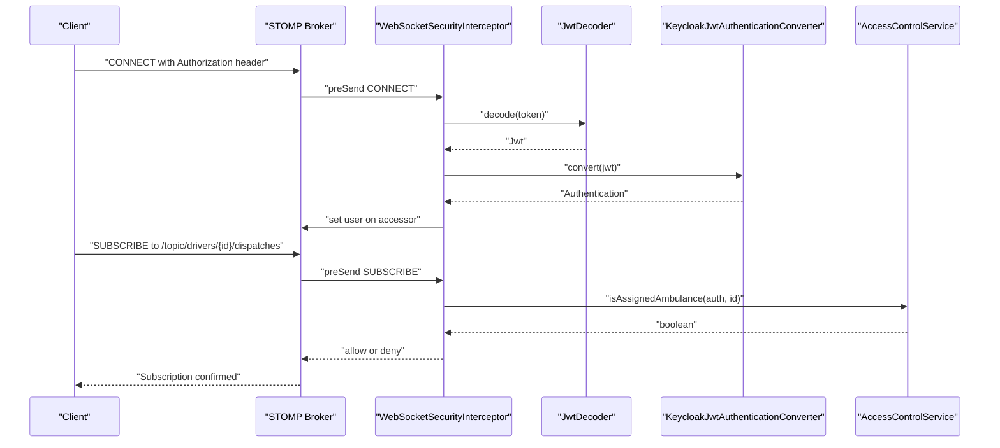
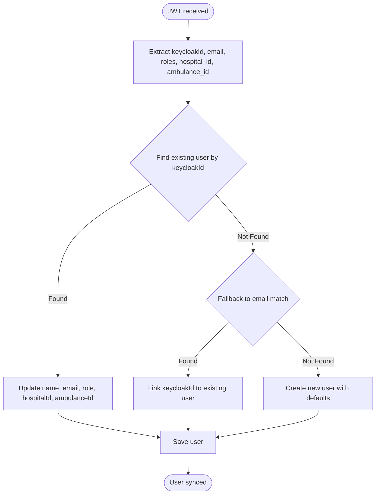
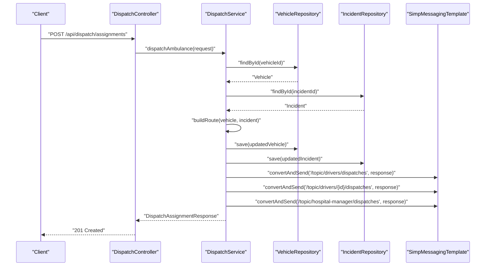
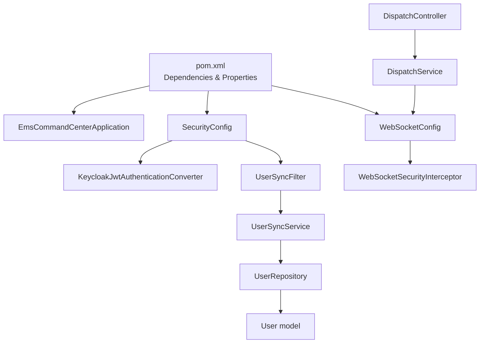

# Technology Stack

<cite>
**Referenced Files in This Document**
- [pom.xml](file://pom.xml)
- [application.yml](file://src/main/resources/application.yml)
- [EmsCommandCenterApplication.java](file://src/main/java/com/example/ems_command_center/EmsCommandCenterApplication.java)
- [SecurityConfig.java](file://src/main/java/com/example/ems_command_center/config/SecurityConfig.java)
- [WebSocketConfig.java](file://src/main/java/com/example/ems_command_center/config/WebSocketConfig.java)
- [KeycloakJwtAuthenticationConverter.java](file://src/main/java/com/example/ems_command_center/config/KeycloakJwtAuthenticationConverter.java)
- [UserSyncFilter.java](file://src/main/java/com/example/ems_command_center/config/UserSyncFilter.java)
- [WebSocketSecurityInterceptor.java](file://src/main/java/com/example/ems_command_center/config/WebSocketSecurityInterceptor.java)
- [UserRepository.java](file://src/main/java/com/example/ems_command_center/repository/UserRepository.java)
- [User.java](file://src/main/java/com/example/ems_command_center/model/User.java)
- [UserSyncService.java](file://src/main/java/com/example/ems_command_center/service/UserSyncService.java)
- [DispatchController.java](file://src/main/java/com/example/ems_command_center/controller/DispatchController.java)
- [DispatchService.java](file://src/main/java/com/example/ems_command_center/service/DispatchService.java)
- [Dockerfile](file://Dockerfile)
- [docker-compose.yml](file://docker-compose.yml)
</cite>

## Table of Contents
1. [Introduction](#introduction)
2. [Project Structure](#project-structure)
3. [Core Technologies](#core-technologies)
4. [Architecture Overview](#architecture-overview)
5. [Detailed Component Analysis](#detailed-component-analysis)
6. [Dependency Analysis](#dependency-analysis)
7. [Performance Considerations](#performance-considerations)
8. [Troubleshooting Guide](#troubleshooting-guide)
9. [Conclusion](#conclusion)

## Introduction
This document provides comprehensive technology stack documentation for the EMS Command Center backend. It explains the selection rationale for Spring Boot 3.4.3, Java 21, MongoDB for NoSQL persistence, and Keycloak for OAuth2/JWT authentication. Supporting frameworks such as Spring Security, Spring Data MongoDB, Spring WebSocket, and Springdoc OpenAPI are documented alongside their roles in enabling secure, real-time dispatch coordination for emergency services.

## Project Structure
The backend follows a conventional Spring Boot layout with layered architecture:
- Application entry point and configuration
- REST controllers for API endpoints
- Services implementing business logic
- Repositories for MongoDB persistence
- Models representing domain entities
- Security and WebSocket configurations
- Docker and docker-compose for containerized deployment

**Diagram sources**
- [EmsCommandCenterApplication.java:1-14](file://src/main/java/com/example/ems_command_center/EmsCommandCenterApplication.java#L1-L14)
- [SecurityConfig.java:1-156](file://src/main/java/com/example/ems_command_center/config/SecurityConfig.java#L1-L156)
- [WebSocketConfig.java:1-51](file://src/main/java/com/example/ems_command_center/config/WebSocketConfig.java#L1-L51)

**Section sources**
- [EmsCommandCenterApplication.java:1-14](file://src/main/java/com/example/ems_command_center/EmsCommandCenterApplication.java#L1-L14)
- [pom.xml:1-103](file://pom.xml#L1-L103)

## Core Technologies
This section documents the primary technologies and their roles in the system.

- Spring Boot 3.4.3
  - Purpose: Provides auto-configuration, embedded server, and production-ready features for rapid development.
  - Benefits: Reduces boilerplate, simplifies dependency management, and integrates seamlessly with Spring ecosystem components.
  - Version compatibility: Aligns with Java 21 and modern Spring Security/OAuth2 capabilities.

- Java 21
  - Purpose: Enables modern language features, performance improvements, and long-term support.
  - Benefits: Strong performance characteristics, enhanced concurrency, and improved memory management suitable for real-time systems.

- MongoDB (via Spring Data MongoDB)
  - Purpose: NoSQL document storage for flexible, schema-less data modeling aligned with operational needs.
  - Benefits: High write throughput, horizontal scaling, and JSON-like document queries ideal for incident and dispatch records.

- Keycloak (OAuth2/JWT)
  - Purpose: Centralized identity provider for secure authentication and authorization.
  - Benefits: Fine-grained role-based access control, standardized OIDC/JWT tokens, and seamless integration with Spring Security.

- Spring Security
  - Purpose: Secures HTTP and WebSocket endpoints with stateless JWT authentication and method-level authorization.
  - Benefits: Comprehensive protection against common threats, customizable access rules, and robust exception handling.

- Spring WebSocket
  - Purpose: Enables real-time bidirectional communication for live dispatch updates and driver/hospital coordination.
  - Benefits: STOMP over SockJS for broad browser compatibility and reliable event streaming.

- Springdoc OpenAPI
  - Purpose: Generates interactive API documentation and Swagger UI.
  - Benefits: Self-documenting APIs improve developer productivity and reduce integration friction.

- Lombok
  - Purpose: Reduces boilerplate code for models and DTOs.
  - Benefits: Cleaner codebases, fewer errors, and faster development cycles.

- jjwt
  - Purpose: Handles JWT decoding and verification for WebSocket and REST authentication.
  - Benefits: Secure token processing, standardized JWT handling, and runtime-friendly implementation.

**Section sources**
- [pom.xml:16-21](file://pom.xml#L16-L21)
- [application.yml:1-36](file://src/main/resources/application.yml#L1-L36)
- [SecurityConfig.java:1-156](file://src/main/java/com/example/ems_command_center/config/SecurityConfig.java#L1-L156)
- [WebSocketConfig.java:1-51](file://src/main/java/com/example/ems_command_center/config/WebSocketConfig.java#L1-L51)

## Architecture Overview
The system architecture combines REST APIs with real-time WebSocket channels, secured by Keycloak via Spring Security and documented with Springdoc OpenAPI. MongoDB stores operational data with repositories abstracting persistence.

**Diagram sources**
- [SecurityConfig.java:44-98](file://src/main/java/com/example/ems_command_center/config/SecurityConfig.java#L44-L98)
- [WebSocketConfig.java:20-49](file://src/main/java/com/example/ems_command_center/config/WebSocketConfig.java#L20-L49)
- [application.yml:10-17](file://src/main/resources/application.yml#L10-L17)
- [DispatchService.java:205-212](file://src/main/java/com/example/ems_command_center/service/DispatchService.java#L205-L212)

## Detailed Component Analysis

### Security and Authentication
The security configuration establishes stateless JWT authentication, role-based access control, and CORS policies. It integrates Keycloak via OAuth2 Resource Server and converts JWT claims to Spring Security authorities.

**Diagram sources**
- [SecurityConfig.java:26-103](file://src/main/java/com/example/ems_command_center/config/SecurityConfig.java#L26-L103)
- [KeycloakJwtAuthenticationConverter.java:18-87](file://src/main/java/com/example/ems_command_center/config/KeycloakJwtAuthenticationConverter.java#L18-L87)
- [UserSyncFilter.java:17-50](file://src/main/java/com/example/ems_command_center/config/UserSyncFilter.java#L17-L50)

**Section sources**
- [SecurityConfig.java:44-98](file://src/main/java/com/example/ems_command_center/config/SecurityConfig.java#L44-L98)
- [KeycloakJwtAuthenticationConverter.java:29-41](file://src/main/java/com/example/ems_command_center/config/KeycloakJwtAuthenticationConverter.java#L29-L41)
- [UserSyncFilter.java:26-42](file://src/main/java/com/example/ems_command_center/config/UserSyncFilter.java#L26-L42)

### WebSocket Real-Time Coordination
WebSocket endpoints enable real-time updates for dispatch assignments and driver/hospital coordination. The security interceptor validates JWT tokens and enforces topic-level authorization.

**Diagram sources**
- [WebSocketSecurityInterceptor.java:34-111](file://src/main/java/com/example/ems_command_center/config/WebSocketSecurityInterceptor.java#L34-L111)
- [WebSocketConfig.java:26-49](file://src/main/java/com/example/ems_command_center/config/WebSocketConfig.java#L26-L49)

**Section sources**
- [WebSocketConfig.java:20-49](file://src/main/java/com/example/ems_command_center/config/WebSocketConfig.java#L20-L49)
- [WebSocketSecurityInterceptor.java:34-111](file://src/main/java/com/example/ems_command_center/config/WebSocketSecurityInterceptor.java#L34-L111)

### User Synchronization and Role Management
User synchronization ensures that Keycloak identities are mapped to local user profiles, updating roles and associations dynamically. This supports real-time dispatch coordination by aligning user permissions with operational contexts.

**Diagram sources**
- [UserSyncService.java:30-112](file://src/main/java/com/example/ems_command_center/service/UserSyncService.java#L30-L112)
- [UserRepository.java:8-14](file://src/main/java/com/example/ems_command_center/repository/UserRepository.java#L8-L14)

**Section sources**
- [UserSyncService.java:30-112](file://src/main/java/com/example/ems_command_center/service/UserSyncService.java#L30-L112)
- [UserRepository.java:8-14](file://src/main/java/com/example/ems_command_center/repository/UserRepository.java#L8-L14)
- [User.java:8-32](file://src/main/java/com/example/ems_command_center/model/User.java#L8-L32)

### Dispatch Operations and Real-Time Notifications
Dispatch operations compute routes, update vehicle/incident states, and publish real-time notifications to relevant topics for drivers and hospital managers.

**Diagram sources**
- [DispatchController.java:50-55](file://src/main/java/com/example/ems_command_center/controller/DispatchController.java#L50-L55)
- [DispatchService.java:53-119](file://src/main/java/com/example/ems_command_center/service/DispatchService.java#L53-L119)
- [DispatchService.java:205-212](file://src/main/java/com/example/ems_command_center/service/DispatchService.java#L205-L212)

**Section sources**
- [DispatchController.java:50-55](file://src/main/java/com/example/ems_command_center/controller/DispatchController.java#L50-L55)
- [DispatchService.java:53-119](file://src/main/java/com/example/ems_command_center/service/DispatchService.java#L53-L119)

## Dependency Analysis
The following diagram outlines key dependencies among major components and external systems.

**Diagram sources**
- [pom.xml:22-84](file://pom.xml#L22-L84)
- [EmsCommandCenterApplication.java:6-11](file://src/main/java/com/example/ems_command_center/EmsCommandCenterApplication.java#L6-L11)
- [SecurityConfig.java:26-41](file://src/main/java/com/example/ems_command_center/config/SecurityConfig.java#L26-L41)
- [WebSocketConfig.java:10-18](file://src/main/java/com/example/ems_command_center/config/WebSocketConfig.java#L10-L18)
- [UserSyncService.java:16-23](file://src/main/java/com/example/ems_command_center/service/UserSyncService.java#L16-L23)
- [UserRepository.java:8-14](file://src/main/java/com/example/ems_command_center/repository/UserRepository.java#L8-L14)
- [User.java:8-32](file://src/main/java/com/example/ems_command_center/model/User.java#L8-L32)
- [DispatchController.java:22-31](file://src/main/java/com/example/ems_command_center/controller/DispatchController.java#L22-L31)
- [DispatchService.java:21-38](file://src/main/java/com/example/ems_command_center/service/DispatchService.java#L21-L38)

**Section sources**
- [pom.xml:22-84](file://pom.xml#L22-L84)

## Performance Considerations
- Statelessness: JWT-based stateless sessions minimize server-side state and improve scalability.
- Real-time Efficiency: WebSocket channels reduce polling overhead and enable immediate dispatch updates.
- Database Design: MongoDB's flexible schema supports rapid iteration of incident and vehicle data structures.
- Containerization: Alpine-based runtime reduces footprint and startup time for container deployments.

[No sources needed since this section provides general guidance]

## Troubleshooting Guide
Common issues and resolutions:
- Unauthorized Requests: Verify Keycloak access tokens and client configuration. The security configuration returns structured JSON errors for authentication failures.
- Forbidden Access: Confirm user roles and endpoint authorization rules. The configuration enforces granular role checks per endpoint.
- WebSocket Authentication Failures: Ensure Authorization headers are present and valid during CONNECT. The interceptor decodes tokens and validates subscriptions.
- User Sync Failures: The filter logs warnings but does not block requests if synchronization fails.

**Section sources**
- [SecurityConfig.java:138-154](file://src/main/java/com/example/ems_command_center/config/SecurityConfig.java#L138-L154)
- [WebSocketSecurityInterceptor.java:47-54](file://src/main/java/com/example/ems_command_center/config/WebSocketSecurityInterceptor.java#L47-L54)
- [UserSyncFilter.java:33-39](file://src/main/java/com/example/ems_command_center/config/UserSyncFilter.java#L33-L39)

## Conclusion
The EMS Command Center backend leverages a modern, cloud-native stack optimized for real-time emergency operations. Spring Boot 3.4.3 and Java 21 provide a robust foundation, while MongoDB offers scalable persistence. Keycloak secures the system with OAuth2/JWT, and Spring Security enforces fine-grained authorization. Spring WebSocket enables efficient, real-time coordination between dispatchers, drivers, and hospital managers, complemented by Springdoc OpenAPI for self-documenting APIs. Together, these technologies deliver reliability, scalability, and operational effectiveness for emergency services.