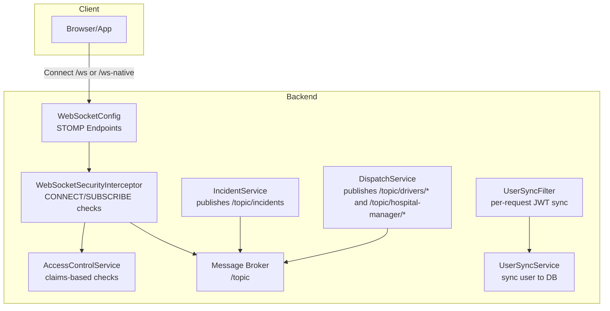
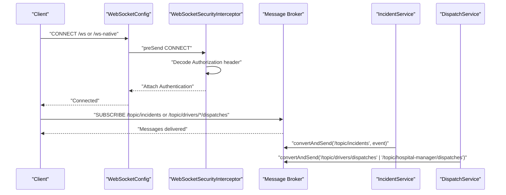
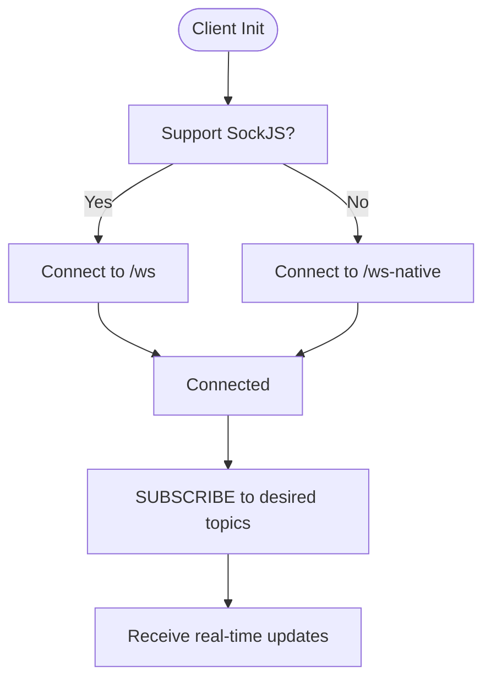
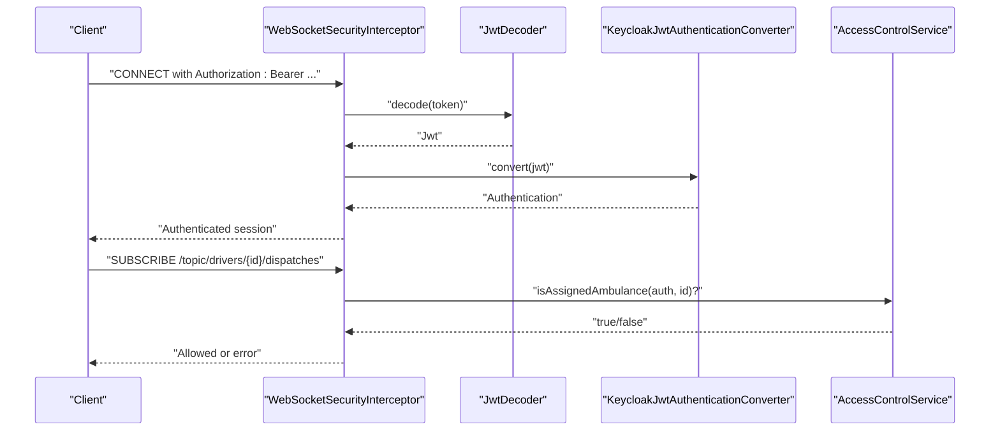
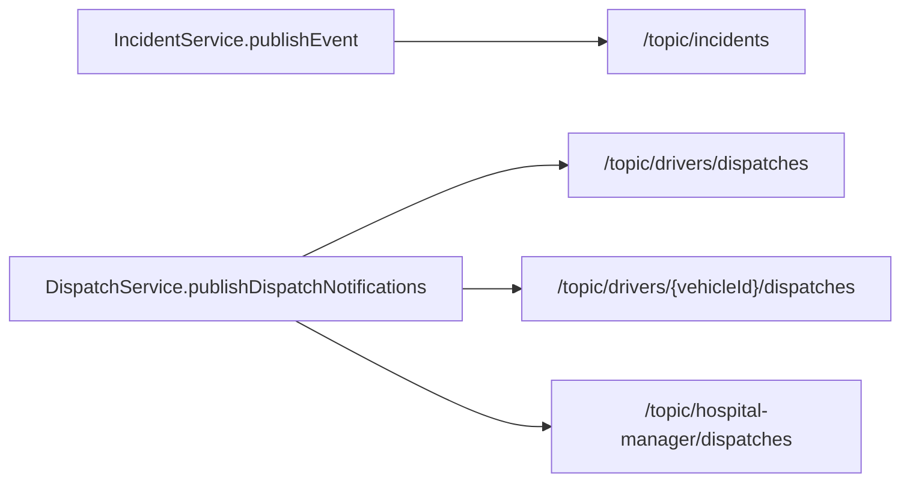
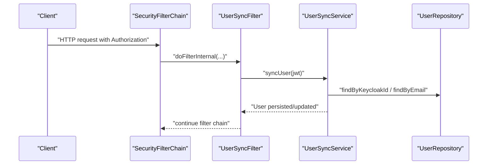
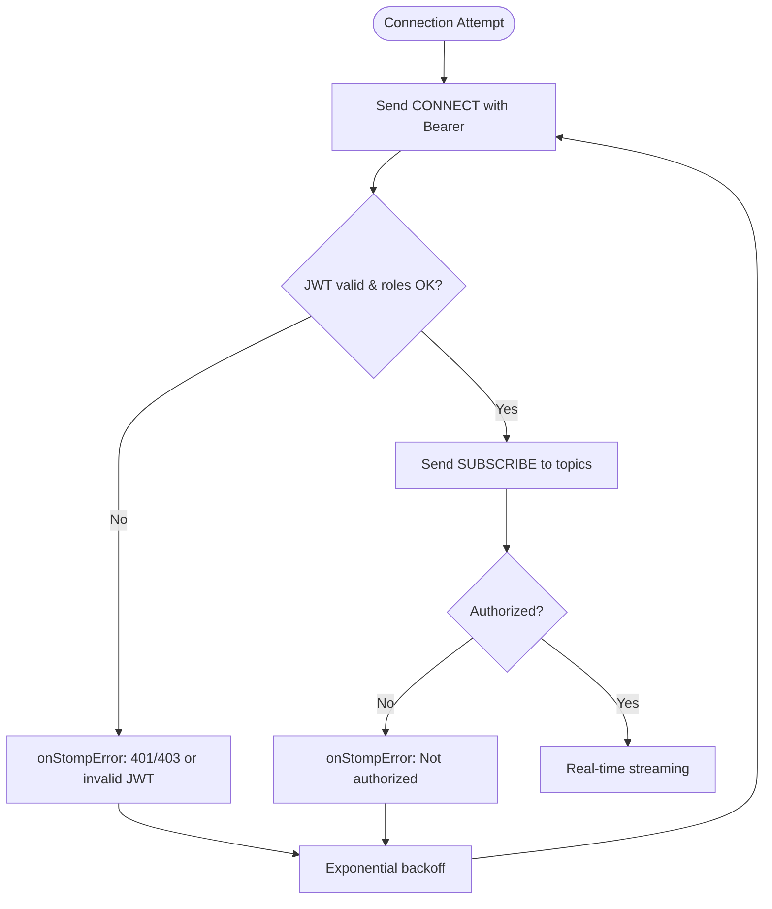
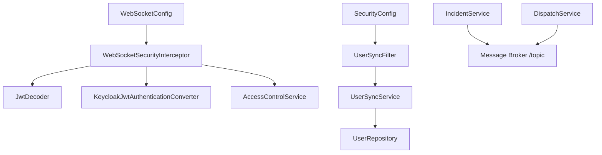

# Client-Side Integration

<cite>
**Referenced Files in This Document**
- [WebSocketConfig.java](file://src/main/java/com/example/ems_command_center/config/WebSocketConfig.java)
- [WebSocketSecurityInterceptor.java](file://src/main/java/com/example/ems_command_center/config/WebSocketSecurityInterceptor.java)
- [SecurityConfig.java](file://src/main/java/com/example/ems_command_center/config/SecurityConfig.java)
- [UserSyncFilter.java](file://src/main/java/com/example/ems_command_center/config/UserSyncFilter.java)
- [UserSyncService.java](file://src/main/java/com/example/ems_command_center/service/UserSyncService.java)
- [UserRepository.java](file://src/main/java/com/example/ems_command_center/repository/UserRepository.java)
- [AccessControlService.java](file://src/main/java/com/example/ems_command_center/service/AccessControlService.java)
- [IncidentService.java](file://src/main/java/com/example/ems_command_center/service/IncidentService.java)
- [DispatchService.java](file://src/main/java/com/example/ems_command_center/service/DispatchService.java)
- [ApiExceptionHandler.java](file://src/main/java/com/example/ems_command_center/config/ApiExceptionHandler.java)
- [application.yml](file://src/main/resources/application.yml)
</cite>

## Table of Contents
1. [Introduction](#introduction)
2. [Project Structure](#project-structure)
3. [Core Components](#core-components)
4. [Architecture Overview](#architecture-overview)
5. [Detailed Component Analysis](#detailed-component-analysis)
6. [Dependency Analysis](#dependency-analysis)
7. [Performance Considerations](#performance-considerations)
8. [Troubleshooting Guide](#troubleshooting-guide)
9. [Conclusion](#conclusion)
10. [Appendices](#appendices)

## Introduction
This document explains client-side WebSocket integration for the EMS Command Center backend. It covers connection establishment for both native WebSocket and SockJS clients, fallback mechanisms, subscription patterns for real-time events, message handling, and user synchronization via JWT. It also documents error handling for connection and authorization failures, and provides practical guidance for robust reconnection and lifecycle management.

## Project Structure
The WebSocket integration centers around Spring WebSocket and STOMP support with SockJS fallback. Security is enforced via OAuth2 JWT and custom channel interceptors. Real-time updates are published to topics from domain services.

**Diagram sources**
- [WebSocketConfig.java:31-49](file://src/main/java/com/example/ems_command_center/config/WebSocketConfig.java#L31-L49)
- [WebSocketSecurityInterceptor.java:34-111](file://src/main/java/com/example/ems_command_center/config/WebSocketSecurityInterceptor.java#L34-L111)
- [IncidentService.java:84-104](file://src/main/java/com/example/ems_command_center/service/IncidentService.java#L84-L104)
- [DispatchService.java:205-212](file://src/main/java/com/example/ems_command_center/service/DispatchService.java#L205-L212)
- [UserSyncFilter.java:26-42](file://src/main/java/com/example/ems_command_center/config/UserSyncFilter.java#L26-L42)
- [UserSyncService.java:30-65](file://src/main/java/com/example/ems_command_center/service/UserSyncService.java#L30-L65)
- [AccessControlService.java:13-36](file://src/main/java/com/example/ems_command_center/service/AccessControlService.java#L13-L36)

**Section sources**
- [WebSocketConfig.java:20-49](file://src/main/java/com/example/ems_command_center/config/WebSocketConfig.java#L20-L49)
- [SecurityConfig.java:44-98](file://src/main/java/com/example/ems_command_center/config/SecurityConfig.java#L44-L98)
- [application.yml:10-17](file://src/main/resources/application.yml#L10-L17)

## Core Components
- WebSocket configuration exposes two endpoints:
  - Native WebSocket endpoint for modern clients.
  - SockJS endpoint for environments where WebSocket is blocked or needs fallback.
- Security interceptor validates CONNECT tokens and enforces SUBSCRIBE authorization per destination and roles.
- User synchronization filter ensures user records are up-to-date from JWT claims on each request.
- Domain services publish real-time updates to topics for clients to subscribe.

**Section sources**
- [WebSocketConfig.java:31-49](file://src/main/java/com/example/ems_command_center/config/WebSocketConfig.java#L31-L49)
- [WebSocketSecurityInterceptor.java:34-111](file://src/main/java/com/example/ems_command_center/config/WebSocketSecurityInterceptor.java#L34-L111)
- [UserSyncFilter.java:26-42](file://src/main/java/com/example/ems_command_center/config/UserSyncFilter.java#L26-L42)
- [UserSyncService.java:30-65](file://src/main/java/com/example/ems_command_center/service/UserSyncService.java#L30-L65)
- [IncidentService.java:84-104](file://src/main/java/com/example/ems_command_center/service/IncidentService.java#L84-L104)
- [DispatchService.java:205-212](file://src/main/java/com/example/ems_command_center/service/DispatchService.java#L205-L212)

## Architecture Overview
The backend uses Spring WebSocket with STOMP over either native WebSocket or SockJS. Clients connect to /ws (SockJS) or /ws-native (WebSocket). On CONNECT, the interceptor decodes the Authorization header, validates the JWT, and attaches an Authentication to the session. On SUBSCRIBE, destinations are validated against roles and claims. Services publish to topics that clients subscribe to for real-time updates.

**Diagram sources**
- [WebSocketConfig.java:31-49](file://src/main/java/com/example/ems_command_center/config/WebSocketConfig.java#L31-L49)
- [WebSocketSecurityInterceptor.java:34-111](file://src/main/java/com/example/ems_command_center/config/WebSocketSecurityInterceptor.java#L34-L111)
- [IncidentService.java:84-104](file://src/main/java/com/example/ems_command_center/service/IncidentService.java#L84-L104)
- [DispatchService.java:205-212](file://src/main/java/com/example/ems_command_center/service/DispatchService.java#L205-L212)

## Detailed Component Analysis

### Connection Establishment: Native WebSocket vs SockJS
- Endpoints:
  - /ws-native: Native WebSocket with CORS origin patterns configured.
  - /ws: SockJS-enabled fallback endpoint with the same origins.
- Origins: Localhost ports commonly used by frontend dev servers are whitelisted.
- Client selection:
  - Prefer native WebSocket (/ws-native) when available.
  - Use /ws when WebSocket is blocked or needs compatibility.

**Diagram sources**
- [WebSocketConfig.java:31-49](file://src/main/java/com/example/ems_command_center/config/WebSocketConfig.java#L31-L49)
- [SecurityConfig.java:58-60](file://src/main/java/com/example/ems_command_center/config/SecurityConfig.java#L58-L60)

**Section sources**
- [WebSocketConfig.java:31-49](file://src/main/java/com/example/ems_command_center/config/WebSocketConfig.java#L31-L49)
- [SecurityConfig.java:58-60](file://src/main/java/com/example/ems_command_center/config/SecurityConfig.java#L58-L60)

### Authentication and Authorization on CONNECT and SUBSCRIBE
- CONNECT:
  - Reads Authorization header, expects Bearer token.
  - Decodes JWT and converts to Authentication.
  - Attaches Authentication to the STOMP session.
- SUBSCRIBE:
  - Validates destination prefixes:
    - /topic/drivers/: Admin-only except special cases; otherwise requires assignment to the ambulance.
    - /topic/hospital-manager/ and /topic/hospitals/: Admin or Manager; optional hospital scoping.
  - Uses AccessControlService to check claims hospital_id and ambulance_id.

**Diagram sources**
- [WebSocketSecurityInterceptor.java:34-111](file://src/main/java/com/example/ems_command_center/config/WebSocketSecurityInterceptor.java#L34-L111)
- [AccessControlService.java:13-36](file://src/main/java/com/example/ems_command_center/service/AccessControlService.java#L13-L36)

**Section sources**
- [WebSocketSecurityInterceptor.java:34-111](file://src/main/java/com/example/ems_command_center/config/WebSocketSecurityInterceptor.java#L34-L111)
- [AccessControlService.java:13-36](file://src/main/java/com/example/ems_command_center/service/AccessControlService.java#L13-L36)

### Subscription Patterns and Real-Time Topics
- General incidents:
  - Topic: /topic/incidents
  - Publishers: IncidentService
  - Subscribers: ADMIN, USER, DRIVER
- Dispatch notifications:
  - General: /topic/drivers/dispatches
  - Scoped to ambulance: /topic/drivers/{vehicleId}/dispatches
  - Hospital manager: /topic/hospital-manager/dispatches
  - Publishers: DispatchService
- Hospital-scoped topics:
  - /topic/hospitals/{hospitalId}/...
  - Access restricted to ADMIN or MANAGER, or assigned hospital

**Diagram sources**
- [IncidentService.java:84-104](file://src/main/java/com/example/ems_command_center/service/IncidentService.java#L84-L104)
- [DispatchService.java:205-212](file://src/main/java/com/example/ems_command_center/service/DispatchService.java#L205-L212)

**Section sources**
- [IncidentService.java:84-104](file://src/main/java/com/example/ems_command_center/service/IncidentService.java#L84-L104)
- [DispatchService.java:205-212](file://src/main/java/com/example/ems_command_center/service/DispatchService.java#L205-L212)

### Client-Side Message Handling and Callbacks
- Typical callback pattern:
  - onConnect: Initialize subscriptions after successful connection.
  - onDisconnect: Clear timers, retry logic, and notify UI.
  - onStompError: Handle invalid credentials or unauthorized subscriptions.
  - onMessage: Update UI with received payload (e.g., IncidentEvent, DispatchAssignmentResponse).
- Example flows:
  - Subscribe to /topic/incidents and render incident updates.
  - Subscribe to /topic/drivers/dispatches for ADMIN/Manager overview.
  - Subscribe to /topic/drivers/{myAmbulanceId}/dispatches for DRIVER.

[No sources needed since this section provides conceptual guidance]

### UserSyncFilter and Session Management
- Per-request synchronization:
  - Runs after BearerTokenAuthenticationFilter.
  - Extracts JWT from SecurityContext, syncs user to MongoDB via UserSyncService.
  - Non-blocking on failure; logs warning and continues request processing.
- Implications:
  - Ensures user record reflects latest JWT claims (roles, hospital_id, ambulance_id).
  - Supports AccessControlService checks for topic subscriptions.

**Diagram sources**
- [SecurityConfig.java:95-95](file://src/main/java/com/example/ems_command_center/config/SecurityConfig.java#L95-L95)
- [UserSyncFilter.java:26-42](file://src/main/java/com/example/ems_command_center/config/UserSyncFilter.java#L26-L42)
- [UserSyncService.java:30-65](file://src/main/java/com/example/ems_command_center/service/UserSyncService.java#L30-L65)
- [UserRepository.java:8-14](file://src/main/java/com/example/ems_command_center/repository/UserRepository.java#L8-L14)

**Section sources**
- [UserSyncFilter.java:26-42](file://src/main/java/com/example/ems_command_center/config/UserSyncFilter.java#L26-L42)
- [UserSyncService.java:30-65](file://src/main/java/com/example/ems_command_center/service/UserSyncService.java#L30-L65)
- [UserRepository.java:8-14](file://src/main/java/com/example/ems_command_center/repository/UserRepository.java#L8-L14)
- [SecurityConfig.java:95-95](file://src/main/java/com/example/ems_command_center/config/SecurityConfig.java#L95-L95)

### Error Handling and Reconnection Strategies
- Connection failures:
  - Unauthorized: JSON entry point returns 401 with a descriptive message.
  - Forbidden: JSON handler returns 403 with a descriptive message.
- Authentication errors on CONNECT:
  - Invalid JWT triggers an argument exception during CONNECT preSend.
- Message delivery failures:
  - Destination authorization failures are thrown during SUBSCRIBE preSend.
- Reconnection recommendations:
  - Implement exponential backoff on client.
  - Retry CONNECT after transient network errors.
  - Resubscribe to required topics after reconnect.
  - Handle onDisconnect to pause polling and resume on onConnect.

**Diagram sources**
- [SecurityConfig.java:138-154](file://src/main/java/com/example/ems_command_center/config/SecurityConfig.java#L138-L154)
- [WebSocketSecurityInterceptor.java:34-111](file://src/main/java/com/example/ems_command_center/config/WebSocketSecurityInterceptor.java#L34-L111)
- [ApiExceptionHandler.java:16-25](file://src/main/java/com/example/ems_command_center/config/ApiExceptionHandler.java#L16-L25)

**Section sources**
- [SecurityConfig.java:138-154](file://src/main/java/com/example/ems_command_center/config/SecurityConfig.java#L138-L154)
- [ApiExceptionHandler.java:16-25](file://src/main/java/com/example/ems_command_center/config/ApiExceptionHandler.java#L16-L25)
- [WebSocketSecurityInterceptor.java:34-111](file://src/main/java/com/example/ems_command_center/config/WebSocketSecurityInterceptor.java#L34-L111)

## Dependency Analysis
- WebSocketConfig registers endpoints and enables a simple broker for /topic destinations.
- WebSocketSecurityInterceptor depends on JwtDecoder, KeycloakJwtAuthenticationConverter, and AccessControlService.
- SecurityConfig adds UserSyncFilter after BearerTokenAuthenticationFilter and configures OAuth2 resource server with JWT JWK set URI.
- UserSyncService depends on UserRepository and handles race conditions on creation.
- IncidentService and DispatchService publish to topics using SimpMessagingTemplate.

**Diagram sources**
- [WebSocketConfig.java:20-49](file://src/main/java/com/example/ems_command_center/config/WebSocketConfig.java#L20-L49)
- [WebSocketSecurityInterceptor.java:20-32](file://src/main/java/com/example/ems_command_center/config/WebSocketSecurityInterceptor.java#L20-L32)
- [SecurityConfig.java:95-95](file://src/main/java/com/example/ems_command_center/config/SecurityConfig.java#L95-L95)
- [UserSyncService.java:19-23](file://src/main/java/com/example/ems_command_center/service/UserSyncService.java#L19-L23)
- [UserRepository.java:8-14](file://src/main/java/com/example/ems_command_center/repository/UserRepository.java#L8-L14)
- [IncidentService.java:18-24](file://src/main/java/com/example/ems_command_center/service/IncidentService.java#L18-L24)
- [DispatchService.java:1-20](file://src/main/java/com/example/ems_command_center/service/DispatchService.java#L1-L20)

**Section sources**
- [WebSocketConfig.java:20-49](file://src/main/java/com/example/ems_command_center/config/WebSocketConfig.java#L20-L49)
- [WebSocketSecurityInterceptor.java:20-32](file://src/main/java/com/example/ems_command_center/config/WebSocketSecurityInterceptor.java#L20-L32)
- [SecurityConfig.java:95-95](file://src/main/java/com/example/ems_command_center/config/SecurityConfig.java#L95-L95)
- [UserSyncService.java:19-23](file://src/main/java/com/example/ems_command_center/service/UserSyncService.java#L19-L23)
- [UserRepository.java:8-14](file://src/main/java/com/example/ems_command_center/repository/UserRepository.java#L8-L14)
- [IncidentService.java:18-24](file://src/main/java/com/example/ems_command_center/service/IncidentService.java#L18-L24)
- [DispatchService.java:1-20](file://src/main/java/com/example/ems_command_center/service/DispatchService.java#L1-L20)

## Performance Considerations
- Keep subscriptions minimal to reduce broker overhead.
- Batch UI updates when receiving bursts of events.
- Use SockJS only when necessary; native WebSocket is more efficient.
- Avoid frequent re-subscription; reuse sessions and resubscribe on reconnect.

[No sources needed since this section provides general guidance]

## Troubleshooting Guide
- 401 Unauthorized:
  - Ensure a valid Bearer token is sent in the Authorization header on CONNECT.
  - Verify KEYCLOAK_JWK_SET_URI and client configuration.
- 403 Forbidden:
  - Confirm the token’s roles and claims match the intended access.
- “Invalid JWT token” during CONNECT:
  - Token may be expired or malformed; refresh or re-authenticate.
- “Not authorized to subscribe”:
  - Check roles and claims (hospital_id, ambulance_id) for the destination.
- User not appearing in UI:
  - Confirm UserSyncFilter runs and UserSyncService persists the user record.

**Section sources**
- [SecurityConfig.java:138-154](file://src/main/java/com/example/ems_command_center/config/SecurityConfig.java#L138-L154)
- [WebSocketSecurityInterceptor.java:51-53](file://src/main/java/com/example/ems_command_center/config/WebSocketSecurityInterceptor.java#L51-L53)
- [UserSyncFilter.java:34-38](file://src/main/java/com/example/ems_command_center/config/UserSyncFilter.java#L34-L38)
- [application.yml:10-17](file://src/main/resources/application.yml#L10-L17)

## Conclusion
The backend provides a secure, standards-based WebSocket integration with SockJS fallback, robust authorization per destination, and per-request user synchronization from JWT. Clients should connect to /ws or /ws-native, subscribe to appropriate topics, and implement resilient reconnection and error handling.

[No sources needed since this section summarizes without analyzing specific files]

## Appendices

### Practical Examples and Best Practices
- Connect to /ws for fallback compatibility; prefer /ws-native when supported.
- After CONNECT, subscribe to:
  - /topic/incidents for general incident updates.
  - /topic/drivers/dispatches for administrative overview.
  - /topic/drivers/{myAmbulanceId}/dispatches for driver-specific alerts.
  - /topic/hospital-manager/dispatches for manager coordination.
- Implement:
  - Exponential backoff on disconnect.
  - Re-subscription on reconnect.
  - UI feedback for 401/403 and authorization errors.
  - Debounced rendering for high-frequency updates.

[No sources needed since this section provides conceptual guidance]