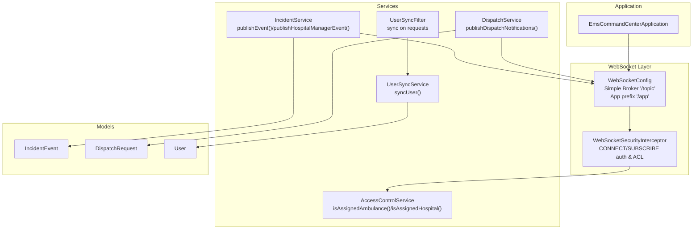
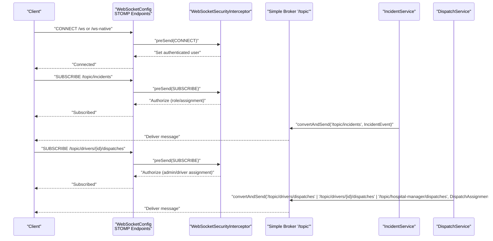
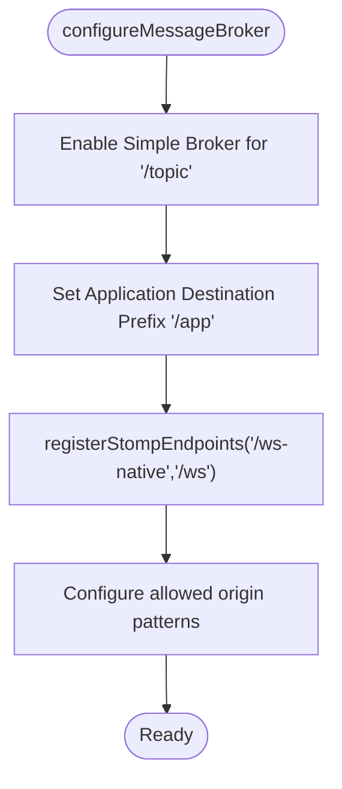
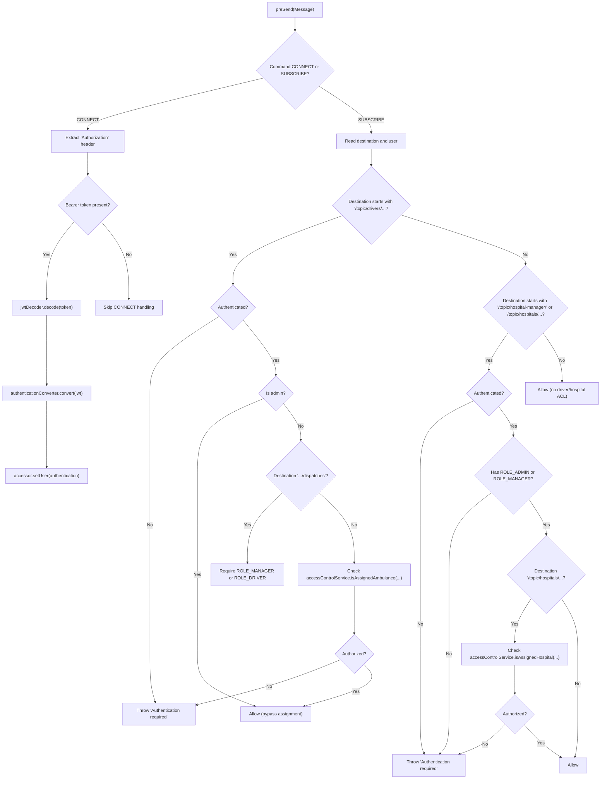
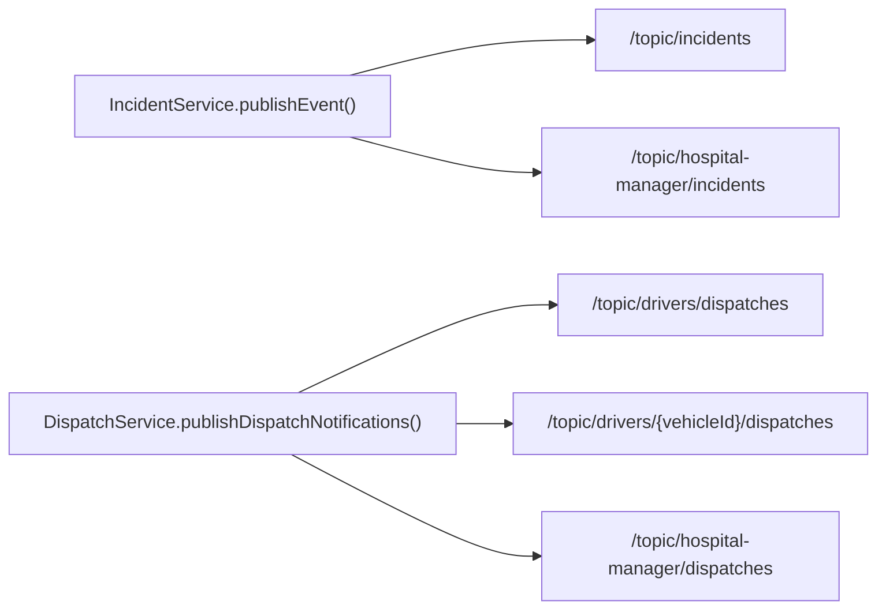
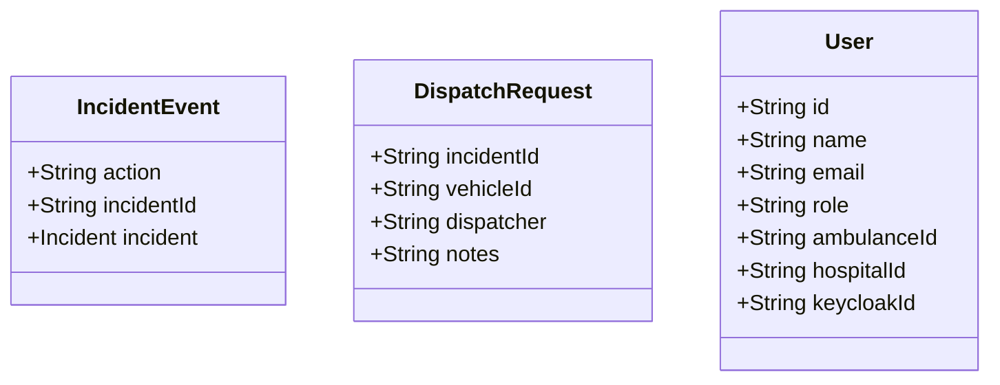
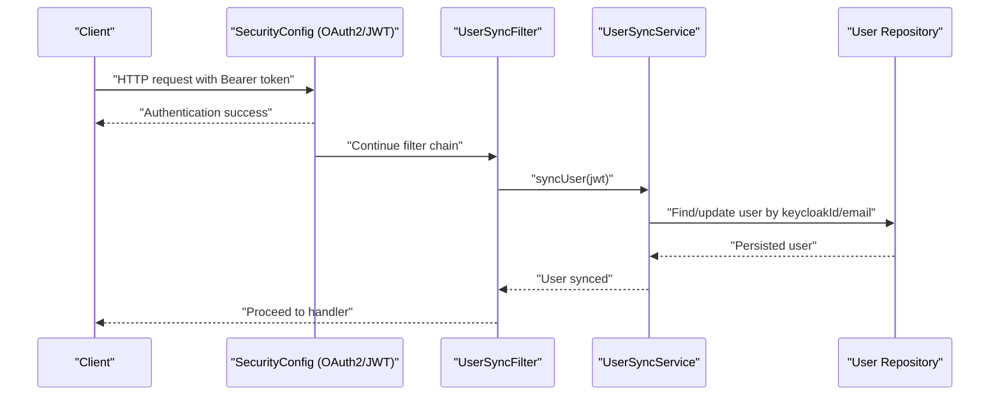
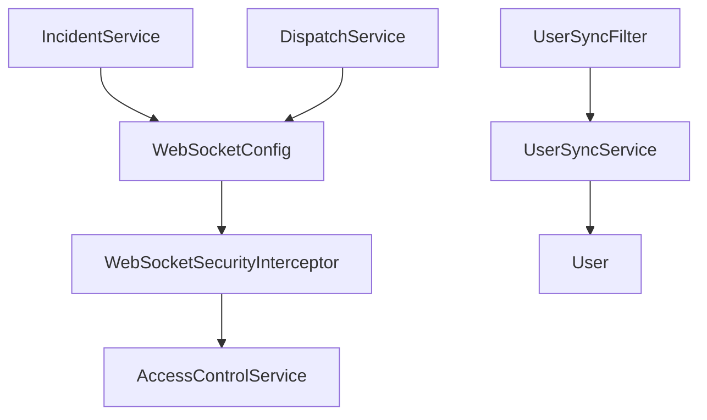

# Message Broker and Destinations

<cite>
**Referenced Files in This Document**
- [EmsCommandCenterApplication.java](file://src/main/java/com/example/ems_command_center/EmsCommandCenterApplication.java)
- [WebSocketConfig.java](file://src/main/java/com/example/ems_command_center/config/WebSocketConfig.java)
- [WebSocketSecurityInterceptor.java](file://src/main/java/com/example/ems_command_center/config/WebSocketSecurityInterceptor.java)
- [SecurityConfig.java](file://src/main/java/com/example/ems_command_center/config/SecurityConfig.java)
- [UserSyncFilter.java](file://src/main/java/com/example/ems_command_center/config/UserSyncFilter.java)
- [AccessControlService.java](file://src/main/java/com/example/ems_command_center/service/AccessControlService.java)
- [IncidentService.java](file://src/main/java/com/example/ems_command_center/service/IncidentService.java)
- [DispatchService.java](file://src/main/java/com/example/ems_command_center/service/DispatchService.java)
- [UserSyncService.java](file://src/main/java/com/example/ems_command_center/service/UserSyncService.java)
- [User.java](file://src/main/java/com/example/ems_command_center/model/User.java)
- [IncidentEvent.java](file://src/main/java/com/example/ems_command_center/model/IncidentEvent.java)
- [DispatchRequest.java](file://src/main/java/com/example/ems_command_center/model/DispatchRequest.java)
</cite>

## Table of Contents
1. [Introduction](#introduction)
2. [Project Structure](#project-structure)
3. [Core Components](#core-components)
4. [Architecture Overview](#architecture-overview)
5. [Detailed Component Analysis](#detailed-component-analysis)
6. [Dependency Analysis](#dependency-analysis)
7. [Performance Considerations](#performance-considerations)
8. [Troubleshooting Guide](#troubleshooting-guide)
9. [Conclusion](#conclusion)

## Introduction
This document explains the WebSocket message broker architecture and destination routing used by the EMS Command Center backend. It focuses on the Simple Broker configuration for publish-subscribe channels under the "/topic" prefix, application destinations prefixed by "/app", and the routing of real-time events such as dispatch assignments, incident status changes, and user synchronization. It also covers message serialization/deserialization, payload formats, error propagation, and practical examples of publish-subscribe patterns, scoped queues, and acknowledgment strategies.

## Project Structure
The WebSocket subsystem is configured via a dedicated configuration class and secured by a channel interceptor. Services publish events to STOMP destinations, while clients subscribe to topics for real-time updates. Supporting services handle user synchronization and access control checks.

**Diagram sources**
- [EmsCommandCenterApplication.java:1-14](file://src/main/java/com/example/ems_command_center/EmsCommandCenterApplication.java#L1-L14)
- [WebSocketConfig.java:10-50](file://src/main/java/com/example/ems_command_center/config/WebSocketConfig.java#L10-L50)
- [WebSocketSecurityInterceptor.java:17-112](file://src/main/java/com/example/ems_command_center/config/WebSocketSecurityInterceptor.java#L17-L112)
- [AccessControlService.java:7-37](file://src/main/java/com/example/ems_command_center/service/AccessControlService.java#L7-L37)
- [IncidentService.java:15-104](file://src/main/java/com/example/ems_command_center/service/IncidentService.java#L15-L104)
- [DispatchService.java:21-212](file://src/main/java/com/example/ems_command_center/service/DispatchService.java#L21-L212)
- [UserSyncFilter.java:17-50](file://src/main/java/com/example/ems_command_center/config/UserSyncFilter.java#L17-L50)
- [UserSyncService.java:16-181](file://src/main/java/com/example/ems_command_center/service/UserSyncService.java#L16-L181)
- [IncidentEvent.java:1-8](file://src/main/java/com/example/ems_command_center/model/IncidentEvent.java#L1-L8)
- [DispatchRequest.java:1-9](file://src/main/java/com/example/ems_command_center/model/DispatchRequest.java#L1-L9)
- [User.java:8-187](file://src/main/java/com/example/ems_command_center/model/User.java#L8-L187)

**Section sources**
- [EmsCommandCenterApplication.java:1-14](file://src/main/java/com/example/ems_command_center/EmsCommandCenterApplication.java#L1-L14)
- [WebSocketConfig.java:10-50](file://src/main/java/com/example/ems_command_center/config/WebSocketConfig.java#L10-L50)

## Core Components
- WebSocketConfig: Enables a Simple Broker for "/topic" destinations and sets "/app" as the application destination prefix. Registers STOMP endpoints with CORS origin patterns and SockJS support.
- WebSocketSecurityInterceptor: Validates CONNECT tokens and enforces authorization rules during SUBSCRIBE, including role-based and assignment-based access checks for driver and hospital topics.
- SecurityConfig: Configures OAuth2/JWT authentication and CORS for HTTP endpoints, including WebSocket endpoints.
- AccessControlService: Provides helper methods to check if a user is assigned to a specific ambulance or hospital using JWT claims.
- IncidentService: Publishes incident lifecycle events to "/topic/incidents" and "/topic/hospital-manager/incidents".
- DispatchService: Publishes dispatch notifications to three destinations: general drivers, ambulance-scoped drivers, and hospital manager.
- UserSyncFilter and UserSyncService: Synchronize authenticated users from JWT claims into the database after successful authentication.
- Models: IncidentEvent and DispatchRequest define serialized payloads for published messages.

**Section sources**
- [WebSocketConfig.java:20-49](file://src/main/java/com/example/ems_command_center/config/WebSocketConfig.java#L20-L49)
- [WebSocketSecurityInterceptor.java:34-111](file://src/main/java/com/example/ems_command_center/config/WebSocketSecurityInterceptor.java#L34-L111)
- [SecurityConfig.java:43-98](file://src/main/java/com/example/ems_command_center/config/SecurityConfig.java#L43-L98)
- [AccessControlService.java:10-36](file://src/main/java/com/example/ems_command_center/service/AccessControlService.java#L10-L36)
- [IncidentService.java:84-104](file://src/main/java/com/example/ems_command_center/service/IncidentService.java#L84-L104)
- [DispatchService.java:205-212](file://src/main/java/com/example/ems_command_center/service/DispatchService.java#L205-L212)
- [UserSyncFilter.java:26-42](file://src/main/java/com/example/ems_command_center/config/UserSyncFilter.java#L26-L42)
- [UserSyncService.java:30-61](file://src/main/java/com/example/ems_command_center/service/UserSyncService.java#L30-L61)
- [IncidentEvent.java:3-8](file://src/main/java/com/example/ems_command_center/model/IncidentEvent.java#L3-L8)
- [DispatchRequest.java:3-9](file://src/main/java/com/example/ems_command_center/model/DispatchRequest.java#L3-L9)

## Architecture Overview
The system uses Spring’s STOMP over WebSocket with a Simple Broker. Application destinations under "/app" are handled by annotated controllers (not shown here), while pub/sub destinations under "/topic" are handled by the broker. Clients connect via "/ws" (SockJS) or "/ws-native" and authenticate using Bearer tokens. Authorization is enforced per subscription destination.

**Diagram sources**
- [WebSocketConfig.java:32-49](file://src/main/java/com/example/ems_command_center/config/WebSocketConfig.java#L32-L49)
- [WebSocketSecurityInterceptor.java:41-108](file://src/main/java/com/example/ems_command_center/config/WebSocketSecurityInterceptor.java#L41-L108)
- [IncidentService.java:88-93](file://src/main/java/com/example/ems_command_center/service/IncidentService.java#L88-L93)
- [DispatchService.java:205-212](file://src/main/java/com/example/ems_command_center/service/DispatchService.java#L205-L212)

## Detailed Component Analysis

### WebSocket Configuration and Routing
- Simple Broker: Enables "/topic" destinations for publish-subscribe messaging.
- Application Destination Prefix: "/app" routes application-originated messages to controllers.
- Inbound Channel Interceptor: Adds WebSocketSecurityInterceptor to enforce authentication and authorization.
- STOMP Endpoints: Exposes "/ws-native" and "/ws" with SockJS and allowed origins.

**Diagram sources**
- [WebSocketConfig.java:20-49](file://src/main/java/com/example/ems_command_center/config/WebSocketConfig.java#L20-L49)

**Section sources**
- [WebSocketConfig.java:20-49](file://src/main/java/com/example/ems_command_center/config/WebSocketConfig.java#L20-L49)

### Security Interceptor: Authentication and Authorization
- CONNECT: Decodes Bearer token via JwtDecoder, converts to Authentication, and attaches to the STOMP accessor.
- SUBSCRIBE: Enforces:
  - Drivers topics require authentication; admins bypass assignment checks; otherwise, assignment to ambulance is validated.
  - Hospital-manager and hospitals topics require ADMIN or MANAGER; assignment to hospital is validated for non-admins.
- Throws IllegalArgumentException for invalid tokens or unauthorized subscriptions.

**Diagram sources**
- [WebSocketSecurityInterceptor.java:34-111](file://src/main/java/com/example/ems_command_center/config/WebSocketSecurityInterceptor.java#L34-L111)
- [AccessControlService.java:13-36](file://src/main/java/com/example/ems_command_center/service/AccessControlService.java#L13-L36)

**Section sources**
- [WebSocketSecurityInterceptor.java:34-111](file://src/main/java/com/example/ems_command_center/config/WebSocketSecurityInterceptor.java#L34-L111)
- [AccessControlService.java:13-36](file://src/main/java/com/example/ems_command_center/service/AccessControlService.java#L13-L36)

### Message Routing Patterns and Destination Mapping
- General incident updates:
  - Published to "/topic/incidents" for ADMIN, USER, DRIVER subscribers.
  - Also published to "/topic/hospital-manager/incidents" for MANAGER subscribers.
- Dispatch notifications:
  - Broadcast to "/topic/drivers/dispatches" for ADMIN and MANAGER/DRIVER subscribers.
  - Scoped to "/topic/drivers/{vehicleId}/dispatches" for the assigned driver.
  - Broadcast to "/topic/hospital-manager/dispatches" for MANAGER coordination.
- Hospital-scoped topics:
  - "/topic/hospitals/{hospitalId}/..." require assignment to the hospital (except ADMIN).

**Diagram sources**
- [IncidentService.java:88-104](file://src/main/java/com/example/ems_command_center/service/IncidentService.java#L88-L104)
- [DispatchService.java:205-212](file://src/main/java/com/example/ems_command_center/service/DispatchService.java#L205-L212)

**Section sources**
- [IncidentService.java:84-104](file://src/main/java/com/example/ems_command_center/service/IncidentService.java#L84-L104)
- [DispatchService.java:205-212](file://src/main/java/com/example/ems_command_center/service/DispatchService.java#L205-L212)

### Message Serialization and Payload Formats
- IncidentEvent: Carries action, incidentId, and the full Incident model for incident lifecycle updates.
- DispatchRequest: Carries incidentId, vehicleId, dispatcher, and optional notes for dispatch creation.
- Publishing: Services use SimpMessagingTemplate.convertAndSend with JSON serialization by STOMP/SockJS.

**Diagram sources**
- [IncidentEvent.java:3-8](file://src/main/java/com/example/ems_command_center/model/IncidentEvent.java#L3-L8)
- [DispatchRequest.java:3-9](file://src/main/java/com/example/ems_command_center/model/DispatchRequest.java#L3-L9)
- [User.java:9-31](file://src/main/java/com/example/ems_command_center/model/User.java#L9-L31)

**Section sources**
- [IncidentEvent.java:3-8](file://src/main/java/com/example/ems_command_center/model/IncidentEvent.java#L3-L8)
- [DispatchRequest.java:3-9](file://src/main/java/com/example/ems_command_center/model/DispatchRequest.java#L3-L9)
- [User.java:9-31](file://src/main/java/com/example/ems_command_center/model/User.java#L9-L31)

### User Synchronization and Real-Time Impact
- UserSyncFilter runs after JWT authentication and invokes UserSyncService to synchronize the user into the database.
- UserSyncService extracts role and assignment claims (hospital_id, ambulance_id) and updates or creates the user record.
- This ensures that subsequent authorization checks in WebSocketSecurityInterceptor reflect current assignments.

**Diagram sources**
- [SecurityConfig.java:93-95](file://src/main/java/com/example/ems_command_center/config/SecurityConfig.java#L93-L95)
- [UserSyncFilter.java:26-42](file://src/main/java/com/example/ems_command_center/config/UserSyncFilter.java#L26-L42)
- [UserSyncService.java:30-61](file://src/main/java/com/example/ems_command_center/service/UserSyncService.java#L30-L61)
- [User.java:9-31](file://src/main/java/com/example/ems_command_center/model/User.java#L9-L31)

**Section sources**
- [UserSyncFilter.java:26-42](file://src/main/java/com/example/ems_command_center/config/UserSyncFilter.java#L26-L42)
- [UserSyncService.java:30-61](file://src/main/java/com/example/ems_command_center/service/UserSyncService.java#L30-L61)
- [User.java:9-31](file://src/main/java/com/example/ems_command_center/model/User.java#L9-L31)

### Error Propagation Mechanisms
- WebSocketSecurityInterceptor throws IllegalArgumentException for:
  - Invalid JWT during CONNECT.
  - Missing authentication for restricted topics.
  - Insufficient roles for hospital topics.
  - Assignment mismatch for driver/hospital topics.
- These exceptions propagate to the STOMP transport and are surfaced to clients as connection or subscription errors.

**Section sources**
- [WebSocketSecurityInterceptor.java:51-53](file://src/main/java/com/example/ems_command_center/config/WebSocketSecurityInterceptor.java#L51-L53)
- [WebSocketSecurityInterceptor.java:62-84](file://src/main/java/com/example/ems_command_center/config/WebSocketSecurityInterceptor.java#L62-L84)
- [WebSocketSecurityInterceptor.java:86-106](file://src/main/java/com/example/ems_command_center/config/WebSocketSecurityInterceptor.java#L86-L106)

## Dependency Analysis
- WebSocketConfig depends on WebSocketSecurityInterceptor for inbound channel interception.
- WebSocketSecurityInterceptor depends on JwtDecoder, KeycloakJwtAuthenticationConverter, and AccessControlService.
- IncidentService and DispatchService depend on SimpMessagingTemplate to publish to topics.
- UserSyncFilter depends on UserSyncService; UserSyncService depends on UserRepository and JWT claims.

**Diagram sources**
- [WebSocketConfig.java:14-29](file://src/main/java/com/example/ems_command_center/config/WebSocketConfig.java#L14-L29)
- [WebSocketSecurityInterceptor.java:20-32](file://src/main/java/com/example/ems_command_center/config/WebSocketSecurityInterceptor.java#L20-L32)
- [AccessControlService.java:7-37](file://src/main/java/com/example/ems_command_center/service/AccessControlService.java#L7-L37)
- [IncidentService.java:18-24](file://src/main/java/com/example/ems_command_center/service/IncidentService.java#L18-L24)
- [DispatchService.java:26-38](file://src/main/java/com/example/ems_command_center/service/DispatchService.java#L26-L38)
- [UserSyncFilter.java:20-24](file://src/main/java/com/example/ems_command_center/config/UserSyncFilter.java#L20-L24)
- [UserSyncService.java:19-23](file://src/main/java/com/example/ems_command_center/service/UserSyncService.java#L19-L23)
- [User.java:9-31](file://src/main/java/com/example/ems_command_center/model/User.java#L9-L31)

**Section sources**
- [WebSocketConfig.java:14-29](file://src/main/java/com/example/ems_command_center/config/WebSocketConfig.java#L14-L29)
- [WebSocketSecurityInterceptor.java:20-32](file://src/main/java/com/example/ems_command_center/config/WebSocketSecurityInterceptor.java#L20-L32)
- [AccessControlService.java:7-37](file://src/main/java/com/example/ems_command_center/service/AccessControlService.java#L7-L37)
- [IncidentService.java:18-24](file://src/main/java/com/example/ems_command_center/service/IncidentService.java#L18-L24)
- [DispatchService.java:26-38](file://src/main/java/com/example/ems_command_center/service/DispatchService.java#L26-L38)
- [UserSyncFilter.java:20-24](file://src/main/java/com/example/ems_command_center/config/UserSyncFilter.java#L20-L24)
- [UserSyncService.java:19-23](file://src/main/java/com/example/ems_command_center/service/UserSyncService.java#L19-L23)
- [User.java:9-31](file://src/main/java/com/example/ems_command_center/model/User.java#L9-L31)

## Performance Considerations
- Use scoped destinations to minimize unnecessary broadcasts (e.g., "/topic/drivers/{id}/dispatches").
- Keep message payloads compact; avoid sending large Incident objects if only IDs are needed.
- Prefer batch updates where feasible to reduce message volume.
- Ensure client-side reconnection and heartbeat configurations are tuned for production environments.

## Troubleshooting Guide
- Connection failures:
  - Verify Bearer token format and validity; interceptor throws on decode failure.
  - Confirm allowed origins match client URLs.
- Subscription errors:
  - Check roles and assignments; driver/hospital topics enforce strict ACLs.
  - Ensure the user is synchronized so JWT claims (hospital_id, ambulance_id) are reflected.
- Message delivery:
  - Confirm services publish to correct destinations and clients subscribe to matching topics.
  - Validate broker is enabled for "/topic" and app prefix is "/app".

**Section sources**
- [WebSocketSecurityInterceptor.java:41-55](file://src/main/java/com/example/ems_command_center/config/WebSocketSecurityInterceptor.java#L41-L55)
- [WebSocketSecurityInterceptor.java:61-107](file://src/main/java/com/example/ems_command_center/config/WebSocketSecurityInterceptor.java#L61-L107)
- [WebSocketConfig.java:32-49](file://src/main/java/com/example/ems_command_center/config/WebSocketConfig.java#L32-L49)
- [UserSyncService.java:30-61](file://src/main/java/com/example/ems_command_center/service/UserSyncService.java#L30-L61)

## Conclusion
The EMS Command Center leverages Spring WebSocket with a Simple Broker to deliver real-time updates via STOMP. The "/topic" prefix supports publish-subscribe patterns for incidents and dispatches, while "/app" handles application-originated messages. Robust authorization ensures only eligible users receive sensitive updates, and user synchronization keeps access control aligned with current assignments. The documented patterns enable scalable, secure, and observable real-time communication across dispatch, incident, and user domains.