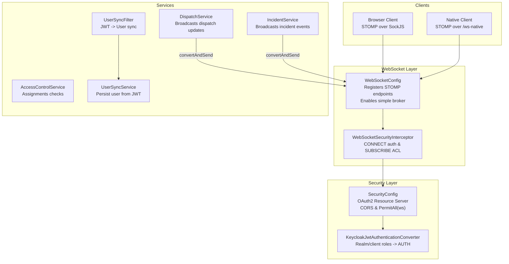
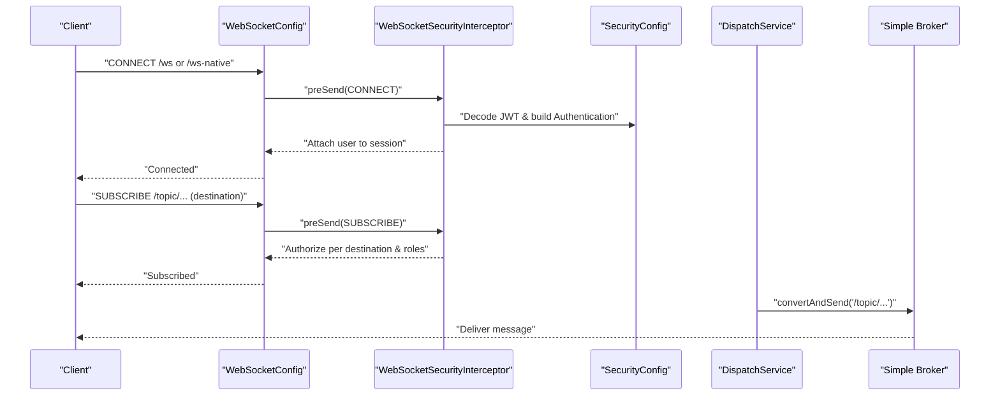
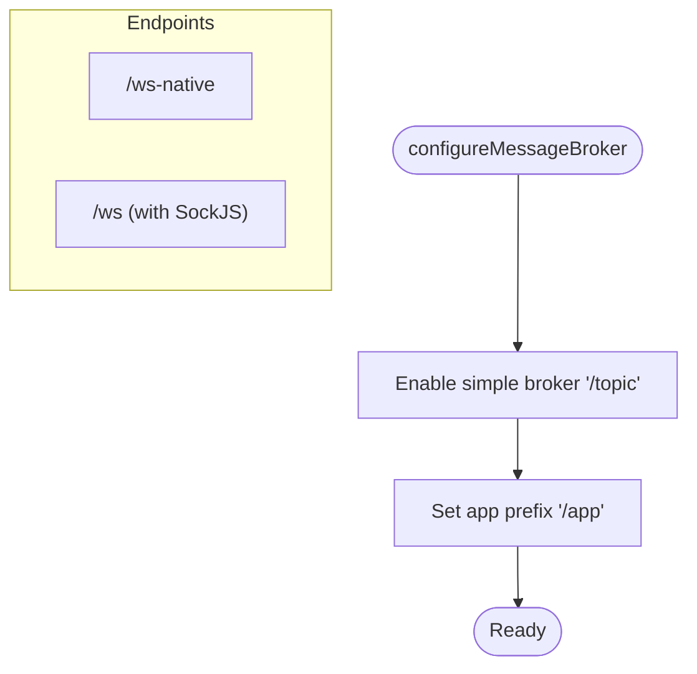
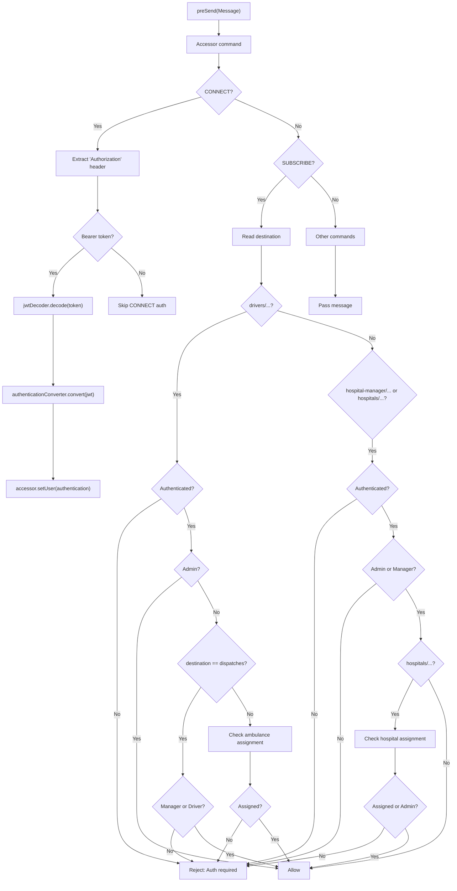
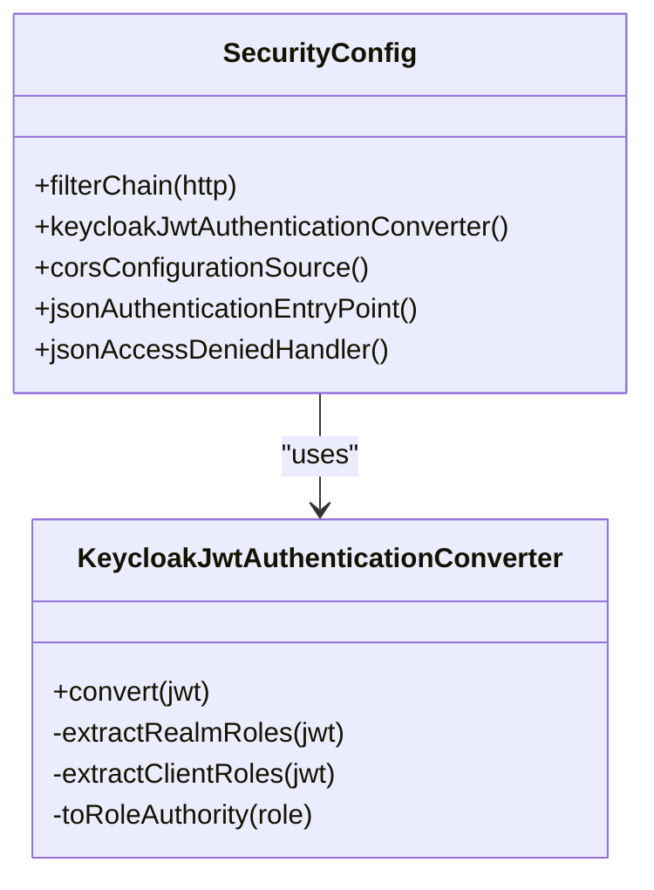
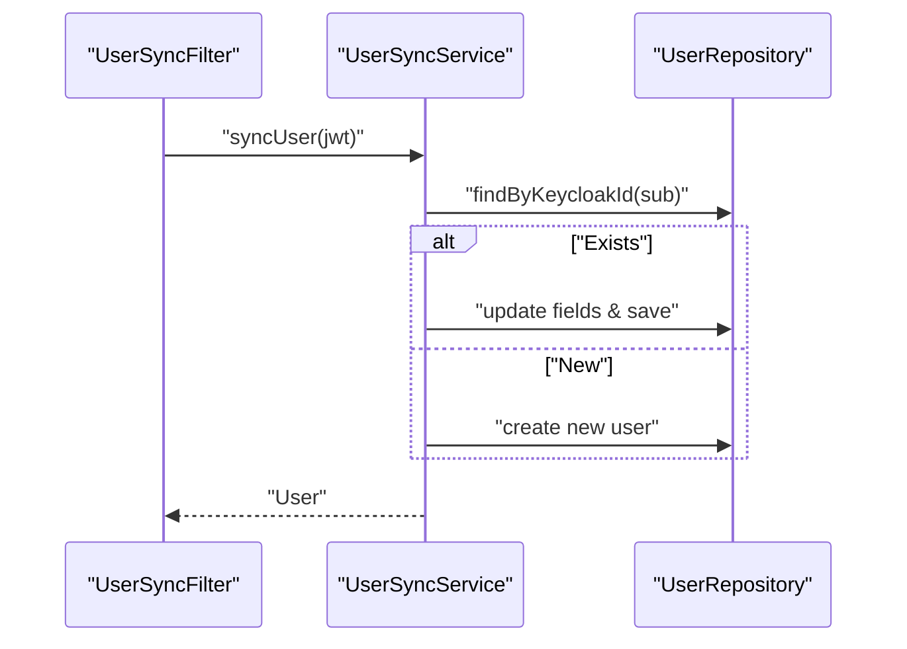
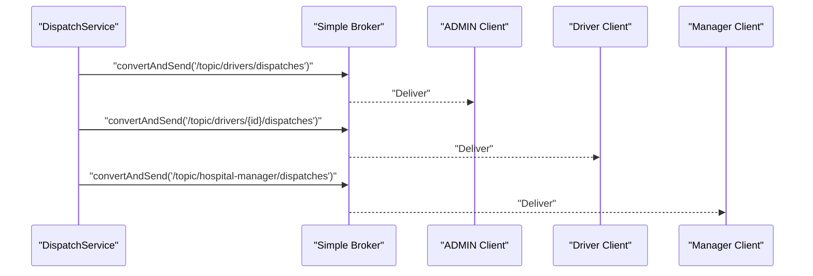
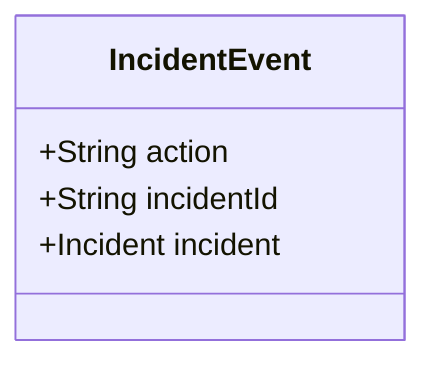
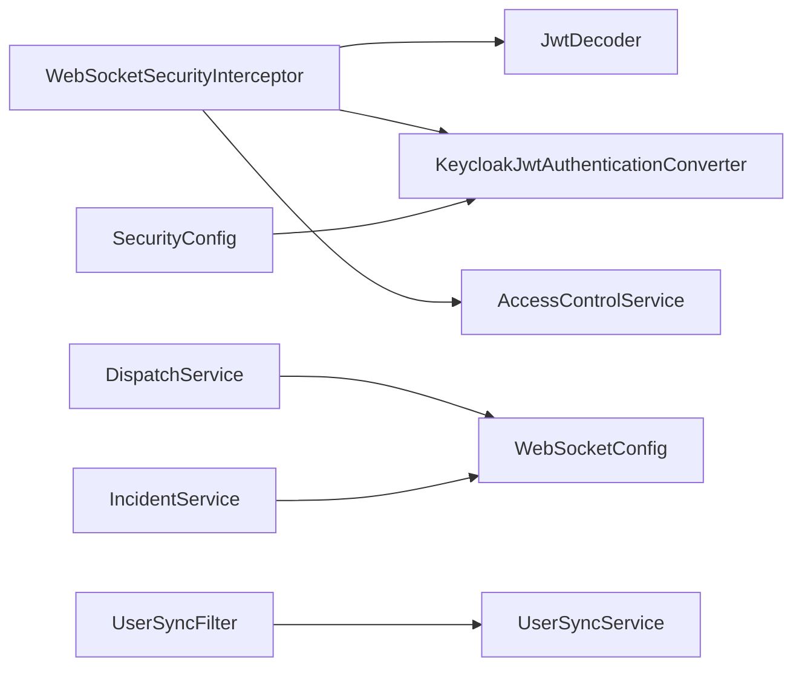

# Real-time Communication

<cite>
**Referenced Files in This Document**
- [WebSocketConfig.java](file://src/main/java/com/example/ems_command_center/config/WebSocketConfig.java)
- [WebSocketSecurityInterceptor.java](file://src/main/java/com/example/ems_command_center/config/WebSocketSecurityInterceptor.java)
- [SecurityConfig.java](file://src/main/java/com/example/ems_command_center/config/SecurityConfig.java)
- [KeycloakJwtAuthenticationConverter.java](file://src/main/java/com/example/ems_command_center/config/KeycloakJwtAuthenticationConverter.java)
- [AccessControlService.java](file://src/main/java/com/example/ems_command_center/service/AccessControlService.java)
- [UserSyncFilter.java](file://src/main/java/com/example/ems_command_center/config/UserSyncFilter.java)
- [UserSyncService.java](file://src/main/java/com/example/ems_command_center/service/UserSyncService.java)
- [DispatchService.java](file://src/main/java/com/example/ems_command_center/service/DispatchService.java)
- [IncidentService.java](file://src/main/java/com/example/ems_command_center/service/IncidentService.java)
- [IncidentEvent.java](file://src/main/java/com/example/ems_command_center/model/IncidentEvent.java)
- [DispatchController.java](file://src/main/java/com/example/ems_command_center/controller/DispatchController.java)
- [IncidentController.java](file://src/main/java/com/example/ems_command_center/controller/IncidentController.java)
- [application.yml](file://src/main/resources/application.yml)
</cite>

## Table of Contents
1. [Introduction](#introduction)
2. [Project Structure](#project-structure)
3. [Core Components](#core-components)
4. [Architecture Overview](#architecture-overview)
5. [Detailed Component Analysis](#detailed-component-analysis)
6. [Dependency Analysis](#dependency-analysis)
7. [Performance Considerations](#performance-considerations)
8. [Troubleshooting Guide](#troubleshooting-guide)
9. [Conclusion](#conclusion)
10. [Appendices](#appendices)

## Introduction
This document describes the WebSocket-based real-time communication system used by the EMS Command Center backend. It covers WebSocket configuration, STOMP endpoint registration, message broker setup, security interceptors, client connection handling, session management, message broadcasting patterns, and security enforcement. It also documents message formats for dispatch updates, incident status changes, and user synchronization, along with connection lifecycle management, error handling, and reconnection strategies. Finally, it provides practical examples of client-side integration patterns and real-time notification flows.

## Project Structure
The WebSocket subsystem is implemented using Spring WebSocket with STOMP over SockJS. Configuration is centralized in a dedicated configuration class that registers STOMP endpoints and enables a simple message broker. A channel interceptor enforces authentication and authorization per subscription destination. Supporting services handle dispatch notifications and incident updates, publishing messages to specific STOMP destinations. Security is enforced via Spring Security with OAuth2 JWT resource server configuration and a custom JWT-to-authentication converter. A user synchronization filter ensures user metadata is synchronized from JWT claims into the application’s persistence layer.

**Diagram sources**
- [WebSocketConfig.java:10-50](file://src/main/java/com/example/ems_command_center/config/WebSocketConfig.java#L10-L50)
- [WebSocketSecurityInterceptor.java:17-112](file://src/main/java/com/example/ems_command_center/config/WebSocketSecurityInterceptor.java#L17-L112)
- [SecurityConfig.java:26-98](file://src/main/java/com/example/ems_command_center/config/SecurityConfig.java#L26-L98)
- [KeycloakJwtAuthenticationConverter.java:18-87](file://src/main/java/com/example/ems_command_center/config/KeycloakJwtAuthenticationConverter.java#L18-L87)
- [AccessControlService.java:7-37](file://src/main/java/com/example/ems_command_center/service/AccessControlService.java#L7-L37)
- [UserSyncFilter.java:17-50](file://src/main/java/com/example/ems_command_center/config/UserSyncFilter.java#L17-L50)
- [UserSyncService.java:12-121](file://src/main/java/com/example/ems_command_center/service/UserSyncService.java#L12-L121)
- [DispatchService.java:21-38](file://src/main/java/com/example/ems_command_center/service/DispatchService.java#L21-L38)
- [IncidentService.java:15-24](file://src/main/java/com/example/ems_command_center/service/IncidentService.java#L15-L24)

**Section sources**
- [WebSocketConfig.java:10-50](file://src/main/java/com/example/ems_command_center/config/WebSocketConfig.java#L10-L50)
- [SecurityConfig.java:26-98](file://src/main/java/com/example/ems_command_center/config/SecurityConfig.java#L26-L98)
- [application.yml:10-17](file://src/main/resources/application.yml#L10-L17)

## Core Components
- WebSocket configuration and endpoints:
  - Enables a simple broker for destinations prefixed with /topic.
  - Sets application destination prefix /app.
  - Registers two STOMP endpoints: /ws-native (direct STOMP) and /ws (with SockJS).
  - Configures allowed origin patterns for local development frontends.
- Security interceptor:
  - Validates CONNECT frames by decoding the Authorization header as a Bearer JWT and attaching an Authentication to the session.
  - Enforces SUBSCRIBE authorization against destinations, including role-based allowances and assignment-scoped access.
- Security configuration:
  - Stateless session policy.
  - CORS allowing configured origins.
  - OAuth2 resource server using JWK set URI from Keycloak.
  - PermitAll for WebSocket endpoints.
- Access control service:
  - Provides assignment checks for hospital and ambulance scopes from JWT claims.
- User synchronization:
  - A filter extracts JWT claims and synchronizes user records, ensuring role and assignment claims are reflected in persistent storage.
- Message broadcasting:
  - DispatchService publishes dispatch assignments to scoped and general topics.
  - IncidentService publishes incident updates to general and manager-specific topics.

**Section sources**
- [WebSocketConfig.java:20-49](file://src/main/java/com/example/ems_command_center/config/WebSocketConfig.java#L20-L49)
- [WebSocketSecurityInterceptor.java:34-111](file://src/main/java/com/example/ems_command_center/config/WebSocketSecurityInterceptor.java#L34-L111)
- [SecurityConfig.java:43-98](file://src/main/java/com/example/ems_command_center/config/SecurityConfig.java#L43-L98)
- [AccessControlService.java:10-36](file://src/main/java/com/example/ems_command_center/service/AccessControlService.java#L10-L36)
- [UserSyncFilter.java:26-42](file://src/main/java/com/example/ems_command_center/config/UserSyncFilter.java#L26-L42)
- [UserSyncService.java:26-39](file://src/main/java/com/example/ems_command_center/service/UserSyncService.java#L26-L39)
- [DispatchService.java:205-212](file://src/main/java/com/example/ems_command_center/service/DispatchService.java#L205-L212)
- [IncidentService.java:88-104](file://src/main/java/com/example/ems_command_center/service/IncidentService.java#L88-L104)

## Architecture Overview
The WebSocket architecture integrates Spring WebSocket with STOMP over SockJS and a simple broker. Clients connect via /ws (SockJS) or /ws-native (direct STOMP). On CONNECT, the interceptor validates the JWT and attaches an Authentication. On SUBSCRIBE, the interceptor enforces authorization against destinations. Services publish messages to /topic destinations, which are routed by the broker to subscribed clients.

**Diagram sources**
- [WebSocketConfig.java:32-49](file://src/main/java/com/example/ems_command_center/config/WebSocketConfig.java#L32-L49)
- [WebSocketSecurityInterceptor.java:34-111](file://src/main/java/com/example/ems_command_center/config/WebSocketSecurityInterceptor.java#L34-L111)
- [SecurityConfig.java:93-95](file://src/main/java/com/example/ems_command_center/config/SecurityConfig.java#L93-L95)
- [DispatchService.java:205-212](file://src/main/java/com/example/ems_command_center/service/DispatchService.java#L205-L212)

## Detailed Component Analysis

### WebSocket Configuration
- Message broker:
  - Simple broker enabled for /topic.
  - Application destinations prefixed with /app.
- Inbound channel:
  - Security interceptor registered to enforce CONNECT and SUBSCRIBE policies.
- STOMP endpoints:
  - /ws-native: direct STOMP for native clients.
  - /ws: STOMP over SockJS for broad browser compatibility.
  - Allowed origins configured for local dev servers.

**Diagram sources**
- [WebSocketConfig.java:20-49](file://src/main/java/com/example/ems_command_center/config/WebSocketConfig.java#L20-L49)

**Section sources**
- [WebSocketConfig.java:20-49](file://src/main/java/com/example/ems_command_center/config/WebSocketConfig.java#L20-L49)

### Security Interceptor: Authentication and Authorization
- CONNECT:
  - Reads Authorization header, expects Bearer token.
  - Decodes JWT via JwtDecoder and converts to Authentication using KeycloakJwtAuthenticationConverter.
  - Attaches Authentication to the session.
- SUBSCRIBE:
  - Enforces role-based and assignment-based authorization:
    - Drivers’ topics:
      - General dispatches allowed for MANAGER and DRIVER.
      - Scoped ambulance topics require assignment to that ambulance or ADMIN.
    - Hospital topics:
      - Manager-only access except general hospital-manager topic.
      - Scoped hospital topics require ADMIN or assignment to that hospital.

**Diagram sources**
- [WebSocketSecurityInterceptor.java:34-111](file://src/main/java/com/example/ems_command_center/config/WebSocketSecurityInterceptor.java#L34-L111)
- [AccessControlService.java:13-36](file://src/main/java/com/example/ems_command_center/service/AccessControlService.java#L13-L36)

**Section sources**
- [WebSocketSecurityInterceptor.java:34-111](file://src/main/java/com/example/ems_command_center/config/WebSocketSecurityInterceptor.java#L34-L111)
- [AccessControlService.java:10-36](file://src/main/java/com/example/ems_command_center/service/AccessControlService.java#L10-L36)

### Security Configuration and JWT Conversion
- OAuth2 resource server:
  - JWK set URI loaded from application.yml.
  - JWT authentication converter built from KeycloakJwtAuthenticationConverter.
- CORS:
  - Allows configured origins and credentials.
- PermitAll for WebSocket endpoints:
  - Both /ws and /ws-native are permitted to allow client connections.
- JSON entry points:
  - Standardized 401/403 responses for unauthorized and forbidden requests.

**Diagram sources**
- [SecurityConfig.java:43-154](file://src/main/java/com/example/ems_command_center/config/SecurityConfig.java#L43-L154)
- [KeycloakJwtAuthenticationConverter.java:29-41](file://src/main/java/com/example/ems_command_center/config/KeycloakJwtAuthenticationConverter.java#L29-L41)

**Section sources**
- [SecurityConfig.java:43-154](file://src/main/java/com/example/ems_command_center/config/SecurityConfig.java#L43-L154)
- [KeycloakJwtAuthenticationConverter.java:29-86](file://src/main/java/com/example/ems_command_center/config/KeycloakJwtAuthenticationConverter.java#L29-L86)
- [application.yml:10-17](file://src/main/resources/application.yml#L10-L17)

### User Synchronization
- UserSyncFilter runs after JWT authentication and invokes UserSyncService.
- UserSyncService:
  - Reads claims from JWT (subject, email, name, roles, hospital_id, ambulance_id).
  - Creates or updates a persistent User entity accordingly.
  - Ensures role and assignment claims are reflected in the database.

**Diagram sources**
- [UserSyncFilter.java:26-42](file://src/main/java/com/example/ems_command_center/config/UserSyncFilter.java#L26-L42)
- [UserSyncService.java:26-39](file://src/main/java/com/example/ems_command_center/service/UserSyncService.java#L26-L39)

**Section sources**
- [UserSyncFilter.java:26-42](file://src/main/java/com/example/ems_command_center/config/UserSyncFilter.java#L26-L42)
- [UserSyncService.java:26-90](file://src/main/java/com/example/ems_command_center/service/UserSyncService.java#L26-L90)

### Message Broadcasting Patterns
- DispatchService publishes dispatch notifications to:
  - General drivers topic for ADMIN.
  - Scoped ambulance topic for the assigned DRIVER.
  - Hospital manager topic for MANAGER coordination.
- IncidentService publishes:
  - General incidents topic for ADMIN, USER, DRIVER.
  - Manager-only hospital-manager/incidents topic.

**Diagram sources**
- [DispatchService.java:205-212](file://src/main/java/com/example/ems_command_center/service/DispatchService.java#L205-L212)

**Section sources**
- [DispatchService.java:205-212](file://src/main/java/com/example/ems_command_center/service/DispatchService.java#L205-L212)
- [IncidentService.java:88-104](file://src/main/java/com/example/ems_command_center/service/IncidentService.java#L88-L104)

### Message Formats
- Dispatch assignments:
  - Published as a structured payload to driver and manager topics.
  - Contains identifiers and contextual information for the assignment.
- Incident events:
  - Published as an IncidentEvent record containing action, incidentId, and the Incident object.
  - Used for general incident updates and manager-specific updates.

**Diagram sources**
- [IncidentEvent.java:3-8](file://src/main/java/com/example/ems_command_center/model/IncidentEvent.java#L3-L8)

**Section sources**
- [IncidentEvent.java:3-8](file://src/main/java/com/example/ems_command_center/model/IncidentEvent.java#L3-L8)
- [DispatchService.java:205-212](file://src/main/java/com/example/ems_command_center/service/DispatchService.java#L205-L212)
- [IncidentService.java:88-104](file://src/main/java/com/example/ems_command_center/service/IncidentService.java#L88-L104)

### Client Integration Examples
- Browser client using SockJS + STOMP.js:
  - Connect to /ws with SockJS and STOMP over the same transport.
  - Subscribe to /topic/drivers/{ambulanceId}/dispatches for scoped updates.
  - Subscribe to /topic/drivers/dispatches for general dispatches (MANAGER/DRIVER).
  - Subscribe to /topic/hospitals/{hospitalId}/... and /topic/hospital-manager/... for hospital coordination.
- Native client using /ws-native:
  - Connect directly to /ws-native with STOMP.
  - Apply the same subscription patterns as above.
- Reconnection strategy:
  - Use exponential backoff with jitter.
  - On reconnect, resubscribe to previously subscribed destinations.
  - Handle 401/403 responses by prompting the user to re-authenticate.

[No sources needed since this section provides conceptual integration guidance]

## Dependency Analysis
The WebSocket subsystem depends on Spring Security for authentication and authorization, Spring Messaging for STOMP, and a simple broker for message routing. AccessControlService provides assignment checks based on JWT claims. User synchronization ensures persisted user state aligns with JWT claims.

**Diagram sources**
- [WebSocketSecurityInterceptor.java:20-32](file://src/main/java/com/example/ems_command_center/config/WebSocketSecurityInterceptor.java#L20-L32)
- [SecurityConfig.java:101-103](file://src/main/java/com/example/ems_command_center/config/SecurityConfig.java#L101-L103)
- [DispatchService.java:28-38](file://src/main/java/com/example/ems_command_center/service/DispatchService.java#L28-L38)
- [IncidentService.java:18-24](file://src/main/java/com/example/ems_command_center/service/IncidentService.java#L18-L24)
- [UserSyncFilter.java:20-24](file://src/main/java/com/example/ems_command_center/config/UserSyncFilter.java#L20-L24)
- [UserSyncService.java:15-19](file://src/main/java/com/example/ems_command_center/service/UserSyncService.java#L15-L19)

**Section sources**
- [WebSocketSecurityInterceptor.java:20-32](file://src/main/java/com/example/ems_command_center/config/WebSocketSecurityInterceptor.java#L20-L32)
- [SecurityConfig.java:101-103](file://src/main/java/com/example/ems_command_center/config/SecurityConfig.java#L101-L103)
- [DispatchService.java:28-38](file://src/main/java/com/example/ems_command_center/service/DispatchService.java#L28-L38)
- [IncidentService.java:18-24](file://src/main/java/com/example/ems_command_center/service/IncidentService.java#L18-L24)
- [UserSyncFilter.java:20-24](file://src/main/java/com/example/ems_command_center/config/UserSyncFilter.java#L20-L24)
- [UserSyncService.java:15-19](file://src/main/java/com/example/ems_command_center/service/UserSyncService.java#L15-L19)

## Performance Considerations
- Keep message payloads minimal; avoid sending large Incident objects repeatedly.
- Use scoped destinations to reduce unnecessary broadcasts.
- Prefer batch updates for frequent status changes.
- Monitor broker memory usage and tune retention policies if needed.
- Ensure clients implement efficient subscription management to avoid redundant subscriptions.

[No sources needed since this section provides general guidance]

## Troubleshooting Guide
- Connection failures:
  - Verify allowed origins match client URLs.
  - Confirm Authorization header is present and valid for CONNECT.
  - Check JWK set URI availability and network connectivity.
- Subscription errors:
  - Ensure user has required roles or assignments for the destination.
  - Validate destination patterns (drivers/{id}, hospitals/{id}).
- 401/403 responses:
  - Re-authenticate with a valid Keycloak access token.
  - Confirm roles and claims in the token align with intended access.
- User synchronization issues:
  - Inspect UserSyncFilter logs for exceptions.
  - Verify JWT contains expected claims (hospital_id, ambulance_id).

**Section sources**
- [WebSocketConfig.java:32-49](file://src/main/java/com/example/ems_command_center/config/WebSocketConfig.java#L32-L49)
- [WebSocketSecurityInterceptor.java:41-55](file://src/main/java/com/example/ems_command_center/config/WebSocketSecurityInterceptor.java#L41-L55)
- [SecurityConfig.java:138-154](file://src/main/java/com/example/ems_command_center/config/SecurityConfig.java#L138-L154)
- [UserSyncFilter.java:33-38](file://src/main/java/com/example/ems_command_center/config/UserSyncFilter.java#L33-L38)

## Conclusion
The WebSocket subsystem provides a secure, role-aware, and assignment-scoped real-time communication backbone. It leverages Spring WebSocket with STOMP over SockJS, enforces authentication and authorization at the broker level, and broadcasts targeted messages to clients. The integration with OAuth2 JWT and user synchronization ensures that user identity and permissions are consistently applied across REST and WebSocket channels.

[No sources needed since this section summarizes without analyzing specific files]

## Appendices

### Endpoint Reference
- STOMP endpoints:
  - /ws-native: direct STOMP for native clients.
  - /ws: STOMP over SockJS for broader browser support.
- Message broker destinations:
  - /topic/drivers/dispatches: general driver dispatches.
  - /topic/drivers/{id}/dispatches: scoped to an ambulance.
  - /topic/hospital-manager/dispatches: manager coordination.
  - /topic/hospital-manager/incidents: manager incident updates.
  - /topic/incidents: general incident updates.

**Section sources**
- [WebSocketConfig.java:32-49](file://src/main/java/com/example/ems_command_center/config/WebSocketConfig.java#L32-L49)
- [DispatchService.java:205-212](file://src/main/java/com/example/ems_command_center/service/DispatchService.java#L205-L212)
- [IncidentService.java:88-104](file://src/main/java/com/example/ems_command_center/service/IncidentService.java#L88-L104)