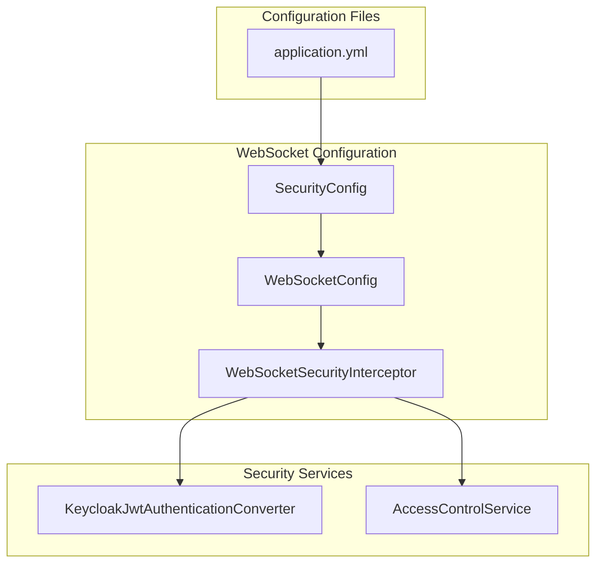
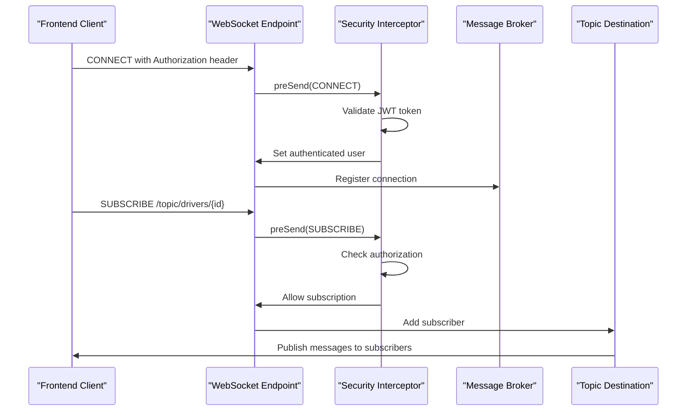
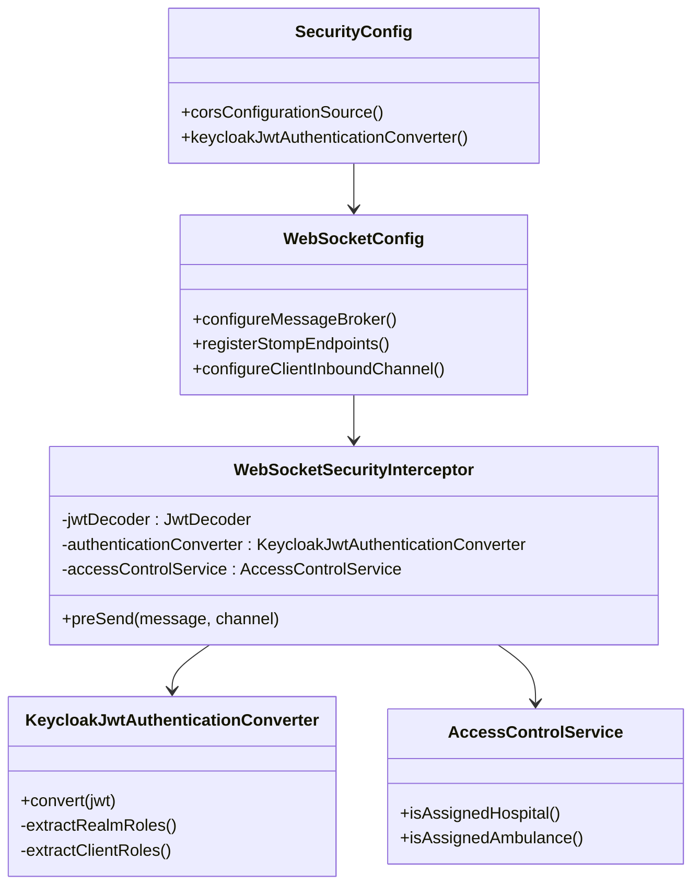

# WebSocket Configuration

<cite>
**Referenced Files in This Document**
- [WebSocketConfig.java](file://src/main/java/com/example/ems_command_center/config/WebSocketConfig.java)
- [WebSocketSecurityInterceptor.java](file://src/main/java/com/example/ems_command_center/config/WebSocketSecurityInterceptor.java)
- [SecurityConfig.java](file://src/main/java/com/example/ems_command_center/config/SecurityConfig.java)
- [KeycloakJwtAuthenticationConverter.java](file://src/main/java/com/example/ems_command_center/config/KeycloakJwtAuthenticationConverter.java)
- [AccessControlService.java](file://src/main/java/com/example/ems_command_center/service/AccessControlService.java)
- [application.yml](file://src/main/resources/application.yml)
</cite>

## Table of Contents
1. [Introduction](#introduction)
2. [Project Structure](#project-structure)
3. [Core Components](#core-components)
4. [Architecture Overview](#architecture-overview)
5. [Detailed Component Analysis](#detailed-component-analysis)
6. [Dependency Analysis](#dependency-analysis)
7. [Performance Considerations](#performance-considerations)
8. [Troubleshooting Guide](#troubleshooting-guide)
9. [Conclusion](#conclusion)

## Introduction
This document provides comprehensive documentation for the WebSocket configuration in the EMS Command Center backend. It covers the Spring WebSocket implementation with STOMP support, including endpoint registration for both native WebSocket and SockJS connections, message broker configuration, CORS setup for local development, and security enforcement through interceptors. The configuration enables real-time communication for operational dashboards, incident monitoring, and dispatch coordination.

## Project Structure
The WebSocket configuration is implemented through dedicated Spring configuration classes located in the config package, with supporting security components and service utilities.



**Diagram sources**
- [WebSocketConfig.java:10-50](file://src/main/java/com/example/ems_command_center/config/WebSocketConfig.java#L10-L50)
- [WebSocketSecurityInterceptor.java:17-32](file://src/main/java/com/example/ems_command_center/config/WebSocketSecurityInterceptor.java#L17-L32)
- [SecurityConfig.java:26-98](file://src/main/java/com/example/ems_command_center/config/SecurityConfig.java#L26-L98)

**Section sources**
- [WebSocketConfig.java:1-51](file://src/main/java/com/example/ems_command_center/config/WebSocketConfig.java#L1-L51)
- [SecurityConfig.java:1-156](file://src/main/java/com/example/ems_command_center/config/SecurityConfig.java#L1-L156)

## Core Components
The WebSocket system consists of four primary components that work together to provide secure, real-time messaging capabilities.

### WebSocketMessageBrokerConfigurer Implementation
The main configuration class implements Spring's WebSocketMessageBrokerConfigurer interface to define message broker behavior and endpoint registration.

### WebSocketSecurityInterceptor
A custom ChannelInterceptor that validates JWT tokens and enforces authorization rules for WebSocket subscriptions and message routing.

### Security Configuration
Global security settings that enable CORS for development origins and integrate OAuth2 authentication for REST endpoints.

### Access Control Services
Utility services that validate user assignments to specific resources (ambulances and hospitals) for fine-grained authorization.

**Section sources**
- [WebSocketConfig.java:12-24](file://src/main/java/com/example/ems_command_center/config/WebSocketConfig.java#L12-L24)
- [WebSocketSecurityInterceptor.java:18-32](file://src/main/java/com/example/ems_command_center/config/WebSocketSecurityInterceptor.java#L18-L32)
- [SecurityConfig.java:44-98](file://src/main/java/com/example/ems_command_center/config/SecurityConfig.java#L44-L98)

## Architecture Overview
The WebSocket architecture follows Spring's STOMP over WebSocket pattern with integrated security and access control.



**Diagram sources**
- [WebSocketConfig.java:32-49](file://src/main/java/com/example/ems_command_center/config/WebSocketConfig.java#L32-L49)
- [WebSocketSecurityInterceptor.java:34-111](file://src/main/java/com/example/ems_command_center/config/WebSocketSecurityInterceptor.java#L34-L111)

## Detailed Component Analysis

### WebSocket Configuration Class
The main configuration class defines the complete WebSocket infrastructure including message broker setup and endpoint registration.

#### Message Broker Configuration
The message broker is configured with:
- Simple Broker for `/topic` destinations enabling publish-subscribe messaging
- Application destination prefixes set to `/app` for application-defined endpoints

#### Endpoint Registration
Two distinct endpoints are registered:
- Native WebSocket endpoint at `/ws-native` with CORS configuration for local development
- SockJS-compatible endpoint at `/ws` with automatic fallback support

#### Channel Registration
The inbound channel is configured with the security interceptor to validate all incoming WebSocket messages before processing.

**Section sources**
- [WebSocketConfig.java:20-24](file://src/main/java/com/example/ems_command_center/config/WebSocketConfig.java#L20-L24)
- [WebSocketConfig.java:31-49](file://src/main/java/com/example/ems_command_center/config/WebSocketConfig.java#L31-L49)
- [WebSocketConfig.java:26-29](file://src/main/java/com/example/ems_command_center/config/WebSocketConfig.java#L26-L29)

### Security Interceptor Implementation
The WebSocketSecurityInterceptor provides comprehensive security validation for WebSocket connections and subscriptions.

#### Authentication Validation
During CONNECT commands, the interceptor extracts Bearer tokens from the Authorization header and validates them against the configured JWT decoder. The validated JWT is converted to Spring Security Authentication objects using the KeycloakJwtAuthenticationConverter.

#### Subscription Authorization
For SUBSCRIBE commands, the interceptor enforces role-based access control:
- Drivers topic requires authentication and specific role checks
- Hospital manager topics require ADMIN or MANAGER roles
- Hospital topics require ADMIN or MANAGER roles with additional facility assignment validation

#### Fine-Grained Access Control
The interceptor validates user assignments to specific resources:
- Ambulance assignments using the AccessControlService
- Hospital assignments using JWT claims
- Role-based permissions for different topic categories

**Section sources**
- [WebSocketSecurityInterceptor.java:34-111](file://src/main/java/com/example/ems_command_center/config/WebSocketSecurityInterceptor.java#L34-L111)

### Security Configuration Integration
The global security configuration complements WebSocket security with CORS settings for local development.

#### CORS Configuration
Development origins include:
- React applications on port 5173
- Vite applications on port 4173  
- Next.js applications on port 3000
- Angular applications on port 4200

#### Endpoint Permissions
WebSocket endpoints (`/ws/**` and `/ws-native/**`) are permitted without authentication for connection establishment, while the actual message routing is secured through the WebSocketSecurityInterceptor.

**Section sources**
- [SecurityConfig.java:106-120](file://src/main/java/com/example/ems_command_center/config/SecurityConfig.java#L106-L120)
- [SecurityConfig.java:58-60](file://src/main/java/com/example/ems_command_center/config/SecurityConfig.java#L58-L60)

### Access Control Services
The AccessControlService provides runtime validation of user assignments to specific resources.

#### Hospital Assignment Validation
Checks if a user has administrative rights over a specific hospital facility using JWT claims.

#### Ambulance Assignment Validation  
Validates if a user is assigned to operate a specific ambulance unit.

**Section sources**
- [AccessControlService.java:10-36](file://src/main/java/com/example/ems_command_center/service/AccessControlService.java#L10-L36)

## Dependency Analysis
The WebSocket configuration relies on several interconnected components that work together to provide secure messaging capabilities.



**Diagram sources**
- [WebSocketConfig.java:12-49](file://src/main/java/com/example/ems_command_center/config/WebSocketConfig.java#L12-L49)
- [WebSocketSecurityInterceptor.java:18-32](file://src/main/java/com/example/ems_command_center/config/WebSocketSecurityInterceptor.java#L18-L32)
- [SecurityConfig.java:26-98](file://src/main/java/com/example/ems_command_center/config/SecurityConfig.java#L26-L98)

### Component Dependencies
The configuration exhibits loose coupling through Spring's dependency injection:
- WebSocketConfig depends on WebSocketSecurityInterceptor
- WebSocketSecurityInterceptor depends on JwtDecoder, KeycloakJwtAuthenticationConverter, and AccessControlService
- SecurityConfig provides CORS configuration and JWT conversion services

**Section sources**
- [WebSocketConfig.java:14-18](file://src/main/java/com/example/ems_command_center/config/WebSocketConfig.java#L14-L18)
- [WebSocketSecurityInterceptor.java:20-32](file://src/main/java/com/example/ems_command_center/config/WebSocketSecurityInterceptor.java#L20-L32)

## Performance Considerations
The WebSocket configuration is designed for optimal performance in real-time scenarios:

### Message Broker Efficiency
- Simple Broker configuration minimizes overhead for pub-sub messaging
- Topic-based routing reduces unnecessary message processing
- Application destination prefixes enable efficient message routing

### Connection Management
- SockJS fallback support ensures compatibility across different client environments
- Native WebSocket endpoint provides optimal performance for modern browsers
- Automatic connection handling through Spring WebSocket infrastructure

### Security Processing
- JWT validation occurs only during connection establishment
- Subscription authorization is performed efficiently using role-based checks
- Access control service provides fast assignment validation

## Troubleshooting Guide

### Common Connection Issues
**Problem**: Clients cannot connect to WebSocket endpoints
**Solution**: Verify CORS configuration allows the client origin and check that the Authorization header is properly formatted with "Bearer " prefix

**Problem**: Authentication failures during connection
**Solution**: Ensure JWT tokens are valid and not expired, verify Keycloak server accessibility, check token audience claim matches client configuration

**Problem**: Subscription denied errors
**Solution**: Verify user roles match required permissions for the target topic, check AccessControlService for proper assignment validation

### Production Configuration Examples

#### Environment-Specific CORS Configuration
For production environments, replace localhost origins with actual domain names:

```yaml
# Example production CORS configuration
security:
  cors:
    allowed-origins:
      - https://ems-command-center.com
      - https://admin.ems-command-center.com
      - https://mobile.ems-command-center.com
```

#### Custom Endpoint Setup
To add additional WebSocket endpoints:

```java
@Override
public void registerStompEndpoints(StompEndpointRegistry registry) {
    // Existing endpoints
    registry.addEndpoint("/ws-native")
           .setAllowedOrigins("https://yourdomain.com");
    
    registry.addEndpoint("/ws")
           .setAllowedOrigins("https://yourdomain.com")
           .withSockJS();
    
    // New custom endpoint
    registry.addEndpoint("/custom-endpoint")
           .setAllowedOrigins("https://yourdomain.com")
           .withSockJS();
}
```

#### Enhanced Security Configuration
For production deployments, implement stricter security policies:

```java
@Bean
public CorsConfigurationSource corsConfigurationSource() {
    CorsConfiguration config = new CorsConfiguration();
    config.setAllowedOrigins(List.of("https://yourdomain.com"));
    config.setAllowedMethods(List.of("GET", "POST"));
    config.setAllowedHeaders(List.of("Authorization", "Content-Type"));
    config.setAllowCredentials(false);
    config.setMaxAge(3600L);
    
    UrlBasedCorsConfigurationSource source = new UrlBasedCorsConfigurationSource();
    source.registerCorsConfiguration("/**", config);
    return source;
}
```

**Section sources**
- [WebSocketConfig.java:32-49](file://src/main/java/com/example/ems_command_center/config/WebSocketConfig.java#L32-L49)
- [SecurityConfig.java:106-120](file://src/main/java/com/example/ems_command_center/config/SecurityConfig.java#L106-L120)

## Conclusion
The WebSocket configuration in EMS Command Center provides a robust foundation for real-time communication with comprehensive security and access control. The implementation leverages Spring's WebSocket infrastructure with custom security interceptors to ensure secure, role-based messaging for operational dashboards and dispatch systems. The modular design allows for easy customization and extension while maintaining security best practices suitable for production environments.

The configuration supports both modern native WebSocket connections and SockJS fallback for broader client compatibility, with flexible CORS settings that can be adapted for various deployment scenarios. The integration with Keycloak authentication and role-based access control ensures that sensitive operational data is protected according to organizational security policies.