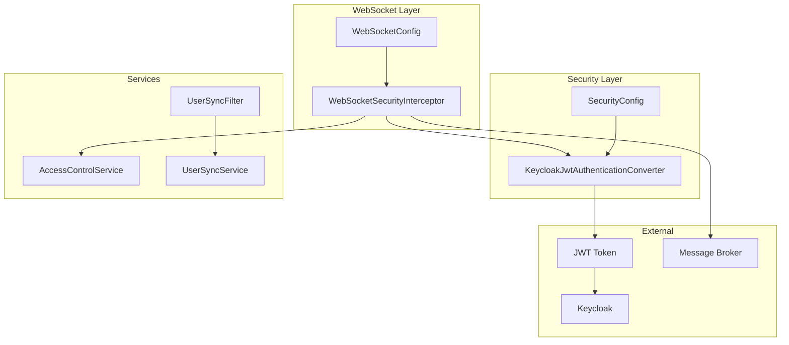
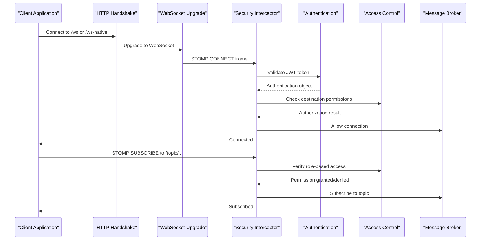
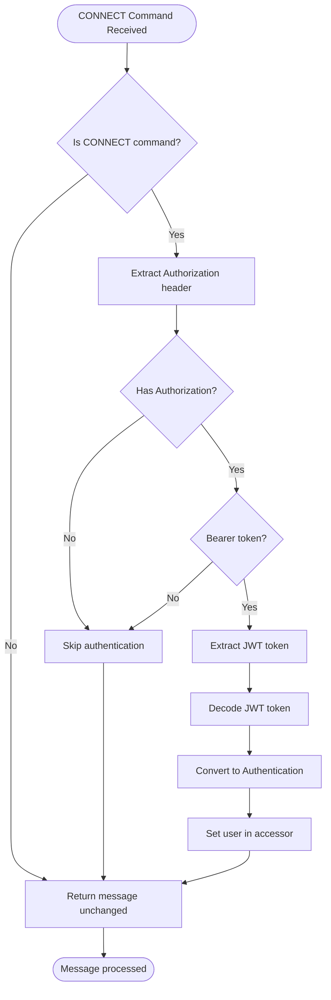
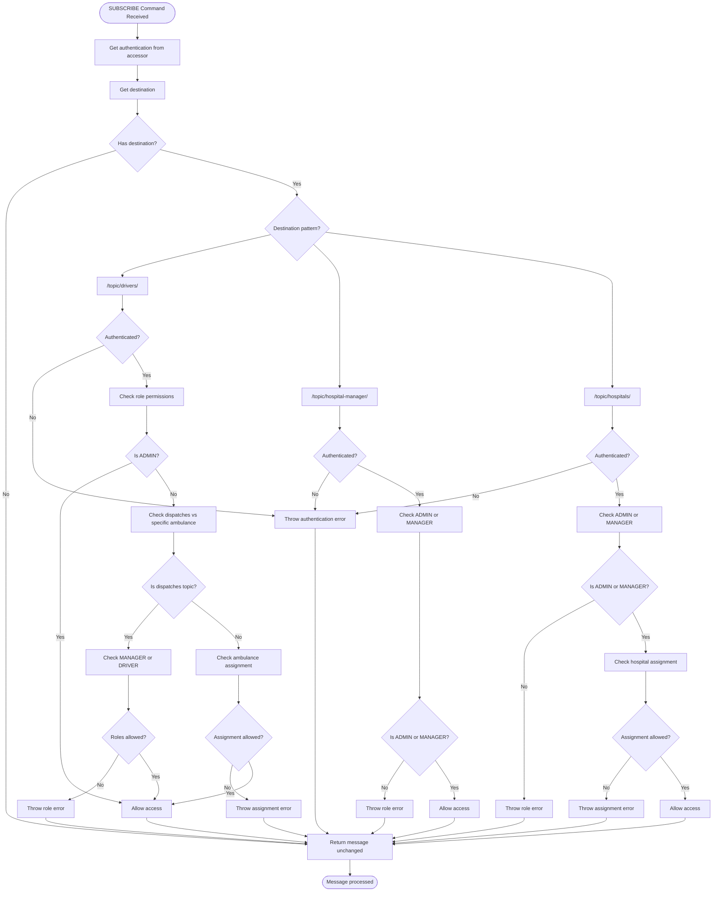
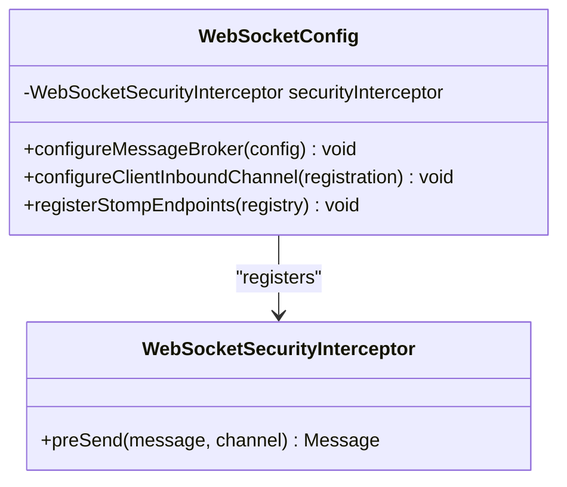
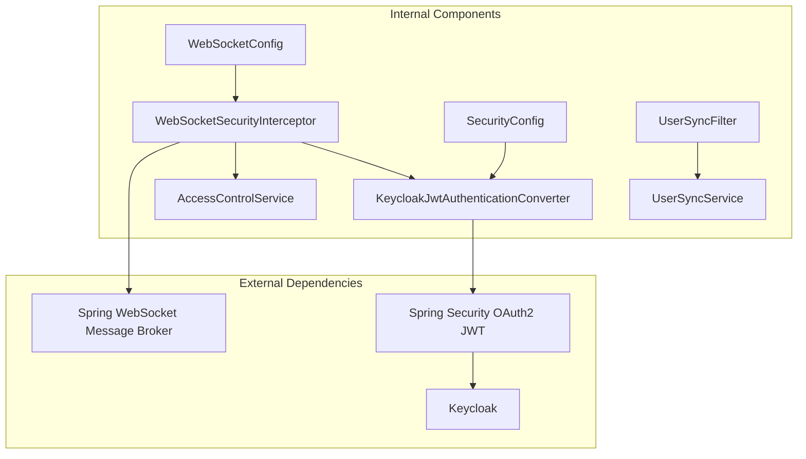

# WebSocket Security Interceptor

<cite>
**Referenced Files in This Document**
- [WebSocketSecurityInterceptor.java](file://src/main/java/com/example/ems_command_center/config/WebSocketSecurityInterceptor.java)
- [WebSocketConfig.java](file://src/main/java/com/example/ems_command_center/config/WebSocketConfig.java)
- [SecurityConfig.java](file://src/main/java/com/example/ems_command_center/config/SecurityConfig.java)
- [KeycloakJwtAuthenticationConverter.java](file://src/main/java/com/example/ems_command_center/config/KeycloakJwtAuthenticationConverter.java)
- [AccessControlService.java](file://src/main/java/com/example/ems_command_center/service/AccessControlService.java)
- [UserSyncFilter.java](file://src/main/java/com/example/ems_command_center/config/UserSyncFilter.java)
- [UserSyncService.java](file://src/main/java/com/example/ems_command_center/service/UserSyncService.java)
- [application.yml](file://src/main/resources/application.yml)
</cite>

## Table of Contents
1. [Introduction](#introduction)
2. [Project Structure](#project-structure)
3. [Core Components](#core-components)
4. [Architecture Overview](#architecture-overview)
5. [Detailed Component Analysis](#detailed-component-analysis)
6. [Dependency Analysis](#dependency-analysis)
7. [Performance Considerations](#performance-considerations)
8. [Troubleshooting Guide](#troubleshooting-guide)
9. [Conclusion](#conclusion)

## Introduction
This document provides comprehensive documentation for the WebSocket security implementation in the EMS Command Center. It focuses on the WebSocketSecurityInterceptor class that validates JWT tokens for WebSocket connections, explains the authentication flow from HTTP handshake to WebSocket upgrade, token extraction from headers, and role-based authorization checks. It also covers the security interceptor configuration in ChannelRegistration and its integration with the Spring Security context, along with exception handling for unauthorized connections, token expiration scenarios, and security policy enforcement.

## Project Structure
The WebSocket security implementation is primarily located in the config package with supporting services in the service package. The key files are:
- WebSocketSecurityInterceptor: Implements STOMP channel interception for WebSocket security
- WebSocketConfig: Configures WebSocket message broker and registers the security interceptor
- SecurityConfig: Configures Spring Security for HTTP endpoints and JWT processing
- KeycloakJwtAuthenticationConverter: Converts JWT tokens to Spring Security Authentication objects
- AccessControlService: Provides role-based authorization checks for specific destinations
- UserSyncFilter and UserSyncService: Synchronize user information from JWT claims

**Diagram sources**
- [WebSocketConfig.java:12-50](file://src/main/java/com/example/ems_command_center/config/WebSocketConfig.java#L12-L50)
- [WebSocketSecurityInterceptor.java:18-32](file://src/main/java/com/example/ems_command_center/config/WebSocketSecurityInterceptor.java#L18-L32)
- [SecurityConfig.java:29-98](file://src/main/java/com/example/ems_command_center/config/SecurityConfig.java#L29-L98)

**Section sources**
- [WebSocketConfig.java:1-51](file://src/main/java/com/example/ems_command_center/config/WebSocketConfig.java#L1-L51)
- [SecurityConfig.java:1-156](file://src/main/java/com/example/ems_command_center/config/SecurityConfig.java#L1-L156)

## Core Components
The WebSocket security implementation consists of several interconnected components that work together to provide robust authentication and authorization for WebSocket connections.

### WebSocketSecurityInterceptor
The WebSocketSecurityInterceptor implements Spring's ChannelInterceptor interface to intercept messages before they are sent. It handles two primary STOMP commands:
- CONNECT: Validates JWT tokens and establishes user authentication
- SUBSCRIBE: Enforces role-based authorization for specific message destinations

Key responsibilities include:
- Extracting Authorization headers from STOMP CONNECT frames
- Decoding JWT tokens using JwtDecoder
- Converting JWTs to Spring Security Authentication objects
- Enforcing role-based access control for subscription destinations
- Integrating with AccessControlService for assignment-based permissions

### WebSocketConfig
This configuration class enables WebSocket message broker functionality and registers the security interceptor. It sets up:
- Message broker configuration with simple broker for /topic destinations
- Application destination prefixes for /app endpoints
- Client inbound channel interceptor registration
- STOMP endpoint registration with CORS configuration

### SecurityConfig
Provides HTTP-level security configuration including:
- Stateless session management
- OAuth2 Resource Server configuration with JWT support
- CORS configuration for development origins
- Role-based authorization for REST endpoints
- JSON-formatted authentication entry point and access denied handlers

**Section sources**
- [WebSocketSecurityInterceptor.java:18-113](file://src/main/java/com/example/ems_command_center/config/WebSocketSecurityInterceptor.java#L18-L113)
- [WebSocketConfig.java:12-50](file://src/main/java/com/example/ems_command_center/config/WebSocketConfig.java#L12-L50)
- [SecurityConfig.java:29-98](file://src/main/java/com/example/ems_command_center/config/SecurityConfig.java#L29-L98)

## Architecture Overview
The WebSocket security architecture follows a layered approach with clear separation of concerns:

**Diagram sources**
- [WebSocketSecurityInterceptor.java:34-111](file://src/main/java/com/example/ems_command_center/config/WebSocketSecurityInterceptor.java#L34-L111)
- [WebSocketConfig.java:32-49](file://src/main/java/com/example/ems_command_center/config/WebSocketConfig.java#L32-L49)

The architecture ensures that:
- JWT validation occurs during the WebSocket handshake phase
- Authentication state is maintained throughout the WebSocket session
- Role-based authorization is enforced for each subscription request
- Access control considers both role-based and assignment-based permissions

## Detailed Component Analysis

### WebSocketSecurityInterceptor Implementation
The WebSocketSecurityInterceptor is the core component responsible for WebSocket security validation. It implements the ChannelInterceptor.preSend method to intercept messages before they are processed.

#### Authentication Flow for CONNECT Commands
The interceptor processes STOMP CONNECT commands to validate JWT tokens:

**Diagram sources**
- [WebSocketSecurityInterceptor.java:34-55](file://src/main/java/com/example/ems_command_center/config/WebSocketSecurityInterceptor.java#L34-L55)

#### Authorization Flow for SUBSCRIBE Commands
For STOMP SUBSCRIBE commands, the interceptor enforces role-based authorization based on destination patterns:

**Diagram sources**
- [WebSocketSecurityInterceptor.java:56-108](file://src/main/java/com/example/ems_command_center/config/WebSocketSecurityInterceptor.java#L56-L108)

#### Role-Based Authorization Patterns
The interceptor implements several authorization patterns:

1. **Drivers Topic Authorization**: 
   - ADMIN users can access all driver topics
   - MANAGER and DRIVER users can access dispatches topic
   - Assignment-based access for specific ambulance topics

2. **Hospital Management Authorization**:
   - ADMIN and MANAGER users can access hospital management topics
   - Assignment-based access for specific hospital topics

3. **Assignment-Based Permissions**:
   - Uses AccessControlService to verify user assignments
   - Extracts ambulance_id and hospital_id from JWT claims
   - Enforces role-based restrictions based on assignments

**Section sources**
- [WebSocketSecurityInterceptor.java:18-113](file://src/main/java/com/example/ems_command_center/config/WebSocketSecurityInterceptor.java#L18-L113)
- [AccessControlService.java:8-38](file://src/main/java/com/example/ems_command_center/service/AccessControlService.java#L8-L38)

### WebSocketConfig Configuration
The WebSocketConfig class serves as the central configuration for WebSocket message broker functionality and security integration.

#### Message Broker Configuration
The configuration enables a simple message broker for topic-based messaging and sets application destination prefixes:

**Diagram sources**
- [WebSocketConfig.java:12-50](file://src/main/java/com/example/ems_command_center/config/WebSocketConfig.java#L12-L50)

#### Endpoint Registration and CORS
The configuration registers two WebSocket endpoints with CORS support:
- `/ws-native`: Direct WebSocket connection
- `/ws`: WebSocket with SockJS fallback support

Both endpoints allow connections from development origins (localhost ports 5173, 4173, 3000, 4200).

**Section sources**
- [WebSocketConfig.java:12-50](file://src/main/java/com/example/ems_command_center/config/WebSocketConfig.java#L12-L50)

### SecurityConfig Integration
The SecurityConfig class provides HTTP-level security that complements WebSocket security:

#### JWT Authentication Configuration
The security configuration includes OAuth2 Resource Server with JWT support:
- JWK Set URI configured for Keycloak certificate validation
- Custom JWT authentication converter for role extraction
- Stateless session management for REST and WebSocket endpoints

#### CORS Configuration
Comprehensive CORS configuration allows development environments while maintaining security:
- Specific allowed origins for frontend applications
- Support for all HTTP methods and headers
- Credential support for authenticated requests

**Section sources**
- [SecurityConfig.java:44-98](file://src/main/java/com/example/ems_command_center/config/SecurityConfig.java#L44-L98)
- [application.yml:10-36](file://src/main/resources/application.yml#L10-L36)

### KeycloakJwtAuthenticationConverter
The KeycloakJwtAuthenticationConverter transforms JWT tokens into Spring Security Authentication objects with proper role authorities:

#### Role Authority Extraction
The converter extracts roles from both realm_access and resource_access claims:
- Realm-level roles from realm_access.roles
- Client-specific roles from resource_access.{clientId}.roles
- Converts role names to ROLE_* format for Spring Security compatibility

#### Principal Claim Configuration
Supports configurable principal claim names:
- Customizable principal claim field
- Fallback to subject claim if principal claim is missing
- Client ID configuration for role extraction

**Section sources**
- [KeycloakJwtAuthenticationConverter.java:18-88](file://src/main/java/com/example/ems_command_center/config/KeycloakJwtAuthenticationConverter.java#L18-L88)

### AccessControlService
The AccessControlService provides assignment-based authorization checks:

#### Hospital Assignment Verification
Checks if users are assigned to specific hospitals using JWT claims:
- Extracts hospital_id from JWT token
- Compares with requested hospital identifier
- Handles role-based exceptions (non-MANAGER users without assignment)

#### Ambulance Assignment Verification
Verifies user assignments to specific ambulances:
- Extracts ambulance_id from JWT token
- Compares with requested ambulance identifier
- Handles role-based exceptions (non-DRIVER users without assignment)

**Section sources**
- [AccessControlService.java:8-38](file://src/main/java/com/example/ems_command_center/service/AccessControlService.java#L8-L38)

## Dependency Analysis
The WebSocket security implementation has well-defined dependencies that ensure modularity and maintainability:

**Diagram sources**
- [WebSocketSecurityInterceptor.java:20-32](file://src/main/java/com/example/ems_command_center/config/WebSocketSecurityInterceptor.java#L20-L32)
- [WebSocketConfig.java:14-18](file://src/main/java/com/example/ems_command_center/config/WebSocketConfig.java#L14-L18)
- [SecurityConfig.java:37-41](file://src/main/java/com/example/ems_command_center/config/SecurityConfig.java#L37-L41)

### Component Coupling and Cohesion
The implementation demonstrates good separation of concerns:
- **High cohesion**: Each component has a focused responsibility
- **Low coupling**: Components interact through well-defined interfaces
- **Clear interfaces**: Spring Security interfaces provide abstraction boundaries

### Security Policy Enforcement
The security implementation enforces policies at multiple layers:
- **Transport layer**: WebSocket endpoint protection
- **Authentication layer**: JWT token validation
- **Authorization layer**: Role-based and assignment-based access control
- **Session layer**: Authentication state persistence during WebSocket sessions

**Section sources**
- [WebSocketSecurityInterceptor.java:18-113](file://src/main/java/com/example/ems_command_center/config/WebSocketSecurityInterceptor.java#L18-L113)
- [WebSocketConfig.java:12-50](file://src/main/java/com/example/ems_command_center/config/WebSocketConfig.java#L12-L50)

## Performance Considerations
The WebSocket security implementation is designed for optimal performance:

### Token Validation Efficiency
- JWT decoding occurs only during WebSocket handshake
- Authentication state is cached in the WebSocket session
- Minimal overhead for subsequent message processing

### Memory and Resource Management
- Stateless design prevents memory leaks
- Proper cleanup of authentication contexts
- Efficient role authority collection and caching

### Scalability Considerations
- Horizontal scaling support through stateless authentication
- Database-backed user synchronization for distributed deployments
- Configurable CORS settings for production environments

## Troubleshooting Guide

### Common Authentication Issues
**Invalid JWT Token Errors**
- Verify JWT token format and expiration
- Check Keycloak JWK set URI configuration
- Ensure proper token signing and audience validation

**Missing Authorization Header**
- Confirm client sends Authorization header with Bearer token
- Verify token format starts with "Bearer "
- Check for header case sensitivity issues

**Token Expiration Scenarios**
- Implement automatic reconnection for expired tokens
- Handle token refresh before WebSocket reconnection
- Monitor token expiration timestamps

### Authorization Problems
**Role-Based Access Denial**
- Verify user roles in Keycloak configuration
- Check role mapping in KeycloakJwtAuthenticationConverter
- Ensure proper role authority format (ROLE_ADMIN, etc.)

**Assignment-Based Permission Issues**
- Confirm hospital_id and ambulance_id claims in JWT
- Verify AccessControlService configuration
- Check user assignment in Keycloak roles

### WebSocket Connection Failures
**Handshake Failures**
- Verify WebSocket endpoint configuration
- Check CORS settings for client origins
- Ensure proper STOMP frame formatting

**Subscription Rejection**
- Review destination pattern matching logic
- Check role-based authorization rules
- Verify assignment-based permission checks

### Debugging and Logging
Enable debug logging for security components:
- Set logging level to DEBUG for security packages
- Monitor WebSocket security interceptor logs
- Track JWT token validation and authorization decisions

**Section sources**
- [WebSocketSecurityInterceptor.java:51-53](file://src/main/java/com/example/ems_command_center/config/WebSocketSecurityInterceptor.java#L51-L53)
- [WebSocketSecurityInterceptor.java:62-64](file://src/main/java/com/example/ems_command_center/config/WebSocketSecurityInterceptor.java#L62-L64)
- [WebSocketSecurityInterceptor.java:101-103](file://src/main/java/com/example/ems_command_center/config/WebSocketSecurityInterceptor.java#L101-L103)

## Conclusion
The WebSocket security implementation in the EMS Command Center provides a robust, multi-layered security approach that effectively protects real-time communication channels. The WebSocketSecurityInterceptor serves as the cornerstone of this security model, implementing comprehensive JWT validation and role-based authorization for WebSocket connections.

Key strengths of the implementation include:
- **Comprehensive Security Coverage**: Authentication and authorization at both transport and application layers
- **Flexible Authorization Model**: Support for role-based and assignment-based permissions
- **Integration with Existing Security Infrastructure**: Seamless integration with Spring Security and Keycloak
- **Production-Ready Configuration**: Proper CORS handling and stateless design for scalability

The implementation successfully addresses the core requirements of securing WebSocket communications in an emergency management system while maintaining performance and usability. The modular design allows for easy maintenance and extension of security policies as the system evolves.

Future enhancements could include:
- Token refresh mechanisms for long-lived WebSocket sessions
- Enhanced logging and audit trail capabilities
- Additional security policies for administrative operations
- Integration with external identity providers beyond Keycloak