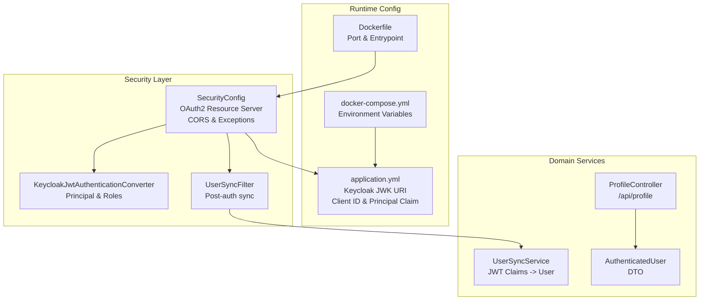
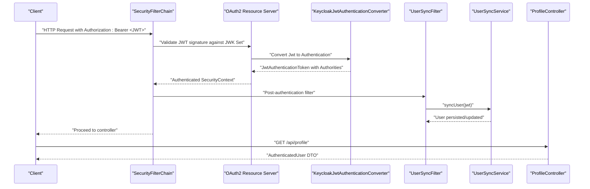
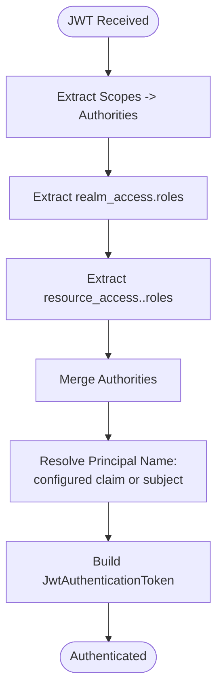
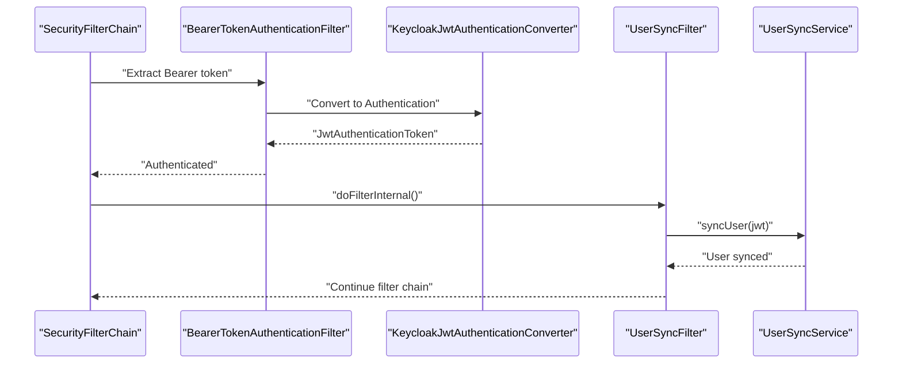
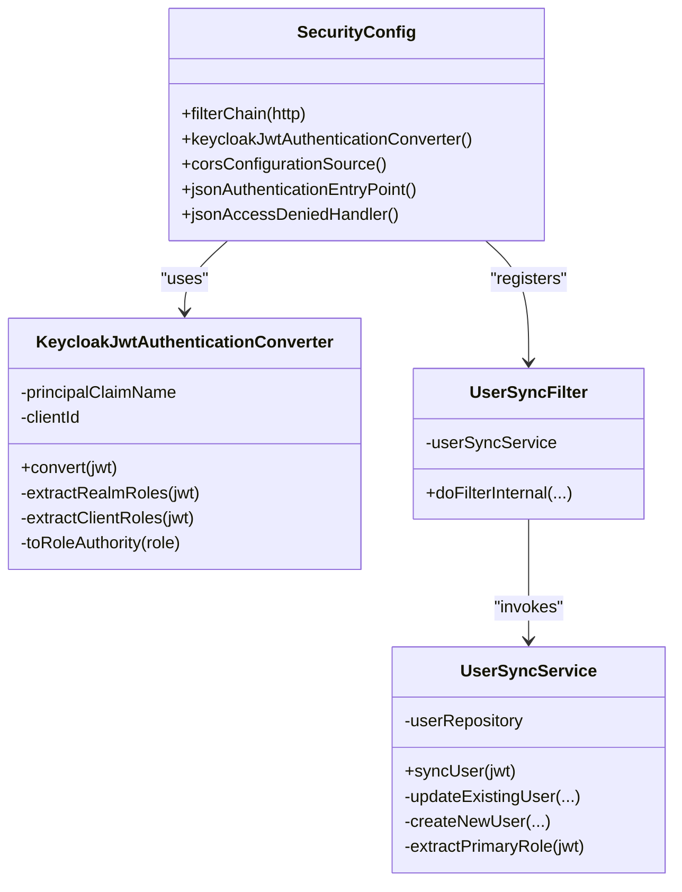

# Authentication Setup

<cite>
**Referenced Files in This Document**
- [SecurityConfig.java](file://src/main/java/com/example/ems_command_center/config/SecurityConfig.java)
- [KeycloakJwtAuthenticationConverter.java](file://src/main/java/com/example/ems_command_center/config/KeycloakJwtAuthenticationConverter.java)
- [UserSyncFilter.java](file://src/main/java/com/example/ems_command_center/config/UserSyncFilter.java)
- [UserSyncService.java](file://src/main/java/com/example/ems_command_center/service/UserSyncService.java)
- [application.yml](file://src/main/resources/application.yml)
- [docker-compose.yml](file://docker-compose.yml)
- [Dockerfile](file://Dockerfile)
- [ProfileController.java](file://src/main/java/com/example/ems_command_center/controller/ProfileController.java)
- [AuthenticatedUser.java](file://src/main/java/com/example/ems_command_center/model/AuthenticatedUser.java)
</cite>

## Table of Contents
1. [Introduction](#introduction)
2. [Project Structure](#project-structure)
3. [Core Components](#core-components)
4. [Architecture Overview](#architecture-overview)
5. [Detailed Component Analysis](#detailed-component-analysis)
6. [Dependency Analysis](#dependency-analysis)
7. [Performance Considerations](#performance-considerations)
8. [Troubleshooting Guide](#troubleshooting-guide)
9. [Conclusion](#conclusion)
10. [Appendices](#appendices)

## Introduction
This document explains the authentication setup for the EMS Command Center backend, focusing on Keycloak OAuth2 integration via Spring Security’s OAuth2 Resource Server. It covers:
- Keycloak client ID configuration and principal claim selection
- JWT token validation and conversion to Spring Security authentication
- Role extraction from JWT realms and clients
- Bearer token filter configuration and session management policy
- Custom authentication entry point and access denied handling
- User synchronization from JWT claims into the application’s user store
- Token expiration, refresh mechanisms, and failure responses
- Environment-specific configuration examples and troubleshooting

## Project Structure
Authentication-related components are primarily located under the config package and integrated with services and controllers:
- Security configuration defines filters, CORS, exception handling, and OAuth2 Resource Server integration
- JWT conversion extracts authorities and sets the principal name
- A filter synchronizes user records from JWT claims after successful authentication
- Application configuration provides Keycloak endpoints and client identifiers
- Docker Compose and Dockerfile define runtime environment variables

**Diagram sources**
- [SecurityConfig.java:44-98](file://src/main/java/com/example/ems_command_center/config/SecurityConfig.java#L44-L98)
- [KeycloakJwtAuthenticationConverter.java:18-41](file://src/main/java/com/example/ems_command_center/config/KeycloakJwtAuthenticationConverter.java#L18-L41)
- [UserSyncFilter.java:17-51](file://src/main/java/com/example/ems_command_center/config/UserSyncFilter.java#L17-L51)
- [application.yml:10-36](file://src/main/resources/application.yml#L10-L36)
- [docker-compose.yml:38-63](file://docker-compose.yml#L38-L63)
- [Dockerfile:1-7](file://Dockerfile#L1-L7)
- [UserSyncService.java:16-182](file://src/main/java/com/example/ems_command_center/service/UserSyncService.java#L16-L182)
- [ProfileController.java:17-46](file://src/main/java/com/example/ems_command_center/controller/ProfileController.java#L17-L46)
- [AuthenticatedUser.java:5-16](file://src/main/java/com/example/ems_command_center/model/AuthenticatedUser.java#L5-L16)

**Section sources**
- [SecurityConfig.java:44-98](file://src/main/java/com/example/ems_command_center/config/SecurityConfig.java#L44-L98)
- [application.yml:10-36](file://src/main/resources/application.yml#L10-L36)
- [docker-compose.yml:38-63](file://docker-compose.yml#L38-L63)
- [Dockerfile:1-7](file://Dockerfile#L1-L7)

## Core Components
- SecurityConfig: Defines stateless session management, CORS, exception handlers, OAuth2 Resource Server with a custom JWT converter, and registers a post-authentication filter for user synchronization.
- KeycloakJwtAuthenticationConverter: Converts JWT tokens into Spring Security authentication, extracting realm roles, client roles, and setting the principal name from a configurable claim or falling back to the subject.
- UserSyncFilter: Executes after successful JWT authentication to synchronize user data from JWT claims into the application’s user store.
- UserSyncService: Reads JWT claims, determines the primary role, and persists or updates the user record in MongoDB.
- application.yml: Provides Keycloak JWK set URI, client ID, and principal claim name with defaults suitable for local development.
- docker-compose.yml and Dockerfile: Define environment variables for Keycloak and expose the server port.

**Section sources**
- [SecurityConfig.java:31-41](file://src/main/java/com/example/ems_command_center/config/SecurityConfig.java#L31-L41)
- [KeycloakJwtAuthenticationConverter.java:18-41](file://src/main/java/com/example/ems_command_center/config/KeycloakJwtAuthenticationConverter.java#L18-L41)
- [UserSyncFilter.java:17-51](file://src/main/java/com/example/ems_command_center/config/UserSyncFilter.java#L17-L51)
- [UserSyncService.java:30-61](file://src/main/java/com/example/ems_command_center/service/UserSyncService.java#L30-L61)
- [application.yml:10-36](file://src/main/resources/application.yml#L10-L36)
- [docker-compose.yml:38-63](file://docker-compose.yml#L38-L63)
- [Dockerfile:1-7](file://Dockerfile#L1-L7)

## Architecture Overview
The authentication pipeline validates incoming requests using Keycloak-signed JWTs and populates Spring Security’s context with authorities derived from the token.

**Diagram sources**
- [SecurityConfig.java:44-98](file://src/main/java/com/example/ems_command_center/config/SecurityConfig.java#L44-L98)
- [KeycloakJwtAuthenticationConverter.java:29-41](file://src/main/java/com/example/ems_command_center/config/KeycloakJwtAuthenticationConverter.java#L29-L41)
- [UserSyncFilter.java:26-42](file://src/main/java/com/example/ems_command_center/config/UserSyncFilter.java#L26-L42)
- [UserSyncService.java:30-61](file://src/main/java/com/example/ems_command_center/service/UserSyncService.java#L30-L61)
- [ProfileController.java:22-44](file://src/main/java/com/example/ems_command_center/controller/ProfileController.java#L22-L44)

## Detailed Component Analysis

### Keycloak OAuth2 Integration and JWT Validation
- JWK Set URI: The backend fetches Keycloak’s JSON Web Key Set to validate JWT signatures. The URI is configured via an environment variable with a default pointing to a local Keycloak realm.
- OAuth2 Resource Server: Enabled and configured to use the custom JWT converter for authentication.
- Session Management Policy: Stateless sessions are enforced, ensuring no server-managed session cookies are used.

**Section sources**
- [application.yml:10-16](file://src/main/resources/application.yml#L10-L16)
- [SecurityConfig.java:44-51](file://src/main/java/com/example/ems_command_center/config/SecurityConfig.java#L44-L51)
- [SecurityConfig.java:47](file://src/main/java/com/example/ems_command_center/config/SecurityConfig.java#L47)

### Principal Claim Configuration
- Principal Name: The principal name used in the authentication token is taken from a configurable claim (default: preferred_username). If the claim is missing or blank, the subject is used as a fallback.
- Client ID: Used to extract client-specific roles from resource_access.

**Section sources**
- [SecurityConfig.java:31-35](file://src/main/java/com/example/ems_command_center/config/SecurityConfig.java#L31-L35)
- [KeycloakJwtAuthenticationConverter.java:24-27](file://src/main/java/com/example/ems_command_center/config/KeycloakJwtAuthenticationConverter.java#L24-L27)
- [KeycloakJwtAuthenticationConverter.java:35-38](file://src/main/java/com/example/ems_command_center/config/KeycloakJwtAuthenticationConverter.java#L35-L38)

### JWT Token Validation and Converter Behavior
- Converter Responsibilities:
  - Convert scopes to authorities
  - Extract realm-level roles
  - Extract client-level roles for the configured client ID
  - Normalize role names to ROLE_<NAME> uppercase
  - Set principal name from the configured claim or subject
- Role Precedence: The application computes a primary role from combined realm and client roles with ADMIN > MANAGER > DRIVER > USER.

**Diagram sources**
- [KeycloakJwtAuthenticationConverter.java:29-41](file://src/main/java/com/example/ems_command_center/config/KeycloakJwtAuthenticationConverter.java#L29-L41)
- [KeycloakJwtAuthenticationConverter.java:43-82](file://src/main/java/com/example/ems_command_center/config/KeycloakJwtAuthenticationConverter.java#L43-L82)
- [UserSyncService.java:119-169](file://src/main/java/com/example/ems_command_center/service/UserSyncService.java#L119-L169)

**Section sources**
- [KeycloakJwtAuthenticationConverter.java:18-87](file://src/main/java/com/example/ems_command_center/config/KeycloakJwtAuthenticationConverter.java#L18-L87)
- [UserSyncService.java:114-169](file://src/main/java/com/example/ems_command_center/service/UserSyncService.java#L114-L169)

### Bearer Token Authentication Filter and Post-Authentication Sync
- Filter Chain: OAuth2 Resource Server validates the JWT and delegates to the custom converter. A post-authentication filter runs after BearerTokenAuthenticationFilter to synchronize user data.
- User Synchronization:
  - Reads JWT claims (subject, email, given_name, family_name, hospital_id, ambulance_id)
  - Determines primary role from realm and client roles
  - Persists or updates the user record in MongoDB
  - Gracefully handles failures without blocking the request

**Diagram sources**
- [SecurityConfig.java:93-95](file://src/main/java/com/example/ems_command_center/config/SecurityConfig.java#L93-L95)
- [UserSyncFilter.java:26-42](file://src/main/java/com/example/ems_command_center/config/UserSyncFilter.java#L26-L42)
- [UserSyncService.java:30-61](file://src/main/java/com/example/ems_command_center/service/UserSyncService.java#L30-L61)

**Section sources**
- [SecurityConfig.java:93-95](file://src/main/java/com/example/ems_command_center/config/SecurityConfig.java#L93-L95)
- [UserSyncFilter.java:17-51](file://src/main/java/com/example/ems_command_center/config/UserSyncFilter.java#L17-L51)
- [UserSyncService.java:25-61](file://src/main/java/com/example/ems_command_center/service/UserSyncService.java#L25-L61)

### Session Management Policy and Exception Handling
- Session Creation Policy: STATELESS prevents server-side session creation.
- Authentication Entry Point: Returns a JSON response with HTTP 401 Unauthorized when a valid token is missing or invalid.
- Access Denied Handler: Returns a JSON response with HTTP 403 Forbidden when the authenticated user lacks required roles.

**Section sources**
- [SecurityConfig.java:47](file://src/main/java/com/example/ems_command_center/config/SecurityConfig.java#L47)
- [SecurityConfig.java:138-154](file://src/main/java/com/example/ems_command_center/config/SecurityConfig.java#L138-L154)

### User Context Population and Profile Endpoint
- Profile Endpoint: Returns an AuthenticatedUser DTO populated from the JWT, including roles extracted by the converter.
- DTO Fields: username, subject, email, firstName, lastName, roles, hospitalId, ambulanceId.

**Section sources**
- [ProfileController.java:22-44](file://src/main/java/com/example/ems_command_center/controller/ProfileController.java#L22-L44)
- [AuthenticatedUser.java:5-16](file://src/main/java/com/example/ems_command_center/model/AuthenticatedUser.java#L5-L16)

## Dependency Analysis
The authentication stack integrates Spring Security OAuth2 Resource Server with a custom JWT converter and a post-processing filter.

**Diagram sources**
- [SecurityConfig.java:44-103](file://src/main/java/com/example/ems_command_center/config/SecurityConfig.java#L44-L103)
- [KeycloakJwtAuthenticationConverter.java:18-87](file://src/main/java/com/example/ems_command_center/config/KeycloakJwtAuthenticationConverter.java#L18-L87)
- [UserSyncFilter.java:17-51](file://src/main/java/com/example/ems_command_center/config/UserSyncFilter.java#L17-L51)
- [UserSyncService.java:16-182](file://src/main/java/com/example/ems_command_center/service/UserSyncService.java#L16-L182)

**Section sources**
- [SecurityConfig.java:44-103](file://src/main/java/com/example/ems_command_center/config/SecurityConfig.java#L44-L103)
- [KeycloakJwtAuthenticationConverter.java:18-87](file://src/main/java/com/example/ems_command_center/config/KeycloakJwtAuthenticationConverter.java#L18-L87)
- [UserSyncFilter.java:17-51](file://src/main/java/com/example/ems_command_center/config/UserSyncFilter.java#L17-L51)
- [UserSyncService.java:16-182](file://src/main/java/com/example/ems_command_center/service/UserSyncService.java#L16-L182)

## Performance Considerations
- Stateless Sessions: No server-side session storage reduces memory footprint and simplifies scaling.
- Minimal Post-Auth Work: User synchronization is best-effort and does not block requests on failure.
- Efficient Role Extraction: Converter aggregates authorities from scopes and two role sources; keep client ID aligned with Keycloak client to avoid unnecessary lookups.
- JWK Set Retrieval: Signature verification relies on Keycloak’s JWK endpoint; ensure network connectivity and consider caching proxies if needed.

[No sources needed since this section provides general guidance]

## Troubleshooting Guide
Common issues and resolutions:
- Unauthorized (401): Verify the Authorization header contains a valid Bearer token issued by Keycloak. Confirm the JWK set URI is reachable and the token audience matches the configured client ID.
- Forbidden (403): Ensure the token includes required roles. The application enforces role-based access for endpoints.
- Missing User Data: User synchronization occurs post-authentication. If a user is not found by keycloakId, the system attempts to match by email; ensure the token includes email and hospital_id/ambulance_id when applicable.
- Principal Name Issues: If preferred_username is empty, the subject is used. Confirm the token includes the intended principal claim.
- WebSocket Authentication: STOMP CONNECT requires a valid Bearer token; subscriptions enforce role checks for specific destinations.

**Section sources**
- [SecurityConfig.java:138-154](file://src/main/java/com/example/ems_command_center/config/SecurityConfig.java#L138-L154)
- [UserSyncFilter.java:33-38](file://src/main/java/com/example/ems_command_center/config/UserSyncFilter.java#L33-L38)
- [UserSyncService.java:40-60](file://src/main/java/com/example/ems_command_center/service/UserSyncService.java#L40-L60)

## Conclusion
The authentication setup leverages Spring Security’s OAuth2 Resource Server with a custom JWT converter to integrate Keycloak. It enforces stateless sessions, validates tokens against Keycloak’s JWK set, extracts roles from both realm and client scopes, and synchronizes user data from JWT claims. The configuration supports environment-specific overrides via application.yml and Docker Compose, enabling straightforward deployment across dev, staging, and production environments.

[No sources needed since this section summarizes without analyzing specific files]

## Appendices

### JWT Token Structure and Claim Mapping
- Subject: Unique user identifier (used as fallback principal if configured claim is missing)
- Email, Given Name, Family Name: Used to populate user profile
- Roles:
  - Realm-level roles under realm_access.roles
  - Client-level roles under resource_access.<client-id>.roles
- Specialized Claims:
  - hospital_id: Manager scope
  - ambulance_id: Driver scope
- Primary Role Determination: ADMIN > MANAGER > DRIVER > USER (case-insensitive)

**Section sources**
- [UserSyncService.java:30-39](file://src/main/java/com/example/ems_command_center/service/UserSyncService.java#L30-L39)
- [UserSyncService.java:119-169](file://src/main/java/com/example/ems_command_center/service/UserSyncService.java#L119-L169)
- [KeycloakJwtAuthenticationConverter.java:43-82](file://src/main/java/com/example/ems_command_center/config/KeycloakJwtAuthenticationConverter.java#L43-L82)

### Token Expiration and Refresh Mechanisms
- Expiration Handling: OAuth2 Resource Server rejects expired tokens during validation; clients must renew tokens before expiration.
- Refresh Tokens: The backend does not handle refresh tokens; clients should obtain a new access token using Keycloak’s refresh flow and retry the request.

[No sources needed since this section provides general guidance]

### Environment Configuration Examples
- Local Development:
  - JWK Set URI: http://localhost:8080/realms/ems-command-center/protocol/openid-connect/certs
  - Client ID: ems-command-center-backend
  - Principal Claim: preferred_username
- Dockerized Deployment:
  - JWK Set URI: http://host.docker.internal:8080/realms/ems-command-center/protocol/openid-connect/certs
  - Client ID: ems-command-center-backend
  - Port: 8081

**Section sources**
- [application.yml:10-36](file://src/main/resources/application.yml#L10-L36)
- [docker-compose.yml:48-52](file://docker-compose.yml#L48-L52)
- [Dockerfile:4-6](file://Dockerfile#L4-L6)