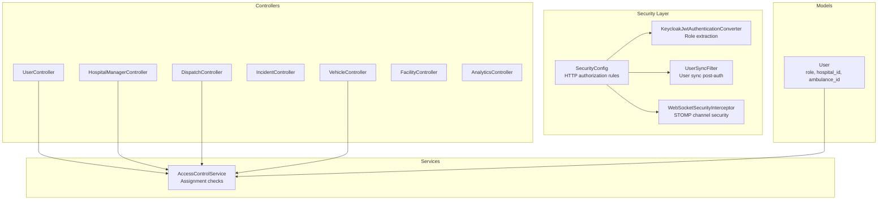
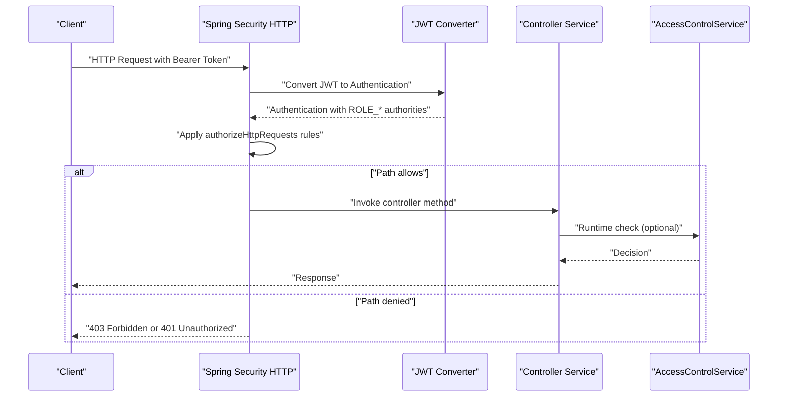
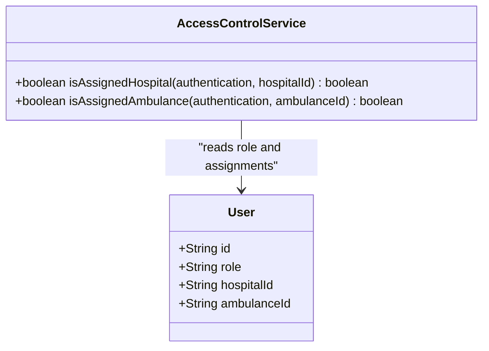
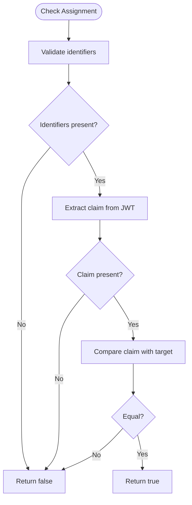
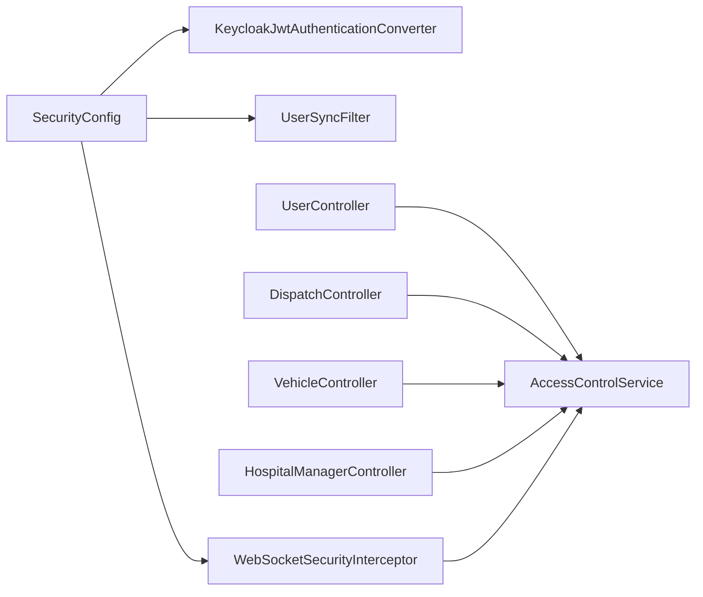

# Authorization Rules

<cite>
**Referenced Files in This Document**
- [SecurityConfig.java](file://src/main/java/com/example/ems_command_center/config/SecurityConfig.java)
- [KeycloakJwtAuthenticationConverter.java](file://src/main/java/com/example/ems_command_center/config/KeycloakJwtAuthenticationConverter.java)
- [UserSyncFilter.java](file://src/main/java/com/example/ems_command_center/config/UserSyncFilter.java)
- [WebSocketSecurityInterceptor.java](file://src/main/java/com/example/ems_command_center/config/WebSocketSecurityInterceptor.java)
- [AccessControlService.java](file://src/main/java/com/example/ems_command_center/service/AccessControlService.java)
- [UserController.java](file://src/main/java/com/example/ems_command_center/controller/UserController.java)
- [HospitalManagerController.java](file://src/main/java/com/example/ems_command_center/controller/HospitalManagerController.java)
- [DispatchController.java](file://src/main/java/com/example/ems_command_center/controller/DispatchController.java)
- [IncidentController.java](file://src/main/java/com/example/ems_command_center/controller/IncidentController.java)
- [VehicleController.java](file://src/main/java/com/example/ems_command_center/controller/VehicleController.java)
- [FacilityController.java](file://src/main/java/com/example/ems_command_center/controller/FacilityController.java)
- [AnalyticsController.java](file://src/main/java/com/example/ems_command_center/controller/AnalyticsController.java)
- [User.java](file://src/main/java/com/example/ems_command_center/model/User.java)
- [application.yml](file://src/main/resources/application.yml)
</cite>

## Table of Contents
1. [Introduction](#introduction)
2. [Project Structure](#project-structure)
3. [Core Components](#core-components)
4. [Architecture Overview](#architecture-overview)
5. [Detailed Component Analysis](#detailed-component-analysis)
6. [Dependency Analysis](#dependency-analysis)
7. [Performance Considerations](#performance-considerations)
8. [Troubleshooting Guide](#troubleshooting-guide)
9. [Conclusion](#conclusion)

## Introduction
This document defines the authorization rules for the EMS Command Center application. It explains the role-based access control (RBAC) model with four roles: ADMIN, MANAGER, DRIVER, and USER. It documents the hierarchical permission structure across HTTP security and method-level security annotations, the precedence and inheritance of permissions, and cross-role access patterns. It also provides a comprehensive endpoint authorization matrix, details the AccessControlService implementation for runtime permission checks, and covers edge cases, permission conflicts, and authorization bypass scenarios. Finally, it outlines examples of role-based menu visibility and feature access control.

## Project Structure
The authorization system spans configuration, controllers, services, and models:
- Security configuration enforces HTTP-level authorization and JWT conversion.
- Controllers apply method-level security annotations for fine-grained access control.
- Services implement runtime checks for role-specific assignments.
- Models carry role and assignment attributes used by authorization logic.

**Diagram sources**
- [SecurityConfig.java:44-98](file://src/main/java/com/example/ems_command_center/config/SecurityConfig.java#L44-L98)
- [KeycloakJwtAuthenticationConverter.java:18-87](file://src/main/java/com/example/ems_command_center/config/KeycloakJwtAuthenticationConverter.java#L18-L87)
- [UserSyncFilter.java:18-51](file://src/main/java/com/example/ems_command_center/config/UserSyncFilter.java#L18-L51)
- [WebSocketSecurityInterceptor.java:18-113](file://src/main/java/com/example/ems_command_center/config/WebSocketSecurityInterceptor.java#L18-L113)
- [AccessControlService.java:8-38](file://src/main/java/com/example/ems_command_center/service/AccessControlService.java#L8-L38)
- [User.java:21-28](file://src/main/java/com/example/ems_command_center/model/User.java#L21-L28)

**Section sources**
- [SecurityConfig.java:26-98](file://src/main/java/com/example/ems_command_center/config/SecurityConfig.java#L26-L98)
- [KeycloakJwtAuthenticationConverter.java:18-87](file://src/main/java/com/example/ems_command_center/config/KeycloakJwtAuthenticationConverter.java#L18-L87)
- [UserSyncFilter.java:18-51](file://src/main/java/com/example/ems_command_center/config/UserSyncFilter.java#L18-L51)
- [WebSocketSecurityInterceptor.java:18-113](file://src/main/java/com/example/ems_command_center/config/WebSocketSecurityInterceptor.java#L18-L113)
- [AccessControlService.java:8-38](file://src/main/java/com/example/ems_command_center/service/AccessControlService.java#L8-L38)
- [User.java:21-28](file://src/main/java/com/example/ems_command_center/model/User.java#L21-L28)

## Core Components
- Role extraction and authority mapping: Roles from Keycloak are transformed into Spring authorities with the ROLE_ prefix.
- HTTP-level authorization: Path-based rules define which roles can access which endpoints and HTTP methods.
- Method-level authorization: PreAuthorize annotations on controllers enforce fine-grained access per operation.
- Runtime authorization checks: AccessControlService evaluates assignment-based permissions for sensitive operations.
- WebSocket authorization: STOMP channel interceptor validates subscriptions based on roles and assignments.

**Section sources**
- [KeycloakJwtAuthenticationConverter.java:43-86](file://src/main/java/com/example/ems_command_center/config/KeycloakJwtAuthenticationConverter.java#L43-L86)
- [SecurityConfig.java:52-92](file://src/main/java/com/example/ems_command_center/config/SecurityConfig.java#L52-L92)
- [AccessControlService.java:13-36](file://src/main/java/com/example/ems_command_center/service/AccessControlService.java#L13-L36)
- [WebSocketSecurityInterceptor.java:34-111](file://src/main/java/com/example/ems_command_center/config/WebSocketSecurityInterceptor.java#L34-L111)

## Architecture Overview
The authorization architecture combines OAuth 2.0 Resource Server with Spring Security:
- JWT tokens are validated and converted into authenticated principals with authorities.
- HTTP requests are authorized against path-based rules.
- Method-level annotations enforce additional constraints.
- Runtime checks ensure users operate only within their assigned units.

**Diagram sources**
- [SecurityConfig.java:44-98](file://src/main/java/com/example/ems_command_center/config/SecurityConfig.java#L44-L98)
- [KeycloakJwtAuthenticationConverter.java:29-41](file://src/main/java/com/example/ems_command_center/config/KeycloakJwtAuthenticationConverter.java#L29-L41)
- [AccessControlService.java:13-36](file://src/main/java/com/example/ems_command_center/service/AccessControlService.java#L13-L36)

## Detailed Component Analysis

### Role Model and Claims
- User model carries role and assignment fields used by authorization logic.
- AccessControlService reads claims from the JWT to determine unit assignments.

**Diagram sources**
- [User.java:21-28](file://src/main/java/com/example/ems_command_center/model/User.java#L21-L28)
- [AccessControlService.java:13-36](file://src/main/java/com/example/ems_command_center/service/AccessControlService.java#L13-L36)

**Section sources**
- [User.java:21-28](file://src/main/java/com/example/ems_command_center/model/User.java#L21-L28)
- [AccessControlService.java:13-36](file://src/main/java/com/example/ems_command_center/service/AccessControlService.java#L13-L36)

### HTTP Security Configuration
- Stateless session policy.
- CORS configuration for development origins.
- Exception handlers for unauthorized and forbidden responses.
- Path-based authorization rules:
  - Public docs and websockets permitted.
  - GET /api/profile, GET /api/users/me, GET /api/users/me/assignment authenticated.
  - POST/PUT/DELETE /api/users/** restricted to ADMIN.
  - GET /api/users/** and /api/hospital-manager/** restricted to ADMIN and MANAGER.
  - GET /api/analytics/** restricted to ADMIN and MANAGER.
  - GET /api/stats, /api/facilities/**, /api/hospitals/**, /api/incidents/** open to ADMIN, MANAGER, DRIVER, USER.
  - GET /api/dispatch/** and /api/vehicles/** open to ADMIN, MANAGER, DRIVER.
  - POST /api/incidents/** open to ADMIN, MANAGER, USER, DRIVER.
  - POST /api/dispatch/**, /api/hospitals/**, /api/hospital-manager/** restricted to ADMIN, MANAGER.
  - POST /api/vehicles/** restricted to ADMIN, MANAGER.
  - PUT /api/vehicles/** open to ADMIN, MANAGER, DRIVER.
  - PUT /api/incidents/**, /api/hospitals/**, /api/hospital-manager/** restricted to ADMIN, MANAGER.
  - DELETE /api/incidents/** restricted to ADMIN, MANAGER.
  - DELETE /api/hospitals/**, /api/vehicles/** restricted to ADMIN.
  - All other /api/** denied.

**Section sources**
- [SecurityConfig.java:44-98](file://src/main/java/com/example/ems_command_center/config/SecurityConfig.java#L44-L98)

### Method-Level Security Annotations
- UserController:
  - GET /api/users: ADMIN, MANAGER.
  - GET /api/users/{id}: ADMIN, MANAGER.
  - GET /api/users/role/{role}: ADMIN, MANAGER.
  - POST /api/users: ADMIN.
  - PUT /api/users/{id}: ADMIN.
  - DELETE /api/users/{id}: ADMIN.
  - GET /api/users/me: isAuthenticated().
  - GET /api/users/me/assignment: DRIVER.
- HospitalManagerController:
  - GET /api/hospital-manager/overview: ADMIN, MANAGER.
  - PUT /api/hospital-manager/patients/{id}: ADMIN, MANAGER.
  - PUT /api/hospital-manager/beds/{id}: ADMIN, MANAGER.
  - PUT /api/hospital-manager/resources/{id}: ADMIN, MANAGER.
  - POST /api/hospital-manager/patients/{id}/validate-care: ADMIN, MANAGER.
- DispatchController:
  - GET /api/dispatch/ambulances/available: ADMIN, MANAGER, DRIVER.
  - GET /api/dispatch/routes: ADMIN, MANAGER, or DRIVER with assignment check via AccessControlService.
  - POST /api/dispatch/assignments: ADMIN, MANAGER.
- IncidentController:
  - GET /api/incidents: ADMIN, MANAGER, USER, DRIVER.
  - GET /api/incidents/by-id/{id}: ADMIN, MANAGER, USER, DRIVER.
  - POST /api/incidents: ADMIN, MANAGER, USER, DRIVER.
  - PUT /api/incidents/{id}: ADMIN, MANAGER.
  - DELETE /api/incidents/{id}: ADMIN, MANAGER.
- VehicleController:
  - GET /api/vehicles: ADMIN, MANAGER, DRIVER.
  - POST /api/vehicles: ADMIN, MANAGER.
  - PUT /api/vehicles/{id}: ADMIN, MANAGER, or DRIVER with assignment check via AccessControlService.
  - DELETE /api/vehicles/{id}: ADMIN.
- FacilityController:
  - GET /api/facilities: ADMIN, MANAGER, DRIVER, USER.
- AnalyticsController:
  - GET /api/analytics/dispatch: ADMIN, MANAGER.
  - GET /api/analytics/response: ADMIN, MANAGER.

**Section sources**
- [UserController.java:28-90](file://src/main/java/com/example/ems_command_center/controller/UserController.java#L28-L90)
- [HospitalManagerController.java:27-61](file://src/main/java/com/example/ems_command_center/controller/HospitalManagerController.java#L27-L61)
- [DispatchController.java:33-55](file://src/main/java/com/example/ems_command_center/controller/DispatchController.java#L33-L55)
- [IncidentController.java:25-59](file://src/main/java/com/example/ems_command_center/controller/IncidentController.java#L25-L59)
- [VehicleController.java:25-55](file://src/main/java/com/example/ems_command_center/controller/VehicleController.java#L25-L55)
- [FacilityController.java:24-29](file://src/main/java/com/example/ems_command_center/controller/FacilityController.java#L24-L29)
- [AnalyticsController.java:24-36](file://src/main/java/com/example/ems_command_center/controller/AnalyticsController.java#L24-L36)

### AccessControlService Implementation
- isAssignedHospital: Compares the hospital_id claim from the JWT with the target hospital identifier.
- isAssignedAmbulance: Compares the ambulance_id claim from the JWT with the target ambulance identifier.
- Used in runtime checks for dispatch routes and vehicle updates to ensure DRIVERs operate only within their assigned unit.

**Diagram sources**
- [AccessControlService.java:13-36](file://src/main/java/com/example/ems_command_center/service/AccessControlService.java#L13-L36)

**Section sources**
- [AccessControlService.java:13-36](file://src/main/java/com/example/ems_command_center/service/AccessControlService.java#L13-L36)

### WebSocket Authorization
- CONNECT: Validates JWT and sets the user on the STOMP accessor.
- SUBSCRIBE:
  - Drivers topic: ADMIN can subscribe freely; MANAGER and DRIVER can subscribe to general dispatches; DRIVERs can subscribe to their assigned ambulance’s channels.
  - Hospital manager and hospitals topics: Only ADMIN or MANAGER can subscribe; MANAGER can subscribe to general hospital channels; ADMIN can subscribe to any hospital channel; non-ADMIN MANAGER must match the hospital_id claim to the target hospital.

**Section sources**
- [WebSocketSecurityInterceptor.java:34-111](file://src/main/java/com/example/ems_command_center/config/WebSocketSecurityInterceptor.java#L34-L111)

### User Synchronization Filter
- Runs after authentication to synchronize user data from the JWT subject and roles.
- Logs failures but does not block requests.

**Section sources**
- [UserSyncFilter.java:26-42](file://src/main/java/com/example/ems_command_center/config/UserSyncFilter.java#L26-L42)

## Dependency Analysis
The authorization system depends on:
- Spring Security for HTTP and method-level security.
- Keycloak for JWT issuance and role claims.
- AccessControlService for runtime assignment checks.
- WebSocketSecurityInterceptor for STOMP channel security.

**Diagram sources**
- [SecurityConfig.java:44-98](file://src/main/java/com/example/ems_command_center/config/SecurityConfig.java#L44-L98)
- [KeycloakJwtAuthenticationConverter.java:18-87](file://src/main/java/com/example/ems_command_center/config/KeycloakJwtAuthenticationConverter.java#L18-L87)
- [UserSyncFilter.java:18-51](file://src/main/java/com/example/ems_command_center/config/UserSyncFilter.java#L18-L51)
- [WebSocketSecurityInterceptor.java:18-113](file://src/main/java/com/example/ems_command_center/config/WebSocketSecurityInterceptor.java#L18-L113)
- [AccessControlService.java:8-38](file://src/main/java/com/example/ems_command_center/service/AccessControlService.java#L8-L38)

**Section sources**
- [SecurityConfig.java:44-98](file://src/main/java/com/example/ems_command_center/config/SecurityConfig.java#L44-L98)
- [KeycloakJwtAuthenticationConverter.java:18-87](file://src/main/java/com/example/ems_command_center/config/KeycloakJwtAuthenticationConverter.java#L18-L87)
- [UserSyncFilter.java:18-51](file://src/main/java/com/example/ems_command_center/config/UserSyncFilter.java#L18-L51)
- [WebSocketSecurityInterceptor.java:18-113](file://src/main/java/com/example/ems_command_center/config/WebSocketSecurityInterceptor.java#L18-L113)
- [AccessControlService.java:8-38](file://src/main/java/com/example/ems_command_center/service/AccessControlService.java#L8-L38)

## Performance Considerations
- Stateless JWT validation avoids server-side session storage.
- Minimal overhead from runtime checks; keep checks localized and avoid heavy computations.
- WebSocket interceptor performs lightweight parsing and comparisons; ensure destinations are well-formed to prevent unnecessary processing.

## Troubleshooting Guide
Common issues and resolutions:
- Unauthorized (401): Missing or invalid Bearer token; verify KEYCLOAK_JWK_SET_URI and client configuration.
- Forbidden (403): Insufficient role for the requested endpoint; confirm role extraction and path-based rules.
- Assignment mismatch: DRIVER attempting to access non-assigned ambulance/hospital; ensure JWT claims hospital_id/ambulance_id are correct.
- WebSocket subscription failure: Non-ADMIN MANAGER subscribing to hospital topic without matching hospital_id claim; verify claims and destination path.
- User sync failure: Non-blocking warning logged; inspect logs for sync errors but note that requests still proceed.

**Section sources**
- [SecurityConfig.java:138-154](file://src/main/java/com/example/ems_command_center/config/SecurityConfig.java#L138-L154)
- [WebSocketSecurityInterceptor.java:62-106](file://src/main/java/com/example/ems_command_center/config/WebSocketSecurityInterceptor.java#L62-L106)
- [UserSyncFilter.java:33-38](file://src/main/java/com/example/ems_command_center/config/UserSyncFilter.java#L33-L38)

## Conclusion
The EMS Command Center employs a layered authorization strategy combining HTTP-level path rules, method-level annotations, and runtime assignment checks. Roles ADMIN, MANAGER, DRIVER, and USER are enforced consistently across REST endpoints and WebSocket channels. ADMIN holds the highest privilege, MANAGER operates within broader operational scopes, DRIVER is constrained to assigned units, and USER has read-only access to public resources. The AccessControlService ensures precise enforcement of assignment-based permissions, while WebSocketSecurityInterceptor secures real-time channels. Together, these mechanisms provide robust, maintainable, and extensible authorization for the application.