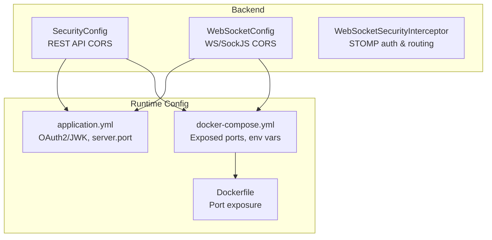
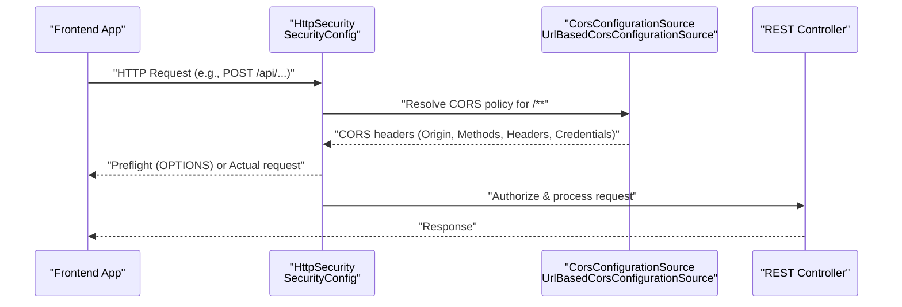
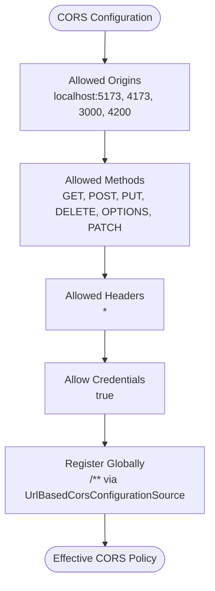
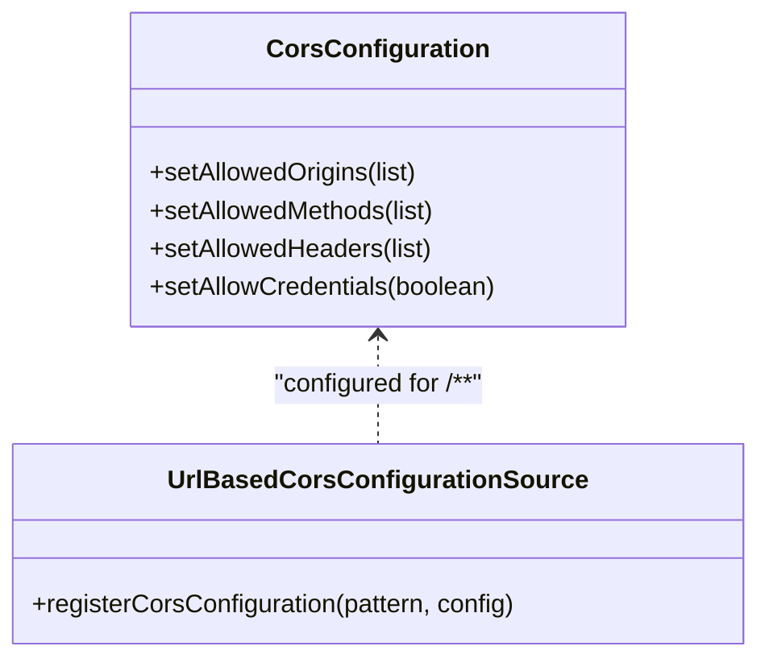
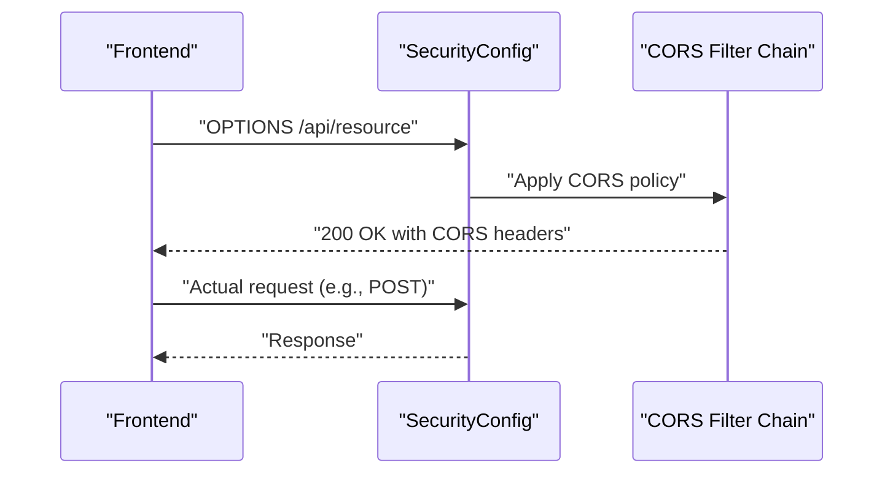
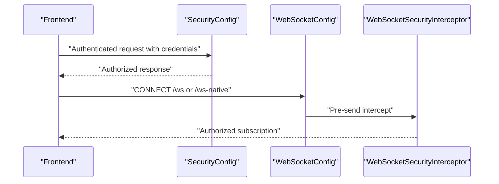
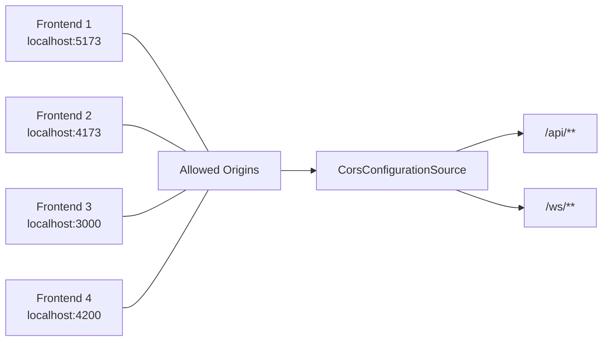
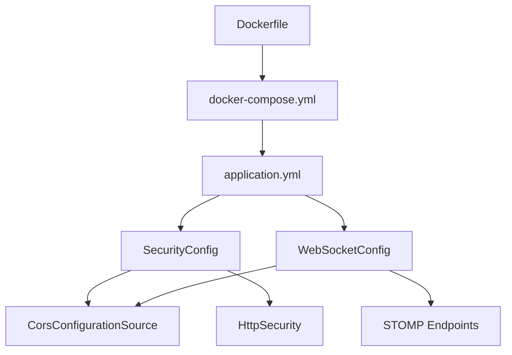

# CORS Configuration

<cite>
**Referenced Files in This Document**
- [SecurityConfig.java](file://src/main/java/com/example/ems_command_center/config/SecurityConfig.java)
- [WebSocketConfig.java](file://src/main/java/com/example/ems_command_center/config/WebSocketConfig.java)
- [WebSocketSecurityInterceptor.java](file://src/main/java/com/example/ems_command_center/config/WebSocketSecurityInterceptor.java)
- [application.yml](file://src/main/resources/application.yml)
- [Dockerfile](file://Dockerfile)
- [docker-compose.yml](file://docker-compose.yml)
</cite>

## Table of Contents
1. [Introduction](#introduction)
2. [Project Structure](#project-structure)
3. [Core Components](#core-components)
4. [Architecture Overview](#architecture-overview)
5. [Detailed Component Analysis](#detailed-component-analysis)
6. [Dependency Analysis](#dependency-analysis)
7. [Performance Considerations](#performance-considerations)
8. [Troubleshooting Guide](#troubleshooting-guide)
9. [Conclusion](#conclusion)
10. [Appendices](#appendices)

## Introduction
This document explains the Cross-Origin Resource Sharing (CORS) configuration for the EMS Command Center backend application. It focuses on the SecurityConfig CORS setup, the UrlBasedCorsConfigurationSource registration, preflight request handling, and credential-based authentication support. It also covers development environment allowances for multiple frontend ports, production deployment considerations, and security implications. Guidance is included for frontend integration patterns, origin validation, common browser CORS errors, debugging techniques, and production hardening recommendations.

## Project Structure
The CORS configuration is centralized in the SecurityConfig class and complemented by WebSocketConfig for real-time endpoints. The application’s runtime environment is defined via application.yml and docker-compose.yml, which influence how origins and ports are exposed to clients.

**Diagram sources**
- [SecurityConfig.java:105-120](file://src/main/java/com/example/ems_command_center/config/SecurityConfig.java#L105-L120)
- [WebSocketConfig.java:31-50](file://src/main/java/com/example/ems_command_center/config/WebSocketConfig.java#L31-L50)
- [application.yml:10-17](file://src/main/resources/application.yml#L10-L17)
- [docker-compose.yml:38-63](file://docker-compose.yml#L38-L63)
- [Dockerfile:1-7](file://Dockerfile#L1-L7)

**Section sources**
- [SecurityConfig.java:105-120](file://src/main/java/com/example/ems_command_center/config/SecurityConfig.java#L105-L120)
- [WebSocketConfig.java:31-50](file://src/main/java/com/example/ems_command_center/config/WebSocketConfig.java#L31-L50)
- [application.yml:10-17](file://src/main/resources/application.yml#L10-L17)
- [docker-compose.yml:38-63](file://docker-compose.yml#L38-L63)
- [Dockerfile:1-7](file://Dockerfile#L1-L7)

## Core Components
- REST API CORS configuration via SecurityConfig:
  - Allowed origins: localhost ports 5173, 4173, 3000, 4200
  - Allowed methods: GET, POST, PUT, DELETE, OPTIONS, PATCH
  - Allowed headers: wildcard
  - Credentials allowed: true
  - Applied globally to all paths via UrlBasedCorsConfigurationSource
- WebSocket CORS configuration via WebSocketConfig:
  - STOMP endpoints /ws and /ws-native configured with allowed origin patterns matching the same localhost ports
- Credential-based authentication:
  - AllowCredentials enabled in REST CORS supports sending cookies/bearer tokens
  - OAuth2 JWT bearer tokens are validated by the backend; credentials are required for protected endpoints

**Section sources**
- [SecurityConfig.java:105-120](file://src/main/java/com/example/ems_command_center/config/SecurityConfig.java#L105-L120)
- [WebSocketConfig.java:31-50](file://src/main/java/com/example/ems_command_center/config/WebSocketConfig.java#L31-L50)

## Architecture Overview
The CORS architecture integrates with Spring Security’s HttpSecurity and applies to both REST and WebSocket endpoints. The configuration ensures that development frontends running on distinct ports can communicate with the backend while maintaining strict origin controls.

**Diagram sources**
- [SecurityConfig.java:44-98](file://src/main/java/com/example/ems_command_center/config/SecurityConfig.java#L44-L98)
- [SecurityConfig.java:105-120](file://src/main/java/com/example/ems_command_center/config/SecurityConfig.java#L105-L120)

## Detailed Component Analysis

### REST API CORS Configuration (SecurityConfig)
- Allowed origins: localhost ports 5173, 4173, 3000, 4200
- Allowed methods: GET, POST, PUT, DELETE, OPTIONS, PATCH
- Allowed headers: wildcard
- Credentials allowed: true
- Global registration via UrlBasedCorsConfigurationSource for all paths

**Diagram sources**
- [SecurityConfig.java:105-120](file://src/main/java/com/example/ems_command_center/config/SecurityConfig.java#L105-L120)

**Section sources**
- [SecurityConfig.java:105-120](file://src/main/java/com/example/ems_command_center/config/SecurityConfig.java#L105-L120)

### UrlBasedCorsConfigurationSource Setup
- Registers a single CORS policy for all paths
- Enables preflight requests (OPTIONS) to be handled automatically by Spring Web MVC
- Applies to both REST and WebSocket handshake paths

**Diagram sources**
- [SecurityConfig.java:105-120](file://src/main/java/com/example/ems_command_center/config/SecurityConfig.java#L105-L120)

**Section sources**
- [SecurityConfig.java:105-120](file://src/main/java/com/example/ems_command_center/config/SecurityConfig.java#L105-L120)

### Preflight Request Handling
- OPTIONS preflight requests are supported by the allowed methods list and automatic handling by the CORS filter chain
- Frontends can safely send complex requests (e.g., with custom headers or credentials)

**Diagram sources**
- [SecurityConfig.java:105-120](file://src/main/java/com/example/ems_command_center/config/SecurityConfig.java#L105-L120)

**Section sources**
- [SecurityConfig.java:105-120](file://src/main/java/com/example/ems_command_center/config/SecurityConfig.java#L105-L120)

### Credential-Based Authentication Support
- AllowCredentials enabled allows browsers to send cookies and Authorization headers
- REST endpoints require JWT bearer tokens validated by OAuth2 Resource Server
- WebSocket endpoints accept Authorization headers during CONNECT and enforce per-destination access rules

**Diagram sources**
- [SecurityConfig.java:44-98](file://src/main/java/com/example/ems_command_center/config/SecurityConfig.java#L44-L98)
- [WebSocketConfig.java:31-50](file://src/main/java/com/example/ems_command_center/config/WebSocketConfig.java#L31-L50)
- [WebSocketSecurityInterceptor.java:34-111](file://src/main/java/com/example/ems_command_center/config/WebSocketSecurityInterceptor.java#L34-L111)

**Section sources**
- [SecurityConfig.java:44-98](file://src/main/java/com/example/ems_command_center/config/SecurityConfig.java#L44-L98)
- [WebSocketConfig.java:31-50](file://src/main/java/com/example/ems_command_center/config/WebSocketConfig.java#L31-L50)
- [WebSocketSecurityInterceptor.java:34-111](file://src/main/java/com/example/ems_command_center/config/WebSocketSecurityInterceptor.java#L34-L111)

### Development Environment Configuration
- Allowed origins explicitly include localhost ports 5173, 4173, 3000, 4200 to support multiple frontend frameworks and ports
- docker-compose exposes the backend on port 8081 and forwards environment variables for Keycloak JWK set URI and client ID
- The backend’s server.port is configurable via application.yml and docker-compose

**Diagram sources**
- [SecurityConfig.java:108-112](file://src/main/java/com/example/ems_command_center/config/SecurityConfig.java#L108-L112)
- [WebSocketConfig.java:34-47](file://src/main/java/com/example/ems_command_center/config/WebSocketConfig.java#L34-L47)
- [docker-compose.yml:46-51](file://docker-compose.yml#L46-L51)
- [application.yml:16-17](file://src/main/resources/application.yml#L16-L17)

**Section sources**
- [SecurityConfig.java:108-112](file://src/main/java/com/example/ems_command_center/config/SecurityConfig.java#L108-L112)
- [WebSocketConfig.java:34-47](file://src/main/java/com/example/ems_command_center/config/WebSocketConfig.java#L34-L47)
- [docker-compose.yml:46-51](file://docker-compose.yml#L46-L51)
- [application.yml:16-17](file://src/main/resources/application.yml#L16-L17)

### Production Deployment Considerations
- Replace localhost origins with your domain(s) and subdomains
- Limit allowed methods and headers to the minimum required
- Disable allowCredentials unless cookies/tokens must be sent cross-origin
- Enforce HTTPS-only origins and consider HSTS
- Use allowedOriginPatterns with wildcards cautiously; prefer explicit domains
- Consider adding host-based checks or reverse proxy headers for origin validation

[No sources needed since this section provides general guidance]

## Dependency Analysis
- SecurityConfig depends on Spring Security’s HttpSecurity and CORS support
- UrlBasedCorsConfigurationSource is a Spring Web MVC component used to apply CORS policies
- WebSocketConfig complements REST CORS for WebSocket endpoints
- Runtime environment variables (JWK set URI, client ID) influence endpoint availability and authentication flow

**Diagram sources**
- [SecurityConfig.java:44-98](file://src/main/java/com/example/ems_command_center/config/SecurityConfig.java#L44-L98)
- [WebSocketConfig.java:31-50](file://src/main/java/com/example/ems_command_center/config/WebSocketConfig.java#L31-L50)
- [application.yml:10-17](file://src/main/resources/application.yml#L10-L17)
- [docker-compose.yml:38-63](file://docker-compose.yml#L38-L63)
- [Dockerfile:1-7](file://Dockerfile#L1-L7)

**Section sources**
- [SecurityConfig.java:44-98](file://src/main/java/com/example/ems_command_center/config/SecurityConfig.java#L44-L98)
- [WebSocketConfig.java:31-50](file://src/main/java/com/example/ems_command_center/config/WebSocketConfig.java#L31-L50)
- [application.yml:10-17](file://src/main/resources/application.yml#L10-L17)
- [docker-compose.yml:38-63](file://docker-compose.yml#L38-L63)
- [Dockerfile:1-7](file://Dockerfile#L1-L7)

## Performance Considerations
- Wildcard headers simplify development but can increase preflight overhead; restrict to necessary headers in production
- Global CORS registration is efficient; avoid registering many patterns unnecessarily
- Keep allowed methods minimal to reduce preflight complexity

[No sources needed since this section provides general guidance]

## Troubleshooting Guide
Common CORS-related browser errors and resolutions:
- Blocked by CORS policy: Origin not allowed
  - Cause: Client origin not in allowed origins
  - Fix: Add the origin to allowed origins or use allowedOriginPatterns
- Preflight request fails (OPTIONS)
  - Cause: Missing or incorrect allowed methods/headers
  - Fix: Ensure OPTIONS is allowed and headers match actual requests
- Credential requests blocked
  - Cause: allowCredentials false or mismatched origin
  - Fix: Enable allowCredentials and ensure exact origin match
- WebSocket handshake failures
  - Cause: Origin not allowed for /ws or /ws-native
  - Fix: Configure allowed origin patterns for WebSocket endpoints

Development vs. production differences:
- Development: Multiple localhost ports allowed for different frontends
- Production: Explicit domains/subdomains only; disable wildcard origins

Debugging techniques:
- Inspect browser Network tab for preflight OPTIONS responses and CORS headers
- Verify backend logs for CORS filter application
- Confirm environment variables for JWK set URI and client ID are correct in docker-compose

**Section sources**
- [SecurityConfig.java:108-115](file://src/main/java/com/example/ems_command_center/config/SecurityConfig.java#L108-L115)
- [WebSocketConfig.java:34-47](file://src/main/java/com/example/ems_command_center/config/WebSocketConfig.java#L34-L47)

## Conclusion
The backend enforces a pragmatic CORS policy for development, enabling multiple frontend ports and credentials, while supporting both REST and WebSocket endpoints. For production, tighten origin lists, minimize allowed methods/headers, and disable credentials unless required. Use environment variables and reverse proxies to align origins with deployed domains.

[No sources needed since this section summarizes without analyzing specific files]

## Appendices

### Frontend Integration Patterns
- REST: Send Authorization: Bearer <token> with credentials enabled
- WebSocket: Connect to /ws or /ws-native with Authorization header; subscriptions validated per destination

**Section sources**
- [SecurityConfig.java:115](file://src/main/java/com/example/ems_command_center/config/SecurityConfig.java#L115)
- [WebSocketConfig.java:32-49](file://src/main/java/com/example/ems_command_center/config/WebSocketConfig.java#L32-L49)
- [WebSocketSecurityInterceptor.java:41-108](file://src/main/java/com/example/ems_command_center/config/WebSocketSecurityInterceptor.java#L41-L108)

### Security Best Practices for Production
- Use explicit allowed origins (no wildcards)
- Limit allowed methods and headers to required subsets
- Disable allowCredentials unless cookies/tokens must be sent
- Enforce HTTPS-only origins and consider HSTS
- Validate X-Forwarded-Proto/Host headers behind reverse proxies
- Monitor and log CORS violations

[No sources needed since this section provides general guidance]