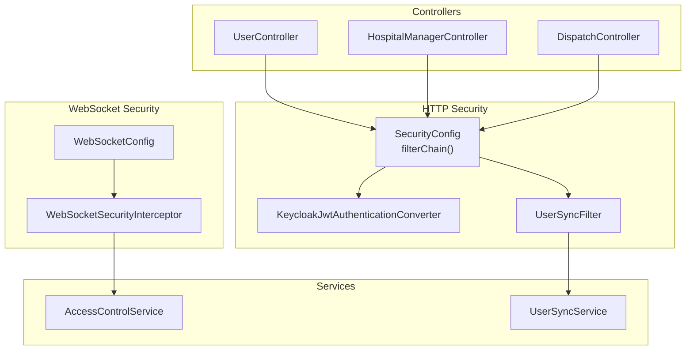
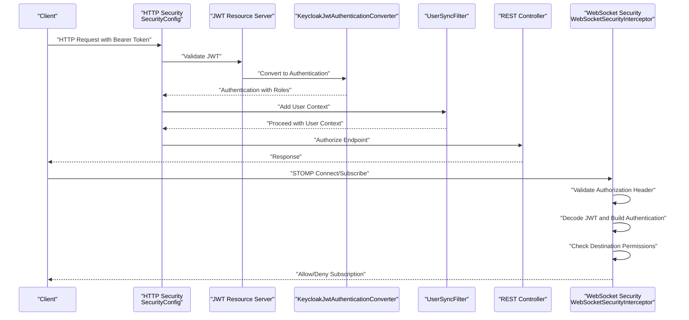
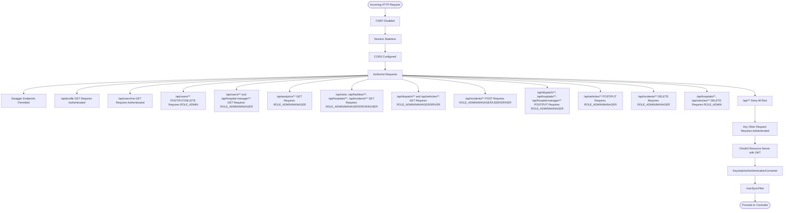
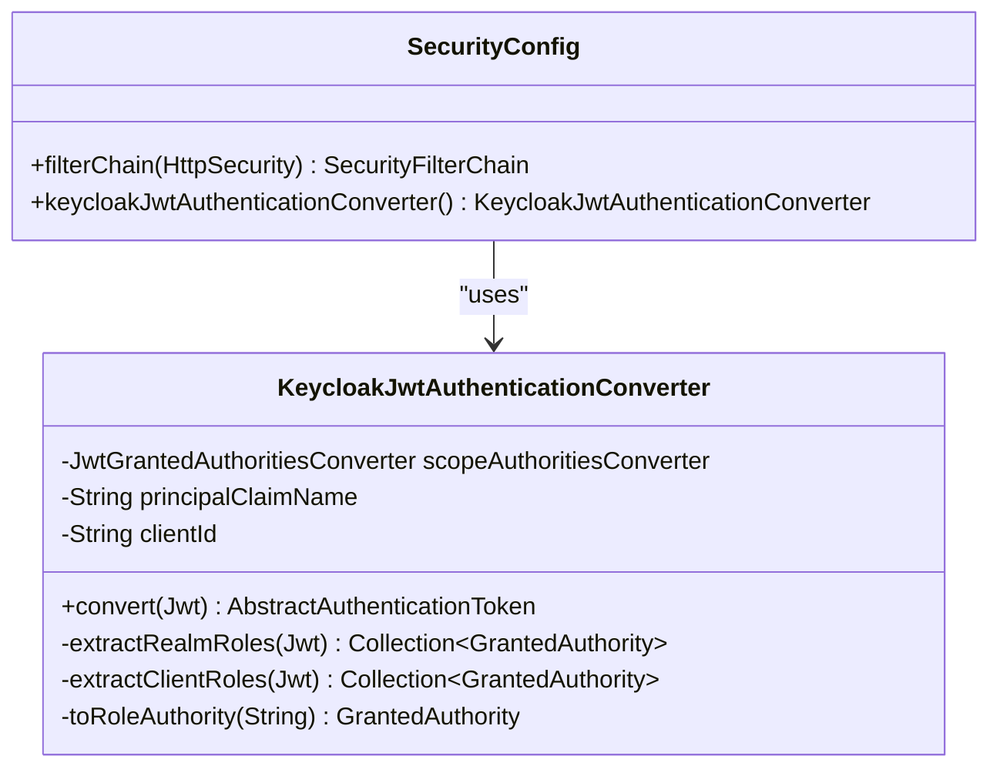
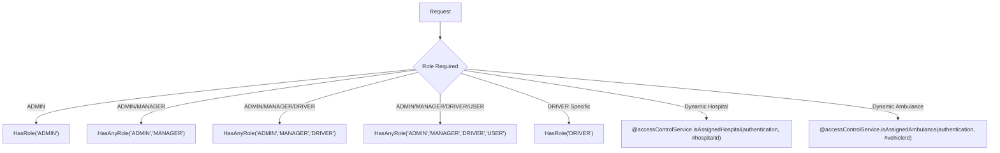
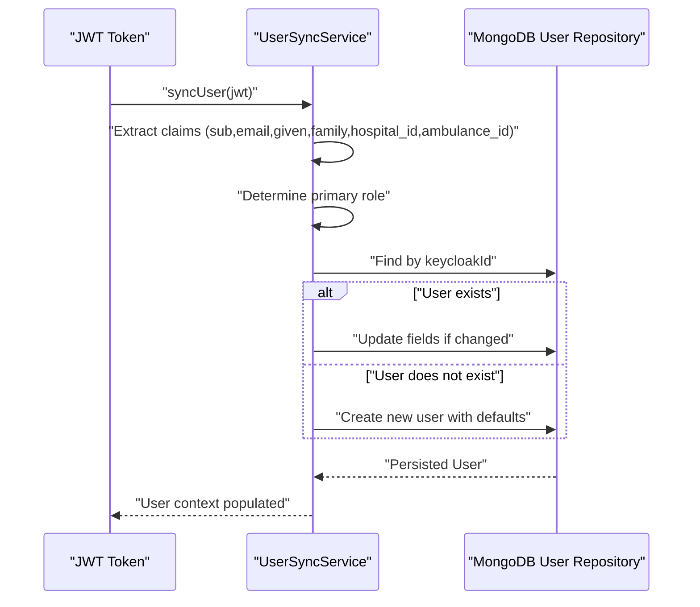
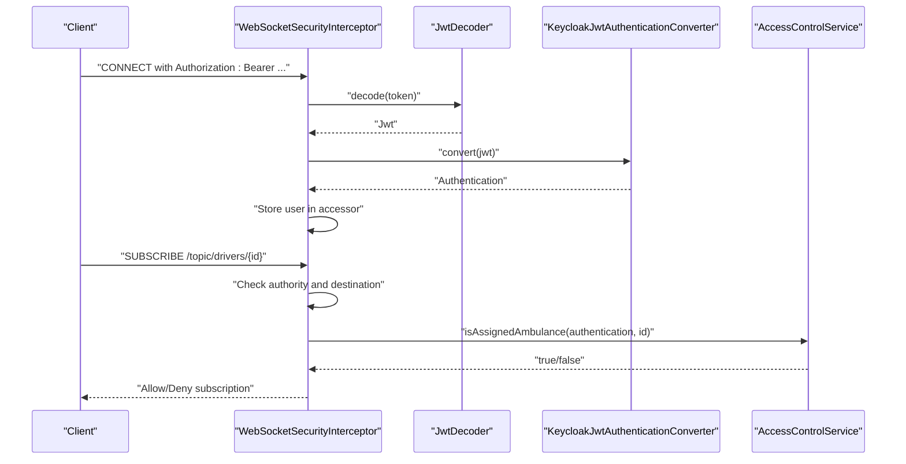
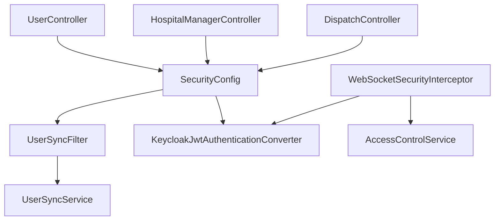

# Security Configuration

<cite>
**Referenced Files in This Document**
- [SecurityConfig.java](file://src/main/java/com/example/ems_command_center/config/SecurityConfig.java)
- [KeycloakJwtAuthenticationConverter.java](file://src/main/java/com/example/ems_command_center/config/KeycloakJwtAuthenticationConverter.java)
- [WebSocketConfig.java](file://src/main/java/com/example/ems_command_center/config/WebSocketConfig.java)
- [WebSocketSecurityInterceptor.java](file://src/main/java/com/example/ems_command_center/config/WebSocketSecurityInterceptor.java)
- [UserSyncFilter.java](file://src/main/java/com/example/ems_command_center/config/UserSyncFilter.java)
- [AccessControlService.java](file://src/main/java/com/example/ems_command_center/service/AccessControlService.java)
- [UserSyncService.java](file://src/main/java/com/example/ems_command_center/service/UserSyncService.java)
- [UserController.java](file://src/main/java/com/example/ems_command_center/controller/UserController.java)
- [HospitalManagerController.java](file://src/main/java/com/example/ems_command_center/controller/HospitalManagerController.java)
- [DispatchController.java](file://src/main/java/com/example/ems_command_center/controller/DispatchController.java)
- [AuthenticatedUser.java](file://src/main/java/com/example/ems_command_center/model/AuthenticatedUser.java)
- [application.yml](file://src/main/resources/application.yml)
</cite>

## Table of Contents
1. [Introduction](#introduction)
2. [Project Structure](#project-structure)
3. [Core Components](#core-components)
4. [Architecture Overview](#architecture-overview)
5. [Detailed Component Analysis](#detailed-component-analysis)
6. [Dependency Analysis](#dependency-analysis)
7. [Performance Considerations](#performance-considerations)
8. [Troubleshooting Guide](#troubleshooting-guide)
9. [Conclusion](#conclusion)

## Introduction
This document provides comprehensive security configuration documentation for the EMS Command Center application. It details the Keycloak OAuth2 integration, JWT token validation, role-based access control (RBAC), and custom authentication converter configuration. It also covers the security filter chain, HTTP security configuration, WebSocket security interceptor setup, role hierarchy, permission-based authorization rules, JWT token processing, claims extraction, user context population, security headers configuration, CORS settings, and CSRF protection. Practical examples demonstrate securing REST endpoints and WebSocket channels with proper authentication and authorization checks.

## Project Structure
The security configuration is implemented across several key components:
- HTTP security configuration and filter chain
- JWT authentication converter for Keycloak
- User synchronization filter for JWT claims
- WebSocket configuration and security interceptor
- Access control service for dynamic authorization checks
- Controller-level authorization annotations

**Diagram sources**
- [SecurityConfig.java:44-98](file://src/main/java/com/example/ems_command_center/config/SecurityConfig.java#L44-L98)
- [KeycloakJwtAuthenticationConverter.java:18-41](file://src/main/java/com/example/ems_command_center/config/KeycloakJwtAuthenticationConverter.java#L18-L41)
- [UserSyncFilter.java:18-42](file://src/main/java/com/example/ems_command_center/config/UserSyncFilter.java#L18-L42)
- [WebSocketConfig.java:12-49](file://src/main/java/com/example/ems_command_center/config/WebSocketConfig.java#L12-L49)
- [WebSocketSecurityInterceptor.java:18-32](file://src/main/java/com/example/ems_command_center/config/WebSocketSecurityInterceptor.java#L18-L32)
- [AccessControlService.java:8-37](file://src/main/java/com/example/ems_command_center/service/AccessControlService.java#L8-L37)
- [UserSyncService.java:13-39](file://src/main/java/com/example/ems_command_center/service/UserSyncService.java#L13-L39)

**Section sources**
- [SecurityConfig.java:26-98](file://src/main/java/com/example/ems_command_center/config/SecurityConfig.java#L26-L98)
- [WebSocketConfig.java:10-49](file://src/main/java/com/example/ems_command_center/config/WebSocketConfig.java#L10-L49)

## Core Components
- Keycloak OAuth2 integration with JWT resource server configuration
- Custom JWT authentication converter extracting realm and client roles
- Stateless session management with bearer token authentication
- CORS configuration allowing frontend origins
- JSON-formatted authentication entry point and access denied handlers
- User synchronization filter populating user context from JWT claims
- WebSocket STOMP endpoint configuration with SockJS fallback
- WebSocket security interceptor validating connections and subscriptions
- Access control service for dynamic authorization checks against claims

**Section sources**
- [SecurityConfig.java:31-41](file://src/main/java/com/example/ems_command_center/config/SecurityConfig.java#L31-L41)
- [KeycloakJwtAuthenticationConverter.java:18-86](file://src/main/java/com/example/ems_command_center/config/KeycloakJwtAuthenticationConverter.java#L18-L86)
- [UserSyncFilter.java:18-42](file://src/main/java/com/example/ems_command_center/config/UserSyncFilter.java#L18-L42)
- [WebSocketSecurityInterceptor.java:18-32](file://src/main/java/com/example/ems_command_center/config/WebSocketSecurityInterceptor.java#L18-L32)
- [AccessControlService.java:8-37](file://src/main/java/com/example/ems_command_center/service/AccessControlService.java#L8-L37)

## Architecture Overview
The security architecture integrates Spring Security with Keycloak for OAuth2 resource server authentication. JWT tokens are validated using JWK set URI, converted into Spring Security authentication with realm and client roles, and synchronized into the application user context. REST endpoints and WebSocket channels enforce role-based authorization with dynamic checks for hospital and ambulance assignments.

**Diagram sources**
- [SecurityConfig.java:44-98](file://src/main/java/com/example/ems_command_center/config/SecurityConfig.java#L44-L98)
- [KeycloakJwtAuthenticationConverter.java:29-41](file://src/main/java/com/example/ems_command_center/config/KeycloakJwtAuthenticationConverter.java#L29-L41)
- [UserSyncFilter.java:26-42](file://src/main/java/com/example/ems_command_center/config/UserSyncFilter.java#L26-L42)
- [WebSocketSecurityInterceptor.java:34-111](file://src/main/java/com/example/ems_command_center/config/WebSocketSecurityInterceptor.java#L34-L111)

## Detailed Component Analysis

### HTTP Security Filter Chain and Authorization Rules
The HTTP security configuration establishes:
- CSRF disabled for stateless REST APIs
- Session management stateless
- CORS configured for frontend origins
- Exception handling with JSON responses for unauthorized and forbidden
- OAuth2 resource server with custom JWT authentication converter
- User synchronization filter added after bearer token filter
- Comprehensive authorization rules per endpoint and HTTP method

**Diagram sources**
- [SecurityConfig.java:44-98](file://src/main/java/com/example/ems_command_center/config/SecurityConfig.java#L44-L98)
- [SecurityConfig.java:52-92](file://src/main/java/com/example/ems_command_center/config/SecurityConfig.java#L52-L92)

**Section sources**
- [SecurityConfig.java:44-98](file://src/main/java/com/example/ems_command_center/config/SecurityConfig.java#L44-L98)

### JWT Token Validation and Role-Based Access Control
Keycloak JWT validation is configured via JWK set URI. The custom authentication converter extracts:
- Realm roles from realm_access.roles
- Client roles from resource_access.{clientId}.roles
- Principal name from configured principal claim or falls back to subject
- Authorities mapped to ROLE_* format

**Diagram sources**
- [KeycloakJwtAuthenticationConverter.java:18-86](file://src/main/java/com/example/ems_command_center/config/KeycloakJwtAuthenticationConverter.java#L18-L86)
- [SecurityConfig.java:93-103](file://src/main/java/com/example/ems_command_center/config/SecurityConfig.java#L93-L103)

**Section sources**
- [KeycloakJwtAuthenticationConverter.java:29-86](file://src/main/java/com/example/ems_command_center/config/KeycloakJwtAuthenticationConverter.java#L29-L86)
- [application.yml:10-15](file://src/main/resources/application.yml#L10-L15)

### Role Hierarchy and Permission-Based Authorization
The system defines four roles with explicit hierarchy and permissions:
- ADMIN: Full administrative privileges
- MANAGER: Hospital and operational management
- DRIVER: Ambulance assignment and routing
- USER: General access for read operations

Authorization rules enforce:
- Administrative actions require ADMIN
- Management actions require ADMIN or MANAGER
- Operational actions require ADMIN, MANAGER, or DRIVER
- Public read actions require ADMIN, MANAGER, DRIVER, or USER
- Dynamic checks for hospital_id and ambulance_id claims

**Diagram sources**
- [SecurityConfig.java:67-91](file://src/main/java/com/example/ems_command_center/config/SecurityConfig.java#L67-L91)
- [DispatchController.java:42-48](file://src/main/java/com/example/ems_command_center/controller/DispatchController.java#L42-L48)
- [AccessControlService.java:13-36](file://src/main/java/com/example/ems_command_center/service/AccessControlService.java#L13-L36)

**Section sources**
- [SecurityConfig.java:67-91](file://src/main/java/com/example/ems_command_center/config/SecurityConfig.java#L67-L91)
- [AccessControlService.java:13-36](file://src/main/java/com/example/ems_command_center/service/AccessControlService.java#L13-L36)

### JWT Claims Extraction and User Context Population
The user synchronization process extracts JWT claims and maintains user context:
- Subject (keycloakId) as unique identifier
- Email, given_name, family_name for profile
- Primary role derived from realm_access.roles with priority ADMIN > MANAGER > DRIVER > USER
- hospital_id and ambulance_id claims for dynamic authorization
- Automatic creation or update of user records in MongoDB

**Diagram sources**
- [UserSyncService.java:26-39](file://src/main/java/com/example/ems_command_center/service/UserSyncService.java#L26-L39)
- [UserSyncService.java:41-73](file://src/main/java/com/example/ems_command_center/service/UserSyncService.java#L41-L73)
- [UserSyncService.java:75-90](file://src/main/java/com/example/ems_command_center/service/UserSyncService.java#L75-L90)
- [UserSyncService.java:96-109](file://src/main/java/com/example/ems_command_center/service/UserSyncService.java#L96-L109)

**Section sources**
- [UserSyncService.java:26-122](file://src/main/java/com/example/ems_command_center/service/UserSyncService.java#L26-L122)
- [AuthenticatedUser.java:5-15](file://src/main/java/com/example/ems_command_center/model/AuthenticatedUser.java#L5-L15)

### WebSocket Security Interceptor Setup
WebSocket endpoints support both native STOMP and SockJS. The security interceptor validates:
- CONNECT command requires Authorization header with Bearer token
- SUBSCRIBE command enforces destination-based authorization
- Drivers can subscribe to specific ambulance topics based on assignment
- Managers and admins can subscribe to hospital and dispatch topics
- Dynamic checks against hospital_id and ambulance_id claims

**Diagram sources**
- [WebSocketSecurityInterceptor.java:34-111](file://src/main/java/com/example/ems_command_center/config/WebSocketSecurityInterceptor.java#L34-L111)
- [WebSocketConfig.java:32-49](file://src/main/java/com/example/ems_command_center/config/WebSocketConfig.java#L32-L49)

**Section sources**
- [WebSocketConfig.java:12-49](file://src/main/java/com/example/ems_command_center/config/WebSocketConfig.java#L12-L49)
- [WebSocketSecurityInterceptor.java:34-111](file://src/main/java/com/example/ems_command_center/config/WebSocketSecurityInterceptor.java#L34-L111)

### Security Headers, CORS, and CSRF Protection
- CSRF is disabled for stateless REST APIs
- CORS allows specific frontend origins (development ports)
- Session management is stateless
- JSON-formatted authentication entry point and access denied handlers
- Swagger endpoints are permitted without authentication

**Section sources**
- [SecurityConfig.java:46-51](file://src/main/java/com/example/ems_command_center/config/SecurityConfig.java#L46-L51)
- [SecurityConfig.java:106-120](file://src/main/java/com/example/ems_command_center/config/SecurityConfig.java#L106-L120)
- [SecurityConfig.java:53-60](file://src/main/java/com/example/ems_command_center/config/SecurityConfig.java#L53-L60)

### Securing REST Endpoints and WebSocket Channels
REST endpoints use method-level authorization annotations:
- Controllers enforce hasRole or hasAnyRole patterns
- Dynamic authorization checks for driver-specific routes
- Public profile endpoints require authentication

WebSocket channels enforce:
- Topic-based authorization rules
- Dynamic hospital and ambulance assignment checks
- Role-based access to sensitive channels

**Section sources**
- [UserController.java:28-90](file://src/main/java/com/example/ems_command_center/controller/UserController.java#L28-L90)
- [HospitalManagerController.java:27-61](file://src/main/java/com/example/ems_command_center/controller/HospitalManagerController.java#L27-L61)
- [DispatchController.java:33-55](file://src/main/java/com/example/ems_command_center/controller/DispatchController.java#L33-L55)
- [WebSocketSecurityInterceptor.java:56-107](file://src/main/java/com/example/ems_command_center/config/WebSocketSecurityInterceptor.java#L56-L107)

## Dependency Analysis
The security components depend on each other as follows:
- SecurityConfig depends on UserSyncFilter and KeycloakJwtAuthenticationConverter
- UserSyncFilter depends on UserSyncService
- WebSocketSecurityInterceptor depends on JwtDecoder, KeycloakJwtAuthenticationConverter, and AccessControlService
- Controllers depend on SecurityConfig for authorization enforcement

**Diagram sources**
- [SecurityConfig.java:39-41](file://src/main/java/com/example/ems_command_center/config/SecurityConfig.java#L39-L41)
- [UserSyncFilter.java:20-24](file://src/main/java/com/example/ems_command_center/config/UserSyncFilter.java#L20-L24)
- [WebSocketSecurityInterceptor.java:20-32](file://src/main/java/com/example/ems_command_center/config/WebSocketSecurityInterceptor.java#L20-L32)

**Section sources**
- [SecurityConfig.java:39-41](file://src/main/java/com/example/ems_command_center/config/SecurityConfig.java#L39-L41)
- [UserSyncFilter.java:20-24](file://src/main/java/com/example/ems_command_center/config/UserSyncFilter.java#L20-L24)
- [WebSocketSecurityInterceptor.java:20-32](file://src/main/java/com/example/ems_command_center/config/WebSocketSecurityInterceptor.java#L20-L32)

## Performance Considerations
- Stateless session management reduces server overhead
- JWT decoding occurs once per request for HTTP and once per WebSocket connect
- User synchronization is performed after authentication and may fail gracefully
- CORS configuration limits origin exposure for development environments
- Consider caching decoded JWT claims for frequently accessed endpoints

## Troubleshooting Guide
Common issues and resolutions:
- Unauthorized responses: Verify Keycloak access token presence and validity
- Forbidden responses: Confirm user roles match endpoint requirements
- WebSocket connection failures: Ensure Authorization header with Bearer token
- Subscription denials: Check hospital_id and ambulance_id claims for assignment
- CORS errors: Verify frontend origins in CORS configuration
- User synchronization failures: Review JWT claims and database connectivity

**Section sources**
- [SecurityConfig.java:138-154](file://src/main/java/com/example/ems_command_center/config/SecurityConfig.java#L138-L154)
- [WebSocketSecurityInterceptor.java:41-55](file://src/main/java/com/example/ems_command_center/config/WebSocketSecurityInterceptor.java#L41-L55)

## Conclusion
The EMS Command Center implements a robust, stateless security model using Keycloak OAuth2 and JWT. The configuration provides comprehensive RBAC with role hierarchy, dynamic authorization checks, and secure WebSocket channels. The custom authentication converter and user synchronization service ensure seamless integration of Keycloak claims into the application context, while the filter chain and interceptors enforce strict authorization policies across REST and WebSocket endpoints.