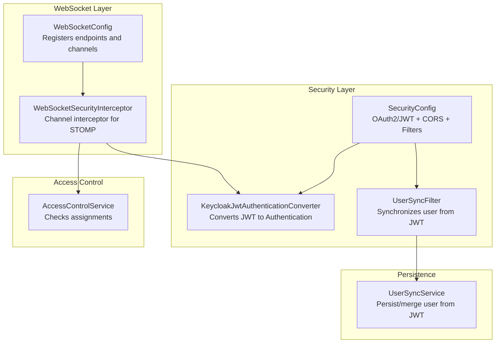
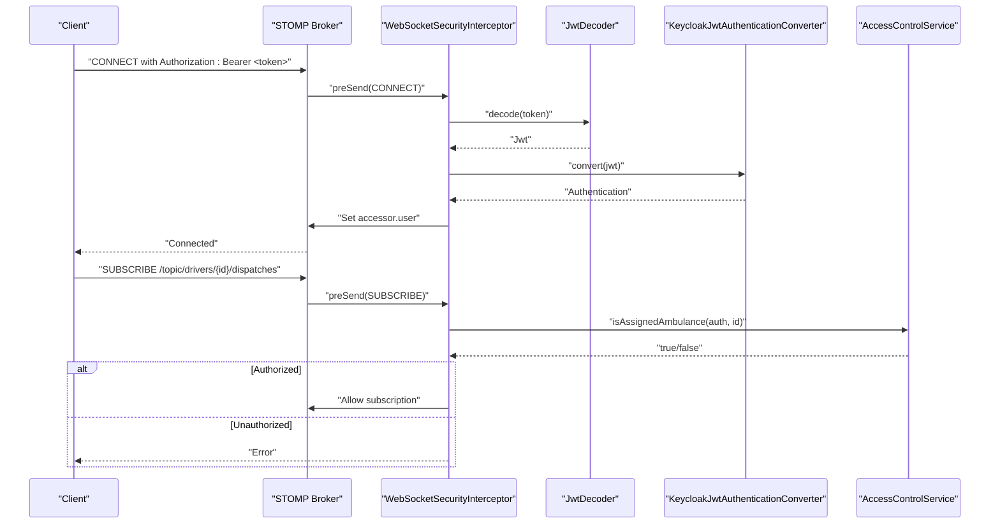
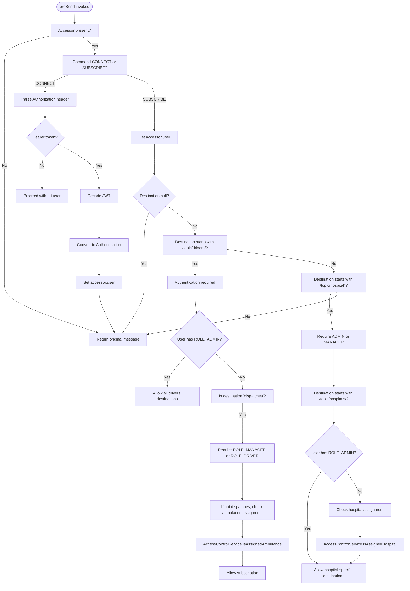
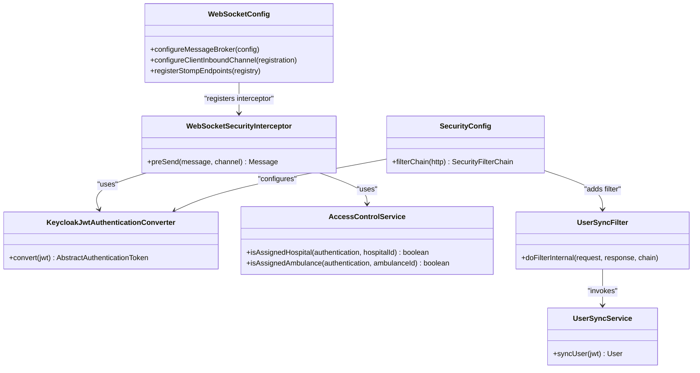

# WebSocket Security

<cite>
**Referenced Files in This Document**
- [WebSocketSecurityInterceptor.java](file://src/main/java/com/example/ems_command_center/config/WebSocketSecurityInterceptor.java)
- [WebSocketConfig.java](file://src/main/java/com/example/ems_command_center/config/WebSocketConfig.java)
- [SecurityConfig.java](file://src/main/java/com/example/ems_command_center/config/SecurityConfig.java)
- [KeycloakJwtAuthenticationConverter.java](file://src/main/java/com/example/ems_command_center/config/KeycloakJwtAuthenticationConverter.java)
- [AccessControlService.java](file://src/main/java/com/example/ems_command_center/service/AccessControlService.java)
- [UserSyncFilter.java](file://src/main/java/com/example/ems_command_center/config/UserSyncFilter.java)
- [UserSyncService.java](file://src/main/java/com/example/ems_command_center/service/UserSyncService.java)
- [application.yml](file://src/main/resources/application.yml)
</cite>

## Table of Contents
1. [Introduction](#introduction)
2. [Project Structure](#project-structure)
3. [Core Components](#core-components)
4. [Architecture Overview](#architecture-overview)
5. [Detailed Component Analysis](#detailed-component-analysis)
6. [Dependency Analysis](#dependency-analysis)
7. [Performance Considerations](#performance-considerations)
8. [Troubleshooting Guide](#troubleshooting-guide)
9. [Conclusion](#conclusion)

## Introduction
This document provides comprehensive WebSocket security documentation for real-time communication in the EMS Command Center. It focuses on the WebSocketSecurityInterceptor implementation for validating JWT tokens during WebSocket handshake and maintaining session security throughout the connection lifecycle. It also documents the UserSyncFilter integration for synchronizing user context across WebSocket connections, WebSocket channel authorization, destination-based security rules, and message-level authentication. Guidance is included for establishing secure WebSocket connections, validating tokens during upgrade requests, managing sessions for persistent connections, preventing WebSocket-specific attacks, and troubleshooting authentication and connection security issues.

## Project Structure
The WebSocket security implementation spans configuration and service layers:
- WebSocket configuration registers STOMP endpoints and applies a channel interceptor for inbound messages.
- Security configuration integrates OAuth 2.0/JWT with Keycloak and adds a filter to synchronize user context from JWT claims.
- Interceptor enforces authentication and authorization for CONNECT and SUBSCRIBE commands.
- Access control service validates assignments to hospitals and ambulances using JWT claims.
- User synchronization service persists or updates user records from JWT claims.

**Diagram sources**
- [WebSocketConfig.java:12-49](file://src/main/java/com/example/ems_command_center/config/WebSocketConfig.java#L12-L49)
- [WebSocketSecurityInterceptor.java:18-32](file://src/main/java/com/example/ems_command_center/config/WebSocketSecurityInterceptor.java#L18-L32)
- [SecurityConfig.java:44-95](file://src/main/java/com/example/ems_command_center/config/SecurityConfig.java#L44-L95)
- [KeycloakJwtAuthenticationConverter.java:18-41](file://src/main/java/com/example/ems_command_center/config/KeycloakJwtAuthenticationConverter.java#L18-L41)
- [AccessControlService.java:8-37](file://src/main/java/com/example/ems_command_center/service/AccessControlService.java#L8-L37)
- [UserSyncFilter.java:18-24](file://src/main/java/com/example/ems_command_center/config/UserSyncFilter.java#L18-L24)
- [UserSyncService.java:17-23](file://src/main/java/com/example/ems_command_center/service/UserSyncService.java#L17-L23)

**Section sources**
- [WebSocketConfig.java:12-49](file://src/main/java/com/example/ems_command_center/config/WebSocketConfig.java#L12-L49)
- [SecurityConfig.java:44-95](file://src/main/java/com/example/ems_command_center/config/SecurityConfig.java#L44-L95)

## Core Components
- WebSocketSecurityInterceptor: Validates JWT during CONNECT and enforces destination-based authorization during SUBSCRIBE.
- WebSocketConfig: Registers STOMP endpoints (/ws and /ws-native) and applies the channel interceptor.
- SecurityConfig: Configures OAuth2 resource server with JWT, CORS, and adds UserSyncFilter after the bearer token filter.
- KeycloakJwtAuthenticationConverter: Converts JWT to Authentication with realm/client roles.
- AccessControlService: Checks whether the authenticated user is assigned to a specific hospital or ambulance via JWT claims.
- UserSyncFilter and UserSyncService: Synchronize user records from JWT claims into the database.

**Section sources**
- [WebSocketSecurityInterceptor.java:18-112](file://src/main/java/com/example/ems_command_center/config/WebSocketSecurityInterceptor.java#L18-L112)
- [WebSocketConfig.java:12-49](file://src/main/java/com/example/ems_command_center/config/WebSocketConfig.java#L12-L49)
- [SecurityConfig.java:44-95](file://src/main/java/com/example/ems_command_center/config/SecurityConfig.java#L44-L95)
- [KeycloakJwtAuthenticationConverter.java:18-87](file://src/main/java/com/example/ems_command_center/config/KeycloakJwtAuthenticationConverter.java#L18-L87)
- [AccessControlService.java:8-37](file://src/main/java/com/example/ems_command_center/service/AccessControlService.java#L8-L37)
- [UserSyncFilter.java:18-50](file://src/main/java/com/example/ems_command_center/config/UserSyncFilter.java#L18-L50)
- [UserSyncService.java:17-181](file://src/main/java/com/example/ems_command_center/service/UserSyncService.java#L17-L181)

## Architecture Overview
The WebSocket security architecture integrates Spring Security’s OAuth2 resource server with a custom channel interceptor to validate and authorize WebSocket traffic. The interceptor decodes JWTs from the Authorization header on CONNECT and enforces fine-grained authorization on SUBSCRIBE destinations. User context is synchronized from JWT claims to the database via UserSyncFilter and UserSyncService.

**Diagram sources**
- [WebSocketSecurityInterceptor.java:35-108](file://src/main/java/com/example/ems_command_center/config/WebSocketSecurityInterceptor.java#L35-L108)
- [KeycloakJwtAuthenticationConverter.java:30-41](file://src/main/java/com/example/ems_command_center/config/KeycloakJwtAuthenticationConverter.java#L30-L41)
- [AccessControlService.java:27-36](file://src/main/java/com/example/ems_command_center/service/AccessControlService.java#L27-L36)

## Detailed Component Analysis

### WebSocketSecurityInterceptor
Responsibilities:
- Decodes JWT on CONNECT using JwtDecoder and converts it to Authentication via KeycloakJwtAuthenticationConverter.
- Enforces authorization on SUBSCRIBE based on destination prefixes and user roles.
- Supports role-based access to driver and hospital topics, with assignment checks against JWT claims.

Key behaviors:
- CONNECT: Extracts Authorization header, validates Bearer token, decodes and converts to Authentication, and attaches it to the STOMP accessor.
- SUBSCRIBE: 
  - Drivers topic: Requires authentication; admins can access any ambulance; non-admins must be assigned to the target ambulance or subscribed to dispatches with appropriate roles.
  - Hospital manager and hospitals topics: Requires ADMIN or MANAGER; for hospital-specific destinations, requires ADMIN or assignment to the hospital.

**Diagram sources**
- [WebSocketSecurityInterceptor.java:35-108](file://src/main/java/com/example/ems_command_center/config/WebSocketSecurityInterceptor.java#L35-L108)
- [AccessControlService.java:13-36](file://src/main/java/com/example/ems_command_center/service/AccessControlService.java#L13-L36)

**Section sources**
- [WebSocketSecurityInterceptor.java:34-112](file://src/main/java/com/example/ems_command_center/config/WebSocketSecurityInterceptor.java#L34-L112)

### WebSocketConfig
Responsibilities:
- Enables WebSocket message broker and registers STOMP endpoints.
- Applies WebSocketSecurityInterceptor to the inbound client channel.
- Defines allowed origins for WebSocket endpoints.

Endpoints:
- /ws-native: Direct STOMP endpoint.
- /ws: STOMP over SockJS endpoint.

**Section sources**
- [WebSocketConfig.java:20-49](file://src/main/java/com/example/ems_command_center/config/WebSocketConfig.java#L20-L49)

### SecurityConfig
Responsibilities:
- Disables CSRF and sets stateless sessions.
- Configures OAuth2 Resource Server with JWT and a custom JWT converter.
- Adds UserSyncFilter after BearerTokenAuthenticationFilter to synchronize user context from JWT.
- Defines CORS policy for local development origins.

Integration points:
- KeycloakJwtAuthenticationConverter is used by the resource server.
- UserSyncFilter reads the current Authentication and invokes UserSyncService to persist/update user records.

**Section sources**
- [SecurityConfig.java:44-95](file://src/main/java/com/example/ems_command_center/config/SecurityConfig.java#L44-L95)
- [KeycloakJwtAuthenticationConverter.java:18-41](file://src/main/java/com/example/ems_command_center/config/KeycloakJwtAuthenticationConverter.java#L18-L41)
- [UserSyncFilter.java:26-42](file://src/main/java/com/example/ems_command_center/config/UserSyncFilter.java#L26-L42)

### KeycloakJwtAuthenticationConverter
Responsibilities:
- Converts a JWT into a JwtAuthenticationToken with authorities derived from realm_access.roles and resource_access.<clientId>.roles.
- Normalizes role names to uppercase and prefixes with ROLE_.

**Section sources**
- [KeycloakJwtAuthenticationConverter.java:18-87](file://src/main/java/com/example/ems_command_center/config/KeycloakJwtAuthenticationConverter.java#L18-L87)

### AccessControlService
Responsibilities:
- Validates whether the authenticated user is assigned to a specific hospital or ambulance using JWT claims hospital_id and ambulance_id.

**Section sources**
- [AccessControlService.java:8-37](file://src/main/java/com/example/ems_command_center/service/AccessControlService.java#L8-L37)

### UserSyncFilter and UserSyncService
Responsibilities:
- UserSyncFilter extracts the JWT from the current Authentication and calls UserSyncService to synchronize user data.
- UserSyncService persists or updates a User record using JWT claims (subject, email, name, roles, hospital_id, ambulance_id), with fallbacks and concurrency handling.

**Section sources**
- [UserSyncFilter.java:18-50](file://src/main/java/com/example/ems_command_center/config/UserSyncFilter.java#L18-L50)
- [UserSyncService.java:17-181](file://src/main/java/com/example/ems_command_center/service/UserSyncService.java#L17-L181)

## Dependency Analysis
The WebSocket security stack depends on Spring Security’s OAuth2 resource server and STOMP/SockJS messaging infrastructure. The interceptor relies on JwtDecoder and KeycloakJwtAuthenticationConverter for token validation and role extraction. Destination-based authorization leverages AccessControlService to enforce assignment constraints.

**Diagram sources**
- [WebSocketConfig.java:12-49](file://src/main/java/com/example/ems_command_center/config/WebSocketConfig.java#L12-L49)
- [WebSocketSecurityInterceptor.java:18-32](file://src/main/java/com/example/ems_command_center/config/WebSocketSecurityInterceptor.java#L18-L32)
- [SecurityConfig.java:44-95](file://src/main/java/com/example/ems_command_center/config/SecurityConfig.java#L44-L95)
- [KeycloakJwtAuthenticationConverter.java:18-41](file://src/main/java/com/example/ems_command_center/config/KeycloakJwtAuthenticationConverter.java#L18-L41)
- [AccessControlService.java:8-37](file://src/main/java/com/example/ems_command_center/service/AccessControlService.java#L8-L37)
- [UserSyncFilter.java:18-24](file://src/main/java/com/example/ems_command_center/config/UserSyncFilter.java#L18-L24)
- [UserSyncService.java:17-23](file://src/main/java/com/example/ems_command_center/service/UserSyncService.java#L17-L23)

**Section sources**
- [WebSocketSecurityInterceptor.java:18-32](file://src/main/java/com/example/ems_command_center/config/WebSocketSecurityInterceptor.java#L18-L32)
- [WebSocketConfig.java:12-49](file://src/main/java/com/example/ems_command_center/config/WebSocketConfig.java#L12-L49)
- [SecurityConfig.java:44-95](file://src/main/java/com/example/ems_command_center/config/SecurityConfig.java#L44-L95)

## Performance Considerations
- Token decoding and conversion occur per CONNECT; caching decoded tokens or performing lightweight validation offloads pressure if needed.
- Destination-based checks are O(1) string prefix checks and simple claim comparisons; keep destination naming consistent to avoid regex overhead.
- User synchronization runs once per request after JWT-based authentication; ensure database indexing on keycloakId and email to minimize lookup latency.
- For high concurrency, consider rate-limiting or connection pooling controls at the infrastructure layer (load balancer/proxy) to prevent abuse.

[No sources needed since this section provides general guidance]

## Troubleshooting Guide
Common issues and resolutions:
- Authentication failures during CONNECT:
  - Verify the Authorization header includes a valid Bearer token.
  - Confirm the JWK set URI is reachable and the token is signed by the configured issuer.
  - Check that the principal claim and client ID match Keycloak configuration.
  - Review interceptor logs for “Invalid JWT token” errors.

- Forbidden subscriptions on /topic/drivers/* or /topic/hospitals/*:
  - Ensure the user has the required role (ADMIN, MANAGER, DRIVER).
  - For assignment-restricted topics, confirm the JWT contains the correct hospital_id or ambulance_id claims.
  - Validate that the destination path matches expected patterns.

- CORS or origin mismatch errors:
  - Confirm the client origin is included in allowed origin patterns for /ws and /ws-native endpoints.

- User synchronization failures:
  - Inspect warnings logged by UserSyncFilter when synchronization fails.
  - Ensure database connectivity and uniqueness constraints are satisfied.

Configuration references:
- JWK set URI and client settings are defined in application YAML.
- Allowed origins for WebSocket endpoints are configured in WebSocketConfig.

**Section sources**
- [WebSocketSecurityInterceptor.java:41-55](file://src/main/java/com/example/ems_command_center/config/WebSocketSecurityInterceptor.java#L41-L55)
- [WebSocketSecurityInterceptor.java:61-107](file://src/main/java/com/example/ems_command_center/config/WebSocketSecurityInterceptor.java#L61-L107)
- [WebSocketConfig.java:32-48](file://src/main/java/com/example/ems_command_center/config/WebSocketConfig.java#L32-L48)
- [UserSyncFilter.java:33-38](file://src/main/java/com/example/ems_command_center/config/UserSyncFilter.java#L33-L38)
- [application.yml:10-35](file://src/main/resources/application.yml#L10-L35)

## Conclusion
The WebSocket security implementation in the EMS Command Center integrates OAuth2/JWT validation with a custom channel interceptor to secure STOMP/SockJS connections. It enforces authentication on CONNECT and destination-based authorization on SUBSCRIBE, leveraging role and assignment checks. User context synchronization ensures that backend services and UIs reflect up-to-date user attributes derived from JWT claims. Together, these components provide robust protection for real-time communications while maintaining operational flexibility for dispatch, driver, and hospital workflows.