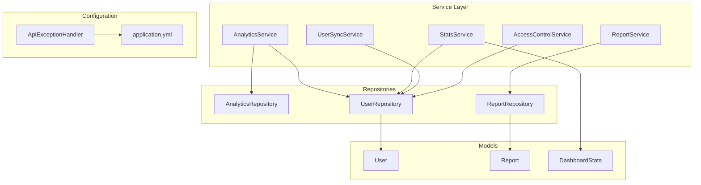
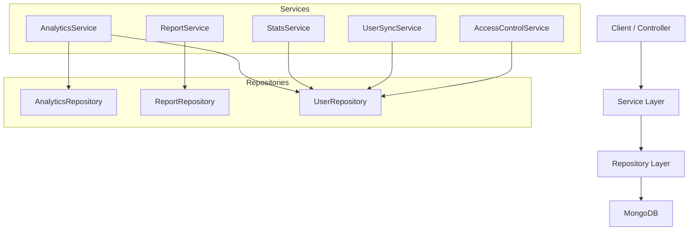
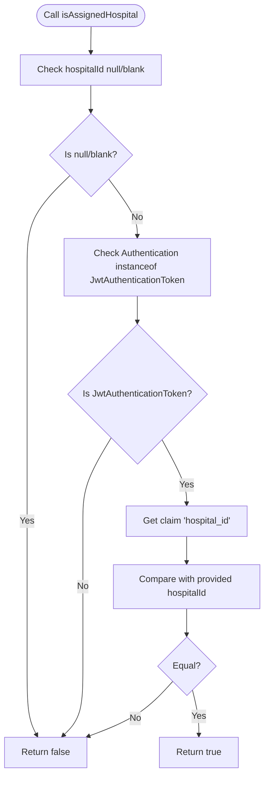
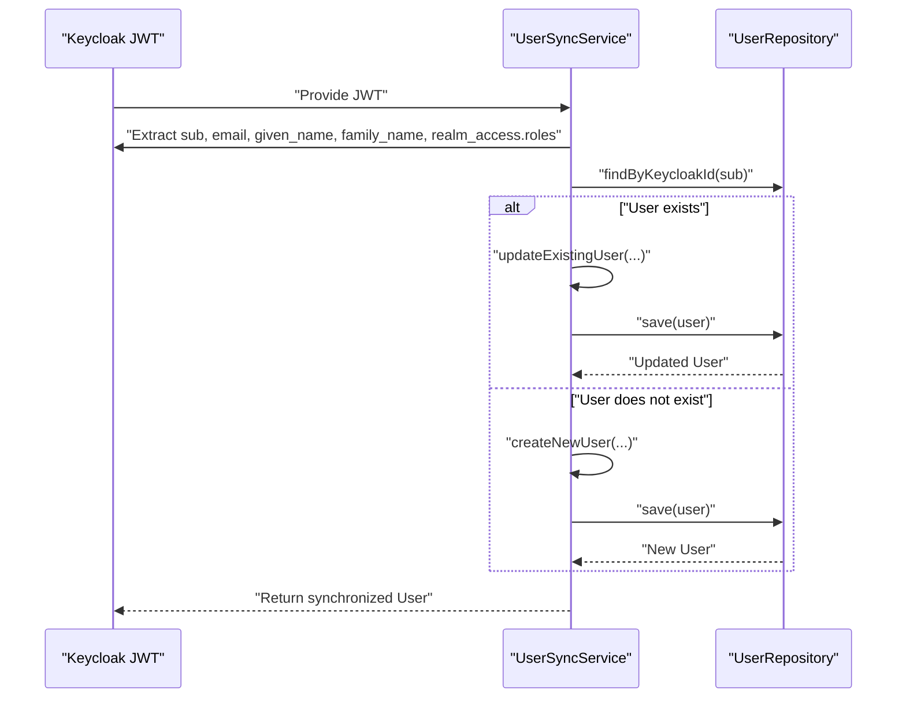
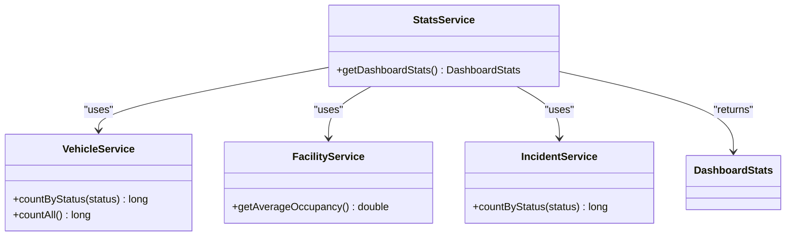
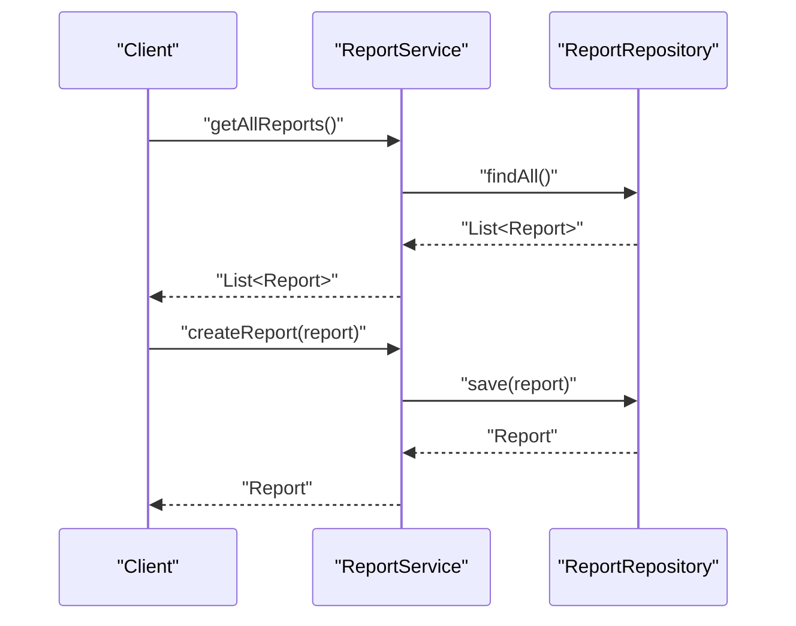
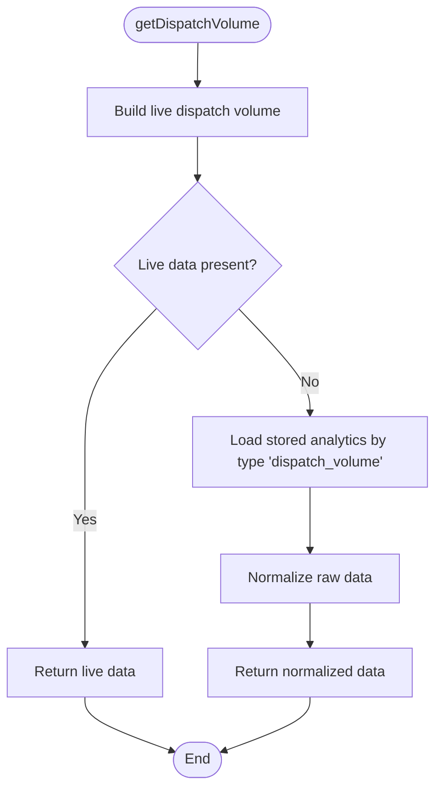
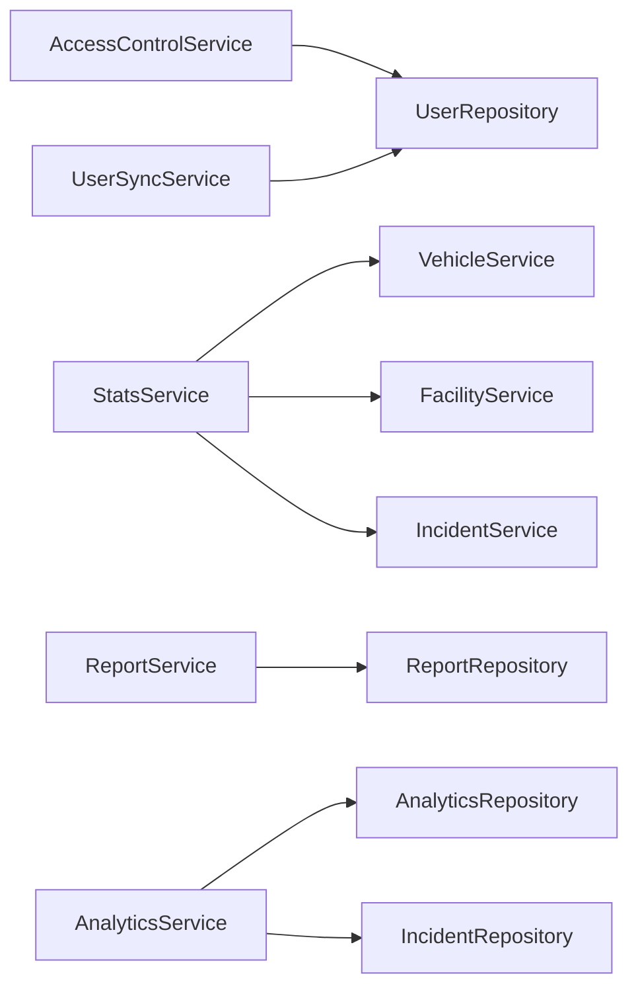

# Service Layer Implementation

<cite>
**Referenced Files in This Document**
- [AccessControlService.java](file://src/main/java/com/example/ems_command_center/service/AccessControlService.java)
- [UserSyncService.java](file://src/main/java/com/example/ems_command_center/service/UserSyncService.java)
- [StatsService.java](file://src/main/java/com/example/ems_command_center/service/StatsService.java)
- [ReportService.java](file://src/main/java/com/example/ems_command_center/service/ReportService.java)
- [AnalyticsService.java](file://src/main/java/com/example/ems_command_center/service/AnalyticsService.java)
- [ApiExceptionHandler.java](file://src/main/java/com/example/ems_command_center/config/ApiExceptionHandler.java)
- [application.yml](file://src/main/resources/application.yml)
- [User.java](file://src/main/java/com/example/ems_command_center/model/User.java)
- [Report.java](file://src/main/java/com/example/ems_command_center/model/Report.java)
- [DashboardStats.java](file://src/main/java/com/example/ems_command_center/model/DashboardStats.java)
- [AnalyticsRepository.java](file://src/main/java/com/example/ems_command_center/repository/AnalyticsRepository.java)
- [ReportRepository.java](file://src/main/java/com/example/ems_command_center/repository/ReportRepository.java)
- [UserRepository.java](file://src/main/java/com/example/ems_command_center/repository/UserRepository.java)
- [EmsCommandCenterApplicationTests.java](file://src/test/java/com/example/ems_command_center/EmsCommandCenterApplicationTests.java)
</cite>

## Table of Contents
1. [Introduction](#introduction)
2. [Project Structure](#project-structure)
3. [Core Components](#core-components)
4. [Architecture Overview](#architecture-overview)
5. [Detailed Component Analysis](#detailed-component-analysis)
6. [Dependency Analysis](#dependency-analysis)
7. [Performance Considerations](#performance-considerations)
8. [Troubleshooting Guide](#troubleshooting-guide)
9. [Conclusion](#conclusion)
10. [Appendices](#appendices)

## Introduction
This document provides comprehensive documentation for the service layer implementation in the EMS Command Center application. It focuses on the business logic architecture, including service layer patterns, transaction management, and error handling strategies. It documents four key services:
- AccessControlService for role-based authorization checks
- UserSyncService for Keycloak JWT synchronization into MongoDB
- StatsService for dashboard analytics computation
- ReportService for report data aggregation

Additionally, it explains method implementations, input validation, business rule enforcement, repository integration, exception handling patterns, retry mechanisms, logging strategies, dependency injection patterns, and testing approaches for service layer components.

## Project Structure
The service layer resides under the package com.example.ems_command_center.service and collaborates with repositories under com.example.ems_command_center.repository. Models are defined under com.example.ems_command_center.model. Configuration for error handling and application settings are located in config and resources respectively.

**Diagram sources**
- [AccessControlService.java:1-38](file://src/main/java/com/example/ems_command_center/service/AccessControlService.java#L1-L38)
- [UserSyncService.java:1-122](file://src/main/java/com/example/ems_command_center/service/UserSyncService.java#L1-L122)
- [StatsService.java:1-34](file://src/main/java/com/example/ems_command_center/service/StatsService.java#L1-L34)
- [ReportService.java:1-26](file://src/main/java/com/example/ems_command_center/service/ReportService.java#L1-L26)
- [AnalyticsService.java:1-159](file://src/main/java/com/example/ems_command_center/service/AnalyticsService.java#L1-L159)
- [AnalyticsRepository.java:1-13](file://src/main/java/com/example/ems_command_center/repository/AnalyticsRepository.java#L1-L13)
- [ReportRepository.java:1-10](file://src/main/java/com/example/ems_command_center/repository/ReportRepository.java#L1-L10)
- [UserRepository.java:1-15](file://src/main/java/com/example/ems_command_center/repository/UserRepository.java#L1-L15)
- [User.java:1-182](file://src/main/java/com/example/ems_command_center/model/User.java#L1-L182)
- [Report.java:1-15](file://src/main/java/com/example/ems_command_center/model/Report.java#L1-L15)
- [DashboardStats.java:1-14](file://src/main/java/com/example/ems_command_center/model/DashboardStats.java#L1-L14)
- [ApiExceptionHandler.java:1-27](file://src/main/java/com/example/ems_command_center/config/ApiExceptionHandler.java#L1-L27)
- [application.yml:1-36](file://src/main/resources/application.yml#L1-L36)

**Section sources**
- [AccessControlService.java:1-38](file://src/main/java/com/example/ems_command_center/service/AccessControlService.java#L1-L38)
- [UserSyncService.java:1-122](file://src/main/java/com/example/ems_command_center/service/UserSyncService.java#L1-L122)
- [StatsService.java:1-34](file://src/main/java/com/example/ems_command_center/service/StatsService.java#L1-L34)
- [ReportService.java:1-26](file://src/main/java/com/example/ems_command_center/service/ReportService.java#L1-L26)
- [AnalyticsService.java:1-159](file://src/main/java/com/example/ems_command_center/service/AnalyticsService.java#L1-L159)
- [AnalyticsRepository.java:1-13](file://src/main/java/com/example/ems_command_center/repository/AnalyticsRepository.java#L1-L13)
- [ReportRepository.java:1-10](file://src/main/java/com/example/ems_command_center/repository/ReportRepository.java#L1-L10)
- [UserRepository.java:1-15](file://src/main/java/com/example/ems_command_center/repository/UserRepository.java#L1-L15)
- [User.java:1-182](file://src/main/java/com/example/ems_command_center/model/User.java#L1-L182)
- [Report.java:1-15](file://src/main/java/com/example/ems_command_center/model/Report.java#L1-L15)
- [DashboardStats.java:1-14](file://src/main/java/com/example/ems_command_center/model/DashboardStats.java#L1-L14)
- [ApiExceptionHandler.java:1-27](file://src/main/java/com/example/ems_command_center/config/ApiExceptionHandler.java#L1-L27)
- [application.yml:1-36](file://src/main/resources/application.yml#L1-L36)

## Core Components
This section outlines the core service components and their responsibilities.

- AccessControlService: Provides authorization checks against JWT claims for hospital and ambulance assignments.
- UserSyncService: Synchronizes Keycloak JWT identities into MongoDB User documents, managing creation and updates with role and assignment normalization.
- StatsService: Aggregates dashboard statistics by invoking domain services for vehicles, facilities, and incidents.
- ReportService: Handles report retrieval and persistence via MongoDB repository.
- AnalyticsService: Computes dispatch volume analytics from incidents and persists/retrieves analytics data.

**Section sources**
- [AccessControlService.java:1-38](file://src/main/java/com/example/ems_command_center/service/AccessControlService.java#L1-L38)
- [UserSyncService.java:1-122](file://src/main/java/com/example/ems_command_center/service/UserSyncService.java#L1-L122)
- [StatsService.java:1-34](file://src/main/java/com/example/ems_command_center/service/StatsService.java#L1-L34)
- [ReportService.java:1-26](file://src/main/java/com/example/ems_command_center/service/ReportService.java#L1-L26)
- [AnalyticsService.java:1-159](file://src/main/java/com/example/ems_command_center/service/AnalyticsService.java#L1-L159)

## Architecture Overview
The service layer follows a clean architecture pattern:
- Services encapsulate business logic and orchestrate domain operations.
- Repositories abstract persistence concerns for MongoDB collections.
- Models represent domain entities and DTOs.
- Configuration handles global exception mapping and application settings.

**Diagram sources**
- [AccessControlService.java:1-38](file://src/main/java/com/example/ems_command_center/service/AccessControlService.java#L1-L38)
- [UserSyncService.java:1-122](file://src/main/java/com/example/ems_command_center/service/UserSyncService.java#L1-L122)
- [StatsService.java:1-34](file://src/main/java/com/example/ems_command_center/service/StatsService.java#L1-L34)
- [ReportService.java:1-26](file://src/main/java/com/example/ems_command_center/service/ReportService.java#L1-L26)
- [AnalyticsService.java:1-159](file://src/main/java/com/example/ems_command_center/service/AnalyticsService.java#L1-L159)
- [AnalyticsRepository.java:1-13](file://src/main/java/com/example/ems_command_center/repository/AnalyticsRepository.java#L1-L13)
- [ReportRepository.java:1-10](file://src/main/java/com/example/ems_command_center/repository/ReportRepository.java#L1-L10)
- [UserRepository.java:1-15](file://src/main/java/com/example/ems_command_center/repository/UserRepository.java#L1-L15)

## Detailed Component Analysis

### AccessControlService
Responsibilities:
- Validates JWT-based authorization for hospital and ambulance assignments.
- Enforces presence checks for identifiers and returns boolean outcomes.

Key behaviors:
- isAssignedHospital: Compares JWT claim hospital_id with the provided hospital identifier.
- isAssignedAmbulance: Compares JWT claim ambulance_id with the provided ambulance identifier.

Validation and error handling:
- Returns false for null or blank identifiers.
- Uses JwtAuthenticationToken to extract claims safely.

Usage examples:
- Authorization checks in controllers prior to mutating hospital-scoped resources.

**Diagram sources**
- [AccessControlService.java:10-22](file://src/main/java/com/example/ems_command_center/service/AccessControlService.java#L10-L22)

**Section sources**
- [AccessControlService.java:1-38](file://src/main/java/com/example/ems_command_center/service/AccessControlService.java#L1-L38)

### UserSyncService
Responsibilities:
- Synchronizes Keycloak JWT identities into MongoDB User documents.
- Creates new users if not present; otherwise updates existing records with normalized role and assignment fields.

Key behaviors:
- syncUser: Extracts subject, email, name, and roles; delegates to update or create.
- updateExistingUser: Conditionally updates name, email, role, hospitalId, and ambulanceId; persists only when changes occur.
- createNewUser: Initializes defaults for new users and persists.
- extractPrimaryRole: Determines highest role with priority ADMIN > MANAGER > DRIVER > USER.
- buildFullName: Concatenates first and last names with a single space.

Validation and error handling:
- Uses repository queries to locate existing users by keycloakId.
- Persists only when field changes are detected to avoid unnecessary writes.

Integration with repositories:
- UserRepository for lookup and persistence of User documents.

**Diagram sources**
- [UserSyncService.java:26-39](file://src/main/java/com/example/ems_command_center/service/UserSyncService.java#L26-L39)
- [UserRepository.java:8-14](file://src/main/java/com/example/ems_command_center/repository/UserRepository.java#L8-L14)
- [User.java:1-182](file://src/main/java/com/example/ems_command_center/model/User.java#L1-L182)

**Section sources**
- [UserSyncService.java:1-122](file://src/main/java/com/example/ems_command_center/service/UserSyncService.java#L1-L122)
- [UserRepository.java:1-15](file://src/main/java/com/example/ems_command_center/repository/UserRepository.java#L1-L15)
- [User.java:1-182](file://src/main/java/com/example/ems_command_center/model/User.java#L1-L182)

### StatsService
Responsibilities:
- Aggregates dashboard statistics by combining counts and averages from domain services.

Key behaviors:
- getDashboardStats: Computes active ambulances, total ambulances, average occupancy, and critical incidents.

Integration with services:
- Delegates to VehicleService, FacilityService, and IncidentService for counts and averages.

**Diagram sources**
- [StatsService.java:1-34](file://src/main/java/com/example/ems_command_center/service/StatsService.java#L1-L34)
- [DashboardStats.java:1-14](file://src/main/java/com/example/ems_command_center/model/DashboardStats.java#L1-L14)

**Section sources**
- [StatsService.java:1-34](file://src/main/java/com/example/ems_command_center/service/StatsService.java#L1-L34)
- [DashboardStats.java:1-14](file://src/main/java/com/example/ems_command_center/model/DashboardStats.java#L1-L14)

### ReportService
Responsibilities:
- Retrieves all reports and persists new reports to MongoDB.

Key behaviors:
- getAllReports: Returns all Report entities from the repository.
- createReport: Saves a new Report entity.

Integration with repositories:
- ReportRepository for MongoDB operations.

**Diagram sources**
- [ReportService.java:18-24](file://src/main/java/com/example/ems_command_center/service/ReportService.java#L18-L24)
- [ReportRepository.java:1-10](file://src/main/java/com/example/ems_command_center/repository/ReportRepository.java#L1-L10)
- [Report.java:1-15](file://src/main/java/com/example/ems_command_center/model/Report.java#L1-L15)

**Section sources**
- [ReportService.java:1-26](file://src/main/java/com/example/ems_command_center/service/ReportService.java#L1-L26)
- [ReportRepository.java:1-10](file://src/main/java/com/example/ems_command_center/repository/ReportRepository.java#L1-L10)
- [Report.java:1-15](file://src/main/java/com/example/ems_command_center/model/Report.java#L1-L15)

### AnalyticsService
Responsibilities:
- Computes dispatch volume analytics from incidents and persists/retrieves analytics data.

Key behaviors:
- getDispatchVolume: Builds live dispatch volume from incidents if available; otherwise falls back to stored analytics.
- getResponseTimeData: Retrieves response time analytics.
- save: Persists analytics data.

Algorithmic logic:
- buildLiveDispatchVolume: Parses incident timestamps, aggregates counts per hour, and normalizes the result for the last 12 hours.
- isDispatchedIncident: Identifies dispatched incidents by status or tags.
- parseIncidentTime: Parses incident time strings with strict formatting.
- normalizeDispatchVolume: Converts raw analytics data to a normalized list of time-volume pairs.
- toInteger: Safely converts numeric values to integers.

**Diagram sources**
- [AnalyticsService.java:37-47](file://src/main/java/com/example/ems_command_center/service/AnalyticsService.java#L37-L47)
- [AnalyticsService.java:59-100](file://src/main/java/com/example/ems_command_center/service/AnalyticsService.java#L59-L100)
- [AnalyticsService.java:128-141](file://src/main/java/com/example/ems_command_center/service/AnalyticsService.java#L128-L141)

**Section sources**
- [AnalyticsService.java:1-159](file://src/main/java/com/example/ems_command_center/service/AnalyticsService.java#L1-L159)
- [AnalyticsRepository.java:1-13](file://src/main/java/com/example/ems_command_center/repository/AnalyticsRepository.java#L1-L13)

## Dependency Analysis
Service-layer dependencies and coupling:
- AccessControlService depends on Spring Security’s JwtAuthenticationToken and performs lightweight claim extraction.
- UserSyncService depends on UserRepository and constructs User entities; it encapsulates role and assignment normalization.
- StatsService composes VehicleService, FacilityService, and IncidentService to compute dashboard metrics.
- ReportService depends on ReportRepository for MongoDB operations.
- AnalyticsService depends on AnalyticsRepository and IncidentRepository to compute and persist analytics.

Potential circular dependencies:
- None observed among the documented services; StatsService composes other services rather than extending them.

External dependencies and integration points:
- MongoDB repositories for persistence.
- Keycloak JWK set URI configured for JWT validation.
- Global exception handler for consistent error responses.

**Diagram sources**
- [AccessControlService.java:1-38](file://src/main/java/com/example/ems_command_center/service/AccessControlService.java#L1-L38)
- [UserSyncService.java:1-122](file://src/main/java/com/example/ems_command_center/service/UserSyncService.java#L1-L122)
- [StatsService.java:1-34](file://src/main/java/com/example/ems_command_center/service/StatsService.java#L1-L34)
- [ReportService.java:1-26](file://src/main/java/com/example/ems_command_center/service/ReportService.java#L1-L26)
- [AnalyticsService.java:1-159](file://src/main/java/com/example/ems_command_center/service/AnalyticsService.java#L1-L159)
- [UserRepository.java:1-15](file://src/main/java/com/example/ems_command_center/repository/UserRepository.java#L1-L15)
- [ReportRepository.java:1-10](file://src/main/java/com/example/ems_command_center/repository/ReportRepository.java#L1-L10)
- [AnalyticsRepository.java:1-13](file://src/main/java/com/example/ems_command_center/repository/AnalyticsRepository.java#L1-L13)

**Section sources**
- [AccessControlService.java:1-38](file://src/main/java/com/example/ems_command_center/service/AccessControlService.java#L1-L38)
- [UserSyncService.java:1-122](file://src/main/java/com/example/ems_command_center/service/UserSyncService.java#L1-L122)
- [StatsService.java:1-34](file://src/main/java/com/example/ems_command_center/service/StatsService.java#L1-L34)
- [ReportService.java:1-26](file://src/main/java/com/example/ems_command_center/service/ReportService.java#L1-L26)
- [AnalyticsService.java:1-159](file://src/main/java/com/example/ems_command_center/service/AnalyticsService.java#L1-L159)
- [UserRepository.java:1-15](file://src/main/java/com/example/ems_command_center/repository/UserRepository.java#L1-L15)
- [ReportRepository.java:1-10](file://src/main/java/com/example/ems_command_center/repository/ReportRepository.java#L1-L10)
- [AnalyticsRepository.java:1-13](file://src/main/java/com/example/ems_command_center/repository/AnalyticsRepository.java#L1-L13)

## Performance Considerations
- Minimize repository calls: UserSyncService updates only when changes are detected.
- Efficient aggregations: StatsService delegates to service-layer counters to avoid heavy queries.
- Data normalization: AnalyticsService precomputes hourly buckets and normalizes data to reduce downstream processing overhead.
- Logging: application.yml sets logging levels for the application package and MongoDB data layer to aid performance monitoring.

[No sources needed since this section provides general guidance]

## Troubleshooting Guide
Exception handling patterns:
- Global exception mapping: ApiExceptionHandler maps ResponseStatusException to structured JSON responses with timestamp, status, error, and message fields.

Retry mechanisms:
- Not implemented in the current codebase. Consider adding circuit breakers or retry policies for transient failures in external integrations (e.g., Keycloak).

Logging strategies:
- Configure logging levels in application.yml for targeted packages to capture business events and errors effectively.

Testing approaches:
- Service tests can leverage @SpringBootTest with property overrides to disable seeding and focus on service logic.
- Mock repositories for unit tests to isolate business logic.

**Section sources**
- [ApiExceptionHandler.java:1-27](file://src/main/java/com/example/ems_command_center/config/ApiExceptionHandler.java#L1-L27)
- [application.yml:26-29](file://src/main/resources/application.yml#L26-L29)
- [EmsCommandCenterApplicationTests.java:1-14](file://src/test/java/com/example/ems_command_center/EmsCommandCenterApplicationTests.java#L1-L14)

## Conclusion
The service layer in the EMS Command Center application demonstrates clear separation of concerns with robust business logic encapsulation. Services integrate with repositories to manage persistence, enforce input validation, and produce meaningful analytics and reports. Authorization checks, JWT synchronization, and centralized error handling contribute to a secure and maintainable architecture. Future enhancements could include retry and circuit breaker patterns for resilience and expanded test coverage for service components.

[No sources needed since this section summarizes without analyzing specific files]

## Appendices
- Dependency injection patterns: Services are annotated with @Service and constructed via constructor injection, promoting immutability and testability.
- Example usage references:
  - AccessControlService: [AccessControlService.java:13-22](file://src/main/java/com/example/ems_command_center/service/AccessControlService.java#L13-L22)
  - UserSyncService: [UserSyncService.java:26-39](file://src/main/java/com/example/ems_command_center/service/UserSyncService.java#L26-L39)
  - StatsService: [StatsService.java:19-32](file://src/main/java/com/example/ems_command_center/service/StatsService.java#L19-L32)
  - ReportService: [ReportService.java:18-24](file://src/main/java/com/example/ems_command_center/service/ReportService.java#L18-L24)
  - AnalyticsService: [AnalyticsService.java:37-57](file://src/main/java/com/example/ems_command_center/service/AnalyticsService.java#L37-L57)

[No sources needed since this section provides general guidance]