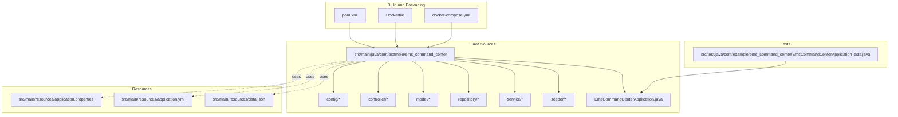
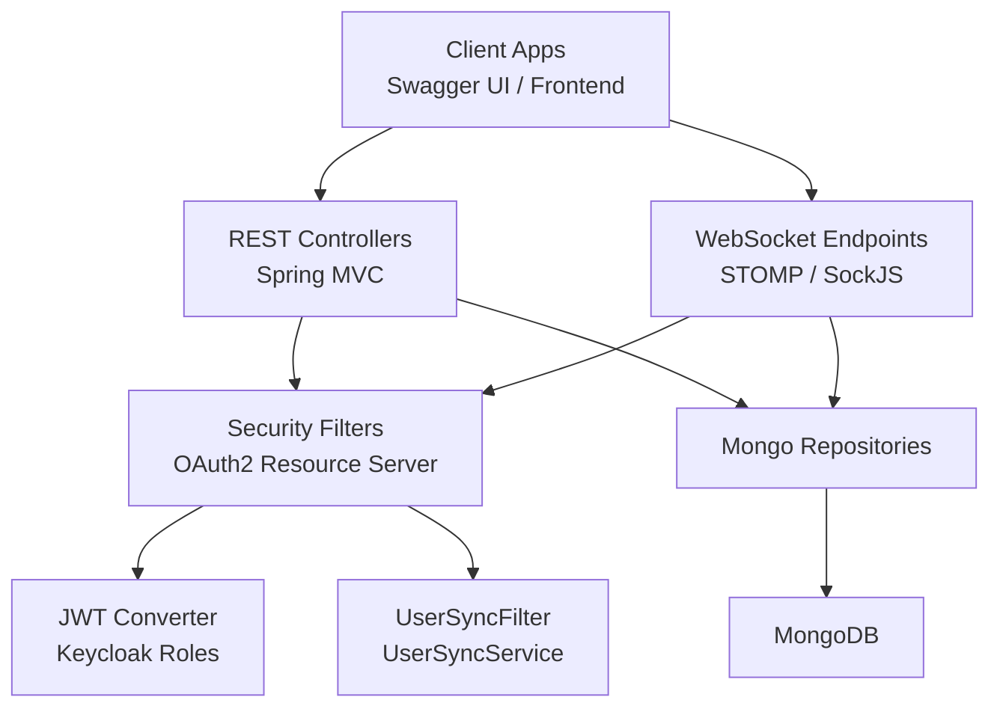
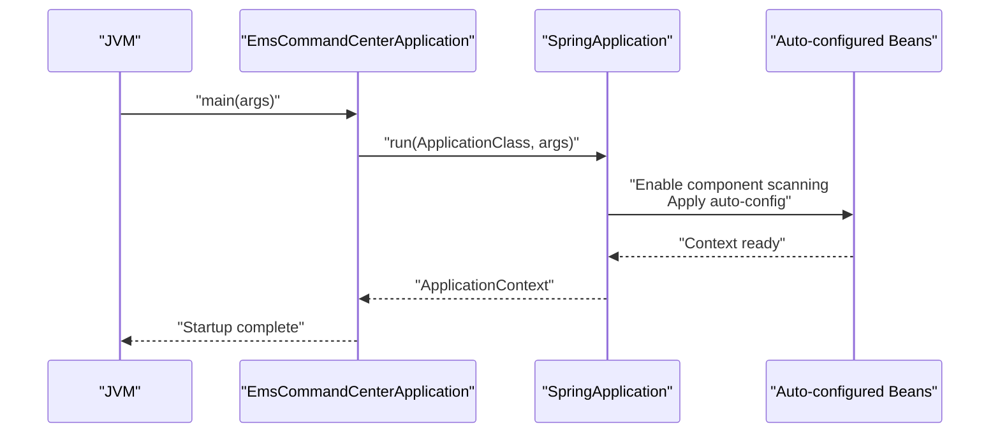
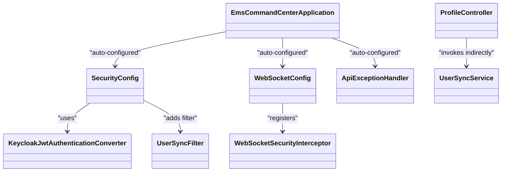
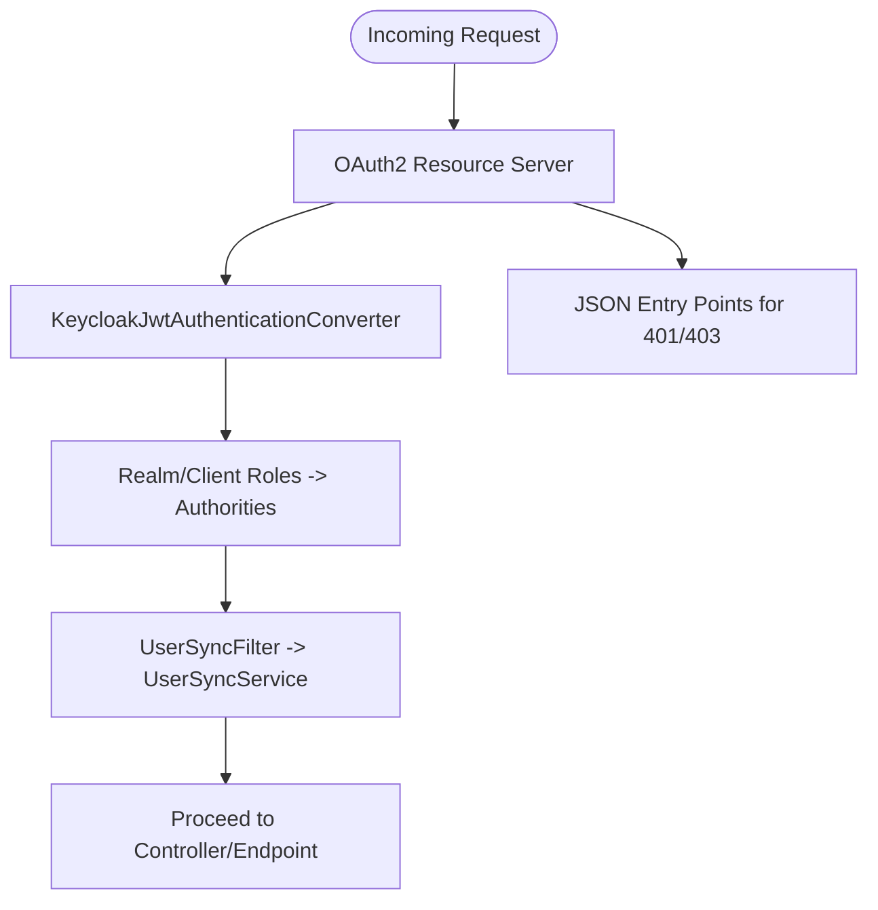
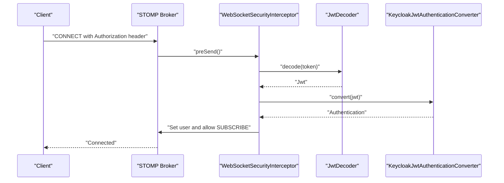
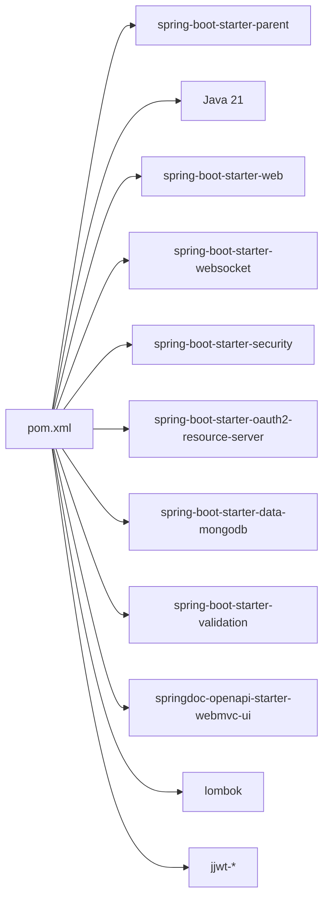
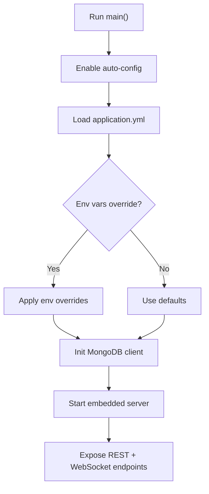
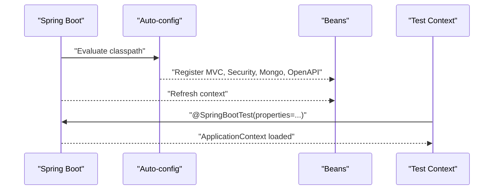
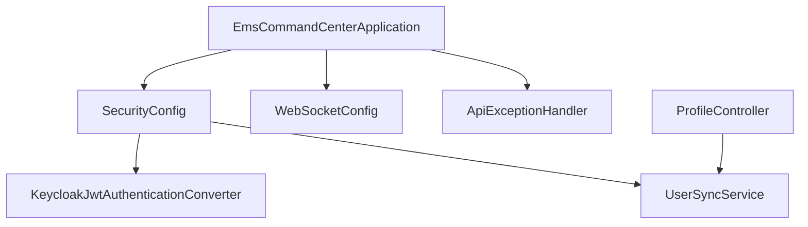

# Application Structure

<cite>
**Referenced Files in This Document**
- [EmsCommandCenterApplication.java](file://src/main/java/com/example/ems_command_center/EmsCommandCenterApplication.java)
- [pom.xml](file://pom.xml)
- [application.properties](file://src/main/resources/application.properties)
- [application.yml](file://src/main/resources/application.yml)
- [SecurityConfig.java](file://src/main/java/com/example/ems_command_center/config/SecurityConfig.java)
- [WebSocketConfig.java](file://src/main/java/com/example/ems_command_center/config/WebSocketConfig.java)
- [ApiExceptionHandler.java](file://src/main/java/com/example/ems_command_center/config/ApiExceptionHandler.java)
- [KeycloakJwtAuthenticationConverter.java](file://src/main/java/com/example/ems_command_center/config/KeycloakJwtAuthenticationConverter.java)
- [UserSyncFilter.java](file://src/main/java/com/example/ems_command_center/config/UserSyncFilter.java)
- [WebSocketSecurityInterceptor.java](file://src/main/java/com/example/ems_command_center/config/WebSocketSecurityInterceptor.java)
- [UserSyncService.java](file://src/main/java/com/example/ems_command_center/service/UserSyncService.java)
- [ProfileController.java](file://src/main/java/com/example/ems_command_center/controller/ProfileController.java)
- [Dockerfile](file://Dockerfile)
- [docker-compose.yml](file://docker-compose.yml)
- [EmsCommandCenterApplicationTests.java](file://src/test/java/com/example/ems_command_center/EmsCommandCenterApplicationTests.java)
- [data.json](file://src/main/resources/data.json)
</cite>

## Table of Contents
1. [Introduction](#introduction)
2. [Project Structure](#project-structure)
3. [Core Components](#core-components)
4. [Architecture Overview](#architecture-overview)
5. [Detailed Component Analysis](#detailed-component-analysis)
6. [Dependency Analysis](#dependency-analysis)
7. [Performance Considerations](#performance-considerations)
8. [Troubleshooting Guide](#troubleshooting-guide)
9. [Conclusion](#conclusion)
10. [Appendices](#appendices)

## Introduction
This document explains the Spring Boot application structure for the EMS Command Center backend. It covers the @SpringBootApplication annotation and its components (component scanning, auto-configuration, and embedded server setup), package organization, main application class configuration, and application properties management. It also details Maven build configuration, dependency management, project structure conventions, startup sequence, environment configuration, profile-specific settings, application lifecycle, bean registration, and component discovery mechanisms.

## Project Structure
The project follows a conventional Spring Boot layout with a clear separation of concerns:
- Main application class under the top-level package for component scanning and auto-configuration.
- Feature-based packages for configuration, controllers, models, repositories, services, and seeders.
- Resources for application properties and static assets.
- Tests under a dedicated test package.
- Build and packaging artifacts via Maven and Docker.

**Diagram sources**
- [EmsCommandCenterApplication.java:1-14](file://src/main/java/com/example/ems_command_center/EmsCommandCenterApplication.java#L1-L14)
- [pom.xml:1-103](file://pom.xml#L1-L103)
- [application.properties:1-2](file://src/main/resources/application.properties#L1-L2)
- [application.yml:1-36](file://src/main/resources/application.yml#L1-L36)
- [EmsCommandCenterApplicationTests.java:1-14](file://src/test/java/com/example/ems_command_center/EmsCommandCenterApplicationTests.java#L1-L14)
- [Dockerfile:1-7](file://Dockerfile#L1-L7)
- [docker-compose.yml:1-73](file://docker-compose.yml#L1-L73)

**Section sources**
- [EmsCommandCenterApplication.java:1-14](file://src/main/java/com/example/ems_command_center/EmsCommandCenterApplication.java#L1-L14)
- [pom.xml:1-103](file://pom.xml#L1-L103)
- [application.properties:1-2](file://src/main/resources/application.properties#L1-L2)
- [application.yml:1-36](file://src/main/resources/application.yml#L1-L36)
- [EmsCommandCenterApplicationTests.java:1-14](file://src/test/java/com/example/ems_command_center/EmsCommandCenterApplicationTests.java#L1-L14)
- [Dockerfile:1-7](file://Dockerfile#L1-L7)
- [docker-compose.yml:1-73](file://docker-compose.yml#L1-L73)

## Core Components
- Main application class annotated with @SpringBootApplication, enabling auto-configuration and component scanning from the package root.
- Maven build configuration with Spring Boot parent POM, Java 21, and starter dependencies for web, MongoDB, security, OAuth2 resource server, validation, and OpenAPI/Swagger.
- Application properties managed via application.yml with environment variable overrides and application-specific settings.
- Security configuration enabling OAuth2 JWT-based resource server with Keycloak-compatible JWT conversion and CORS.
- WebSocket configuration supporting STOMP over SockJS and native WebSocket endpoints with security interceptors.
- Global exception handling for REST controllers.
- User synchronization service that persists authenticated users from JWT claims into MongoDB.

**Section sources**
- [EmsCommandCenterApplication.java:1-14](file://src/main/java/com/example/ems_command_center/EmsCommandCenterApplication.java#L1-L14)
- [pom.xml:16-85](file://pom.xml#L16-L85)
- [application.yml:1-36](file://src/main/resources/application.yml#L1-L36)
- [SecurityConfig.java:26-98](file://src/main/java/com/example/ems_command_center/config/SecurityConfig.java#L26-L98)
- [WebSocketConfig.java:10-50](file://src/main/java/com/example/ems_command_center/config/WebSocketConfig.java#L10-L50)
- [ApiExceptionHandler.java:13-26](file://src/main/java/com/example/ems_command_center/config/ApiExceptionHandler.java#L13-L26)
- [UserSyncService.java:16-144](file://src/main/java/com/example/ems_command_center/service/UserSyncService.java#L16-L144)

## Architecture Overview
The application is a Spring MVC + WebFlux WebSocket service secured by OAuth2/JWT against Keycloak. It connects to MongoDB for persistence and exposes REST APIs plus WebSocket channels for real-time updates. Docker and docker-compose orchestrate local development with MongoDB and optional Mongo Express.

**Diagram sources**
- [SecurityConfig.java:44-98](file://src/main/java/com/example/ems_command_center/config/SecurityConfig.java#L44-L98)
- [KeycloakJwtAuthenticationConverter.java:18-41](file://src/main/java/com/example/ems_command_center/config/KeycloakJwtAuthenticationConverter.java#L18-L41)
- [UserSyncFilter.java:17-50](file://src/main/java/com/example/ems_command_center/config/UserSyncFilter.java#L17-L50)
- [UserSyncService.java:16-144](file://src/main/java/com/example/ems_command_center/service/UserSyncService.java#L16-L144)
- [WebSocketConfig.java:10-50](file://src/main/java/com/example/ems_command_center/config/WebSocketConfig.java#L10-L50)
- [application.yml:5-17](file://src/main/resources/application.yml#L5-L17)

## Detailed Component Analysis

### @SpringBootApplication and Auto-Configuration
- The main class is annotated with @SpringBootApplication, which enables:
  - Component scanning from the package root.
  - Auto-configuration of Spring Boot starters present in the classpath.
  - Embedded server startup via SpringApplication.run(...).
- The application’s package root ensures all configuration, controllers, services, and repositories are discovered automatically.

**Diagram sources**
- [EmsCommandCenterApplication.java:9-11](file://src/main/java/com/example/ems_command_center/EmsCommandCenterApplication.java#L9-L11)

**Section sources**
- [EmsCommandCenterApplication.java:6-11](file://src/main/java/com/example/ems_command_center/EmsCommandCenterApplication.java#L6-L11)

### Package Structure and Component Discovery
- Top-level package com.example.ems_command_center contains:
  - config: Security, WebSocket, and global exception handling beans.
  - controller: REST endpoints (e.g., ProfileController).
  - model: Domain entities.
  - repository: Spring Data MongoDB repositories.
  - service: Business services (e.g., UserSyncService).
  - seeder: Data seeding utilities.
- Discovery occurs automatically because the main class resides in the root package.

**Diagram sources**
- [EmsCommandCenterApplication.java:1-14](file://src/main/java/com/example/ems_command_center/EmsCommandCenterApplication.java#L1-L14)
- [SecurityConfig.java:26-41](file://src/main/java/com/example/ems_command_center/config/SecurityConfig.java#L26-L41)
- [WebSocketConfig.java:10-18](file://src/main/java/com/example/ems_command_center/config/WebSocketConfig.java#L10-L18)
- [ApiExceptionHandler.java:13-14](file://src/main/java/com/example/ems_command_center/config/ApiExceptionHandler.java#L13-L14)
- [KeycloakJwtAuthenticationConverter.java:18-27](file://src/main/java/com/example/ems_command_center/config/KeycloakJwtAuthenticationConverter.java#L18-L27)
- [UserSyncFilter.java:17-24](file://src/main/java/com/example/ems_command_center/config/UserSyncFilter.java#L17-L24)
- [WebSocketSecurityInterceptor.java:17-32](file://src/main/java/com/example/ems_command_center/config/WebSocketSecurityInterceptor.java#L17-L32)
- [UserSyncService.java:16-23](file://src/main/java/com/example/ems_command_center/service/UserSyncService.java#L16-L23)
- [ProfileController.java:17-20](file://src/main/java/com/example/ems_command_center/controller/ProfileController.java#L17-L20)

**Section sources**
- [EmsCommandCenterApplication.java:1-14](file://src/main/java/com/example/ems_command_center/EmsCommandCenterApplication.java#L1-L14)
- [SecurityConfig.java:26-98](file://src/main/java/com/example/ems_command_center/config/SecurityConfig.java#L26-L98)
- [WebSocketConfig.java:10-50](file://src/main/java/com/example/ems_command_center/config/WebSocketConfig.java#L10-L50)
- [ApiExceptionHandler.java:13-26](file://src/main/java/com/example/ems_command_center/config/ApiExceptionHandler.java#L13-L26)
- [KeycloakJwtAuthenticationConverter.java:18-87](file://src/main/java/com/example/ems_command_center/config/KeycloakJwtAuthenticationConverter.java#L18-L87)
- [UserSyncFilter.java:17-50](file://src/main/java/com/example/ems_command_center/config/UserSyncFilter.java#L17-L50)
- [WebSocketSecurityInterceptor.java:17-112](file://src/main/java/com/example/ems_command_center/config/WebSocketSecurityInterceptor.java#L17-L112)
- [UserSyncService.java:16-144](file://src/main/java/com/example/ems_command_center/service/UserSyncService.java#L16-L144)
- [ProfileController.java:17-45](file://src/main/java/com/example/ems_command_center/controller/ProfileController.java#L17-L45)

### Security Configuration and JWT Conversion
- OAuth2 resource server configured with JWT support and a custom converter to map Keycloak roles to Spring authorities.
- Stateless session policy, CORS configuration, and JSON-formatted authentication/access-denied entries.
- UserSyncFilter enriches the security context by synchronizing user data from the JWT.

**Diagram sources**
- [SecurityConfig.java:44-98](file://src/main/java/com/example/ems_command_center/config/SecurityConfig.java#L44-L98)
- [KeycloakJwtAuthenticationConverter.java:29-41](file://src/main/java/com/example/ems_command_center/config/KeycloakJwtAuthenticationConverter.java#L29-L41)
- [UserSyncFilter.java:26-42](file://src/main/java/com/example/ems_command_center/config/UserSyncFilter.java#L26-L42)
- [UserSyncService.java:30-61](file://src/main/java/com/example/ems_command_center/service/UserSyncService.java#L30-L61)

**Section sources**
- [SecurityConfig.java:26-156](file://src/main/java/com/example/ems_command_center/config/SecurityConfig.java#L26-L156)
- [KeycloakJwtAuthenticationConverter.java:18-87](file://src/main/java/com/example/ems_command_center/config/KeycloakJwtAuthenticationConverter.java#L18-L87)
- [UserSyncFilter.java:17-50](file://src/main/java/com/example/ems_command_center/config/UserSyncFilter.java#L17-L50)
- [UserSyncService.java:16-144](file://src/main/java/com/example/ems_command_center/service/UserSyncService.java#L16-L144)

### WebSocket Configuration and Security Interceptor
- Enables STOMP over SockJS and native WebSocket endpoints with permissive allowed origins.
- WebSocketSecurityInterceptor validates CONNECT tokens and enforces authorization rules for subscriptions (e.g., drivers’ and hospital topics).

**Diagram sources**
- [WebSocketConfig.java:20-49](file://src/main/java/com/example/ems_command_center/config/WebSocketConfig.java#L20-L49)
- [WebSocketSecurityInterceptor.java:34-111](file://src/main/java/com/example/ems_command_center/config/WebSocketSecurityInterceptor.java#L34-L111)
- [KeycloakJwtAuthenticationConverter.java:18-41](file://src/main/java/com/example/ems_command_center/config/KeycloakJwtAuthenticationConverter.java#L18-L41)

**Section sources**
- [WebSocketConfig.java:10-50](file://src/main/java/com/example/ems_command_center/config/WebSocketConfig.java#L10-L50)
- [WebSocketSecurityInterceptor.java:17-112](file://src/main/java/com/example/ems_command_center/config/WebSocketSecurityInterceptor.java#L17-L112)

### Application Properties Management
- application.properties sets the Spring application name.
- application.yml defines:
  - MongoDB connection URI and database name with environment variable override.
  - OAuth2 resource server JWK set URI for JWT verification.
  - Server port with environment variable override.
  - OpenAPI/SpringDoc paths and sorting.
  - Logging levels scoped to the application package and MongoDB data layer.
  - Application-specific Keycloak client and principal claim settings.

Environment variables can override these values at runtime (e.g., SPRING_DATA_MONGODB_URI, KEYCLOAK_JWK_SET_URI, SERVER_PORT, KEYCLOAK_CLIENT_ID, KEYCLOAK_PRINCIPAL_CLAIM).

**Section sources**
- [application.properties:1-2](file://src/main/resources/application.properties#L1-L2)
- [application.yml:1-36](file://src/main/resources/application.yml#L1-L36)

### Maven Build Configuration and Dependency Management
- Parent POM spring-boot-starter-parent 3.4.3.
- Java 21.
- Key dependencies:
  - spring-boot-starter-web, spring-boot-starter-websocket, spring-boot-starter-security, spring-boot-starter-oauth2-resource-server, spring-boot-starter-data-mongodb, spring-boot-starter-validation.
  - springdoc-openapi-starter-webmvc-ui for API docs.
  - Lombok and JWT libraries.
- spring-boot-maven-plugin configured to exclude Lombok from the built artifact.

**Diagram sources**
- [pom.xml:5-85](file://pom.xml#L5-L85)

**Section sources**
- [pom.xml:1-103](file://pom.xml#L1-L103)

### Startup Sequence and Environment Configuration
- Startup begins at the main method, invoking SpringApplication.run(...) from the @SpringBootApplication class.
- Auto-configuration activates based on dependencies declared in pom.xml.
- Embedded server starts on the configured port (default 8081) and serves REST and WebSocket endpoints.
- Environment variables override application.yml defaults for MongoDB URI, OAuth2 JWK set, server port, and Keycloak client settings.

**Diagram sources**
- [EmsCommandCenterApplication.java:9-11](file://src/main/java/com/example/ems_command_center/EmsCommandCenterApplication.java#L9-L11)
- [application.yml:5-17](file://src/main/resources/application.yml#L5-L17)
- [Dockerfile:5-6](file://Dockerfile#L5-L6)

**Section sources**
- [EmsCommandCenterApplication.java:9-11](file://src/main/java/com/example/ems_command_center/EmsCommandCenterApplication.java#L9-L11)
- [application.yml:16-17](file://src/main/resources/application.yml#L16-L17)
- [Dockerfile:5-6](file://Dockerfile#L5-L6)

### Application Lifecycle, Bean Registration, and Component Discovery
- Component scanning discovers @Configuration, @RestController, @Service, @Repository, and @Component classes under the main package.
- Auto-configuration registers:
  - MVC/WebSocket/WebFlux infrastructure.
  - Security filter chain and OAuth2 resource server.
  - Mongo repositories and template beans.
  - OpenAPI/Swagger UI beans.
- Test context loads the application with overridden property app.seed.enabled=false.

**Diagram sources**
- [pom.xml:22-84](file://pom.xml#L22-L84)
- [SecurityConfig.java:26-98](file://src/main/java/com/example/ems_command_center/config/SecurityConfig.java#L26-L98)
- [WebSocketConfig.java:10-50](file://src/main/java/com/example/ems_command_center/config/WebSocketConfig.java#L10-L50)
- [EmsCommandCenterApplicationTests.java](file://src/test/java/com/example/ems_command_center/EmsCommandCenterApplicationTests.java#L6)

**Section sources**
- [pom.xml:22-84](file://pom.xml#L22-L84)
- [EmsCommandCenterApplicationTests.java](file://src/test/java/com/example/ems_command_center/EmsCommandCenterApplicationTests.java#L6)

### Data Seeding and Sample Data
- data.json provides sample operational data for incidents, facilities, hospitals, vehicles, reports, personnel, analytics, and users.
- The seeder module (DataSeeder.java) is located under seeder; it can be used to initialize collections during development or testing.

**Section sources**
- [data.json:1-202](file://src/main/resources/data.json#L1-L202)

## Dependency Analysis
The application relies on Spring Boot starters and third-party libraries for web, security, MongoDB, OpenAPI, and JWT. The Dockerfile and docker-compose.yml define runtime and orchestration.

**Diagram sources**
- [EmsCommandCenterApplication.java:1-14](file://src/main/java/com/example/ems_command_center/EmsCommandCenterApplication.java#L1-L14)
- [SecurityConfig.java:26-98](file://src/main/java/com/example/ems_command_center/config/SecurityConfig.java#L26-L98)
- [WebSocketConfig.java:10-50](file://src/main/java/com/example/ems_command_center/config/WebSocketConfig.java#L10-L50)
- [ApiExceptionHandler.java:13-26](file://src/main/java/com/example/ems_command_center/config/ApiExceptionHandler.java#L13-L26)
- [KeycloakJwtAuthenticationConverter.java:18-41](file://src/main/java/com/example/ems_command_center/config/KeycloakJwtAuthenticationConverter.java#L18-L41)
- [UserSyncService.java:16-144](file://src/main/java/com/example/ems_command_center/service/UserSyncService.java#L16-L144)
- [ProfileController.java:17-45](file://src/main/java/com/example/ems_command_center/controller/ProfileController.java#L17-L45)

**Section sources**
- [pom.xml:22-84](file://pom.xml#L22-L84)
- [Dockerfile:1-7](file://Dockerfile#L1-L7)
- [docker-compose.yml:38-63](file://docker-compose.yml#L38-L63)

## Performance Considerations
- Prefer stateless JWT-based authentication to avoid server-side session overhead.
- Use WebSocket channels judiciously; apply fine-grained authorization to limit subscription scope.
- Keep MongoDB indexes aligned with frequent queries (e.g., findByKeycloakId, findByEmail).
- Externalize configuration via environment variables for quick tuning without redeploys.
- Enable compression and caching at the gateway/proxy layer if applicable.

## Troubleshooting Guide
- Authentication failures:
  - Verify KEYCLOAK_JWK_SET_URI and KEYCLOAK_CLIENT_ID in environment variables.
  - Confirm principal claim mapping via KEYCLOAK_PRINCIPAL_CLAIM.
- CORS errors:
  - Ensure allowed origins match frontend URLs and use allowed origin patterns.
- MongoDB connectivity:
  - Override SPRING_DATA_MONGODB_URI for local or containerized environments.
  - Confirm database name and credentials if using authentication.
- WebSocket authorization:
  - Check subscription destinations and roles enforced by WebSocketSecurityInterceptor.
- Health checks:
  - Use docker-compose healthcheck for the backend service and MongoDB readiness.

**Section sources**
- [application.yml:10-17](file://src/main/resources/application.yml#L10-L17)
- [SecurityConfig.java:106-120](file://src/main/java/com/example/ems_command_center/config/SecurityConfig.java#L106-L120)
- [WebSocketSecurityInterceptor.java:56-108](file://src/main/java/com/example/ems_command_center/config/WebSocketSecurityInterceptor.java#L56-L108)
- [docker-compose.yml:48-61](file://docker-compose.yml#L48-L61)

## Conclusion
The application leverages @SpringBootApplication for streamlined bootstrapping, auto-configuration, and component discovery. Its modular structure, robust security with OAuth2/JWT, WebSocket integration, and environment-driven configuration enable a scalable and maintainable backend. Maven and Docker facilitate reproducible builds and deployments, while tests validate context loading and configuration overrides.

## Appendices
- Profiles and environment:
  - Use environment variables to override application.yml settings.
  - docker-compose.yml demonstrates environment variable injection for MongoDB, Keycloak, and server port.
- OpenAPI/Swagger:
  - Paths are configurable via springdoc properties in application.yml.

**Section sources**
- [application.yml:19-24](file://src/main/resources/application.yml#L19-L24)
- [docker-compose.yml:48-52](file://docker-compose.yml#L48-L52)