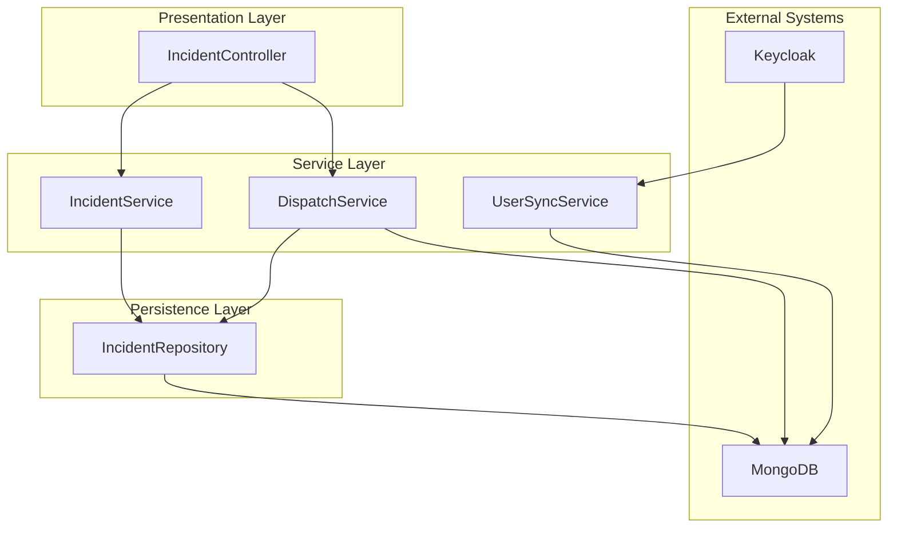
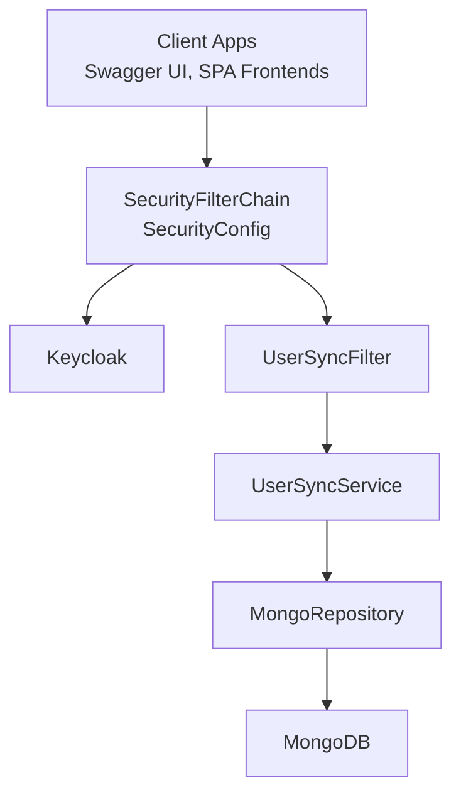
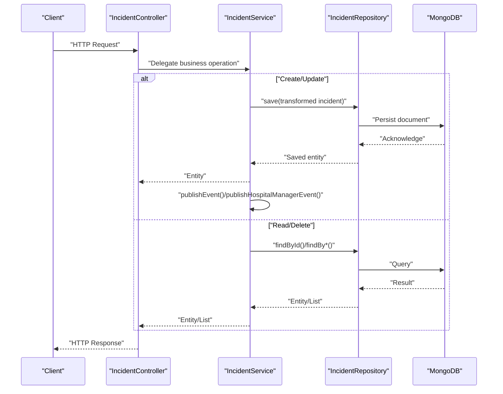
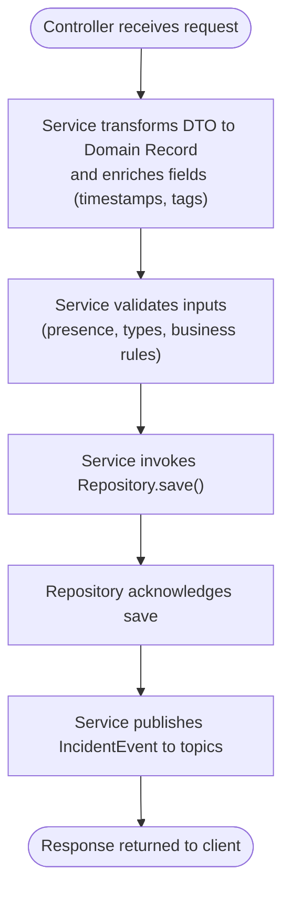
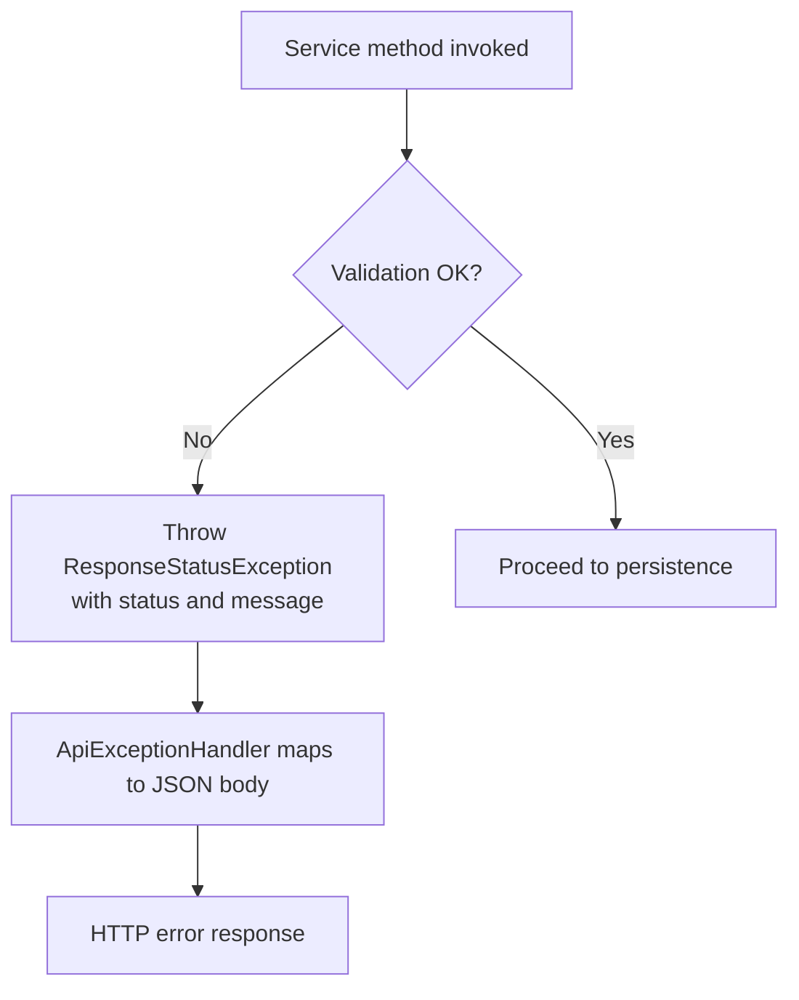
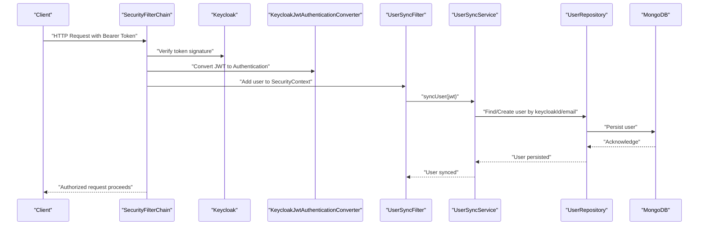
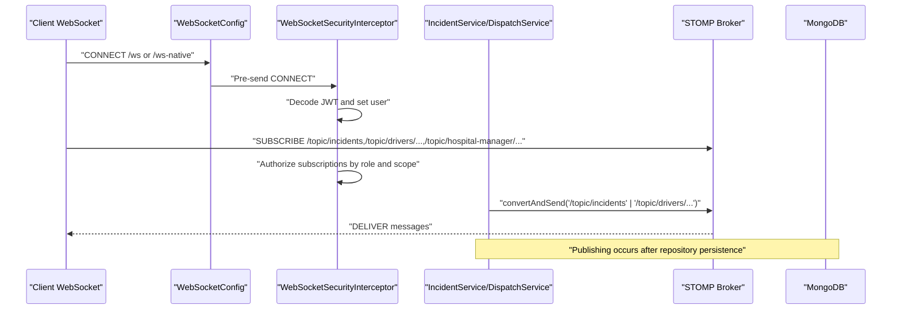
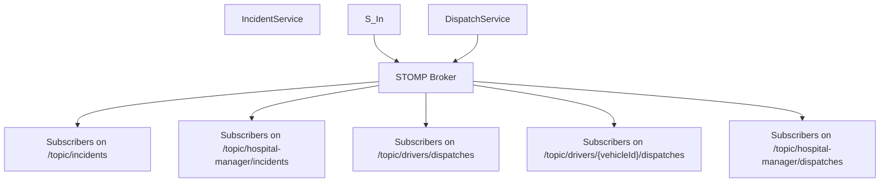
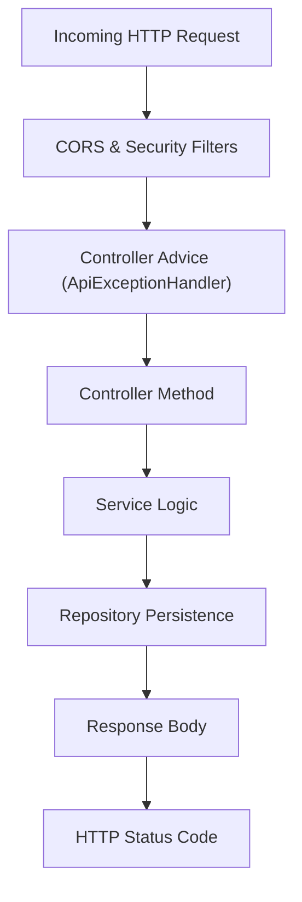
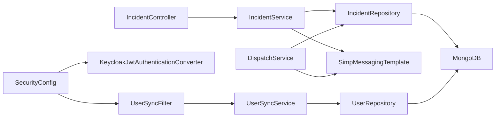

# Data Flow

<cite>
**Referenced Files in This Document**
- [EmsCommandCenterApplication.java](file://src/main/java/com/example/ems_command_center/EmsCommandCenterApplication.java)
- [SecurityConfig.java](file://src/main/java/com/example/ems_command_center/config/SecurityConfig.java)
- [WebSocketConfig.java](file://src/main/java/com/example/ems_command_center/config/WebSocketConfig.java)
- [WebSocketSecurityInterceptor.java](file://src/main/java/com/example/ems_command_center/config/WebSocketSecurityInterceptor.java)
- [KeycloakJwtAuthenticationConverter.java](file://src/main/java/com/example/ems_command_center/config/KeycloakJwtAuthenticationConverter.java)
- [UserSyncFilter.java](file://src/main/java/com/example/ems_command_center/config/UserSyncFilter.java)
- [ApiExceptionHandler.java](file://src/main/java/com/example/ems_command_center/config/ApiExceptionHandler.java)
- [application.yml](file://src/main/resources/application.yml)
- [IncidentController.java](file://src/main/java/com/example/ems_command_center/controller/IncidentController.java)
- [IncidentService.java](file://src/main/java/com/example/ems_command_center/service/IncidentService.java)
- [IncidentRepository.java](file://src/main/java/com/example/ems_command_center/repository/IncidentRepository.java)
- [Incident.java](file://src/main/java/com/example/ems_command_center/model/Incident.java)
- [IncidentEvent.java](file://src/main/java/com/example/ems_command_center/model/IncidentEvent.java)
- [DispatchService.java](file://src/main/java/com/example/ems_command_center/service/DispatchService.java)
- [UserSyncService.java](file://src/main/java/com/example/ems_command_center/service/UserSyncService.java)
</cite>

## Table of Contents
1. [Introduction](#introduction)
2. [Project Structure](#project-structure)
3. [Core Components](#core-components)
4. [Architecture Overview](#architecture-overview)
5. [Detailed Component Analysis](#detailed-component-analysis)
6. [Dependency Analysis](#dependency-analysis)
7. [Performance Considerations](#performance-considerations)
8. [Troubleshooting Guide](#troubleshooting-guide)
9. [Conclusion](#conclusion)

## Introduction
This document explains the end-to-end data flow across the system, focusing on:
- HTTP request-response from controller to service to repository and MongoDB persistence
- WebSocket message flow for real-time updates
- Authentication via Keycloak integration
- Notification broadcasting patterns
- Data transformation between layers, validation flows, error propagation, and transaction boundaries
- Request processing pipeline, response formatting, and cross-cutting concerns

## Project Structure
The system follows a layered Spring Boot architecture:
- Controllers expose REST endpoints
- Services encapsulate business logic and orchestrate persistence and notifications
- Repositories interact with MongoDB
- Configuration defines security, CORS, WebSocket, and JWT conversion
- Cross-cutting concerns include exception handling, user synchronization, and access control

**Diagram sources**
- [IncidentController.java:1-61](file://src/main/java/com/example/ems_command_center/controller/IncidentController.java#L1-L61)
- [IncidentService.java:1-106](file://src/main/java/com/example/ems_command_center/service/IncidentService.java#L1-L106)
- [DispatchService.java:1-214](file://src/main/java/com/example/ems_command_center/service/DispatchService.java#L1-L214)
- [IncidentRepository.java:1-14](file://src/main/java/com/example/ems_command_center/repository/IncidentRepository.java#L1-L14)
- [UserSyncService.java:1-182](file://src/main/java/com/example/ems_command_center/service/UserSyncService.java#L1-L182)

**Section sources**
- [EmsCommandCenterApplication.java:1-14](file://src/main/java/com/example/ems_command_center/EmsCommandCenterApplication.java#L1-L14)

## Core Components
- Controllers: Expose HTTP endpoints and delegate to services. Example: IncidentController handles CRUD for incidents.
- Services: Implement business logic, orchestrate persistence, and publish notifications. Examples: IncidentService, DispatchService, UserSyncService.
- Repositories: MongoDB access via Spring Data MongoRepository. Example: IncidentRepository.
- Models: Immutable records mapped to MongoDB documents. Example: Incident.
- Configuration: Security (OAuth2/JWT, CORS), WebSocket broker, JWT to authority conversion, and exception handling.

**Section sources**
- [IncidentController.java:1-61](file://src/main/java/com/example/ems_command_center/controller/IncidentController.java#L1-L61)
- [IncidentService.java:1-106](file://src/main/java/com/example/ems_command_center/service/IncidentService.java#L1-L106)
- [DispatchService.java:1-214](file://src/main/java/com/example/ems_command_center/service/DispatchService.java#L1-L214)
- [IncidentRepository.java:1-14](file://src/main/java/com/example/ems_command_center/repository/IncidentRepository.java#L1-L14)
- [Incident.java:1-24](file://src/main/java/com/example/ems_command_center/model/Incident.java#L1-L24)
- [SecurityConfig.java:1-156](file://src/main/java/com/example/ems_command_center/config/SecurityConfig.java#L1-L156)
- [WebSocketConfig.java:1-51](file://src/main/java/com/example/ems_command_center/config/WebSocketConfig.java#L1-L51)
- [KeycloakJwtAuthenticationConverter.java:1-88](file://src/main/java/com/example/ems_command_center/config/KeycloakJwtAuthenticationConverter.java#L1-L88)
- [UserSyncFilter.java:1-51](file://src/main/java/com/example/ems_command_center/config/UserSyncFilter.java#L1-L51)
- [ApiExceptionHandler.java:1-27](file://src/main/java/com/example/ems_command_center/config/ApiExceptionHandler.java#L1-L27)

## Architecture Overview
The system integrates REST and WebSocket for real-time updates, secured by OAuth2/JWT against Keycloak. User synchronization ensures local user records reflect Keycloak claims.

**Diagram sources**
- [SecurityConfig.java:44-98](file://src/main/java/com/example/ems_command_center/config/SecurityConfig.java#L44-L98)
- [UserSyncFilter.java:26-42](file://src/main/java/com/example/ems_command_center/config/UserSyncFilter.java#L26-L42)
- [UserSyncService.java:30-61](file://src/main/java/com/example/ems_command_center/service/UserSyncService.java#L30-L61)
- [application.yml:10-17](file://src/main/resources/application.yml#L10-L17)

## Detailed Component Analysis

### HTTP Request-Response Flow: Controller → Service → Repository → MongoDB
This sequence covers GET, POST, PUT, and DELETE operations for incidents, including validation, transformation, persistence, and event publishing.

**Diagram sources**
- [IncidentController.java:25-60](file://src/main/java/com/example/ems_command_center/controller/IncidentController.java#L25-L60)
- [IncidentService.java:26-59](file://src/main/java/com/example/ems_command_center/service/IncidentService.java#L26-L59)
- [IncidentRepository.java:10-13](file://src/main/java/com/example/ems_command_center/repository/IncidentRepository.java#L10-L13)
- [Incident.java:8-23](file://src/main/java/com/example/ems_command_center/model/Incident.java#L8-L23)

**Section sources**
- [IncidentController.java:25-60](file://src/main/java/com/example/ems_command_center/controller/IncidentController.java#L25-L60)
- [IncidentService.java:26-59](file://src/main/java/com/example/ems_command_center/service/IncidentService.java#L26-L59)
- [IncidentRepository.java:10-13](file://src/main/java/com/example/ems_command_center/repository/IncidentRepository.java#L10-L13)
- [Incident.java:8-23](file://src/main/java/com/example/ems_command_center/model/Incident.java#L8-L23)

### Data Transformation Between Layers
- Controller to Service: Controller passes raw DTOs; Service constructs domain records and enriches metadata (e.g., timestamps).
- Service to Repository: Service persists immutable records; repositories return domain objects.
- Event Publishing: Service publishes structured events to WebSocket topics for real-time subscribers.

**Diagram sources**
- [IncidentService.java:65-82](file://src/main/java/com/example/ems_command_center/service/IncidentService.java#L65-L82)
- [IncidentService.java:35-59](file://src/main/java/com/example/ems_command_center/service/IncidentService.java#L35-L59)
- [IncidentEvent.java:3-8](file://src/main/java/com/example/ems_command_center/model/IncidentEvent.java#L3-L8)

**Section sources**
- [IncidentService.java:65-82](file://src/main/java/com/example/ems_command_center/service/IncidentService.java#L65-L82)
- [IncidentEvent.java:3-8](file://src/main/java/com/example/ems_command_center/model/IncidentEvent.java#L3-L8)

### Validation Flows and Error Propagation
- Validation occurs in services (e.g., existence checks, type checks, required fields).
- Errors are raised as ResponseStatusException with appropriate HTTP status codes.
- Global exception handling formats errors consistently.

**Diagram sources**
- [IncidentService.java:30-33](file://src/main/java/com/example/ems_command_center/service/IncidentService.java#L30-L33)
- [IncidentService.java:121-135](file://src/main/java/com/example/ems_command_center/service/DispatchService.java#L121-L135)
- [ApiExceptionHandler.java:16-25](file://src/main/java/com/example/ems_command_center/config/ApiExceptionHandler.java#L16-L25)

**Section sources**
- [IncidentService.java:30-33](file://src/main/java/com/example/ems_command_center/service/IncidentService.java#L30-L33)
- [DispatchService.java:121-135](file://src/main/java/com/example/ems_command_center/service/DispatchService.java#L121-L135)
- [ApiExceptionHandler.java:16-25](file://src/main/java/com/example/ems_command_center/config/ApiExceptionHandler.java#L16-L25)

### Transaction Boundaries
- MongoDB operations are executed per-method boundary; no explicit multi-document transactions are shown in the referenced files.
- Business methods combine repository saves and notifications; failures in persistence or notification publishing are handled independently.

**Section sources**
- [DispatchService.java:100-118](file://src/main/java/com/example/ems_command_center/service/DispatchService.java#L100-L118)
- [IncidentService.java:35-59](file://src/main/java/com/example/ems_command_center/service/IncidentService.java#L35-L59)

### Authentication Flow Through Keycloak Integration
- REST endpoints are protected by OAuth2 Resource Server with JWT support.
- JWT claims are converted to Spring Security authorities, including realm/client roles.
- A filter synchronizes user details from JWT to the local MongoDB user collection.

**Diagram sources**
- [SecurityConfig.java:93-95](file://src/main/java/com/example/ems_command_center/config/SecurityConfig.java#L93-L95)
- [KeycloakJwtAuthenticationConverter.java:29-41](file://src/main/java/com/example/ems_command_center/config/KeycloakJwtAuthenticationConverter.java#L29-L41)
- [UserSyncFilter.java:26-42](file://src/main/java/com/example/ems_command_center/config/UserSyncFilter.java#L26-L42)
- [UserSyncService.java:30-61](file://src/main/java/com/example/ems_command_center/service/UserSyncService.java#L30-L61)
- [application.yml:10-17](file://src/main/resources/application.yml#L10-L17)

**Section sources**
- [SecurityConfig.java:93-95](file://src/main/java/com/example/ems_command_center/config/SecurityConfig.java#L93-L95)
- [KeycloakJwtAuthenticationConverter.java:29-41](file://src/main/java/com/example/ems_command_center/config/KeycloakJwtAuthenticationConverter.java#L29-L41)
- [UserSyncFilter.java:26-42](file://src/main/java/com/example/ems_command_center/config/UserSyncFilter.java#L26-L42)
- [UserSyncService.java:30-61](file://src/main/java/com/example/ems_command_center/service/UserSyncService.java#L30-L61)
- [application.yml:10-17](file://src/main/resources/application.yml#L10-L17)

### WebSocket Message Flow for Real-Time Updates
- STOMP endpoints are exposed for WebSocket connections with SockJS fallback.
- A channel interceptor validates CONNECT tokens and enforces authorization for subscription destinations.
- Services publish incident and dispatch updates to topics; clients subscribe to scoped channels.

**Diagram sources**
- [WebSocketConfig.java:20-49](file://src/main/java/com/example/ems_command_center/config/WebSocketConfig.java#L20-L49)
- [WebSocketSecurityInterceptor.java:34-111](file://src/main/java/com/example/ems_command_center/config/WebSocketSecurityInterceptor.java#L34-L111)
- [IncidentService.java:88-104](file://src/main/java/com/example/ems_command_center/service/IncidentService.java#L88-L104)
- [DispatchService.java:205-212](file://src/main/java/com/example/ems_command_center/service/DispatchService.java#L205-L212)

**Section sources**
- [WebSocketConfig.java:20-49](file://src/main/java/com/example/ems_command_center/config/WebSocketConfig.java#L20-L49)
- [WebSocketSecurityInterceptor.java:34-111](file://src/main/java/com/example/ems_command_center/config/WebSocketSecurityInterceptor.java#L34-L111)
- [IncidentService.java:88-104](file://src/main/java/com/example/ems_command_center/service/IncidentService.java#L88-L104)
- [DispatchService.java:205-212](file://src/main/java/com/example/ems_command_center/service/DispatchService.java#L205-L212)

### Notification Broadcasting Patterns
- General incidents: published to "/topic/incidents" for ADMIN, USER, DRIVER.
- Hospital manager incidents: published to "/topic/hospital-manager/incidents" for MANAGER.
- Dispatch notifications: published to:
  - "/topic/drivers/dispatches" for ADMIN and DRIVER
  - "/topic/drivers/{vehicleId}/dispatches" for DRIVER assigned to that ambulance
  - "/topic/hospital-manager/dispatches" for MANAGER

**Diagram sources**
- [IncidentService.java:88-104](file://src/main/java/com/example/ems_command_center/service/IncidentService.java#L88-L104)
- [DispatchService.java:205-212](file://src/main/java/com/example/ems_command_center/service/DispatchService.java#L205-L212)

**Section sources**
- [IncidentService.java:88-104](file://src/main/java/com/example/ems_command_center/service/IncidentService.java#L88-L104)
- [DispatchService.java:205-212](file://src/main/java/com/example/ems_command_center/service/DispatchService.java#L205-L212)

### Request Processing Pipeline and Response Formatting
- CORS and security filters are applied globally.
- REST controllers return ResponseEntity with appropriate status codes.
- Exceptions are mapped to a consistent JSON error body by ApiExceptionHandler.

**Diagram sources**
- [SecurityConfig.java:44-98](file://src/main/java/com/example/ems_command_center/config/SecurityConfig.java#L44-L98)
- [ApiExceptionHandler.java:16-25](file://src/main/java/com/example/ems_command_center/config/ApiExceptionHandler.java#L16-L25)
- [IncidentController.java:25-60](file://src/main/java/com/example/ems_command_center/controller/IncidentController.java#L25-L60)

**Section sources**
- [SecurityConfig.java:44-98](file://src/main/java/com/example/ems_command_center/config/SecurityConfig.java#L44-L98)
- [ApiExceptionHandler.java:16-25](file://src/main/java/com/example/ems_command_center/config/ApiExceptionHandler.java#L16-L25)
- [IncidentController.java:25-60](file://src/main/java/com/example/ems_command_center/controller/IncidentController.java#L25-L60)

## Dependency Analysis
The following diagram highlights key dependencies among components involved in data flow.

**Diagram sources**
- [IncidentController.java:19-23](file://src/main/java/com/example/ems_command_center/controller/IncidentController.java#L19-L23)
- [IncidentService.java:18-24](file://src/main/java/com/example/ems_command_center/service/IncidentService.java#L18-L24)
- [IncidentRepository.java:10-13](file://src/main/java/com/example/ems_command_center/repository/IncidentRepository.java#L10-L13)
- [DispatchService.java:26-38](file://src/main/java/com/example/ems_command_center/service/DispatchService.java#L26-L38)
- [SecurityConfig.java:93-95](file://src/main/java/com/example/ems_command_center/config/SecurityConfig.java#L93-L95)
- [KeycloakJwtAuthenticationConverter.java:18-41](file://src/main/java/com/example/ems_command_center/config/KeycloakJwtAuthenticationConverter.java#L18-L41)
- [UserSyncFilter.java:18-24](file://src/main/java/com/example/ems_command_center/config/UserSyncFilter.java#L18-L24)
- [UserSyncService.java:16-23](file://src/main/java/com/example/ems_command_center/service/UserSyncService.java#L16-L23)

**Section sources**
- [IncidentController.java:19-23](file://src/main/java/com/example/ems_command_center/controller/IncidentController.java#L19-L23)
- [IncidentService.java:18-24](file://src/main/java/com/example/ems_command_center/service/IncidentService.java#L18-L24)
- [IncidentRepository.java:10-13](file://src/main/java/com/example/ems_command_center/repository/IncidentRepository.java#L10-L13)
- [DispatchService.java:26-38](file://src/main/java/com/example/ems_command_center/service/DispatchService.java#L26-L38)
- [SecurityConfig.java:93-95](file://src/main/java/com/example/ems_command_center/config/SecurityConfig.java#L93-L95)
- [KeycloakJwtAuthenticationConverter.java:18-41](file://src/main/java/com/example/ems_command_center/config/KeycloakJwtAuthenticationConverter.java#L18-L41)
- [UserSyncFilter.java:18-24](file://src/main/java/com/example/ems_command_center/config/UserSyncFilter.java#L18-L24)
- [UserSyncService.java:16-23](file://src/main/java/com/example/ems_command_center/service/UserSyncService.java#L16-L23)

## Performance Considerations
- Minimize payload sizes in WebSocket broadcasts; send only necessary fields.
- Use repository query methods efficiently; avoid N+1 queries by fetching related entities in bulk where applicable.
- Consider batching frequent notifications to reduce broker overhead.
- Tune MongoDB indexes for common query patterns (e.g., findByStatus, findByOrderByPriorityAsc).

## Troubleshooting Guide
- Unauthorized requests: Verify Keycloak JWK set URI and client configuration; ensure Authorization header is present and valid.
- Forbidden access: Confirm user roles in JWT and configured role-based path patterns.
- User sync failures: Inspect warnings logged by UserSyncFilter; ensure unique constraints and race conditions are handled gracefully.
- WebSocket connection issues: Validate allowed origins and STOMP headers; confirm interceptors authorize subscriptions correctly.
- Consistent error responses: ApiExceptionHandler ensures standardized JSON bodies with timestamp, status, error, and message.

**Section sources**
- [SecurityConfig.java:138-154](file://src/main/java/com/example/ems_command_center/config/SecurityConfig.java#L138-L154)
- [UserSyncFilter.java:33-38](file://src/main/java/com/example/ems_command_center/config/UserSyncFilter.java#L33-L38)
- [ApiExceptionHandler.java:16-25](file://src/main/java/com/example/ems_command_center/config/ApiExceptionHandler.java#L16-L25)
- [WebSocketSecurityInterceptor.java:41-55](file://src/main/java/com/example/ems_command_center/config/WebSocketSecurityInterceptor.java#L41-L55)

## Conclusion
The system implements a clean separation of concerns with robust cross-cutting behaviors:
- REST endpoints are secured and role-gated
- Services encapsulate validation, transformation, persistence, and real-time notifications
- WebSocket channels enforce fine-grained authorization and deliver targeted updates
- MongoDB persistence is straightforward with repository abstractions
- Centralized exception handling ensures consistent error responses