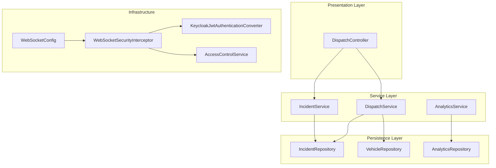
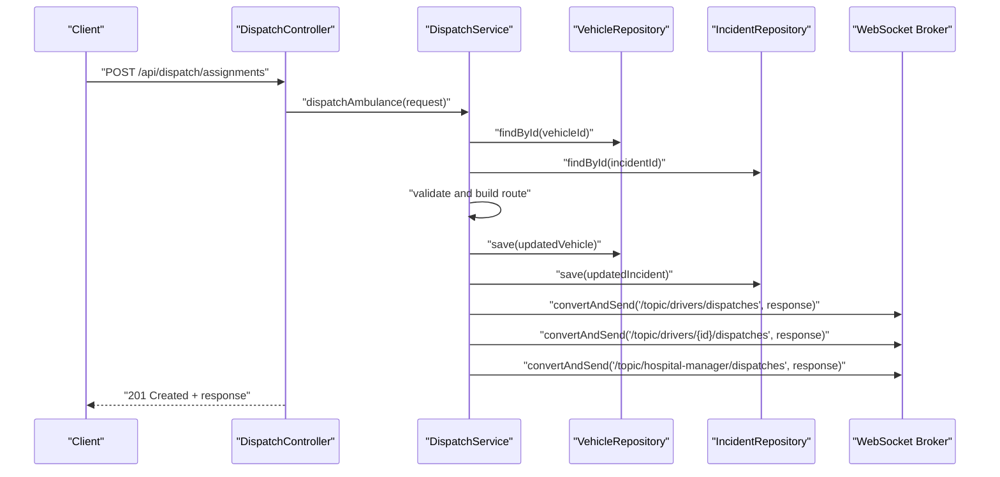
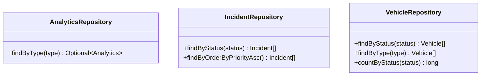
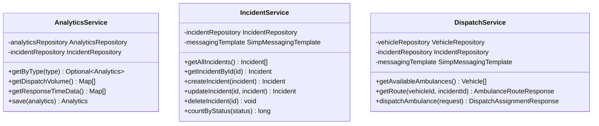
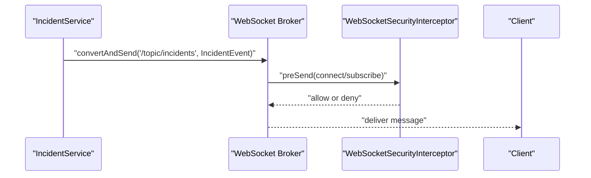
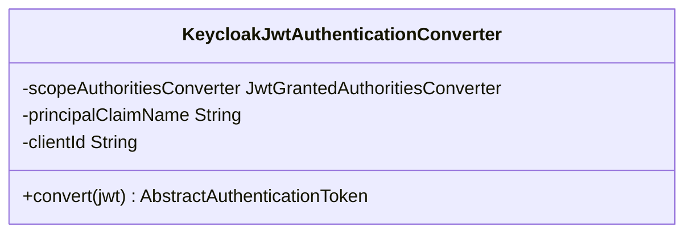
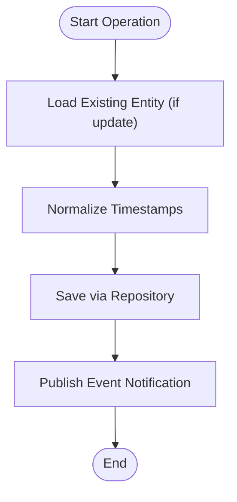
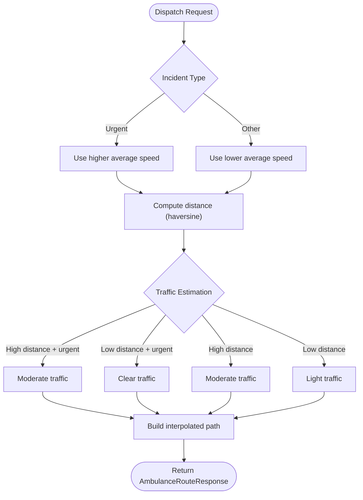
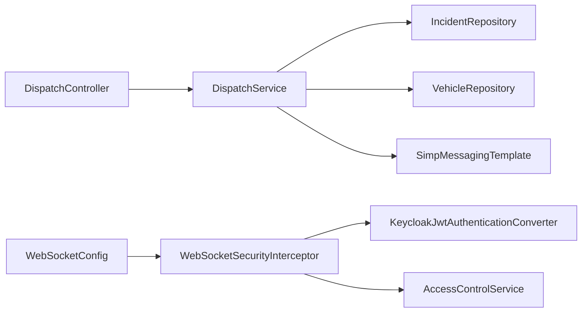

# Design Patterns

<cite>
**Referenced Files in This Document**
- [AnalyticsRepository.java](file://src/main/java/com/example/ems_command_center/repository/AnalyticsRepository.java)
- [IncidentRepository.java](file://src/main/java/com/example/ems_command_center/repository/IncidentRepository.java)
- [VehicleRepository.java](file://src/main/java/com/example/ems_command_center/repository/VehicleRepository.java)
- [AnalyticsService.java](file://src/main/java/com/example/ems_command_center/service/AnalyticsService.java)
- [IncidentService.java](file://src/main/java/com/example/ems_command_center/service/IncidentService.java)
- [DispatchService.java](file://src/main/java/com/example/ems_command_center/service/DispatchService.java)
- [KeycloakJwtAuthenticationConverter.java](file://src/main/java/com/example/ems_command_center/config/KeycloakJwtAuthenticationConverter.java)
- [WebSocketConfig.java](file://src/main/java/com/example/ems_command_center/config/WebSocketConfig.java)
- [WebSocketSecurityInterceptor.java](file://src/main/java/com/example/ems_command_center/config/WebSocketSecurityInterceptor.java)
- [AccessControlService.java](file://src/main/java/com/example/ems_command_center/service/AccessControlService.java)
- [DispatchController.java](file://src/main/java/com/example/ems_command_center/controller/DispatchController.java)
- [IncidentEvent.java](file://src/main/java/com/example/ems_command_center/model/IncidentEvent.java)
- [DispatchRequest.java](file://src/main/java/com/example/ems_command_center/model/DispatchRequest.java)
</cite>

## Table of Contents
1. [Introduction](#introduction)
2. [Project Structure](#project-structure)
3. [Core Components](#core-components)
4. [Architecture Overview](#architecture-overview)
5. [Detailed Component Analysis](#detailed-component-analysis)
6. [Dependency Analysis](#dependency-analysis)
7. [Performance Considerations](#performance-considerations)
8. [Troubleshooting Guide](#troubleshooting-guide)
9. [Conclusion](#conclusion)

## Introduction
This document explains the design patterns implemented across the application and how they contribute to a maintainable and scalable architecture. It focuses on:
- Repository pattern for MongoDB data access
- Service layer pattern for business logic encapsulation
- Observer pattern for WebSocket real-time communication
- Factory pattern usage in JWT authentication conversion
- Template method pattern in service workflows
- Strategy pattern in dispatch algorithms

## Project Structure
The application follows a layered architecture:
- Controllers expose REST endpoints
- Services encapsulate business logic and orchestrate repositories
- Repositories abstract MongoDB persistence
- Configuration wires Spring Security, WebSockets, and JWT conversion
- Models define data structures and events

**Diagram sources**
- [DispatchController.java:22-56](file://src/main/java/com/example/ems_command_center/controller/DispatchController.java#L22-L56)
- [DispatchService.java:21-38](file://src/main/java/com/example/ems_command_center/service/DispatchService.java#L21-L38)
- [IncidentService.java:15-24](file://src/main/java/com/example/ems_command_center/service/IncidentService.java#L15-L24)
- [AnalyticsService.java:19-31](file://src/main/java/com/example/ems_command_center/service/AnalyticsService.java#L19-L31)
- [IncidentRepository.java:9-13](file://src/main/java/com/example/ems_command_center/repository/IncidentRepository.java#L9-L13)
- [VehicleRepository.java:9-14](file://src/main/java/com/example/ems_command_center/repository/VehicleRepository.java#L9-L14)
- [AnalyticsRepository.java:9-12](file://src/main/java/com/example/ems_command_center/repository/AnalyticsRepository.java#L9-L12)
- [WebSocketConfig.java:10-49](file://src/main/java/com/example/ems_command_center/config/WebSocketConfig.java#L10-L49)
- [WebSocketSecurityInterceptor.java:17-32](file://src/main/java/com/example/ems_command_center/config/WebSocketSecurityInterceptor.java#L17-L32)
- [KeycloakJwtAuthenticationConverter.java:18-41](file://src/main/java/com/example/ems_command_center/config/KeycloakJwtAuthenticationConverter.java#L18-L41)
- [AccessControlService.java:7-36](file://src/main/java/com/example/ems_command_center/service/AccessControlService.java#L7-L36)

**Section sources**
- [DispatchController.java:22-56](file://src/main/java/com/example/ems_command_center/controller/DispatchController.java#L22-L56)
- [DispatchService.java:21-38](file://src/main/java/com/example/ems_command_center/service/DispatchService.java#L21-L38)
- [IncidentService.java:15-24](file://src/main/java/com/example/ems_command_center/service/IncidentService.java#L15-L24)
- [AnalyticsService.java:19-31](file://src/main/java/com/example/ems_command_center/service/AnalyticsService.java#L19-L31)
- [IncidentRepository.java:9-13](file://src/main/java/com/example/ems_command_center/repository/IncidentRepository.java#L9-L13)
- [VehicleRepository.java:9-14](file://src/main/java/com/example/ems_command_center/repository/VehicleRepository.java#L9-L14)
- [AnalyticsRepository.java:9-12](file://src/main/java/com/example/ems_command_center/repository/AnalyticsRepository.java#L9-L12)
- [WebSocketConfig.java:10-49](file://src/main/java/com/example/ems_command_center/config/WebSocketConfig.java#L10-L49)
- [WebSocketSecurityInterceptor.java:17-32](file://src/main/java/com/example/ems_command_center/config/WebSocketSecurityInterceptor.java#L17-L32)
- [KeycloakJwtAuthenticationConverter.java:18-41](file://src/main/java/com/example/ems_command_center/config/KeycloakJwtAuthenticationConverter.java#L18-L41)
- [AccessControlService.java:7-36](file://src/main/java/com/example/ems_command_center/service/AccessControlService.java#L7-L36)

## Core Components
- Repository pattern: MongoDB repositories provide typed CRUD and custom queries for domain entities.
- Service layer pattern: Services encapsulate business logic, coordinate repositories, and handle cross-cutting concerns like notifications.
- Observer pattern: WebSocket infrastructure publishes events to subscribers via STOMP topics.

**Section sources**
- [AnalyticsRepository.java:9-12](file://src/main/java/com/example/ems_command_center/repository/AnalyticsRepository.java#L9-L12)
- [IncidentRepository.java:9-13](file://src/main/java/com/example/ems_command_center/repository/IncidentRepository.java#L9-L13)
- [VehicleRepository.java:9-14](file://src/main/java/com/example/ems_command_center/repository/VehicleRepository.java#L9-L14)
- [AnalyticsService.java:19-31](file://src/main/java/com/example/ems_command_center/service/AnalyticsService.java#L19-L31)
- [IncidentService.java:15-24](file://src/main/java/com/example/ems_command_center/service/IncidentService.java#L15-L24)
- [DispatchService.java:21-38](file://src/main/java/com/example/ems_command_center/service/DispatchService.java#L21-L38)

## Architecture Overview
The system separates concerns across layers. Controllers delegate to services, which interact with repositories. Real-time updates are broadcast via WebSocket message broker.

**Diagram sources**
- [DispatchController.java:50-55](file://src/main/java/com/example/ems_command_center/controller/DispatchController.java#L50-L55)
- [DispatchService.java:53-119](file://src/main/java/com/example/ems_command_center/service/DispatchService.java#L53-L119)
- [VehicleRepository.java:9-14](file://src/main/java/com/example/ems_command_center/repository/VehicleRepository.java#L9-L14)
- [IncidentRepository.java:9-13](file://src/main/java/com/example/ems_command_center/repository/IncidentRepository.java#L9-L13)

## Detailed Component Analysis

### Repository Pattern Implementation (MongoDB)
- Purpose: Abstract data access for MongoDB collections using Spring Data MongoDB repositories.
- Benefits:
  - Clean separation between persistence and business logic
  - Declarative query derivation from method names
  - Reduced boilerplate code
- Examples:
  - AnalyticsRepository defines a custom finder by type.
  - IncidentRepository and VehicleRepository provide typed queries for filtering and ordering.
- Scalability: Spring Data MongoDB supports pagination and aggregation for large datasets.

**Diagram sources**
- [AnalyticsRepository.java:9-12](file://src/main/java/com/example/ems_command_center/repository/AnalyticsRepository.java#L9-L12)
- [IncidentRepository.java:9-13](file://src/main/java/com/example/ems_command_center/repository/IncidentRepository.java#L9-L13)
- [VehicleRepository.java:9-14](file://src/main/java/com/example/ems_command_center/repository/VehicleRepository.java#L9-L14)

**Section sources**
- [AnalyticsRepository.java:9-12](file://src/main/java/com/example/ems_command_center/repository/AnalyticsRepository.java#L9-L12)
- [IncidentRepository.java:9-13](file://src/main/java/com/example/ems_command_center/repository/IncidentRepository.java#L9-L13)
- [VehicleRepository.java:9-14](file://src/main/java/com/example/ems_command_center/repository/VehicleRepository.java#L9-L14)

### Service Layer Pattern (Business Logic Encapsulation)
- Purpose: Encapsulate business operations, orchestrate repositories, and manage cross-cutting concerns.
- Benefits:
  - Single responsibility per service
  - Testability through dependency injection
  - Clear boundaries between presentation and persistence
- Examples:
  - AnalyticsService computes derived metrics and persists analytics data.
  - IncidentService manages incident lifecycle and publishes events.
  - DispatchService coordinates vehicle and incident data, builds routes, and notifies subscribers.

**Diagram sources**
- [AnalyticsService.java:19-31](file://src/main/java/com/example/ems_command_center/service/AnalyticsService.java#L19-L31)
- [IncidentService.java:15-24](file://src/main/java/com/example/ems_command_center/service/IncidentService.java#L15-L24)
- [DispatchService.java:21-38](file://src/main/java/com/example/ems_command_center/service/DispatchService.java#L21-L38)

**Section sources**
- [AnalyticsService.java:19-31](file://src/main/java/com/example/ems_command_center/service/AnalyticsService.java#L19-L31)
- [IncidentService.java:15-24](file://src/main/java/com/example/ems_command_center/service/IncidentService.java#L15-L24)
- [DispatchService.java:21-38](file://src/main/java/com/example/ems_command_center/service/DispatchService.java#L21-L38)

### Observer Pattern (WebSocket Real-Time Communication)
- Purpose: Enable real-time event broadcasting to clients subscribed to topics.
- Implementation:
  - WebSocketConfig registers STOMP endpoints and enables a simple broker for topics.
  - WebSocketSecurityInterceptor validates JWT tokens and enforces authorization per topic.
  - Services publish events using SimpMessagingTemplate to specific channels.
- Benefits:
  - Decouples publishers (services) from subscribers (clients)
  - Supports scoped subscriptions (driver-specific, manager-specific)
  - Enforces fine-grained access control at the transport level

**Diagram sources**
- [IncidentService.java:88-104](file://src/main/java/com/example/ems_command_center/service/IncidentService.java#L88-L104)
- [WebSocketConfig.java:20-49](file://src/main/java/com/example/ems_command_center/config/WebSocketConfig.java#L20-L49)
- [WebSocketSecurityInterceptor.java:34-111](file://src/main/java/com/example/ems_command_center/config/WebSocketSecurityInterceptor.java#L34-L111)

**Section sources**
- [WebSocketConfig.java:10-49](file://src/main/java/com/example/ems_command_center/config/WebSocketConfig.java#L10-L49)
- [WebSocketSecurityInterceptor.java:17-32](file://src/main/java/com/example/ems_command_center/config/WebSocketSecurityInterceptor.java#L17-L32)
- [IncidentService.java:84-104](file://src/main/java/com/example/ems_command_center/service/IncidentService.java#L84-L104)
- [IncidentEvent.java:3-8](file://src/main/java/com/example/ems_command_center/model/IncidentEvent.java#L3-L8)

### Factory Pattern (JWT Authentication Conversion)
- Purpose: Construct authentication tokens with combined authorities from scopes and roles.
- Implementation:
  - KeycloakJwtAuthenticationConverter acts as a factory that converts a raw JWT into a JwtAuthenticationToken with standardized authorities.
  - It extracts realm roles and client-specific roles, normalizes them, and sets the principal name.
- Benefits:
  - Centralized JWT-to-authentication conversion logic
  - Extensible authority extraction strategy
  - Consistent authentication token shape across the application

**Diagram sources**
- [KeycloakJwtAuthenticationConverter.java:18-41](file://src/main/java/com/example/ems_command_center/config/KeycloakJwtAuthenticationConverter.java#L18-L41)

**Section sources**
- [KeycloakJwtAuthenticationConverter.java:18-41](file://src/main/java/com/example/ems_command_center/config/KeycloakJwtAuthenticationConverter.java#L18-L41)

### Template Method Pattern (Service Workflows)
- Purpose: Define skeleton of workflows while allowing steps to be overridden or customized.
- Evidence:
  - IncidentService implements a consistent template for create/update/delete operations:
    - Load existing entity (if applicable)
    - Apply timestamp normalization
    - Save via repository
    - Publish event notifications
  - This pattern ensures uniform behavior across CRUD operations while keeping business logic cohesive.

**Diagram sources**
- [IncidentService.java:35-59](file://src/main/java/com/example/ems_command_center/service/IncidentService.java#L35-L59)
- [IncidentService.java:65-82](file://src/main/java/com/example/ems_command_center/service/IncidentService.java#L65-L82)
- [IncidentService.java:88-104](file://src/main/java/com/example/ems_command_center/service/IncidentService.java#L88-L104)

**Section sources**
- [IncidentService.java:35-59](file://src/main/java/com/example/ems_command_center/service/IncidentService.java#L35-L59)
- [IncidentService.java:65-82](file://src/main/java/com/example/ems_command_center/service/IncidentService.java#L65-L82)
- [IncidentService.java:88-104](file://src/main/java/com/example/ems_command_center/service/IncidentService.java#L88-L104)

### Strategy Pattern (Dispatch Algorithms)
- Purpose: Encapsulate algorithms for route estimation and traffic prediction based on incident characteristics.
- Evidence:
  - DispatchService implements strategies for:
    - Average speed calculation based on incident type
    - Traffic condition estimation based on distance and type
    - Route building with interpolated waypoints
  - Benefits:
    - Easy to modify or extend algorithms without changing caller code
    - Clear separation of concerns between route computation and dispatch orchestration

**Diagram sources**
- [DispatchService.java:173-182](file://src/main/java/com/example/ems_command_center/service/DispatchService.java#L173-L182)
- [DispatchService.java:190-203](file://src/main/java/com/example/ems_command_center/service/DispatchService.java#L190-L203)
- [DispatchService.java:137-171](file://src/main/java/com/example/ems_command_center/service/DispatchService.java#L137-L171)

**Section sources**
- [DispatchService.java:173-182](file://src/main/java/com/example/ems_command_center/service/DispatchService.java#L173-L182)
- [DispatchService.java:190-203](file://src/main/java/com/example/ems_command_center/service/DispatchService.java#L190-L203)
- [DispatchService.java:137-171](file://src/main/java/com/example/ems_command_center/service/DispatchService.java#L137-L171)

## Dependency Analysis
- Controllers depend on services to perform business operations.
- Services depend on repositories for persistence and SimpMessagingTemplate for publishing events.
- WebSocket infrastructure depends on JWT decoding and access control services for authorization.
- Repositories depend on Spring Data MongoDB abstractions.

**Diagram sources**
- [DispatchController.java:22-56](file://src/main/java/com/example/ems_command_center/controller/DispatchController.java#L22-L56)
- [DispatchService.java:21-38](file://src/main/java/com/example/ems_command_center/service/DispatchService.java#L21-L38)
- [WebSocketConfig.java:10-49](file://src/main/java/com/example/ems_command_center/config/WebSocketConfig.java#L10-L49)
- [WebSocketSecurityInterceptor.java:17-32](file://src/main/java/com/example/ems_command_center/config/WebSocketSecurityInterceptor.java#L17-L32)
- [KeycloakJwtAuthenticationConverter.java:18-41](file://src/main/java/com/example/ems_command_center/config/KeycloakJwtAuthenticationConverter.java#L18-L41)
- [AccessControlService.java:7-36](file://src/main/java/com/example/ems_command_center/service/AccessControlService.java#L7-L36)

**Section sources**
- [DispatchController.java:22-56](file://src/main/java/com/example/ems_command_center/controller/DispatchController.java#L22-L56)
- [DispatchService.java:21-38](file://src/main/java/com/example/ems_command_center/service/DispatchService.java#L21-L38)
- [WebSocketConfig.java:10-49](file://src/main/java/com/example/ems_command_center/config/WebSocketConfig.java#L10-L49)
- [WebSocketSecurityInterceptor.java:17-32](file://src/main/java/com/example/ems_command_center/config/WebSocketSecurityInterceptor.java#L17-L32)
- [KeycloakJwtAuthenticationConverter.java:18-41](file://src/main/java/com/example/ems_command_center/config/KeycloakJwtAuthenticationConverter.java#L18-L41)
- [AccessControlService.java:7-36](file://src/main/java/com/example/ems_command_center/service/AccessControlService.java#L7-L36)

## Performance Considerations
- Repository queries: Prefer indexed fields in MongoDB for frequent filters (status, type).
- Service computations: Cache frequently accessed analytics data to reduce repeated computations.
- WebSocket scalability: Use a message broker cluster and tune connection limits for high subscriber counts.
- JWT processing: Reuse decoders and converters to avoid redundant allocations.

## Troubleshooting Guide
- WebSocket subscription errors:
  - Verify Authorization header presence for CONNECT commands.
  - Confirm topic destinations match expected patterns (/topic/drivers/{id}, /topic/hospital-manager/*).
  - Check role-based permissions enforced by WebSocketSecurityInterceptor.
- Dispatch failures:
  - Ensure vehicles and incidents have valid coordinates.
  - Validate incident and vehicle existence before dispatch.
- Repository access:
  - Confirm custom finder methods align with MongoDB schema and indexing strategy.

**Section sources**
- [WebSocketSecurityInterceptor.java:34-111](file://src/main/java/com/example/ems_command_center/config/WebSocketSecurityInterceptor.java#L34-L111)
- [DispatchService.java:121-135](file://src/main/java/com/example/ems_command_center/service/DispatchService.java#L121-L135)
- [IncidentRepository.java:9-13](file://src/main/java/com/example/ems_command_center/repository/IncidentRepository.java#L9-L13)
- [VehicleRepository.java:9-14](file://src/main/java/com/example/ems_command_center/repository/VehicleRepository.java#L9-L14)

## Conclusion
The application leverages well-established design patterns to achieve clean separation of concerns, testability, and scalability:
- Repository and Service layers isolate persistence and business logic.
- Observer pattern with WebSockets enables reactive, real-time updates.
- Factory pattern streamlines JWT authentication conversion.
- Template method and Strategy patterns improve workflow consistency and algorithm extensibility.