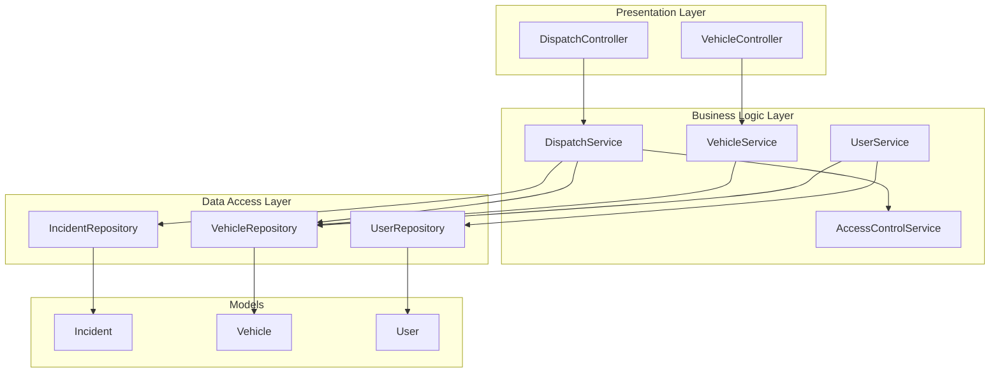
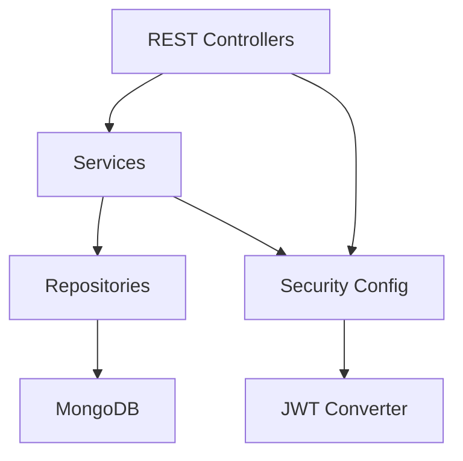
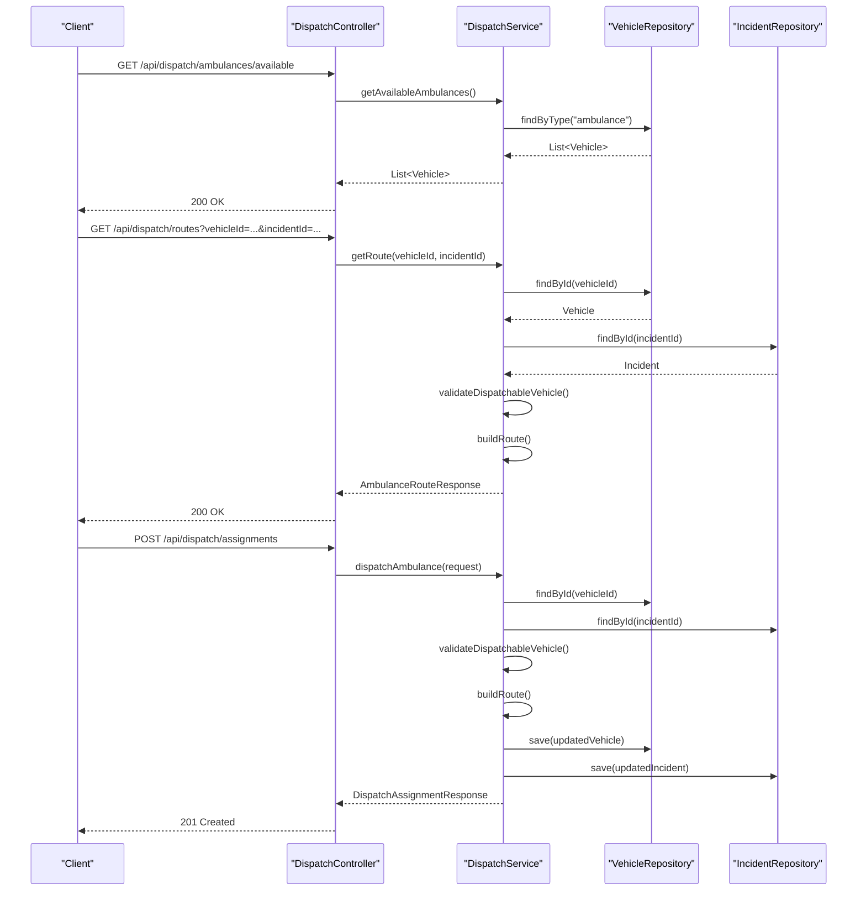
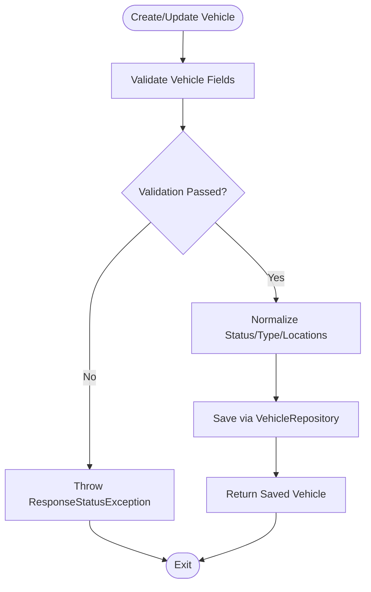
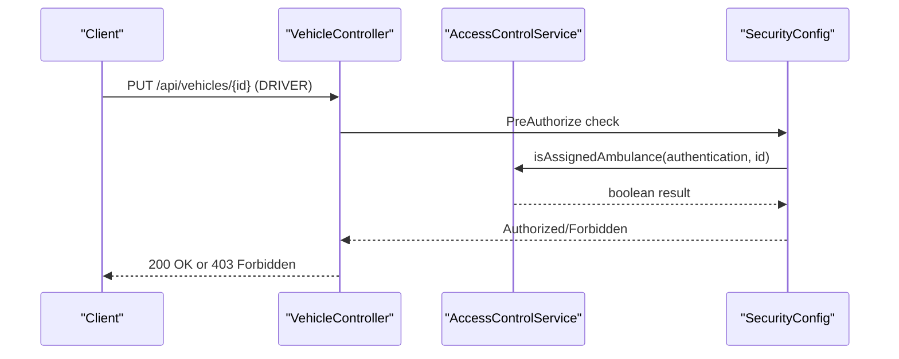
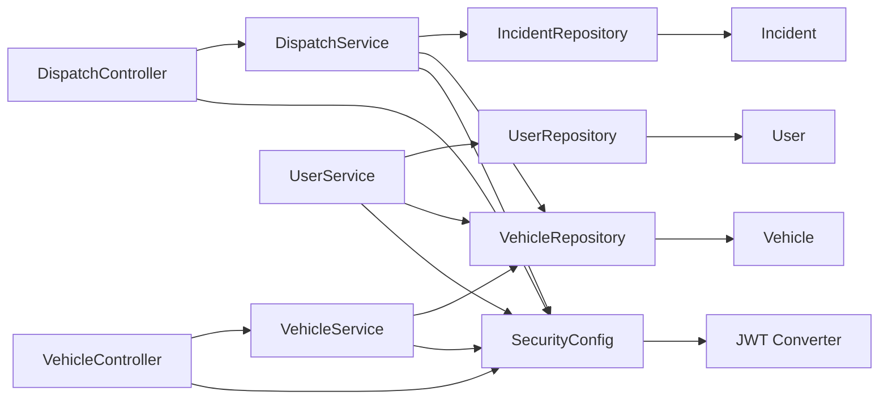

# Layered Architecture

<cite>
**Referenced Files in This Document**
- [DispatchController.java](file://src/main/java/com/example/ems_command_center/controller/DispatchController.java)
- [VehicleController.java](file://src/main/java/com/example/ems_command_center/controller/VehicleController.java)
- [DispatchService.java](file://src/main/java/com/example/ems_command_center/service/DispatchService.java)
- [VehicleService.java](file://src/main/java/com/example/ems_command_center/service/VehicleService.java)
- [UserService.java](file://src/main/java/com/example/ems_command_center/service/UserService.java)
- [AccessControlService.java](file://src/main/java/com/example/ems_command_center/service/AccessControlService.java)
- [IncidentRepository.java](file://src/main/java/com/example/ems_command_center/repository/IncidentRepository.java)
- [VehicleRepository.java](file://src/main/java/com/example/ems_command_center/repository/VehicleRepository.java)
- [UserRepository.java](file://src/main/java/com/example/ems_command_center/repository/UserRepository.java)
- [Incident.java](file://src/main/java/com/example/ems_command_center/model/Incident.java)
- [Vehicle.java](file://src/main/java/com/example/ems_command_center/model/Vehicle.java)
- [User.java](file://src/main/java/com/example/ems_command_center/model/User.java)
- [ApiExceptionHandler.java](file://src/main/java/com/example/ems_command_center/config/ApiExceptionHandler.java)
- [SecurityConfig.java](file://src/main/java/com/example/ems_command_center/config/SecurityConfig.java)
- [application.yml](file://src/main/resources/application.yml)
</cite>

## Table of Contents
1. [Introduction](#introduction)
2. [Project Structure](#project-structure)
3. [Core Components](#core-components)
4. [Architecture Overview](#architecture-overview)
5. [Detailed Component Analysis](#detailed-component-analysis)
6. [Dependency Analysis](#dependency-analysis)
7. [Performance Considerations](#performance-considerations)
8. [Troubleshooting Guide](#troubleshooting-guide)
9. [Conclusion](#conclusion)

## Introduction
This document explains the layered architecture implemented in the EMS Command Center backend. The system follows a clean separation of concerns across three layers:
- Presentation layer (controllers): Expose REST endpoints and handle HTTP requests/responses.
- Business logic layer (services): Enforce business rules, orchestrate workflows, and coordinate between repositories.
- Data access layer (repositories): Abstract MongoDB persistence operations via Spring Data MongoDB.

The implementation adheres to the Model-View-Controller (MVC) pattern at the presentation layer, with controllers delegating to services and services interacting with repositories. Authorization is enforced via method-level security annotations and a custom JWT converter. Error handling is centralized through a global exception handler.

## Project Structure
The project is organized by functional domains with clear separation of concerns:
- controller: REST controllers exposing HTTP endpoints for each domain (dispatch, vehicles, users, etc.).
- service: Business services implementing domain logic and orchestrating operations.
- repository: Spring Data MongoDB repositories for data access.
- model: MongoDB entity models and value objects.
- config: Security configuration, exception handling, and web socket configuration.



**Diagram sources**
- [DispatchController.java:22-56](file://src/main/java/com/example/ems_command_center/controller/DispatchController.java#L22-L56)
- [VehicleController.java:14-56](file://src/main/java/com/example/ems_command_center/controller/VehicleController.java#L14-L56)
- [DispatchService.java:21-38](file://src/main/java/com/example/ems_command_center/service/DispatchService.java#L21-L38)
- [VehicleService.java:15-26](file://src/main/java/com/example/ems_command_center/service/VehicleService.java#L15-L26)
- [UserService.java:13-21](file://src/main/java/com/example/ems_command_center/service/UserService.java#L13-L21)
- [AccessControlService.java:7-37](file://src/main/java/com/example/ems_command_center/service/AccessControlService.java#L7-L37)
- [IncidentRepository.java:9-13](file://src/main/java/com/example/ems_command_center/repository/IncidentRepository.java#L9-L13)
- [VehicleRepository.java:9-14](file://src/main/java/com/example/ems_command_center/repository/VehicleRepository.java#L9-L14)
- [UserRepository.java:8-14](file://src/main/java/com/example/ems_command_center/repository/UserRepository.java#L8-L14)
- [Incident.java:8-23](file://src/main/java/com/example/ems_command_center/model/Incident.java#L8-L23)
- [Vehicle.java:7-18](file://src/main/java/com/example/ems_command_center/model/Vehicle.java#L7-L18)
- [User.java:8-56](file://src/main/java/com/example/ems_command_center/model/User.java#L8-L56)

**Section sources**
- [DispatchController.java:1-57](file://src/main/java/com/example/ems_command_center/controller/DispatchController.java#L1-L57)
- [VehicleController.java:1-57](file://src/main/java/com/example/ems_command_center/controller/VehicleController.java#L1-L57)
- [DispatchService.java:1-214](file://src/main/java/com/example/ems_command_center/service/DispatchService.java#L1-L214)
- [VehicleService.java:1-112](file://src/main/java/com/example/ems_command_center/service/VehicleService.java#L1-L112)
- [UserService.java:1-103](file://src/main/java/com/example/ems_command_center/service/UserService.java#L1-L103)
- [AccessControlService.java:1-38](file://src/main/java/com/example/ems_command_center/service/AccessControlService.java#L1-L38)
- [IncidentRepository.java:1-14](file://src/main/java/com/example/ems_command_center/repository/IncidentRepository.java#L1-L14)
- [VehicleRepository.java:1-15](file://src/main/java/com/example/ems_command_center/repository/VehicleRepository.java#L1-L15)
- [UserRepository.java:1-15](file://src/main/java/com/example/ems_command_center/repository/UserRepository.java#L1-L15)
- [Incident.java:1-24](file://src/main/java/com/example/ems_command_center/model/Incident.java#L1-L24)
- [Vehicle.java:1-19](file://src/main/java/com/example/ems_command_center/model/Vehicle.java#L1-L19)
- [User.java:1-188](file://src/main/java/com/example/ems_command_center/model/User.java#L1-L188)

## Core Components
This section documents the primary components in each layer and their responsibilities.

- Presentation Layer (Controllers)
  - DispatchController: Exposes endpoints for listing available ambulances, previewing routes, and dispatching ambulances. It delegates to DispatchService and enforces role-based authorization.
  - VehicleController: Manages vehicle CRUD operations and exposes fleet queries. It delegates to VehicleService and enforces role-based authorization.

- Business Logic Layer (Services)
  - DispatchService: Orchestrates ambulance dispatch workflows, validates inputs, computes routes, updates vehicle/incident state, and publishes notifications.
  - VehicleService: Validates and normalizes vehicle records, supports CRUD operations, and enforces business rules for statuses and types.
  - UserService: Provides user management and driver/manager assignment lookup, integrating with repositories for user and vehicle data.
  - AccessControlService: Evaluates user assignments to ambulances and hospitals using JWT claims for fine-grained authorization checks.

- Data Access Layer (Repositories)
  - IncidentRepository: Extends MongoRepository for Incident entities with custom finder methods.
  - VehicleRepository: Extends MongoRepository for Vehicle entities with custom finder and counting methods.
  - UserRepository: Extends MongoRepository for User entities with custom finder methods.

- Models
  - Incident, Vehicle, User: MongoDB entity models mapped via annotations for collection storage and field indexing.

**Section sources**
- [DispatchController.java:22-56](file://src/main/java/com/example/ems_command_center/controller/DispatchController.java#L22-L56)
- [VehicleController.java:14-56](file://src/main/java/com/example/ems_command_center/controller/VehicleController.java#L14-L56)
- [DispatchService.java:21-38](file://src/main/java/com/example/ems_command_center/service/DispatchService.java#L21-L38)
- [VehicleService.java:15-26](file://src/main/java/com/example/ems_command_center/service/VehicleService.java#L15-L26)
- [UserService.java:13-21](file://src/main/java/com/example/ems_command_center/service/UserService.java#L13-L21)
- [AccessControlService.java:7-37](file://src/main/java/com/example/ems_command_center/service/AccessControlService.java#L7-L37)
- [IncidentRepository.java:9-13](file://src/main/java/com/example/ems_command_center/repository/IncidentRepository.java#L9-L13)
- [VehicleRepository.java:9-14](file://src/main/java/com/example/ems_command_center/repository/VehicleRepository.java#L9-L14)
- [UserRepository.java:8-14](file://src/main/java/com/example/ems_command_center/repository/UserRepository.java#L8-L14)
- [Incident.java:8-23](file://src/main/java/com/example/ems_command_center/model/Incident.java#L8-L23)
- [Vehicle.java:7-18](file://src/main/java/com/example/ems_command_center/model/Vehicle.java#L7-L18)
- [User.java:8-56](file://src/main/java/com/example/ems_command_center/model/User.java#L8-L56)

## Architecture Overview
The system follows a layered architecture with clear dependency flow:
- Controllers depend on Services.
- Services depend on Repositories.
- Repositories depend on MongoDB via Spring Data MongoDB.
- Security is configured globally and enforced via method-level annotations.



**Diagram sources**
- [DispatchController.java:22-56](file://src/main/java/com/example/ems_command_center/controller/DispatchController.java#L22-L56)
- [VehicleController.java:14-56](file://src/main/java/com/example/ems_command_center/controller/VehicleController.java#L14-L56)
- [DispatchService.java:21-38](file://src/main/java/com/example/ems_command_center/service/DispatchService.java#L21-L38)
- [VehicleService.java:15-26](file://src/main/java/com/example/ems_command_center/service/VehicleService.java#L15-L26)
- [SecurityConfig.java:26-98](file://src/main/java/com/example/ems_command_center/config/SecurityConfig.java#L26-L98)
- [application.yml:10-15](file://src/main/resources/application.yml#L10-L15)

## Detailed Component Analysis

### Dispatch Layer Orchestration
This component demonstrates the service layer orchestrating business rules and coordinating multiple repositories.



**Diagram sources**
- [DispatchController.java:33-55](file://src/main/java/com/example/ems_command_center/controller/DispatchController.java#L33-L55)
- [DispatchService.java:40-119](file://src/main/java/com/example/ems_command_center/service/DispatchService.java#L40-L119)
- [VehicleRepository.java:9-14](file://src/main/java/com/example/ems_command_center/repository/VehicleRepository.java#L9-L14)
- [IncidentRepository.java:9-13](file://src/main/java/com/example/ems_command_center/repository/IncidentRepository.java#L9-L13)

**Section sources**
- [DispatchController.java:22-56](file://src/main/java/com/example/ems_command_center/controller/DispatchController.java#L22-L56)
- [DispatchService.java:21-214](file://src/main/java/com/example/ems_command_center/service/DispatchService.java#L21-L214)
- [IncidentRepository.java:1-14](file://src/main/java/com/example/ems_command_center/repository/IncidentRepository.java#L1-L14)
- [VehicleRepository.java:1-15](file://src/main/java/com/example/ems_command_center/repository/VehicleRepository.java#L1-L15)

### Vehicle Management Validation
This component illustrates service-layer validation and normalization before persistence.



**Diagram sources**
- [VehicleService.java:70-106](file://src/main/java/com/example/ems_command_center/service/VehicleService.java#L70-L106)
- [VehicleRepository.java:9-14](file://src/main/java/com/example/ems_command_center/repository/VehicleRepository.java#L9-L14)

**Section sources**
- [VehicleService.java:15-112](file://src/main/java/com/example/ems_command_center/service/VehicleService.java#L15-L112)
- [VehicleRepository.java:1-15](file://src/main/java/com/example/ems_command_center/repository/VehicleRepository.java#L1-L15)

### Authorization and Access Control
This component shows how method-level security integrates with custom access control logic.



**Diagram sources**
- [VehicleController.java:39-46](file://src/main/java/com/example/ems_command_center/controller/VehicleController.java#L39-L46)
- [AccessControlService.java:27-36](file://src/main/java/com/example/ems_command_center/service/AccessControlService.java#L27-L36)
- [SecurityConfig.java:44-98](file://src/main/java/com/example/ems_command_center/config/SecurityConfig.java#L44-L98)

**Section sources**
- [VehicleController.java:14-56](file://src/main/java/com/example/ems_command_center/controller/VehicleController.java#L14-L56)
- [AccessControlService.java:1-38](file://src/main/java/com/example/ems_command_center/service/AccessControlService.java#L1-L38)
- [SecurityConfig.java:26-98](file://src/main/java/com/example/ems_command_center/config/SecurityConfig.java#L26-L98)

### Data Models Overview
The models define the persisted entities and their relationships.

```mermaid
erDiagram
INCIDENT {
string id PK
string title
string location
coords coordinates
string time
string type
list<string> tags
string status
int priority
}
VEHICLE {
string id PK
string name
string status
string type
coords location
list<string> crew
string lastUpdate
list<equipment> equipment
}
USER {
string id PK
string email UK
string keycloakId UK
string role
string ambulanceId
string hospitalId
}
USER ||--o{ INCIDENT : "reports"
USER ||--o{ VEHICLE : "assigned_to"
```

**Diagram sources**
- [Incident.java:8-23](file://src/main/java/com/example/ems_command_center/model/Incident.java#L8-L23)
- [Vehicle.java:7-18](file://src/main/java/com/example/ems_command_center/model/Vehicle.java#L7-L18)
- [User.java:8-56](file://src/main/java/com/example/ems_command_center/model/User.java#L8-L56)

**Section sources**
- [Incident.java:1-24](file://src/main/java/com/example/ems_command_center/model/Incident.java#L1-L24)
- [Vehicle.java:1-19](file://src/main/java/com/example/ems_command_center/model/Vehicle.java#L1-L19)
- [User.java:1-188](file://src/main/java/com/example/ems_command_center/model/User.java#L1-L188)

## Dependency Analysis
The dependency flow moves from controllers to services to repositories, with security configuration supporting method-level authorization.



**Diagram sources**
- [DispatchController.java:22-56](file://src/main/java/com/example/ems_command_center/controller/DispatchController.java#L22-L56)
- [VehicleController.java:14-56](file://src/main/java/com/example/ems_command_center/controller/VehicleController.java#L14-L56)
- [DispatchService.java:21-38](file://src/main/java/com/example/ems_command_center/service/DispatchService.java#L21-L38)
- [VehicleService.java:15-26](file://src/main/java/com/example/ems_command_center/service/VehicleService.java#L15-L26)
- [UserService.java:13-21](file://src/main/java/com/example/ems_command_center/service/UserService.java#L13-L21)
- [IncidentRepository.java:9-13](file://src/main/java/com/example/ems_command_center/repository/IncidentRepository.java#L9-L13)
- [VehicleRepository.java:9-14](file://src/main/java/com/example/ems_command_center/repository/VehicleRepository.java#L9-L14)
- [UserRepository.java:8-14](file://src/main/java/com/example/ems_command_center/repository/UserRepository.java#L8-L14)
- [SecurityConfig.java:26-98](file://src/main/java/com/example/ems_command_center/config/SecurityConfig.java#L26-L98)

**Section sources**
- [DispatchController.java:1-57](file://src/main/java/com/example/ems_command_center/controller/DispatchController.java#L1-L57)
- [VehicleController.java:1-57](file://src/main/java/com/example/ems_command_center/controller/VehicleController.java#L1-L57)
- [DispatchService.java:1-214](file://src/main/java/com/example/ems_command_center/service/DispatchService.java#L1-L214)
- [VehicleService.java:1-112](file://src/main/java/com/example/ems_command_center/service/VehicleService.java#L1-L112)
- [UserService.java:1-103](file://src/main/java/com/example/ems_command_center/service/UserService.java#L1-L103)
- [IncidentRepository.java:1-14](file://src/main/java/com/example/ems_command_center/repository/IncidentRepository.java#L1-L14)
- [VehicleRepository.java:1-15](file://src/main/java/com/example/ems_command_center/repository/VehicleRepository.java#L1-L15)
- [UserRepository.java:1-15](file://src/main/java/com/example/ems_command_center/repository/UserRepository.java#L1-L15)
- [SecurityConfig.java:1-156](file://src/main/java/com/example/ems_command_center/config/SecurityConfig.java#L1-L156)

## Performance Considerations
- Minimize round trips: Combine related reads/writes in services where possible to reduce repository calls.
- Use projection queries: Leverage repository methods to fetch only required fields for read-heavy endpoints.
- Indexing: Ensure frequently queried fields (e.g., user email, keycloakId, vehicle status/type) are indexed at the database level.
- Asynchronous notifications: Publishing to message topics should be lightweight; avoid heavy computation in notification handlers.
- Pagination: For large collections, implement pagination in controllers and repositories to limit payload sizes.

## Troubleshooting Guide
- Unauthorized Access
  - Symptom: 401 Unauthorized responses for protected endpoints.
  - Cause: Missing or invalid JWT bearer token.
  - Resolution: Verify the Authorization header and JWK set URI configuration.

- Forbidden Access
  - Symptom: 403 Forbidden responses after successful authentication.
  - Cause: Insufficient roles or failed access control checks.
  - Resolution: Confirm user roles and custom access control claims (e.g., ambulance_id, hospital_id).

- Validation Errors
  - Symptom: 400 Bad Request for vehicle or dispatch operations.
  - Cause: Missing or invalid fields violating service-level validations.
  - Resolution: Review validation messages returned by the service and adjust request payloads accordingly.

- Global Exception Handling
  - Centralized error responses are handled by a global exception handler that translates exceptions into structured JSON with timestamps and status codes.

**Section sources**
- [SecurityConfig.java:138-154](file://src/main/java/com/example/ems_command_center/config/SecurityConfig.java#L138-L154)
- [ApiExceptionHandler.java:13-26](file://src/main/java/com/example/ems_command_center/config/ApiExceptionHandler.java#L13-L26)
- [VehicleService.java:70-87](file://src/main/java/com/example/ems_command_center/service/VehicleService.java#L70-L87)
- [DispatchService.java:53-60](file://src/main/java/com/example/ems_command_center/service/DispatchService.java#L53-L60)

## Conclusion
The layered architecture cleanly separates concerns across presentation, business logic, and data access layers. Controllers delegate to services, which encapsulate business rules and coordinate repository interactions. Security is enforced at the method level with custom access control evaluation. The design supports scalability, maintainability, and clear error propagation through a centralized exception handler.