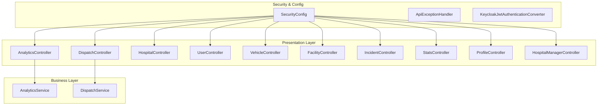
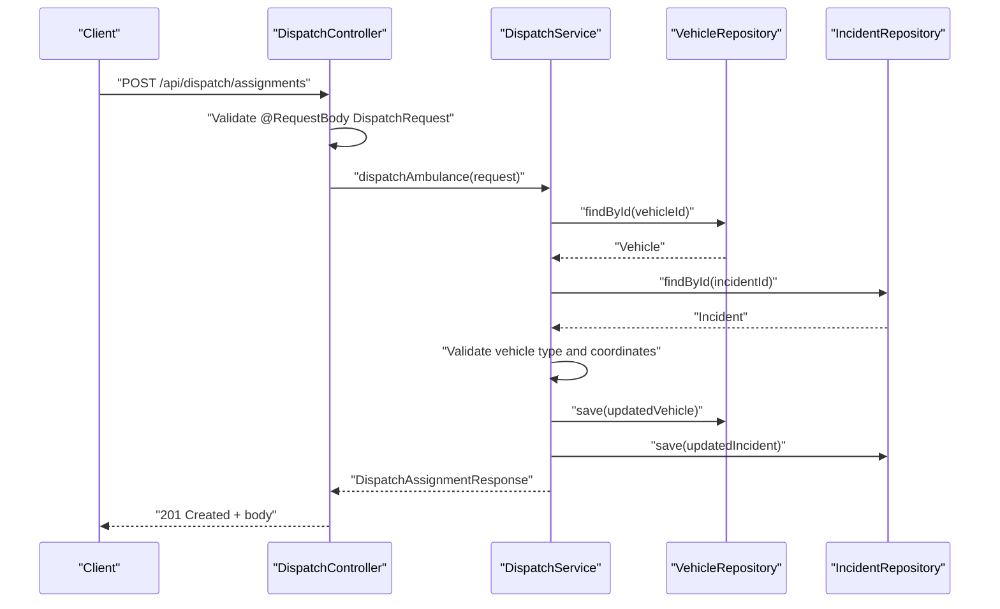
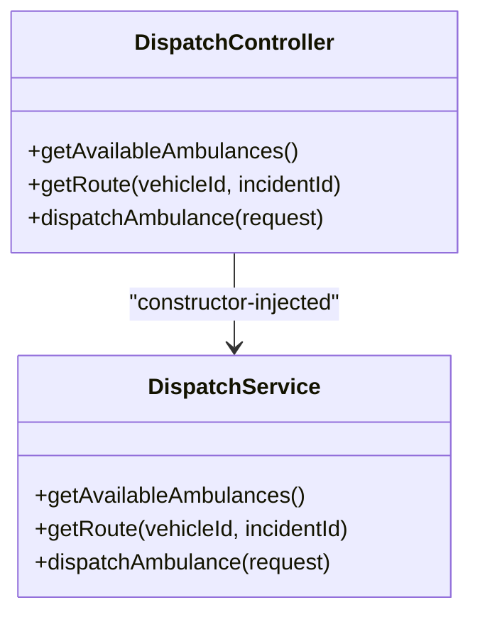
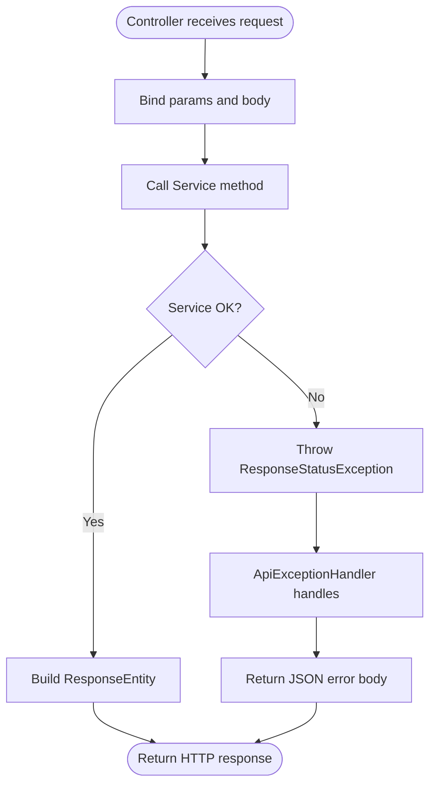
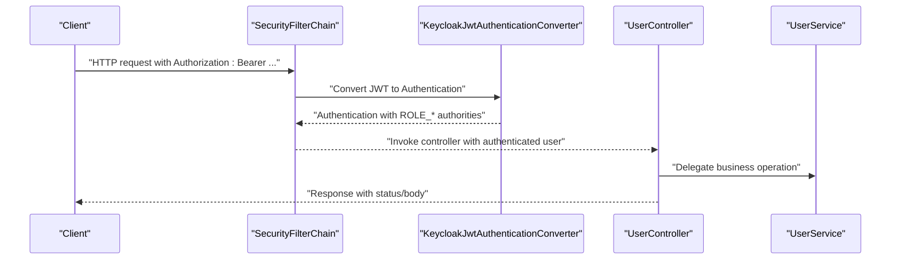
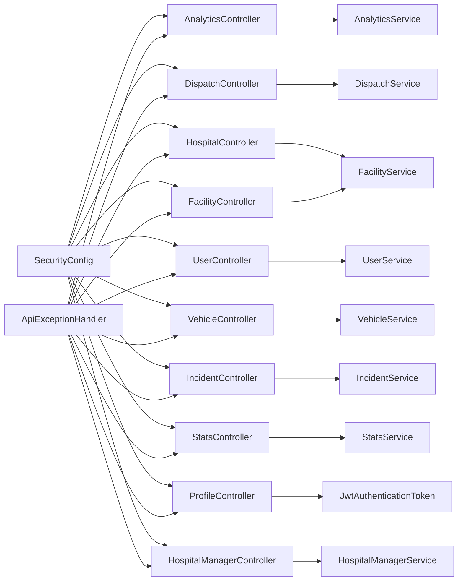

# Presentation Layer (Controllers)

<cite>
**Referenced Files in This Document**
- [EmsCommandCenterApplication.java](file://src/main/java/com/example/ems_command_center/EmsCommandCenterApplication.java)
- [SecurityConfig.java](file://src/main/java/com/example/ems_command_center/config/SecurityConfig.java)
- [ApiExceptionHandler.java](file://src/main/java/com/example/ems_command_center/config/ApiExceptionHandler.java)
- [KeycloakJwtAuthenticationConverter.java](file://src/main/java/com/example/ems_command_center/config/KeycloakJwtAuthenticationConverter.java)
- [AnalyticsController.java](file://src/main/java/com/example/ems_command_center/controller/AnalyticsController.java)
- [DispatchController.java](file://src/main/java/com/example/ems_command_center/controller/DispatchController.java)
- [HospitalController.java](file://src/main/java/com/example/ems_command_center/controller/HospitalController.java)
- [UserController.java](file://src/main/java/com/example/ems_command_center/controller/UserController.java)
- [VehicleController.java](file://src/main/java/com/example/ems_command_center/controller/VehicleController.java)
- [FacilityController.java](file://src/main/java/com/example/ems_command_center/controller/FacilityController.java)
- [IncidentController.java](file://src/main/java/com/example/ems_command_center/controller/IncidentController.java)
- [StatsController.java](file://src/main/java/com/example/ems_command_center/controller/StatsController.java)
- [ProfileController.java](file://src/main/java/com/example/ems_command_center/controller/ProfileController.java)
- [HospitalManagerController.java](file://src/main/java/com/example/ems_command_center/controller/HospitalManagerController.java)
- [AnalyticsService.java](file://src/main/java/com/example/ems_command_center/service/AnalyticsService.java)
- [DispatchService.java](file://src/main/java/com/example/ems_command_center/service/DispatchService.java)
- [application.yml](file://src/main/resources/application.yml)
</cite>

## Table of Contents
1. [Introduction](#introduction)
2. [Project Structure](#project-structure)
3. [Core Components](#core-components)
4. [Architecture Overview](#architecture-overview)
5. [Detailed Component Analysis](#detailed-component-analysis)
6. [Dependency Analysis](#dependency-analysis)
7. [Performance Considerations](#performance-considerations)
8. [Troubleshooting Guide](#troubleshooting-guide)
9. [Conclusion](#conclusion)
10. [Appendices](#appendices)

## Introduction
This document explains the presentation layer implementation using Spring MVC controllers in the EMS Command Center backend. It covers how REST controllers handle HTTP requests, map URLs to business operations, and manage request/response cycles. It documents controller responsibilities including request validation, parameter binding, response formatting, and exception handling. It also explains the controller-to-service dependency pattern, autowiring mechanisms, and Spring annotations usage. Typical controller methods, request/response mapping, error handling strategies, and testing approaches are included, along with integration with Spring Security.

## Project Structure
The application follows a layered architecture:
- Presentation layer: REST controllers under controller/
- Business layer: Services under service/
- Persistence layer: Repositories under repository/
- Configuration: Security, Swagger/OpenAPI, and JWT conversion under config/

**Diagram sources**
- [AnalyticsController.java:1-38](file://src/main/java/com/example/ems_command_center/controller/AnalyticsController.java#L1-L38)
- [DispatchController.java:1-57](file://src/main/java/com/example/ems_command_center/controller/DispatchController.java#L1-L57)
- [HospitalController.java:1-57](file://src/main/java/com/example/ems_command_center/controller/HospitalController.java#L1-L57)
- [UserController.java:1-92](file://src/main/java/com/example/ems_command_center/controller/UserController.java#L1-L92)
- [VehicleController.java:1-57](file://src/main/java/com/example/ems_command_center/controller/VehicleController.java#L1-L57)
- [FacilityController.java:1-31](file://src/main/java/com/example/ems_command_center/controller/FacilityController.java#L1-L31)
- [IncidentController.java:1-61](file://src/main/java/com/example/ems_command_center/controller/IncidentController.java#L1-L61)
- [StatsController.java:1-29](file://src/main/java/com/example/ems_command_center/controller/StatsController.java#L1-L29)
- [ProfileController.java:1-46](file://src/main/java/com/example/ems_command_center/controller/ProfileController.java#L1-L46)
- [HospitalManagerController.java:1-63](file://src/main/java/com/example/ems_command_center/controller/HospitalManagerController.java#L1-L63)
- [SecurityConfig.java:1-156](file://src/main/java/com/example/ems_command_center/config/SecurityConfig.java#L1-L156)
- [ApiExceptionHandler.java:1-27](file://src/main/java/com/example/ems_command_center/config/ApiExceptionHandler.java#L1-L27)
- [KeycloakJwtAuthenticationConverter.java:1-88](file://src/main/java/com/example/ems_command_center/config/KeycloakJwtAuthenticationConverter.java#L1-L88)

**Section sources**
- [EmsCommandCenterApplication.java:1-14](file://src/main/java/com/example/ems_command_center/EmsCommandCenterApplication.java#L1-L14)
- [application.yml:1-36](file://src/main/resources/application.yml#L1-L36)

## Core Components
- REST controllers: Define HTTP endpoints, bind parameters, enforce authorization, and return ResponseEntity<T>.
- Services: Encapsulate business logic, coordinate repositories, and handle domain-specific validations.
- Security configuration: OAuth2 Resource Server with JWT, method-level security, CORS, and JSON error handlers.
- Global exception handler: Standardized error responses for HTTP exceptions.

Key responsibilities per controller:
- Request validation: Parameter extraction via @RequestParam/@PathVariable/@RequestBody; method-level @PreAuthorize checks.
- Parameter binding: Automatic binding of request bodies and path/query parameters.
- Response formatting: Consistent use of ResponseEntity for status codes and structured payloads.
- Exception handling: Throws ResponseStatusException for business errors; global ApiExceptionHandler standardizes error JSON.

**Section sources**
- [AnalyticsController.java:1-38](file://src/main/java/com/example/ems_command_center/controller/AnalyticsController.java#L1-L38)
- [DispatchController.java:1-57](file://src/main/java/com/example/ems_command_center/controller/DispatchController.java#L1-L57)
- [HospitalController.java:1-57](file://src/main/java/com/example/ems_command_center/controller/HospitalController.java#L1-L57)
- [UserController.java:1-92](file://src/main/java/com/example/ems_command_center/controller/UserController.java#L1-L92)
- [VehicleController.java:1-57](file://src/main/java/com/example/ems_command_center/controller/VehicleController.java#L1-L57)
- [FacilityController.java:1-31](file://src/main/java/com/example/ems_command_center/controller/FacilityController.java#L1-L31)
- [IncidentController.java:1-61](file://src/main/java/com/example/ems_command_center/controller/IncidentController.java#L1-L61)
- [StatsController.java:1-29](file://src/main/java/com/example/ems_command_center/controller/StatsController.java#L1-L29)
- [ProfileController.java:1-46](file://src/main/java/com/example/ems_command_center/controller/ProfileController.java#L1-L46)
- [ApiExceptionHandler.java:1-27](file://src/main/java/com/example/ems_command_center/config/ApiExceptionHandler.java#L1-L27)

## Architecture Overview
The presentation layer integrates tightly with Spring Security and delegates business logic to services. Controllers expose REST endpoints under /api/*, apply method-level authorization, and return standardized responses. SecurityConfig enforces OAuth2 JWT-based authentication and role-based access control. A global exception handler ensures consistent error responses.

**Diagram sources**
- [DispatchController.java:50-55](file://src/main/java/com/example/ems_command_center/controller/DispatchController.java#L50-L55)
- [DispatchService.java:53-119](file://src/main/java/com/example/ems_command_center/service/DispatchService.java#L53-L119)

**Section sources**
- [SecurityConfig.java:44-98](file://src/main/java/com/example/ems_command_center/config/SecurityConfig.java#L44-L98)
- [KeycloakJwtAuthenticationConverter.java:28-41](file://src/main/java/com/example/ems_command_center/config/KeycloakJwtAuthenticationConverter.java#L28-L41)

## Detailed Component Analysis

### Controller Responsibilities and Patterns
- Annotation-driven mapping: @RestController, @RequestMapping, @GetMapping, @PostMapping, @PutMapping, @DeleteMapping, @PathVariable, @RequestParam, @RequestBody.
- Authorization: @PreAuthorize expressions evaluate roles and dynamic checks (e.g., driver self-assignment).
- Response handling: ResponseEntity for explicit status codes and bodies; optional-return patterns for 404 scenarios.
- Parameter binding: Automatic conversion of JSON bodies and query/path parameters; explicit validation via service layer.

Examples of typical controller methods:
- GET /api/analytics/dispatch → returns aggregated dispatch volume.
- GET /api/dispatch/routes → returns suggested route for an ambulance to an incident.
- POST /api/dispatch/assignments → dispatches an ambulance and returns assignment details.
- GET /api/users/me → returns the authenticated user’s profile using JWT subject.
- PUT /api/vehicles/{id} → updates vehicle with role-based access and driver self-assignment guard.

**Section sources**
- [AnalyticsController.java:24-36](file://src/main/java/com/example/ems_command_center/controller/AnalyticsController.java#L24-L36)
- [DispatchController.java:33-55](file://src/main/java/com/example/ems_command_center/controller/DispatchController.java#L33-L55)
- [UserController.java:72-90](file://src/main/java/com/example/ems_command_center/controller/UserController.java#L72-L90)
- [VehicleController.java:39-46](file://src/main/java/com/example/ems_command_center/controller/VehicleController.java#L39-L46)

### Controller-to-Service Dependency Pattern
Controllers depend on services via constructor injection, promoting immutability and testability. Services encapsulate business logic and interact with repositories. Example:
- DispatchController depends on DispatchService.
- AnalyticsController depends on AnalyticsService.

**Diagram sources**
- [DispatchController.java:22-31](file://src/main/java/com/example/ems_command_center/controller/DispatchController.java#L22-L31)
- [DispatchService.java:21-38](file://src/main/java/com/example/ems_command_center/service/DispatchService.java#L21-L38)

**Section sources**
- [AnalyticsController.java:18-22](file://src/main/java/com/example/ems_command_center/controller/AnalyticsController.java#L18-L22)
- [AnalyticsService.java:19-31](file://src/main/java/com/example/ems_command_center/service/AnalyticsService.java#L19-L31)

### Request Validation and Parameter Binding
- Path and query parameters: @PathVariable and @RequestParam bind identifiers and filters.
- Request bodies: @RequestBody binds JSON payloads to DTO/model objects.
- Validation: Controllers rely on service-layer validation and exceptions; minimal duplication in controllers.

Example validations:
- Dispatch assignments require incidentId and vehicleId; otherwise 400.
- Route calculation requires valid coordinates; otherwise 400.
- Vehicle type must be "ambulance"; otherwise 400.

**Section sources**
- [DispatchController.java:43-48](file://src/main/java/com/example/ems_command_center/controller/DispatchController.java#L43-L48)
- [DispatchService.java:53-67](file://src/main/java/com/example/ems_command_center/service/DispatchService.java#L53-L67)
- [DispatchService.java:121-135](file://src/main/java/com/example/ems_command_center/service/DispatchService.java#L121-L135)

### Response Formatting and Status Codes
- Standardized ResponseEntity usage: ok(), created(), noContent(), notFound().
- Explicit status codes via ResponseEntity.status(...).body(...).
- Optional-return patterns return 200 with data or 404 when absent.

**Section sources**
- [HospitalController.java:42-55](file://src/main/java/com/example/ems_command_center/controller/HospitalController.java#L42-L55)
- [VehicleController.java:42-55](file://src/main/java/com/example/ems_command_center/controller/VehicleController.java#L42-L55)

### Exception Handling Strategies
- Service layer throws ResponseStatusException with appropriate HTTP status and message.
- Global ApiExceptionHandler maps ResponseStatusException to a consistent JSON error body with timestamp, status, error, and message.
- SecurityConfig defines JSON entry points for 401/403.

**Diagram sources**
- [ApiExceptionHandler.java:16-25](file://src/main/java/com/example/ems_command_center/config/ApiExceptionHandler.java#L16-L25)
- [DispatchService.java:121-129](file://src/main/java/com/example/ems_command_center/service/DispatchService.java#L121-L129)

**Section sources**
- [ApiExceptionHandler.java:1-27](file://src/main/java/com/example/ems_command_center/config/ApiExceptionHandler.java#L1-L27)
- [SecurityConfig.java:138-154](file://src/main/java/com/example/ems_command_center/config/SecurityConfig.java#L138-L154)

### Spring Security Integration
- OAuth2 Resource Server with JWT: SecurityConfig configures bearer JWT authentication and converts Keycloak scopes/roles to Spring authorities.
- Method-level security: @PreAuthorize on controllers enforces role-based access per endpoint.
- CORS: Permissive configuration for local development origins.
- OpenAPI/Swagger: Security scheme configured for bearer JWT.

**Diagram sources**
- [SecurityConfig.java:93-95](file://src/main/java/com/example/ems_command_center/config/SecurityConfig.java#L93-L95)
- [KeycloakJwtAuthenticationConverter.java:28-41](file://src/main/java/com/example/ems_command_center/config/KeycloakJwtAuthenticationConverter.java#L28-L41)
- [UserController.java:76-80](file://src/main/java/com/example/ems_command_center/controller/UserController.java#L76-L80)

**Section sources**
- [SecurityConfig.java:100-103](file://src/main/java/com/example/ems_command_center/config/SecurityConfig.java#L100-L103)
- [application.yml:10-17](file://src/main/resources/application.yml#L10-L17)

### Controller Testing Approaches
Recommended strategies:
- Unit tests for controllers: Mock services, assert ResponseEntity status and body; verify @PreAuthorize effects via MockMvc with proper JWT.
- Integration tests: Test end-to-end flows with embedded MongoDB and Spring Security configuration.
- Contract tests: Validate request/response schemas using OpenAPI/Swagger definitions.

[No sources needed since this section provides general guidance]

## Dependency Analysis
Controllers depend on services; services depend on repositories. Security configuration applies globally to all controllers. The global exception handler centralizes error responses.

**Diagram sources**
- [AnalyticsController.java:1-38](file://src/main/java/com/example/ems_command_center/controller/AnalyticsController.java#L1-L38)
- [DispatchController.java:1-57](file://src/main/java/com/example/ems_command_center/controller/DispatchController.java#L1-L57)
- [HospitalController.java:1-57](file://src/main/java/com/example/ems_command_center/controller/HospitalController.java#L1-L57)
- [UserController.java:1-92](file://src/main/java/com/example/ems_command_center/controller/UserController.java#L1-L92)
- [VehicleController.java:1-57](file://src/main/java/com/example/ems_command_center/controller/VehicleController.java#L1-L57)
- [FacilityController.java:1-31](file://src/main/java/com/example/ems_command_center/controller/FacilityController.java#L1-L31)
- [IncidentController.java:1-61](file://src/main/java/com/example/ems_command_center/controller/IncidentController.java#L1-L61)
- [StatsController.java:1-29](file://src/main/java/com/example/ems_command_center/controller/StatsController.java#L1-L29)
- [ProfileController.java:1-46](file://src/main/java/com/example/ems_command_center/controller/ProfileController.java#L1-L46)
- [SecurityConfig.java:1-156](file://src/main/java/com/example/ems_command_center/config/SecurityConfig.java#L1-L156)
- [ApiExceptionHandler.java:1-27](file://src/main/java/com/example/ems_command_center/config/ApiExceptionHandler.java#L1-L27)

**Section sources**
- [AnalyticsService.java:1-159](file://src/main/java/com/example/ems_command_center/service/AnalyticsService.java#L1-L159)
- [DispatchService.java:1-214](file://src/main/java/com/example/ems_command_center/service/DispatchService.java#L1-L214)

## Performance Considerations
- Minimize heavy computations in controllers; delegate to services.
- Use pagination and filtering in controllers where applicable to reduce payload sizes.
- Leverage caching strategies at the service/repository layer for frequently accessed data.
- Keep controllers thin and focused on request/response concerns.

[No sources needed since this section provides general guidance]

## Troubleshooting Guide
Common issues and resolutions:
- 401 Unauthorized: Verify Authorization header contains a valid JWT issued by Keycloak; check JWK set URI configuration.
- 403 Forbidden: Confirm user roles match endpoint requirements; review @PreAuthorize expressions.
- 404 Not Found: Ensure resource identifiers are correct; services throw 404 for missing entities.
- 400 Bad Request: Validate request bodies and required parameters; services validate presence and format.

**Section sources**
- [SecurityConfig.java:138-154](file://src/main/java/com/example/ems_command_center/config/SecurityConfig.java#L138-L154)
- [ApiExceptionHandler.java:16-25](file://src/main/java/com/example/ems_command_center/config/ApiExceptionHandler.java#L16-L25)
- [DispatchService.java:53-67](file://src/main/java/com/example/ems_command_center/service/DispatchService.java#L53-L67)

## Conclusion
The presentation layer uses Spring MVC controllers to expose REST APIs with clear separation of concerns. Controllers focus on mapping HTTP requests to business operations, enforcing authorization, and formatting responses. Services encapsulate business logic and validations, while Spring Security and a global exception handler ensure secure and consistent error handling. This design supports maintainability, testability, and scalability.

## Appendices

### Endpoint Reference by Controller
- AnalyticsController
  - GET /api/analytics/dispatch → @PreAuthorize("hasAnyRole('ADMIN', 'MANAGER')")
  - GET /api/analytics/response → @PreAuthorize("hasAnyRole('ADMIN', 'MANAGER')")

- DispatchController
  - GET /api/dispatch/ambulances/available → @PreAuthorize("hasAnyRole('ADMIN', 'MANAGER', 'DRIVER')")
  - GET /api/dispatch/routes → @PreAuthorize("hasAnyRole('ADMIN', 'MANAGER') or (hasRole('DRIVER') and @accessControlService.isAssignedAmbulance(...))")
  - POST /api/dispatch/assignments → @PreAuthorize("hasAnyRole('ADMIN', 'MANAGER')")

- HospitalController
  - GET /api/hospitals → @PreAuthorize("hasAnyRole('ADMIN', 'MANAGER', 'DRIVER', 'USER')")
  - POST /api/hospitals → @PreAuthorize("hasAnyRole('ADMIN', 'MANAGER')")
  - PUT /api/hospitals/{id} → @PreAuthorize("hasAnyRole('ADMIN', 'MANAGER')")
  - DELETE /api/hospitals/{id} → @PreAuthorize("hasRole('ADMIN')")

- UserController
  - GET /api/users → @PreAuthorize("hasAnyRole('ADMIN', 'MANAGER')")
  - GET /api/users/{id} → @PreAuthorize("hasAnyRole('ADMIN', 'MANAGER')")
  - GET /api/users/role/{role} → @PreAuthorize("hasAnyRole('ADMIN', 'MANAGER')")
  - POST /api/users → @PreAuthorize("hasRole('ADMIN')") with @ResponseStatus(CREATED)
  - PUT /api/users/{id} → @PreAuthorize("hasRole('ADMIN')")
  - DELETE /api/users/{id} → @PreAuthorize("hasRole('ADMIN')") with @ResponseStatus(NO_CONTENT)
  - GET /api/users/me → @PreAuthorize("isAuthenticated()") using JWT subject
  - GET /api/users/me/assignment → @PreAuthorize("hasRole('DRIVER')")

- VehicleController
  - GET /api/vehicles → @PreAuthorize("hasAnyRole('ADMIN', 'MANAGER', 'DRIVER')")
  - POST /api/vehicles → @PreAuthorize("hasAnyRole('ADMIN', 'MANAGER')")
  - PUT /api/vehicles/{id} → @PreAuthorize("hasAnyRole('ADMIN', 'MANAGER') or (hasRole('DRIVER') and @accessControlService.isAssignedAmbulance(...))")
  - DELETE /api/vehicles/{id} → @PreAuthorize("hasRole('ADMIN')")

- FacilityController
  - GET /api/facilities → @PreAuthorize("hasAnyRole('ADMIN', 'MANAGER', 'DRIVER', 'USER')")

- IncidentController
  - GET /api/incidents → @PreAuthorize("hasAnyRole('ADMIN', 'MANAGER', 'USER', 'DRIVER')")
  - GET /api/incidents/by-id/{id} → @PreAuthorize("hasAnyRole('ADMIN', 'MANAGER', 'USER', 'DRIVER')")
  - POST /api/incidents → @PreAuthorize("hasAnyRole('ADMIN', 'MANAGER', 'USER', 'DRIVER')") with @ResponseStatus(CREATED)
  - PUT /api/incidents/{id} → @PreAuthorize("hasAnyRole('ADMIN', 'MANAGER')")
  - DELETE /api/incidents/{id} → @PreAuthorize("hasAnyRole('ADMIN', 'MANAGER')")

- StatsController
  - GET /api/stats → @PreAuthorize("hasAnyRole('ADMIN', 'MANAGER', 'DRIVER', 'USER')")

- ProfileController
  - GET /api/profile → @PreAuthorize("isAuthenticated()")

- HospitalManagerController
  - GET /api/hospital-manager/overview → @PreAuthorize("hasAnyRole('ADMIN', 'MANAGER')")
  - PUT /api/hospital-manager/patients/{id} → @PreAuthorize("hasAnyRole('ADMIN', 'MANAGER')")
  - PUT /api/hospital-manager/beds/{id} → @PreAuthorize("hasAnyRole('ADMIN', 'MANAGER')")
  - PUT /api/hospital-manager/resources/{id} → @PreAuthorize("hasAnyRole('ADMIN', 'MANAGER')")
  - POST /api/hospital-manager/patients/{id}/validate-care → @PreAuthorize("hasAnyRole('ADMIN', 'MANAGER')")

**Section sources**
- [AnalyticsController.java:24-36](file://src/main/java/com/example/ems_command_center/controller/AnalyticsController.java#L24-L36)
- [DispatchController.java:33-55](file://src/main/java/com/example/ems_command_center/controller/DispatchController.java#L33-L55)
- [HospitalController.java:25-55](file://src/main/java/com/example/ems_command_center/controller/HospitalController.java#L25-L55)
- [UserController.java:28-90](file://src/main/java/com/example/ems_command_center/controller/UserController.java#L28-L90)
- [VehicleController.java:25-55](file://src/main/java/com/example/ems_command_center/controller/VehicleController.java#L25-L55)
- [FacilityController.java:24-29](file://src/main/java/com/example/ems_command_center/controller/FacilityController.java#L24-L29)
- [IncidentController.java:25-59](file://src/main/java/com/example/ems_command_center/controller/IncidentController.java#L25-L59)
- [StatsController.java:22-27](file://src/main/java/com/example/ems_command_center/controller/StatsController.java#L22-L27)
- [ProfileController.java:22-44](file://src/main/java/com/example/ems_command_center/controller/ProfileController.java#L22-L44)
- [HospitalManagerController.java:27-61](file://src/main/java/com/example/ems_command_center/controller/HospitalManagerController.java#L27-L61)