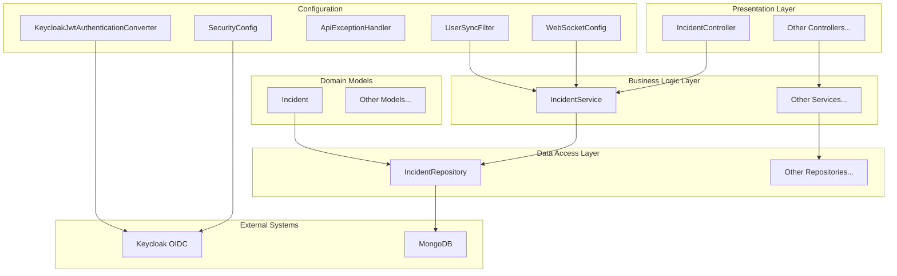
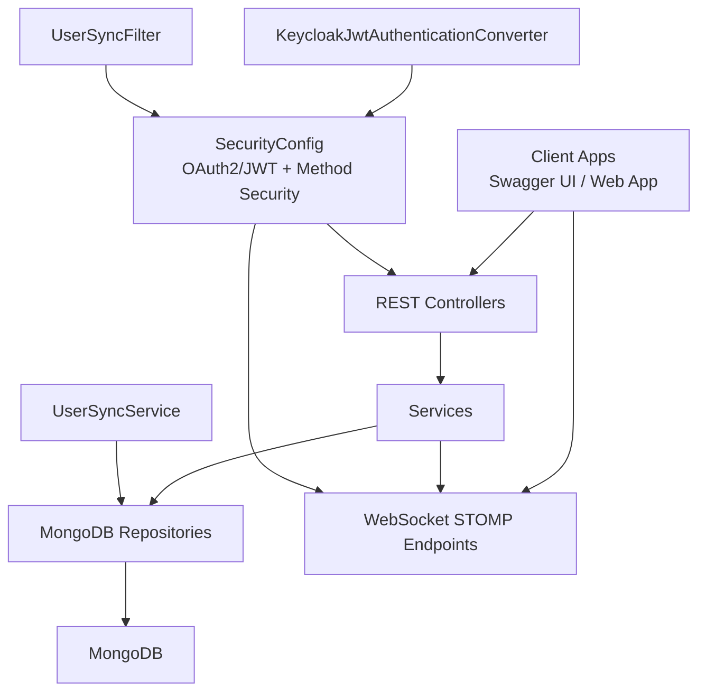
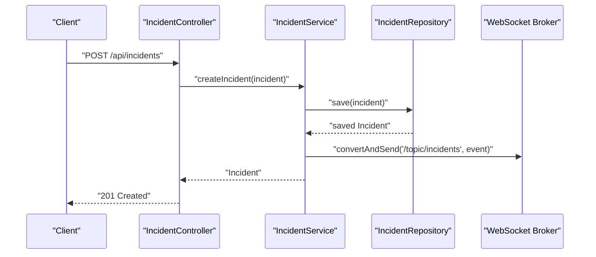
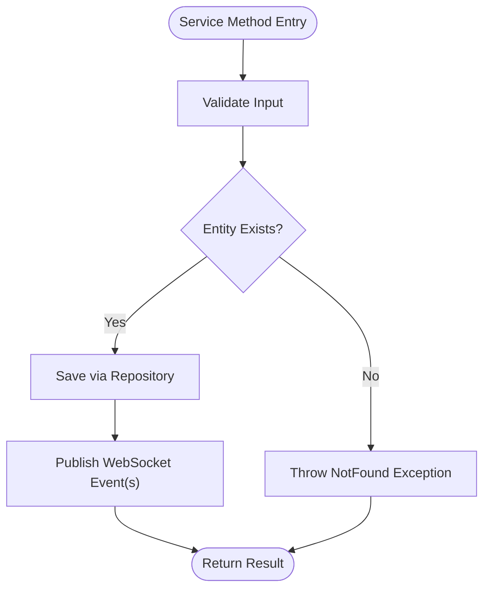
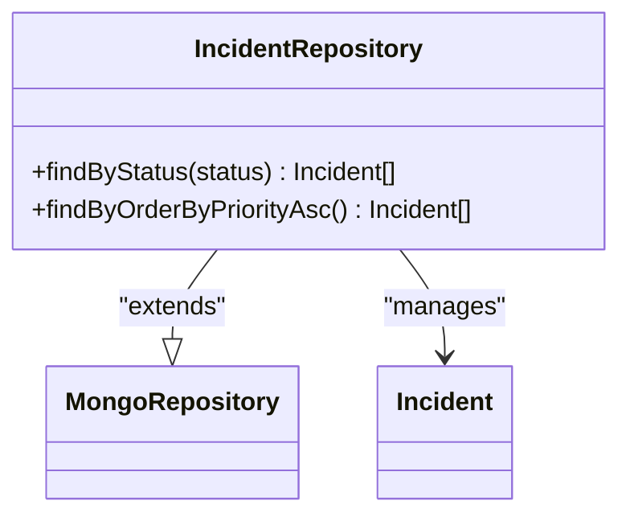
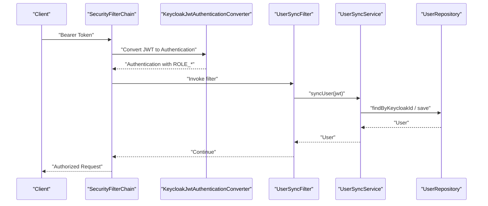
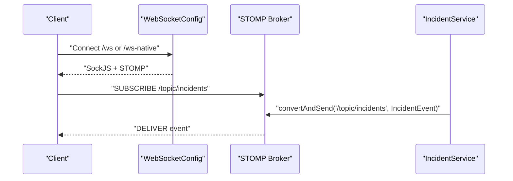
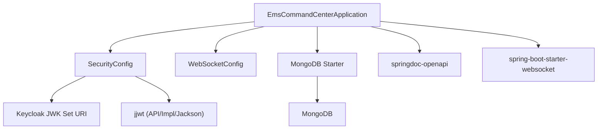

# System Architecture

<cite>
**Referenced Files in This Document**
- [EmsCommandCenterApplication.java](file://src/main/java/com/example/ems_command_center/EmsCommandCenterApplication.java)
- [application.yml](file://src/main/resources/application.yml)
- [pom.xml](file://pom.xml)
- [SecurityConfig.java](file://src/main/java/com/example/ems_command_center/config/SecurityConfig.java)
- [WebSocketConfig.java](file://src/main/java/com/example/ems_command_center/config/WebSocketConfig.java)
- [ApiExceptionHandler.java](file://src/main/java/com/example/ems_command_center/config/ApiExceptionHandler.java)
- [UserSyncFilter.java](file://src/main/java/com/example/ems_command_center/config/UserSyncFilter.java)
- [KeycloakJwtAuthenticationConverter.java](file://src/main/java/com/example/ems_command_center/config/KeycloakJwtAuthenticationConverter.java)
- [IncidentController.java](file://src/main/java/com/example/ems_command_center/controller/IncidentController.java)
- [IncidentService.java](file://src/main/java/com/example/ems_command_center/service/IncidentService.java)
- [IncidentRepository.java](file://src/main/java/com/example/ems_command_center/repository/IncidentRepository.java)
- [Incident.java](file://src/main/java/com/example/ems_command_center/model/Incident.java)
- [UserSyncService.java](file://src/main/java/com/example/ems_command_center/service/UserSyncService.java)
- [docker-compose.yml](file://docker-compose.yml)
- [Dockerfile](file://Dockerfile)
</cite>

## Table of Contents
1. [Introduction](#introduction)
2. [Project Structure](#project-structure)
3. [Core Components](#core-components)
4. [Architecture Overview](#architecture-overview)
5. [Detailed Component Analysis](#detailed-component-analysis)
6. [Dependency Analysis](#dependency-analysis)
7. [Performance Considerations](#performance-considerations)
8. [Troubleshooting Guide](#troubleshooting-guide)
9. [Conclusion](#conclusion)
10. [Appendices](#appendices)

## Introduction
This document describes the architecture of the EMS Command Center backend built with Spring Boot. The system follows a layered architecture separating presentation (controllers), business logic (services), and data access (MongoDB repositories). It integrates OAuth 2.0/OIDC via Keycloak for authentication and authorization, exposes REST APIs with OpenAPI/Swagger, and supports real-time communication through WebSocket STOMP endpoints. Cross-cutting concerns include centralized exception handling, security configuration, CORS, and JWT-to-role conversion tailored for Keycloak.

## Project Structure
The backend is organized by functional layers and packages:
- Presentation layer: controllers under controller/
- Business logic layer: services under service/
- Data access layer: repositories under repository/
- Supporting configuration: config/
- Domain models: model/
- Application bootstrap: EmsCommandCenterApplication.java
- Configuration: application.yml
- Dependencies: pom.xml
- Containerization: docker-compose.yml, Dockerfile

**Diagram sources**
- [IncidentController.java:1-61](file://src/main/java/com/example/ems_command_center/controller/IncidentController.java#L1-L61)
- [IncidentService.java:1-106](file://src/main/java/com/example/ems_command_center/service/IncidentService.java#L1-L106)
- [IncidentRepository.java:1-14](file://src/main/java/com/example/ems_command_center/repository/IncidentRepository.java#L1-L14)
- [Incident.java:1-24](file://src/main/java/com/example/ems_command_center/model/Incident.java#L1-L24)
- [SecurityConfig.java:1-156](file://src/main/java/com/example/ems_command_center/config/SecurityConfig.java#L1-L156)
- [WebSocketConfig.java:1-51](file://src/main/java/com/example/ems_command_center/config/WebSocketConfig.java#L1-L51)
- [ApiExceptionHandler.java:1-27](file://src/main/java/com/example/ems_command_center/config/ApiExceptionHandler.java#L1-L27)
- [UserSyncFilter.java:1-51](file://src/main/java/com/example/ems_command_center/config/UserSyncFilter.java#L1-L51)
- [KeycloakJwtAuthenticationConverter.java:1-88](file://src/main/java/com/example/ems_command_center/config/KeycloakJwtAuthenticationConverter.java#L1-L88)

**Section sources**
- [EmsCommandCenterApplication.java:1-14](file://src/main/java/com/example/ems_command_center/EmsCommandCenterApplication.java#L1-L14)
- [application.yml:1-36](file://src/main/resources/application.yml#L1-L36)
- [pom.xml:1-103](file://pom.xml#L1-L103)

## Core Components
- Spring Boot application entry point initializes the runtime and component scanning.
- Security configuration enables stateless OAuth 2.0 Resource Server with JWT, method security, CORS, and JSON-formatted authentication/authorization error responses.
- WebSocket configuration enables STOMP overSockJS endpoints with a dedicated inbound channel interceptor for security.
- Centralized exception handler standardizes error responses for REST controllers.
- User synchronization filter extracts claims from JWT and synchronizes user records in MongoDB.
- Keycloak-specific JWT converter maps realm/client roles to Spring Security authorities.
- MVC controllers expose REST endpoints for incident management and delegate to services.
- Services encapsulate domain logic, orchestrate repository operations, and publish real-time events.
- MongoDB repositories provide CRUD and query methods for domain entities.

**Section sources**
- [EmsCommandCenterApplication.java:1-14](file://src/main/java/com/example/ems_command_center/EmsCommandCenterApplication.java#L1-L14)
- [SecurityConfig.java:1-156](file://src/main/java/com/example/ems_command_center/config/SecurityConfig.java#L1-L156)
- [WebSocketConfig.java:1-51](file://src/main/java/com/example/ems_command_center/config/WebSocketConfig.java#L1-L51)
- [ApiExceptionHandler.java:1-27](file://src/main/java/com/example/ems_command_center/config/ApiExceptionHandler.java#L1-L27)
- [UserSyncFilter.java:1-51](file://src/main/java/com/example/ems_command_center/config/UserSyncFilter.java#L1-L51)
- [KeycloakJwtAuthenticationConverter.java:1-88](file://src/main/java/com/example/ems_command_center/config/KeycloakJwtAuthenticationConverter.java#L1-L88)
- [IncidentController.java:1-61](file://src/main/java/com/example/ems_command_center/controller/IncidentController.java#L1-L61)
- [IncidentService.java:1-106](file://src/main/java/com/example/ems_command_center/service/IncidentService.java#L1-L106)
- [IncidentRepository.java:1-14](file://src/main/java/com/example/ems_command_center/repository/IncidentRepository.java#L1-L14)

## Architecture Overview
The system adheres to layered architecture:
- Presentation: REST controllers annotated with @RestController and @RequestMapping define API endpoints.
- Business: Services annotated with @Service implement use-case logic, coordinate repositories, and publish WebSocket events.
- Persistence: MongoDB repositories extend MongoRepository to access the incidents collection and others.
- Security: OAuth 2.0 Resource Server validates JWTs issued by Keycloak; method security enforces role-based access; filters synchronize user profiles.
- Real-time: STOMP endpoints broadcast incident updates to subscribed clients.

**Diagram sources**
- [SecurityConfig.java:1-156](file://src/main/java/com/example/ems_command_center/config/SecurityConfig.java#L1-L156)
- [WebSocketConfig.java:1-51](file://src/main/java/com/example/ems_command_center/config/WebSocketConfig.java#L1-L51)
- [KeycloakJwtAuthenticationConverter.java:1-88](file://src/main/java/com/example/ems_command_center/config/KeycloakJwtAuthenticationConverter.java#L1-L88)
- [UserSyncFilter.java:1-51](file://src/main/java/com/example/ems_command_center/config/UserSyncFilter.java#L1-L51)
- [UserSyncService.java:1-122](file://src/main/java/com/example/ems_command_center/service/UserSyncService.java#L1-L122)
- [IncidentController.java:1-61](file://src/main/java/com/example/ems_command_center/controller/IncidentController.java#L1-L61)
- [IncidentService.java:1-106](file://src/main/java/com/example/ems_command_center/service/IncidentService.java#L1-L106)
- [IncidentRepository.java:1-14](file://src/main/java/com/example/ems_command_center/repository/IncidentRepository.java#L1-L14)

## Detailed Component Analysis

### Presentation Layer (Controllers)
- Controllers define REST endpoints under /api/* and apply @PreAuthorize annotations to enforce role-based access.
- Example: IncidentController exposes GET, POST, PUT, DELETE endpoints for incidents and delegates to IncidentService.

**Diagram sources**
- [IncidentController.java:1-61](file://src/main/java/com/example/ems_command_center/controller/IncidentController.java#L1-L61)
- [IncidentService.java:1-106](file://src/main/java/com/example/ems_command_center/service/IncidentService.java#L1-L106)
- [IncidentRepository.java:1-14](file://src/main/java/com/example/ems_command_center/repository/IncidentRepository.java#L1-L14)

**Section sources**
- [IncidentController.java:1-61](file://src/main/java/com/example/ems_command_center/controller/IncidentController.java#L1-L61)

### Business Logic Layer (Services)
- Services encapsulate domain operations, handle exceptions, and publish real-time updates.
- IncidentService orchestrates creation/update/deletion, enriches timestamps, publishes events to general and manager-scoped topics.

**Diagram sources**
- [IncidentService.java:1-106](file://src/main/java/com/example/ems_command_center/service/IncidentService.java#L1-L106)

**Section sources**
- [IncidentService.java:1-106](file://src/main/java/com/example/ems_command_center/service/IncidentService.java#L1-L106)

### Data Access Layer (Repositories)
- Repositories extend MongoRepository and define custom queries for filtering and sorting.
- IncidentRepository provides findByStatus and findByOrderByPriorityAsc.

**Diagram sources**
- [IncidentRepository.java:1-14](file://src/main/java/com/example/ems_command_center/repository/IncidentRepository.java#L1-L14)
- [Incident.java:1-24](file://src/main/java/com/example/ems_command_center/model/Incident.java#L1-L24)

**Section sources**
- [IncidentRepository.java:1-14](file://src/main/java/com/example/ems_command_center/repository/IncidentRepository.java#L1-L14)
- [Incident.java:1-24](file://src/main/java/com/example/ems_command_center/model/Incident.java#L1-L24)

### Security Integration (Keycloak)
- SecurityConfig configures OAuth 2.0 Resource Server with JWT, sets up method security, CORS, and JSON error handlers.
- KeycloakJwtAuthenticationConverter maps realm_access and resource_access roles to ROLE_* authorities.
- UserSyncFilter intercepts requests after JWT authentication to synchronize user profile in MongoDB.

**Diagram sources**
- [SecurityConfig.java:1-156](file://src/main/java/com/example/ems_command_center/config/SecurityConfig.java#L1-L156)
- [KeycloakJwtAuthenticationConverter.java:1-88](file://src/main/java/com/example/ems_command_center/config/KeycloakJwtAuthenticationConverter.java#L1-L88)
- [UserSyncFilter.java:1-51](file://src/main/java/com/example/ems_command_center/config/UserSyncFilter.java#L1-L51)
- [UserSyncService.java:1-122](file://src/main/java/com/example/ems_command_center/service/UserSyncService.java#L1-L122)

**Section sources**
- [SecurityConfig.java:1-156](file://src/main/java/com/example/ems_command_center/config/SecurityConfig.java#L1-L156)
- [KeycloakJwtAuthenticationConverter.java:1-88](file://src/main/java/com/example/ems_command_center/config/KeycloakJwtAuthenticationConverter.java#L1-L88)
- [UserSyncFilter.java:1-51](file://src/main/java/com/example/ems_command_center/config/UserSyncFilter.java#L1-L51)
- [UserSyncService.java:1-122](file://src/main/java/com/example/ems_command_center/service/UserSyncService.java#L1-L122)

### WebSocket Architecture
- WebSocketConfig registers STOMP endpoints (/ws and /ws-native) with SockJS fallback and enables a simple broker for topics.
- Inbound messages are intercepted by WebSocketSecurityInterceptor before reaching controllers.
- Services publish incident updates to /topic/incidents and /topic/hospital-manager/incidents.

**Diagram sources**
- [WebSocketConfig.java:1-51](file://src/main/java/com/example/ems_command_center/config/WebSocketConfig.java#L1-L51)
- [IncidentService.java:1-106](file://src/main/java/com/example/ems_command_center/service/IncidentService.java#L1-L106)

**Section sources**
- [WebSocketConfig.java:1-51](file://src/main/java/com/example/ems_command_center/config/WebSocketConfig.java#L1-L51)
- [IncidentService.java:1-106](file://src/main/java/com/example/ems_command_center/service/IncidentService.java#L1-L106)

### Cross-Cutting Concerns
- Logging: application.yml sets logging levels for the package and MongoDB data layer.
- Exception handling: ApiExceptionHandler standardizes error responses for ResponseStatusException.
- Validation: spring-boot-starter-validation is included via pom.xml.

**Section sources**
- [application.yml:26-30](file://src/main/resources/application.yml#L26-L30)
- [ApiExceptionHandler.java:1-27](file://src/main/java/com/example/ems_command_center/config/ApiExceptionHandler.java#L1-L27)
- [pom.xml:44-46](file://pom.xml#L44-L46)

## Dependency Analysis
External dependencies and integration points:
- MongoDB: spring-boot-starter-data-mongodb; configured via application.yml; docker-compose defines a MongoDB service and a mongo-express UI.
- Keycloak: spring-boot-starter-oauth2-resource-server and spring-boot-starter-security; JWT JWK set URI configured; principal claim and client ID configurable.
- OpenAPI/Swagger: springdoc-openapi-starter-webmvc-ui; endpoints exposed per application.yml.
- WebSocket: spring-boot-starter-websocket; STOMP broker enabled.

**Diagram sources**
- [pom.xml:22-74](file://pom.xml#L22-L74)
- [application.yml:5-17](file://src/main/resources/application.yml#L5-L17)

**Section sources**
- [pom.xml:22-74](file://pom.xml#L22-L74)
- [application.yml:5-17](file://src/main/resources/application.yml#L5-L17)
- [docker-compose.yml:1-73](file://docker-compose.yml#L1-L73)
- [Dockerfile:1-7](file://Dockerfile#L1-L7)

## Performance Considerations
- Minimize payload sizes in WebSocket messages; batch updates when feasible.
- Use repository query projections or pagination for large collections.
- Leverage method security checks judiciously; cache role extraction results at the filter level if needed.
- Keep MongoDB indexes aligned with frequent query patterns (e.g., status, priority).
- Monitor JWT parsing and user sync latency; consider async synchronization if required.

## Troubleshooting Guide
Common issues and resolutions:
- Unauthorized errors: Verify Keycloak access token validity and that the jwk-set-uri matches the running Keycloak realm.
- Forbidden errors: Confirm user roles in realm_access/resource_access and ensure ROLE_* mapping aligns with @PreAuthorize expressions.
- CORS failures: Ensure allowed origins match the frontend origin and credentials are allowed.
- WebSocket connection failures: Confirm STOMP endpoint registration and allowed origin patterns.
- MongoDB connectivity: Validate SPRING_DATA_MONGODB_URI and network reachability; check docker-compose health checks.

**Section sources**
- [SecurityConfig.java:138-154](file://src/main/java/com/example/ems_command_center/config/SecurityConfig.java#L138-L154)
- [WebSocketConfig.java:32-49](file://src/main/java/com/example/ems_command_center/config/WebSocketConfig.java#L32-L49)
- [application.yml:10-17](file://src/main/resources/application.yml#L10-L17)
- [docker-compose.yml:48-56](file://docker-compose.yml#L48-L56)

## Conclusion
The EMS Command Center backend employs a clean layered architecture with Spring Boot, integrating Keycloak for secure access, MongoDB for persistence, and WebSocket for real-time updates. Security is enforced at both transport and method levels, while services encapsulate business logic and maintain loose coupling with repositories. The configuration supports development and containerized deployment, enabling scalable operation in production environments.

## Appendices

### System Boundaries and Integration Points
- Internal boundaries:
  - Presentation: controllers under controller/
  - Business: services under service/
  - Persistence: repositories under repository/
  - Configuration: config/
- External integrations:
  - Keycloak OIDC for authentication and role mapping
  - MongoDB for document storage
  - Swagger/OpenAPI for API documentation
  - Docker Compose for local orchestration

**Section sources**
- [EmsCommandCenterApplication.java:1-14](file://src/main/java/com/example/ems_command_center/EmsCommandCenterApplication.java#L1-L14)
- [application.yml:1-36](file://src/main/resources/application.yml#L1-L36)
- [docker-compose.yml:1-73](file://docker-compose.yml#L1-L73)