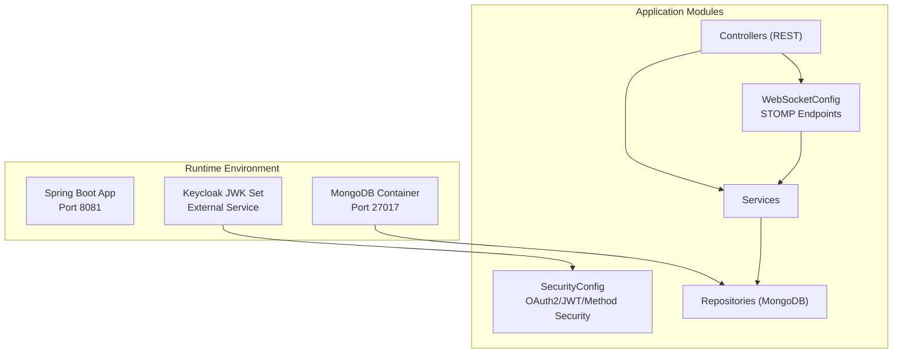
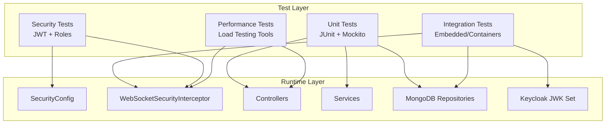
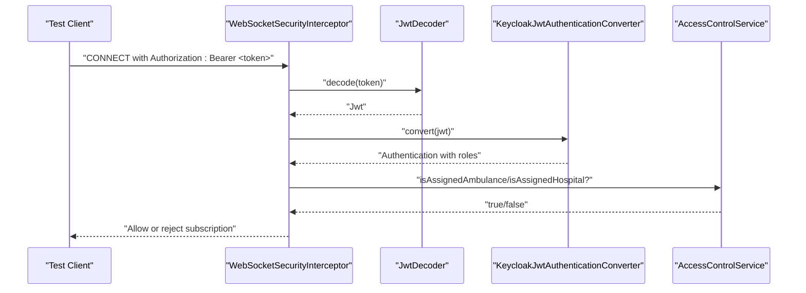
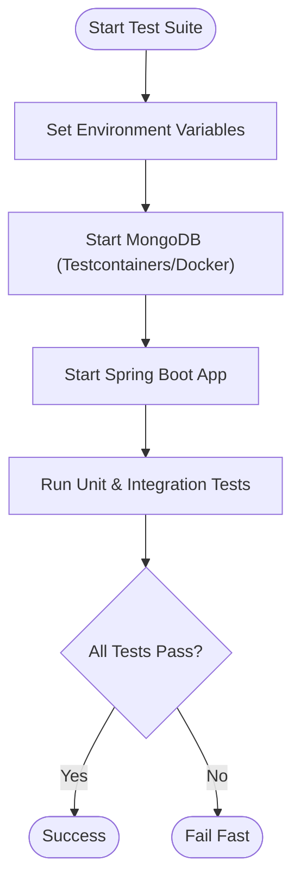
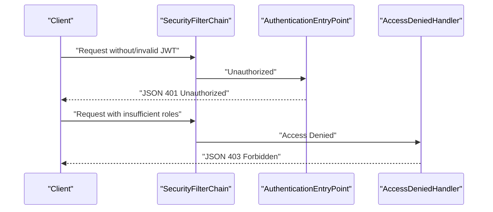
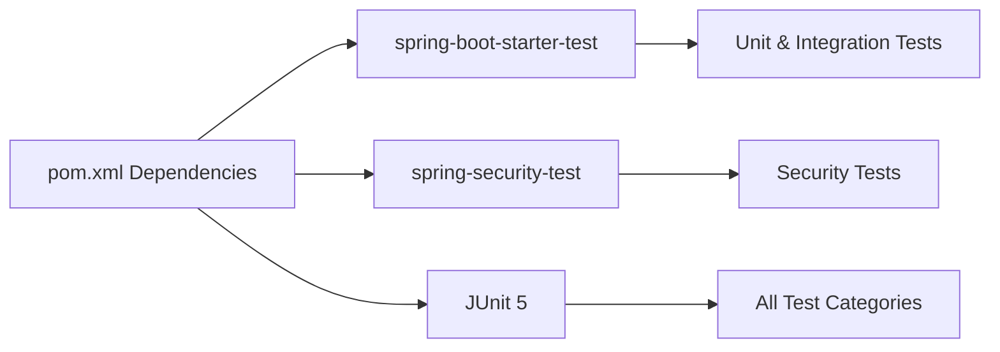

# Testing Strategy

<cite>
**Referenced Files in This Document**
- [EmsCommandCenterApplication.java](file://src/main/java/com/example/ems_command_center/EmsCommandCenterApplication.java)
- [pom.xml](file://pom.xml)
- [application.yml](file://src/main/resources/application.yml)
- [docker-compose.yml](file://docker-compose.yml)
- [Dockerfile](file://Dockerfile)
- [SecurityConfig.java](file://src/main/java/com/example/ems_command_center/config/SecurityConfig.java)
- [KeycloakJwtAuthenticationConverter.java](file://src/main/java/com/example/ems_command_center/config/KeycloakJwtAuthenticationConverter.java)
- [WebSocketConfig.java](file://src/main/java/com/example/ems_command_center/config/WebSocketConfig.java)
- [WebSocketSecurityInterceptor.java](file://src/main/java/com/example/ems_command_center/config/WebSocketSecurityInterceptor.java)
- [EmsCommandCenterApplicationTests.java](file://src/test/java/com/example/ems_command_center/EmsCommandCenterApplicationTests.java)
</cite>

## Table of Contents
1. [Introduction](#introduction)
2. [Project Structure](#project-structure)
3. [Core Components](#core-components)
4. [Architecture Overview](#architecture-overview)
5. [Detailed Component Analysis](#detailed-component-analysis)
6. [Dependency Analysis](#dependency-analysis)
7. [Performance Considerations](#performance-considerations)
8. [Troubleshooting Guide](#troubleshooting-guide)
9. [Conclusion](#conclusion)
10. [Appendices](#appendices)

## Introduction
This document defines a comprehensive testing strategy for the EMS Command Center application. It covers unit testing for controllers, services, and repositories using JUnit and Mockito, integration testing for database operations, WebSocket communication, and external API integrations (Keycloak), test data management, mock configuration for Keycloak and MongoDB, test environment setup, security testing patterns, performance and load testing considerations, and continuous integration pipeline recommendations. The goal is to ensure robust, secure, and maintainable code with high confidence in production readiness.

## Project Structure
The application is a Spring Boot microservice with:
- Web MVC and WebSocket support
- OAuth2 Resource Server with JWT validation against Keycloak
- MongoDB persistence
- OpenAPI/Swagger UI for API documentation
- Dockerized deployment with MongoDB and optional Mongo Express

Key runtime configuration is driven by environment variables and YAML profiles, enabling flexible test environments.

**Diagram sources**
- [docker-compose.yml:1-73](file://docker-compose.yml#L1-L73)
- [application.yml:1-36](file://src/main/resources/application.yml#L1-L36)
- [SecurityConfig.java:1-156](file://src/main/java/com/example/ems_command_center/config/SecurityConfig.java#L1-L156)
- [WebSocketConfig.java:1-51](file://src/main/java/com/example/ems_command_center/config/WebSocketConfig.java#L1-L51)

**Section sources**
- [EmsCommandCenterApplication.java:1-14](file://src/main/java/com/example/ems_command_center/EmsCommandCenterApplication.java#L1-L14)
- [pom.xml:1-103](file://pom.xml#L1-L103)
- [application.yml:1-36](file://src/main/resources/application.yml#L1-L36)
- [docker-compose.yml:1-73](file://docker-compose.yml#L1-L73)
- [Dockerfile:1-7](file://Dockerfile#L1-L7)

## Core Components
- Security layer: OAuth2 Resource Server with JWT validation, method-level security, CORS configuration, and JSON-formatted authentication/access-denied entries.
- WebSocket layer: STOMP endpoints with SockJS fallback and a WebSocketSecurityInterceptor validating JWT and enforcing access control per topic destinations.
- Controllers: REST endpoints under /api/* protected by role-based rules.
- Services: Business logic orchestrating repositories and external integrations.
- Repositories: MongoDB data access via Spring Data MongoDB.

Testing focus areas:
- Unit tests: Controllers (mock services), Services (mock repositories), Repositories (embedded or test containers).
- Integration tests: Database connectivity, WebSocket handshake and subscriptions, Keycloak JWK set retrieval and JWT decoding.
- Security tests: Authentication flows, authorization checks, role enforcement, and CORS behavior.
- Performance tests: Load testing REST endpoints and WebSocket channels.
- CI pipeline: Maven build, test execution, and containerized environment provisioning.

**Section sources**
- [SecurityConfig.java:44-98](file://src/main/java/com/example/ems_command_center/config/SecurityConfig.java#L44-L98)
- [WebSocketConfig.java:20-49](file://src/main/java/com/example/ems_command_center/config/WebSocketConfig.java#L20-L49)
- [WebSocketSecurityInterceptor.java:34-111](file://src/main/java/com/example/ems_command_center/config/WebSocketSecurityInterceptor.java#L34-L111)

## Architecture Overview
The testing architecture aligns with the runtime architecture, emphasizing layered isolation and controlled external dependencies.

**Diagram sources**
- [SecurityConfig.java:44-98](file://src/main/java/com/example/ems_command_center/config/SecurityConfig.java#L44-L98)
- [WebSocketSecurityInterceptor.java:34-111](file://src/main/java/com/example/ems_command_center/config/WebSocketSecurityInterceptor.java#L34-L111)
- [pom.xml:77-84](file://pom.xml#L77-L84)

## Detailed Component Analysis

### Unit Testing Strategy
- Controllers
  - Mock service collaborators and assert HTTP responses, status codes, and request validation.
  - Verify method-level security annotations trigger appropriate 401/403 responses when missing/invalid tokens.
  - Example pattern: [Controller test skeleton:1-14](file://src/test/java/com/example/ems_command_center/EmsCommandCenterApplicationTests.java#L1-L14) can be extended to specific controllers.
- Services
  - Mock repositories and external clients; assert business logic correctness and error propagation.
  - Validate input validation and exception handling paths.
- Repositories
  - Use embedded MongoDB or test containers for integration-like tests; assert CRUD operations and query projections.

Recommended libraries:
- JUnit 5 for test framework
- Mockito for mocking
- AssertJ for fluent assertions
- Testcontainers for MongoDB integration tests

**Section sources**
- [pom.xml:77-84](file://pom.xml#L77-L84)
- [EmsCommandCenterApplicationTests.java:1-14](file://src/test/java/com/example/ems_command_center/EmsCommandCenterApplicationTests.java#L1-L14)

### Integration Testing Strategy
- Database operations
  - Use Testcontainers for MongoDB to spin up a real database instance during tests.
  - Seed minimal test data and assert repository queries and aggregations.
- WebSocket communication
  - Use Spring’s WebSocket test support to simulate STOMP CONNECT and SUBSCRIBE messages.
  - Validate interceptor behavior for authentication and authorization per topic.
- External API integrations (Keycloak)
  - Mock Keycloak JWK set endpoint or use a lightweight local Keycloak instance for integration tests.
  - Validate JWT decoding and role extraction via KeycloakJwtAuthenticationConverter.

**Diagram sources**
- [WebSocketSecurityInterceptor.java:34-111](file://src/main/java/com/example/ems_command_center/config/WebSocketSecurityInterceptor.java#L34-L111)
- [KeycloakJwtAuthenticationConverter.java:29-41](file://src/main/java/com/example/ems_command_center/config/KeycloakJwtAuthenticationConverter.java#L29-L41)

**Section sources**
- [WebSocketConfig.java:20-49](file://src/main/java/com/example/ems_command_center/config/WebSocketConfig.java#L20-L49)
- [WebSocketSecurityInterceptor.java:34-111](file://src/main/java/com/example/ems_command_center/config/WebSocketSecurityInterceptor.java#L34-L111)
- [KeycloakJwtAuthenticationConverter.java:18-87](file://src/main/java/com/example/ems_command_center/config/KeycloakJwtAuthenticationConverter.java#L18-L87)

### Test Data Management and Mock Configuration
- Test data
  - Use Testcontainers MongoDB for deterministic data sets.
  - Alternatively, use @DirtiesContext or @Transactional cleanup strategies for test isolation.
- Keycloak mocks
  - Stub JWK set endpoint with a test RSA key set.
  - Configure JwtDecoder to use the stubbed JWK set URI.
- MongoDB mocks
  - For unit tests, mock repositories using Mockito.
  - For integration tests, use Testcontainers to provision a real MongoDB instance.

Environment overrides for tests:
- Override application.yml properties via test resources or JVM system properties.
- Example override keys: SPRING_DATA_MONGODB_URI, KEYCLOAK_JWK_SET_URI, KEYCLOAK_CLIENT_ID.

**Section sources**
- [application.yml:5-36](file://src/main/resources/application.yml#L5-L36)
- [docker-compose.yml:48-52](file://docker-compose.yml#L48-L52)

### Test Environment Setup
- Local development
  - Run MongoDB locally or via Docker Compose.
  - Start the application with default properties for local Keycloak and database URIs.
- CI/CD
  - Build the application JAR using Maven.
  - Spin up MongoDB and optionally Keycloak using Docker Compose.
  - Execute tests against the orchestrated environment.

**Diagram sources**
- [docker-compose.yml:1-73](file://docker-compose.yml#L1-L73)
- [Dockerfile:1-7](file://Dockerfile#L1-L7)

**Section sources**
- [docker-compose.yml:1-73](file://docker-compose.yml#L1-L73)
- [application.yml:1-36](file://src/main/resources/application.yml#L1-L36)

### Security Testing Patterns
- Authentication flows
  - Validate 401 Unauthorized responses for missing/invalid JWTs.
  - Validate JSON error bodies for authentication entry point and access denied handlers.
- Authorization checks
  - Role-based access control: ensure endpoints deny access to users without required roles.
  - WebSocket topic subscriptions: enforce role and assignment-based restrictions.
- CORS behavior
  - Validate allowed origins and credentials for WebSocket and REST endpoints.

**Diagram sources**
- [SecurityConfig.java:138-154](file://src/main/java/com/example/ems_command_center/config/SecurityConfig.java#L138-L154)

**Section sources**
- [SecurityConfig.java:44-98](file://src/main/java/com/example/ems_command_center/config/SecurityConfig.java#L44-L98)
- [SecurityConfig.java:138-154](file://src/main/java/com/example/ems_command_center/config/SecurityConfig.java#L138-L154)

### Performance Testing Considerations
- REST endpoints
  - Use tools like Gatling or JMeter to simulate concurrent users and measure latency/throughput.
  - Focus on high-traffic endpoints (analytics, incidents, dispatch).
- WebSocket channels
  - Measure publish/subscribe rates and connection churn under load.
  - Validate interceptor overhead and authorization checks do not bottleneck traffic.
- Database
  - Monitor query performance and index usage; ensure proper indexing for frequent filters.
- Infrastructure
  - Run performance tests against Docker Compose stacks to reflect production-like conditions.

[No sources needed since this section provides general guidance]

### Test Automation Approaches
- Unit tests
  - Run on every commit; keep fast and deterministic.
- Integration tests
  - Run in CI with Testcontainers; ensure MongoDB and Keycloak are available.
- Security tests
  - Include JWT validation and role-based access tests in the suite.
- Reporting
  - Publish test reports and coverage metrics to CI dashboards.

[No sources needed since this section provides general guidance]

## Dependency Analysis
Testing dependencies are declared in the Maven POM for Spring Boot Test, Spring Security Test, and JUnit 5. These enable comprehensive testing of Spring components, security, and web layers.

**Diagram sources**
- [pom.xml:77-84](file://pom.xml#L77-L84)

**Section sources**
- [pom.xml:22-84](file://pom.xml#L22-L84)

## Performance Considerations
- Keep unit tests fast; rely on mocking for heavy collaborators.
- Use lightweight test databases (Testcontainers) for integration tests.
- Profile JWT decoding and role conversion paths; cache decoded claims if appropriate.
- Monitor WebSocket channel throughput and interceptor performance.

[No sources needed since this section provides general guidance]

## Troubleshooting Guide
Common issues and resolutions:
- Missing or invalid JWT
  - Symptom: 401 Unauthorized JSON response.
  - Resolution: Ensure Authorization header is present and valid; verify Keycloak JWK set availability.
- Insufficient roles for endpoint/topic
  - Symptom: 403 Forbidden JSON response.
  - Resolution: Assign required roles in Keycloak; confirm role claim extraction.
- WebSocket subscription failures
  - Symptom: Subscription rejected with invalid argument errors.
  - Resolution: Verify JWT roles and assignment checks; ensure topic destination format matches expected patterns.

**Section sources**
- [SecurityConfig.java:138-154](file://src/main/java/com/example/ems_command_center/config/SecurityConfig.java#L138-L154)
- [WebSocketSecurityInterceptor.java:56-106](file://src/main/java/com/example/ems_command_center/config/WebSocketSecurityInterceptor.java#L56-L106)

## Conclusion
A robust testing strategy for the EMS Command Center should combine fast unit tests, reliable integration tests against real infrastructure, and comprehensive security validations. By leveraging Testcontainers, Mockito, and Spring Security Test, teams can ensure correctness, security, and performance. Continuous integration pipelines should automate test execution and environment provisioning to maintain quality across releases.

[No sources needed since this section summarizes without analyzing specific files]

## Appendices

### Test Coverage Requirements
- Target: >85% line coverage and >80% branch coverage for critical packages (controllers, services, security).
- Exceptions: Utility classes and DTOs may have lower thresholds; prioritize business logic and security-sensitive paths.

[No sources needed since this section provides general guidance]

### Continuous Integration Testing Pipelines
- Build and test stages
  - Build the application JAR.
  - Start MongoDB and Keycloak (if needed) via Docker Compose.
  - Execute unit and integration tests.
- Artifacts
  - Publish test reports and coverage metrics.
- Optional
  - Run performance tests in dedicated jobs with controlled concurrency.

[No sources needed since this section provides general guidance]